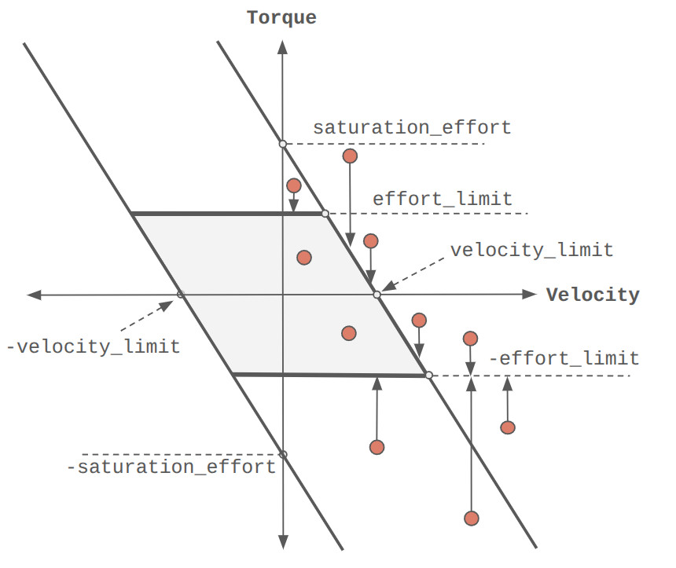

# isaaclab.actuators

다양한 액추에이터 모델을 위한 서브 패키지입니다.

액추에이터 모델은 관절의 동작을 시뮬레이션에서 모델링하는 데 사용됩니다.
이들은 주로 다양한 액추에이터 동역학과 지연을 모델링하기 위해 시뮬레이션에서 사용됩니다.

지원되는 액추에이터 모델에는 두 가지 주요 범주가 있습니다:

- **암시적**: 물리 엔진의 이상적인 PD 모터 모델입니다. 이는 연속 시간
  PD 컨트롤러와 유사합니다. 모터 모델은 사용자가 명시적으로 정의하지 않기 때문에 암시적입니다.
- **명시적**: 물리적 구동 모델을 기반으로 하는 모터 모델.
  - **물리 기반**: 1차 원리에서 모터 모델을 도출합니다.
  - **신경망 기반**: 액추에이터 데이터에서 학습된 모터 모델입니다.

모든 액추에이터 모델은 [`isaaclab.actuators.ActuatorBase`](#isaaclab.actuators.ActuatorBase) 클래스를 상속하며,
이 클래스는 모든 액추에이터 모델에 대한 공통 인터페이스를 정의합니다.
액추에이터 모델은 [`isaaclab.assets.Articulation`](isaaclab.assets.md#isaaclab.assets.Articulation) 클래스에서 처리하고 호출됩니다.

### 클래스

| [`ActuatorBase`](#isaaclab.actuators.ActuatorBase)                     | 관절 컬렉션에 대한 액추에이터 모델의 기본 클래스입니다.   |
|------------------------------------------------------------------------|-------------------------------------------------------------------------------------------|
| [`ActuatorBaseCfg`](#isaaclab.actuators.ActuatorBaseCfg)               | 관절의 기본 액추에이터에 대한 구성입니다.                                   |
| [`ImplicitActuator`](#isaaclab.actuators.ImplicitActuator)             | 시뮬레이션에서 처리되는 암시적 액추에이터 모델입니다.                                |
| [`ImplicitActuatorCfg`](#isaaclab.actuators.ImplicitActuatorCfg)       | 암시적 액추에이터에 대한 구성입니다.                                                   |
| [`IdealPDActuator`](#isaaclab.actuators.IdealPDActuator)               | 간단한 포화 모델이 있는 이상적인 토르크 제어 액추에이터 모델입니다.                    |
| [`IdealPDActuatorCfg`](#isaaclab.actuators.IdealPDActuatorCfg)         | 이상적인 PD 액추에이터에 대한 구성입니다.                                                   |
| [`DCMotor`](#isaaclab.actuators.DCMotor)                               | 속도 기반 포화 모델을 가진 직류(DC) 모터 액추에이터 모델입니다.            |
| [`DCMotorCfg`](#isaaclab.actuators.DCMotorCfg)                         | 직류(DC) 모터 액추에이터 모델에 대한 구성입니다.                               |
| [`DelayedPDActuator`](#isaaclab.actuators.DelayedPDActuator)           | 지연된 명령 적용이 있는 이상적인 PD 액추에이터입니다.                                       |
| [`DelayedPDActuatorCfg`](#isaaclab.actuators.DelayedPDActuatorCfg)     | 지연된 PD 액추에이터에 대한 구성입니다.                                                  |
| [`RemotizedPDActuator`](#isaaclab.actuators.RemotizedPDActuator)       | 각도 의존 토르크 한계가 있는 이상적인 PD 액추에이터입니다.                                     |
| [`RemotizedPDActuatorCfg`](#isaaclab.actuators.RemotizedPDActuatorCfg) | 원격화된 PD 액추에이터에 대한 구성입니다.                                                |
| [`ActuatorNetMLP`](#isaaclab.actuators.ActuatorNetMLP)                 | 다층 퍼셉트론과 관절 기록을 기반으로 한 액추에이터 모델입니다.                         |
| [`ActuatorNetMLPCfg`](#isaaclab.actuators.ActuatorNetMLPCfg)           | MLP 기반 액추에이터 모델에 대한 구성입니다.                                               |
| [`ActuatorNetLSTM`](#isaaclab.actuators.ActuatorNetLSTM)               | 순환 신경망(LSTM)을 기반으로 한 액추에이터 모델입니다.                                  |
| [`ActuatorNetLSTMCfg`](#isaaclab.actuators.ActuatorNetLSTMCfg)         | LSTM 기반 액추에이터 모델에 대한 구성입니다.                                              |

## 액추에이터 기본

### *class* isaaclab.actuators.ActuatorBase

관절 컬렉션에 대한 액추에이터 모델의 기본 클래스입니다.

액추에이터 모델은 관절에 외부 구동 동역학 모델을 추가하여 시뮬레이션된 관절을 보강합니다.
이 모델은 사용자가 제공한 관절 명령(위치, 속도 및 토르크)을 시뮬레이션된 관절에 적용되는 원하는 관절 위치, 속도 및 토르크로 변환하는 데 사용됩니다.

기본 클래스는 액추에이터 모델에 대한 인터페이스를 제공합니다. 액추에이터 매개변수를 구성에서 분석하여 버퍼로 저장하는 역할을 합니다.
또한 액추에이터 상태를 재설정하고 시뮬레이션을 위한 원하는 관절 명령을 계산하는 인터페이스를 제공합니다.

각 액추에이터 모델에 대해 해당 구성 클래스가 제공됩니다.
구성 클래스는 구성에서 액추에이터 매개변수를 분석하는 데 사용됩니다.
또한 액추에이터 모델이 적용되는 관절 이름을 지정합니다. 이러한 이름은 정규 표현식으로 지정할 수 있으며,
관절의 관절 이름과 매칭됩니다.

클래스 사용 방법을 보려면 [`isaaclab.assets.Articulation`](isaaclab.assets.md#isaaclab.assets.Articulation) 클래스를 참조하십시오.

**속성:**

| [`is_implicit_model`](#isaaclab.actuators.ActuatorBase.is_implicit_model)   | 액추에이터가 암시적 또는 명시적 액추에이터 모델인지 여부를 나타내는 플래그입니다.   |
|-----------------------------------------------------------------------------|------------------------------------------------------------------------------|
| [`effort_limit_sim`](#isaaclab.actuators.ActuatorBase.effort_limit_sim)     | 시뮬레이션에서 액추에이터 그룹의 토르크 한계입니다.                   |
| [`velocity_limit_sim`](#isaaclab.actuators.ActuatorBase.velocity_limit_sim) | 시뮬레이션에서 액추에이터 그룹의 속도 한계입니다.                 |
| [`stiffness`](#isaaclab.actuators.ActuatorBase.stiffness)                   | PD 컨트롤러의 강성(P 게인)입니다.                                 |
| [`damping`](#isaaclab.actuators.ActuatorBase.damping)                       | PD 컨트롤러의 감쇠(D 게인)입니다.                                   |
| [`armature`](#isaaclab.actuators.ActuatorBase.armature)                     | 액추에이터 관절의 암처어입니다.                                         |
| [`friction`](#isaaclab.actuators.ActuatorBase.friction)                     | 액추에이터 관절의 정적 마찰입니다.                            |
| [`dynamic_friction`](#isaaclab.actuators.ActuatorBase.dynamic_friction)     | 액추에이터 관절의 동적 마찰입니다.                           |
| [`viscous_friction`](#isaaclab.actuators.ActuatorBase.viscous_friction)     | 액추에이터 관절의 점성 마찰입니다.                             |
| [`velocity_limit`](#isaaclab.actuators.ActuatorBase.velocity_limit)         | 액추에이터 그룹의 속도 한계입니다.                                   |
| [`effort_limit`](#isaaclab.actuators.ActuatorBase.effort_limit)             | 액추에이터 그룹의 토르크 한계입니다.                                     |
| [`computed_effort`](#isaaclab.actuators.ActuatorBase.computed_effort)       | 액추에이터 그룹의 계산된 토르크입니다.                                  |
| [`applied_effort`](#isaaclab.actuators.ActuatorBase.applied_effort)         | 액추에이터 그룹에 적용된 토르크입니다.                                   |
| [`num_joints`](#isaaclab.actuators.ActuatorBase.num_joints)                 | 그룹의 액추에이터 수입니다.                                            |
| [`joint_names`](#isaaclab.actuators.ActuatorBase.joint_names)               | 그룹의 일부인 관절의 이름입니다.                       |
| [`joint_indices`](#isaaclab.actuators.ActuatorBase.joint_indices)           | 그룹의 일부인 관절의 인덱스입니다.                     |

**메서드:**

| [`__init__`](#isaaclab.actuators.ActuatorBase.__init__)(cfg, joint_names, joint_ids, ...[, ...])   | 액추에이터를 초기화합니다.                                                 |
|----------------------------------------------------------------------------------------------------|--------------------------------------------------------------------------|
| [`reset`](#isaaclab.actuators.ActuatorBase.reset)(env_ids)                                         | 그룹 내부의 상태를 재설정합니다.                                    |
| [`compute`](#isaaclab.actuators.ActuatorBase.compute)(control_action, joint_pos, joint_vel)        | 액추에이터 그룹의 행동을 처리하고 관절 행동을 계산합니다. |

#### is_implicit_model *: [ClassVar](https://docs.python.org/3/library/typing.html#typing.ClassVar)[[bool](https://docs.python.org/3/library/functions.html#bool)]* *= False*

액추에이터가 암시적 또는 명시적 액추에이터 모델인지 여부를 나타내는 플래그입니다.

[`ImplicitActuator`](#isaaclab.actuators.ImplicitActuator)를 상속하는 클래스는 이 플래그를 [`True`](https://docs.python.org/3/library/constants.html#True)로 설정해야 합니다.

#### effort_limit_sim *: [torch.Tensor](https://docs.pytorch.org/docs/stable/tensors.html#torch.Tensor)*

시뮬레이션에서 액추에이터 그룹의 토르크 한계입니다. 형태는 (num_envs, num_joints).

암시적 액추에이터의 경우, [`effort_limit`](#isaaclab.actuators.ActuatorBase.effort_limit)와 [`effort_limit_sim`](#isaaclab.actuators.ActuatorBase.effort_limit_sim)는 동일합니다.

- **명시적 액추에이터**: 일반적으로 액추에이터 모델이 [`effort_limit`](#isaaclab.actuators.ActuatorBase.effort_limit)를 사용하여 토르크를 이미 클리핑하기 때문에,
  이중 클리핑을 방지하기 위해 큰 값(1.0e9)으로 설정됩니다.
- **암시적 액추에이터**: [`effort_limit`](#isaaclab.actuators.ActuatorBase.effort_limit)와 동일합니다(두 값은 동기화됩니다).

#### velocity_limit_sim *: [torch.Tensor](https://docs.pytorch.org/docs/stable/tensors.html#torch.Tensor)*

시뮬레이션에서 액추에이터 그룹의 속도 한계입니다. 형태는 (num_envs, num_joints).

암시적 액추에이터의 경우, [`velocity_limit`](#isaaclab.actuators.ActuatorBase.velocity_limit)와 [`velocity_limit_sim`](#isaaclab.actuators.ActuatorBase.velocity_limit_sim)는 동일합니다.

#### stiffness *: [torch.Tensor](https://docs.pytorch.org/docs/stable/tensors.html#torch.Tensor)*

PD 컨트롤러의 강성(P 이득). 크기는 (num_envs, num_joints)입니다.

#### damping *: [torch.Tensor](https://docs.pytorch.org/docs/stable/tensors.html#torch.Tensor)*

PD 컨트롤러의 감쇠(D 이득). 크기는 (num_envs, num_joints)입니다.

#### armature *: [torch.Tensor](https://docs.pytorch.org/docs/stable/tensors.html#torch.Tensor)*

액추에이터 관절의 관성 모멘트. 크기는 (num_envs, num_joints)입니다.

#### friction *: [torch.Tensor](https://docs.pytorch.org/docs/stable/tensors.html#torch.Tensor)*

액추에이터 관절의 정적 마찰. 크기는 (num_envs, num_joints)입니다.

#### dynamic_friction *: [torch.Tensor](https://docs.pytorch.org/docs/stable/tensors.html#torch.Tensor)*

액추에이터 관절의 동적 마찰. 크기는 (num_envs, num_joints)입니다.

#### viscous_friction *: [torch.Tensor](https://docs.pytorch.org/docs/stable/tensors.html#torch.Tensor)*

액추에이터 관절의 점성 마찰. 크기는 (num_envs, num_joints)입니다.

#### \_\_init_\_(cfg: [ActuatorBaseCfg](#isaaclab.actuators.ActuatorBaseCfg), joint_names: [list](https://docs.python.org/3/library/stdtypes.html#list)[[str](https://docs.python.org/3/library/stdtypes.html#str)], joint_ids: [slice](https://docs.python.org/3/library/functions.html#slice) | [torch.Tensor](https://docs.pytorch.org/docs/stable/tensors.html#torch.Tensor), num_envs: [int](https://docs.python.org/3/library/functions.html#int), device: [str](https://docs.python.org/3/library/stdtypes.html#str), stiffness: [torch.Tensor](https://docs.pytorch.org/docs/stable/tensors.html#torch.Tensor) | [float](https://docs.python.org/3/library/functions.html#float) = 0.0, damping: [torch.Tensor](https://docs.pytorch.org/docs/stable/tensors.html#torch.Tensor) | [float](https://docs.python.org/3/library/functions.html#float) = 0.0, armature: [torch.Tensor](https://docs.pytorch.org/docs/stable/tensors.html#torch.Tensor) | [float](https://docs.python.org/3/library/functions.html#float) = 0.0, friction: [torch.Tensor](https://docs.pytorch.org/docs/stable/tensors.html#torch.Tensor) | [float](https://docs.python.org/3/library/functions.html#float) = 0.0, dynamic_friction: [torch.Tensor](https://docs.pytorch.org/docs/stable/tensors.html#torch.Tensor) | [float](https://docs.python.org/3/library/functions.html#float) = 0.0, viscous_friction: [torch.Tensor](https://docs.pytorch.org/docs/stable/tensors.html#torch.Tensor) | [float](https://docs.python.org/3/library/functions.html#float) = 0.0, effort_limit: [torch.Tensor](https://docs.pytorch.org/docs/stable/tensors.html#torch.Tensor) | [float](https://docs.python.org/3/library/functions.html#float) = torch.inf, velocity_limit: [torch.Tensor](https://docs.pytorch.org/docs/stable/tensors.html#torch.Tensor) | [float](https://docs.python.org/3/library/functions.html#float) = torch.inf)

액추에이터를 초기화합니다.

액추에이터 매개변수는 구성에서 파싱되어 버퍼로 저장됩니다. 구성에서 매개변수가 지정되지 않은 경우, 생성자에서 제공된 값이 사용됩니다.

#### NOTE
생성자에서의 값은 보통 액추에이터 모델의 관절에 해당하는 PhysX API 호출을 통해 전달된 USD 값에서 얻어지며, 이러한 값은 cfg에서 매개변수가 지정되지 않은 경우의 기본값으로 사용됩니다.

* **매개변수:**
  * **cfg** – 액추에이터 모델의 구성.
  * **joint_names** – 어티큘레이션의 관절 이름.
  * **joint_ids** – 어티큘레이션의 관절 인덱스. `slice(None)`인 경우, 어티큘레이션의 모든 관절이 그룹에 포함됩니다.
  * **num_envs** – 뷰의 어티큘레이션 수.
  * **device** – 처리에 사용되는 디바이스.
  * **stiffness** – 기본 관절 강성(P 이득). 기본값은 0.0입니다.
    텐서인 경우, 크기는 (num_envs, num_joints)입니다.
  * **damping** – 기본 관절 감쇠(D 이득). 기본값은 0.0입니다.
    텐서인 경우, 크기는 (num_envs, num_joints)입니다.
  * **armature** – 기본 관절 관성 모멘트. 기본값은 0.0입니다.
    텐서인 경우, 크기는 (num_envs, num_joints)입니다.
  * **friction** – 기본 관절 정적 마찰. 기본값은 0.0입니다.
    텐서인 경우, 크기는 (num_envs, num_joints)입니다.
  * **dynamic_friction** – 기본 관절 동적 마찰. 기본값은 0.0입니다.
    텐서인 경우, 크기는 (num_envs, num_joints)입니다.
  * **viscous_friction** – 기본 관절 점성 마찰. 기본값은 0.0입니다.
    텐서인 경우, 크기는 (num_envs, num_joints)입니다.
  * **effort_limit** – 기본 힘 제한. 기본값은 무한대입니다.
    텐서인 경우, 크기는 (num_envs, num_joints)입니다.
  * **velocity_limit** – 기본 속도 제한. 기본값은 무한대입니다.
    텐서인 경우, 크기는 (num_envs, num_joints)입니다.

#### velocity_limit *: [torch.Tensor](https://docs.pytorch.org/docs/stable/tensors.html#torch.Tensor)*

액추에이터 그룹의 속도 제한. 크기는 (num_envs, num_joints)입니다.

암시적 액추에이터의 경우, [`velocity_limit`](#isaaclab.actuators.ActuatorBase.velocity_limit)와 [`velocity_limit_sim`](#isaaclab.actuators.ActuatorBase.velocity_limit_sim)는 동일합니다.

#### effort_limit *: [torch.Tensor](https://docs.pytorch.org/docs/stable/tensors.html#torch.Tensor)*

액추에이터 그룹의 힘 제한. 크기는 (num_envs, num_joints)입니다.

이 제한은 액추에이터 유형에 따라 다르게 사용됩니다:

- **명시적 액추에이터**: 액추에이터 모델 내부에서 토크 클리핑에 사용됨 (예: DC 모터 모델의 모터 토크 제한).
- **암시적 액추에이터**: [`effort_limit_sim`](#isaaclab.actuators.ActuatorBase.effort_limit_sim)과 동일 (일관성을 위해 별칭).

#### computed_effort *: [torch.Tensor](https://docs.pytorch.org/docs/stable/tensors.html#torch.Tensor)*

액추에이터 그룹의 계산된 힘. 크기는 (num_envs, num_joints)입니다.

#### applied_effort *: [torch.Tensor](https://docs.pytorch.org/docs/stable/tensors.html#torch.Tensor)*

액추에이터 그룹에 적용된 힘. 크기는 (num_envs, num_joints)입니다.

이는 [`computed_effort`](#isaaclab.actuators.ActuatorBase.computed_effort)를 액추에이터 특성에 따라 클리핑한 후 얻은 힘입니다.

#### *property* num_joints *: [int](https://docs.python.org/3/library/functions.html#int)*

그룹 내 액추에이터의 수.

#### *property* joint_names *: [list](https://docs.python.org/3/library/stdtypes.html#list)[[str](https://docs.python.org/3/library/stdtypes.html#str)]*

그룹에 속하는 어티큘레이션의 관절 이름.

#### *property* joint_indices *: [slice](https://docs.python.org/3/library/functions.html#slice) | [torch.Tensor](https://docs.pytorch.org/docs/stable/tensors.html#torch.Tensor)*

그룹에 속하는 어티큘레이션의 관절 인덱스.

#### NOTE
`slice(None)`이 반환되는 경우, 그룹은 어티큘레이션의 모든 관절을 포함합니다.
성능상의 이유로 불필요한 관절 인덱싱을 피하기 위해 이렇게 합니다.

#### *abstract* reset(env_ids: [Sequence](https://trimesh.org/trimesh.typed.html#trimesh.typed.Sequence)[[int](https://docs.python.org/3/library/functions.html#int)])

그룹 내부를 재설정합니다.

* **매개변수:**
  **env_ids** – 재설정할 환경 ID 목록.

#### *abstract* compute(control_action: [ArticulationActions](isaaclab.utils.md#isaaclab.utils.types.ArticulationActions), joint_pos: [torch.Tensor](https://docs.pytorch.org/docs/stable/tensors.html#torch.Tensor), joint_vel: [torch.Tensor](https://docs.pytorch.org/docs/stable/tensors.html#torch.Tensor)) → [ArticulationActions](isaaclab.utils.md#isaaclab.utils.types.ArticulationActions)

액추에이터 그룹 동작을 처리하고 어티큘레이션 동작을 계산합니다.

액추에이터 모델 유형에 따라 어티큘레이션 동작을 계산합니다.

* **매개변수:**
  * **control_action** – 원하는 관절 위치, 관절 속도 및 (피드-포워드) 관절 힘으로 구성된 관절 동작 인스턴스.
  * **joint_pos** – 그룹 내 관절의 현재 위치. 크기는 (num_envs, num_joints)입니다.
  * **joint_vel** – 그룹 내 관절의 현재 속도. 크기는 (num_envs, num_joints)입니다.
* **반환값:**
  계산된 원하는 관절 위치, 관절 속도 및 관절 힘.

### *class* isaaclab.actuators.ActuatorBaseCfg

어티큘레이션의 기본 액추에이터에 대한 구성.

**속성:**

| [`joint_names_expr`](#isaaclab.actuators.ActuatorBaseCfg.joint_names_expr)     | 그룹에 속하는 어티큘레이션의 관절 이름.                              |
|--------------------------------------------------------------------------------|-------------------------------------------------------------------------------------|
| [`effort_limit`](#isaaclab.actuators.ActuatorBaseCfg.effort_limit)             | 그룹 내 관절의 힘/토크 제한.                                      |
| [`velocity_limit`](#isaaclab.actuators.ActuatorBaseCfg.velocity_limit)         | 그룹 내 관절의 속도 제한.                                          |
| [`effort_limit_sim`](#isaaclab.actuators.ActuatorBaseCfg.effort_limit_sim)     | 그룹 내 관절의 힘 제한(시뮬레이션 물리 솔버에 적용됨).   |
| [`velocity_limit_sim`](#isaaclab.actuators.ActuatorBaseCfg.velocity_limit_sim) | 그룹 내 관절의 속도 제한(시뮬레이션 물리 솔버에 적용됨). |
| [`stiffness`](#isaaclab.actuators.ActuatorBaseCfg.stiffness)                   | 그룹 내 관절의 강성 이득(P 이득으로도 알려짐).                  |
| [`damping`](#isaaclab.actuators.ActuatorBaseCfg.damping)                       | 그룹 내 관절의 감쇠 이득(D 이득으로도 알려짐).                    |
| [`armature`](#isaaclab.actuators.ActuatorBaseCfg.armature)                     | 그룹의 조인트 아르마처입니다.                                                |
| [`friction`](#isaaclab.actuators.ActuatorBaseCfg.friction)                     | 그룹의 조인트 정적 마찰 계수입니다.                         |
| [`dynamic_friction`](#isaaclab.actuators.ActuatorBaseCfg.dynamic_friction)     | 그룹의 조인트 동적 마찰 계수입니다.                        |
| [`viscous_friction`](#isaaclab.actuators.ActuatorBaseCfg.viscous_friction)     | 그룹의 조인트 점성 마찰 계수입니다.                        |

#### joint_names_expr *: [list](https://docs.python.org/3/library/stdtypes.html#list)[[str](https://docs.python.org/3/library/stdtypes.html#str)]*

그룹에 속한 관절의 이름을 포함한 어티큘레이션의 조인트 이름입니다.

#### NOTE
이것은 조인트 이름 목록이나 정규 표현식 목록(예: “.\*”)일 수 있습니다.

#### effort_limit *: [dict](https://docs.python.org/3/library/stdtypes.html#dict)[[str](https://docs.python.org/3/library/stdtypes.html#str), [float](https://docs.python.org/3/library/functions.html#float)] | [float](https://docs.python.org/3/library/functions.html#float) | [None](https://docs.python.org/3/library/constants.html#None)*

그룹의 조인트에 대한 힘/토크 제한입니다. 기본값은 None입니다.

이 제한은 시뮬레이션으로 전송되는 계산된 토크를 자르는 데 사용됩니다. None인 경우, USD 조인트 프리미에 지정된 값으로 제한이 설정됩니다.

#### ATTENTION
[`effort_limit_sim`](#isaaclab.actuators.ActuatorBaseCfg.effort_limit_sim) 속성은 시뮬레이션 물리 솔버에 대한 힘 제한을 설정하는 데 사용해야 합니다.

[`effort_limit`](#isaaclab.actuators.ActuatorBaseCfg.effort_limit) 속성은 명시적 액추에이터의 경우에만 액추에이터 모델의 힘 출력을 자르는 데 사용되며, 예를 들어 [`IdealPDActuator`](#isaaclab.actuators.IdealPDActuator)와 같은 경우입니다.

#### NOTE
암시적 액추에이터의 경우, [`effort_limit`](#isaaclab.actuators.ActuatorBaseCfg.effort_limit) 및 [`effort_limit_sim`](#isaaclab.actuators.ActuatorBaseCfg.effort_limit_sim) 속성은 동일합니다. 그러나 직관적이므로 [`effort_limit_sim`](#isaaclab.actuators.ActuatorBaseCfg.effort_limit_sim) 속성을 사용하는 것이 좋습니다.

#### velocity_limit *: [dict](https://docs.python.org/3/library/stdtypes.html#dict)[[str](https://docs.python.org/3/library/stdtypes.html#str), [float](https://docs.python.org/3/library/functions.html#float)] | [float](https://docs.python.org/3/library/functions.html#float) | [None](https://docs.python.org/3/library/constants.html#None)*

그룹의 조인트에 대한 속도 제한입니다. 기본값은 None입니다.

이 제한은 액추에이터 모델에서 사용됩니다. None인 경우, USD 조인트 프리미에 지정된 값으로 제한이 설정됩니다.

#### ATTENTION
[`velocity_limit_sim`](#isaaclab.actuators.ActuatorBaseCfg.velocity_limit_sim) 속성은 시뮬레이션 물리 솔버에 대한 속도 제한을 설정하는 데 사용해야 합니다.

[`velocity_limit`](#isaaclab.actuators.ActuatorBaseCfg.velocity_limit) 속성은 명시적 액추에이터의 경우에만 액추에이터 모델의 힘 출력을 자르는 데 사용되며, 예를 들어 [`IdealPDActuator`](#isaaclab.actuators.IdealPDActuator)와 같은 경우입니다.

#### NOTE
암시적 액추에이터의 경우, [`velocity_limit`](#isaaclab.actuators.ActuatorBaseCfg.velocity_limit) 속성은 사용되지 않습니다. 이는 이전 버전의 Isaac Lab과의 하위 호환성을 유지하기 위한 것으로, PhysX가 PhysX Tensor API를 사용하여 조인트의 속도 제한을 설정하지 못했기 때문에 이 파라미터가 사용되지 않았습니다.

#### effort_limit_sim *: [dict](https://docs.python.org/3/library/stdtypes.html#dict)[[str](https://docs.python.org/3/library/stdtypes.html#str), [float](https://docs.python.org/3/library/functions.html#float)] | [float](https://docs.python.org/3/library/functions.html#float) | [None](https://docs.python.org/3/library/constants.html#None)*

그룹의 조인트에 적용되는 시뮬레이션 물리 솔버를 위한 힘 제한입니다. 기본값은 None입니다.

힘 제한은 물리 엔진에서 계산된 조인트 힘을 제한하는 데 사용됩니다. 계산된 힘이 이 제한을 초과하면, 물리 엔진은 힘을 이 값으로 자릅니다.

명시적 액추에이터(예: DC 모터)의 경우, 액추에이터 모델에서 힘을 계산하고 자르기 때문에, 물리 엔진에서 추가적인 자르기를 방지하기 위해 이 제한은 기본적으로 큰 값으로 설정됩니다. 그러나 때때로 안전 조치를 위해 이 제한을 더 작은 값으로 설정해야 할 수도 있습니다.

None인 경우, 액추에이터 모델 유형에 따라 제한이 결정됩니다:

* 암시적 액추에이터의 경우, 제한은 USD 조인트 프리미에 지정된 값으로 설정됩니다.
* 명시적 액추에이터의 경우, 제한은 1.0e9로 설정됩니다.

#### velocity_limit_sim *: [dict](https://docs.python.org/3/library/stdtypes.html#dict)[[str](https://docs.python.org/3/library/stdtypes.html#str), [float](https://docs.python.org/3/library/functions.html#float)] | [float](https://docs.python.org/3/library/functions.html#float) | [None](https://docs.python.org/3/library/constants.html#None)*

그룹의 조인트에 적용되는 시뮬레이션 물리 솔버를 위한 속도 제한입니다. 기본값은 None입니다.

속도 제한은 물리 엔진에서 조인트 속도를 제한하는 데 사용됩니다. 조인트가 이 속도 제한에 도달하려면 조인트의 힘 제한이 충분히 커야 합니다. 조인트가 이 속도보다 빠르게 이동하면, 물리 엔진은 조인트를 브레이크하여 이 속도로 도달하려고 시도합니다.

None인 경우, 암시적 및 명시적 액추에이터 모두에 대해 USD 조인트 프리미에 지정된 값으로 제한이 설정됩니다.

#### stiffness *: [dict](https://docs.python.org/3/library/stdtypes.html#dict)[[str](https://docs.python.org/3/library/stdtypes.html#str), [float](https://docs.python.org/3/library/functions.html#float)] | [float](https://docs.python.org/3/library/functions.html#float) | [None](https://docs.python.org/3/library/constants.html#None)*

그룹의 조인트에 대한 강성 게인(또는 p-gain)입니다.

강성의 동작은 암시적 및 명시적 액추에이터에서 다릅니다. 암시적 액추에이터의 경우, 강성이 물리 엔진에 직접 설정됩니다. 명시적 액추에이터의 경우, 강성은 액추에이터 모델에서 조인트 힘을 계산하는 데 사용됩니다.

None인 경우, 강성은 USD 조인트 프리미의 값으로 설정됩니다.

#### damping *: [dict](https://docs.python.org/3/library/stdtypes.html#dict)[[str](https://docs.python.org/3/library/stdtypes.html#str), [float](https://docs.python.org/3/library/functions.html#float)] | [float](https://docs.python.org/3/library/functions.html#float) | [None](https://docs.python.org/3/library/constants.html#None)*

그룹의 조인트에 대한 감쇠 게인(또는 d-gain)입니다.

감쇠의 동작은 암시적 및 명시적 액추에이터에서 다릅니다. 암시적 액추에이터의 경우, 감쇠가 물리 엔진에 직접 설정됩니다. 명시적 액추에이터의 경우, 감쇠 게인은 액추에이터 모델에서 조인트 힘을 계산하는 데 사용됩니다.

None인 경우, 감쇠는 USD 조인트 프리미의 값으로 설정됩니다.

#### armature *: [dict](https://docs.python.org/3/library/stdtypes.html#dict)[[str](https://docs.python.org/3/library/stdtypes.html#str), [float](https://docs.python.org/3/library/functions.html#float)] | [float](https://docs.python.org/3/library/functions.html#float) | [None](https://docs.python.org/3/library/constants.html#None)*

그룹의 조인트에 대한 아르마처입니다. 기본값은 None입니다.

아마추어는 해당 조인트-공간 관성에 직접 추가됩니다. 이는 관절 속도를 줄여 시뮬레이션 안정성을 향상시키는 데 도움이 됩니다.

이는 물리 엔진 솔버 파라미터이며 시뮬레이션에 설정됩니다.

None인 경우, 아르마처는 USD 조인트 프리미의 값으로 설정됩니다.

#### friction *: [dict](https://docs.python.org/3/library/stdtypes.html#dict)[[str](https://docs.python.org/3/library/stdtypes.html#str), [float](https://docs.python.org/3/library/functions.html#float)] | [float](https://docs.python.org/3/library/functions.html#float) | [None](https://docs.python.org/3/library/constants.html#None)*

그룹의 조인트에 대한 정적 마찰 계수입니다. 기본값은 None입니다.

조인트의 정적 마찰은 무차원량입니다. 이는 부모 본체에서 자식 본체로 전달되는 공간 힘의 크기와 솔버가 저항하기 위해 적용할 수 있는 최대 정적 마찰 힘 사이의 관계를 나타냅니다.

수학적으로 이는 $F_{resist} \leq \mu F_{spatial}$를 의미하며, 여기서 $F_{resist}$는 솔버가 적용하는 저항력이고, $F_{spatial}$는 부모 본체에서 자식 본체로 전달되는 공간 힘입니다. 따라서 시뮬레이션된 정적 마찰 효과는 정적 및 쿨롱 정적 마찰과 유사합니다.

None인 경우, 조인트의 정적 마찰은 USD 조인트 프리미의 값으로 설정됩니다.

참고: Isaac Sim 4.5에서는 이 파라미터가 계수로 모델링됩니다. Isaac Sim 5.0 이상에서는 이 파라미터가 힘(토크 또는 힘)으로 모델링됩니다.

#### dynamic_friction *: [dict](https://docs.python.org/3/library/stdtypes.html#dict)[[str](https://docs.python.org/3/library/stdtypes.html#str), [float](https://docs.python.org/3/library/functions.html#float)] | [float](https://docs.python.org/3/library/functions.html#float) | [None](https://docs.python.org/3/library/constants.html#None)*

그룹의 조인트에 대한 동적 마찰 계수입니다. 기본값은 None입니다.

참고: Isaac Sim 4.5에서는 이 파라미터가 계수로 모델링됩니다. Isaac Sim 5.0 이상에서는 이 파라미터가 힘(토크 또는 힘)으로 모델링됩니다.

#### viscous_friction *: [dict](https://docs.python.org/3/library/stdtypes.html#dict)[[str](https://docs.python.org/3/library/stdtypes.html#str), [float](https://docs.python.org/3/library/functions.html#float)] | [float](https://docs.python.org/3/library/functions.html#float) | [None](https://docs.python.org/3/library/constants.html#None)*

그룹의 조인트에 대한 점성 마찰 계수입니다. 기본값은 None입니다.

## 암시적 액추에이터

### *class* isaaclab.actuators.ImplicitActuator

Bases: [`ActuatorBase`](#isaaclab.actuators.ActuatorBase)

시뮬레이션에서 처리되는 암시적 액추에이터 모델입니다.

이 클래스는 [`IdealPDActuator`](#isaaclab.actuators.IdealPDActuator) 클래스와 유사한 기능을 수행합니다. 그러나 PD 제어가 시뮬레이션에서 암시적으로 처리되어 PD 제어 법칙의 연속시간 적분을 수행합니다. 이는 일반적으로 시뮬레이션 타임스텝이 큰 경우 [`IdealPDActuator`](#isaaclab.actuators.IdealPDActuator)에서 사용되는 명시적 PD 제어 법칙보다 더 정확합니다.

관절 클래스는 암시적 액추에이터 구성에서 강성 및 감쇠 매개변수를 시뮬레이션에 설정합니다. 따라서 이 클래스는 시뮬레이션에 적용해야 하는 관절 작용에 대한 자체 계산은 수행하지 않습니다. 그러나 PhysX에서 이 양을 명시적으로 노출하지 않으므로 액추에이팅된 관절의 대략적인 토크를 계산합니다.

**Attributes:**

| [`cfg`](#isaaclab.actuators.ImplicitActuator.cfg)                               | 액추에이터 모델의 구성입니다.                                  |
|---------------------------------------------------------------------------------|---------------------------------------------------------------|
| [`is_implicit_model`](#isaaclab.actuators.ImplicitActuator.is_implicit_model)   | 액추에이터가 암시적 모델인지 명시적 모델인지 나타내는 플래그입니다. |
| [`joint_indices`](#isaaclab.actuators.ImplicitActuator.joint_indices)           | 그룹에 속한 관절의 관절 인덱스입니다.                         |
| [`joint_names`](#isaaclab.actuators.ImplicitActuator.joint_names)               | 그룹에 속한 관절의 관절 이름입니다.                           |
| [`num_joints`](#isaaclab.actuators.ImplicitActuator.num_joints)                 | 그룹의 액추에이터 수입니다.                                   |
| [`computed_effort`](#isaaclab.actuators.ImplicitActuator.computed_effort)       | 액추에이터 그룹의 계산된 노력입니다.                           |
| [`applied_effort`](#isaaclab.actuators.ImplicitActuator.applied_effort)         | 액추에이터 그룹의 적용된 노력입니다.                           |
| [`effort_limit`](#isaaclab.actuators.ImplicitActuator.effort_limit)             | 액추에이터 그룹의 노력 한계입니다.                             |
| [`effort_limit_sim`](#isaaclab.actuators.ImplicitActuator.effort_limit_sim)     | 시뮬레이션에서의 액추에이터 그룹의 노력 한계입니다.             |
| [`velocity_limit`](#isaaclab.actuators.ImplicitActuator.velocity_limit)         | 액추에이터 그룹의 속도 한계입니다.                            |
| [`velocity_limit_sim`](#isaaclab.actuators.ImplicitActuator.velocity_limit_sim) | 시뮬레이션에서의 액추에이터 그룹의 속도 한계입니다.             |
| [`stiffness`](#isaaclab.actuators.ImplicitActuator.stiffness)                   | PD 컨트롤러의 강성(P 게인)입니다.                             |
| [`damping`](#isaaclab.actuators.ImplicitActuator.damping)                       | PD 컨트롤러의 감쇠(D 게인)입니다.                             |
| [`armature`](#isaaclab.actuators.ImplicitActuator.armature)                     | 액추에이터 관절의 관성 모멘트입니다.                          |
| [`friction`](#isaaclab.actuators.ImplicitActuator.friction)                     | 액추에이터 관절의 정적 마찰입니다.                            |
| [`dynamic_friction`](#isaaclab.actuators.ImplicitActuator.dynamic_friction)     | 액추에이터 관절의 동적 마찰입니다.                            |
| [`viscous_friction`](#isaaclab.actuators.ImplicitActuator.viscous_friction)     | 액추에이터 관절의 점성 마찰입니다.                            |

**Methods:**

| [`__init__`](#isaaclab.actuators.ImplicitActuator.__init__)(cfg, \*args, \*\*kwargs)            | 액추에이터를 초기화합니다.                                                 |
|-------------------------------------------------------------------------------------------------|--------------------------------------------------------------------------|
| [`reset`](#isaaclab.actuators.ImplicitActuator.reset)(\*args, \*\*kwargs)                       | 그룹 내부의 상태를 재설정합니다.                                    |
| [`compute`](#isaaclab.actuators.ImplicitActuator.compute)(control_action, joint_pos, joint_vel) | 액추에이터 그룹의 행동을 처리하고 관절 동작을 계산합니다. |

#### cfg *: [ImplicitActuatorCfg](#isaaclab.actuators.ImplicitActuatorCfg)*

액추에이터 모델의 구성입니다.

#### \_\_init_\_(cfg: [ImplicitActuatorCfg](#isaaclab.actuators.ImplicitActuatorCfg), \*args, \*\*kwargs)

액추에이터를 초기화합니다.

액추에이터 매개변수는 구성에서 파싱되어 버퍼에 저장됩니다. 구성에 매개변수가 지정되지 않은 경우, 생성자에 제공된 값이 사용됩니다.

#### NOTE
생성자의 값은 일반적으로 해당 액추에이터 모델의 관절에 대한 PhysX API 호출을 통해 전달된 USD 값에서 얻어집니다. 구성에 매개변수가 지정되지 않은 경우 이 값들은 기본값으로 사용됩니다.

* **Parameters:**
  * **cfg** – 액추에이터 모델의 구성입니다.
  * **joint_names** – 관절의 이름입니다.
  * **joint_ids** – 관절의 인덱스입니다. `slice(None)`인 경우, 관절 관절 모두 그룹의 일부입니다.
  * **num_envs** – 뷰의 관절 개수입니다.
  * **device** – 처리에 사용되는 장치입니다.
  * **stiffness** – 관절의 기본 강성(P 게인)입니다. 기본값은 0.0입니다.
    텐서인 경우, 형태는 (num_envs, num_joints)입니다.
  * **damping** – 관절의 기본 감쇠(D 게인)입니다. 기본값은 0.0입니다.
    텐서인 경우, 형태는 (num_envs, num_joints)입니다.
  * **armature** – 관절의 기본 관성 모멘트입니다. 기본값은 0.0입니다.
    텐서인 경우, 형태는 (num_envs, num_joints)입니다.
  * **friction** – 관절의 기본 정적 마찰입니다. 기본값은 0.0입니다.
    텐서인 경우, 형태는 (num_envs, num_joints)입니다.
  * **dynamic_friction** – 관절의 기본 동적 마찰입니다. 기본값은 0.0입니다.
    텐서인 경우, 형태는 (num_envs, num_joints)입니다.
  * **viscous_friction** – 관절의 기본 점성 마찰입니다. 기본값은 0.0입니다.
    텐서인 경우, 형태는 (num_envs, num_joints)입니다.
  * **effort_limit** – 관절의 기본 노력 한계입니다. 기본값은 무한대입니다.
    텐서인 경우, 형태는 (num_envs, num_joints)입니다.
  * **velocity_limit** – 관절의 기본 속도 한계입니다. 기본값은 무한대입니다.
    텐서인 경우, 형태는 (num_envs, num_joints)입니다.

#### reset(\*args, \*\*kwargs)

그룹 내부의 상태를 재설정합니다.

* **Parameters:**
  **env_ids** – 재설정할 환경 ID 목록입니다.

#### compute(control_action: [ArticulationActions](isaaclab.utils.md#isaaclab.utils.types.ArticulationActions), joint_pos: [torch.Tensor](https://docs.pytorch.org/docs/stable/tensors.html#torch.Tensor), joint_vel: [torch.Tensor](https://docs.pytorch.org/docs/stable/tensors.html#torch.Tensor)) → [ArticulationActions](isaaclab.utils.md#isaaclab.utils.types.ArticulationActions)

액추에이터 그룹의 행동을 처리하고 관절 동작을 계산합니다.

암시적 액추에이터의 경우, 제어 행동이 그대로 계산된 동작으로 반환됩니다. 이 함수는 아무런 연산도 수행하지 않으며 입력 제어 행동에 대한 계산을 수행하지 않습니다. 그러나 PhysX에서 이 양을 명시적으로 계산하지 않으므로 액추에이팅된 관절의 대략적인 토크를 계산합니다.

* **Parameters:**
  * **control_action** – 원하는 관절 위치, 관절 속도 및 (피드포워드) 관절 노력으로 구성된 관절 동작 인스턴스입니다.
  * **joint_pos** – 그룹의 관절 현재 위치입니다. 형태는 (num_envs, num_joints)입니다.
  * **joint_vel** – 그룹의 관절 현재 속도입니다. 형태는 (num_envs, num_joints)입니다.
* **Returns:**
  계산된 원하는 관절 위치, 관절 속도 및 관절 노력입니다.

#### is_implicit_model *: ClassVar[[bool](https://docs.python.org/3/library/functions.html#bool)]* *= False*

액추에이터가 암시적 모델인지 명시적 모델인지 나타내는 플래그입니다.

[`ImplicitActuator`](#isaaclab.actuators.ImplicitActuator)에서 상속되는 클래스는 이 플래그를 [`True`](https://docs.python.org/3/library/constants.html#True)로 설정해야 합니다.

#### *property* joint_indices *: [slice](https://docs.python.org/3/library/functions.html#slice) | [torch.Tensor](https://docs.pytorch.org/docs/stable/tensors.html#torch.Tensor)*

그룹에 속한 관절의 관절 인덱스입니다.

#### NOTE
`slice(None)`이 반환되는 경우, 그룹에 관절 관절이 모두 포함됩니다. 성능상의 이유로 불필요한 관절 인덱싱을 피하기 위해 이렇게 합니다.

#### *property* joint_names *: [list](https://docs.python.org/3/library/stdtypes.html#list)[[str](https://docs.python.org/3/library/stdtypes.html#str)]*

그룹에 속한 관절의 관절 이름입니다.

#### *property* num_joints *: [int](https://docs.python.org/3/library/functions.html#int)*

그룹의 액추에이터 수입니다.

#### computed_effort *: [torch.Tensor](https://docs.pytorch.org/docs/stable/tensors.html#torch.Tensor)*

액추에이터 그룹의 계산된 노력입니다. 형태는 (num_envs, num_joints)입니다.

#### applied_effort *: [torch.Tensor](https://docs.pytorch.org/docs/stable/tensors.html#torch.Tensor)*

액추에이터 그룹의 적용된 노력입니다. 형태는 (num_envs, num_joints)입니다.

이 값은 액추에이터 특성에 따라 [`computed_effort`](#isaaclab.actuators.ImplicitActuator.computed_effort)를 클리핑하여 얻은 값입니다.

#### effort_limit *: [torch.Tensor](https://docs.pytorch.org/docs/stable/tensors.html#torch.Tensor)*

액추에이터 그룹의 노력 한계입니다. 형태는 (num_envs, num_joints)입니다.

이 한계는 액추에이터 유형에 따라 다르게 사용됩니다:

- **명시적 액추에이터**: 액추에이터 모델 내부의 토크 클리핑에 사용됨  
  (예: DC 모터 모델의 모터 토크 제한).
- **암시적 액추에이터**: [`effort_limit_sim`](#isaaclab.actuators.ImplicitActuator.effort_limit_sim)과 동일함(일관성을 위해 별칭 처리됨).

#### effort_limit_sim *: [torch.Tensor](https://docs.pytorch.org/docs/stable/tensors.html#torch.Tensor)*

시뮬레이션에서 액추에이터 그룹의 토크 제한. 크기는 (num_envs, num_joints).

암시적 액추에이터의 경우 [`effort_limit`](#isaaclab.actuators.ImplicitActuator.effort_limit)와 [`effort_limit_sim`](#isaaclab.actuators.ImplicitActuator.effort_limit_sim)은 동일함.

- **명시적 액추에이터**: 액추에이터 모델이 이미 [`effort_limit`](#isaaclab.actuators.ImplicitActuator.effort_limit)로 토크를 클리핑하므로 이중 클리핑을 방지하기 위해 큰 값(1.0e9)으로 설정하는 것이 일반적임.
- **암시적 액추에이터**: [`effort_limit`](#isaaclab.actuators.ImplicitActuator.effort_limit)과 동일함(두 값은 동기화됨).

#### velocity_limit *: [torch.Tensor](https://docs.pytorch.org/docs/stable/tensors.html#torch.Tensor)*

액추에이터 그룹의 속도 제한. 크기는 (num_envs, num_joints).

암시적 액추에이터의 경우 [`velocity_limit`](#isaaclab.actuators.ImplicitActuator.velocity_limit)와 [`velocity_limit_sim`](#isaaclab.actuators.ImplicitActuator.velocity_limit_sim)은 동일함.

#### velocity_limit_sim *: [torch.Tensor](https://docs.pytorch.org/docs/stable/tensors.html#torch.Tensor)*

시뮬레이션에서 액추에이터 그룹의 속도 제한. 크기는 (num_envs, num_joints).

암시적 액추에이터의 경우 [`velocity_limit`](#isaaclab.actuators.ImplicitActuator.velocity_limit)와 [`velocity_limit_sim`](#isaaclab.actuators.ImplicitActuator.velocity_limit_sim)은 동일함.

#### stiffness *: [torch.Tensor](https://docs.pytorch.org/docs/stable/tensors.html#torch.Tensor)*

PD 컨트롤러의 강성(P 게인). 크기는 (num_envs, num_joints).

#### damping *: [torch.Tensor](https://docs.pytorch.org/docs/stable/tensors.html#torch.Tensor)*

PD 컨트롤러의 감쇠(D 게인). 크기는 (num_envs, num_joints).

#### armature *: [torch.Tensor](https://docs.pytorch.org/docs/stable/tensors.html#torch.Tensor)*

액추에이터 조인트의 아머처. 크기는 (num_envs, num_joints).

#### friction *: [torch.Tensor](https://docs.pytorch.org/docs/stable/tensors.html#torch.Tensor)*

액추에이터 조인트의 정적 마찰. 크기는 (num_envs, num_joints).

#### dynamic_friction *: [torch.Tensor](https://docs.pytorch.org/docs/stable/tensors.html#torch.Tensor)*

액추에이터 조인트의 동적 마찰. 크기는 (num_envs, num_joints).

#### viscous_friction *: [torch.Tensor](https://docs.pytorch.org/docs/stable/tensors.html#torch.Tensor)*

액추에이터 조인트의 점성 마찰. 크기는 (num_envs, num_joints).

### *class* isaaclab.actuators.ImplicitActuatorCfg

Bases: [`ActuatorBaseCfg`](#isaaclab.actuators.ActuatorBaseCfg)

암시적 액추에이터 구성.

#### NOTE
PD 제어는 시뮬레이션 내에서 암묵적으로 처리됨.

**속성:**

| [`joint_names_expr`](#isaaclab.actuators.ImplicitActuatorCfg.joint_names_expr)     | 그룹에 속한 아티큘레이션의 조인트 이름.                              |
|------------------------------------------------------------------------------------|-------------------------------------------------------------------------------------|
| [`effort_limit`](#isaaclab.actuators.ImplicitActuatorCfg.effort_limit)             | 그룹 내 조인트의 힘/토크 제한.                                      |
| [`velocity_limit`](#isaaclab.actuators.ImplicitActuatorCfg.velocity_limit)         | 그룹 내 조인트의 속도 제한.                                          |
| [`effort_limit_sim`](#isaaclab.actuators.ImplicitActuatorCfg.effort_limit_sim)     | 시뮬레이션 물리 솔버에 적용되는 그룹 내 조인트의 토크 제한.   |
| [`velocity_limit_sim`](#isaaclab.actuators.ImplicitActuatorCfg.velocity_limit_sim) | 시뮬레이션 물리 솔버에 적용되는 그룹 내 조인트의 속도 제한. |
| [`stiffness`](#isaaclab.actuators.ImplicitActuatorCfg.stiffness)                   | 그룹 내 조인트의 강성 게인(또는 P 게인으로도 알려짐).                  |
| [`damping`](#isaaclab.actuators.ImplicitActuatorCfg.damping)                       | 그룹 내 조인트의 감쇠 게인(또는 D 게인으로도 알려짐).                |
| [`armature`](#isaaclab.actuators.ImplicitActuatorCfg.armature)                     | 그룹 내 조인트의 아머처.                                                |
| [`friction`](#isaaclab.actuators.ImplicitActuatorCfg.friction)                     | 그룹 내 조인트의 정적 마찰 계수.                         |
| [`dynamic_friction`](#isaaclab.actuators.ImplicitActuatorCfg.dynamic_friction)     | 그룹 내 조인트의 동적 마찰 계수.                        |
| [`viscous_friction`](#isaaclab.actuators.ImplicitActuatorCfg.viscous_friction)     | 그룹 내 조인트의 점성 마찰 계수.                        |

#### joint_names_expr *: [list](https://docs.python.org/3/library/stdtypes.html#list)[[str](https://docs.python.org/3/library/stdtypes.html#str)]*

그룹에 속한 아티큘레이션의 조인트 이름.

#### NOTE
조인트 이름 목록 또는 정규 표현식 목록(예: ".\*")일 수 있음.

#### effort_limit *: [dict](https://docs.python.org/3/library/stdtypes.html#dict)[[str](https://docs.python.org/3/library/stdtypes.html#str), [float](https://docs.python.org/3/library/functions.html#float)] | [float](https://docs.python.org/3/library/functions.html#float) | [None](https://docs.python.org/3/library/constants.html#None)*

그룹 내 조인트의 힘/토크 제한. 기본값은 None.

이 제한은 시뮬레이션에 전달되는 계산된 토크를 클리핑하는 데 사용됨. None인 경우, USD 조인트 프리미에 지정된 값으로 제한이 설정됨.

#### ATTENTION
시뮬레이션 물리 솔버에 대한 힘 제한을 설정하려면 [`effort_limit_sim`](#isaaclab.actuators.ImplicitActuatorCfg.effort_limit_sim) 속성을 사용해야 함.

[`effort_limit`](#isaaclab.actuators.ImplicitActuatorCfg.effort_limit) 속성은 명시적 액추에이터(예: [`IdealPDActuator`](#isaaclab.actuators.IdealPDActuator))의 경우에만 액추에이터 모델의 힘 출력 클리핑에 사용됨.

#### NOTE
암시적 액추에이터의 경우 [`effort_limit`](#isaaclab.actuators.ImplicitActuatorCfg.effort_limit)와 [`effort_limit_sim`](#isaaclab.actuators.ImplicitActuatorCfg.effort_limit_sim) 속성은 동일함. 그러나 직관적이므로 [`effort_limit_sim`](#isaaclab.actuators.ImplicitActuatorCfg.effort_limit_sim) 속성 사용을 권장함.

#### velocity_limit *: [dict](https://docs.python.org/3/library/stdtypes.html#dict)[[str](https://docs.python.org/3/library/stdtypes.html#str), [float](https://docs.python.org/3/library/functions.html#float)] | [float](https://docs.python.org/3/library/functions.html#float) | [None](https://docs.python.org/3/library/constants.html#None)*

그룹 내 조인트의 속도 제한. 기본값은 None.

이 제한은 액추에이터 모델에서 사용됨. None인 경우, USD 조인트 프리미에 지정된 값으로 제한이 설정됨.

#### ATTENTION
시뮬레이션 물리 솔버에 대한 속도 제한을 설정하려면 [`velocity_limit_sim`](#isaaclab.actuators.ImplicitActuatorCfg.velocity_limit_sim) 속성을 사용해야 함.

[`velocity_limit`](#isaaclab.actuators.ImplicitActuatorCfg.velocity_limit) 속성은 명시적 액추에이터(예: [`IdealPDActuator`](#isaaclab.actuators.IdealPDActuator))의 경우에만 액추에이터 모델의 힘 출력 클리핑에 사용됨.

#### NOTE
암시적 액추에이터의 경우 [`velocity_limit`](#isaaclab.actuators.ImplicitActuatorCfg.velocity_limit) 속성은 사용되지 않음. 이는 이전 버전의 Isaac Lab과의 하위 호환성을 유지하기 위한 것임. 당시에는 PhysX Tensor API를 사용해 조인트의 속도 제한을 설정할 수 없었기 때문임.

#### effort_limit_sim *: [dict](https://docs.python.org/3/library/stdtypes.html#dict)[[str](https://docs.python.org/3/library/stdtypes.html#str), [float](https://docs.python.org/3/library/functions.html#float)] | [float](https://docs.python.org/3/library/functions.html#float) | [None](https://docs.python.org/3/library/constants.html#None)*

시뮬레이션 물리 솔버에 적용되는 그룹 내 조인트의 토크 제한. 기본값은 None.

이 힘 제한은 물리 엔진에서 계산된 조인트 힘을 제한하는 데 사용됨. 계산된 힘이 이 제한을 초과하면, 물리 엔진은 힘을 이 값으로 클리핑함.

명시적 액추에이터(예: DC 모터)의 경우 액추에이터 모델에서 힘이 이미 계산되고 클리핑되므로, 이 제한은 물리 엔진에서 추가적인 클리핑을 방지하기 위해 기본적으로 큰 값으로 설정됨. 그러나 때때로 안전 조치로서 이 제한을 작은 값으로 설정해야 할 수도 있음.

None인 경우, 제한은 액추에이터 모델 유형에 따라 해결됨:

* 암시적 액추에이터의 경우, 제한은 USD 조인트 프리미에 지정된 값으로 설정됨.
* 명시적 액추에이터의 경우, 제한은 1.0e9로 설정됨.

#### velocity_limit_sim *: [dict](https://docs.python.org/3/library/stdtypes.html#dict)[[str](https://docs.python.org/3/library/stdtypes.html#str), [float](https://docs.python.org/3/library/functions.html#float)] | [float](https://docs.python.org/3/library/functions.html#float) | [None](https://docs.python.org/3/library/constants.html#None)*

시뮬레이션 물리 솔버에 적용되는 그룹 내 조인트의 속도 제한. 기본값은 None.

이 속도 제한은 물리 엔진에서 조인트 속도를 제한하는 데 사용됨. 조인트는 힘 제한이 충분히 크지 않으면 이 속도에 도달할 수 없음. 조인트가 이동 중인 경우,
보다 빠른 속도인 경우, 물리 엔진은 실제로 이 속도에 도달하도록 조인트를 브레이크하려고 시도합니다.

None인 경우, 명시적 및 암시적 액추에이터 모두에 대해 USD 조인트 프리밥에서 지정된 값으로 제한이 설정됩니다.

#### stiffness *: [dict](https://docs.python.org/3/library/stdtypes.html#dict)[[str](https://docs.python.org/3/library/stdtypes.html#str), [float](https://docs.python.org/3/library/functions.html#float)] | [float](https://docs.python.org/3/library/functions.html#float) | [None](https://docs.python.org/3/library/constants.html#None)*

그룹의 조인트에 대한 강성 gain(또는 p-gain으로도 알려짐).

강성의 동작은 암시적 및 명시적 액추에이터에서 다릅니다. 암시적 액추에이터의 경우, 강성이 물리 엔진에 직접 설정됩니다. 명시적 액추에이터의 경우, 강성은 액추에이터 모델에서 조인트 토크를 계산하는 데 사용됩니다.

None인 경우, 강성은 USD 조인트 프리밥의 값으로 설정됩니다.

#### damping *: [dict](https://docs.python.org/3/library/stdtypes.html#dict)[[str](https://docs.python.org/3/library/stdtypes.html#str), [float](https://docs.python.org/3/library/functions.html#float)] | [float](https://docs.python.org/3/library/functions.html#float) | [None](https://docs.python.org/3/library/constants.html#None)*

그룹의 조인트에 대한 감쇠 gain(또는 d-gain으로도 알려짐).

감쇠의 동작은 암시적 및 명시적 액추에이터에서 다릅니다. 암시적 액추에이터의 경우, 감쇠가 물리 엔진에 직접 설정됩니다. 명시적 액추에이터의 경우, 감쇠 gain은 액추에이터 모델에서 조인트 토크를 계산하는 데 사용됩니다.

None인 경우, 감쇠는 USD 조인트 프리밥의 값으로 설정됩니다.

#### armature *: [dict](https://docs.python.org/3/library/stdtypes.html#dict)[[str](https://docs.python.org/3/library/stdtypes.html#str), [float](https://docs.python.org/3/library/functions.html#float)] | [float](https://docs.python.org/3/library/functions.html#float) | [None](https://docs.python.org/3/library/constants.html#None)*

그룹의 조인트에 대한 암렬. 기본값은 None입니다.

암렬은 해당 조인트 공간의 관성에 직접 추가됩니다. 조인트 속도를 줄여 시뮬레이션 안정성을 향상시키는 데 도움이 됩니다.

시뮬레이션에 설정되는 물리 엔진 솔버 매개변수입니다.

None인 경우, 암렬은 USD 조인트 프리밥의 값으로 설정됩니다.

#### friction *: [dict](https://docs.python.org/3/library/stdtypes.html#dict)[[str](https://docs.python.org/3/library/stdtypes.html#str), [float](https://docs.python.org/3/library/functions.html#float)] | [float](https://docs.python.org/3/library/functions.html#float) | [None](https://docs.python.org/3/library/constants.html#None)*

그룹의 조인트에 대한 정적 마찰 계수. 기본값은 None입니다.

조인트 정적 마찰은 차원 없는 양입니다. 부모 몸체에서 자식 몸체로 전달되는 공간 힘의 크기와 솔버가 조인트 움직임을 저항하기 위해 적용할 수 있는 최대 정적 마찰 힘 사이의 관계를 나타냅니다.

수학적으로 이는 다음을 의미합니다: $F_{resist} \leq \mu F_{spatial}$, 여기서 $F_{resist}$는 솔버가 적용하는 저항력이고, $F_{spatial}$는 부모 몸체에서 자식 몸체로 전달되는 공간 힘입니다. 시뮬레이션된 정적 마찰 효과는 따라서 정적 및 쿨롱 정적 마찰과 유사합니다.

참고: Isaac Sim 4.5에서는 이 매개변수가 계수로 모델링됩니다. Isaac Sim 5.0 이상에서는 토크 또는 힘과 같은 노력으로 모델링됩니다.

#### dynamic_friction *: [dict](https://docs.python.org/3/library/stdtypes.html#dict)[[str](https://docs.python.org/3/library/stdtypes.html#str), [float](https://docs.python.org/3/library/functions.html#float)] | [float](https://docs.python.org/3/library/functions.html#float) | [None](https://docs.python.org/3/library/constants.html#None)*

그룹의 조인트에 대한 동적 마찰 계수. 기본값은 None입니다.

참고: Isaac Sim 4.5에서는 이 매개변수가 계수로 모델링됩니다. Isaac Sim 5.0 이상에서는 토크 또는 힘과 같은 노력으로 모델링됩니다.

#### viscous_friction *: [dict](https://docs.python.org/3/library/stdtypes.html#dict)[[str](https://docs.python.org/3/library/stdtypes.html#str), [float](https://docs.python.org/3/library/functions.html#float)] | [float](https://docs.python.org/3/library/functions.html#float) | [None](https://docs.python.org/3/library/constants.html#None)*

그룹의 조인트에 대한 점성 마찰 계수. 기본값은 None입니다.

## 이상적인 PD 액추에이터

### *class* isaaclab.actuators.IdealPDActuator

Bases: [`ActuatorBase`](#isaaclab.actuators.ActuatorBase)

단순 포화 모델을 갖는 이상적인 토크 제어 액추에이터 모델.

활성화된 조인트 $j$에 대한 토크를 계산하기 위해 다음 모델을 사용합니다:

$$
\tau_{j, computed} = k_p * (q_{des} - q) + k_d * (\dot{q}_{des} - \dot{q}) + \tau_{ff}
$$

여기서, $k_p$ 및 $k_d$는 조인트 강성 및 감쇠 gain, $q$ 및 $\dot{q}$는 현재 조인트 위치 및 속도, $q_{des}$, $\dot{q}_{des}$ 및 $\tau_{ff}$는 원하는 조인트 위치, 속도 및 토크 명령입니다.

클리핑 모델은 모터가 적용할 수 있는 최대 토크를 기반으로 합니다. 다음과 같이 구현됩니다:

$$
\tau_{j, max} & = \gamma \times \tau_{motor, max} \\
\tau_{j, applied} & = clip(\tau_{computed}, -\tau_{j, max}, \tau_{j, max})
$$

여기서 클리핑 함수는 $clip(x, x_{min}, x_{max}) = min(max(x, x_{min}), x_{max})$로 정의됩니다. 모터와 액추에이터 조인트 끝을 연결하는 기어 박스의 기어비를 나타내는 매개변수 $\gamma$와 모터가 낼 수 있는 최대 노력 $\tau_{motor, max}$는 클래스에 전달된 구성 인스턴스에서 읽어옵니다.

**속성:**

| [`cfg`](#isaaclab.actuators.IdealPDActuator.cfg)                               | 액추에이터 모델의 구성.                                  |
|--------------------------------------------------------------------------------|----------------------------------------------------------------------------|
| [`is_implicit_model`](#isaaclab.actuators.IdealPDActuator.is_implicit_model)   | 액추에이터가 암시적 또는 명시적 액추에이터 모델인지 여부를 나타내는 플래그. |
| [`joint_indices`](#isaaclab.actuators.IdealPDActuator.joint_indices)           | 그룹에 속한 조인트의 어티큘레이션 인덱스.                   |
| [`joint_names`](#isaaclab.actuators.IdealPDActuator.joint_names)               | 그룹에 속한 조인트의 어티큘레이션 이름.                     |
| [`num_joints`](#isaaclab.actuators.IdealPDActuator.num_joints)                 | 그룹의 액추에이터 수.                                          |
| [`computed_effort`](#isaaclab.actuators.IdealPDActuator.computed_effort)       | 액추에이터 그룹의 계산된 노력.                                |
| [`applied_effort`](#isaaclab.actuators.IdealPDActuator.applied_effort)         | 액추에이터 그룹의 적용된 노력.                                 |
| [`effort_limit`](#isaaclab.actuators.IdealPDActuator.effort_limit)             | 액추에이터 그룹의 노력 제한.                                   |
| [`effort_limit_sim`](#isaaclab.actuators.IdealPDActuator.effort_limit_sim)     | 시뮬레이션에서의 액추에이터 그룹 노력 제한.                 |
| [`velocity_limit`](#isaaclab.actuators.IdealPDActuator.velocity_limit)         | 액추에이터 그룹의 속도 제한.                                   |
| [`velocity_limit_sim`](#isaaclab.actuators.IdealPDActuator.velocity_limit_sim) | 시뮬레이션에서의 액추에이터 그룹 속도 제한.               |
| [`stiffness`](#isaaclab.actuators.IdealPDActuator.stiffness)                   | PD 컨트롤러의 강성 (P gain).                               |
| [`damping`](#isaaclab.actuators.IdealPDActuator.damping)                       | PD 컨트롤러의 감쇠 (D gain).                                 |
| [`armature`](#isaaclab.actuators.IdealPDActuator.armature)                     | 액추에이터 조인트의 암렬.                                       |
| [`friction`](#isaaclab.actuators.IdealPDActuator.friction)                     | 액추에이터 조인트의 조인트 정적 마찰.                          |
| [`dynamic_friction`](#isaaclab.actuators.IdealPDActuator.dynamic_friction)     | 액추에이터 조인트의 조인트 동적 마찰.                          |
| [`viscous_friction`](#isaaclab.actuators.IdealPDActuator.viscous_friction)     | 액추에이터 조인트의 조인트 점성 마찰.                          |

**메서드:**

| [`reset`](#isaaclab.actuators.IdealPDActuator.reset)(env_ids)                                       | 그룹 내부의 내부 상태를 초기화.                                    |
|-----------------------------------------------------------------------------------------------------|--------------------------------------------------------------------------|
| [`compute`](#isaaclab.actuators.IdealPDActuator.compute)(control_action, joint_pos, joint_vel)      | 액추에이터 그룹의 동작을 처리하고 어티큘레이션 동작을 계산. |
| [`__init__`](#isaaclab.actuators.IdealPDActuator.__init__)(cfg, joint_names, joint_ids, ...[, ...]) | 액추에이터 초기화.                                                 |

#### cfg *: [IdealPDActuatorCfg](#isaaclab.actuators.IdealPDActuatorCfg)*

액추에이터 모델의 구성.

#### reset(env_ids: [Sequence](https://trimesh.org/trimesh.typed.html#trimesh.typed.Sequence)[[int](https://docs.python.org/3/library/functions.html#int)])

그룹 내부의 내부 상태를 초기화.

* **매개변수:**
  **env_ids** – 초기화할 환경 ID 목록.

#### compute(control_action: [ArticulationActions](isaaclab.utils.md#isaaclab.utils.types.ArticulationActions), joint_pos: [torch.Tensor](https://docs.pytorch.org/docs/stable/tensors.html#torch.Tensor), joint_vel: [torch.Tensor](https://docs.pytorch.org/docs/stable/tensors.html#torch.Tensor)) → [ArticulationActions](isaaclab.utils.md#isaaclab.utils.types.ArticulationActions)

액추에이터 그룹 행동을 처리하고 액추에이션 동작을 계산합니다.

액추에이터 모델 유형에 따라 액추에이션 동작을 계산합니다.

* **매개변수:**
  * **control_action** – 원하는 관절 위치, 관절 속도 및 (피드포워드) 관절 토크를 포함한 관절 동작 인스턴스입니다.
  * **joint_pos** – 그룹의 관절 현재 위치입니다. 모양은 (num_envs, num_joints)입니다.
  * **joint_vel** – 그룹의 관절 현재 속도입니다. 모양은 (num_envs, num_joints)입니다.
* **반환값:**
  계산된 원하는 관절 위치, 관절 속도 및 관절 토크입니다.

#### \_\_init_\_(cfg: [ActuatorBaseCfg](#isaaclab.actuators.ActuatorBaseCfg), joint_names: [list](https://docs.python.org/3/library/stdtypes.html#list)[[str](https://docs.python.org/3/library/stdtypes.html#str)], joint_ids: [slice](https://docs.python.org/3/library/functions.html#slice) | [torch.Tensor](https://docs.pytorch.org/docs/stable/tensors.html#torch.Tensor), num_envs: [int](https://docs.python.org/3/library/functions.html#int), device: [str](https://docs.python.org/3/library/stdtypes.html#str), stiffness: [torch.Tensor](https://docs.pytorch.org/docs/stable/tensors.html#torch.Tensor) | [float](https://docs.python.org/3/library/functions.html#float) = 0.0, damping: [torch.Tensor](https://docs.pytorch.org/docs/stable/tensors.html#torch.Tensor) | [float](https://docs.python.org/3/library/functions.html#float) = 0.0, armature: [torch.Tensor](https://docs.pytorch.org/docs/stable/tensors.html#torch.Tensor) | [float](https://docs.python.org/3/library/functions.html#float) = 0.0, friction: [torch.Tensor](https://docs.pytorch.org/docs/stable/tensors.html#torch.Tensor) | [float](https://docs.python.org/3/library/functions.html#float) = 0.0, dynamic_friction: [torch.Tensor](https://docs.pytorch.org/docs/stable/tensors.html#torch.Tensor) | [float](https://docs.python.org/3/library/functions.html#float) = 0.0, viscous_friction: [torch.Tensor](https://docs.pytorch.org/docs/stable/tensors.html#torch.Tensor) | [float](https://docs.python.org/3/library/functions.html#float) = 0.0, effort_limit: [torch.Tensor](https://docs.pytorch.org/docs/stable/tensors.html#torch.Tensor) | [float](https://docs.python.org/3/library/functions.html#float) = torch.inf, velocity_limit: [torch.Tensor](https://docs.pytorch.org/docs/stable/tensors.html#torch.Tensor) | [float](https://docs.python.org/3/library/functions.html#float) = torch.inf)

액추에이터를 초기화합니다.

액추에이터 매개변수는 구성에서 파싱되어 버퍼로 저장됩니다. 구성에 매개변수가 지정되지 않은 경우, 생성자에 제공된 값이 사용됩니다.

#### 참고
생성자의 값은 일반적으로 액추에이터 모델의 관절에 해당하는 PhysX API 호출에서 전달된 USD 값에서 얻으며, cfg에 매개변수가 지정되지 않은 경우 이러한 값이 기본값으로 사용됩니다.

* **매개변수:**
  * **cfg** – 액추에이터 모델의 구성입니다.
  * **joint_names** – 관절의 관절 이름입니다.
  * **joint_ids** – 관절의 관절 인덱스입니다. `slice(None)`인 경우, 관절의 모든 관절이 그룹에 포함됩니다.
  * **num_envs** – 뷰의 관절 수입니다.
  * **device** – 처리에 사용되는 장치입니다.
  * **stiffness** – 기본 관절 강성(P 게인)입니다. 기본값은 0.0입니다.
    텐서인 경우, 모양은 (num_envs, num_joints)입니다.
  * **damping** – 기본 관절 감쇠(D 게인)입니다. 기본값은 0.0입니다.
    텐서인 경우, 모양은 (num_envs, num_joints)입니다.
  * **armature** – 기본 관절 아르마추어입니다. 기본값은 0.0입니다.
    텐서인 경우, 모양은 (num_envs, num_joints)입니다.
  * **friction** – 기본 관절 정적 마찰입니다. 기본값은 0.0입니다.
    텐서인 경우, 모양은 (num_envs, num_joints)입니다.
  * **dynamic_friction** – 기본 관절 동적 마찰입니다. 기본값은 0.0입니다.
    텐서인 경우, 모양은 (num_envs, num_joints)입니다.
  * **viscous_friction** – 기본 관절 점성 마찰입니다. 기본값은 0.0입니다.
    텐서인 경우, 모양은 (num_envs, num_joints)입니다.
  * **effort_limit** – 기본 토크 한계입니다. 기본값은 무한대입니다.
    텐서인 경우, 모양은 (num_envs, num_joints)입니다.
  * **velocity_limit** – 기본 속도 한계입니다. 기본값은 무한대입니다.
    텐서인 경우, 모양은 (num_envs, num_joints)입니다.

#### is_implicit_model *: ClassVar[[bool](https://docs.python.org/3/library/functions.html#bool)]* *= False*

액추에이터가 암시적 또는 명시적 액추에이터 모델인지 여부를 나타내는 플래그입니다.

[`ImplicitActuator`](#isaaclab.actuators.ImplicitActuator)에서 상속되는 클래스는 이 플래그를 [`True`](https://docs.python.org/3/library/constants.html#True)로 설정해야 합니다.

#### *property* joint_indices *: [slice](https://docs.python.org/3/library/functions.html#slice) | [torch.Tensor](https://docs.pytorch.org/docs/stable/tensors.html#torch.Tensor)*

그룹에 속한 관절의 관절 인덱스입니다.

#### 참고
`slice(None)`이 반환되는 경우, 그룹에 관절의 모든 관절이 포함됩니다.
성능상의 이유로 불필요한 관절 인덱싱을 피하기 위해这样做합니다.

#### *property* joint_names *: [list](https://docs.python.org/3/library/stdtypes.html#list)[[str](https://docs.python.org/3/library/stdtypes.html#str)]*

그룹에 속한 관절의 관절 이름입니다.

#### *property* num_joints *: [int](https://docs.python.org/3/library/functions.html#int)*

그룹의 액추에이터 수입니다.

#### computed_effort *: [torch.Tensor](https://docs.pytorch.org/docs/stable/tensors.html#torch.Tensor)*

액추에이터 그룹의 계산된 토크입니다. 모양은 (num_envs, num_joints)입니다.

#### applied_effort *: [torch.Tensor](https://docs.pytorch.org/docs/stable/tensors.html#torch.Tensor)*

액추에이터 그룹의 적용된 토크입니다. 모양은 (num_envs, num_joints)입니다.

이는 [`computed_effort`](#isaaclab.actuators.IdealPDActuator.computed_effort)를 액추에이터 특성에 따라 클리핑하여 얻은 토크입니다.

#### effort_limit *: [torch.Tensor](https://docs.pytorch.org/docs/stable/tensors.html#torch.Tensor)*

액추에이터 그룹의 토크 한계입니다. 모양은 (num_envs, num_joints)입니다.

이 한계는 액추에이터 유형에 따라 다르게 사용됩니다:

- **명시적 액추에이터**: 액추에이터 모델 내부의 토크 클리핑에 사용됩니다(예: DC 모터 모델의 모터 토크 한계).
- **암시적 액추에이터**: [`effort_limit_sim`](#isaaclab.actuators.IdealPDActuator.effort_limit_sim)과 동일합니다(일관성을 위해 별칭으로 사용됨).

#### effort_limit_sim *: [torch.Tensor](https://docs.pytorch.org/docs/stable/tensors.html#torch.Tensor)*

시뮬레이션에서의 액추에이터 그룹 토크 한계입니다. 모양은 (num_envs, num_joints)입니다.

암시적 액추에이터의 경우 [`effort_limit`](#isaaclab.actuators.IdealPDActuator.effort_limit)과 [`effort_limit_sim`](#isaaclab.actuators.IdealPDActuator.effort_limit_sim)은 동일합니다.

- **명시적 액추에이터**: 일반적으로 액추에이터 모델이 [`effort_limit`](#isaaclab.actuators.IdealPDActuator.effort_limit)를 사용하여 이미 토크를 클리핑하기 때문에 더블 클리핑을 방지하기 위해 큰 값(1.0e9)으로 설정됩니다.
- **암시적 액추에이터**: [`effort_limit`](#isaaclab.actuators.IdealPDActuator.effort_limit)과 동일합니다(두 값이 동기화됨).

#### velocity_limit *: [torch.Tensor](https://docs.pytorch.org/docs/stable/tensors.html#torch.Tensor)*

액추에이터 그룹의 속도 한계입니다. 모양은 (num_envs, num_joints)입니다.

암시적 액추에이터의 경우 [`velocity_limit`](#isaaclab.actuators.IdealPDActuator.velocity_limit)과 [`velocity_limit_sim`](#isaaclab.actuators.IdealPDActuator.velocity_limit_sim)은 동일합니다.

#### velocity_limit_sim *: [torch.Tensor](https://docs.pytorch.org/docs/stable/tensors.html#torch.Tensor)*

시뮬레이션에서의 액추에이터 그룹 속도 한계입니다. 모양은 (num_envs, num_joints)입니다.

암시적 액추에이터의 경우 [`velocity_limit`](#isaaclab.actuators.IdealPDActuator.velocity_limit)과 [`velocity_limit_sim`](#isaaclab.actuators.IdealPDActuator.velocity_limit_sim)은 동일합니다.

#### stiffness *: [torch.Tensor](https://docs.pytorch.org/docs/stable/tensors.html#torch.Tensor)*

PD 컨트롤러의 강성(P 게인)입니다. 모양은 (num_envs, num_joints)입니다.

#### damping *: [torch.Tensor](https://docs.pytorch.org/docs/stable/tensors.html#torch.Tensor)*

PD 컨트롤러의 감쇠(D 게인)입니다. 모양은 (num_envs, num_joints)입니다.

#### armature *: [torch.Tensor](https://docs.pytorch.org/docs/stable/tensors.html#torch.Tensor)*

액추에이터 관절의 아르마추어입니다. 모양은 (num_envs, num_joints)입니다.

#### friction *: [torch.Tensor](https://docs.pytorch.org/docs/stable/tensors.html#torch.Tensor)*

액추에이터 관절의 정적 마찰입니다. 모양은 (num_envs, num_joints)입니다.

#### dynamic_friction *: [torch.Tensor](https://docs.pytorch.org/docs/stable/tensors.html#torch.Tensor)*

액추에이터 관절의 동적 마찰입니다. 모양은 (num_envs, num_joints)입니다.

#### viscous_friction *: [torch.Tensor](https://docs.pytorch.org/docs/stable/tensors.html#torch.Tensor)*

액추에이터 관절의 점성 마찰입니다. 모양은 (num_envs, num_joints)입니다.

### *class* isaaclab.actuators.IdealPDActuatorCfg

Bases: [`ActuatorBaseCfg`](#isaaclab.actuators.ActuatorBaseCfg)

이상적인 PD 액추에이터의 구성입니다.

**속성:**

| [`joint_names_expr`](#isaaclab.actuators.IdealPDActuatorCfg.joint_names_expr)     | 그룹에 속한 관절의 관절 이름입니다.                              |
|-----------------------------------------------------------------------------------|-------------------------------------------------------------------------------------|
| [`effort_limit`](#isaaclab.actuators.IdealPDActuatorCfg.effort_limit)             | 그룹의 관절에 대한 힘/토크 제한값입니다.                                               |
| [`velocity_limit`](#isaaclab.actuators.IdealPDActuatorCfg.velocity_limit)         | 그룹의 관절에 대한 속도 제한값입니다.                                                   |
| [`effort_limit_sim`](#isaaclab.actuators.IdealPDActuatorCfg.effort_limit_sim)     | 그룹의 관절에 대한 시뮬레이션 물리 솔버에 적용되는 힘 제한값입니다.                    |
| [`velocity_limit_sim`](#isaaclab.actuators.IdealPDActuatorCfg.velocity_limit_sim) | 그룹의 관절에 대한 시뮬레이션 물리 솔버에 적용되는 속도 제한값입니다.                 |
| [`stiffness`](#isaaclab.actuators.IdealPDActuatorCfg.stiffness)                   | 그룹의 관절에 대한 강성 게인(또는 p-gain으로 알려짐)입니다.                           |
| [`damping`](#isaaclab.actuators.IdealPDActuatorCfg.damping)                       | 그룹의 관절에 대한 감쇠 게인(또는 d-gain으로 알려짐)입니다.                             |
| [`armature`](#isaaclab.actuators.IdealPDActuatorCfg.armature)                     | 그룹의 관절에 대한 암아처입니다.                                                      |
| [`friction`](#isaaclab.actuators.IdealPDActuatorCfg.friction)                     | 그룹의 관절에 대한 정적 마찰 계수입니다.                                              |
| [`dynamic_friction`](#isaaclab.actuators.IdealPDActuatorCfg.dynamic_friction)     | 그룹의 관절에 대한 동적 마찰 계수입니다.                                              |
| [`viscous_friction`](#isaaclab.actuators.IdealPDActuatorCfg.viscous_friction)     | 그룹의 관절에 대한 점성 마찰 계수입니다.                                              |

#### joint_names_expr *: [list](https://docs.python.org/3/library/stdtypes.html#list)[[str](https://docs.python.org/3/library/stdtypes.html#str)]*

그룹의 일부인 관절의 이름입니다.

#### NOTE
이것은 관절 이름의 리스트 또는 정규식 표현의 리스트(예: “.\*”)일 수 있습니다.

#### effort_limit *: [dict](https://docs.python.org/3/library/stdtypes.html#dict)[[str](https://docs.python.org/3/library/stdtypes.html#str), [float](https://docs.python.org/3/library/functions.html#float)] | [float](https://docs.python.org/3/library/functions.html#float) | [None](https://docs.python.org/3/library/constants.html#None)*

그룹의 관절에 대한 힘/토크 제한값입니다. 기본값은 None입니다.

이 제한은 시뮬레이션으로 전송되는 계산된 토크를 클리핑하는 데 사용됩니다. None인 경우,
제한은 USD 조인트 프리미에서 지정된 값으로 설정됩니다.

#### ATTENTION
[`effort_limit_sim`](#isaaclab.actuators.IdealPDActuatorCfg.effort_limit_sim) 속성은
시뮬레이션 물리 솔버에 대한 힘 제한을 설정하는 데 사용되어야 합니다.

[`effort_limit`](#isaaclab.actuators.IdealPDActuatorCfg.effort_limit) 속성은 명시적 액추에이터(예: [`IdealPDActuator`](#isaaclab.actuators.IdealPDActuator))의 경우에만
액추에이터 모델의 힘 출력 클리핑에 사용됩니다.

#### NOTE
명시적 액추에이터가 아닌 경우, [`effort_limit`](#isaaclab.actuators.IdealPDActuatorCfg.effort_limit) 및 [`effort_limit_sim`](#isaaclab.actuators.IdealPDActuatorCfg.effort_limit_sim) 속성은 동일합니다.
하지만 [`effort_limit_sim`](#isaaclab.actuators.IdealPDActuatorCfg.effort_limit_sim) 속성을 사용하는 것이 더 직관적이므로 권장합니다.

#### velocity_limit *: [dict](https://docs.python.org/3/library/stdtypes.html#dict)[[str](https://docs.python.org/3/library/stdtypes.html#str), [float](https://docs.python.org/3/library/functions.html#float)] | [float](https://docs.python.org/3/library/functions.html#float) | [None](https://docs.python.org/3/library/constants.html#None)*

그룹의 관절에 대한 속도 제한값입니다. 기본값은 None입니다.

이 제한은 액추에이터 모델에서 사용됩니다. None인 경우,
제한은 USD 조인트 프리미에서 지정된 값으로 설정됩니다.

#### ATTENTION
[`velocity_limit_sim`](#isaaclab.actuators.IdealPDActuatorCfg.velocity_limit_sim) 속성은
시뮬레이션 물리 솔버에 대한 속도 제한을 설정하는 데 사용되어야 합니다.

[`velocity_limit`](#isaaclab.actuators.IdealPDActuatorCfg.velocity_limit) 속성은 명시적 액추에이터(예: [`IdealPDActuator`](#isaaclab.actuators.IdealPDActuator))의 경우에만
액추에이터 모델의 힘 출력 클리핑에 사용됩니다.

#### NOTE
명시적 액추에이터가 아닌 경우, [`velocity_limit`](#isaaclab.actuators.IdealPDActuatorCfg.velocity_limit) 속성은 사용되지 않습니다.
이는 이전 버전의 Isaac Lab과의 하위 호환성을 유지하기 위한 것으로, PhysX가 PhysX Tensor API를 사용한 관절의 속도 제한 설정을 지원하지 않았기 때문에 이 파라미터는 사용되지 않았습니다.

#### effort_limit_sim *: [dict](https://docs.python.org/3/library/stdtypes.html#dict)[[str](https://docs.python.org/3/library/stdtypes.html#str), [float](https://docs.python.org/3/library/functions.html#float)] | [float](https://docs.python.org/3/library/functions.html#float) | [None](https://docs.python.org/3/library/constants.html#None)*

그룹의 관절에 대한 시뮬레이션 물리 솔버에 적용되는 힘 제한값입니다. 기본값은 None입니다.

힘 제한은 물리 엔진에서 계산된 관절 힘을 제한하는 데 사용됩니다. 계산된 힘이 이 제한을 초과하면,
물리 엔진은 힘을 이 값으로 클리핑합니다.

명시적 액추에이터(예: DC 모터)의 경우, 액추에이터 모델에서 힘이 계산되고 클리핑되므로,
이 제한은 물리 엔진에서 추가적인 클리핑을 방지하기 위해 기본적으로 큰 값(1.0e9)으로 설정됩니다.
그러나 안전 조치를 위해 이 제한을 더 작은 값으로 설정해야 할 수도 있습니다.

None인 경우, 제한은 액추에이터 모델의 유형에 따라 결정됩니다:

* 명시적 액추에이터가 아닌 경우, 제한은 USD 조인트 프리미에서 지정된 값으로 설정됩니다.
* 명시적 액추에이터인 경우, 제한은 1.0e9로 설정됩니다.

#### velocity_limit_sim *: [dict](https://docs.python.org/3/library/stdtypes.html#dict)[[str](https://docs.python.org/3/library/stdtypes.html#str), [float](https://docs.python.org/3/library/functions.html#float)] | [float](https://docs.python.org/3/library/functions.html#float) | [None](https://docs.python.org/3/library/constants.html#None)*

그룹의 관절에 대한 시뮬레이션 물리 솔버에 적용되는 속도 제한값입니다. 기본값은 None입니다.

속도 제한은 물리 엔진에서 관절 속도를 제한하는 데 사용됩니다.
관절의 힘 제한이 충분히 큰 경우에만 관절이 이 속도에 도달할 수 있습니다.
관절이 이 속도보다 빠르게 움직이는 경우, 물리 엔진은 이 속도에 도달하기 위해 관절을 브레이크하려고 시도합니다.

None인 경우, 제한은 명시적 및 명시적이지 않은 액추에이터 모두에 대해 USD 조인트 프리미에서 지정된 값으로 설정됩니다.

#### stiffness *: [dict](https://docs.python.org/3/library/stdtypes.html#dict)[[str](https://docs.python.org/3/library/stdtypes.html#str), [float](https://docs.python.org/3/library/functions.html#float)] | [float](https://docs.python.org/3/library/functions.html#float) | [None](https://docs.python.org/3/library/constants.html#None)*

그룹의 관절에 대한 강성 게인(또는 p-gain으로 알려짐)입니다.

강성의 행동은 명시적 액추에이터와 명시적이지 않은 액추에이터에서 다릅니다.
명시적 액추에이터가 아닌 경우, 강성은 물리 엔진에 직접 설정됩니다.
명시적 액추에이터의 경우, 강성은 관절 힘을 계산하기 위해 액추에이터 모델에서 사용됩니다.

None인 경우, 강성은 USD 조인트 프리미에서 값을 가져옵니다.

#### damping *: [dict](https://docs.python.org/3/library/stdtypes.html#dict)[[str](https://docs.python.org/3/library/stdtypes.html#str), [float](https://docs.python.org/3/library/functions.html#float)] | [float](https://docs.python.org/3/library/functions.html#float) | [None](https://docs.python.org/3/library/constants.html#None)*

그룹의 관절에 대한 감쇠 게인(또는 d-gain으로 알려짐)입니다.

감쇠의 행동은 명시적 액추에이터와 명시적이지 않은 액추에이터에서 다릅니다.
명시적 액추에이터가 아닌 경우, 감쇠는 물리 엔진에 직접 설정됩니다.
명시적 액추에이터의 경우, 감쇠 게인은 관절 힘을 계산하기 위해 액추에이터 모델에서 사용됩니다.

None인 경우, 감쇠는 USD 조인트 프리미에서 값을 가져옵니다.

#### armature *: [dict](https://docs.python.org/3/library/stdtypes.html#dict)[[str](https://docs.python.org/3/library/stdtypes.html#str), [float](https://docs.python.org/3/library/functions.html#float)] | [float](https://docs.python.org/3/library/functions.html#float) | [None](https://docs.python.org/3/library/constants.html#None)*

그룹의 관절에 대한 암아처입니다. 기본값은 None입니다.

암아처는 해당 관절 공간의 관성에 직접 추가됩니다. 이는 관절 속도를 줄여 시뮬레이션 안정성을 향상시키는 데 도움이 됩니다.

이것은 시뮬레이션에 설정되는 물리 엔진 솔버 매개변수입니다.

None인 경우, 암아처는 USD 조인트 프리미에서 값을 가져옵니다.

#### friction *: [dict](https://docs.python.org/3/library/stdtypes.html#dict)[[str](https://docs.python.org/3/library/stdtypes.html#str), [float](https://docs.python.org/3/library/functions.html#float)] | [float](https://docs.python.org/3/library/functions.html#float) | [None](https://docs.python.org/3/library/constants.html#None)*

그룹의 관절에 대한 정적 마찰 계수입니다. 기본값은 None입니다.

관절 정적 마찰은 차원 없는 양입니다. 이는 부모 몸체에서 자식 몸체로 전달되는 공간 힘의 크기와
솔버가 관절 운동을 저지하기 위해 적용할 수 있는 최대 정적 마찰 힘 사이의 관계를 나타냅니다.

수학적으로 다음과 같이 표현할 수 있습니다: $F_{resist} \leq \mu F_{spatial}$, 여기서 $F_{resist}$는
솔버가 적용하는 저항력이고 $F_{spatial}$는 부모 몸체에서 자식 몸체로 전달되는 공간 힘입니다.
따라서 시뮬레이션된 정적 마찰 효과는 다음과 같이 나타낼 수 있습니다.
정적 마찰과 유사한 정적 쿨롱 마찰.

None이면, 관절 정적 마찰은 USD 조인트 프라임의 값으로 설정됩니다.

참고: Isaac Sim 4.5에서는 이 파라미터를 계수로 모델링합니다. Isaac Sim 5.0 이후부터는 이 파라미터를 힘(토크 또는 힘)으로 모델링합니다.

#### dynamic_friction *: [dict](https://docs.python.org/3/library/stdtypes.html#dict)[[str](https://docs.python.org/3/library/stdtypes.html#str), [float](https://docs.python.org/3/library/functions.html#float)] | [float](https://docs.python.org/3/library/functions.html#float) | [None](https://docs.python.org/3/library/constants.html#None)*

그룹 내 조인트의 동적 마찰 계수입니다. 기본값은 None입니다.

참고: Isaac Sim 4.5에서는 이 파라미터를 계수로 모델링합니다. Isaac Sim 5.0 이후부터는 이 파라미터를 힘(토크 또는 힘)으로 모델링합니다.

#### viscous_friction *: [dict](https://docs.python.org/3/library/stdtypes.html#dict)[[str](https://docs.python.org/3/library/stdtypes.html#str), [float](https://docs.python.org/3/library/functions.html#float)] | [float](https://docs.python.org/3/library/functions.html#float) | [None](https://docs.python.org/3/library/constants.html#None)*

그룹 내 조인트의 점성 마찰 계수입니다. 기본값은 None입니다.

## DC 모터 액추에이터

### *class* isaaclab.actuators.DCMotor

Bases: [`IdealPDActuator`](#isaaclab.actuators.IdealPDActuator)

속도 기반 포화 모델을 갖는 직접 제어(DC) 모터 액추에이터 모델입니다.

입력 명령으로부터 토크를 계산할 때 [`IdealPDActuator`](#isaaclab.actuators.IdealPDActuator)와 동일한 모델을 사용합니다.
다만, 선형 4사분면 DC 모터 토크-속도 곡선으로 정의된 포화 모델을 구현합니다.

DC 모터는 직류 전기로 구동되는 전기 모터의 한 종류입니다. 대부분의 경우,
모터는 일정한 전압 공급원에 연결되어 있고, 전류는 레오스탯에 의해 제어됩니다.
권선 및 재료와 같은 다양한 설계 요소에 따라,
모터는 전자 원천으로부터 제한된 최대 전력을 끌어올 수 있으며, 이는 생성된 모터 토크와 속도를 제한합니다.

DC 모터의 특성은 다음과 같은 매개변수로 정의됩니다:

* 무부하 속도 ($\dot{q}_{motor, max}$) : 토크가 0일 때의 모터 최대 정격 속도 ([`velocity_limit`](#isaaclab.actuators.DCMotor.velocity_limit)).
* 정지 토크 ($\tau_{motor, stall}$): 속도가 0일 때 생성되는 최대 정격 토크 (`saturation_effort`).
* 연속 토크 ($\tau_{motor, con}$): 짧은 기간 동안 출력할 수 있는 최대 토크.
  DC 모터의 과열 방지, 기계적 손상 방지 또는 전기적 제한에 의해 전류 드라이브에서 종종 강제됩니다 ([`effort_limit`](#isaaclab.actuators.DCMotor.effort_limit)).
* 코너 속도 ($V_{c}$): 토크-속도 곡선이 연속 토크와 교차하는 속도.

이러한 매개변수를 기반으로, 코너 속도 사이(토크-속도 곡선이 연속 토크와 교차하는 구간)에서의 속도에 대한 순간적 최소 및 최대 토크는 다음과 같이 정의됩니다:

$$
\tau_{j, max}(\dot{q}) & = clip \left (\tau_{j, stall} \times \left(1 -
    \frac{\dot{q}}{\dot{q}_{j, max}}\right), -∞, \tau_{j, con} \right) \\
\tau_{j, min}(\dot{q}) & = clip \left (\tau_{j, stall} \times \left( -1 -
    \frac{\dot{q}}{\dot{q}_{j, max}}\right), - \tau_{j, con}, ∞ \right)
$$

여기서 $\gamma$는 모터와 작동된 관절 끝을 연결하는 기어박스의 기어 비율이며,
$\dot{q}_{j, max} = \gamma^{-1} \times  \dot{q}_{motor, max}$, $\tau_{j, con} =
\gamma \times \tau_{motor, con}$ 및 $\tau_{j, stall} = \gamma \times \tau_{motor, stall}$은 각각
최대 관절 속도, 연속 관절 토크 및 정지 토크를 나타냅니다. 이러한 매개변수는 클래스에 전달된 구성 인스턴스에서 읽혀집니다.

이러한 값을 사용하여, 순간적인 관절 속도에 기반한 최소 및 최대 값으로 계산된 토크가 클립됩니다:

$$
\tau_{j, applied} = clip(\tau_{computed}, \tau_{j, min}(\dot{q}), \tau_{j, max}(\dot{q}))
$$

관절의 속도가 코너 속도 밖에 있는 경우(외부 힘으로 인한 것일 수 있음)
적용된 출력 토크는 연속 토크(effort_limit)로 구동됩니다.

아래 그림은 예시(속도, 토크) 쌍에 대한 클ipping 작용을 보여줍니다.

**속성:**

| [`cfg`](#isaaclab.actuators.DCMotor.cfg)                               | 액추에이터 모델의 구성.                                  |
|------------------------------------------------------------------------|----------------------------------------------------------------------------|
| [`is_implicit_model`](#isaaclab.actuators.DCMotor.is_implicit_model)   | 액추에이터가 암시적 모델인지 명시적 모델인지 나타내는 플래그. |
| [`joint_indices`](#isaaclab.actuators.DCMotor.joint_indices)           | 그룹에 속한 액추에이션의 관절 인덱스.                   |
| [`joint_names`](#isaaclab.actuators.DCMotor.joint_names)               | 그룹에 속한 액추에이션의 관절 이름.                     |
| [`num_joints`](#isaaclab.actuators.DCMotor.num_joints)                 | 그룹 내 액추에이터 수.                                          |
| [`computed_effort`](#isaaclab.actuators.DCMotor.computed_effort)       | 액추에이터 그룹의 계산된 힘.                                |
| [`applied_effort`](#isaaclab.actuators.DCMotor.applied_effort)         | 액추에이터 그룹의 적용된 힘.                                 |
| [`effort_limit`](#isaaclab.actuators.DCMotor.effort_limit)             | 액추에이터 그룹의 힘 제한.                                   |
| [`effort_limit_sim`](#isaaclab.actuators.DCMotor.effort_limit_sim)     | 시뮬레이션 내 액추에이터 그룹의 힘 제한.                     |
| [`velocity_limit`](#isaaclab.actuators.DCMotor.velocity_limit)         | 액추에이터 그룹의 속도 제한.                                 |
| [`velocity_limit_sim`](#isaaclab.actuators.DCMotor.velocity_limit_sim) | 시뮬레이션 내 액추에이터 그룹의 속도 제한.                   |
| [`stiffness`](#isaaclab.actuators.DCMotor.stiffness)                   | PD 컨트롤러의 강성(P 게인).                               |
| [`damping`](#isaaclab.actuators.DCMotor.damping)                       | PD 컨트롤러의 감쇠(D 게인).                               |
| [`armature`](#isaaclab.actuators.DCMotor.armature)                     | 액추에이터 관절의 아머처.                                   |
| [`friction`](#isaaclab.actuators.DCMotor.friction)                     | 액추에이터 관절의 관절 정적 마찰.                          |
| [`dynamic_friction`](#isaaclab.actuators.DCMotor.dynamic_friction)     | 액추에이터 관절의 관절 동적 마찰.                          |
| [`viscous_friction`](#isaaclab.actuators.DCMotor.viscous_friction)     | 액추에이터 관절의 관절 점성 마찰.                          |

**메서드:**

| [`__init__`](#isaaclab.actuators.DCMotor.__init__)(cfg, \*args, \*\*kwargs)            | 액추에이터 초기화.                                                 |
|----------------------------------------------------------------------------------------|--------------------------------------------------------------------------|
| [`compute`](#isaaclab.actuators.DCMotor.compute)(control_action, joint_pos, joint_vel) | 액추에이터 그룹 동작 처리 및 액추에이션 동작 계산. |
| [`reset`](#isaaclab.actuators.DCMotor.reset)(env_ids)                                  | 그룹 내 내부 상태 초기화.                                    |

#### cfg *: [DCMotorCfg](#isaaclab.actuators.DCMotorCfg)*

액추에이터 모델의 구성.

#### \_\_init_\_(cfg: [DCMotorCfg](#isaaclab.actuators.DCMotorCfg), \*args, \*\*kwargs)

액추에이터 초기화.

액추에이터 매개변수는 구성에서 파싱되어 버퍼에 저장됩니다. 구성에 매개변수가 지정되지 않은 경우,
생성자에 제공된 값이 사용됩니다.

#### NOTE
생성자의 값은 일반적으로 PhysX API 호출을 통해 전달된 USD 값에서 얻어집니다.
이 값들은 해당 관절에 대한 기본값으로 사용되며, 구성(cfg)에 매개변수가 지정되지 않은 경우 사용됩니다.

* **매개변수:**
  * **cfg** – 액추에이터 모델의 구성.
  * **joint_names** – 액추에이션의 관절 이름.
  * **joint_ids** – 액추에이션의 관절 인덱스. `slice(None)`인 경우,
    액추에이션의 모든 관절이 그룹에 포함됩니다.
  * **num_envs** – 뷰 내 액추에이션 수.
  * **device** – 처리에 사용되는 장치.
  * **stiffness** – 기본 관절 강성(P 게인). 기본값은 0.0입니다.
    텐서인 경우, 형태는 (num_envs, num_joints)이 됩니다.
  * **damping** – 기본 관절 감쇠(D 게인). 기본값은 0.0입니다.
    텐서인 경우, 형태는 (num_envs, num_joints)이 됩니다.
  * **armature** – 기본 관절 아머처. 기본값은 0.0입니다.
    텐서인 경우, 형태는 (num_envs, num_joints)이 됩니다.
  * **friction** – 기본 관절 정적 마찰. 기본값은 0.0입니다.
    텐서인 경우, 형태는 (num_envs, num_joints)이 됩니다.
  * **dynamic_friction** – 기본 관절 동적 마찰. 기본값은 0.0입니다.
    텐서인 경우, 형태는 (num_envs, num_joints)이 됩니다.
  * **viscous_friction** – 기본 관절 점성 마찰. 기본값은 0.0입니다.
    텐서인 경우, 형태는 (num_envs, num_joints)이 됩니다.
  * **effort_limit** – 기본 힘 제한. 기본값은 무한대입니다.
    텐서인 경우, 형태는 (num_envs, num_joints)이 됩니다.
  * **velocity_limit** – 기본 속도 제한. 기본값은 무한대입니다.
    텐서인 경우, 형태는 (num_envs, num_joints)이 됩니다.

#### compute(control_action: [ArticulationActions](isaaclab.utils.md#isaaclab.utils.types.ArticulationActions), joint_pos: [torch.Tensor](https://docs.pytorch.org/docs/stable/tensors.html#torch.Tensor), joint_vel: [torch.Tensor](https://docs.pytorch.org/docs/stable/tensors.html#torch.Tensor)) → [ArticulationActions](isaaclab.utils.md#isaaclab.utils.types.ArticulationActions)

액추에이터 그룹 액션을 처리하고 아티큘레이션 액션을 계산합니다.

액추에이터 모델 유형에 따라 아티큘레이션 액션을 계산합니다.

* **매개변수:**
  * **control_action** – 원하는 관절 위치, 관절 속도 및 (피드포워드) 관절 토크를 포함하는 관절 액션 인스턴스입니다.
  * **joint_pos** – 그룹의 관절 현재 위치입니다. 형태는 (num_envs, num_joints)입니다.
  * **joint_vel** – 그룹의 관절 현재 속도입니다. 형태는 (num_envs, num_joints)입니다.
* **반환값:**
  계산된 원하는 관절 위치, 관절 속도 및 관절 토크입니다.

#### is_implicit_model *: ClassVar[[bool](https://docs.python.org/3/library/functions.html#bool)]* *= False*

액추에이터가 암시적 또는 명시적 액추에이터 모델인지 나타내는 플래그입니다.

[`ImplicitActuator`](#isaaclab.actuators.ImplicitActuator) 클래스를 상속받는 경우 이 플래그는 [`True`](https://docs.python.org/3/library/constants.html#True)로 설정해야 합니다.

#### *property* joint_indices *: [slice](https://docs.python.org/3/library/functions.html#slice) | [torch.Tensor](https://docs.pytorch.org/docs/stable/tensors.html#torch.Tensor)*

그룹에 속한 아티큘레이션의 관절 인덱스입니다.

#### NOTE
`slice(None)`이 반환되는 경우, 해당 그룹은 아티큘레이션의 모든 관절을 포함합니다.
성능상의 이유로 불필요한 관절 인덱싱을 방지하기 위해 이렇게 처리합니다.

#### *property* joint_names *: [list](https://docs.python.org/3/library/stdtypes.html#list)[[str](https://docs.python.org/3/library/stdtypes.html#str)]*

그룹에 속한 아티큘레이션의 관절 이름입니다.

#### *property* num_joints *: [int](https://docs.python.org/3/library/functions.html#int)*

그룹에 속한 액추에이터의 수입니다.

#### reset(env_ids: [Sequence](https://trimesh.org/trimesh.typed.html#trimesh.typed.Sequence)[[int](https://docs.python.org/3/library/functions.html#int)])

그룹 내부의 내부 상태를 재설정합니다.

* **매개변수:**
  **env_ids** – 재설정할 환경 ID 목록입니다.

#### computed_effort *: [torch.Tensor](https://docs.pytorch.org/docs/stable/tensors.html#torch.Tensor)*

액추에이터 그룹의 계산된 토크입니다. 형태는 (num_envs, num_joints)입니다.

#### applied_effort *: [torch.Tensor](https://docs.pytorch.org/docs/stable/tensors.html#torch.Tensor)*

액추에이터 그룹에 적용된 토크입니다. 형태는 (num_envs, num_joints)입니다.

이 값은 액추에이터 특성에 따라 [`computed_effort`](#isaaclab.actuators.DCMotor.computed_effort)를 클리핑하여 얻은 토크입니다.

#### effort_limit *: [torch.Tensor](https://docs.pytorch.org/docs/stable/tensors.html#torch.Tensor)*

액추에이터 그룹의 토크 한계입니다. 형태는 (num_envs, num_joints)입니다.

이 한계는 액추에이터 유형에 따라 다르게 사용됩니다:

- **명시적 액추에이터**: 액추에이터 모델 내부에서의 토크 클리핑에 사용됩니다 (예: DC 모터 모델에서의 모터 토크 한계).
- **암시적 액추에이터**: [`effort_limit_sim`](#isaaclab.actuators.DCMotor.effort_limit_sim)와 동일합니다(일관성을 위해 별칭으로 사용).

#### effort_limit_sim *: [torch.Tensor](https://docs.pytorch.org/docs/stable/tensors.html#torch.Tensor)*

시뮬레이션에서의 액추에이터 그룹 토크 한계입니다. 형태는 (num_envs, num_joints)입니다.

암시적 액추에이터의 경우, [`effort_limit`](#isaaclab.actuators.DCMotor.effort_limit)와 [`effort_limit_sim`](#isaaclab.actuators.DCMotor.effort_limit_sim)은 동일합니다.

- **명시적 액추에이터**: 액추에이터 모델이 이미 [`effort_limit`](#isaaclab.actuators.DCMotor.effort_limit)를 사용하여 토크를 클리핑하기 때문에, 중복 클리핑을 방지하기 위해 일반적으로 큰 값(1.0e9)으로 설정됩니다.
- **암시적 액추에이터**: [`effort_limit`](#isaaclab.actuators.DCMotor.effort_limit)과 동일합니다(두 값이 동기화됨).

#### velocity_limit *: [torch.Tensor](https://docs.pytorch.org/docs/stable/tensors.html#torch.Tensor)*

액추에이터 그룹의 속도 한계입니다. 형태는 (num_envs, num_joints)입니다.

암시적 액추에이터의 경우, [`velocity_limit`](#isaaclab.actuators.DCMotor.velocity_limit)과 [`velocity_limit_sim`](#isaaclab.actuators.DCMotor.velocity_limit_sim)은 동일합니다.

#### velocity_limit_sim *: [torch.Tensor](https://docs.pytorch.org/docs/stable/tensors.html#torch.Tensor)*

시뮬레이션에서의 액추에이터 그룹 속도 한계입니다. 형태는 (num_envs, num_joints)입니다.

암시적 액추에이터의 경우, [`velocity_limit`](#isaaclab.actuators.DCMotor.velocity_limit)과 [`velocity_limit_sim`](#isaaclab.actuators.DCMotor.velocity_limit_sim)은 동일합니다.

#### stiffness *: [torch.Tensor](https://docs.pytorch.org/docs/stable/tensors.html#torch.Tensor)*

PD 컨트롤러의 강성(P 게인)입니다. 형태는 (num_envs, num_joints)입니다.

#### damping *: [torch.Tensor](https://docs.pytorch.org/docs/stable/tensors.html#torch.Tensor)*

PD 컨트롤러의 감쇠(D 게인)입니다. 형태는 (num_envs, num_joints)입니다.

#### armature *: [torch.Tensor](https://docs.pytorch.org/docs/stable/tensors.html#torch.Tensor)*

액추에이터 조인트의 아머처입니다. 형태는 (num_envs, num_joints)입니다.

#### friction *: [torch.Tensor](https://docs.pytorch.org/docs/stable/tensors.html#torch.Tensor)*

액추에이터 조인트의 정적 마찰입니다. 형태는 (num_envs, num_joints)입니다.

#### dynamic_friction *: [torch.Tensor](https://docs.pytorch.org/docs/stable/tensors.html#torch.Tensor)*

액추에이터 조인트의 동적 마찰입니다. 형태는 (num_envs, num_joints)입니다.

#### viscous_friction *: [torch.Tensor](https://docs.pytorch.org/docs/stable/tensors.html#torch.Tensor)*

액추에이터 조인트의 점성 마찰입니다. 형태는 (num_envs, num_joints)입니다.

### *class* isaaclab.actuators.DCMotorCfg

Bases: [`IdealPDActuatorCfg`](#isaaclab.actuators.IdealPDActuatorCfg)

직접 제어(DC) 모터 액추에이터 모델의 구성입니다.

**속성:**

| [`saturation_effort`](#isaaclab.actuators.DCMotorCfg.saturation_effort)   | 전기 DC 모터의 최대 힘/토크 (N-m 단위).                          |
|---------------------------------------------------------------------------|-------------------------------------------------------------------------------------|
| [`joint_names_expr`](#isaaclab.actuators.DCMotorCfg.joint_names_expr)     | 그룹에 속한 아티큘레이션의 관절 이름입니다.                              |
| [`effort_limit`](#isaaclab.actuators.DCMotorCfg.effort_limit)             | 그룹 내 관절의 힘/토크 한계입니다.                                      |
| [`velocity_limit`](#isaaclab.actuators.DCMotorCfg.velocity_limit)         | 그룹 내 관절의 속도 한계입니다.                                          |
| [`effort_limit_sim`](#isaaclab.actuators.DCMotorCfg.effort_limit_sim)     | 시뮬레이션 물리 솔버에 적용되는 그룹 내 관절의 힘/토크 한계입니다.   |
| [`velocity_limit_sim`](#isaaclab.actuators.DCMotorCfg.velocity_limit_sim) | 시뮬레이션 물리 솔버에 적용되는 그룹 내 관절의 속도 한계입니다. |
| [`stiffness`](#isaaclab.actuators.DCMotorCfg.stiffness)                   | 그룹 내 관절의 강성 게인(P-게인로도 알려짐)입니다.                  |
| [`damping`](#isaaclab.actuators.DCMotorCfg.damping)                       | 그룹 내 관절의 감쇠 게인(D-게인로도 알려짐)입니다.                    |
| [`armature`](#isaaclab.actuators.DCMotorCfg.armature)                     | 그룹 내 관절의 아머처입니다.                                                |
| [`friction`](#isaaclab.actuators.DCMotorCfg.friction)                     | 그룹 내 관절의 정적 마찰 계수입니다.                         |
| [`dynamic_friction`](#isaaclab.actuators.DCMotorCfg.dynamic_friction)     | 그룹 내 관절의 동적 마찰 계수입니다.                        |
| [`viscous_friction`](#isaaclab.actuators.DCMotorCfg.viscous_friction)     | 그룹 내 관절의 점성 마찰 계수입니다.                        |

#### saturation_effort *: [float](https://docs.python.org/3/library/functions.html#float)*

전기 DC 모터의 최대 힘/토크 (N-m 단위).

#### joint_names_expr *: [list](https://docs.python.org/3/library/stdtypes.html#list)[[str](https://docs.python.org/3/library/stdtypes.html#str)]*

그룹에 속한 아티큘레이션의 관절 이름입니다.

#### NOTE
관절 이름 목록 또는 정규 표현식 목록(예: “.\*”)일 수 있습니다.

#### effort_limit *: [dict](https://docs.python.org/3/library/stdtypes.html#dict)[[str](https://docs.python.org/3/library/stdtypes.html#str), [float](https://docs.python.org/3/library/functions.html#float)] | [float](https://docs.python.org/3/library/functions.html#float) | [None](https://docs.python.org/3/library/constants.html#None)*

그룹 내 관절의 힘/토크 한계입니다. 기본값은 None입니다.

이 한계는 시뮬레이션으로 전송되는 계산된 토크를 클리핑하는 데 사용됩니다. None인 경우, USD 조인트 프림에 지정된 값을 기준으로 한계가 설정됩니다.

#### ATTENTION
시뮬레이션 물리 솔버용 힘/토크 한계를 설정하려면 [`effort_limit_sim`](#isaaclab.actuators.DCMotorCfg.effort_limit_sim) 속성을 사용해야 합니다.

[`effort_limit`](#isaaclab.actuators.DCMotorCfg.effort_limit) 속성은 명시적 액추에이터(예: [`IdealPDActuator`](#isaaclab.actuators.IdealPDActuator))의 경우에만 액추에이터 모델의 토크 출력을 클리핑하는 데 사용됩니다.

#### NOTE
암시적 액추에이터의 경우, [`effort_limit`](#isaaclab.actuators.DCMotorCfg.effort_limit)와 [`effort_limit_sim`](#isaaclab.actuators.DCMotorCfg.effort_limit_sim) 속성은 동일합니다.
are equivalent. 그러나 [`effort_limit_sim`](#isaaclab.actuators.DCMotorCfg.effort_limit_sim) 속성을 사용하는 것이 더 직관적이므로 이를 사용하는 것을 권장합니다.

#### velocity_limit *: [dict](https://docs.python.org/3/library/stdtypes.html#dict)[[str](https://docs.python.org/3/library/stdtypes.html#str), [float](https://docs.python.org/3/library/functions.html#float)] | [float](https://docs.python.org/3/library/functions.html#float) | [None](https://docs.python.org/3/library/constants.html#None)*

그룹의 관절에 대한 속도 제한입니다. 기본값은 None입니다.

이 제한은 액추에이터 모델에서 사용됩니다. None이면, 제한이 USD 조인트 프림에 지정된 값으로 설정됩니다.

#### ATTENTION
[`velocity_limit_sim`](#isaaclab.actuators.DCMotorCfg.velocity_limit_sim) 속성은 시뮬레이션 물리 솔버에 대한 관절의 속도 제한을 설정하는 데 사용되어야 합니다.

[`velocity_limit`](#isaaclab.actuators.DCMotorCfg.velocity_limit) 속성은 명시적 액추에이터, 예를 들어
[`IdealPDActuator`](#isaaclab.actuators.IdealPDActuator)의 경우에만 액추에이터 모델의 노력 출력을 클리핑하는 데 사용됩니다.

#### NOTE
명시적이지 않은 액추에이터의 경우, [`velocity_limit`](#isaaclab.actuators.DCMotorCfg.velocity_limit) 속성은 사용되지 않습니다. 이는 PhysX가 PhysX Tensor API를 사용하여 관절의 속도 제한을 설정하지 못했기 때문에 이전 버전의 Isaac Lab에서 이 파라미터가 사용되지 않았음을 유지하기 위한 것입니다.

#### effort_limit_sim *: [dict](https://docs.python.org/3/library/stdtypes.html#dict)[[str](https://docs.python.org/3/library/stdtypes.html#str), [float](https://docs.python.org/3/library/functions.html#float)] | [float](https://docs.python.org/3/library/functions.html#float) | [None](https://docs.python.org/3/library/constants.html#None)*

그룹의 관절에 대한 노력 제한으로 시뮬레이션 물리 솔버에 적용됩니다. 기본값은 None입니다.

노력 제한은 물리 엔진에서 계산된 관절 노력의 값을 제한하는 데 사용됩니다. 계산된 노력이 이 제한을 초과하면 물리 엔진이 이 값으로 노력을 클리핑합니다.

명시적 액추에이터(예: DC 모터)는 액추에이터 모델에서 노력 값을 계산하고 클리핑하기 때문에, 물리 엔진에서 추가적인 클리핑이 발생하지 않도록 이 제한이 기본적으로 큰 값으로 설정됩니다. 그러나 때때로 안전 조치를 위해 이 제한을 더 작은 값으로 설정해야 할 수도 있습니다.

None이면, 액추에이터 모델 유형에 따라 제한이 결정됩니다:

* 명시적이지 않은 액추에이터의 경우, 제한이 USD 조인트 프림에 지정된 값으로 설정됩니다.
* 명시적 액추에이터의 경우, 제한이 1.0e9로 설정됩니다.

#### velocity_limit_sim *: [dict](https://docs.python.org/3/library/stdtypes.html#dict)[[str](https://docs.python.org/3/library/stdtypes.html#str), [float](https://docs.python.org/3/library/functions.html#float)] | [float](https://docs.python.org/3/library/functions.html#float) | [None](https://docs.python.org/3/library/constants.html#None)*

그룹의 관절에 대한 속도 제한으로 시뮬레이션 물리 솔버에 적용됩니다. 기본값은 None입니다.

속도 제한은 물리 엔진에서 관절 속도를 제한하는 데 사용됩니다. 관절의 노력 제한이 충분히 크면 관절은 이 속도에 도달할 수 있습니다. 관절이 이 속도보다 빠르게 움직이는 경우, 물리 엔진은 실제로 관절을 브레이크하여 이 속도로 도달하려고 시도합니다.

None이면, 명시적이지 않은 액추에이터와 명시적 액추에이터 모두에 대해 USD 조인트 프림에 지정된 값으로 제한이 설정됩니다.

#### stiffness *: [dict](https://docs.python.org/3/library/stdtypes.html#dict)[[str](https://docs.python.org/3/library/stdtypes.html#str), [float](https://docs.python.org/3/library/functions.html#float)] | [float](https://docs.python.org/3/library/functions.html#float) | [None](https://docs.python.org/3/library/constants.html#None)*

그룹의 관절에 대한 강성 게인(또는 p-gain)입니다.

강성의 동작은 명시적이지 않은 액추에이터와 명시적 액추에이터에서 다릅니다. 명시적이지 않은 액추에이터의 경우, 강성이 물리 엔진에 직접 설정됩니다. 명시적 액추에이터의 경우, 강성은 액추에이터 모델에서 관절 노력 값을 계산하는 데 사용됩니다.

None이면, 강성이 USD 조인트 프림의 값으로 설정됩니다.

#### damping *: [dict](https://docs.python.org/3/library/stdtypes.html#dict)[[str](https://docs.python.org/3/library/stdtypes.html#str), [float](https://docs.python.org/3/library/functions.html#float)] | [float](https://docs.python.org/3/library/functions.html#float) | [None](https://docs.python.org/3/library/constants.html#None)*

그룹의 관절에 대한 감쇠 게인(또는 d-gain)입니다.

감쇠의 동작은 명시적이지 않은 액추에이터와 명시적 액추에이터에서 다릅니다. 명시적이지 않은 액추에이터의 경우, 감쇠가 물리 엔진에 직접 설정됩니다. 명시적 액추에이터의 경우, 감쇠 게인이 액추에이터 모델에서 관절 노력 값을 계산하는 데 사용됩니다.

None이면, 감쇠가 USD 조인트 프림의 값으로 설정됩니다.

#### armature *: [dict](https://docs.python.org/3/library/stdtypes.html#dict)[[str](https://docs.python.org/3/library/stdtypes.html#str), [float](https://docs.python.org/3/library/functions.html#float)] | [float](https://docs.python.org/3/library/functions.html#float) | [None](https://docs.python.org/3/library/constants.html#None)*

그룹의 관절에 대한 암아처입니다. 기본값은 None입니다.

암아처는 해당 관절-공간 관성에 직접 추가됩니다. 관절 속도를 줄여서 시뮬레이션 안정성을 향상시키는 데 도움이 됩니다.

물리 엔진 솔버 파라미터로, 시뮬레이션에 설정됩니다.

None이면, 암아처가 USD 조인트 프림의 값으로 설정됩니다.

#### friction *: [dict](https://docs.python.org/3/library/stdtypes.html#dict)[[str](https://docs.python.org/3/library/stdtypes.html#str), [float](https://docs.python.org/3/library/functions.html#float)] | [float](https://docs.python.org/3/library/functions.html#float) | [None](https://docs.python.org/3/library/constants.html#None)*

그룹의 관절에 대한 정적 마찰 계수입니다. 기본값은 None입니다.

관절의 정적 마찰은 무차원량입니다. 부모 신체에서 자식 신체로 전달되는 공간 힘의 크기와 솔버가 관절 운동을 저항하기 위해 적용할 수 있는 최대 정적 마찰 힘 사이의 관계를 나타냅니다.

수학적으로 다음과 같이 표현됩니다: $F_{resist} \leq \mu F_{spatial}$, 여기서 $F_{resist}$는 솔버가 적용하는 저항력이고 $F_{spatial}$은 부모 신체에서 자식 신체로 전달되는 공간 힘입니다. 따라서 시뮬레이션된 정적 마찰 효과는 정적 마찰과 쿨롱 정적 마찰과 유사합니다.

None이면, 관절의 정적 마찰이 USD 조인트 프림의 값으로 설정됩니다.

참고: Isaac Sim 4.5에서는 이 파라미터가 계수로 모델링됩니다. Isaac Sim 5.0 및 이후 버전에서는 이 파라미터가 힘(토크 또는 힘)으로 모델링됩니다.

#### dynamic_friction *: [dict](https://docs.python.org/3/library/stdtypes.html#dict)[[str](https://docs.python.org/3/library/stdtypes.html#str), [float](https://docs.python.org/3/library/functions.html#float)] | [float](https://docs.python.org/3/library/functions.html#float) | [None](https://docs.python.org/3/library/constants.html#None)*

그룹의 관절에 대한 동적 마찰 계수입니다. 기본값은 None입니다.

참고: Isaac Sim 4.5에서는 이 파라미터가 계수로 모델링됩니다. Isaac Sim 5.0 및 이후 버전에서는 이 파라미터가 힘(토크 또는 힘)으로 모델링됩니다.

#### viscous_friction *: [dict](https://docs.python.org/3/library/stdtypes.html#dict)[[str](https://docs.python.org/3/library/stdtypes.html#str), [float](https://docs.python.org/3/library/functions.html#float)] | [float](https://docs.python.org/3/library/functions.html#float) | [None](https://docs.python.org/3/library/constants.html#None)*

그룹의 관절에 대한 점성 마찰 계수입니다. 기본값은 None입니다.

## 지연된 PD 액추에이터

### *class* isaaclab.actuators.DelayedPDActuator

기반: [`IdealPDActuator`](#isaaclab.actuators.IdealPDActuator)

지연된 명령 적용이 있는 이상적인 PD 액추에이터.

이 클래스는 [`IdealPDActuator`](#isaaclab.actuators.IdealPDActuator) 클래스를 확장하여 액추에이터 명령에 지연을 추가합니다. 지연은 특정 수의 물리 단계 동안 액추에이터 명령을 저장하는 원형 버퍼를 사용하여 구현됩니다. 가장 최근의 actuation 값은 매 물리 단계마다 버퍼에 푸시되지만, 시뮬레이션에 적용되는 최종 actuation 값은 특정 수의 물리 단계만큼 지연됩니다.

시간 지연의 양은 구성 가능하며, 매 리셋마다 최소 및 최대 시간 지연 범위 사이에서 무작위 값으로 설정될 수 있습니다. 최소 및 최대 시간 지연 값은 클래스에 전달되는 구성 인스턴스에서 설정됩니다.

**속성:**

| [`cfg`](#isaaclab.actuators.DelayedPDActuator.cfg)                               | 액추에이터 모델에 대한 구성입니다.                                  |
|----------------------------------------------------------------------------------|----------------------------------------------------------------------------|
| [`is_implicit_model`](#isaaclab.actuators.DelayedPDActuator.is_implicit_model)   | 액추에이터가 명시적이지 않은지 또는 명시적인지 여부를 나타내는 플래그입니다. |
| [`joint_indices`](#isaaclab.actuators.DelayedPDActuator.joint_indices)           | 그룹의 일부인 관절의 관절 인덱스입니다.                   |
| [`joint_names`](#isaaclab.actuators.DelayedPDActuator.joint_names)               | 그룹의 일부인 관절의 관절 이름입니다.                     |
| [`num_joints`](#isaaclab.actuators.DelayedPDActuator.num_joints)                 | 그룹의 액추에이터 수입니다.                                          |
| [`computed_effort`](#isaaclab.actuators.DelayedPDActuator.computed_effort)       | 액추에이터 그룹에 대한 계산된 노력입니다.                                |
| [`applied_effort`](#isaaclab.actuators.DelayedPDActuator.applied_effort)         | 액추에이터 그룹에 적용된 노력입니다.                                 |
| [`effort_limit`](#isaaclab.actuators.DelayedPDActuator.effort_limit)             | 액추에이터 그룹의 힘 제한입니다.                                   |
| [`effort_limit_sim`](#isaaclab.actuators.DelayedPDActuator.effort_limit_sim)     | 시뮬레이션에서 액추에이터 그룹의 힘 제한입니다.                 |
| [`velocity_limit`](#isaaclab.actuators.DelayedPDActuator.velocity_limit)         | 액추에이터 그룹의 속도 제한입니다.                                 |
| [`velocity_limit_sim`](#isaaclab.actuators.DelayedPDActuator.velocity_limit_sim) | 시뮬레이션에서 액추에이터 그룹의 속도 제한입니다.               |
| [`stiffness`](#isaaclab.actuators.DelayedPDActuator.stiffness)                   | PD 컨트롤러의 강성(P 게인)입니다.                               |
| [`damping`](#isaaclab.actuators.DelayedPDActuator.damping)                       | PD 컨트롤러의 감쇠(D 게인)입니다.                                 |
| [`armature`](#isaaclab.actuators.DelayedPDActuator.armature)                     | 액추에이터 조인트의 관성 모멘트입니다.                                       |
| [`friction`](#isaaclab.actuators.DelayedPDActuator.friction)                     | 액추에이터 조인트의 정적 마찰입니다.                          |
| [`dynamic_friction`](#isaaclab.actuators.DelayedPDActuator.dynamic_friction)     | 액추에이터 조인트의 동적 마찰입니다.                         |
| [`viscous_friction`](#isaaclab.actuators.DelayedPDActuator.viscous_friction)     | 액추에이터 조인트의 점성 마찰입니다.                         |

**메서드:**

| [`__init__`](#isaaclab.actuators.DelayedPDActuator.__init__)(cfg, \*args, \*\*kwargs)            | 액추에이터를 초기화합니다.                                                 |
|--------------------------------------------------------------------------------------------------|--------------------------------------------------------------------------|
| [`reset`](#isaaclab.actuators.DelayedPDActuator.reset)(env_ids)                                  | 그룹 내부의 내부 상태를 재설정합니다.                                    |
| [`compute`](#isaaclab.actuators.DelayedPDActuator.compute)(control_action, joint_pos, joint_vel) | 액추에이터 그룹 동작을 처리하고 관절 동작을 계산합니다. |

#### cfg *: [DelayedPDActuatorCfg](#isaaclab.actuators.DelayedPDActuatorCfg)*

액추에이터 모델의 구성입니다.

#### \_\_init_\_(cfg: [DelayedPDActuatorCfg](#isaaclab.actuators.DelayedPDActuatorCfg), \*args, \*\*kwargs)

액추에이터를 초기화합니다.

액추에이터 매개변수는 구성에서 파싱되어 버퍼로 저장됩니다. 구성에 매개변수가 지정되지 않은 경우, 생성자에 제공된 값이 사용됩니다.

#### NOTE
생성자에 전달된 값은 보통 PhysX API 호출을 통해 전달된 USD 값에서 얻어지며, 이는 액추에이터 모델의 조인트에 해당합니다. 이러한 값은 구성에 매개변수가 지정되지 않은 경우의 기본값으로 사용됩니다.

* **매개변수:**
  * **cfg** – 액추에이터 모델의 구성입니다.
  * **joint_names** – 아티큘레이션의 조인트 이름입니다.
  * **joint_ids** – 아티큘레이션의 조인트 인덱스입니다. `slice(None)`이면, 아티큘레이션의 모든 조인트가 그룹에 포함됩니다.
  * **num_envs** – 뷰의 아티큘레이션 개수입니다.
  * **device** – 처리에 사용되는 디바이스입니다.
  * **stiffness** – 기본 조인트 강성(P 게인)입니다. 기본값은 0.0입니다.
    텐서인 경우, 형태는 (num_envs, num_joints)입니다.
  * **damping** – 기본 조인트 감쇠(D 게인)입니다. 기본값은 0.0입니다.
    텐서인 경우, 형태는 (num_envs, num_joints)입니다.
  * **armature** – 기본 조인트 관성 모멘트입니다. 기본값은 0.0입니다.
    텐서인 경우, 형태는 (num_envs, num_joints)입니다.
  * **friction** – 기본 조인트 정적 마찰입니다. 기본값은 0.0입니다.
    텐서인 경우, 형태는 (num_envs, num_joints)입니다.
  * **dynamic_friction** – 기본 조인트 동적 마찰입니다. 기본값은 0.0입니다.
    텐서인 경우, 형태는 (num_envs, num_joints)입니다.
  * **viscous_friction** – 기본 조인트 점성 마찰입니다. 기본값은 0.0입니다.
    텐서인 경우, 형태는 (num_envs, num_joints)입니다.
  * **effort_limit** – 기본 힘 제한입니다. 기본값은 무한대입니다.
    텐서인 경우, 형태는 (num_envs, num_joints)입니다.
  * **velocity_limit** – 기본 속도 제한입니다. 기본값은 무한대입니다.
    텐서인 경우, 형태는 (num_envs, num_joints)입니다.

#### reset(env_ids: [Sequence](https://trimesh.org/trimesh.typed.html#trimesh.typed.Sequence)[[int](https://docs.python.org/3/library/functions.html#int)])

그룹 내부의 내부 상태를 재설정합니다.

* **매개변수:**
  **env_ids** – 재설정할 환경 ID 목록입니다.

#### compute(control_action: [ArticulationActions](isaaclab.utils.md#isaaclab.utils.types.ArticulationActions), joint_pos: [torch.Tensor](https://docs.pytorch.org/docs/stable/tensors.html#torch.Tensor), joint_vel: [torch.Tensor](https://docs.pytorch.org/docs/stable/tensors.html#torch.Tensor)) → [ArticulationActions](isaaclab.utils.md#isaaclab.utils.types.ArticulationActions)

액추에이터 그룹 동작을 처리하고 관절 동작을 계산합니다.

액추에이터 모델 유형에 따라 관절 동작을 계산합니다.

* **매개변수:**
  * **control_action** – 원하는 조인트 위치, 조인트 속도 및 (피드포워드) 조인트 토크를 포함하는 조인트 동작 인스턴스입니다.
  * **joint_pos** – 그룹 내 조인트의 현재 위치입니다. 형태는 (num_envs, num_joints)입니다.
  * **joint_vel** – 그룹 내 조인트의 현재 속도입니다. 형태는 (num_envs, num_joints)입니다.
* **반환값:**
  계산된 원하는 조인트 위치, 조인트 속도 및 조인트 토크입니다.

#### is_implicit_model *: ClassVar[[bool](https://docs.python.org/3/library/functions.html#bool)]* *= False*

액추에이터가 암시적 또는 명시적 모델인지 여부를 나타내는 플래그입니다.

[`ImplicitActuator`](#isaaclab.actuators.ImplicitActuator)를 상속하는 클래스는 이 플래그를 [`True`](https://docs.python.org/3/library/constants.html#True)로 설정해야 합니다.

#### *property* joint_indices *: [slice](https://docs.python.org/3/library/functions.html#slice) | [torch.Tensor](https://docs.pytorch.org/docs/stable/tensors.html#torch.Tensor)*

그룹에 속한 아티큘레이션의 조인트 인덱스입니다.

#### NOTE
`slice(None)`이 반환되면, 그룹이 아티큘레이션의 모든 조인트를 포함한다는 의미입니다.
성능상의 이유로 불필요한 조인트 인덱싱을 피하기 위해 이렇게 합니다.

#### *property* joint_names *: [list](https://docs.python.org/3/library/stdtypes.html#list)[[str](https://docs.python.org/3/library/stdtypes.html#str)]*

그룹에 속한 아티큘레이션의 조인트 이름입니다.

#### *property* num_joints *: [int](https://docs.python.org/3/library/functions.html#int)*

그룹에 속한 액추에이터의 개수입니다.

#### computed_effort *: [torch.Tensor](https://docs.pytorch.org/docs/stable/tensors.html#torch.Tensor)*

액추에이터 그룹의 계산된 토크입니다. 형태는 (num_envs, num_joints)입니다.

#### applied_effort *: [torch.Tensor](https://docs.pytorch.org/docs/stable/tensors.html#torch.Tensor)*

액추에이터 그룹에 적용된 토크입니다. 형태는 (num_envs, num_joints)입니다.

이는 [`computed_effort`](#isaaclab.actuators.DelayedPDActuator.computed_effort)를 액추에이터 특성에 따라 클리핑하여 얻은 토크입니다.

#### effort_limit *: [torch.Tensor](https://docs.pytorch.org/docs/stable/tensors.html#torch.Tensor)*

액추에이터 그룹의 힘 제한입니다. 형태는 (num_envs, num_joints)입니다.

이 제한은 액추에이터 유형에 따라 다르게 사용됩니다:

- **명시적 액추에이터**: 액추에이터 모델 내부에서 토크 클리핑에 사용됩니다(예: DC 모터 모델의 모터 토크 한계).
- **암시적 액추에이터**: [`effort_limit_sim`](#isaaclab.actuators.DelayedPDActuator.effort_limit_sim)과 동일합니다(일관성을 위해 별칭으로 사용됨).

#### effort_limit_sim *: [torch.Tensor](https://docs.pytorch.org/docs/stable/tensors.html#torch.Tensor)*

시뮬레이션에서 액추에이터 그룹의 힘 제한입니다. 형태는 (num_envs, num_joints)입니다.

암시적 액추에이터의 경우, [`effort_limit`](#isaaclab.actuators.DelayedPDActuator.effort_limit)과 [`effort_limit_sim`](#isaaclab.actuators.DelayedPDActuator.effort_limit_sim)은 동일합니다.

- **명시적 액추에이터**: 액추에이터 모델이 이미 [`effort_limit`](#isaaclab.actuators.DelayedPDActuator.effort_limit)를 사용하여 토크를 클리핑하기 때문에, 더블 클리핑을 방지하기 위해 일반적으로 큰 값(1.0e9)으로 설정됩니다.
- **암시적 액추에이터**: [`effort_limit`](#isaaclab.actuators.DelayedPDActuator.effort_limit)과 동일합니다(두 값이 동기화됨).

#### velocity_limit *: [torch.Tensor](https://docs.pytorch.org/docs/stable/tensors.html#torch.Tensor)*

액추에이터 그룹의 속도 제한입니다. 형태는 (num_envs, num_joints)입니다.

암시적 액추에이터의 경우, [`velocity_limit`](#isaaclab.actuators.DelayedPDActuator.velocity_limit)과 [`velocity_limit_sim`](#isaaclab.actuators.DelayedPDActuator.velocity_limit_sim)은 동일합니다.

#### velocity_limit_sim *: [torch.Tensor](https://docs.pytorch.org/docs/stable/tensors.html#torch.Tensor)*

시뮬레이션에서 액추에이터 그룹의 속도 제한입니다. 형태는 (num_envs, num_joints)입니다.

암시적 액추에이터의 경우, [`velocity_limit`](#isaaclab.actuators.DelayedPDActuator.velocity_limit)과 [`velocity_limit_sim`](#isaaclab.actuators.DelayedPDActuator.velocity_limit_sim)은 동일합니다.

#### stiffness *: [torch.Tensor](https://docs.pytorch.org/docs/stable/tensors.html#torch.Tensor)*

PD 컨트롤러의 강성(P 게인)입니다. 형태는 (num_envs, num_joints)입니다.

#### damping *: [torch.Tensor](https://docs.pytorch.org/docs/stable/tensors.html#torch.Tensor)*

PD 컨트롤러의 감쇠(D 게인)입니다. 형태는 (num_envs, num_joints)입니다.

#### armature *: [torch.Tensor](https://docs.pytorch.org/docs/stable/tensors.html#torch.Tensor)*

액추에이터 조인트의 관성 모멘트입니다. 형태는 (num_envs, num_joints)입니다.

#### friction *: [torch.Tensor](https://docs.pytorch.org/docs/stable/tensors.html#torch.Tensor)*

액추에이터 조인트의 정적 마찰입니다. 크기는 (num_envs, num_joints)입니다.

#### dynamic_friction *: [torch.Tensor](https://docs.pytorch.org/docs/stable/tensors.html#torch.Tensor)*

액추에이터 조인트의 동적 마찰입니다. 크기는 (num_envs, num_joints)입니다.

#### viscous_friction *: [torch.Tensor](https://docs.pytorch.org/docs/stable/tensors.html#torch.Tensor)*

액추에이터 조인트의 점성 마찰입니다. 크기는 (num_envs, num_joints)입니다.

### *class* isaaclab.actuators.DelayedPDActuatorCfg

Bases: [`IdealPDActuatorCfg`](#isaaclab.actuators.IdealPDActuatorCfg)

지연된 PD 액추에이터를 위한 구성입니다.

**속성:**

| [`min_delay`](#isaaclab.actuators.DelayedPDActuatorCfg.min_delay)                   | 액추에이터 명령이 지연될 수 있는 최소 물리 타임스텝 수입니다.   |
|-------------------------------------------------------------------------------------|----------------------------------------------------------------------------------------|
| [`max_delay`](#isaaclab.actuators.DelayedPDActuatorCfg.max_delay)                   | 액추에이터 명령이 지연될 수 있는 최대 물리 타임스텝 수입니다.   |
| [`joint_names_expr`](#isaaclab.actuators.DelayedPDActuatorCfg.joint_names_expr)     | 그룹의 일부인 아티큘레이션의 조인트 이름입니다.                                 |
| [`effort_limit`](#isaaclab.actuators.DelayedPDActuatorCfg.effort_limit)             | 그룹의 조인트에 대한 힘/토크 제한입니다.                                         |
| [`velocity_limit`](#isaaclab.actuators.DelayedPDActuatorCfg.velocity_limit)         | 그룹의 조인트에 대한 속도 제한입니다.                                             |
| [`effort_limit_sim`](#isaaclab.actuators.DelayedPDActuatorCfg.effort_limit_sim)     | 그룹의 조인트에 대한 시뮬레이션 물리 솔버에 적용되는 힘 제한입니다.      |
| [`velocity_limit_sim`](#isaaclab.actuators.DelayedPDActuatorCfg.velocity_limit_sim) | 그룹의 조인트에 대한 시뮬레이션 물리 솔버에 적용되는 속도 제한입니다.    |
| [`stiffness`](#isaaclab.actuators.DelayedPDActuatorCfg.stiffness)                   | 그룹의 조인트에 대한 강성 이득(또는 p-이득)입니다.                     |
| [`damping`](#isaaclab.actuators.DelayedPDActuatorCfg.damping)                       | 그룹의 조인트에 대한 감쇠 이득(또는 d-이득)입니다.                       |
| [`armature`](#isaaclab.actuators.DelayedPDActuatorCfg.armature)                     | 그룹의 조인트에 대한 관성 모멘트입니다.                                                   |
| [`friction`](#isaaclab.actuators.DelayedPDActuatorCfg.friction)                     | 그룹의 조인트에 대한 정적 마찰 계수입니다.                            |
| [`dynamic_friction`](#isaaclab.actuators.DelayedPDActuatorCfg.dynamic_friction)     | 그룹의 조인트에 대한 동적 마찰 계수입니다.                           |
| [`viscous_friction`](#isaaclab.actuators.DelayedPDActuatorCfg.viscous_friction)     | 그룹의 조인트에 대한 점성 마찰 계수입니다.                           |

#### min_delay *: [int](https://docs.python.org/3/library/functions.html#int)*

액추에이터 명령이 지연될 수 있는 최소 물리 타임스텝 수입니다. 기본값은 0입니다.

#### max_delay *: [int](https://docs.python.org/3/library/functions.html#int)*

액추에이터 명령이 지연될 수 있는 최대 물리 타임스텝 수입니다. 기본값은 0입니다.

#### joint_names_expr *: [list](https://docs.python.org/3/library/stdtypes.html#list)[[str](https://docs.python.org/3/library/stdtypes.html#str)]*

그룹의 일부인 아티큘레이션의 조인트 이름입니다.

#### 참고
이것은 조인트 이름 목록 또는 정규 표현식 목록(예: “.\*”)일 수 있습니다.

#### effort_limit *: [dict](https://docs.python.org/3/library/stdtypes.html#dict)[[str](https://docs.python.org/3/library/stdtypes.html#str), [float](https://docs.python.org/3/library/functions.html#float)] | [float](https://docs.python.org/3/library/functions.html#float) | [None](https://docs.python.org/3/library/constants.html#None)*

그룹의 조인트에 대한 힘/토크 제한입니다. 기본값은 None입니다.

이 제한은 시뮬레이션으로 전송되는 계산된 토크를 클리핑하는 데 사용됩니다. None인 경우,
USD 조인트 프림에 지정된 값으로 제한이 설정됩니다.

#### 주의
[`effort_limit_sim`](#isaaclab.actuators.DelayedPDActuatorCfg.effort_limit_sim) 속성은
시뮬레이션 물리 솔버에 대한 힘 제한을 설정하는 데 사용되어야 합니다.

[`effort_limit`](#isaaclab.actuators.DelayedPDActuatorCfg.effort_limit) 속성은 명시적 액추에이터의 경우에만
액추에이터 모델의 힘 출력을 클리핑하는 데 사용됩니다,
[`IdealPDActuator`](#isaaclab.actuators.IdealPDActuator)와 같은 경우입니다.

#### 참고
명시적이지 않은 액추에이터의 경우, [`effort_limit`](#isaaclab.actuators.DelayedPDActuatorCfg.effort_limit)와 [`effort_limit_sim`](#isaaclab.actuators.DelayedPDActuatorCfg.effort_limit_sim) 속성은 동등합니다.
그러나 시뮬레이션 물리 솔버에 대한 힘 제한을 설정할 때 더 직관적이므로
[`effort_limit_sim`](#isaaclab.actuators.DelayedPDActuatorCfg.effort_limit_sim) 속성을 사용하는 것이 좋습니다.

#### velocity_limit *: [dict](https://docs.python.org/3/library/stdtypes.html#dict)[[str](https://docs.python.org/3/library/stdtypes.html#str), [float](https://docs.python.org/3/library/functions.html#float)] | [float](https://docs.python.org/3/library/functions.html#float) | [None](https://docs.python.org/3/library/constants.html#None)*

그룹의 조인트에 대한 속도 제한입니다. 기본값은 None입니다.

이 제한은 액추에이터 모델에서 사용됩니다. None인 경우,
USD 조인트 프림에 지정된 값으로 제한이 설정됩니다.

#### 주의
[`velocity_limit_sim`](#isaaclab.actuators.DelayedPDActuatorCfg.velocity_limit_sim) 속성은
시뮬레이션 물리 솔버에 대한 속도 제한을 설정하는 데 사용되어야 합니다.

[`velocity_limit`](#isaaclab.actuators.DelayedPDActuatorCfg.velocity_limit) 속성은 명시적 액추에이터의 경우에만
액추에이터 모델의 힘 출력을 클리핑하는 데 사용됩니다,
[`IdealPDActuator`](#isaaclab.actuators.IdealPDActuator)와 같은 경우입니다.

#### 참고
명시적이지 않은 액추에이터의 경우, [`velocity_limit`](#isaaclab.actuators.DelayedPDActuatorCfg.velocity_limit) 속성은 사용되지 않습니다.
이는 이전 버전의 Isaac Lab에서 이 매개변수가 사용되지 않았기 때문에 하위 호환성을 유지하기 위함입니다.
PhysX Tensor API를 사용한 조인트의 속도 제한 설정이 PhysX에서 지원되지 않았기 때문입니다.

#### effort_limit_sim *: [dict](https://docs.python.org/3/library/stdtypes.html#dict)[[str](https://docs.python.org/3/library/stdtypes.html#str), [float](https://docs.python.org/3/library/functions.html#float)] | [float](https://docs.python.org/3/library/functions.html#float) | [None](https://docs.python.org/3/library/constants.html#None)*

그룹의 조인트에 대한 시뮬레이션 물리 솔버에 적용되는 힘 제한입니다. 기본값은 None입니다.

힘 제한은 물리 엔진에서 계산된 조인트 힘을 제한하는 데 사용됩니다.
계산된 힘이 이 제한을 초과하면, 물리 엔진은 힘을 이 값으로 클리핑합니다.

명시적 액추에이터(예: DC 모터)의 경우, 액추에이터 모델에서 힘을 계산하고 클리핑하므로,
이 제한은 기본적으로 물리 엔진에서 추가적인 클리핑이 발생하지 않도록 큰 값으로 설정됩니다.
하지만 때때로 안전 조치로서 이 제한을 더 작은 값으로 설정해야 할 수도 있습니다.

None인 경우, 제한은 액추에이터 모델 유형에 따라 다음과 같이 결정됩니다:

* 명시적이지 않은 액추에이터의 경우, 제한은 USD 조인트 프림에 지정된 값으로 설정됩니다.
* 명시적 액추에이터의 경우, 제한은 1.0e9로 설정됩니다.

#### velocity_limit_sim *: [dict](https://docs.python.org/3/library/stdtypes.html#dict)[[str](https://docs.python.org/3/library/stdtypes.html#str), [float](https://docs.python.org/3/library/functions.html#float)] | [float](https://docs.python.org/3/library/functions.html#float) | [None](https://docs.python.org/3/library/constants.html#None)*

그룹의 조인트에 대한 시뮬레이션 물리 솔버에 적용되는 속도 제한입니다. 기본값은 None입니다.

속도 제한은 물리 엔진에서 조인트 속도를 제한하는 데 사용됩니다.
조인트는 힘 제한이 충분히 큰 경우에만 이 속도에 도달할 수 있습니다.
조인트가 이 속도보다 빠르게 움직이는 경우, 물리 엔진은 이 속도에 도달하도록 조인트를 브레이크하려고 시도합니다.

None인 경우, 명시적 및 명시적이지 않은 액추에이터 모두에 대해
USD 조인트 프림에 지정된 값으로 제한이 설정됩니다.

#### stiffness *: [dict](https://docs.python.org/3/library/stdtypes.html#dict)[[str](https://docs.python.org/3/library/stdtypes.html#str), [float](https://docs.python.org/3/library/functions.html#float)] | [float](https://docs.python.org/3/library/functions.html#float) | [None](https://docs.python.org/3/library/constants.html#None)*

그룹의 조인트에 대한 강성 이득(또는 p-이득)입니다.

강성의 동작은 명시적이지 않은 액추에이터와 명시적 액추에이터에서 다릅니다.
명시적이지 않은 액추에이터의 경우, 강성은 물리 엔진에 직접 설정됩니다.
명시적 액추에이터의 경우, 강성은 액추에이터 모델에서 조인트 힘을 계산하는 데 사용됩니다.

None인 경우, 강성은 USD 조인트 프림의 값으로 설정됩니다.

#### damping *: [dict](https://docs.python.org/3/library/stdtypes.html#dict)[[str](https://docs.python.org/3/library/stdtypes.html#str), [float](https://docs.python.org/3/library/functions.html#float)] | [float](https://docs.python.org/3/library/functions.html#float) | [None](https://docs.python.org/3/library/constants.html#None)*

그룹의 조인트에 대한 감쇠 이득(또는 d-이득)입니다.

감쇠의 동작은 명시적이지 않은 액추에이터와 명시적 액추에이터에서 다릅니다.
명시적이지 않은 액추에이터의 경우, 감쇠는 물리 엔진에 직접 설정됩니다.
명시적 액추에이터의 경우, 감쇠 이득은 액추에이터 모델에서 조인트 힘을 계산하는 데 사용됩니다.

None이면, damping이 USD joint prim의 값으로 설정됩니다.

#### armature *: [dict](https://docs.python.org/3/library/stdtypes.html#dict)[[str](https://docs.python.org/3/library/stdtypes.html#str), [float](https://docs.python.org/3/library/functions.html#float)] | [float](https://docs.python.org/3/library/functions.html#float) | [None](https://docs.python.org/3/library/constants.html#None)*

그룹의 관절에 대한 관성 모멘트(armature). 기본값은 None입니다.

관성 모멘트는 해당 관절 공간의 관성에 직접 더해집니다. 관절 속도를 줄여 시뮬레이션의 안정성을 향상시키는 데 도움이 됩니다.

이는 시뮬레이션에 설정되는 물리 엔진 솔버 매개변수입니다.

None이면, 관성 모멘트는 USD joint prim의 값으로 설정됩니다.

#### friction *: [dict](https://docs.python.org/3/library/stdtypes.html#dict)[[str](https://docs.python.org/3/library/stdtypes.html#str), [float](https://docs.python.org/3/library/functions.html#float)] | [float](https://docs.python.org/3/library/functions.html#float) | [None](https://docs.python.org/3/library/constants.html#None)*

그룹의 관절에 대한 정적 마찰 계수. 기본값은 None입니다.

관절의 정적 마찰은 차원 없는 양이며, 부모 신체에서 자식 신체로 전달되는 공간력의 크기와 솔버가 관절 운동을 저지하기 위해 적용할 수 있는 최대 정적 마찰 힘 사이의 관계를 나타냅니다.

수학적으로 다음과 같이 표현됩니다: $F_{resist} \leq \mu F_{spatial}$, 여기서 $F_{resist}$는 솔버가 적용하는 저항력이고 $F_{spatial}$은 부모 신체에서 자식 신체로 전달되는 공간력입니다. 따라서 시뮬레이션된 정적 마찰 효과는 정적 마찰 및 쿨롱 정적 마찰과 유사합니다.

None이면, 관절의 정적 마찰은 USD joint prim의 값으로 설정됩니다.

참고: Isaac Sim 4.5에서는 이 매개변수가 계수로 모델링되지만, Isaac Sim 5.0 이상에서는 힘(토크 또는 힘)으로 모델링됩니다.

#### dynamic_friction *: [dict](https://docs.python.org/3/library/stdtypes.html#dict)[[str](https://docs.python.org/3/library/stdtypes.html#str), [float](https://docs.python.org/3/library/functions.html#float)] | [float](https://docs.python.org/3/library/functions.html#float) | [None](https://docs.python.org/3/library/constants.html#None)*

그룹의 관절에 대한 동적 마찰 계수. 기본값은 None입니다.

참고: Isaac Sim 4.5에서는 이 매개변수가 계수로 모델링되지만, Isaac Sim 5.0 이상에서는 힘(토크 또는 힘)으로 모델링됩니다.

#### viscous_friction *: [dict](https://docs.python.org/3/library/stdtypes.html#dict)[[str](https://docs.python.org/3/library/stdtypes.html#str), [float](https://docs.python.org/3/library/functions.html#float)] | [float](https://docs.python.org/3/library/functions.html#float) | [None](https://docs.python.org/3/library/constants.html#None)*

그룹의 관절에 대한 점성 마찰 계수. 기본값은 None입니다.

## 원격화된 PD 액추에이터

### *class* isaaclab.actuators.RemotizedPDActuator

Bases: [`DelayedPDActuator`](#isaaclab.actuators.DelayedPDActuator)

각도 의존적 토크 한계를 갖는 이상적인 PD 액추에이터입니다.

이 클래스는 [`DelayedPDActuator`](#isaaclab.actuators.DelayedPDActuator) 클래스를 확장하여 각도 의존적 토크 한계를 액추에이터에 추가합니다. 토크 한계는 관절 각도와 최대 출력 토크 간의 관계를 설명하는 lookup table을 조회하여 적용됩니다. 이 lookup table은 클래스에 전달되는 구성 인스턴스에 제공됩니다.

토크 한계는 현재 관절 위치에 따라 보간되어 액추에이터 명령에 적용됩니다.

**메서드:**

| [`__init__`](#isaaclab.actuators.RemotizedPDActuator.__init__)(cfg, joint_names, joint_ids, ...[, ...])   | 액추에이터 초기화.                                                 |
|-----------------------------------------------------------------------------------------------------------|------------------------------------------------------------------|
| [`reset`](#isaaclab.actuators.RemotizedPDActuator.reset)(env_ids)                                         | 그룹 내부의 내부 상태 초기화.                                    |
| [`compute`](#isaaclab.actuators.RemotizedPDActuator.compute)(control_action, joint_pos, joint_vel)        | 액추에이터 그룹 동작 처리 및 관절 동작 계산.                     |

**속성:**

| [`is_implicit_model`](#isaaclab.actuators.RemotizedPDActuator.is_implicit_model)   | 액추에이터가 암시적 모델인지 명시적 모델인지 나타내는 플래그.   |
|------------------------------------------------------------------------------------|--------------------------------------------------------------|
| [`joint_indices`](#isaaclab.actuators.RemotizedPDActuator.joint_indices)           | 그룹에 속한 관절의 관절 인덱스(관절 수 기반).                 |
| [`joint_names`](#isaaclab.actuators.RemotizedPDActuator.joint_names)               | 그룹에 속한 관절의 이름.                                       |
| [`num_joints`](#isaaclab.actuators.RemotizedPDActuator.num_joints)                 | 그룹 내 액추에이터 수.                                         |
| [`cfg`](#isaaclab.actuators.RemotizedPDActuator.cfg)                               | 액추에이터 모델의 구성.                                        |
| [`computed_effort`](#isaaclab.actuators.RemotizedPDActuator.computed_effort)       | 액추에이터 그룹의 계산된 노력(토크/힘).                        |
| [`applied_effort`](#isaaclab.actuators.RemotizedPDActuator.applied_effort)         | 액추에이터 그룹에 적용된 노력(토크/힘).                        |
| [`effort_limit`](#isaaclab.actuators.RemotizedPDActuator.effort_limit)             | 액추에이터 그룹의 노력 한계.                                   |
| [`effort_limit_sim`](#isaaclab.actuators.RemotizedPDActuator.effort_limit_sim)     | 시뮬레이션에서의 액추에이터 그룹의 노력 한계.                   |
| [`velocity_limit`](#isaaclab.actuators.RemotizedPDActuator.velocity_limit)         | 액추에이터 그룹의 속도 한계.                                   |
| [`velocity_limit_sim`](#isaaclab.actuators.RemotizedPDActuator.velocity_limit_sim) | 시뮬레이션에서의 액추에이터 그룹의 속도 한계.                   |
| [`stiffness`](#isaaclab.actuators.RemotizedPDActuator.stiffness)                   | PD 컨트롤러의 강성(P 게인).                                   |
| [`damping`](#isaaclab.actuators.RemotizedPDActuator.damping)                       | PD 컨트롤러의 감쇠(D 게인).                                   |
| [`armature`](#isaaclab.actuators.RemotizedPDActuator.armature)                     | 액추에이터 관절의 관성 모멘트(armature).                       |
| [`friction`](#isaaclab.actuators.RemotizedPDActuator.friction)                     | 액추에이터 관절의 정적 마찰.                                   |
| [`dynamic_friction`](#isaaclab.actuators.RemotizedPDActuator.dynamic_friction)     | 액추에이터 관절의 동적 마찰.                                   |
| [`viscous_friction`](#isaaclab.actuators.RemotizedPDActuator.viscous_friction)     | 액추에이터 관절의 점성 마찰.                                   |

#### \_\_init_\_(cfg: [RemotizedPDActuatorCfg](#isaaclab.actuators.RemotizedPDActuatorCfg), joint_names: [list](https://docs.python.org/3/library/stdtypes.html#list)[[str](https://docs.python.org/3/library/stdtypes.html#str)], joint_ids: Sequence[[int](https://docs.python.org/3/library/functions.html#int)], num_envs: [int](https://docs.python.org/3/library/functions.html#int), device: [str](https://docs.python.org/3/library/stdtypes.html#str), stiffness: [torch.Tensor](https://docs.pytorch.org/docs/stable/tensors.html#torch.Tensor) | [float](https://docs.python.org/3/library/functions.html#float) = 0.0, damping: [torch.Tensor](https://docs.pytorch.org/docs/stable/tensors.html#torch.Tensor) | [float](https://docs.python.org/3/library/functions.html#float) = 0.0, armature: [torch.Tensor](https://docs.pytorch.org/docs/stable/tensors.html#torch.Tensor) | [float](https://docs.python.org/3/library/functions.html#float) = 0.0, friction: [torch.Tensor](https://docs.pytorch.org/docs/stable/tensors.html#torch.Tensor) | [float](https://docs.python.org/3/library/functions.html#float) = 0.0, dynamic_friction: [torch.Tensor](https://docs.pytorch.org/docs/stable/tensors.html#torch.Tensor) | [float](https://docs.python.org/3/library/functions.html#float) = 0.0, viscous_friction: [torch.Tensor](https://docs.pytorch.org/docs/stable/tensors.html#torch.Tensor) | [float](https://docs.python.org/3/library/functions.html#float) = 0.0, effort_limit: [torch.Tensor](https://docs.pytorch.org/docs/stable/tensors.html#torch.Tensor) | [float](https://docs.python.org/3/library/functions.html#float) = torch.inf, velocity_limit: [torch.Tensor](https://docs.pytorch.org/docs/stable/tensors.html#torch.Tensor) | [float](https://docs.python.org/3/library/functions.html#float) = torch.inf)

액추에이터 초기화.

액추에이터 매개변수는 구성에서 파싱되어 버퍼로 저장됩니다. 구성에 매개변수가 지정되지 않은 경우, 생성자에 제공된 값이 사용됩니다.

#### NOTE
생성자에 제공된 값은 일반적으로 PhysX API 호출을 통해 전달된 USD 값에서 얻어지며, 이 값들은 구성에 매개변수가 지정되지 않은 경우의 기본값으로 사용됩니다.

* **매개변수:**
  * **cfg** – 액추에이터 모델의 구성.
  * **joint_names** – 관절의 이름.
  * **joint_ids** – 관절의 인덱스. `slice(None)`인 경우, 관절 관절의 모든 관절이 그룹에 속함.
  * **num_envs** – 뷰 내의 관절 수.
  * **device** – 처리에 사용되는 장치입니다.
  * **stiffness** – 기본 관절 강성(P 게인). 기본값은 0.0입니다.
    텐서인 경우, 형태는 (num_envs, num_joints)입니다.
  * **damping** – 기본 관절 감쇠(D 게인). 기본값은 0.0입니다.
    텐서인 경우, 형태는 (num_envs, num_joints)입니다.
  * **armature** – 기본 관절 관성모멘트. 기본값은 0.0입니다.
    텐서인 경우, 형태는 (num_envs, num_joints)입니다.
  * **friction** – 기본 관절 정적 마찰. 기본값은 0.0입니다.
    텐서인 경우, 형태는 (num_envs, num_joints)입니다.
  * **dynamic_friction** – 기본 관절 동적 마찰. 기본값은 0.0입니다.
    텐서인 경우, 형태는 (num_envs, num_joints)입니다.
  * **viscous_friction** – 기본 관절 점성 마찰. 기본값은 0.0입니다.
    텐서인 경우, 형태는 (num_envs, num_joints)입니다.
  * **effort_limit** – 기본 힘 한계. 기본값은 무한대입니다.
    텐서인 경우, 형태는 (num_envs, num_joints)입니다.
  * **velocity_limit** – 기본 속도 한계. 기본값은 무한대입니다.
    텐서인 경우, 형태는 (num_envs, num_joints)입니다.

#### is_implicit_model *: ClassVar[[bool](https://docs.python.org/3/library/functions.html#bool)]* *= False*

액추에이터가 암시적 또는 명시적 액추에이터 모델인지 여부를 나타내는 플래그입니다.

클래스가 [`ImplicitActuator`](#isaaclab.actuators.ImplicitActuator)를 상속하는 경우, 이 플래그는 [`True`](https://docs.python.org/3/library/constants.html#True)로 설정되어야 합니다.

#### *property* joint_indices *: [slice](https://docs.python.org/3/library/functions.html#slice) | [torch.Tensor](https://docs.pytorch.org/docs/stable/tensors.html#torch.Tensor)*

그룹에 포함된 관절의 관절 인덱스입니다.

#### NOTE
`slice(None)`이 반환되는 경우, 해당 그룹은 관절에 있는 모든 관절을 포함합니다.
성능을 위해 불필요한 관절 인덱싱을 방지하기 위해 이렇게 처리합니다.

#### *property* joint_names *: [list](https://docs.python.org/3/library/stdtypes.html#list)[[str](https://docs.python.org/3/library/stdtypes.html#str)]*

그룹에 포함된 관절의 관절 이름입니다.

#### *property* num_joints *: [int](https://docs.python.org/3/library/functions.html#int)*

그룹 내 액추에이터의 수입니다.

#### reset(env_ids: [Sequence](https://trimesh.org/trimesh.typed.html#trimesh.typed.Sequence)[[int](https://docs.python.org/3/library/functions.html#int)])

그룹 내 내부 상태를 재설정합니다.

* **Parameters:**
  **env_ids** – 재설정할 환경 ID 목록입니다.

#### cfg *: [DelayedPDActuatorCfg](#isaaclab.actuators.DelayedPDActuatorCfg)*

액추에이터 모델의 구성입니다.

#### computed_effort *: [torch.Tensor](https://docs.pytorch.org/docs/stable/tensors.html#torch.Tensor)*

액추에이터 그룹에 대한 계산된 힘입니다. 형태는 (num_envs, num_joints)입니다.

#### applied_effort *: [torch.Tensor](https://docs.pytorch.org/docs/stable/tensors.html#torch.Tensor)*

액추에이터 그룹에 적용된 힘입니다. 형태는 (num_envs, num_joints)입니다.

이 힘은 액추에이터 특성에 기반하여 [`computed_effort`](#isaaclab.actuators.RemotizedPDActuator.computed_effort)를 클리핑하여 얻은 값입니다.

#### effort_limit *: [torch.Tensor](https://docs.pytorch.org/docs/stable/tensors.html#torch.Tensor)*

액추에이터 그룹의 힘 한계입니다. 형태는 (num_envs, num_joints)입니다.

이 한계는 액추에이터 유형에 따라 다르게 적용됩니다:

- **명시적 액추에이터**: 액추에이터 모델 내부의 토크 클리핑에 사용됩니다  
  (예: DC 모터 모델에서의 모터 토크 한계).
- **암시적 액추에이터**: [`effort_limit_sim`](#isaaclab.actuators.RemotizedPDActuator.effort_limit_sim)과 동일합니다(일관성을 위해 별칭 처리됨).

#### effort_limit_sim *: [torch.Tensor](https://docs.pytorch.org/docs/stable/tensors.html#torch.Tensor)*

시뮬레이션에서의 액추에이터 그룹 힘 한계입니다. 형태는 (num_envs, num_joints)입니다.

암시적 액추에이터의 경우, [`effort_limit`](#isaaclab.actuators.RemotizedPDActuator.effort_limit)과 [`effort_limit_sim`](#isaaclab.actuators.RemotizedPDActuator.effort_limit_sim)은 동일합니다.

- **명시적 액추에이터**: 액추에이터 모델이 이미 [`effort_limit`](#isaaclab.actuators.RemotizedPDActuator.effort_limit)를 사용하여 노력 값을 클리핑하기 때문에,  
  더블 클리핑을 방지하기 위해 일반적으로 큰 값(1.0e9)으로 설정됩니다.
- **암시적 액추에이터**: [`effort_limit`](#isaaclab.actuators.RemotizedPDActuator.effort_limit)과 동일합니다(두 값이 동기화됨).

#### velocity_limit *: [torch.Tensor](https://docs.pytorch.org/docs/stable/tensors.html#torch.Tensor)*

액추에이터 그룹의 속도 한계입니다. 형태는 (num_envs, num_joints)입니다.

암시적 액추에이터의 경우, [`velocity_limit`](#isaaclab.actuators.RemotizedPDActuator.velocity_limit)과 [`velocity_limit_sim`](#isaaclab.actuators.RemotizedPDActuator.velocity_limit_sim)은 동일합니다.

#### velocity_limit_sim *: [torch.Tensor](https://docs.pytorch.org/docs/stable/tensors.html#torch.Tensor)*

시뮬레이션에서의 액추에이터 그룹 속도 한계입니다. 형태는 (num_envs, num_joints)입니다.

암시적 액추에이터의 경우, [`velocity_limit`](#isaaclab.actuators.RemotizedPDActuator.velocity_limit)과 [`velocity_limit_sim`](#isaaclab.actuators.RemotizedPDActuator.velocity_limit_sim)은 동일합니다.

#### stiffness *: [torch.Tensor](https://docs.pytorch.org/docs/stable/tensors.html#torch.Tensor)*

PD 컨트롤러의 강성(P 게인)입니다. 형태는 (num_envs, num_joints)입니다.

#### damping *: [torch.Tensor](https://docs.pytorch.org/docs/stable/tensors.html#torch.Tensor)*

PD 컨트롤러의 감쇠(D 게인)입니다. 형태는 (num_envs, num_joints)입니다.

#### armature *: [torch.Tensor](https://docs.pytorch.org/docs/stable/tensors.html#torch.Tensor)*

액추에이터 관절의 관성모멘트입니다. 형태는 (num_envs, num_joints)입니다.

#### friction *: [torch.Tensor](https://docs.pytorch.org/docs/stable/tensors.html#torch.Tensor)*

액추에이터 관절의 정적 마찰입니다. 형태는 (num_envs, num_joints)입니다.

#### dynamic_friction *: [torch.Tensor](https://docs.pytorch.org/docs/stable/tensors.html#torch.Tensor)*

액추에이터 관절의 동적 마찰입니다. 형태는 (num_envs, num_joints)입니다.

#### viscous_friction *: [torch.Tensor](https://docs.pytorch.org/docs/stable/tensors.html#torch.Tensor)*

액추에이터 관절의 점성 마찰입니다. 형태는 (num_envs, num_joints)입니다.

#### compute(control_action: [ArticulationActions](isaaclab.utils.md#isaaclab.utils.types.ArticulationActions), joint_pos: [torch.Tensor](https://docs.pytorch.org/docs/stable/tensors.html#torch.Tensor), joint_vel: [torch.Tensor](https://docs.pytorch.org/docs/stable/tensors.html#torch.Tensor)) → [ArticulationActions](isaaclab.utils.md#isaaclab.utils.types.ArticulationActions)

액추에이터 그룹 동작을 처리하고 관절 동작을 계산합니다.

액추에이터 모델 유형에 따라 관절 동작을 계산합니다

* **Parameters:**
  * **control_action** – 원하는 관절 위치, 관절 속도 및 (피드포워드) 관절 노력을 포함하는 관절 동작 인스턴스입니다.
  * **joint_pos** – 그룹 내 관절의 현재 관절 위치입니다. 형태는 (num_envs, num_joints)입니다.
  * **joint_vel** – 그룹 내 관절의 현재 관절 속도입니다. 형태는 (num_envs, num_joints)입니다.
* **Returns:**
  계산된 원하는 관절 위치, 관절 속도 및 관절 노력을 반환합니다.

### *class* isaaclab.actuators.RemotizedPDActuatorCfg

Bases: [`DelayedPDActuatorCfg`](#isaaclab.actuators.DelayedPDActuatorCfg)

원격 PD 액추에이터에 대한 구성입니다.

#### NOTE
이 액추에이터의 토크 출력 한계는 [`joint_parameter_lookup`](#isaaclab.actuators.RemotizedPDActuatorCfg.joint_parameter_lookup)에서 lookup 테이블의 선형 보간을 통해 유도됩니다.  
이 테이블은 관절 각도와 출력 토크 사이의 관계를 설명합니다.

**Attributes:**

| [`joint_names_expr`](#isaaclab.actuators.RemotizedPDActuatorCfg.joint_names_expr)             | 그룹에 속하는 관절의 이름입니다.                               |
|-----------------------------------------------------------------------------------------------|--------------------------------------------------------------------------------------|
| [`effort_limit`](#isaaclab.actuators.RemotizedPDActuatorCfg.effort_limit)                     | 그룹 내 관절의 힘/토크 한계입니다.                                       |
| [`velocity_limit`](#isaaclab.actuators.RemotizedPDActuatorCfg.velocity_limit)                 | 그룹 내 관절의 속도 한계입니다.                                           |
| [`effort_limit_sim`](#isaaclab.actuators.RemotizedPDActuatorCfg.effort_limit_sim)             | 시뮬레이션 물리 솔버에 적용되는 그룹 내 관절의 힘 한계입니다.    |
| [`velocity_limit_sim`](#isaaclab.actuators.RemotizedPDActuatorCfg.velocity_limit_sim)         | 시뮬레이션 물리 솔버에 적용되는 그룹 내 관절의 속도 한계입니다.  |
| [`stiffness`](#isaaclab.actuators.RemotizedPDActuatorCfg.stiffness)                           | 그룹 내 관절의 강성 게인(또는 p-게인이라고도 함)입니다.                   |
| [`damping`](#isaaclab.actuators.RemotizedPDActuatorCfg.damping)                               | 그룹 내 관절의 감쇠 게인(또는 d-게인이라고도 함)입니다.                     |
| [`armature`](#isaaclab.actuators.RemotizedPDActuatorCfg.armature)                             | 그룹 내 관절의 관성모멘트입니다.                                                 |
| [`friction`](#isaaclab.actuators.RemotizedPDActuatorCfg.friction)                             | 그룹 내 관절의 정적 마찰 계수입니다.                          |
| [`dynamic_friction`](#isaaclab.actuators.RemotizedPDActuatorCfg.dynamic_friction)             | 그룹 내 관절의 동적 마찰 계수입니다.                         |
| [`viscous_friction`](#isaaclab.actuators.RemotizedPDActuatorCfg.viscous_friction)             | 그룹 내 관절의 점성 마찰 계수입니다.                         |
| [`min_delay`](#isaaclab.actuators.RemotizedPDActuatorCfg.min_delay)                           | 액추에이터 명령이 지연될 수 있는 최소 물리 타임스텝 수입니다. |
| [`max_delay`](#isaaclab.actuators.RemotizedPDActuatorCfg.max_delay)                           | 액추에이터 명령이 지연될 수 있는 최대 물리 타임스텝 수입니다. |
| [`joint_parameter_lookup`](#isaaclab.actuators.RemotizedPDActuatorCfg.joint_parameter_lookup) | 조인트 파라미터 조회 테이블입니다.                                                        |

#### joint_names_expr *: [list](https://docs.python.org/3/library/stdtypes.html#list)[[str](https://docs.python.org/3/library/stdtypes.html#str)]*

그룹에 속한 관절식의 조인트 이름입니다.

#### 참고
이 항목은 조인트 이름 목록 또는 정규 표현식 목록(예: ".\*")일 수 있습니다.

#### effort_limit *: [dict](https://docs.python.org/3/library/stdtypes.html#dict)[[str](https://docs.python.org/3/library/stdtypes.html#str), [float](https://docs.python.org/3/library/functions.html#float)] | [float](https://docs.python.org/3/library/functions.html#float) | [None](https://docs.python.org/3/library/constants.html#None)*

그룹의 조인트에 대한 힘/토크 제한입니다. 기본값은 None입니다.

이 제한은 시뮬레이션으로 전송되는 계산된 토크를 클리핑하는 데 사용됩니다. None인 경우,
제한은 USD 조인트 프리밋에 지정된 값으로 설정됩니다.

#### 주의
[`effort_limit_sim`](#isaaclab.actuators.RemotizedPDActuatorCfg.effort_limit_sim) 속성은
시뮬레이션 물리 솔버에 대한 힘 제한을 설정하는 데 사용되어야 합니다.

[`effort_limit`](#isaaclab.actuators.RemotizedPDActuatorCfg.effort_limit) 속성은
명시적 액추에이터(예: [`IdealPDActuator`](#isaaclab.actuators.IdealPDActuator))의 경우에만
액추에이터 모델의 힘 출력을 클리핑하는 데 사용됩니다.

#### 참고
암시적 액추에이터의 경우, [`effort_limit`](#isaaclab.actuators.RemotizedPDActuatorCfg.effort_limit) 및
[`effort_limit_sim`](#isaaclab.actuators.RemotizedPDActuatorCfg.effort_limit_sim) 속성은 동일합니다.
그러나 [`effort_limit_sim`](#isaaclab.actuators.RemotizedPDActuatorCfg.effort_limit_sim) 속성을 사용하는 것이 좋습니다.
이는 더 직관적이기 때문입니다.

#### velocity_limit *: [dict](https://docs.python.org/3/library/stdtypes.html#dict)[[str](https://docs.python.org/3/library/stdtypes.html#str), [float](https://docs.python.org/3/library/functions.html#float)] | [float](https://docs.python.org/3/library/functions.html#float) | [None](https://docs.python.org/3/library/constants.html#None)*

그룹의 조인트에 대한 속도 제한입니다. 기본값은 None입니다.

이 제한은 액추에이터 모델에서 사용됩니다. None인 경우,
제한은 USD 조인트 프리밋에 지정된 값으로 설정됩니다.

#### 주의
[`velocity_limit_sim`](#isaaclab.actuators.RemotizedPDActuatorCfg.velocity_limit_sim) 속성은
시뮬레이션 물리 솔버에 대한 속도 제한을 설정하는 데 사용되어야 합니다.

[`velocity_limit`](#isaaclab.actuators.RemotizedPDActuatorCfg.velocity_limit) 속성은
명시적 액추에이터(예: [`IdealPDActuator`](#isaaclab.actuators.IdealPDActuator))의 경우에만
액추에이터 모델의 힘 출력을 클리핑하는 데 사용됩니다.

#### 참고
암시적 액추에이터의 경우, [`velocity_limit`](#isaaclab.actuators.RemotizedPDActuatorCfg.velocity_limit) 속성은 사용되지 않습니다.
이것은 이전 버전의 Isaac Lab과 호환성을 유지하기 위한 것이며, PhysX가 PhysX Tensor API를 사용하여
조인트의 속도 제한을 설정하지 못했기 때문에 이 매개변수는 사용되지 않았습니다.

#### effort_limit_sim *: [dict](https://docs.python.org/3/library/stdtypes.html#dict)[[str](https://docs.python.org/3/library/stdtypes.html#str), [float](https://docs.python.org/3/library/functions.html#float)] | [float](https://docs.python.org/3/library/functions.html#float) | [None](https://docs.python.org/3/library/constants.html#None)*

시뮬레이션 물리 솔버에 적용되는 그룹의 조인트에 대한 힘 제한입니다. 기본값은 None입니다.

이 힘 제한은 물리 엔진에서 계산된 조인트 힘을 제한하는 데 사용됩니다. 계산된 힘이 이 제한을 초과하면,
물리 엔진은 힘을 이 값으로 클리핑합니다.

명시적 액추에이터(예: DC 모터)의 경우, 액추에이터 모델에서 힘이 계산되고 클리핑되므로,
물리 엔진에서 추가 클리핑이 발생하지 않도록 기본적으로 큰 값으로 설정됩니다.
하지만 때때로 안전 조치를 위해 이 제한을 더 작은 값으로 설정해야 할 수도 있습니다.

None인 경우, 제한은 액추에이터 모델 유형에 따라 결정됩니다:

* 암시적 액추에이터의 경우, 제한은 USD 조인트 프리밋에 지정된 값으로 설정됩니다.
* 명시적 액추에이터의 경우, 제한은 1.0e9로 설정됩니다.

#### velocity_limit_sim *: [dict](https://docs.python.org/3/library/stdtypes.html#dict)[[str](https://docs.python.org/3/library/stdtypes.html#str), [float](https://docs.python.org/3/library/functions.html#float)] | [float](https://docs.python.org/3/library/functions.html#float) | [None](https://docs.python.org/3/library/constants.html#None)*

시뮬레이션 물리 솔버에 적용되는 그룹의 조인트에 대한 속도 제한입니다. 기본값은 None입니다.

이 속도 제한은 물리 엔진에서 조인트 속도를 제한하는 데 사용됩니다. 조인트의 힘 제한이 충분히 크면
조인트는 이 속도에 도달할 수 있습니다. 조인트가 이 속도보다 빠르게 움직이면,
물리 엔진은 조인트를 브레이크하여 이 속도에 도달하도록 시도합니다.

None인 경우, 제한은 암시적 및 명시적 액추에이터 모두에 대해 USD 조인트 프리밋에 지정된 값으로 설정됩니다.

#### stiffness *: [dict](https://docs.python.org/3/library/stdtypes.html#dict)[[str](https://docs.python.org/3/library/stdtypes.html#str), [float](https://docs.python.org/3/library/functions.html#float)] | [float](https://docs.python.org/3/library/functions.html#float) | [None](https://docs.python.org/3/library/constants.html#None)*

그룹의 조인트에 대한 강성 게인(또는 p-게인)입니다.

강성의 동작은 암시적 및 명시적 액추에이터에 따라 다릅니다. 암시적 액추에이터의 경우,
강성은 물리 엔진에 직접 설정됩니다. 명시적 액추에이터의 경우,
강성은 액추에이터 모델에서 조인트 힘을 계산하는 데 사용됩니다.

None인 경우, 강성은 USD 조인트 프리밋의 값으로 설정됩니다.

#### damping *: [dict](https://docs.python.org/3/library/stdtypes.html#dict)[[str](https://docs.python.org/3/library/stdtypes.html#str), [float](https://docs.python.org/3/library/functions.html#float)] | [float](https://docs.python.org/3/library/functions.html#float) | [None](https://docs.python.org/3/library/constants.html#None)*

그룹의 조인트에 대한 감쇠 게인(또는 d-게인)입니다.

감쇠의 동작은 암시적 및 명시적 액추에이터에 따라 다릅니다. 암시적 액추에이터의 경우,
감쇠는 물리 엔진에 직접 설정됩니다. 명시적 액추에이터의 경우,
감쇠 게인은 액추에이터 모델에서 조인트 힘을 계산하는 데 사용됩니다.

None인 경우, 감쇠는 USD 조인트 프리밋의 값으로 설정됩니다.

#### armature *: [dict](https://docs.python.org/3/library/stdtypes.html#dict)[[str](https://docs.python.org/3/library/stdtypes.html#str), [float](https://docs.python.org/3/library/functions.html#float)] | [float](https://docs.python.org/3/library/functions.html#float) | [None](https://docs.python.org/3/library/constants.html#None)*

그룹의 조인트에 대한 아머처입니다. 기본값은 None입니다.

아머처는 해당 조인트 공간 관성에 직접 추가됩니다. 이는 조인트 속도를 줄여 시뮬레이션 안정성을 향상시키는 데 도움이 됩니다.

이는 물리 엔진 솔버 매개변수로, 시뮬레이션에 직접 설정됩니다.

None인 경우, 아머처는 USD 조인트 프리밋의 값으로 설정됩니다.

#### friction *: [dict](https://docs.python.org/3/library/stdtypes.html#dict)[[str](https://docs.python.org/3/library/stdtypes.html#str), [float](https://docs.python.org/3/library/functions.html#float)] | [float](https://docs.python.org/3/library/functions.html#float) | [None](https://docs.python.org/3/library/constants.html#None)*

그룹의 조인트에 대한 정적 마찰 계수입니다. 기본값은 None입니다.

조인트 정적 마찰은 무차원량입니다. 이는 부모 몸체에서 자식 몸체로 전달되는 공간 힘의 크기와
솔버가 관절 움직임을 저항하기 위해 적용할 수 있는 최대 정적 마찰 힘 사이의 관계를 나타냅니다.

수학적으로 다음과 같이 표현됩니다: $F_{resist} \leq \mu F_{spatial}$, 여기서 $F_{resist}$
는 솔버가 적용하는 저항 힘이고 $F_{spatial}$는 부모 몸체에서 자식 몸체로 전달되는 공간 힘입니다.
따라서 시뮬레이션된 정적 마찰 효과는 정적 및 쿨롱 정적 마찰과 유사합니다.

None인 경우, 조인트 정적 마찰은 USD 조인트 프리밋의 값으로 설정됩니다.

참고: Isaac Sim 4.5에서는 이 매개변수가 계수로 모델링됩니다. Isaac Sim 5.0 이상에서는
이 매개변수가 힘(토크 또는 힘)으로 모델링됩니다.

#### dynamic_friction *: [dict](https://docs.python.org/3/library/stdtypes.html#dict)[[str](https://docs.python.org/3/library/stdtypes.html#str), [float](https://docs.python.org/3/library/functions.html#float)] | [float](https://docs.python.org/3/library/functions.html#float) | [None](https://docs.python.org/3/library/constants.html#None)*

그룹의 조인트에 대한 동적 마찰 계수입니다. 기본값은 None입니다.

참고: Isaac Sim 4.5에서는 이 매개변수가 계수로 모델링됩니다. Isaac Sim 5.0 이상에서는
이 매개변수가 힘(토크 또는 힘)으로 모델링됩니다.

#### viscous_friction *: [dict](https://docs.python.org/3/library/stdtypes.html#dict)[[str](https://docs.python.org/3/library/stdtypes.html#str), [float](https://docs.python.org/3/library/functions.html#float)] | [float](https://docs.python.org/3/library/functions.html#float) | [None](https://docs.python.org/3/library/constants.html#None)*

그룹의 조인트에 대한 점성 마찰 계수입니다. 기본값은 None입니다.

#### min_delay *: [int](https://docs.python.org/3/library/functions.html#int)*

액추에이터 명령이 지연될 수 있는 최소 물리 타임스텝 수. 기본값은 0입니다.

#### max_delay *: [int](https://docs.python.org/3/library/functions.html#int)*

액추에이터 명령이 지연될 수 있는 최대 물리 타임스텝 수. 기본값은 0입니다.

#### joint_parameter_lookup *: [list](https://docs.python.org/3/library/stdtypes.html#list)[[list](https://docs.python.org/3/library/stdtypes.html#list)[[float](https://docs.python.org/3/library/functions.html#float)]]*

조인트 파라미터 조회 테이블. 형태는 (num_lookup_points, 3).

이 텐서는 조인트 각도(라디안), 전달 비율(입력/출력), 출력 토크(N·m) 사이의 관계를 설명합니다. 이 테이블은 조인트 각도를 기반으로 출력 토크를 보간하는 데 사용됩니다.

## MLP 네트워크 액추에이터

### *class* isaaclab.actuators.ActuatorNetMLP

Bases: [`DCMotor`](#isaaclab.actuators.DCMotor)

멀티 레이어 퍼셉트론과 조인트 히스토리를 기반으로 한 액추에이터 모델.

많은 경우 해석 모델은 액추에이터 동역학, 액추에이터 응답 지연, 또는 비선형성을 충분히 포착하지 못합니다. 이러한 경우 신경망 모델을 사용하여 액추에이터 동역학을 근사할 수 있습니다. 이 모델은 물리적 액추에이터에서 수집된 데이터로 훈련되어 조인트 상태와 원하는 조인트 명령을 액추에이터에서 생성된 토크에 매핑합니다.

이 클래스는 Hwangbo *et al.* [[HLD+19](../../refs/bibliography.md#id3)]의 작업을 기반으로 신경망을 통해 학습된 모델을 구현합니다. 이 클래스는 조인트 위치 오류와 속도의 히스토리를 저장하여 신경망에 입력을 제공합니다. 모델은 TorchScript로 로드됩니다.

#### NOTE
네트워크 입력에는 원하는 조인트 위치만 사용됩니다.

**속성:**

| [`cfg`](#isaaclab.actuators.ActuatorNetMLP.cfg)                               | 액추에이터 모델의 구성.                                   |
|-------------------------------------------------------------------------------|----------------------------------------------------------------------------|
| [`is_implicit_model`](#isaaclab.actuators.ActuatorNetMLP.is_implicit_model)   | 액추에이터가 암시적 모델인지 명시적 모델인지 여부를 나타내는 플래그. |
| [`joint_indices`](#isaaclab.actuators.ActuatorNetMLP.joint_indices)           | 그룹에 속하는 연결된 관절의 인덱스.                   |
| [`joint_names`](#isaaclab.actuators.ActuatorNetMLP.joint_names)               | 그룹에 속하는 연결된 관절의 이름.                     |
| [`num_joints`](#isaaclab.actuators.ActuatorNetMLP.num_joints)                 | 그룹의 액추에이터 수.                                          |
| [`computed_effort`](#isaaclab.actuators.ActuatorNetMLP.computed_effort)       | 액추에이터 그룹의 계산된 노력.                                |
| [`applied_effort`](#isaaclab.actuators.ActuatorNetMLP.applied_effort)         | 액추에이터 그룹의 적용된 노력.                                 |
| [`effort_limit`](#isaaclab.actuators.ActuatorNetMLP.effort_limit)             | 액추에이터 그룹의 노력 한도.                                   |
| [`effort_limit_sim`](#isaaclab.actuators.ActuatorNetMLP.effort_limit_sim)     | 시뮬레이션에서의 액추에이터 그룹 노력 한도.                 |
| [`velocity_limit`](#isaaclab.actuators.ActuatorNetMLP.velocity_limit)         | 액추에이터 그룹의 속도 한도.                                 |
| [`velocity_limit_sim`](#isaaclab.actuators.ActuatorNetMLP.velocity_limit_sim) | 시뮬레이션에서의 액추에이터 그룹 속도 한도.               |
| [`stiffness`](#isaaclab.actuators.ActuatorNetMLP.stiffness)                   | PD 컨트롤러의 강성(P 게인).                               |
| [`damping`](#isaaclab.actuators.ActuatorNetMLP.damping)                       | PD 컨트롤러의 감쇠(D 게인).                                 |
| [`armature`](#isaaclab.actuators.ActuatorNetMLP.armature)                     | 액추에이터 조인트의 관성 모멘트.                                       |
| [`friction`](#isaaclab.actuators.ActuatorNetMLP.friction)                     | 액추에이터 조인트의 정적 마찰.                          |
| [`dynamic_friction`](#isaaclab.actuators.ActuatorNetMLP.dynamic_friction)     | 액추에이터 조인트의 동적 마찰.                         |
| [`viscous_friction`](#isaaclab.actuators.ActuatorNetMLP.viscous_friction)     | 액추에이터 조인트의 점성 마찰.                         |

**메서드:**

| [`__init__`](#isaaclab.actuators.ActuatorNetMLP.__init__)(cfg, \*args, \*\*kwargs)            | 액추에이터 초기화.                                                 |
|-----------------------------------------------------------------------------------------------|--------------------------------------------------------------------------|
| [`reset`](#isaaclab.actuators.ActuatorNetMLP.reset)(env_ids)                                  | 그룹 내 내부 상태 초기화.                                    |
| [`compute`](#isaaclab.actuators.ActuatorNetMLP.compute)(control_action, joint_pos, joint_vel) | 액추에이터 그룹 행동 처리 및 연결 동작 계산. |

#### cfg *: [ActuatorNetMLPCfg](#isaaclab.actuators.ActuatorNetMLPCfg)*

액추에이터 모델의 구성.

#### \_\_init_\_(cfg: [ActuatorNetMLPCfg](#isaaclab.actuators.ActuatorNetMLPCfg), \*args, \*\*kwargs)

액추에이터 초기화.

액추에이터 매개변수는 구성에서 파싱되어 버퍼로 저장됩니다. 구성에 매개변수가 지정되지 않은 경우, 생성자에 제공된 값이 사용됩니다.

#### NOTE
생성자의 값은 일반적으로 액추에이터 모델의 조인트에 대응하는 PhysX API 호출을 통해 전달된 USD 값에서 얻어집니다. 이 값들은 구성에서 매개변수가 지정되지 않은 경우 기본값으로 사용됩니다.

* **매개변수:**
  * **cfg** – 액추에이터 모델의 구성.
  * **joint_names** – 연결부의 조인트 이름.
  * **joint_ids** – 연결부의 조인트 인덱스. `slice(None)`인 경우, 연결부의 모든 조인트가 그룹에 속함.
  * **num_envs** – 뷰의 연결부 수.
  * **device** – 처리에 사용되는 디바이스.
  * **stiffness** – 기본 조인트 강성(P 게인). 기본값은 0.0. 텐서인 경우 형태는 (num_envs, num_joints).
  * **damping** – 기본 조인트 감쇠(D 게인). 기본값은 0.0. 텐서인 경우 형태는 (num_envs, num_joints).
  * **armature** – 기본 조인트 관성 모멘트. 기본값은 0.0. 텐서인 경우 형태는 (num_envs, num_joints).
  * **friction** – 기본 조인트 정적 마찰. 기본값은 0.0. 텐서인 경우 형태는 (num_envs, num_joints).
  * **dynamic_friction** – 기본 조인트 동적 마찰. 기본값은 0.0. 텐서인 경우 형태는 (num_envs, num_joints).
  * **viscous_friction** – 기본 조인트 점성 마찰. 기본값은 0.0. 텐서인 경우 형태는 (num_envs, num_joints).
  * **effort_limit** – 기본 노력 한도. 기본값은 무한대. 텐서인 경우 형태는 (num_envs, num_joints).
  * **velocity_limit** – 기본 속도 한도. 기본값은 무한대. 텐서인 경우 형태는 (num_envs, num_joints).

#### is_implicit_model *: ClassVar[[bool](https://docs.python.org/3/library/functions.html#bool)]* *= False*

액추에이터가 암시적 모델인지 명시적 모델인지 여부를 나타내는 플래그.

[`ImplicitActuator`](#isaaclab.actuators.ImplicitActuator)를 상속하는 클래스는 이 플래그를 [`True`](https://docs.python.org/3/library/constants.html#True)로 설정해야 합니다.

#### *property* joint_indices *: [slice](https://docs.python.org/3/library/functions.html#slice) | [torch.Tensor](https://docs.pytorch.org/docs/stable/tensors.html#torch.Tensor)*

연결부의 그룹에 속하는 조인트 인덱스.

#### NOTE
`slice(None)`이 반환되는 경우, 그룹은 연결부의 모든 조인트를 포함합니다. 이는 성능을 위해 불필요한 조인트 인덱싱을 피하기 위해 수행됩니다.

#### *property* joint_names *: [list](https://docs.python.org/3/library/stdtypes.html#list)[[str](https://docs.python.org/3/library/stdtypes.html#str)]*

연결부의 그룹에 속하는 조인트 이름.

#### *property* num_joints *: [int](https://docs.python.org/3/library/functions.html#int)*

그룹의 액추에이터 수.

#### reset(env_ids: [Sequence](https://trimesh.org/trimesh.typed.html#trimesh.typed.Sequence)[[int](https://docs.python.org/3/library/functions.html#int)])

그룹 내부 상태 초기화.

* **매개변수:**
  **env_ids** – 초기화할 환경 ID 목록.

#### computed_effort *: [torch.Tensor](https://docs.pytorch.org/docs/stable/tensors.html#torch.Tensor)*

액추에이터 그룹의 계산된 노력. 형태는 (num_envs, num_joints).

#### applied_effort *: [torch.Tensor](https://docs.pytorch.org/docs/stable/tensors.html#torch.Tensor)*

액추에이터 그룹의 적용된 노력. 형태는 (num_envs, num_joints).

이 값은 [`computed_effort`](#isaaclab.actuators.ActuatorNetMLP.computed_effort)를 액추에이터 특성에 따라 클리핑한 결과를 반영합니다.

#### effort_limit *: [torch.Tensor](https://docs.pytorch.org/docs/stable/tensors.html#torch.Tensor)*

액추에이터 그룹의 노력 한도. 형태는 (num_envs, num_joints).

이 한도는 액추에이터 유형에 따라 다르게 사용됩니다:

- **명시적 액추에이터**: 액추에이터 모델 내부에서의 토크 클리핑에 사용 (예: DC 모터 모델의 모터 토크 한도).
- **암시적 액추에이터**: [`effort_limit_sim`](#isaaclab.actuators.ActuatorNetMLP.effort_limit_sim)와 동일 (일관성을 위해 별칭으로 사용됨).

#### effort_limit_sim *: [torch.Tensor](https://docs.pytorch.org/docs/stable/tensors.html#torch.Tensor)*

시뮬레이션에서 액추에이터 그룹의 노력 한계입니다. 형태는 (num_envs, num_joints)입니다.

암시적 액추에이터의 경우 [`effort_limit`](#isaaclab.actuators.ActuatorNetMLP.effort_limit)과 [`effort_limit_sim`](#isaaclab.actuators.ActuatorNetMLP.effort_limit_sim)는 동일합니다.

- **명시적 액추에이터**: 액추에이터 모델이 [`effort_limit`](#isaaclab.actuators.ActuatorNetMLP.effort_limit)를 사용해 노력을 이미 클리핑하므로, 두 번의 클리핑을 방지하기 위해 일반적으로 큰 값(1.0e9)으로 설정됩니다.
- **암시적 액추에이터**: [`effort_limit`](#isaaclab.actuators.ActuatorNetMLP.effort_limit)과 동일합니다(두 값이 동기화됨).

#### velocity_limit *: [torch.Tensor](https://docs.pytorch.org/docs/stable/tensors.html#torch.Tensor)*

액추에이터 그룹의 속도 한계입니다. 형태는 (num_envs, num_joints)입니다.

암시적 액추에이터의 경우 [`velocity_limit`](#isaaclab.actuators.ActuatorNetMLP.velocity_limit)과 [`velocity_limit_sim`](#isaaclab.actuators.ActuatorNetMLP.velocity_limit_sim)는 동일합니다.

#### velocity_limit_sim *: [torch.Tensor](https://docs.pytorch.org/docs/stable/tensors.html#torch.Tensor)*

시뮬레이션에서 액추에이터 그룹의 속도 한계입니다. 형태는 (num_envs, num_joints)입니다.

암시적 액추에이터의 경우 [`velocity_limit`](#isaaclab.actuators.ActuatorNetMLP.velocity_limit)과 [`velocity_limit_sim`](#isaaclab.actuators.ActuatorNetMLP.velocity_limit_sim)는 동일합니다.

#### stiffness *: [torch.Tensor](https://docs.pytorch.org/docs/stable/tensors.html#torch.Tensor)*

PD 컨트롤러의 강성(P 게인)입니다. 형태는 (num_envs, num_joints)입니다.

#### damping *: [torch.Tensor](https://docs.pytorch.org/docs/stable/tensors.html#torch.Tensor)*

PD 컨트롤러의 감쇠(D 게인)입니다. 형태는 (num_envs, num_joints)입니다.

#### armature *: [torch.Tensor](https://docs.pytorch.org/docs/stable/tensors.html#torch.Tensor)*

액추에이터 조인트의 관성입니다. 형태는 (num_envs, num_joints)입니다.

#### friction *: [torch.Tensor](https://docs.pytorch.org/docs/stable/tensors.html#torch.Tensor)*

액추에이터 조인트의 정적 마찰입니다. 형태는 (num_envs, num_joints)입니다.

#### dynamic_friction *: [torch.Tensor](https://docs.pytorch.org/docs/stable/tensors.html#torch.Tensor)*

액추에이터 조인트의 동적 마찰입니다. 형태는 (num_envs, num_joints)입니다.

#### viscous_friction *: [torch.Tensor](https://docs.pytorch.org/docs/stable/tensors.html#torch.Tensor)*

액추에이터 조인트의 점성 마찰입니다. 형태는 (num_envs, num_joints)입니다.

#### compute(control_action: [ArticulationActions](isaaclab.utils.md#isaaclab.utils.types.ArticulationActions), joint_pos: [torch.Tensor](https://docs.pytorch.org/docs/stable/tensors.html#torch.Tensor), joint_vel: [torch.Tensor](https://docs.pytorch.org/docs/stable/tensors.html#torch.Tensor)) → [ArticulationActions](isaaclab.utils.md#isaaclab.utils.types.ArticulationActions)

액추에이터 그룹의 동작을 처리하고 관절 동작을 계산합니다.

액추에이터 모델 유형에 따라 관절 동작을 계산합니다.

* **매개변수:**
  * **control_action** – 원하는 조인트 위치, 조인트 속도 및 (피드포워드) 조인트 노력을 포함한 조인트 동작 인스턴스입니다.
  * **joint_pos** – 그룹 내 조인트의 현재 위치입니다. 형태는 (num_envs, num_joints)입니다.
  * **joint_vel** – 그룹 내 조인트의 현재 속도입니다. 형태는 (num_envs, num_joints)입니다.
* **반환값:**
  계산된 원하는 조인트 위치, 조인트 속도 및 조인트 노력을 반환합니다.

### *class* isaaclab.actuators.ActuatorNetMLPCfg

Bases: [`DCMotorCfg`](#isaaclab.actuators.DCMotorCfg)

MLP 기반 액추에이터 모델의 구성입니다.

**속성:**

| [`stiffness`](#isaaclab.actuators.ActuatorNetMLPCfg.stiffness)                   | 그룹 내 조인트의 강성 게인(또는 p-gain으로도 알려짐)입니다.                  |
|----------------------------------------------------------------------------------|-------------------------------------------------------------------------------------|
| [`damping`](#isaaclab.actuators.ActuatorNetMLPCfg.damping)                       | 그룹 내 조인트의 감쇠 게인(또는 d-gain으로도 알려짐)입니다.                    |
| [`network_file`](#isaaclab.actuators.ActuatorNetMLPCfg.network_file)             | 네트워크 가중치가 포함된 파일의 경로입니다.                                        |
| [`pos_scale`](#isaaclab.actuators.ActuatorNetMLPCfg.pos_scale)                   | 네트워크에 입력되는 조인트 위치 오차의 스케일링입니다.                          |
| [`joint_names_expr`](#isaaclab.actuators.ActuatorNetMLPCfg.joint_names_expr)     | 그룹에 포함된 조인트의 어티큘레이션 조인트 이름입니다.                              |
| [`effort_limit`](#isaaclab.actuators.ActuatorNetMLPCfg.effort_limit)             | 그룹 내 조인트의 힘/토크 한계입니다.                                      |
| [`velocity_limit`](#isaaclab.actuators.ActuatorNetMLPCfg.velocity_limit)         | 그룹 내 조인트의 속도 한계입니다.                                          |
| [`effort_limit_sim`](#isaaclab.actuators.ActuatorNetMLPCfg.effort_limit_sim)     | 시뮬레이션 물리 솔버에 적용되는 그룹 내 조인트의 노력 한계입니다.   |
| [`velocity_limit_sim`](#isaaclab.actuators.ActuatorNetMLPCfg.velocity_limit_sim) | 시뮬레이션 물리 솔버에 적용되는 그룹 내 조인트의 속도 한계입니다. |
| [`armature`](#isaaclab.actuators.ActuatorNetMLPCfg.armature)                     | 그룹 내 조인트의 관성입니다.                                                |
| [`friction`](#isaaclab.actuators.ActuatorNetMLPCfg.friction)                     | 그룹 내 조인트의 정적 마찰 계수입니다.                         |
| [`dynamic_friction`](#isaaclab.actuators.ActuatorNetMLPCfg.dynamic_friction)     | 그룹 내 조인트의 동적 마찰 계수입니다.                        |
| [`viscous_friction`](#isaaclab.actuators.ActuatorNetMLPCfg.viscous_friction)     | 그룹 내 조인트의 점성 마찰 계수입니다.                        |
| [`saturation_effort`](#isaaclab.actuators.ActuatorNetMLPCfg.saturation_effort)   | 전기 DC 모터의 최대 모터 힘/토크(단위: N-m)입니다.                          |
| [`vel_scale`](#isaaclab.actuators.ActuatorNetMLPCfg.vel_scale)                   | 네트워크에 입력되는 조인트 속도의 스케일링입니다.                               |
| [`torque_scale`](#isaaclab.actuators.ActuatorNetMLPCfg.torque_scale)             | 네트워크에서 출력되는 조인트 노력의 스케일링입니다.                             |
| [`input_order`](#isaaclab.actuators.ActuatorNetMLPCfg.input_order)               | 네트워크 입력의 순서입니다.                                                 |
| [`input_idx`](#isaaclab.actuators.ActuatorNetMLPCfg.input_idx)                   | 네트워크 입력으로 전달되는 액추에이터 히스토리 버퍼의 인덱스입니다.             |

#### stiffness *: [dict](https://docs.python.org/3/library/stdtypes.html#dict)[[str](https://docs.python.org/3/library/stdtypes.html#str), [float](https://docs.python.org/3/library/functions.html#float)] | [float](https://docs.python.org/3/library/functions.html#float) | [None](https://docs.python.org/3/library/constants.html#None)*

그룹 내 조인트의 강성 게인(또는 p-gain으로도 알려짐)입니다.

암시적 및 명시적 액추에이터에 따라 강성의 동작이 다릅니다. 암시적 액추에이터의 경우 강성이 물리 엔진에 직접 설정됩니다. 명시적 액추에이터의 경우 강성은 액추에이터 모델에서 조인트 노력을 계산하는 데 사용됩니다.

None인 경우 강성은 USD 조인트 프리밥의 값으로 설정됩니다.

#### damping *: [dict](https://docs.python.org/3/library/stdtypes.html#dict)[[str](https://docs.python.org/3/library/stdtypes.html#str), [float](https://docs.python.org/3/library/functions.html#float)] | [float](https://docs.python.org/3/library/functions.html#float) | [None](https://docs.python.org/3/library/constants.html#None)*

그룹 내 조인트의 감쇠 게인(또는 d-gain으로도 알려짐)입니다.

암시적 및 명시적 액추에이터에 따라 감쇠의 동작이 다릅니다. 암시적 액추에이터의 경우 감쇠가 물리 엔진에 직접 설정됩니다. 명시적 액추에이터의 경우 감쇠 게인은 액추에이터 모델에서 조인트 노력을 계산하는 데 사용됩니다.

None인 경우 감쇠는 USD 조인트 프리밥의 값으로 설정됩니다.

#### network_file *: [str](https://docs.python.org/3/library/stdtypes.html#str)*

네트워크 가중치가 포함된 파일의 경로입니다.

#### pos_scale *: [float](https://docs.python.org/3/library/functions.html#float)*

네트워크에 입력되는 조인트 위치 오차의 스케일링입니다.

#### joint_names_expr *: [list](https://docs.python.org/3/library/stdtypes.html#list)[[str](https://docs.python.org/3/library/stdtypes.html#str)]*

그룹에 포함된 조인트의 어티큘레이션 조인트 이름입니다.

#### NOTE
조인트 이름 목록 또는 정규 표현식 목록(예: “.\*”)일 수 있습니다.

#### effort_limit *: [dict](https://docs.python.org/3/library/stdtypes.html#dict)[[str](https://docs.python.org/3/library/stdtypes.html#str), [float](https://docs.python.org/3/library/functions.html#float)] | [float](https://docs.python.org/3/library/functions.html#float) | [None](https://docs.python.org/3/library/constants.html#None)*

그룹 내 조인트의 힘/토크 한계입니다. 기본값은 None입니다.

이 한계는 시뮬레이션으로 전송되는 계산된 토크를 클리핑하는 데 사용됩니다. None인 경우 한계는 USD 조인트 프리밥에 지정된 값으로 설정됩니다.

#### ATTENTION
[`effort_limit_sim`](#isaaclab.actuators.ActuatorNetMLPCfg.effort_limit_sim) 속성은 시뮬레이션 물리 솔버의 노력 한계를 설정하는 데 사용해야 합니다.

[`effort_limit`](#isaaclab.actuators.ActuatorNetMLPCfg.effort_limit) 속성은 명시적 액추에이터의 경우에만 액추에이터 모델의 노력 출력을 클리핑하는 데 사용되며, 예시는 다음과 같습니다. (원본 내용이 잘려서 여기까지 번역)
[`IdealPDActuator`](#isaaclab.actuators.IdealPDActuator).

#### NOTE
암시적 액추에이터의 경우, 속성 [`effort_limit`](#isaaclab.actuators.ActuatorNetMLPCfg.effort_limit)과 [`effort_limit_sim`](#isaaclab.actuators.ActuatorNetMLPCfg.effort_limit_sim)이 동일합니다. 그러나 시뮬레이션 물리 솔버에 더 직관적이므로 [`effort_limit_sim`](#isaaclab.actuators.ActuatorNetMLPCfg.effort_limit_sim) 속성을 사용하는 것이 좋습니다.

#### velocity_limit *: [dict](https://docs.python.org/3/library/stdtypes.html#dict)[[str](https://docs.python.org/3/library/stdtypes.html#str), [float](https://docs.python.org/3/library/functions.html#float)] | [float](https://docs.python.org/3/library/functions.html#float) | [None](https://docs.python.org/3/library/constants.html#None)*

그룹 내 조인트의 속도 제한입니다. 기본값은 None입니다.

이 제한은 액추에이터 모델에서 사용됩니다. None이면, 값이 USD 조인트 프리미에서 지정된 값으로 설정됩니다.

#### ATTENTION
시뮬레이션 물리 솔버의 속도 제한을 설정하려면 [`velocity_limit_sim`](#isaaclab.actuators.ActuatorNetMLPCfg.velocity_limit_sim) 속성을 사용해야 합니다.

[`velocity_limit`](#isaaclab.actuators.ActuatorNetMLPCfg.velocity_limit) 속성은 명시적 액추에이터(예: [`IdealPDActuator`](#isaaclab.actuators.IdealPDActuator))의 경우에만 액추에이터 모델의 출력 토크를 클리핑하는 데 사용됩니다.

#### NOTE
암시적 액추에이터의 경우, 속성 [`velocity_limit`](#isaaclab.actuators.ActuatorNetMLPCfg.velocity_limit)은 사용되지 않습니다. 이는 PhysX가 PhysX Tensor API를 사용하여 조인트의 속도 제한을 설정하지 않았기 때문에 이전 버전의 Isaac Lab과 하위 호환성을 유지하기 위함입니다.

#### effort_limit_sim *: [dict](https://docs.python.org/3/library/stdtypes.html#dict)[[str](https://docs.python.org/3/library/stdtypes.html#str), [float](https://docs.python.org/3/library/functions.html#float)] | [float](https://docs.python.org/3/library/functions.html#float) | [None](https://docs.python.org/3/library/constants.html#None)*

그룹 내 조인트에 시뮬레이션 물리 솔버에 적용되는 토크 제한입니다. 기본값은 None입니다.

이 제한은 물리 엔진에서 계산된 조인트 토크를 제약하는 데 사용됩니다. 계산된 토크가 이 제한을 초과하면, 물리 엔진은 토크를 이 값으로 클리핑합니다.

명시적 액추에이터(예: DC 모터)의 경우, 액추에이터 모델에서 토크를 계산하고 클리핑하므로, 물리 엔진에서 추가 클리핑을 방지하기 위해 기본적으로 큰 값으로 설정됩니다. 그러나 때때로 안전 조치를 위해 이 제한을 작은 값으로 설정해야 할 수도 있습니다.

None이면, 액추에이터 모델 유형에 따라 제한이 다음과 같이 해결됩니다:

* 암시적 액추에이터의 경우, 제한은 USD 조인트 프리미에서 지정된 값으로 설정됩니다.
* 명시적 액추에이터의 경우, 제한은 1.0e9로 설정됩니다.

#### velocity_limit_sim *: [dict](https://docs.python.org/3/library/stdtypes.html#dict)[[str](https://docs.python.org/3/library/stdtypes.html#str), [float](https://docs.python.org/3/library/functions.html#float)] | [float](https://docs.python.org/3/library/functions.html#float) | [None](https://docs.python.org/3/library/constants.html#None)*

그룹 내 조인트에 시뮬레이션 물리 솔버에 적용되는 속도 제한입니다. 기본값은 None입니다.

이 제한은 물리 엔진에서 조인트 속도를 제약하는 데 사용됩니다. 조인트의 속도 제한이 충분히 큰 경우에만 조인트가 이 속도에 도달할 수 있습니다. 조인트가 이 속도보다 빠르게 이동하면, 물리 엔진은 실제로 브레이크를 걸어 조인트가 이 속도에 도달하도록 시도합니다.

None이면, 암시적 및 명시적 액추에이터 모두에 대해 USD 조인트 프리미에서 지정된 값으로 제한이 설정됩니다.

#### armature *: [dict](https://docs.python.org/3/library/stdtypes.html#dict)[[str](https://docs.python.org/3/library/stdtypes.html#str), [float](https://docs.python.org/3/library/functions.html#float)] | [float](https://docs.python.org/3/library/functions.html#float) | [None](https://docs.python.org/3/library/constants.html#None)*

그룹 내 조인트의 관성 모멘트입니다. 기본값은 None입니다.

관성 모멘트는 해당 조인트 공간의 관성에 직접 더해집니다. 조인트 속도를 줄여 시뮬레이션 안정성을 향상시키는 데 도움이 됩니다.

시뮬레이션에 설정되는 물리 엔진 솔버 매개변수입니다.

None이면, 관성 모멘트는 USD 조인트 프리미에서 값으로 설정됩니다.

#### friction *: [dict](https://docs.python.org/3/library/stdtypes.html#dict)[[str](https://docs.python.org/3/library/stdtypes.html#str), [float](https://docs.python.org/3/library/functions.html#float)] | [float](https://docs.python.org/3/library/functions.html#float) | [None](https://docs.python.org/3/library/constants.html#None)*

그룹 내 조인트의 정적 마찰 계수입니다. 기본값은 None입니다.

조인트 정적 마찰은 무차원량입니다. 부모 본체에서 자식 본체로 전달되는 공간 힘의 크기와 솔버가 조인트 이동을 저항하기 위해 적용할 수 있는 최대 정적 마찰 힘 사이의 관계를 나타냅니다.

수학적으로 이는 다음과 같이 표현됩니다: $F_{resist} \leq \mu F_{spatial}$, 여기서 $F_{resist}$는 솔버가 적용하는 저항력이고 $F_{spatial}$는 부모 본체에서 자식 본체로 전달되는 공간 힘입니다. 시뮬레이션된 정적 마찰 효과는 따라서 정적 및 쿨롱 정적 마찰과 유사합니다.

None이면, 조인트 정적 마찰은 USD 조인트 프리미에서 값으로 설정됩니다.

참고: Isaac Sim 4.5에서는 이 파라미터가 계수로 모델링됩니다. Isaac Sim 5.0 및 이후 버전에서는 토크 또는 힘으로 모델링됩니다.

#### dynamic_friction *: [dict](https://docs.python.org/3/library/stdtypes.html#dict)[[str](https://docs.python.org/3/library/stdtypes.html#str), [float](https://docs.python.org/3/library/functions.html#float)] | [float](https://docs.python.org/3/library/functions.html#float) | [None](https://docs.python.org/3/library/constants.html#None)*

그룹 내 조인트의 동적 마찰 계수입니다. 기본값은 None입니다.

참고: Isaac Sim 4.5에서는 이 파라미터가 계수로 모델링됩니다. Isaac Sim 5.0 및 이후 버전에서는 토크 또는 힘으로 모델링됩니다.

#### viscous_friction *: [dict](https://docs.python.org/3/library/stdtypes.html#dict)[[str](https://docs.python.org/3/library/stdtypes.html#str), [float](https://docs.python.org/3/library/functions.html#float)] | [float](https://docs.python.org/3/library/functions.html#float) | [None](https://docs.python.org/3/library/constants.html#None)*

그룹 내 조인트의 점성 마찰 계수입니다. 기본값은 None입니다.

#### saturation_effort *: [float](https://docs.python.org/3/library/functions.html#float)*

전기 DC 모터의 피크 힘/토크 (N-m 단위).

#### vel_scale *: [float](https://docs.python.org/3/library/functions.html#float)*

네트워크에 입력되는 조인트 속도의 스케일링.

#### torque_scale *: [float](https://docs.python.org/3/library/functions.html#float)*

네트워크에서 출력되는 조인트 토크의 스케일링.

#### input_order *: [Literal](https://docs.python.org/3/library/typing.html#typing.Literal)['pos_vel', 'vel_pos']*

네트워크에 입력되는 순서.

순서는 다음 중 하나일 수 있습니다:

* `"pos_vel"`: 조인트 위치 오차 다음에 조인트 속도
* `"vel_pos"`: 조인트 속도 다음에 조인트 위치 오차

#### input_idx *: [Iterable](https://trimesh.org/trimesh.typed.html#trimesh.typed.Iterable)[[int](https://docs.python.org/3/library/functions.html#int)]*

네트워크에 입력으로 전달되는 액추에이터 히스토리 버퍼의 인덱스입니다.

인덱스 *0*은 현재 시간 단계에 해당하며, *n*은 과거의 n번째 시간 단계에 해당합니다. 할당된 히스토리 길이는 max(input_idx) + 1입니다.

## LSTM 네트워크 액추에이터

### *class* isaaclab.actuators.ActuatorNetLSTM

Bases: [`DCMotor`](#isaaclab.actuators.DCMotor)

순환 신경망(LSTM)을 기반으로 한 액추에이터 모델입니다.

MLP 구현인 Hwangbo *et al.* [[HLD+19](../../refs/bibliography.md#id3)]과 달리, 이 클래스는 Rudin *et al.* [[RHRH22](../../refs/bibliography.md#id2)]의 작업을 기반으로 temporal 신경망(LSTM)으로 학습된 모델을 구현합니다. 이는 순환 네트워크의 숨은 상태가 히스토리를 캡처하기 때문에 히스토리를 저장할 필요가 없음을 의미합니다.

#### NOTE
네트워크에 입력으로 사용되는 것은 원하는 조인트 위치뿐입니다.

**속성:**

| [`cfg`](#isaaclab.actuators.ActuatorNetLSTM.cfg)                               | 액추에이터 모델의 구성입니다.                                   |
|--------------------------------------------------------------------------------|----------------------------------------------------------------------------|
| [`is_implicit_model`](#isaaclab.actuators.ActuatorNetLSTM.is_implicit_model)   | 액추에이터가 암시적 모델인지 명시적 모델인지 여부를 나타내는 플래그입니다. |
| [`joint_indices`](#isaaclab.actuators.ActuatorNetLSTM.joint_indices)           | 그룹에 속한 조인트의 어티큘레이션 인덱스입니다.                   |
| [`joint_names`](#isaaclab.actuators.ActuatorNetLSTM.joint_names)               | 그룹에 속한 조인트의 어티큘레이션 이름입니다.                     |
| [`num_joints`](#isaaclab.actuators.ActuatorNetLSTM.num_joints)                 | 그룹 내 액추에이터의 수입니다.                                          |
| [`computed_effort`](#isaaclab.actuators.ActuatorNetLSTM.computed_effort)       | 액추에이터 그룹에 계산된 토크입니다.                                |
| [`applied_effort`](#isaaclab.actuators.ActuatorNetLSTM.applied_effort)         | 액추에이터 그룹에 적용된 토크입니다.                                 |
| [`effort_limit`](#isaaclab.actuators.ActuatorNetLSTM.effort_limit)             | 액추에이터 그룹의 토크 제한입니다.                                   |
| [`effort_limit_sim`](#isaaclab.actuators.ActuatorNetLSTM.effort_limit_sim)     | 시뮬레이션에서 액추에이터 그룹의 힘 제한값입니다.                 |
| [`velocity_limit`](#isaaclab.actuators.ActuatorNetLSTM.velocity_limit)         | 액추에이터 그룹의 속도 제한값입니다.                                 |
| [`velocity_limit_sim`](#isaaclab.actuators.ActuatorNetLSTM.velocity_limit_sim) | 시뮬레이션에서 액추에이터 그룹의 속도 제한값입니다.               |
| [`stiffness`](#isaaclab.actuators.ActuatorNetLSTM.stiffness)                   | PD 컨트롤러의 강성(P 게인)입니다.                               |
| [`damping`](#isaaclab.actuators.ActuatorNetLSTM.damping)                       | PD 컨트롤러의 감쇠(D 게인)입니다.                                 |
| [`armature`](#isaaclab.actuators.ActuatorNetLSTM.armature)                     | 액추에이터 관절의 아머처입니다.                                       |
| [`friction`](#isaaclab.actuators.ActuatorNetLSTM.friction)                     | 액추에이터 관절의 정적 마찰입니다.                          |
| [`dynamic_friction`](#isaaclab.actuators.ActuatorNetLSTM.dynamic_friction)     | 액추에이터 관절의 동적 마찰입니다.                         |
| [`viscous_friction`](#isaaclab.actuators.ActuatorNetLSTM.viscous_friction)     | 액추에이터 관절의 점성 마찰입니다.                         |

**Methods:**

| [`__init__`](#isaaclab.actuators.ActuatorNetLSTM.__init__)(cfg, \*args, \*\*kwargs)            | 액추에이터를 초기화합니다.                                                 |
|------------------------------------------------------------------------------------------------|--------------------------------------------------------------------------|
| [`reset`](#isaaclab.actuators.ActuatorNetLSTM.reset)(env_ids)                                  | 그룹 내 내부 상태를 재설정합니다.                                    |
| [`compute`](#isaaclab.actuators.ActuatorNetLSTM.compute)(control_action, joint_pos, joint_vel) | 액추에이터 그룹의 행동을 처리하고 관절 행동(articulation actions)을 계산합니다. |

#### cfg *: [ActuatorNetLSTMCfg](#isaaclab.actuators.ActuatorNetLSTMCfg)*

액추에이터 모델의 구성입니다.

#### \_\_init_\_(cfg: [ActuatorNetLSTMCfg](#isaaclab.actuators.ActuatorNetLSTMCfg), \*args, \*\*kwargs)

액추에이터를 초기화합니다.

액추에이터 매개변수는 구성에서 파싱되어 버퍼로 저장됩니다. 구성에 매개변수가 지정되지 않은 경우, 생성자에서 제공된 값이 사용됩니다.

#### NOTE
생성자에서 제공되는 값은 일반적으로 PhysX API 호출을 통해 전달된 USD 값에서 얻어지며, 이는 액추에이터 모델의 관절에 해당합니다. 이러한 값은 구성에서 매개변수가 지정되지 않은 경우 기본값으로 사용됩니다.

* **매개변수:**
  * **cfg** – 액추에이터 모델의 구성입니다.
  * **joint_names** – 어티큘레이션의 관절 이름입니다.
  * **joint_ids** – 어티큘레이션의 관절 인덱스입니다. `slice(None)`인 경우, 어티큘레이션의 모든 관절이 그룹의 일부입니다.
  * **num_envs** – 뷰의 어티큘레이션 수입니다.
  * **device** – 처리에 사용되는 장치입니다.
  * **stiffness** – 관절의 기본 강성(P 게인)입니다. 기본값은 0.0입니다.
    텐서인 경우, 차원은 (num_envs, num_joints)입니다.
  * **damping** – 관절의 기본 감쇠(D 게인)입니다. 기본값은 0.0입니다.
    텐서인 경우, 차원은 (num_envs, num_joints)입니다.
  * **armature** – 관절의 기본 아머처입니다. 기본값은 0.0입니다.
    텐서인 경우, 차원은 (num_envs, num_joints)입니다.
  * **friction** – 관절의 기본 정적 마찰입니다. 기본값은 0.0입니다.
    텐서인 경우, 차원은 (num_envs, num_joints)입니다.
  * **dynamic_friction** – 관절의 기본 동적 마찰입니다. 기본값은 0.0입니다.
    텐서인 경우, 차원은 (num_envs, num_joints)입니다.
  * **viscous_friction** – 관절의 기본 점성 마찰입니다. 기본값은 0.0입니다.
    텐서인 경우, 차원은 (num_envs, num_joints)입니다.
  * **effort_limit** – 관절의 기본 힘 제한값입니다. 기본값은 무한대입니다.
    텐서인 경우, 차원은 (num_envs, num_joints)입니다.
  * **velocity_limit** – 관절의 기본 속도 제한값입니다. 기본값은 무한대입니다.
    텐서인 경우, 차원은 (num_envs, num_joints)입니다.

#### reset(env_ids: [Sequence](https://trimesh.org/trimesh.typed.html#trimesh.typed.Sequence)[[int](https://docs.python.org/3/library/functions.html#int)])

그룹 내 내부 상태를 재설정합니다.

* **매개변수:**
  **env_ids** – 재설정할 환경 ID 목록입니다.

#### compute(control_action: [ArticulationActions](isaaclab.utils.md#isaaclab.utils.types.ArticulationActions), joint_pos: [torch.Tensor](https://docs.pytorch.org/docs/stable/tensors.html#torch.Tensor), joint_vel: [torch.Tensor](https://docs.pytorch.org/docs/stable/tensors.html#torch.Tensor)) → [ArticulationActions](isaaclab.utils.md#isaaclab.utils.types.ArticulationActions)

액추에이터 그룹의 행동을 처리하고 관절 행동(articulation actions)을 계산합니다.

액추에이터 모델 유형에 따라 관절 행동을 계산합니다.

* **매개변수:**
  * **control_action** – 원하는 관절 위치, 관절 속도 및 (피드-포워드) 관절 힘을 포함하는 관절 행동 인스턴스입니다.
  * **joint_pos** – 그룹의 관절 현재 위치입니다. 차원은 (num_envs, num_joints)입니다.
  * **joint_vel** – 그룹의 관절 현재 속도입니다. 차원은 (num_envs, num_joints)입니다.
* **반환값:**
  계산된 원하는 관절 위치, 관절 속도 및 관절 힘입니다.

#### is_implicit_model *: ClassVar[[bool](https://docs.python.org/3/library/functions.html#bool)]* *= False*

액추에이터가 암시적 모델인지 명시적 모델인지 나타내는 플래그입니다.

[`ImplicitActuator`](#isaaclab.actuators.ImplicitActuator)에서 상속받는 클래스의 경우, 이 플래그를 [`True`](https://docs.python.org/3/library/constants.html#True)로 설정해야 합니다.

#### *property* joint_indices *: [slice](https://docs.python.org/3/library/functions.html#slice) | [torch.Tensor](https://docs.pytorch.org/docs/stable/tensors.html#torch.Tensor)*

그룹에 포함된 어티큘레이션의 관절 인덱스입니다.

#### NOTE
`slice(None)`이 반환되는 경우, 그룹에 어티큘레이션의 모든 관절이 포함됩니다.
성능을 위해 불필요한 관절 인덱싱을 피하기 위해 이렇게 합니다.

#### *property* joint_names *: [list](https://docs.python.org/3/library/stdtypes.html#list)[[str](https://docs.python.org/3/library/stdtypes.html#str)]*

그룹에 포함된 어티큘레이션의 관절 이름입니다.

#### *property* num_joints *: [int](https://docs.python.org/3/library/functions.html#int)*

그룹의 액추에이터 수입니다.

#### computed_effort *: [torch.Tensor](https://docs.pytorch.org/docs/stable/tensors.html#torch.Tensor)*

액추에이터 그룹의 계산된 힘입니다. 차원은 (num_envs, num_joints)입니다.

#### applied_effort *: [torch.Tensor](https://docs.pytorch.org/docs/stable/tensors.html#torch.Tensor)*

액추에이터 그룹에 적용된 힘입니다. 차원은 (num_envs, num_joints)입니다.

이 힘은 [`computed_effort`](#isaaclab.actuators.ActuatorNetLSTM.computed_effort)을 액추에이터 특성에 따라 클리핑한 결과입니다.

#### effort_limit *: [torch.Tensor](https://docs.pytorch.org/docs/stable/tensors.html#torch.Tensor)*

액추에이터 그룹의 힘 제한값입니다. 차원은 (num_envs, num_joints)입니다.

이 제한은 액추에이터 유형에 따라 다르게 사용됩니다:

- **명시적 액추에이터**: 액추에이터 모델 내부에서 토크 클리핑에 사용됩니다(예: DC 모터 모델의 모터 토크 한계).
- **암시적 액추에이터**: [`effort_limit_sim`](#isaaclab.actuators.ActuatorNetLSTM.effort_limit_sim)과 동일합니다(일관성을 위해 별칭으로 사용).

#### effort_limit_sim *: [torch.Tensor](https://docs.pytorch.org/docs/stable/tensors.html#torch.Tensor)*

시뮬레이션에서 액추에이터 그룹의 힘 제한값입니다. 차원은 (num_envs, num_joints)입니다.

암시적 액추에이터의 경우, [`effort_limit`](#isaaclab.actuators.ActuatorNetLSTM.effort_limit)과 [`effort_limit_sim`](#isaaclab.actuators.ActuatorNetLSTM.effort_limit_sim)은 동일합니다.

- **명시적 액추에이터**: 액추에이터 모델이 이미 [`effort_limit`](#isaaclab.actuators.ActuatorNetLSTM.effort_limit)을 사용하여 힘을 클리핑하기 때문에, 중복 클리핑을 방지하기 위해 일반적으로 큰 값(1.0e9)으로 설정됩니다.
- **암시적 액추에이터**: [`effort_limit`](#isaaclab.actuators.ActuatorNetLSTM.effort_limit)과 동일합니다(두 값이 동기화됨).

#### velocity_limit *: [torch.Tensor](https://docs.pytorch.org/docs/stable/tensors.html#torch.Tensor)*

액추에이터 그룹의 속도 제한값입니다. 차원은 (num_envs, num_joints)입니다.

암시적 액추에이터의 경우, [`velocity_limit`](#isaaclab.actuators.ActuatorNetLSTM.velocity_limit)과 [`velocity_limit_sim`](#isaaclab.actuators.ActuatorNetLSTM.velocity_limit_sim)은 동일합니다.

#### velocity_limit_sim *: [torch.Tensor](https://docs.pytorch.org/docs/stable/tensors.html#torch.Tensor)*

시뮬레이션에서 액추에이터 그룹의 속도 제한값입니다. 차원은 (num_envs, num_joints)입니다.

암시적 액추에이터의 경우, [`velocity_limit`](#isaaclab.actuators.ActuatorNetLSTM.velocity_limit)과 [`velocity_limit_sim`](#isaaclab.actuators.ActuatorNetLSTM.velocity_limit_sim)은 동일합니다.

#### stiffness *: [torch.Tensor](https://docs.pytorch.org/docs/stable/tensors.html#torch.Tensor)*

PD 컨트롤러의 강성(P 게인)입니다. 차원은 (num_envs, num_joints)입니다.

#### damping *: [torch.Tensor](https://docs.pytorch.org/docs/stable/tensors.html#torch.Tensor)*

PD 컨트롤러의 감쇠(D 게인)입니다. 차원은 (num_envs, num_joints)입니다.

#### armature *: [torch.Tensor](https://docs.pytorch.org/docs/stable/tensors.html#torch.Tensor)*

액추에이터 관절의 아머처입니다. 차원은 (num_envs, num_joints)입니다.

#### friction *: [torch.Tensor](https://docs.pytorch.org/docs/stable/tensors.html#torch.Tensor)*

액추에이터 관절의 정적 마찰입니다. 차원은 (num_envs, num_joints)입니다.

#### dynamic_friction *: [torch.Tensor](https://docs.pytorch.org/docs/stable/tensors.html#torch.Tensor)*

액추에이터 관절의 동적 마찰. 형태는 (num_envs, num_joints)입니다.

#### viscous_friction *: [torch.Tensor](https://docs.pytorch.org/docs/stable/tensors.html#torch.Tensor)*

액추에이터 관절의 점성 마찰. 형태는 (num_envs, num_joints)입니다.

### *class* isaaclab.actuators.ActuatorNetLSTMCfg

Bases: [`DCMotorCfg`](#isaaclab.actuators.DCMotorCfg)

LSTM 기반 액추에이터 모델을 위한 구성입니다.

**특성:**

| [`stiffness`](#isaaclab.actuators.ActuatorNetLSTMCfg.stiffness)                   | 그룹의 관절에 대한 강성 게인(또는 p-gain이라고도 함).                  |
|-----------------------------------------------------------------------------------|-------------------------------------------------------------------------------------|
| [`damping`](#isaaclab.actuators.ActuatorNetLSTMCfg.damping)                       | 그룹의 관절에 대한 감쇠 게인(또는 d-gain이라고도 함).                    |
| [`network_file`](#isaaclab.actuators.ActuatorNetLSTMCfg.network_file)             | 네트워크 가중치가 포함된 파일의 경로.                                        |
| [`joint_names_expr`](#isaaclab.actuators.ActuatorNetLSTMCfg.joint_names_expr)     | 그룹에 포함된 관절의 아티큘레이션 이름.                              |
| [`effort_limit`](#isaaclab.actuators.ActuatorNetLSTMCfg.effort_limit)             | 그룹의 관절에 대한 힘/토크 제한.                                      |
| [`velocity_limit`](#isaaclab.actuators.ActuatorNetLSTMCfg.velocity_limit)         | 그룹의 관절에 대한 속도 제한.                                          |
| [`effort_limit_sim`](#isaaclab.actuators.ActuatorNetLSTMCfg.effort_limit_sim)     | 시뮬레이션 물리 솔버에 적용되는 그룹의 관절에 대한 힘 제한.   |
| [`velocity_limit_sim`](#isaaclab.actuators.ActuatorNetLSTMCfg.velocity_limit_sim) | 시뮬레이션 물리 솔버에 적용되는 그룹의 관절에 대한 속도 제한. |
| [`armature`](#isaaclab.actuators.ActuatorNetLSTMCfg.armature)                     | 그룹의 관절에 대한 관성 모멘트.                                                |
| [`friction`](#isaaclab.actuators.ActuatorNetLSTMCfg.friction)                     | 그룹의 관절에 대한 정적 마찰 계수.                         |
| [`dynamic_friction`](#isaaclab.actuators.ActuatorNetLSTMCfg.dynamic_friction)     | 그룹의 관절에 대한 동적 마찰 계수.                        |
| [`viscous_friction`](#isaaclab.actuators.ActuatorNetLSTMCfg.viscous_friction)     | 그룹의 관절에 대한 점성 마찰 계수.                        |
| [`saturation_effort`](#isaaclab.actuators.ActuatorNetLSTMCfg.saturation_effort)   | 전기 DC 모터의 피크 힘/토크 (N-m 단위).                          |

#### stiffness *: [dict](https://docs.python.org/3/library/stdtypes.html#dict)[[str](https://docs.python.org/3/library/stdtypes.html#str), [float](https://docs.python.org/3/library/functions.html#float)] | [float](https://docs.python.org/3/library/functions.html#float) | [None](https://docs.python.org/3/library/constants.html#None)*

그룹의 관절에 대한 강성 게인(또는 p-gain이라고도 함).

암시적 액추에이터와 명시적 액추에이터에서 강성의 동작이 다릅니다. 암시적 액추에이터의 경우,
강성이 물리 엔진에 직접 설정됩니다. 명시적 액추에이터의 경우,
강성은 액추에이터 모델에서 관절 토크를 계산하는 데 사용됩니다.

None이면, 강성이 USD 조인트 프리미브의 값으로 설정됩니다.

#### damping *: [dict](https://docs.python.org/3/library/stdtypes.html#dict)[[str](https://docs.python.org/3/library/stdtypes.html#str), [float](https://docs.python.org/3/library/functions.html#float)] | [float](https://docs.python.org/3/library/functions.html#float) | [None](https://docs.python.org/3/library/constants.html#None)*

그룹의 관절에 대한 감쇠 게인(또는 d-gain이라고도 함).

암시적 액추에이터와 명시적 액추에이터에서 감쇠의 동작이 다릅니다. 암시적 액추에이터의 경우,
감쇠가 물리 엔진에 직접 설정됩니다. 명시적 액추에이터의 경우,
감쇠 게인이 액추에이터 모델에서 관절 토크를 계산하는 데 사용됩니다.

None이면, 감쇠가 USD 조인트 프리미브의 값으로 설정됩니다.

#### network_file *: [str](https://docs.python.org/3/library/stdtypes.html#str)*

네트워크 가중치가 포함된 파일의 경로.

#### joint_names_expr *: [list](https://docs.python.org/3/library/stdtypes.html#list)[[str](https://docs.python.org/3/library/stdtypes.html#str)]*

그룹에 포함된 관절의 아티큘레이션 이름.

#### NOTE
이것은 관절 이름 목록 또는 정규식 표현 목록(예: “.\*”)일 수 있습니다.

#### effort_limit *: [dict](https://docs.python.org/3/library/stdtypes.html#dict)[[str](https://docs.python.org/3/library/stdtypes.html#str), [float](https://docs.python.org/3/library/functions.html#float)] | [float](https://docs.python.org/3/library/functions.html#float) | [None](https://docs.python.org/3/library/constants.html#None)*

그룹의 관절에 대한 힘/토크 제한. 기본값은 None입니다.

이 제한은 시뮬레이션으로 전송되는 계산된 토크를 클리핑하는 데 사용됩니다. None이면,
제한이 USD 조인트 프리미브에서 지정된 값으로 설정됩니다.

#### ATTENTION
[`effort_limit_sim`](#isaaclab.actuators.ActuatorNetLSTMCfg.effort_limit_sim) 속성은 시뮬레이션 물리 솔버에 대한 힘 제한을 설정하는 데 사용해야 합니다.

[`effort_limit`](#isaaclab.actuators.ActuatorNetLSTMCfg.effort_limit) 속성은 명시적 액추에이터의 경우에만
액추에이터 모델의 힘 출력 클리핑에 사용됩니다. 예를 들어
[`IdealPDActuator`](#isaaclab.actuators.IdealPDActuator)와 같은 경우입니다.

#### NOTE
암시적 액추에이터의 경우, [`effort_limit`](#isaaclab.actuators.ActuatorNetLSTMCfg.effort_limit) 및 [`effort_limit_sim`](#isaaclab.actuators.ActuatorNetLSTMCfg.effort_limit_sim) 속성이 동일합니다.
하지만 직관성을 위해 [`effort_limit_sim`](#isaaclab.actuators.ActuatorNetLSTMCfg.effort_limit_sim) 속성을 사용하는 것이 좋습니다.

#### velocity_limit *: [dict](https://docs.python.org/3/library/stdtypes.html#dict)[[str](https://docs.python.org/3/library/stdtypes.html#str), [float](https://docs.python.org/3/library/functions.html#float)] | [float](https://docs.python.org/3/library/functions.html#float) | [None](https://docs.python.org/3/library/constants.html#None)*

그룹의 관절에 대한 속도 제한. 기본값은 None입니다.

이 제한은 액추에이터 모델에서 사용됩니다. None이면,
제한이 USD 조인트 프리미브에서 지정된 값으로 설정됩니다.

#### ATTENTION
[`velocity_limit_sim`](#isaaclab.actuators.ActuatorNetLSTMCfg.velocity_limit_sim) 속성은 시뮬레이션 물리 솔버에 대한 속도 제한을 설정하는 데 사용해야 합니다.

[`velocity_limit`](#isaaclab.actuators.ActuatorNetLSTMCfg.velocity_limit) 속성은 명시적 액추에이터의 경우에만
액추에이터 모델의 힘 출력 클리핑에 사용됩니다. 예를 들어
[`IdealPDActuator`](#isaaclab.actuators.IdealPDActuator)와 같은 경우입니다.

#### NOTE
암시적 액추에이터의 경우, [`velocity_limit`](#isaaclab.actuators.ActuatorNetLSTMCfg.velocity_limit) 속성은 사용되지 않습니다.
이것은 이전 버전의 Isaac Lab과의 하위 호환성을 유지하기 위한 것으로,
이전 버전에서는 PhysX가 PhysX Tensor API를 사용하여 관절의 속도 제한을 설정하지 못했기 때문에
이 매개변수가 사용되지 않았습니다.

#### effort_limit_sim *: [dict](https://docs.python.org/3/library/stdtypes.html#dict)[[str](https://docs.python.org/3/library/stdtypes.html#str), [float](https://docs.python.org/3/library/functions.html#float)] | [float](https://docs.python.org/3/library/functions.html#float) | [None](https://docs.python.org/3/library/constants.html#None)*

시뮬레이션 물리 솔버에 적용되는 그룹의 관절에 대한 힘 제한. 기본값은 None입니다.

힘 제한은 물리 엔진에서 계산된 관절 힘을 제한하는 데 사용됩니다.
계산된 힘이 이 제한을 초과하면, 물리 엔진은 힘을 이 값으로 클리핑합니다.

명시적 액추에이터(예: DC 모터)의 경우, 액추에이터 모델에서 힘이 계산되고 클리핑되므로,
이 제한은 기본적으로 물리 엔진에서 추가적인 클리핑을 방지하기 위해 큰 값으로 설정됩니다.
그러나 때때로 안전 조치를 위해 이 제한을 더 작은 값으로 설정해야 할 수도 있습니다.

None이면, 액추에이터 모델 유형에 따라 제한이 결정됩니다:

* 암시적 액추에이터의 경우, 제한은 USD 조인트 프리미브에서 지정된 값으로 설정됩니다.
* 명시적 액추에이터의 경우, 제한은 1.0e9로 설정됩니다.

#### velocity_limit_sim *: [dict](https://docs.python.org/3/library/stdtypes.html#dict)[[str](https://docs.python.org/3/library/stdtypes.html#str), [float](https://docs.python.org/3/library/functions.html#float)] | [float](https://docs.python.org/3/library/functions.html#float) | [None](https://docs.python.org/3/library/constants.html#None)*

시뮬레이션 물리 솔버에 적용되는 그룹의 관절에 대한 속도 제한. 기본값은 None입니다.

속도 제한은 물리 엔진에서 관절 속도를 제한하는 데 사용됩니다.
관절의 힘 제한이 충분히 크면 이 속도에 도달할 수 있습니다.
관절이 이 속도보다 빠르게 움직이면, 물리 엔진은 실제로 이 속도에 도달하도록 브레이크를 시도합니다.

None이면, 암시적 및 명시적 액추에이터 모두 USD 조인트 프리미브에서 지정된 값으로 제한이 설정됩니다.

#### armature *: [dict](https://docs.python.org/3/library/stdtypes.html#dict)[[str](https://docs.python.org/3/library/stdtypes.html#str), [float](https://docs.python.org/3/library/functions.html#float)] | [float](https://docs.python.org/3/library/functions.html#float) | [None](https://docs.python.org/3/library/constants.html#None)*

그룹의 관절에 대한 관성 모멘트. 기본값은 None입니다.

armature는 해당 조인트 공간 관성에 직접 추가됩니다. 이는 조인트 속도를 줄여 시뮬레이션의 안정성을 향상시키는 데 도움이 됩니다.

이것은 시뮬레이션에 설정되는 물리 엔진 솔버 매개변수입니다.

None인 경우, armature는 USD 조인트 prim의 값으로 설정됩니다.

#### friction *: [dict](https://docs.python.org/3/library/stdtypes.html#dict)[[str](https://docs.python.org/3/library/stdtypes.html#str), [float](https://docs.python.org/3/library/functions.html#float)] | [float](https://docs.python.org/3/library/functions.html#float) | [None](https://docs.python.org/3/library/constants.html#None)*

그룹의 조인트에서 정적 마찰 계수입니다. 기본값은 None입니다.

조인트 정적 마찰은 무차원량입니다. 이는 부모 몸체에서 자식 몸체로 전달되는 공간력의 크기를, 솔버가 관절 운동을 저항하기 위해 적용할 수 있는 최대 정적 마찰력과 연결합니다.

수학적으로 이는 다음과 같이 표현됩니다: $F_{resist} \leq \mu F_{spatial}$, 여기서 $F_{resist}$는 솔버가 적용하는 저항력이고, $F_{spatial}$는 부모 몸체에서 자식 몸체로 전달되는 공간력입니다. 따라서 시뮬레이션된 정적 마찰 효과는 정적 및 쿨롱 정적 마찰과 유사합니다.

None인 경우, 조인트 정적 마찰은 USD 조인트 prim의 값으로 설정됩니다.

참고: Isaac Sim 4.5에서는 이 매개변수가 계수로 모델링됩니다. Isaac Sim 5.0 및 이후 버전에서는 노력(토크 또는 힘)으로 모델링됩니다.

#### dynamic_friction *: [dict](https://docs.python.org/3/library/stdtypes.html#dict)[[str](https://docs.python.org/3/library/stdtypes.html#str), [float](https://docs.python.org/3/library/functions.html#float)] | [float](https://docs.python.org/3/library/functions.html#float) | [None](https://docs.python.org/3/library/constants.html#None)*

그룹의 조인트에서 동적 마찰 계수입니다. 기본값은 None입니다.

참고: Isaac Sim 4.5에서는 이 매개변수가 계수로 모델링됩니다. Isaac Sim 5.0 및 이후 버전에서는 노력(토크 또는 힘)으로 모델링됩니다.

#### viscous_friction *: [dict](https://docs.python.org/3/library/stdtypes.html#dict)[[str](https://docs.python.org/3/library/stdtypes.html#str), [float](https://docs.python.org/3/library/functions.html#float)] | [float](https://docs.python.org/3/library/functions.html#float) | [None](https://docs.python.org/3/library/constants.html#None)*

그룹의 조인트에서 점성 마찰 계수입니다. 기본값은 None입니다.

#### saturation_effort *: [float](https://docs.python.org/3/library/functions.html#float)*

전기 DC 모터의 피크 모터 힘/토크 (N-m 단위).
