# isaaclab.terrains

프로시저적으로 지형을 생성하는 데 사용되는 유틸리티가 포함된 하위 패키지입니다.

이 패키지에는 두 가지 주요 구성 요소가 있습니다:

* [`TerrainGenerator`](#isaaclab.terrains.TerrainGenerator): 전달된 부지형 구성에 따라 지형을 프로시저적으로 생성하는 클래스입니다. `trimesh` 메쉬 객체를 생성하고 각 생성된 부지형의 원점을 포함합니다.
* [`TerrainImporter`](#isaaclab.terrains.TerrainImporter): 다양한 소스에서 지형을 가져와 시뮬레이터의 프리밥 객체로 추가하는 역할을 주로 담당하는 클래스입니다.
  지형 가져오기에 사용할 수 있는 함수는 다음과 같습니다:
  * [`TerrainImporter.import_ground_plane()`](#isaaclab.terrains.TerrainImporter.import_ground_plane): Isaac Sim에서 기본으로 제공하는 격자 평면을 생성합니다.
  * [`TerrainImporter.import_mesh()`](#isaaclab.terrains.TerrainImporter.import_mesh): `trimesh` 객체로부터 프리밥을 생성합니다.
  * [`TerrainImporter.import_usd()`](#isaaclab.terrains.TerrainImporter.import_usd): 입력된 USD 파일을 참조하는 프리밥을 생성합니다.

### 클래스

| [`TerrainImporter`](#isaaclab.terrains.TerrainImporter)         | 시뮬레이터에 지형 메쉬를 가져오고 처리하는 클래스입니다.   |
|-----------------------------------------------------------------|------------------------------------------------------------------------|
| [`TerrainImporterCfg`](#isaaclab.terrains.TerrainImporterCfg)   | 지형 관리자를 위한 구성입니다.                                 |
| [`TerrainGenerator`](#isaaclab.terrains.TerrainGenerator)       | 다양한 지형 생성 함수를 처리하는 지형 생성기입니다.    |
| [`TerrainGeneratorCfg`](#isaaclab.terrains.TerrainGeneratorCfg) | 지형 생성기를 위한 구성입니다.                               |
| [`SubTerrainBaseCfg`](#isaaclab.terrains.SubTerrainBaseCfg)     | 지형 구성의 기본 클래스입니다.                                 |

## 지형 임포터

### *class* isaaclab.terrains.TerrainImporter

Bases: [`object`](https://docs.python.org/3/library/functions.html#object)

지형 메쉬를 처리하고 시뮬레이터에 가져오는 클래스입니다.

지형 메쉬는 `num_rows`개의 행과 `num_cols`개의 열로 구성된 격자 형태로 배열된 부지형으로 이루어진다고 가정합니다. 지형 원점은 로봇이 생성되어야 하는 부지형의 위치입니다.

구성에 따라 지형 임포터는 부지형 원점을 기반으로 환경 원점을 계산합니다. 일반적인 설정에서는 부지형의 개수(`num_rows × num_cols`)가 환경의 개수(`num_envs`)보다 작습니다. 이 경우, 환경 원점은 부지형 원점을 샘플링하여 계산됩니다.

커리큘럼이 사용되는 경우, `update_terrain_levels()`를 호출하여 더 높은 난이도에 해당하는 지형 원점으로 환경 원점을 업데이트할 수 있습니다. 이 아이디어는 게임 기반 커리큘럼에서 비롯되었습니다. 예를 들어, 게임에서 플레이어는 쉬운 레벨부터 시작하여 점점 더 어려운 레벨로 진행합니다.

**메서드:**

| [`__init__`](#isaaclab.terrains.TerrainImporter.__init__)(cfg)                                             | 지형 임포터를 초기화합니다.                                      |
|------------------------------------------------------------------------------------------------------------|-----------------------------------------------------------------------|
| [`set_debug_vis`](#isaaclab.terrains.TerrainImporter.set_debug_vis)(debug_vis)                             | 지형 임포터의 디버그 시각화를 설정합니다.                  |
| [`import_ground_plane`](#isaaclab.terrains.TerrainImporter.import_ground_plane)(name[, size])              | 지형 임포터에 평면을 추가합니다.                                  |
| [`import_mesh`](#isaaclab.terrains.TerrainImporter.import_mesh)(name, mesh)                                | 시뮬레이터에 메쉬를 가져옵니다.                                     |
| [`import_usd`](#isaaclab.terrains.TerrainImporter.import_usd)(name, usd_path)                              | USD 파일에서 메쉬를 가져옵니다.                                        |
| [`configure_env_origins`](#isaaclab.terrains.TerrainImporter.configure_env_origins)([origins])             | 추가된 지형을 기반으로 환경 원점을 구성합니다. |
| [`update_env_origins`](#isaaclab.terrains.TerrainImporter.update_env_origins)(env_ids, move_up, move_down) | terrain 레벨을 기반으로 환경 원점을 업데이트합니다.           |

**속성:**

| [`terrain_prim_paths`](#isaaclab.terrains.TerrainImporter.terrain_prim_paths)                     | 가져온 지형의 USD prim 경로를 포함하는 리스트입니다.            |
|---------------------------------------------------------------------------------------------------|---------------------------------------------------------------------------|
| [`terrain_origins`](#isaaclab.terrains.TerrainImporter.terrain_origins)                           | 추가된 지형 메쉬의 부지형 원점입니다. 형태는 (num_rows, num_cols, 3)입니다. |
| [`env_origins`](#isaaclab.terrains.TerrainImporter.env_origins)                                   | 환경의 원점입니다. 형태는 (num_envs, 3)입니다.                            |
| [`has_debug_vis_implementation`](#isaaclab.terrains.TerrainImporter.has_debug_vis_implementation) | 지형 임포터에 디버그 시각화가 구현되어 있는지 여부입니다.       |
| [`flat_patches`](#isaaclab.terrains.TerrainImporter.flat_patches)                                 | 지형의 유효한(평평한) 패치를 샘플링한 딕셔너리입니다. |
| [`terrain_names`](#isaaclab.terrains.TerrainImporter.terrain_names)                               | 가져온 지형의 이름 목록입니다.                                 |
| [`warp_meshes`](#isaaclab.terrains.TerrainImporter.warp_meshes)                                   | 지형의 이름과 워프 메쉬를 포함하는 딕셔너리입니다.        |
| [`meshes`](#isaaclab.terrains.TerrainImporter.meshes)                                             | 지형의 이름과 트라이메쉬를 포함하는 딕셔너리입니다.         |

#### \_\_init_\_(cfg: [TerrainImporterCfg](#isaaclab.terrains.TerrainImporterCfg))

지형 임포터를 초기화합니다.

* **매개변수:**
  **cfg** – 지형 임포터를 위한 구성입니다.
* **예외:**
  * [**ValueError**](https://docs.python.org/3/library/exceptions.html#ValueError) – 입력된 지형 유형이 지원되지 않을 경우.
  * [**ValueError**](https://docs.python.org/3/library/exceptions.html#ValueError) – 지형 유형이 ‘generator’이고 `terrain_generator`에 대한 구성이 제공되지 않았을 경우.
  * [**ValueError**](https://docs.python.org/3/library/exceptions.html#ValueError) – 지형 유형이 ‘usd’이고 `usd_path`에 대한 구성이 제공되지 않았을 경우.
  * [**ValueError**](https://docs.python.org/3/library/exceptions.html#ValueError) – 지형 유형이 ‘usd’ 또는 ‘plane’이지만 `env_spacing`에 대한 구성이 제공되지 않았을 경우.

#### terrain_prim_paths *: [list](https://docs.python.org/3/library/stdtypes.html#list)[[str](https://docs.python.org/3/library/stdtypes.html#str)]*

가져온 지형의 USD prim 경로를 포함하는 리스트입니다.

#### terrain_origins *: [torch.Tensor](https://docs.pytorch.org/docs/stable/tensors.html#torch.Tensor) | [None](https://docs.python.org/3/library/constants.html#None)*

추가된 지형 메쉬의 부지형 원점입니다. 형태는 (num_rows, num_cols, 3)입니다.

지형 원점이 None이 아닌 경우, 환경 원점은 지형 원점을 기반으로 계산됩니다. 그렇지 않은 경우, 환경 원점은 격자 간격을 기반으로 계산됩니다.

#### env_origins *: [torch.Tensor](https://docs.pytorch.org/docs/stable/tensors.html#torch.Tensor)*

환경의 원점입니다. 형태는 (num_envs, 3)입니다.

#### *property* has_debug_vis_implementation *: [bool](https://docs.python.org/3/library/functions.html#bool)*

지형 임포터에 디버그 시각화가 구현되어 있는지 여부입니다.

이 속성은 항상 `True`를 반환합니다.

#### *property* flat_patches *: [dict](https://docs.python.org/3/library/stdtypes.html#dict)[[str](https://docs.python.org/3/library/stdtypes.html#str), [torch.Tensor](https://docs.pytorch.org/docs/stable/tensors.html#torch.Tensor)]*

지형의 유효한(평평한) 패치를 샘플링한 딕셔너리입니다.

이 속성은 지형 유형이 ‘generator’인 경우에만 사용 가능합니다. 다른 지형 유형에서는 이 기능을 사용할 수 없으며, 빈 딕셔너리를 반환합니다.

자세한 내용은 [`TerrainGenerator.flat_patches`](#isaaclab.terrains.TerrainGenerator.flat_patches)를 참조하십시오.

#### *property* terrain_names *: [list](https://docs.python.org/3/library/stdtypes.html#list)[[str](https://docs.python.org/3/library/stdtypes.html#str)]*

가져온 지형의 이름 목록입니다.

#### set_debug_vis(debug_vis: [bool](https://docs.python.org/3/library/functions.html#bool)) → [bool](https://docs.python.org/3/library/functions.html#bool)

지형 임포터의 디버그 시각화를 설정합니다.

* **매개변수:**
  **debug_vis** – 지형 원점을 시각화할지 여부입니다.
* **반환값:**
  디버그 시각화가 성공적으로 설정되었는지 여부입니다. 지형 임포터가 디버그 시각화를 지원하지 않는 경우 False를 반환합니다.
* **예외:**
  [**RuntimeError**](https://docs.python.org/3/library/exceptions.html#RuntimeError) – 지형 원점이 구성되지 않았을 경우.

#### import_ground_plane(name: [str](https://docs.python.org/3/library/stdtypes.html#str), size: [tuple](https://docs.python.org/3/library/stdtypes.html#tuple)[[float](https://docs.python.org/3/library/functions.html#float), [float](https://docs.python.org/3/library/functions.html#float)] = (2000000.0, 2000000.0))

지형 임포터에 평면을 추가합니다.

* **매개변수:**
  * **name** – 가져온 지형의 이름입니다. 이 이름은 지형에 해당하는 USD prim을 생성하는 데 사용됩니다.
  * **size** – 평면의 크기입니다. 기본값은 (2.0e6, 2.0e6)입니다.
* **예외:**
  [**ValueError**](https://docs.python.org/3/library/exceptions.html#ValueError) – 지형에 동일한 이름이 이미 존재하는 경우 발생합니다.

#### import_mesh(name: [str](https://docs.python.org/3/library/stdtypes.html#str), mesh: [trimesh.Trimesh](https://trimesh.org/trimesh.html#trimesh.Trimesh))

시뮬레이터에 메시를 가져옵니다.

메시는 시뮬레이터에서 `cfg.prim_path/{key}` 프림 경로 아래에 가져와집니다. 생성된 경로는 메시를 `pxr.UsdGeom` 인스턴스와 함께 시각 또는 물리 재질 프림을 포함합니다.

* **매개변수:**
  * **name** – 가져온 지형의 이름입니다. 이 이름은 지형에 해당하는 USD 프림을 생성하는 데 사용됩니다.
  * **mesh** – 가져올 메시입니다.
* **오류 발생:**
  [**ValueError**](https://docs.python.org/3/library/exceptions.html#ValueError) – 지형에 동일한 이름이 이미 존재하는 경우 발생합니다.

#### import_usd(name: [str](https://docs.python.org/3/library/stdtypes.html#str), usd_path: [str](https://docs.python.org/3/library/stdtypes.html#str))

USD 파일에서 메시를 가져옵니다.

이 함수는 USD 파일을 시뮬레이터에 지형으로 가져옵니다. USD 파일을 분석하고 메시를 프림 경로 `cfg.prim_path/{key}` 아래에 저장합니다. USD 파일에 여러 메시가 있는 경우 첫 번째 메시만 가져옵니다.

이 함수는 메시의 재질 속성을 적용하지 않습니다. 재질 속성은 USD 파일에 정의되어 있어야 합니다.

* **매개변수:**
  * **name** – 가져온 지형의 이름입니다. 이 이름은 지형에 해당하는 USD 프림을 생성하는 데 사용됩니다.
  * **usd_path** – USD 파일의 경로입니다.
* **오류 발생:**
  [**ValueError**](https://docs.python.org/3/library/exceptions.html#ValueError) – 지형에 동일한 이름이 이미 존재하는 경우 발생합니다.

#### configure_env_origins(origins: np.ndarray | [torch.Tensor](https://docs.pytorch.org/docs/stable/tensors.html#torch.Tensor) | [None](https://docs.python.org/3/library/constants.html#None) = None)

추가된 지형을 기반으로 환경 원점을 구성합니다.

* **매개변수:**
  **origins** – 서브지형의 원점입니다. 형태는 (num_rows, num_cols, 3)입니다.

#### update_env_origins(env_ids: [torch.Tensor](https://docs.pytorch.org/docs/stable/tensors.html#torch.Tensor), move_up: [torch.Tensor](https://docs.pytorch.org/docs/stable/tensors.html#torch.Tensor), move_down: [torch.Tensor](https://docs.pytorch.org/docs/stable/tensors.html#torch.Tensor))

지형 레벨을 기반으로 환경 원점을 업데이트합니다.

#### *property* warp_meshes

지형의 이름과 워프 메시를 포함하는 사전입니다.

#### Deprecated
버전 v2.1.0부터 사용되지 않음: warp_meshes 속성은 더 이상 사용되지 않으며 클래스 내에 저장되지 않습니다.

#### *property* meshes *: [dict](https://docs.python.org/3/library/stdtypes.html#dict)[[str](https://docs.python.org/3/library/stdtypes.html#str), [trimesh.Trimesh](https://trimesh.org/trimesh.html#trimesh.Trimesh)]*

지형의 이름과 트라이-메시를 포함하는 사전입니다.

#### Deprecated
버전 v2.1.0부터 사용되지 않음: meshes 속성은 더 이상 사용되지 않으며 클래스 내에 저장되지 않습니다.

### *class* isaaclab.terrains.TerrainImporterCfg

지형 관리자의 구성입니다.

**특성:**

| [`collision_group`](#isaaclab.terrains.TerrainImporterCfg.collision_group)               | 지형의 충돌 그룹입니다.                                                                                                                               |
|------------------------------------------------------------------------------------------|-------------------------------------------------------------------------------------------------------------------------------------------------------------------|
| [`prim_path`](#isaaclab.terrains.TerrainImporterCfg.prim_path)                           | USD 지형 프림의 절대 경로입니다.                                                                                                                        |
| [`num_envs`](#isaaclab.terrains.TerrainImporterCfg.num_envs)                             | 고려할 환경 원점의 수입니다.                                                                                                                    |
| [`terrain_type`](#isaaclab.terrains.TerrainImporterCfg.terrain_type)                     | 생성할 지형의 종류입니다.                                                                                                                                  |
| [`terrain_generator`](#isaaclab.terrains.TerrainImporterCfg.terrain_generator)           | 지형 생성기 구성입니다.                                                                                                                              |
| [`usd_path`](#isaaclab.terrains.TerrainImporterCfg.usd_path)                             | 지형을 포함하는 USD 파일의 경로입니다.                                                                                                                  |
| [`env_spacing`](#isaaclab.terrains.TerrainImporterCfg.env_spacing)                       | 그리드로 정의할 때 환경 원점 사이의 간격입니다.                                                                                                   |
| [`use_terrain_origins`](#isaaclab.terrains.TerrainImporterCfg.use_terrain_origins)       | 지형 원점을 기반으로 환경 원점을 설정할지, 아니면 [`env_spacing`](#isaaclab.terrains.TerrainImporterCfg.env_spacing)에 따라 그리드로 설정할지 여부입니다. |
| [`visual_material`](#isaaclab.terrains.TerrainImporterCfg.visual_material)               | 지형의 시각적 재질입니다.                                                                                                                               |
| [`physics_material`](#isaaclab.terrains.TerrainImporterCfg.physics_material)             | 지형의 물리 재질입니다.                                                                                                                              |
| [`max_init_terrain_level`](#isaaclab.terrains.TerrainImporterCfg.max_init_terrain_level) | 환경 원점을 정의하기 위한 최대 초기 지형 레벨입니다.                                                                                               |
| [`debug_vis`](#isaaclab.terrains.TerrainImporterCfg.debug_vis)                           | 지형의 환경 원점에 대한 시각화를 활성화할지 여부입니다.                                                                                               |

#### collision_group *: [int](https://docs.python.org/3/library/functions.html#int)*

지형의 충돌 그룹입니다. 기본값은 -1입니다.

#### prim_path *: [str](https://docs.python.org/3/library/stdtypes.html#str)*

USD 지형 프림의 절대 경로입니다.

모든 하위 지형은 이 프림 경상을 기준으로 상대 경로로 가져옵니다.

#### num_envs *: [int](https://docs.python.org/3/library/functions.html#int)*

고려할 환경 원점의 수입니다. 기본값은 1입니다.

[`InteractiveSceneCfg`](isaaclab.scene.md#isaaclab.scene.InteractiveSceneCfg)가 사용되는 경우, 이 매개변수는 [`isaaclab.scene.InteractiveSceneCfg.num_envs`](isaaclab.scene.md#isaaclab.scene.InteractiveSceneCfg.num_envs) 속성으로 재정의됩니다.

#### terrain_type *: Literal['generator', 'plane', 'usd']*

생성할 지형의 종류입니다. 기본값은 “generator”입니다.

사용 가능한 옵션은 “plane”, “usd”, “generator”입니다.

#### terrain_generator *: [TerrainGeneratorCfg](#isaaclab.terrains.TerrainGeneratorCfg) | [None](https://docs.python.org/3/library/constants.html#None)*

지형 생성기 구성입니다.

`terrain_type`이 “generator”로 설정된 경우에만 사용됩니다.

#### usd_path *: [str](https://docs.python.org/3/library/stdtypes.html#str) | [None](https://docs.python.org/3/library/constants.html#None)*

지형을 포함하는 USD 파일의 경로입니다.

`terrain_type`이 “usd”로 설정된 경우에만 사용됩니다.

#### env_spacing *: [float](https://docs.python.org/3/library/functions.html#float) | [None](https://docs.python.org/3/library/constants.html#None)*

그리드로 정의할 때 환경 원점 사이의 간격입니다. 기본값은 None입니다.

#### NOTE
이 매개변수는 `terrain_type`이 “plane”, “usd”이거나, [`use_terrain_origins`](#isaaclab.terrains.TerrainImporterCfg.use_terrain_origins)이 False인 경우에만 사용됩니다.

#### use_terrain_origins *: [bool](https://docs.python.org/3/library/functions.html#bool)*

지형 원점을 기반으로 환경 원점을 설정할지, [`env_spacing`](#isaaclab.terrains.TerrainImporterCfg.env_spacing)에 따라 그리드로 설정할지 여부입니다. 기본값은 True입니다.

#### NOTE
이 매개변수는 `terrain type`이 “generator”인 경우에만 사용됩니다.

#### visual_material *: sim_utils.VisualMaterialCfg | [None](https://docs.python.org/3/library/constants.html#None)*

지형의 시각 재질입니다. 기본값은 어두운 회색 재질입니다.

이 매개변수는 “generator” 및 “plane” 지형 모두에 사용됩니다.

- `terrain_type`이 “generator”인 경우, 재질은 경로 `{prim_path}/visualMaterial`에서 생성되어 모든 하위 지형에 적용됩니다.
- `terrain_type`이 “plane”인 경우, 재질의 확산 색상은 가져온 지면 평면의 그리드 색상으로 설정됩니다.

#### physics_material *: sim_utils.RigidBodyMaterialCfg*

지형의 물리 재질입니다. 기본값은 기본 물리 재질입니다.

재질은 경로 `{prim_path}/physicsMaterial`에서 생성됩니다.

#### NOTE
이 매개변수는 `terrain_type`이 “generator” 또는 “plane”인 경우에만 사용됩니다.

#### max_init_terrain_level *: [int](https://docs.python.org/3/library/functions.html#int) | [None](https://docs.python.org/3/library/constants.html#None)*

환경 원점을 정의하기 위한 최대 초기 지형 레벨입니다. 기본값은 None입니다.

지형 레벨은 하위 지형의 그리드 배치 행 수로 지정됩니다. None인 경우, 초기 지형 레벨은 최대 사용 가능한 지형 레벨(`num_rows - 1`)로 설정됩니다.

#### NOTE
이 매개변수는 서브-테레인 원점이 정의된 경우에만 사용됩니다.

#### debug_vis *: [bool](https://docs.python.org/3/library/functions.html#bool)*

지형 원점을 시각화할지 여부입니다. 기본값은 False입니다.

## 지형 생성기

### *class* isaaclab.terrains.TerrainGenerator

다양한 지형 생성 함수를 처리하는 지형 생성기입니다.

지형은 메시로 표현됩니다. 이는 높이 필드에서 얻거나 [trimesh](https://trimsh.org/trimesh.html) 라이브러리를 사용하여 얻습니다. 높이 필드 표현은 더 유연하지만, 트라이메시 표현보다 계산 및 메모리 효율성이 낮습니다.

모든 지형 생성 함수는 지형의 복잡성을 결정하는 `difficulty` 인수를 받습니다. 난이도는 0과 1 사이의 숫자이며, 0이 가장 쉬우고 1이 가장 어렵습니다. 대부분의 경우, 난이도는 다양한 지형 매개변수 간 선형 보간에 사용됩니다.
예를 들어, 피라미드 계단 지형에서 계단 높이는 지정된 최소 및 최대 계단 높이 사이에 선형 보간됩니다.

각 서브-테레인에는 해당 구성을 지정하는 구성 클래스가 있습니다. 구성 클래스는 모든 지형에 대한 공통 매개변수를 포함하는 [`SubTerrainBaseCfg`](#isaaclab.terrains.SubTerrainBaseCfg) 클래스를 상속받습니다.

교육 과정을 사용하는 경우, 지형은 난이도 매개변수에 따라 생성됩니다. 난이도는 행(즉, x 방향) 수에 따라 선형으로 변하고, 동일한 서브-테레인 유형의 열이 정확히 동일하지 않도록 작은 랜덤 값이 추가됩니다. 특정 행의 서브-테레인에 대한 난이도 매개변수는 다음과 같이 계산됩니다:

$$
\text{difficulty} =
    \frac{\text{row_id} + \eta}{\text{num_rows}} \times (\text{upper} - \text{lower}) + \text{lower}
$$

여기서 $\eta\sim\mathcal{U}(0, 1)$은 난이도에 대한 랜덤 피드버레이션이며,
$(\text{lower}, \text{upper})$는 [`difficulty_range`](#isaaclab.terrains.TerrainGeneratorCfg.difficulty_range) 매개변수를 사용하여 지정된 난이도 매개변수 범위입니다.

교육 과정을 사용하지 않는 경우, 지형은 무작위로 생성됩니다. 이 경우, 난이도 매개변수는 [`difficulty_range`](#isaaclab.terrains.TerrainGeneratorCfg.difficulty_range) 매개변수로 지정된 범위에서 무작위로 샘플링됩니다:

$$
\text{difficulty} \sim \mathcal{U}(\text{lower}, \text{upper})
$$

서브-테레인에 대해 `flat_patch_sampling`이 지정된 경우, 지형에서 평평한 패치가 샘플링됩니다. 이는 로봇, 목표물 등을 생성하는 데 사용될 수 있습니다. 샘플된 패치는 [`flat_patches`](#isaaclab.terrains.TerrainGenerator.flat_patches) 딕셔너리에 저장됩니다. 키는 평평한 패치의 의도를 지정하고, 값은 각 서브-테레인에 대한 평평한 패치를 포함하는 텐서입니다.

[`use_cache`](#isaaclab.terrains.TerrainGeneratorCfg.use_cache) 플래그가 True로 설정된 경우, 지형은 서브-테레인 구성에 따라 캐시됩니다. 즉, 동일한 서브-테레인 구성이 여러 번 사용되는 경우, 지형은 한 번만 생성되고 다시 재사용됩니다. 이는 생성에 오랜 시간이 걸리는 복잡한 서브-테레인을 생성할 때 유용합니다.

#### ATTENTION
지형 생성에는 고유한 시드 매개변수가 있습니다. 이는 [`TerrainGeneratorCfg.seed`](#isaaclab.terrains.TerrainGeneratorCfg.seed) 매개변수로 설정됩니다. 시드가 설정되지 않고 캐싱이 비활성화된 경우, 지형 생성은 완전히 재현되지 않을 수 있습니다.

**메서드:**

| [`__init__`](#isaaclab.terrains.TerrainGenerator.__init__)(cfg[, device])   | 지형 생성기를 초기화합니다.   |
|-----------------------------------------------------------------------------|-------------------------------------|

**속성:**

| [`flat_patches`](#isaaclab.terrains.TerrainGenerator.flat_patches)       | 각 서브-테레인에 대한 샘플된 유효한(평평한) 패치 딕셔너리입니다.   |
|--------------------------------------------------------------------------|----------------------------------------------------------------------|
| [`terrain_meshes`](#isaaclab.terrains.TerrainGenerator.terrain_meshes)   | 모든 생성된 서브-테레인에 대한 trimesh.Trimesh 객체 리스트입니다.  |
| [`terrain_origins`](#isaaclab.terrains.TerrainGenerator.terrain_origins) | 각 서브-테레인의 원점입니다.                                      |
| [`terrain_mesh`](#isaaclab.terrains.TerrainGenerator.terrain_mesh)       | 모든 생성된 서브-테레인에 대한 단일 trimesh.Trimesh 객체입니다.  |

#### \_\_init_\_(cfg: [TerrainGeneratorCfg](#isaaclab.terrains.TerrainGeneratorCfg), device: [str](https://docs.python.org/3/library/stdtypes.html#str) = 'cpu')

지형 생성기를 초기화합니다.

* **매개변수:**
  * **cfg** – 지형 생성기의 구성입니다.
  * **device** – 평평한 패치 텐서에 사용할 디바이스입니다.

#### flat_patches *: [dict](https://docs.python.org/3/library/stdtypes.html#dict)[[str](https://docs.python.org/3/library/stdtypes.html#str), [torch.Tensor](https://docs.pytorch.org/docs/stable/tensors.html#torch.Tensor)]*

각 서브-테레인에 대한 샘플된 유효한(평평한) 패치 딕셔너리입니다.

딕셔너리 키는 평평한 패치 샘플링 구성의 이름입니다. 이는 각 서브-테레인에 대한 평평한 패치를 포함하는 텐서에 매핑됩니다. 텐서의 형태는 (num_rows, num_cols, num_patches, 3)입니다.

예를 들어, 키 “root_spawn”은 자산을 생성하기 위한 평평한 패치를 포함하는 텐서에 매핑됩니다. 마찬가지로, 키 “target_spawn”은 목표물을 설정하기 위한 평평한 패치를 포함하는 텐서에 매핑됩니다.

#### terrain_meshes *: [list](https://docs.python.org/3/library/stdtypes.html#list)[[trimesh.Trimesh](https://trimesh.org/trimesh.html#trimesh.Trimesh)]*

모든 생성된 서브-테레인에 대한 trimesh.Trimesh 객체 리스트입니다.

#### terrain_origins *: [numpy.ndarray](https://numpy.org/doc/stable/reference/generated/numpy.ndarray.html#numpy.ndarray)*

각 서브-테레인의 원점입니다. 형태는 (num_rows, num_cols, 3)입니다.

#### terrain_mesh *: [trimesh.Trimesh](https://trimesh.org/trimesh.html#trimesh.Trimesh)*

모든 생성된 서브-테레인에 대한 단일 trimesh.Trimesh 객체입니다.

### *class* isaaclab.terrains.TerrainGeneratorCfg

지형 생성기의 구성입니다.

**클래스:**

| [`class_type`](#isaaclab.terrains.TerrainGeneratorCfg.class_type)   | [`TerrainGenerator`](#isaaclab.terrains.TerrainGenerator)의 별칭   |
|---------------------------------------------------------------------|----------------------------------------------------------------------|

**속성:**

| [`seed`](#isaaclab.terrains.TerrainGeneratorCfg.seed)                         | 난수 생성기의 시드입니다.                            |
|-------------------------------------------------------------------------------|----------------------------------------------------------------------|
| [`curriculum`](#isaaclab.terrains.TerrainGeneratorCfg.curriculum)             | 교육 과정 모드를 사용할지 여부입니다.                                  |
| [`size`](#isaaclab.terrains.TerrainGeneratorCfg.size)                         | 각 서브-테레인의 너비(x 방향)와 길이(y 방향)(단위: m)입니다. |
| [`border_width`](#isaaclab.terrains.TerrainGeneratorCfg.border_width)         | 지형 주변의 테두리 너비(단위: m)입니다.                   |
| [`border_height`](#isaaclab.terrains.TerrainGeneratorCfg.border_height)       | 지형 주변의 테두리 높이(단위: m)입니다.                  |
| [`num_rows`](#isaaclab.terrains.TerrainGeneratorCfg.num_rows)                 | 생성할 서브-테레인의 행 수입니다.                          |
| [`num_cols`](#isaaclab.terrains.TerrainGeneratorCfg.num_cols)                 | 생성할 서브-테레인의 열 수입니다.                          |
| [`color_scheme`](#isaaclab.terrains.TerrainGeneratorCfg.color_scheme)         | 지형에 사용할 색상 구성표입니다.                                 |
| [`horizontal_scale`](#isaaclab.terrains.TerrainGeneratorCfg.horizontal_scale) | x 및 y 축을 따라 지형의 이산화(단위: m)입니다.     |
| [`vertical_scale`](#isaaclab.terrains.TerrainGeneratorCfg.vertical_scale)     | z 축을 따라 지형의 이산화(단위: m)입니다.           |
| [`slope_threshold`](#isaaclab.terrains.TerrainGeneratorCfg.slope_threshold)   | 표면이 수직으로 만들어지는 기울기 임계값입니다.          |
| [`sub_terrains`](#isaaclab.terrains.TerrainGeneratorCfg.sub_terrains)         | 서브-테레인 구성의 딕셔너리입니다.                            |
| [`difficulty_range`](#isaaclab.terrains.TerrainGeneratorCfg.difficulty_range) | 서브-테레인의 난이도 값 범위입니다.                 |
| [`use_cache`](#isaaclab.terrains.TerrainGeneratorCfg.use_cache)               | 캐시가 존재하는 경우 서브-테레인을 캐시에서 로드할지 여부입니다.             |
| [`cache_dir`](#isaaclab.terrains.TerrainGeneratorCfg.cache_dir)               | 지형 캐시가 저장되는 디렉터리입니다.                     |

#### class_type

[`TerrainGenerator`](#isaaclab.terrains.TerrainGenerator)의 별칭

#### seed *: [int](https://docs.python.org/3/library/functions.html#int) | [None](https://docs.python.org/3/library/constants.html#None)*

난수 생성기의 시드입니다. 기본값은 None이며, 이 경우 현재 NumPy의 랜덤 상태에서 시드가 사용됩니다.

시드가 설정되면, 랜덤 생성기는 주어진 시드로 초기화됩니다.これにより、異なる実行間で生成された地形が決定論的になります。シードが設定されていない場合、現在のNumPyのランダム状態のシードが使用されます。これは、コードの他の場所でシードが設定されていることを前提としています。

#### curriculum *: [bool](https://docs.python.org/3/library/functions.html#bool)*

교육 과정 모드를 사용할지 여부입니다. 기본값은 False입니다.

True인 경우, 지형은 난이도 매개변수에 따라 생성됩니다. 그렇지 않은 경우, 지형은 무작위로 생성됩니다.

#### size *: [tuple](https://docs.python.org/3/library/stdtypes.html#tuple)[[float](https://docs.python.org/3/library/functions.html#float), [float](https://docs.python.org/3/library/functions.html#float)]*

각 하위 지형의 너비(x 방향)와 길이(y 방향)(m 단위).

#### NOTE
이 값은 모든 하위 지형 구성에 전달됩니다.

#### border_width *: [float](https://docs.python.org/3/library/functions.html#float)*

지형 주변 테두리의 너비(m). 기본값은 0.0입니다.

#### border_height *: [float](https://docs.python.org/3/library/functions.html#float)*

지형 주변 테두리의 높이(m). 기본값은 1.0입니다.

#### NOTE
기본 테두리는 지표면 아래까지 확장됩니다. 지표면 위에 테두리를 만들려면 음수 값을 선택하세요.

#### num_rows *: [int](https://docs.python.org/3/library/functions.html#int)*

생성할 하위 지형의 행 수. 기본값은 1입니다.

#### num_cols *: [int](https://docs.python.org/3/library/functions.html#int)*

생성할 하위 지형의 열 수. 기본값은 1입니다.

#### color_scheme *: [Literal](https://docs.python.org/3/library/typing.html#typing.Literal)['height', 'random', 'none']*

지형에 사용할 색상 구성표. 기본값은 “none”입니다.

사용 가능한 색상 구성표는 다음과 같습니다:

- “height”: 지형 높이 기반 색상.
- “random”: 무작위 색상 구성표.
- “none”: 색상 구성표 없음.

#### horizontal_scale *: [float](https://docs.python.org/3/library/functions.html#float)*

x 및 y 축을 따라 지형의 이산화(m). 기본값은 0.1입니다.

이 값은 모든 높이 필드 하위 지형 구성에 전달됩니다.

#### vertical_scale *: [float](https://docs.python.org/3/library/functions.html#float)*

z 축을 따라 지형의 이산화(m). 기본값은 0.005입니다.

이 값은 모든 높이 필드 하위 지형 구성에 전달됩니다.

#### slope_threshold *: [float](https://docs.python.org/3/library/functions.html#float) | [None](https://docs.python.org/3/library/constants.html#None)*

수직 표면으로 변환되는 경사도 임계값. 기본값은 0.75입니다.

None이면 보정이 적용되지 않습니다.

이 값은 모든 높이 필드 하위 지형 구성에 전달됩니다.

#### sub_terrains *: [dict](https://docs.python.org/3/library/stdtypes.html#dict)[[str](https://docs.python.org/3/library/stdtypes.html#str), [isaaclab.terrains.sub_terrain_cfg.SubTerrainBaseCfg](#isaaclab.terrains.SubTerrainBaseCfg)]*

하위 지형 구성 사전.

키에 해당하는 값은 하위 지형 구성의 이름이며, 값은 해당 구성입니다.

#### difficulty_range *: [tuple](https://docs.python.org/3/library/stdtypes.html#tuple)[[float](https://docs.python.org/3/library/functions.html#float), [float](https://docs.python.org/3/library/functions.html#float)]*

하위 지형의 난이도 값 범위. 기본값은 (0.0, 1.0)입니다.

커리큘럼이 활성화된 경우, 지형은 이 범위를 기준으로 오름차순 난이도로 생성됩니다. 그렇지 않은 경우, 지형은 이 범위를 기준으로 무작위 순서로 생성됩니다.

#### use_cache *: [bool](https://docs.python.org/3/library/functions.html#bool)*

캐시가 존재하는 경우 하위 지형을 캐시에서 로드할지 여부. 기본값은 False입니다.

활성화되면 생성된 지형이 캐시 디렉터리에 저장됩니다. 지형을 생성할 때 캐시를 확인하여 지형이 이미 존재하는지 확인합니다. 존재하면 캐시에서 지형을 로드하고, 존재하지 않으면 지형을 생성하여 캐시에 저장합니다. 캐싱은 지형 생성을 가속화하는 데 사용할 수 있습니다.

#### cache_dir *: [str](https://docs.python.org/3/library/stdtypes.html#str)*

지형 캐시가 저장되는 디렉터리. 기본값은 “/tmp/isaaclab/terrains”입니다.

### *class* isaaclab.terrains.SubTerrainBaseCfg

지형 구성의 기본 클래스.

모든 하위 지형 구성은 이 클래스를 상속해야 합니다.

[`size`](#isaaclab.terrains.SubTerrainBaseCfg.size) 속성은 생성된 하위 지형의 크기이며, 이에 따라 지형은 $(0, 0)$부터 $(size[0], size[1])$까지 확장되어야 합니다.

**속성:**

| [`function`](#isaaclab.terrains.SubTerrainBaseCfg.function)                       | 지형을 생성하는 함수.                                          |
|-----------------------------------------------------------------------------------|---------------------------------------------------------------|
| [`proportion`](#isaaclab.terrains.SubTerrainBaseCfg.proportion)                   | 생성할 지형의 비율.                                             |
| [`size`](#isaaclab.terrains.SubTerrainBaseCfg.size)                               | 지형의 너비(x 방향)와 길이(y 방향)(m 단위).            |
| [`flat_patch_sampling`](#isaaclab.terrains.SubTerrainBaseCfg.flat_patch_sampling) | 하위 지형에서 평평한 패치를 샘플링하기 위한 구성 딕셔너리. |

#### function *: [Callable](https://trimesh.org/trimesh.typed.html#trimesh.typed.Callable)[[[float](https://docs.python.org/3/library/functions.html#float), [SubTerrainBaseCfg](#isaaclab.terrains.SubTerrainBaseCfg)], [tuple](https://docs.python.org/3/library/stdtypes.html#tuple)[[list](https://docs.python.org/3/library/stdtypes.html#list)[[trimesh.Trimesh](https://trimesh.org/trimesh.html#trimesh.Trimesh)], [numpy.ndarray](https://numpy.org/doc/stable/reference/generated/numpy.ndarray.html#numpy.ndarray)]]*

지형을 생성하는 함수.

이 함수는 지형 난이도와 구성 매개변수를 입력으로 받아 `trimesh` 메시 객체 리스트와 지형 원점을 포함하는 튜플을 반환해야 합니다.

#### proportion *: [float](https://docs.python.org/3/library/functions.html#float)*

생성할 지형의 비율. 기본값은 1.0입니다.

다양한 지형을 혼합하여 생성하는 데 사용됩니다. 비율은 특정 지형을 샘플링할 확률에 해당합니다. 예를 들어, 지형 A와 B의 비율이 각각 0.3과 0.7이라면, 지형 A를 샘플링할 확률은 0.3이고 지형 B를 샘플링할 확률은 0.7입니다.

#### size *: [tuple](https://docs.python.org/3/library/stdtypes.html#tuple)[[float](https://docs.python.org/3/library/functions.html#float), [float](https://docs.python.org/3/library/functions.html#float)]*

지형의 너비(x 방향)와 길이(y 방향)(m 단위). 기본값은 (10.0, 10.0)입니다.

[`TerrainImporterCfg`](#isaaclab.terrains.TerrainImporterCfg)를 사용하는 경우, 이 매개변수는 `isaaclab.scene.TerrainImporterCfg.size` 속성으로 재정의됩니다.

#### flat_patch_sampling *: [dict](https://docs.python.org/3/library/stdtypes.html#dict)[[str](https://docs.python.org/3/library/stdtypes.html#str), isaaclab.terrains.sub_terrain_cfg.FlatPatchSamplingCfg] | [None](https://docs.python.org/3/library/constants.html#None)*

하위 지형에서 평평한 패치를 샘플링하기 위한 구성 딕셔너리. 기본값은 None이며, 이 경우 평평한 패치 샘플링이 수행되지 않습니다.

키에 해당하는 값은 평평한 패치 샘플링 구성의 이름이며, 값은 해당 구성입니다.

## 높이 필드

이 하위 모듈은 높이 필드(HF)로 다양한 지형을 생성하는 유틸리티를 제공합니다.

높이 필드는 로봇공학에서 주어진 점에서의 지형 높이를 얻기 위해 사용되는 2.5D 지형 표현입니다. 이는 제어 및 계획 알고리즘에 유용합니다.

각 지형은 이산화된 높이를 갖는 2D numpy 배열로 표현됩니다. 배열의 형태는 (width, length)이며, 여기서 width와 length는 각각 x 및 y 축 방향의 점 개수입니다. 주어진 점에서의 지형 높이는 해당하는 x 및 y 좌표로 배열을 인덱싱하여 얻습니다.

모든 하위 지형은 높이 필드에서 생성되는 모든 지형의 공통 매개변수를 포함하는 `HfTerrainBaseCfg` 클래스를 상속해야 합니다.

### *class* isaaclab.terrains.height_field.hf_terrains_cfg.HfTerrainBaseCfg

Bases: [`SubTerrainBaseCfg`](#isaaclab.terrains.SubTerrainBaseCfg)

높이 필드 지형의 기본 구성입니다.

**속성:**

| [`border_width`](#isaaclab.terrains.height_field.hf_terrains_cfg.HfTerrainBaseCfg.border_width)               | 지형 주변 테두리/패딩의 너비(m).                 |
|---------------------------------------------------------------------------------------------------------------|--------------------------------------------------|
| [`horizontal_scale`](#isaaclab.terrains.height_field.hf_terrains_cfg.HfTerrainBaseCfg.horizontal_scale)       | x 및 y 축을 따라 지형의 이산화(m).           |
| [`vertical_scale`](#isaaclab.terrains.height_field.hf_terrains_cfg.HfTerrainBaseCfg.vertical_scale)           | z 축을 따라 지형의 이산화(m).                 |
| [`slope_threshold`](#isaaclab.terrains.height_field.hf_terrains_cfg.HfTerrainBaseCfg.slope_threshold)         | 수직 표면으로 변환되는 경사도 임계값.                |
| [`proportion`](#isaaclab.terrains.height_field.hf_terrains_cfg.HfTerrainBaseCfg.proportion)                   | 생성할 지형의 비율.                                             |
| [`size`](#isaaclab.terrains.height_field.hf_terrains_cfg.HfTerrainBaseCfg.size)                               | 지형의 너비(x 방향)와 길이(y 방향)(m 단위).            |
| [`flat_patch_sampling`](#isaaclab.terrains.height_field.hf_terrains_cfg.HfTerrainBaseCfg.flat_patch_sampling) | 하위 지형에서 평평한 패치를 샘플링하기 위한 구성 딕셔너리. |

#### border_width *: [float](https://docs.python.org/3/library/functions.html#float)*

지형 주변 테두리/패딩의 너비(m). 기본값은 0.0입니다.

테두리 너비는 지형의 [`size`](#isaaclab.terrains.height_field.hf_terrains_cfg.HfTerrainBaseCfg.size)에서 뺍니다. 0이 아닌 경우, 반드시
보다 크거나 같아야 합니다.

#### horizontal_scale *: [float](https://docs.python.org/3/library/functions.html#float)*

x 및 y 축(단위: m) 방향의 지형 이산화입니다. 기본값은 0.1입니다.

#### vertical_scale *: [float](https://docs.python.org/3/library/functions.html#float)*

z 축(단위: m) 방향의 지형 이산화입니다. 기본값은 0.005입니다.

#### slope_threshold *: [float](https://docs.python.org/3/library/functions.html#float) | [None](https://docs.python.org/3/library/constants.html#None)*

표면이 수직으로 만들어지는 경사 임계값입니다. 기본값은 None이며, 이 경우 수정이 적용되지 않습니다.

#### proportion *: [float](https://docs.python.org/3/library/functions.html#float)*

생성할 지형의 비율입니다. 기본값은 1.0입니다.

이것은 지형의 혼합을 생성하는 데 사용됩니다. 비율은 특정 지형을 샘플링할 확률에 해당합니다. 예를 들어, 두 지형 A와 B의 비율이 각각 0.3과 0.7이라면, 지형 A를 샘플링할 확률은 0.3이고 지형 B를 샘플링할 확률은 0.7입니다.

#### size *: [tuple](https://docs.python.org/3/library/stdtypes.html#tuple)[[float](https://docs.python.org/3/library/functions.html#float), [float](https://docs.python.org/3/library/functions.html#float)]*

지형의 너비(x 방향)와 길이(y 방향)(단위: m)입니다. 기본값은 (10.0, 10.0)입니다.

[`TerrainImporterCfg`](#isaaclab.terrains.TerrainImporterCfg)가 사용되는 경우, 이 매개변수는 `isaaclab.scene.TerrainImporterCfg.size` 속성으로 재정의됩니다.

#### flat_patch_sampling *: [dict](https://docs.python.org/3/library/stdtypes.html#dict)[[str](https://docs.python.org/3/library/stdtypes.html#str), FlatPatchSamplingCfg] | [None](https://docs.python.org/3/library/constants.html#None)*

하위 지형에서 평평한 패치를 샘플링하기 위한 구성 사전입니다. 기본값은 None이며, 이 경우 평평한 패치 샘플링이 수행되지 않습니다.

키는 평평한 패치 샘플링 구성의 이름을 나타내며, 값은 해당 구성입니다.

### 균등 분포 지형

### isaaclab.terrains.height_field.hf_terrains.random_uniform_terrain(difficulty: [float](https://docs.python.org/3/library/functions.html#float), cfg: [hf_terrains_cfg.HfRandomUniformTerrainCfg](#isaaclab.terrains.height_field.hf_terrains_cfg.HfRandomUniformTerrainCfg)) → np.ndarray

지정된 범위 내에서 균등하게 샘플링된 높이로 지형을 생성합니다.

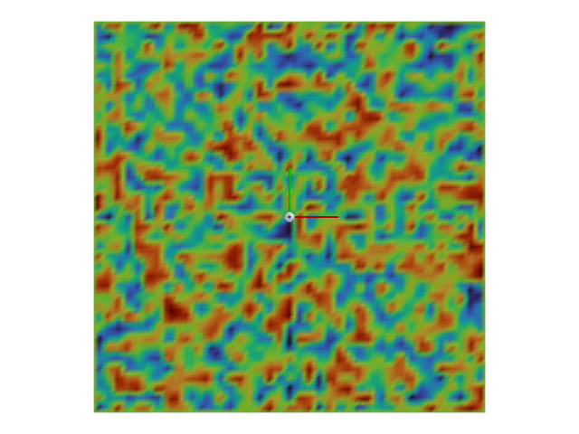

#### 참고
이 지형의 경우 `difficulty` 매개변수가 무시됩니다.

* **매개변수:**
  * **difficulty** – 지형의 난이도. 0과 1 사이의 값입니다.
  * **cfg** – 지형의 구성입니다.
* **반환값:**
  이산화된 높이로 표현된 지형의 높이 필드. 2D numpy 배열 형태이며, 배열의 모양은 (너비, 길이)이며, 너비와 길이는 각각 x축과 y축 방향의 점 개수입니다.
* **예외:**
  [**ValueError**](https://docs.python.org/3/library/exceptions.html#ValueError) – 다운샘플링된 스케일이 수평 스케일보다 작을 때 발생합니다.

### *class* isaaclab.terrains.height_field.hf_terrains_cfg.HfRandomUniformTerrainCfg

Bases: [`HfTerrainBaseCfg`](#isaaclab.terrains.height_field.hf_terrains_cfg.HfTerrainBaseCfg)

랜덤 균등 높이 필드 지형을 위한 구성입니다.

**속성:**

| [`noise_range`](#isaaclab.terrains.height_field.hf_terrains_cfg.HfRandomUniformTerrainCfg.noise_range)                 | 지형의 최소 및 최대 높이 노이즈(즉, z 방향)입니다.                 |
|------------------------------------------------------------------------------------------------------------------------|------------------------------------------------------------------|
| [`noise_step`](#isaaclab.terrains.height_field.hf_terrains_cfg.HfRandomUniformTerrainCfg.noise_step)                   | 두 점 사이의 최소 높이 변화량(단위: m)입니다.                      |
| [`downsampled_scale`](#isaaclab.terrains.height_field.hf_terrains_cfg.HfRandomUniformTerrainCfg.downsampled_scale)     | 지형에서 두 개의 무작위로 샘플링된 점 사이의 거리(단위: m)입니다.  |
| [`proportion`](#isaaclab.terrains.height_field.hf_terrains_cfg.HfRandomUniformTerrainCfg.proportion)                   | 생성할 지형의 비율입니다.                                          |
| [`size`](#isaaclab.terrains.height_field.hf_terrains_cfg.HfRandomUniformTerrainCfg.size)                               | 지형의 너비(x 방향)와 길이(y 방향)(단위: m)입니다.                |
| [`flat_patch_sampling`](#isaaclab.terrains.height_field.hf_terrains_cfg.HfRandomUniformTerrainCfg.flat_patch_sampling) | 하위 지형에서 평평한 패치를 샘플링하기 위한 구성 사전입니다.     |
| [`border_width`](#isaaclab.terrains.height_field.hf_terrains_cfg.HfRandomUniformTerrainCfg.border_width)               | 지형 주변의 테두리/패딩 너비(단위: m)입니다.                      |
| [`horizontal_scale`](#isaaclab.terrains.height_field.hf_terrains_cfg.HfRandomUniformTerrainCfg.horizontal_scale)       | x 및 y 축(단위: m) 방향의 지형 이산화입니다.                     |
| [`vertical_scale`](#isaaclab.terrains.height_field.hf_terrains_cfg.HfRandomUniformTerrainCfg.vertical_scale)           | z 축(단위: m) 방향의 지형 이산화입니다.                          |
| [`slope_threshold`](#isaaclab.terrains.height_field.hf_terrains_cfg.HfRandomUniformTerrainCfg.slope_threshold)         | 표면이 수직으로 만들어지는 경사 임계값입니다.                      |

#### noise_range *: [tuple](https://docs.python.org/3/library/stdtypes.html#tuple)[[float](https://docs.python.org/3/library/functions.html#float), [float](https://docs.python.org/3/library/functions.html#float)]*

지형의 최소 및 최대 높이 노이즈(즉, z 방향)(단위: m)입니다.

#### noise_step *: [float](https://docs.python.org/3/library/functions.html#float)*

두 점 사이의 최소 높이 변화량(단위: m)입니다.

#### downsampled_scale *: [float](https://docs.python.org/3/library/functions.html#float) | [None](https://docs.python.org/3/library/constants.html#None)*

지형에서 두 개의 무작위로 샘플링된 점 사이의 거리(단위: m)입니다. 기본값은 None이며, 이 경우 `horizontal scale`이 사용됩니다.

높이는 이 해상도로 샘플링되고, 중간 점에 대해서는 보간이 수행됩니다. 이 값은 `horizontal scale`보다 크거나 같아야 합니다.

#### proportion *: [float](https://docs.python.org/3/library/functions.html#float)*

생성할 지형의 비율입니다. 기본값은 1.0입니다.

이것은 지형의 혼합을 생성하는 데 사용됩니다. 비율은 특정 지형을 샘플링할 확률에 해당합니다. 예를 들어, 두 지형 A와 B의 비율이 각각 0.3과 0.7이라면, 지형 A를 샘플링할 확률은 0.3이고 지형 B를 샘플링할 확률은 0.7입니다.

#### size *: [tuple](https://docs.python.org/3/library/stdtypes.html#tuple)[[float](https://docs.python.org/3/library/functions.html#float), [float](https://docs.python.org/3/library/functions.html#float)]*

지형의 너비(x 방향)와 길이(y 방향)(단위: m)입니다. 기본값은 (10.0, 10.0)입니다.

[`TerrainImporterCfg`](#isaaclab.terrains.TerrainImporterCfg)가 사용되는 경우, 이 매개변수는 `isaaclab.scene.TerrainImporterCfg.size` 속성으로 재정의됩니다.

#### flat_patch_sampling *: [dict](https://docs.python.org/3/library/stdtypes.html#dict)[[str](https://docs.python.org/3/library/stdtypes.html#str), FlatPatchSamplingCfg] | [None](https://docs.python.org/3/library/constants.html#None)*

하위 지형에서 평평한 패치를 샘플링하기 위한 구성 사전입니다. 기본값은 None이며, 이 경우 평평한 패치 샘플링이 수행되지 않습니다.

키는 평평한 패치 샘플링 구성의 이름을 나타내며, 값은 해당 구성입니다.

#### border_width *: [float](https://docs.python.org/3/library/functions.html#float)*

지형 주변의 테두리/패딩 너비(단위: m)입니다. 기본값은 0.0입니다.

테두리 너비는 지형의 [`size`](#isaaclab.terrains.height_field.hf_terrains_cfg.HfRandomUniformTerrainCfg.size)에서 빼집니다. 0이 아닌 경우, `horizontal scale`보다 크거나 같아야 합니다.

#### horizontal_scale *: [float](https://docs.python.org/3/library/functions.html#float)*

x 및 y 축(단위: m) 방향의 지형 이산화입니다. 기본값은 0.1입니다.

#### vertical_scale *: [float](https://docs.python.org/3/library/functions.html#float)*

z 축(단위: m) 방향의 지형 이산화입니다. 기본값은 0.005입니다.

#### slope_threshold *: [float](https://docs.python.org/3/library/functions.html#float) | [None](https://docs.python.org/3/library/constants.html#None)*

표면이 수직으로 만들어지는 경사 임계값입니다. 기본값은 None이며, 이 경우 수정이 적용되지 않습니다.

### 피라미드형 경사 지형

### isaaclab.terrains.height_field.hf_terrains.pyramid_sloped_terrain(difficulty: [float](https://docs.python.org/3/library/functions.html#float), cfg: [hf_terrains_cfg.HfPyramidSlopedTerrainCfg](#isaaclab.terrains.height_field.hf_terrains_cfg.HfPyramidSlopedTerrainCfg)) → np.ndarray

절단된 피라미드 구조를 가진 지형을 생성합니다.

지형은 중심부의 평평한 플랫폼으로 잘려 나가는 경사가 있는 피라미드 모양의 표면입니다. 경사는 x축 방향의 높이 변화를 x축 방향의 폭으로 나눈 비율로 정의됩니다. 예를 들어, 경사가 1.0이라면 폭 1단위당 높이가 1단위 변한다는 의미입니다.

만약 `cfg.inverted` 플래그가 [`True`](https://docs.python.org/3/library/constants.html#True)로 설정되면, 지형이 반전되어 플랫폼이 아래쪽에 위치합니다.

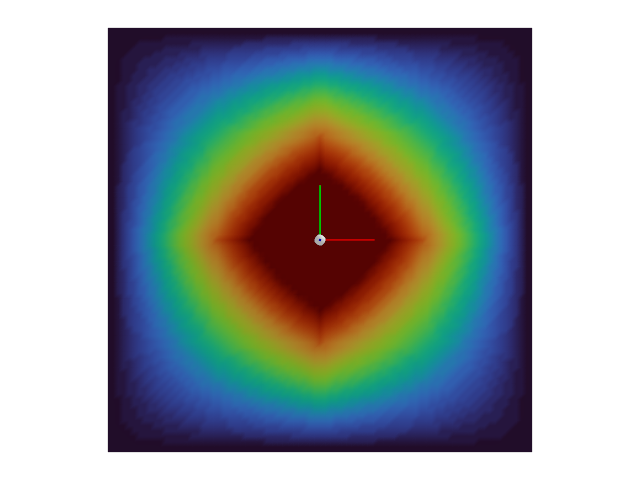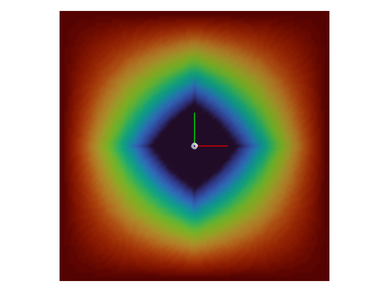
* **매개변수:**
  * **난이도** – 지형의 난이도입니다. 이는 0과 1 사이의 값입니다.
  * **cfg** – 지형의 구성입니다.
* **반환값:**
  이산화된 높이를 갖는 지형의 높이 필드가 2D numpy 배열 형태(가로, 세로)로 반환됩니다.
  배열의 모양은 (가로, 세로)이며, 여기서 가로와 세로는 각각 x축과 y축을 따라 점의 수를 나타냅니다.

### *class* isaaclab.terrains.height_field.hf_terrains_cfg.HfPyramidSlopedTerrainCfg

기반 클래스: [`HfTerrainBaseCfg`](#isaaclab.terrains.height_field.hf_terrains_cfg.HfTerrainBaseCfg)

피라미드 경사 높이 필드 지형의 구성입니다.

**속성:**

| [`slope_range`](#isaaclab.terrains.height_field.hf_terrains_cfg.HfPyramidSlopedTerrainCfg.slope_range)                 | 지형의 경사(라디안 단위)입니다.                                     |
|------------------------------------------------------------------------------------------------------------------------|----------------------------------------------------------------------------|
| [`platform_width`](#isaaclab.terrains.height_field.hf_terrains_cfg.HfPyramidSlopedTerrainCfg.platform_width)           | 지형 중심의 정사각형 플랫폼의 폭입니다.             |
| [`inverted`](#isaaclab.terrains.height_field.hf_terrains_cfg.HfPyramidSlopedTerrainCfg.inverted)                       | 피라미드가 뒤집혀 있는지 여부입니다.                                           |
| [`proportion`](#isaaclab.terrains.height_field.hf_terrains_cfg.HfPyramidSlopedTerrainCfg.proportion)                   | 생성할 지형의 비율입니다.                                     |
| [`size`](#isaaclab.terrains.height_field.hf_terrains_cfg.HfPyramidSlopedTerrainCfg.size)                               | 지형의 너비(x 방향)와 길이(y 방향)(단위: m)입니다.            |
| [`flat_patch_sampling`](#isaaclab.terrains.height_field.hf_terrains_cfg.HfPyramidSlopedTerrainCfg.flat_patch_sampling) | 하위 지형에서 평탄한 패치를 샘플링하기 위한 구성 사전입니다. |
| [`border_width`](#isaaclab.terrains.height_field.hf_terrains_cfg.HfPyramidSlopedTerrainCfg.border_width)               | 지형 주변의 경계/패딩 너비(단위: m)입니다.                 |
| [`horizontal_scale`](#isaaclab.terrains.height_field.hf_terrains_cfg.HfPyramidSlopedTerrainCfg.horizontal_scale)       | x 및 y 축을 따라 지형의 이산화 간격(단위: m)입니다.           |
| [`vertical_scale`](#isaaclab.terrains.height_field.hf_terrains_cfg.HfPyramidSlopedTerrainCfg.vertical_scale)           | z 축을 따라 지형의 이산화 간격(단위: m)입니다.                 |
| [`slope_threshold`](#isaaclab.terrains.height_field.hf_terrains_cfg.HfPyramidSlopedTerrainCfg.slope_threshold)         | 이 값을 초과하는 경사에 대해서는 표면을 수직으로 만듭니다.                |

#### slope_range *: [tuple](https://docs.python.org/3/library/stdtypes.html#tuple)[[float](https://docs.python.org/3/library/functions.html#float), [float](https://docs.python.org/3/library/functions.html#float)]*

지형의 경사(라디안 단위)입니다.

#### platform_width *: [float](https://docs.python.org/3/library/functions.html#float)*

지형 중심의 정사각형 플랫폼의 폭입니다. 기본값은 1.0입니다.

#### inverted *: [bool](https://docs.python.org/3/library/functions.html#bool)*

피라미드가 뒤집혀 있는지 여부입니다. 기본값은 False입니다.

True인 경우, 지형이 뒤집혀서 플랫폼이 아래에 있고 경사가 위로 향하게 됩니다.

#### proportion *: [float](https://docs.python.org/3/library/functions.html#float)*

생성할 지형의 비율입니다. 기본값은 1.0입니다.

이 값은 다양한 지형을 혼합하여 생성하는 데 사용됩니다. 비율은 특정 지형을 샘플링할 확률에 해당합니다.
예를 들어, 지형 A와 B의 비율이 각각 0.3과 0.7이라면, 지형 A를 샘플링할 확률은 0.3이고,
지형 B를 샘플링할 확률은 0.7입니다.

#### size *: [tuple](https://docs.python.org/3/library/stdtypes.html#tuple)[[float](https://docs.python.org/3/library/functions.html#float), [float](https://docs.python.org/3/library/functions.html#float)]*

지형의 너비(x 방향)와 길이(y 방향)(단위: m)입니다. 기본값은 (10.0, 10.0)입니다.

[`TerrainImporterCfg`](#isaaclab.terrains.TerrainImporterCfg)를 사용하는 경우, 이 매개변수는 `isaaclab.scene.TerrainImporterCfg.size` 속성에 의해 재정의됩니다.

#### flat_patch_sampling *: [dict](https://docs.python.org/3/library/stdtypes.html#dict)[[str](https://docs.python.org/3/library/stdtypes.html#str), FlatPatchSamplingCfg] | [None](https://docs.python.org/3/library/constants.html#None)*

하위 지형에서 평탄한 패치를 샘플링하기 위한 구성 사전입니다. 기본값은 None이며,
이 경우 평탄한 패치 샘플링이 수행되지 않습니다.

키들은 평탄한 패치 샘플링 구성의 이름에 해당하고, 값들은 해당 구성입니다.

#### border_width *: [float](https://docs.python.org/3/library/functions.html#float)*

지형 주변의 경계/패딩 너비(단위: m)입니다. 기본값은 0.0입니다.

경계 너비는 지형의 [`size`](#isaaclab.terrains.height_field.hf_terrains_cfg.HfPyramidSlopedTerrainCfg.size)에서 빼집니다. 0이 아닌 경우,
이 값은 `horizontal scale` 이상이어야 합니다.

#### horizontal_scale *: [float](https://docs.python.org/3/library/functions.html#float)*

x 및 y 축을 따라 지형의 이산화 간격(단위: m)입니다. 기본값은 0.1입니다.

#### vertical_scale *: [float](https://docs.python.org/3/library/functions.html#float)*

z 축을 따라 지형의 이산화 간격(단위: m)입니다. 기본값은 0.005입니다.

#### slope_threshold *: [float](https://docs.python.org/3/library/functions.html#float) | [None](https://docs.python.org/3/library/constants.html#None)*

이 값을 초과하는 경사에 대해서는 표면을 수직으로 만듭니다. 기본값은 None이며,
이 경우 보정이 적용되지 않습니다.

### *class* isaaclab.terrains.height_field.hf_terrains_cfg.HfInvertedPyramidSlopedTerrainCfg

기반 클래스: [`HfPyramidSlopedTerrainCfg`](#isaaclab.terrains.height_field.hf_terrains_cfg.HfPyramidSlopedTerrainCfg)

뒤집힌 피라미드 경사 높이 필드 지형의 구성입니다.

#### 참고 사항
이 클래스는 [`HfPyramidSlopedTerrainCfg`](#isaaclab.terrains.height_field.hf_terrains_cfg.HfPyramidSlopedTerrainCfg)를 상속받으며,
[`inverted`](#isaaclab.terrains.height_field.hf_terrains_cfg.HfInvertedPyramidSlopedTerrainCfg.inverted)를 True로 설정합니다.
다른 지형과의 명명 규칙을 맞추고 두 클래스를 명확히 구분하기 위해 별도의 클래스로 구현했습니다.

**속성:**

| [`inverted`](#isaaclab.terrains.height_field.hf_terrains_cfg.HfInvertedPyramidSlopedTerrainCfg.inverted)                       | 피라미드가 뒤집혀 있는지 여부입니다.                                           |
|--------------------------------------------------------------------------------------------------------------------------------|----------------------------------------------------------------------------|
| [`proportion`](#isaaclab.terrains.height_field.hf_terrains_cfg.HfInvertedPyramidSlopedTerrainCfg.proportion)                   | 생성할 지형의 비율입니다.                                     |
| [`size`](#isaaclab.terrains.height_field.hf_terrains_cfg.HfInvertedPyramidSlopedTerrainCfg.size)                               | 지형의 너비(x 방향)와 길이(y 방향)(단위: m)입니다.            |
| [`flat_patch_sampling`](#isaaclab.terrains.height_field.hf_terrains_cfg.HfInvertedPyramidSlopedTerrainCfg.flat_patch_sampling) | 하위 지형에서 평탄한 패치를 샘플링하기 위한 구성 사전입니다. |
| [`border_width`](#isaaclab.terrains.height_field.hf_terrains_cfg.HfInvertedPyramidSlopedTerrainCfg.border_width)               | 지형 주변의 경계/패딩 너비(단위: m)입니다.                 |
| [`horizontal_scale`](#isaaclab.terrains.height_field.hf_terrains_cfg.HfInvertedPyramidSlopedTerrainCfg.horizontal_scale)       | x 및 y 축을 따라 지형의 이산화 간격(단위: m)입니다.           |
| [`vertical_scale`](#isaaclab.terrains.height_field.hf_terrains_cfg.HfInvertedPyramidSlopedTerrainCfg.vertical_scale)           | z 축을 따라 지형의 이산화 간격(단위: m)입니다.                 |
| [`slope_threshold`](#isaaclab.terrains.height_field.hf_terrains_cfg.HfInvertedPyramidSlopedTerrainCfg.slope_threshold)         | 이 값을 초과하는 경사에 대해서는 표면을 수직으로 만듭니다.                |
| [`slope_range`](#isaaclab.terrains.height_field.hf_terrains_cfg.HfInvertedPyramidSlopedTerrainCfg.slope_range)                 | 지형의 경사(라디안 단위)입니다.                                     |
| [`platform_width`](#isaaclab.terrains.height_field.hf_terrains_cfg.HfInvertedPyramidSlopedTerrainCfg.platform_width)           | 지형 중심의 정사각형 플랫폼의 폭입니다.             |

#### inverted *: [bool](https://docs.python.org/3/library/functions.html#bool)*

피라미드가 뒤집혀 있는지 여부입니다. 기본값은 False입니다.

True인 경우, 지형이 뒤집혀서 플랫폼이 아래에 있고 경사가 위로 향하게 됩니다.

#### proportion *: [float](https://docs.python.org/3/library/functions.html#float)*

생성할 지형의 비율입니다. 기본값은 1.0입니다.

이 값은 다양한 지형을 혼합하여 생성하는 데 사용됩니다. 비율은 특정 지형을 샘플링할 확률에 해당합니다.
예를 들어, 지형 A와 B의 비율이 각각 0.3과 0.7이라면, 지형 A를 샘플링할 확률은 0.3이고,
지형 B를 샘플링할 확률은 0.7입니다.

#### size *: [tuple](https://docs.python.org/3/library/stdtypes.html#tuple)[[float](https://docs.python.org/3/library/functions.html#float), [float](https://docs.python.org/3/library/functions.html#float)]*

지형의 너비(x 방향)와 길이(y 방향)(단위: m)입니다. 기본값은 (10.0, 10.0)입니다.

인 [`TerrainImporterCfg`](#isaaclab.terrains.TerrainImporterCfg)를 사용하는 경우, 이 매개변수는 `isaaclab.scene.TerrainImporterCfg.size` 속성으로 오버라이드됩니다.

#### flat_patch_sampling *: [dict](https://docs.python.org/3/library/stdtypes.html#dict)[[str](https://docs.python.org/3/library/stdtypes.html#str), FlatPatchSamplingCfg] | [None](https://docs.python.org/3/library/constants.html#None)*

서브 지형에서 평평한 패치를 샘플링하기 위한 구성 사전입니다. 기본값은 None이며, 이 경우 평평한 패치 샘플링이 수행되지 않습니다.

키들은 평평한 패치 샘플링 구성의 이름에 대응하고, 값들은 해당 구성에 대응합니다.

#### border_width *: [float](https://docs.python.org/3/library/functions.html#float)*

지형 주변의 보더/패딩 너비(단위: m). 기본값은 0.0입니다.

보더 너비는 [`size`](#isaaclab.terrains.height_field.hf_terrains_cfg.HfInvertedPyramidSlopedTerrainCfg.size)의 지형에서 차감됩니다. 0이 아닌 경우, `horizontal scale`보다 크거나 같아야 합니다.

#### horizontal_scale *: [float](https://docs.python.org/3/library/functions.html#float)*

x 및 y 축을 따라 지형의 이산화(단위: m). 기본값은 0.1입니다.

#### vertical_scale *: [float](https://docs.python.org/3/library/functions.html#float)*

z 축을 따라 지형의 이산화(단위: m). 기본값은 0.005입니다.

#### slope_threshold *: [float](https://docs.python.org/3/library/functions.html#float) | [None](https://docs.python.org/3/library/constants.html#None)*

표면이 수직으로 변환되는 임계 경사도. 기본값은 None이며, 이 경우 보정이 적용되지 않습니다.

#### slope_range *: [tuple](https://docs.python.org/3/library/stdtypes.html#tuple)[[float](https://docs.python.org/3/library/functions.html#float), [float](https://docs.python.org/3/library/functions.html#float)]*

지형의 경사도(단위: 라디안).

#### platform_width *: [float](https://docs.python.org/3/library/functions.html#float)*

지형 중앙의 사각형 플랫폼 너비. 기본값은 1.0입니다.

### 피라미드 계단 지형

### isaaclab.terrains.height_field.hf_terrains.pyramid_stairs_terrain(difficulty: [float](https://docs.python.org/3/library/functions.html#float), cfg: [hf_terrains_cfg.HfPyramidStairsTerrainCfg](#isaaclab.terrains.height_field.hf_terrains_cfg.HfPyramidStairsTerrainCfg)) → np.ndarray

피라미드 계단 패턴을 가진 지형을 생성합니다.

지형은 지형 중앙에 평평한 플랫폼으로 트리밍되는 피라미드 계단 패턴입니다.

`cfg.inverted` 플래그가 [`True`](https://docs.python.org/3/library/constants.html#True)로 설정된 경우, 지형이 반전되어 플랫폼이 아래에 위치하게 됩니다.

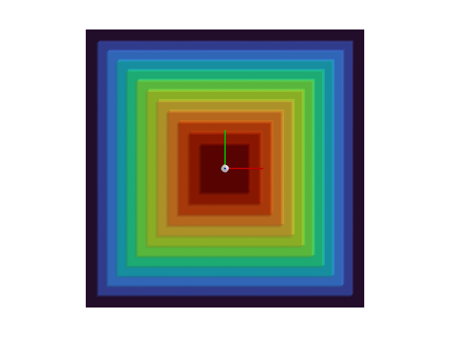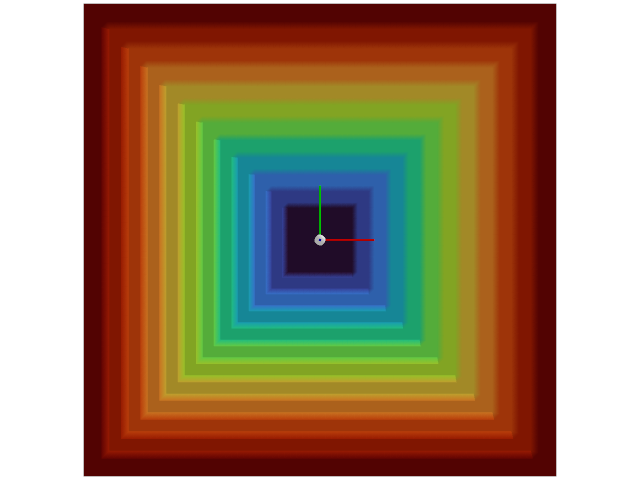
* **매개변수:**
  * **difficulty** – 지형의 난이도. 이 값은 0과 1 사이입니다.
  * **cfg** – 지형에 대한 구성.
* **반환값:**
  지형의 높이 필드를 이산화된 높이를 갖는 2D numpy 배열로 반환합니다.
  배열의 형태는 (너비, 길이)이며, 너비와 길이는 각각 x 및 y 축을 따라 점의 개수입니다.

### *클래스* isaaclab.terrains.height_field.hf_terrains_cfg.HfPyramidStairsTerrainCfg

기반 클래스: [`HfTerrainBaseCfg`](#isaaclab.terrains.height_field.hf_terrains_cfg.HfTerrainBaseCfg)

피라미드 계단 높이 필드 지형에 대한 구성.

**속성:**

| [`step_height_range`](#isaaclab.terrains.height_field.hf_terrains_cfg.HfPyramidStairsTerrainCfg.step_height_range)     | 단계의 최소 및 최대 높이(단위: m).                        |
|------------------------------------------------------------------------------------------------------------------------|----------------------------------------------------------------------------|
| [`step_width`](#isaaclab.terrains.height_field.hf_terrains_cfg.HfPyramidStairsTerrainCfg.step_width)                   | 단계의 너비(단위: m).                                             |
| [`platform_width`](#isaaclab.terrains.height_field.hf_terrains_cfg.HfPyramidStairsTerrainCfg.platform_width)           | 지형 중앙의 사각형 플랫폼 너비.             |
| [`inverted`](#isaaclab.terrains.height_field.hf_terrains_cfg.HfPyramidStairsTerrainCfg.inverted)                       | 피라미드 계단이 반전되었는지 여부.                                    |
| [`proportion`](#isaaclab.terrains.height_field.hf_terrains_cfg.HfPyramidStairsTerrainCfg.proportion)                   | 생성할 지형의 비율.                                     |
| [`size`](#isaaclab.terrains.height_field.hf_terrains_cfg.HfPyramidStairsTerrainCfg.size)                               | 지형의 너비(x 축 따라)와 길이(y 축 따라)(단위: m).            |
| [`flat_patch_sampling`](#isaaclab.terrains.height_field.hf_terrains_cfg.HfPyramidStairsTerrainCfg.flat_patch_sampling) | 서브 지형에서 평평한 패치를 샘플링하기 위한 구성 사전. |
| [`border_width`](#isaaclab.terrains.height_field.hf_terrains_cfg.HfPyramidStairsTerrainCfg.border_width)               | 지형 주변의 보더/패딩 너비(단위: m).                 |
| [`horizontal_scale`](#isaaclab.terrains.height_field.hf_terrains_cfg.HfPyramidStairsTerrainCfg.horizontal_scale)       | x 및 y 축을 따라 지형의 이산화(단위: m).           |
| [`vertical_scale`](#isaaclab.terrains.height_field.hf_terrains_cfg.HfPyramidStairsTerrainCfg.vertical_scale)           | z 축을 따라 지형의 이산화(단위: m).                 |
| [`slope_threshold`](#isaaclab.terrains.height_field.hf_terrains_cfg.HfPyramidStairsTerrainCfg.slope_threshold)         | 표면이 수직으로 변환되는 임계 경사도.                |

#### step_height_range *: [tuple](https://docs.python.org/3/library/stdtypes.html#tuple)[[float](https://docs.python.org/3/library/functions.html#float), [float](https://docs.python.org/3/library/functions.html#float)]*

단계의 최소 및 최대 높이(단위: m).

#### step_width *: [float](https://docs.python.org/3/library/functions.html#float)*

단계의 너비(단위: m).

#### platform_width *: [float](https://docs.python.org/3/library/functions.html#float)*

지형 중앙의 사각형 플랫폼 너비. 기본값은 1.0입니다.

#### inverted *: [bool](https://docs.python.org/3/library/functions.html#bool)*

피라미드 계단이 반전되었는지 여부. 기본값은 False입니다.

True인 경우, 지형이 반전되어 플랫폼이 아래에 위치하고 계단이 위쪽으로 향합니다.

#### proportion *: [float](https://docs.python.org/3/library/functions.html#float)*

생성할 지형의 비율. 기본값은 1.0입니다.

이 속성은 지형 혼합을 생성하는 데 사용됩니다. 비율은 특정 지형을 샘플링할 확률에 해당합니다. 예를 들어, 두 지형 A와 B가 각각 비율 0.3과 0.7을 가지고 있다면, 지형 A를 샘플링할 확률은 0.3이고, 지형 B를 샘플링할 확률은 0.7입니다.

#### size *: [tuple](https://docs.python.org/3/library/stdtypes.html#tuple)[[float](https://docs.python.org/3/library/functions.html#float), [float](https://docs.python.org/3/library/functions.html#float)]*

지형의 너비(x 축 따라)와 길이(y 축 따라)(단위: m). 기본값은 (10.0, 10.0).

인 [`TerrainImporterCfg`](#isaaclab.terrains.TerrainImporterCfg)를 사용하는 경우, 이 매개변수는 `isaaclab.scene.TerrainImporterCfg.size` 속성으로 오버라이드됩니다.

#### flat_patch_sampling *: [dict](https://docs.python.org/3/library/stdtypes.html#dict)[[str](https://docs.python.org/3/library/stdtypes.html#str), FlatPatchSamplingCfg] | [None](https://docs.python.org/3/library/constants.html#None)*

서브 지형에서 평평한 패치를 샘플링하기 위한 구성 사전. 기본값은 None이며, 이 경우 평평한 패치 샘플링이 수행되지 않습니다.

키들은 평평한 패치 샘플링 구성의 이름에 대응하고, 값들은 해당 구성에 대응합니다.

#### border_width *: [float](https://docs.python.org/3/library/functions.html#float)*

지형 주변의 보더/패딩 너비(단위: m). 기본값은 0.0입니다.

보더 너비는 [`size`](#isaaclab.terrains.height_field.hf_terrains_cfg.HfPyramidStairsTerrainCfg.size)의 지형에서 차감됩니다. 0이 아닌 경우, `horizontal scale`보다 크거나 같아야 합니다.

#### horizontal_scale *: [float](https://docs.python.org/3/library/functions.html#float)*

x 및 y 축을 따라 지형의 이산화(단위: m). 기본값은 0.1입니다.

#### vertical_scale *: [float](https://docs.python.org/3/library/functions.html#float)*

z 축을 따라 지형의 이산화(단위: m). 기본값은 0.005입니다.

#### slope_threshold *: [float](https://docs.python.org/3/library/functions.html#float) | [None](https://docs.python.org/3/library/constants.html#None)*

표면이 수직으로 변환되는 임계 경사도. 기본값은 None이며, 이 경우 보정이 적용되지 않습니다.

### *클래스* isaaclab.terrains.height_field.hf_terrains_cfg.HfInvertedPyramidStairsTerrainCfg

기반 클래스: [`HfPyramidStairsTerrainCfg`](#isaaclab.terrains.height_field.hf_terrains_cfg.HfPyramidStairsTerrainCfg)

반전된 피라미드 계단 높이 필드 지형에 대한 구성.

#### 주의
이 클래스는 [`HfPyramidStairsTerrainCfg`](#isaaclab.terrains.height_field.hf_terrains_cfg.HfPyramidStairsTerrainCfg)의 서브클래스로, [`inverted`](#isaaclab.terrains.height_field.hf_terrains_cfg.HfInvertedPyramidStairsTerrainCfg.inverted)를 True로 설정한 것입니다. 다른 지형과의 명명 규칙을 맞추고 두 지형을 명확히 구분하기 위해 별도의 클래스로 구현했습니다.

**속성:**

| [`inverted`](#isaaclab.terrains.height_field.hf_terrains_cfg.HfInvertedPyramidStairsTerrainCfg.inverted)                       | 피라미드 계단이 뒤집혀 있는지 여부입니다.                                    |
|--------------------------------------------------------------------------------------------------------------------------------|----------------------------------------------------------------------------|
| [`proportion`](#isaaclab.terrains.height_field.hf_terrains_cfg.HfInvertedPyramidStairsTerrainCfg.proportion)                   | 생성할 지형의 비율입니다.                                     |
| [`size`](#isaaclab.terrains.height_field.hf_terrains_cfg.HfInvertedPyramidStairsTerrainCfg.size)                               | 지형의 너비(x 방향)와 길이(y 방향) (단위: m).            |
| [`flat_patch_sampling`](#isaaclab.terrains.height_field.hf_terrains_cfg.HfInvertedPyramidStairsTerrainCfg.flat_patch_sampling) | 지형 아래 영역에서 평평한 패치를 샘플링하기 위한 구성 사전입니다. |
| [`border_width`](#isaaclab.terrains.height_field.hf_terrains_cfg.HfInvertedPyramidStairsTerrainCfg.border_width)               | 지형 주변 테두리/패딩의 너비 (단위: m).                 |
| [`horizontal_scale`](#isaaclab.terrains.height_field.hf_terrains_cfg.HfInvertedPyramidStairsTerrainCfg.horizontal_scale)       | x와 y 축을 따라 지형의 이산화 정도 (단위: m).           |
| [`vertical_scale`](#isaaclab.terrains.height_field.hf_terrains_cfg.HfInvertedPyramidStairsTerrainCfg.vertical_scale)           | z 축을 따라 지형의 이산화 정도 (단위: m).                 |
| [`slope_threshold`](#isaaclab.terrains.height_field.hf_terrains_cfg.HfInvertedPyramidStairsTerrainCfg.slope_threshold)         | 이 임계값 이상의 경사면은 수직으로 처리됩니다.                |
| [`step_height_range`](#isaaclab.terrains.height_field.hf_terrains_cfg.HfInvertedPyramidStairsTerrainCfg.step_height_range)     | 계단의 최소 및 최대 높이 (단위: m).                        |
| [`step_width`](#isaaclab.terrains.height_field.hf_terrains_cfg.HfInvertedPyramidStairsTerrainCfg.step_width)                   | 계단의 너비 (단위: m).                                             |
| [`platform_width`](#isaaclab.terrains.height_field.hf_terrains_cfg.HfInvertedPyramidStairsTerrainCfg.platform_width)           | 지형 중앙의 사각형 플랫폼 너비.             |

#### inverted *: [bool](https://docs.python.org/3/library/functions.html#bool)*

피라미드 계단이 뒤집혀 있는지 여부입니다. 기본값은 False입니다.

True인 경우, 지형이 뒤집혀 플랫폼이 아래에 있고 계단이 위쪽으로 향하게 됩니다.

#### proportion *: [float](https://docs.python.org/3/library/functions.html#float)*

생성할 지형의 비율입니다. 기본값은 1.0입니다.

다양한 지형을 혼합하여 생성하는 데 사용됩니다. 이 비율은 해당 지형을 샘플링할 확률을 나타냅니다. 예를 들어, 두 지형 A와 B의 비율이 각각 0.3과 0.7인 경우, 지형 A를 샘플링할 확률은 0.3이고, 지형 B를 샘플링할 확률은 0.7입니다.

#### size *: [tuple](https://docs.python.org/3/library/stdtypes.html#tuple)[[float](https://docs.python.org/3/library/functions.html#float), [float](https://docs.python.org/3/library/functions.html#float)]*

지형의 너비(x 방향)와 길이(y 방향) (단위: m). 기본값은 (10.0, 10.0)입니다.

[`TerrainImporterCfg`](#isaaclab.terrains.TerrainImporterCfg)를 사용하는 경우, 이 매개변수는 `isaaclab.scene.TerrainImporterCfg.size` 속성으로 재정의됩니다.

#### flat_patch_sampling *: [dict](https://docs.python.org/3/library/stdtypes.html#dict)[[str](https://docs.python.org/3/library/stdtypes.html#str), FlatPatchSamplingCfg] | [None](https://docs.python.org/3/library/constants.html#None)*

지형 아래 영역에서 평평한 패치를 샘플링하기 위한 구성 사전입니다. 기본값은 None이며, 이 경우 평평한 패치 샘플링이 수행되지 않습니다.

키 는 평평한 패치 샘플링 구성의 이름을, 값은 해당 구성에 대응합니다.

#### border_width *: [float](https://docs.python.org/3/library/functions.html#float)*

지형 주변 테두리/패딩의 너비 (단위: m). 기본값은 0.0입니다.

테두리 너비는 [`size`](#isaaclab.terrains.height_field.hf_terrains_cfg.HfInvertedPyramidStairsTerrainCfg.size)에서 빼집니다. 0이 아닌 경우, `horizontal scale`보다 크거나 같아야 합니다.

#### horizontal_scale *: [float](https://docs.python.org/3/library/functions.html#float)*

x와 y 축을 따라 지형의 이산화 정도 (단위: m). 기본값은 0.1입니다.

#### vertical_scale *: [float](https://docs.python.org/3/library/functions.html#float)*

z 축을 따라 지형의 이산화 정도 (단위: m). 기본값은 0.005입니다.

#### slope_threshold *: [float](https://docs.python.org/3/library/functions.html#float) | [None](https://docs.python.org/3/library/constants.html#None)*

이 임계값 이상의 경사면은 수직으로 처리됩니다. 기본값은 None이며, 이 경우 보정이 적용되지 않습니다.

#### step_height_range *: [tuple](https://docs.python.org/3/library/stdtypes.html#tuple)[[float](https://docs.python.org/3/library/functions.html#float), [float](https://docs.python.org/3/library/functions.html#float)]*

계단의 최소 및 최대 높이 (단위: m).

#### step_width *: [float](https://docs.python.org/3/library/functions.html#float)*

계단의 너비 (단위: m).

#### platform_width *: [float](https://docs.python.org/3/library/functions.html#float)*

지형 중앙의 사각형 플랫폼 너비. 기본값은 1.0입니다.

### 장애물 분리 지형

### isaaclab.terrains.height_field.hf_terrains.discrete_obstacles_terrain(difficulty: [float](https://docs.python.org/3/library/functions.html#float), cfg: [hf_terrains_cfg.HfDiscreteObstaclesTerrainCfg](#isaaclab.terrains.height_field.hf_terrains_cfg.HfDiscreteObstaclesTerrainCfg)) → np.ndarray

양수와 음수의 높이를 가진 기둥 형태의 무작위 장애물로 구성된 지형을 생성합니다.

지형 중앙에는 평평한 플랫폼이 있으며, 그 주변에 양수와 음수의 높이를 가진 기둥 형태의 무작위 장애물이 배치됩니다. 장애물은 무작위 너비와 높이를 가진 직육면체로 생성되며, 지형 중앙으로부터 최소 거리 `cfg.platform_width` 이상 떨어진 위치에 무작위로 배치됩니다.

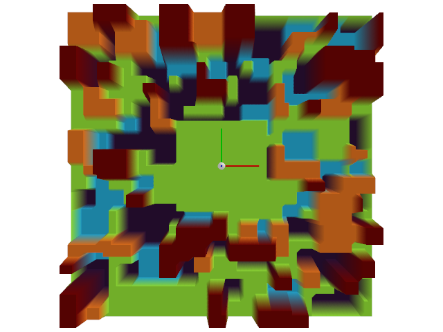
* **매개변수:**
  * **difficulty** – 지형의 난이도. 0과 1 사이의 값입니다.
  * **cfg** – 지형에 대한 구성입니다.
* **반환값:**
  이산화된 높이를 갖는 지형의 높이 필드이며, 2D numpy 배열 형태로 반환됩니다.
  배열의 형태는 (너비, 길이)이며, 너비와 길이는 각각 x축과 y축 방향의 점 개수입니다.

### *class* isaaclab.terrains.height_field.hf_terrains_cfg.HfDiscreteObstaclesTerrainCfg

Bases: [`HfTerrainBaseCfg`](#isaaclab.terrains.height_field.hf_terrains_cfg.HfTerrainBaseCfg)

분리 장애물 높이 필드 지형에 대한 구성입니다.

**속성:**

| [`obstacle_height_mode`](#isaaclab.terrains.height_field.hf_terrains_cfg.HfDiscreteObstaclesTerrainCfg.obstacle_height_mode)   | 장애물 높이에 사용할 모드입니다.                                   |
|--------------------------------------------------------------------------------------------------------------------------------|----------------------------------------------------------------------------|
| [`proportion`](#isaaclab.terrains.height_field.hf_terrains_cfg.HfDiscreteObstaclesTerrainCfg.proportion)                       | 생성할 지형의 비율입니다.                                     |
| [`size`](#isaaclab.terrains.height_field.hf_terrains_cfg.HfDiscreteObstaclesTerrainCfg.size)                                   | 지형의 너비(x 방향)와 길이(y 방향) (단위: m).            |
| [`flat_patch_sampling`](#isaaclab.terrains.height_field.hf_terrains_cfg.HfDiscreteObstaclesTerrainCfg.flat_patch_sampling)     | 지형 아래 영역에서 평평한 패치를 샘플링하기 위한 구성 사전입니다. |
| [`border_width`](#isaaclab.terrains.height_field.hf_terrains_cfg.HfDiscreteObstaclesTerrainCfg.border_width)                   | 지형 주변 테두리/패딩의 너비 (단위: m).                 |
| [`horizontal_scale`](#isaaclab.terrains.height_field.hf_terrains_cfg.HfDiscreteObstaclesTerrainCfg.horizontal_scale)           | x와 y 축을 따라 지형의 이산화 정도 (단위: m).           |
| [`vertical_scale`](#isaaclab.terrains.height_field.hf_terrains_cfg.HfDiscreteObstaclesTerrainCfg.vertical_scale)               | z 축을 따라 지형의 이산화 정도 (단위: m).                 |
| [`slope_threshold`](#isaaclab.terrains.height_field.hf_terrains_cfg.HfDiscreteObstaclesTerrainCfg.slope_threshold)             | 이 임계값 이상의 경사면은 수직으로 처리됩니다.                |
| [`obstacle_width_range`](#isaaclab.terrains.height_field.hf_terrains_cfg.HfDiscreteObstaclesTerrainCfg.obstacle_width_range)   | 장애물의 최소 및 최대 너비 (단위: m).                     |
| [`obstacle_height_range`](#isaaclab.terrains.height_field.hf_terrains_cfg.HfDiscreteObstaclesTerrainCfg.obstacle_height_range) | 장애물의 최소 및 최대 높이 (단위: m).                    |
| [`num_obstacles`](#isaaclab.terrains.height_field.hf_terrains_cfg.HfDiscreteObstaclesTerrainCfg.num_obstacles)                 | 생성할 장애물의 수.                                       |
| [`platform_width`](#isaaclab.terrains.height_field.hf_terrains_cfg.HfDiscreteObstaclesTerrainCfg.platform_width)               | 지형 중앙의 사각형 플랫폼 너비.             |

#### obstacle_height_mode *: [str](https://docs.python.org/3/library/stdtypes.html#str)*

장애물 높이에 사용할 모드입니다. 기본값은 “choice”입니다.

다음과 같은 모드가 지원됩니다: “choice”, “fixed”.

#### proportion *: [float](https://docs.python.org/3/library/functions.html#float)*

생성할 지형의 비율입니다. 기본값은 1.0입니다.

여러 지형을 혼합하여 생성하는 데 사용됩니다. 비율은 특정 지형을 샘플링할 확률에 해당합니다. 예를 들어, 두 지형 A와 B의 비율이 각각 0.3과 0.7이라면, 지형 A를 샘플링할 확률은 0.3이고, 지형 B를 샘플링할 확률은 0.7입니다.

#### size *: [tuple](https://docs.python.org/3/library/stdtypes.html#tuple)[[float](https://docs.python.org/3/library/functions.html#float), [float](https://docs.python.org/3/library/functions.html#float)]*

지형의 너비(x 방향)와 길이(y 방향)(단위: m)입니다. 기본값은 (10.0, 10.0)입니다.

[`TerrainImporterCfg`](#isaaclab.terrains.TerrainImporterCfg)를 사용하는 경우, 이 매개변수는 `isaaclab.scene.TerrainImporterCfg.size` 속성으로 재정의됩니다.

#### flat_patch_sampling *: [dict](https://docs.python.org/3/library/stdtypes.html#dict)[[str](https://docs.python.org/3/library/stdtypes.html#str), FlatPatchSamplingCfg] | [None](https://docs.python.org/3/library/constants.html#None)*

서브 지형에서 평평한 패치를 샘플링하기 위한 구성 사전입니다. 기본값은 None이며, 이 경우 평평한 패치 샘플링이 수행되지 않습니다.

키는 평평한 패치 샘플링 구성의 이름에 해당하고, 값은 해당 구성입니다.

#### border_width *: [float](https://docs.python.org/3/library/functions.html#float)*

지형 주변의 테두리/패딩 너비(단위: m)입니다. 기본값은 0.0입니다.

테두리 너비는 지형의 [`size`](#isaaclab.terrains.height_field.hf_terrains_cfg.HfDiscreteObstaclesTerrainCfg.size)에서 빼집니다. 값이 0이 아닌 경우, `horizontal scale`보다 크거나 같아야 합니다.

#### horizontal_scale *: [float](https://docs.python.org/3/library/functions.html#float)*

x 및 y 축을 따라 지형의 이산화 간격(단위: m)입니다. 기본값은 0.1입니다.

#### vertical_scale *: [float](https://docs.python.org/3/library/functions.html#float)*

z 축을 따라 지형의 이산화 간격(단위: m)입니다. 기본값은 0.005입니다.

#### slope_threshold *: [float](https://docs.python.org/3/library/functions.html#float) | [None](https://docs.python.org/3/library/constants.html#None)*

임계값 이상의 경사면이 수직 면으로 처리됩니다. 기본값은 None이며, 이 경우 보정이 적용되지 않습니다.

#### obstacle_width_range *: [tuple](https://docs.python.org/3/library/stdtypes.html#tuple)[[float](https://docs.python.org/3/library/functions.html#float), [float](https://docs.python.org/3/library/functions.html#float)]*

장애물의 최소 및 최대 너비(단위: m)입니다.

#### obstacle_height_range *: [tuple](https://docs.python.org/3/library/stdtypes.html#tuple)[[float](https://docs.python.org/3/library/functions.html#float), [float](https://docs.python.org/3/library/functions.html#float)]*

장애물의 최소 및 최대 높이(단위: m)입니다.

#### num_obstacles *: [int](https://docs.python.org/3/library/functions.html#int)*

생성할 장애물의 수입니다.

#### platform_width *: [float](https://docs.python.org/3/library/functions.html#float)*

지형 중앙에 위치한 정사각형 플랫폼의 너비(단위: m)입니다. 기본값은 1.0입니다.

### 파도 지형

### isaaclab.terrains.height_field.hf_terrains.wave_terrain(difficulty: [float](https://docs.python.org/3/library/functions.html#float), cfg: [hf_terrains_cfg.HfWaveTerrainCfg](#isaaclab.terrains.height_field.hf_terrains_cfg.HfWaveTerrainCfg)) → np.ndarray

파도 패턴을 가진 지형을 생성합니다.

지형은 중앙에 평평한 플랫폼을 가지고 있으며, 파도 패턴은 파도 수와 진폭을 기반으로 한 사인 파동을 추가하여 생성됩니다.

점 $(x, y)$에서의 지형 높이는 다음 식으로 주어집니다:

$$
h(x, y) =  A \left(\sin\left(\frac{2 \pi x}{\lambda}\right) + \cos\left(\frac{2 \pi y}{\lambda}\right) \right)
$$

여기서 $A$는 파도의 진폭, $\lambda$는 파도의 파장입니다.

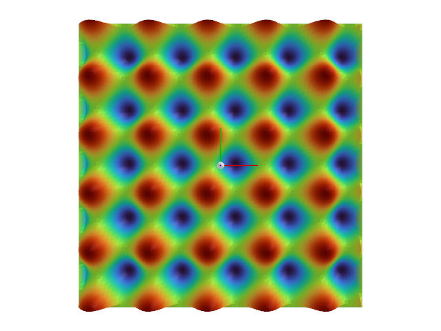
* **매개변수:**
  * **difficulty** – 지형의 난이도입니다. 0과 1 사이의 값입니다.
  * **cfg** – 지형에 대한 구성입니다.
* **반환값:**
  지형의 높이 필드이며, 이산화된 높이를 가진 2D numpy 배열입니다.
  배열의 형태는 (width, length)이며, width와 length는 각각 x축과 y축 방향의 점 수입니다.
* **예외:**
  [**ValueError**](https://docs.python.org/3/library/exceptions.html#ValueError) – 파도 수가 양수가 아닌 경우 발생합니다.

### *class* isaaclab.terrains.height_field.hf_terrains_cfg.HfWaveTerrainCfg

Bases: [`HfTerrainBaseCfg`](#isaaclab.terrains.height_field.hf_terrains_cfg.HfTerrainBaseCfg)

파도 높이 필드 지형에 대한 구성입니다.

**속성:**

| [`proportion`](#isaaclab.terrains.height_field.hf_terrains_cfg.HfWaveTerrainCfg.proportion)                   | 생성할 지형의 비율입니다.                                     |
|---------------------------------------------------------------------------------------------------------------|----------------------------------------------------------------------------|
| [`size`](#isaaclab.terrains.height_field.hf_terrains_cfg.HfWaveTerrainCfg.size)                               | 지형의 너비(x 방향)와 길이(y 방향)(단위: m)입니다.            |
| [`flat_patch_sampling`](#isaaclab.terrains.height_field.hf_terrains_cfg.HfWaveTerrainCfg.flat_patch_sampling) | 서브 지형에서 평평한 패치를 샘플링하기 위한 구성 사전입니다. |
| [`border_width`](#isaaclab.terrains.height_field.hf_terrains_cfg.HfWaveTerrainCfg.border_width)               | 지형 주변의 테두리/패딩 너비(단위: m)입니다.                 |
| [`horizontal_scale`](#isaaclab.terrains.height_field.hf_terrains_cfg.HfWaveTerrainCfg.horizontal_scale)       | x 및 y 축을 따라 지형의 이산화 간격(단위: m)입니다.           |
| [`vertical_scale`](#isaaclab.terrains.height_field.hf_terrains_cfg.HfWaveTerrainCfg.vertical_scale)           | z 축을 따라 지형의 이산화 간격(단위: m)입니다.                 |
| [`slope_threshold`](#isaaclab.terrains.height_field.hf_terrains_cfg.HfWaveTerrainCfg.slope_threshold)         | 임계값 이상의 경사면이 수직 면으로 처리됩니다.                |
| [`amplitude_range`](#isaaclab.terrains.height_field.hf_terrains_cfg.HfWaveTerrainCfg.amplitude_range)         | 파도의 최소 및 최대 진폭(단위: m)입니다.                      |
| [`num_waves`](#isaaclab.terrains.height_field.hf_terrains_cfg.HfWaveTerrainCfg.num_waves)                     | 생성할 파도의 수입니다.                                           |

#### proportion *: [float](https://docs.python.org/3/library/functions.html#float)*

생성할 지형의 비율입니다. 기본값은 1.0입니다.

여러 지형을 혼합하여 생성하는 데 사용됩니다. 비율은 특정 지형을 샘플링할 확률에 해당합니다. 예를 들어, 두 지형 A와 B의 비율이 각각 0.3과 0.7이라면, 지형 A를 샘플링할 확률은 0.3이고, 지형 B를 샘플링할 확률은 0.7입니다.

#### size *: [tuple](https://docs.python.org/3/library/stdtypes.html#tuple)[[float](https://docs.python.org/3/library/functions.html#float), [float](https://docs.python.org/3/library/functions.html#float)]*

지형의 너비(x 방향)와 길이(y 방향)(단위: m)입니다. 기본값은 (10.0, 10.0)입니다.

[`TerrainImporterCfg`](#isaaclab.terrains.TerrainImporterCfg)를 사용하는 경우, 이 매개변수는 `isaaclab.scene.TerrainImporterCfg.size` 속성으로 재정의됩니다.

#### flat_patch_sampling *: [dict](https://docs.python.org/3/library/stdtypes.html#dict)[[str](https://docs.python.org/3/library/stdtypes.html#str), FlatPatchSamplingCfg] | [None](https://docs.python.org/3/library/constants.html#None)*

서브 지형에서 평평한 패치를 샘플링하기 위한 구성 사전입니다. 기본값은 None이며, 이 경우 평평한 패치 샘플링이 수행되지 않습니다.

키는 평평한 패치 샘플링 구성의 이름에 해당하고, 값은 해당 구성입니다.

#### border_width *: [float](https://docs.python.org/3/library/functions.html#float)*

지형 주변의 테두리/패딩 너비(단위: m)입니다. 기본값은 0.0입니다.

테두리 너비는 지형의 [`size`](#isaaclab.terrains.height_field.hf_terrains_cfg.HfWaveTerrainCfg.size)에서 빼집니다. 값이 0이 아닌 경우, `horizontal scale`보다 크거나 같아야 합니다.

#### horizontal_scale *: [float](https://docs.python.org/3/library/functions.html#float)*

x 및 y 축을 따라 지형의 이산화 간격(단위: m)입니다. 기본값은 0.1입니다.

#### vertical_scale *: [float](https://docs.python.org/3/library/functions.html#float)*

z 축을 따라 지형의 이산화 간격(단위: m)입니다. 기본값은 0.005입니다.

#### slope_threshold *: [float](https://docs.python.org/3/library/functions.html#float) | [None](https://docs.python.org/3/library/constants.html#None)*

임계값 이상의 경사면이 수직 면으로 처리됩니다. 기본값은 None이며, 이 경우 보정이 적용되지 않습니다.

#### amplitude_range *: [tuple](https://docs.python.org/3/library/stdtypes.html#tuple)[[float](https://docs.python.org/3/library/functions.html#float), [float](https://docs.python.org/3/library/functions.html#float)]*

파도의 최소 및 최대 진폭(단위: m)입니다.

#### num_waves *: [int](https://docs.python.org/3/library/functions.html#int)*

생성할 파도의 수입니다. 기본값은 1입니다.

### 계단 돌 지형

### isaaclab.terrains.height_field.hf_terrains.stepping_stones_terrain(difficulty: [float](https://docs.python.org/3/library/functions.html#float), cfg: [hf_terrains_cfg.HfSteppingStonesTerrainCfg](#isaaclab.terrains.height_field.hf_terrains_cfg.HfSteppingStonesTerrainCfg)) → np.ndarray

돌들이 계단처럼 놓여진 지형을 생성합니다.

지형은 중앙에 평평한 플랫폼으로 잘려진 계단 모양의 돌들 패턴입니다.

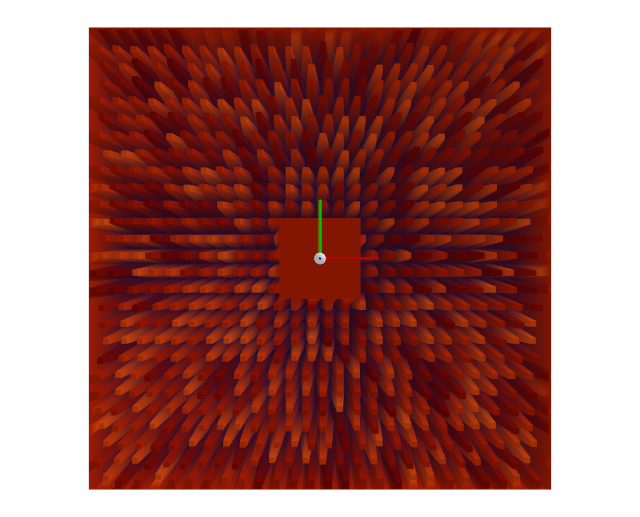
* **매개변수:**
  * **difficulty** – 지형의 난이도입니다. 0과 1 사이의 값입니다.
  * **cfg** – 지형에 대한 구성입니다.
* **반환값:**
  이산화된 높이를 가진 2D numpy 배열 형태의 지형 높이 필드입니다.
  배열의 shape는 (width, length)이며, width와 length는 각각 x축과 y축을 따라 있는 점의 수입니다.

### *class* isaaclab.terrains.height_field.hf_terrains_cfg.HfSteppingStonesTerrainCfg

Bases: [`HfTerrainBaseCfg`](#isaaclab.terrains.height_field.hf_terrains_cfg.HfTerrainBaseCfg)

계단 모양 돌들의 높이 필드 지형에 대한 구성입니다.

**속성:**

| [`proportion`](#isaaclab.terrains.height_field.hf_terrains_cfg.HfSteppingStonesTerrainCfg.proportion)                     | 생성할 지형의 비율입니다.                                     |
|---------------------------------------------------------------------------------------------------------------------------|----------------------------------------------------------------------------|
| [`size`](#isaaclab.terrains.height_field.hf_terrains_cfg.HfSteppingStonesTerrainCfg.size)                                 | 지형의 너비(x 방향)와 길이(y 방향)(단위: m)입니다.            |
| [`flat_patch_sampling`](#isaaclab.terrains.height_field.hf_terrains_cfg.HfSteppingStonesTerrainCfg.flat_patch_sampling)   | 지형 하위 영역에서 평평한 패치를 샘플링하기 위한 구성 딕셔너리입니다. |
| [`border_width`](#isaaclab.terrains.height_field.hf_terrains_cfg.HfSteppingStonesTerrainCfg.border_width)                 | 지형 주변의 테두리/패딩 너비(단위: m)입니다.                 |
| [`horizontal_scale`](#isaaclab.terrains.height_field.hf_terrains_cfg.HfSteppingStonesTerrainCfg.horizontal_scale)         | x축과 y축을 따라 지형의 이산화 크기(단위: m)입니다.           |
| [`vertical_scale`](#isaaclab.terrains.height_field.hf_terrains_cfg.HfSteppingStonesTerrainCfg.vertical_scale)             | z축을 따라 지형의 이산화 크기(단위: m)입니다.                 |
| [`slope_threshold`](#isaaclab.terrains.height_field.hf_terrains_cfg.HfSteppingStonesTerrainCfg.slope_threshold)           | 이 임계값 이상의 경사는 수직으로 처리됩니다.                |
| [`stone_height_max`](#isaaclab.terrains.height_field.hf_terrains_cfg.HfSteppingStonesTerrainCfg.stone_height_max)         | 돌의 최대 높이(단위: m)입니다.                                   |
| [`stone_width_range`](#isaaclab.terrains.height_field.hf_terrains_cfg.HfSteppingStonesTerrainCfg.stone_width_range)       | 돌의 최소 및 최대 너비(단위: m)입니다.                        |
| [`stone_distance_range`](#isaaclab.terrains.height_field.hf_terrains_cfg.HfSteppingStonesTerrainCfg.stone_distance_range) | 돌 사이의 최소 및 최대 거리(단위: m)입니다.                    |
| [`holes_depth`](#isaaclab.terrains.height_field.hf_terrains_cfg.HfSteppingStonesTerrainCfg.holes_depth)                   | 구멍의 깊이(음의 장애물)(단위: m)입니다.                     |
| [`platform_width`](#isaaclab.terrains.height_field.hf_terrains_cfg.HfSteppingStonesTerrainCfg.platform_width)             | 지형 중앙의 사각형 플랫폼 너비(단위: m)입니다.             |

#### proportion *: [float](https://docs.python.org/3/library/functions.html#float)*

생성할 지형의 비율입니다. 기본값은 1.0입니다.

다양한 지형을 혼합하여 생성할 때 사용됩니다. 비율은 특정 지형을 샘플링할 확률에 해당합니다. 예를 들어, 지형 A와 B의 비율이 각각 0.3과 0.7이라면, 지형 A를 샘플링할 확률은 0.3이고, 지형 B를 샘플링할 확률은 0.7입니다.

#### size *: [tuple](https://docs.python.org/3/library/stdtypes.html#tuple)[[float](https://docs.python.org/3/library/functions.html#float), [float](https://docs.python.org/3/library/functions.html#float)]*

지형의 너비(x 방향)와 길이(y 방향)(단위: m)입니다. 기본값은 (10.0, 10.0)입니다.

[`TerrainImporterCfg`](#isaaclab.terrains.TerrainImporterCfg)를 사용하는 경우, 이 매개변수는 `isaaclab.scene.TerrainImporterCfg.size` 속성으로 재정의됩니다.

#### flat_patch_sampling *: [dict](https://docs.python.org/3/library/stdtypes.html#dict)[[str](https://docs.python.org/3/library/stdtypes.html#str), FlatPatchSamplingCfg] | [None](https://docs.python.org/3/library/constants.html#None)*

지형 하위 영역에서 평평한 패치를 샘플링하기 위한 구성 딕셔너리입니다. 기본값은 None이며, 이 경우 평평한 패치 샘플링이 수행되지 않습니다.

키는 평평한 패치 샘플링 구성의 이름을, 값은 해당 구성들을 나타냅니다.

#### border_width *: [float](https://docs.python.org/3/library/functions.html#float)*

지형 주변의 테두리/패딩 너비(단위: m)입니다. 기본값은 0.0입니다.

테두리 너비는 지형의 [`size`](#isaaclab.terrains.height_field.hf_terrains_cfg.HfSteppingStonesTerrainCfg.size)에서 빼어집니다. 0이 아닌 경우, 반드시 `horizontal scale`보다 크거나 같아야 합니다.

#### horizontal_scale *: [float](https://docs.python.org/3/library/functions.html#float)*

x축과 y축을 따라 지형의 이산화 크기(단위: m)입니다. 기본값은 0.1입니다.

#### vertical_scale *: [float](https://docs.python.org/3/library/functions.html#float)*

z축을 따라 지형의 이산화 크기(단위: m)입니다. 기본값은 0.005입니다.

#### slope_threshold *: [float](https://docs.python.org/3/library/functions.html#float) | [None](https://docs.python.org/3/library/constants.html#None)*

이 임계값 이상의 경사는 수직으로 처리됩니다. 기본값은 None이며, 이 경우 보정이 적용되지 않습니다.

#### stone_height_max *: [float](https://docs.python.org/3/library/functions.html#float)*

돌의 최대 높이(단위: m)입니다.

#### stone_width_range *: [tuple](https://docs.python.org/3/library/stdtypes.html#tuple)[[float](https://docs.python.org/3/library/functions.html#float), [float](https://docs.python.org/3/library/functions.html#float)]*

돌의 최소 및 최대 너비(단위: m)입니다.

#### stone_distance_range *: [tuple](https://docs.python.org/3/library/stdtypes.html#tuple)[[float](https://docs.python.org/3/library/functions.html#float), [float](https://docs.python.org/3/library/functions.html#float)]*

돌 사이의 최소 및 최대 거리(단위: m)입니다.

#### holes_depth *: [float](https://docs.python.org/3/library/functions.html#float)*

구멍의 깊이(음의 장애물)(단위: m)입니다. 기본값은 -10.0입니다.

#### platform_width *: [float](https://docs.python.org/3/library/functions.html#float)*

지형 중앙의 사각형 플랫폼 너비(단위: m)입니다. 기본값은 1.0입니다.

## Trimesh 지형

이 서브 모듈은 `trimesh` 라이브러리를 사용하여 다양한 지형을 생성하는 방법을 제공합니다.

높이 필드 표현과 달리, 트라이메시 표현은 임의로 작은 삼각형을 생성하지 않습니다. 대신, 지형은 단일 트라이메시 프리미티브로 표현됩니다. 따라서 이 표현은 높이 필드 표현보다 계산 및 메모리 측면에서 더 효율적이지만, 유연성은 떨어집니다.

### 평평한 지형

### isaaclab.terrains.trimesh.mesh_terrains.flat_terrain(difficulty: [float](https://docs.python.org/3/library/functions.html#float), cfg: [mesh_terrains_cfg.MeshPlaneTerrainCfg](#isaaclab.terrains.trimesh.mesh_terrains_cfg.MeshPlaneTerrainCfg)) → [tuple](https://docs.python.org/3/library/stdtypes.html#tuple)[[list](https://docs.python.org/3/library/stdtypes.html#list)[[trimesh.Trimesh](https://trimesh.org/trimesh.html#trimesh.Trimesh)], np.ndarray]

평평한 지형을 평면 형태로 생성합니다.

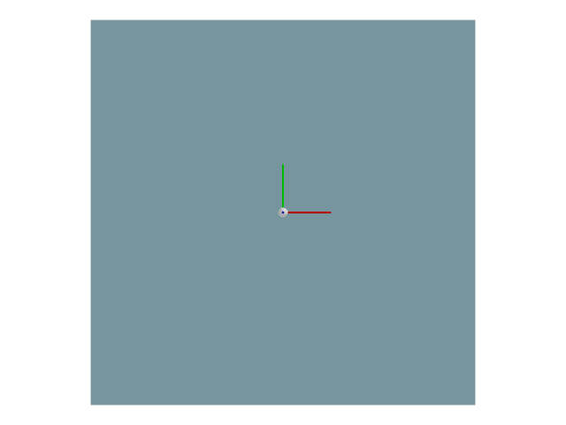

#### 참고
이 지형에서는 `difficulty` 매개변수가 무시됩니다.

* **매개변수:**
  * **difficulty** – 지형의 난이도입니다. 0과 1 사이의 값입니다.
  * **cfg** – 지형에 대한 구성입니다.
* **반환값:**
  지형의 트라이메시와 지형의 원점(단위: m)을 포함하는 튜플입니다.

### *class* isaaclab.terrains.trimesh.mesh_terrains_cfg.MeshPlaneTerrainCfg

Bases: [`SubTerrainBaseCfg`](#isaaclab.terrains.SubTerrainBaseCfg)

평면 메시 지형에 대한 구성입니다.

**속성:**

| [`proportion`](#isaaclab.terrains.trimesh.mesh_terrains_cfg.MeshPlaneTerrainCfg.proportion)                   | 생성할 지형의 비율입니다.                                     |
|---------------------------------------------------------------------------------------------------------------|----------------------------------------------------------------------------|
| [`size`](#isaaclab.terrains.trimesh.mesh_terrains_cfg.MeshPlaneTerrainCfg.size)                               | 지형의 너비(x 방향)와 길이(y 방향)(단위: m)입니다.            |
| [`flat_patch_sampling`](#isaaclab.terrains.trimesh.mesh_terrains_cfg.MeshPlaneTerrainCfg.flat_patch_sampling) | 지형 하위 영역에서 평평한 패치를 샘플링하기 위한 구성 딕셔너리입니다. |

#### proportion *: [float](https://docs.python.org/3/library/functions.html#float)*

생성할 지형의 비율입니다. 기본값은 1.0입니다.

다양한 지형을 혼합하여 생성할 때 사용됩니다. 비율은 특정 지형을 샘플링할 확률에 해당합니다. 예를 들어, 지형 A와 B의 비율이 각각 0.3과 0.7이라면, 지형 A를 샘플링할 확률은 0.3이고, 지형 B를 샘플링할 확률은 0.7입니다.
is 0.7.

#### size *: [tuple](https://docs.python.org/3/library/stdtypes.html#tuple)[[float](https://docs.python.org/3/library/functions.html#float), [float](https://docs.python.org/3/library/functions.html#float)]*

지형(미터 단위)의 x축 방향 너비와 y축 방향 길이. 기본값은 (10.0, 10.0)이다.

[`TerrainImporterCfg`](#isaaclab.terrains.TerrainImporterCfg)를 사용하는 경우, 이 매개변수는 `isaaclab.scene.TerrainImporterCfg.size` 속성으로 재정의된다.

#### flat_patch_sampling *: [dict](https://docs.python.org/3/library/stdtypes.html#dict)[[str](https://docs.python.org/3/library/stdtypes.html#str), FlatPatchSamplingCfg] | [None](https://docs.python.org/3/library/constants.html#None)*

서브-지형에서 평평한 패치를 샘플링하기 위한 구성의 사전. 기본값은 None이며, 이 경우 평평한 패치 샘플링이 수행되지 않는다.

키는 평평한 패치 샘플링 구성의 이름에 해당하고, 값은 해당 구성에 해당한다.

### 피라미드 지형

### isaaclab.terrains.trimesh.mesh_terrains.pyramid_stairs_terrain(difficulty: [float](https://docs.python.org/3/library/functions.html#float), cfg: [mesh_terrains_cfg.MeshPyramidStairsTerrainCfg](#isaaclab.terrains.trimesh.mesh_terrains_cfg.MeshPyramidStairsTerrainCfg)) → [tuple](https://docs.python.org/3/library/stdtypes.html#tuple)[[list](https://docs.python.org/3/library/stdtypes.html#list)[[trimesh.Trimesh](https://trimesh.org/trimesh.html#trimesh.Trimesh)], np.ndarray]

피라미드 계단 패턴을 가진 지형을 생성한다.

지형은 중앙에 평평한 플랫폼으로 트림되는 피라미드 계단 패턴이다.

`cfg.holes`가 True이면, 지형은 방향에 따라 `cfg.platform_width` 길이 또는 너비의 피라미드 계단을 가지며, 나머지 영역에는 계단이 없다. 또한, 테두리도 추가되지 않는다.

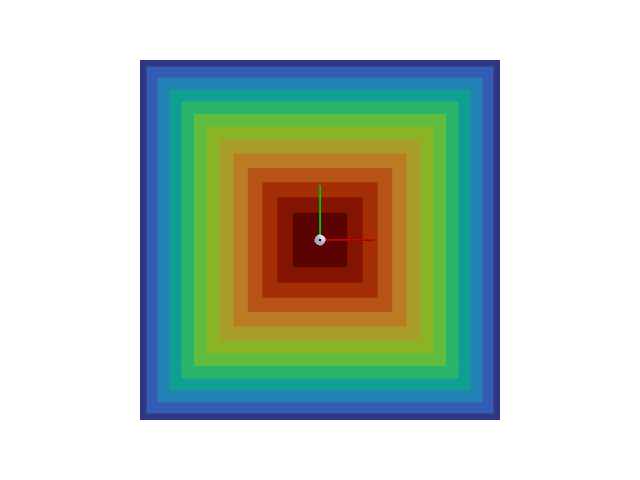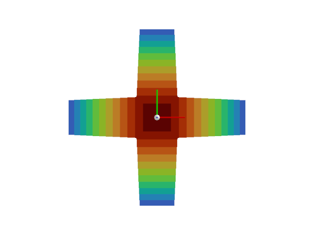
* **매개변수:**
  * **difficulty** – 지형의 난이도. 0과 1 사이의 값이다.
  * **cfg** – 지형의 구성.
* **반환값:**
  지형의 트리메시와 지형의 원점(미터 단위)을 포함하는 튜플.

### *class* isaaclab.terrains.trimesh.mesh_terrains_cfg.MeshPyramidStairsTerrainCfg

Bases: [`SubTerrainBaseCfg`](#isaaclab.terrains.SubTerrainBaseCfg)

피라미드 계단 메쉬 지형의 구성.

**속성:**

| [`border_width`](#isaaclab.terrains.trimesh.mesh_terrains_cfg.MeshPyramidStairsTerrainCfg.border_width)               | 지형 주변의 테두리 너비(미터 단위).                         |
|-----------------------------------------------------------------------------------------------------------------------|----------------------------------------------------------------------------|
| [`step_height_range`](#isaaclab.terrains.trimesh.mesh_terrains_cfg.MeshPyramidStairsTerrainCfg.step_height_range)     | 계단의 최소 및 최대 높이(미터 단위).                        |
| [`step_width`](#isaaclab.terrains.trimesh.mesh_terrains_cfg.MeshPyramidStairsTerrainCfg.step_width)                   | 계단의 너비(미터 단위).                                             |
| [`platform_width`](#isaaclab.terrains.trimesh.mesh_terrains_cfg.MeshPyramidStairsTerrainCfg.platform_width)           | 지형 중앙의 사각형 플랫폼 너비.             |
| [`holes`](#isaaclab.terrains.trimesh.mesh_terrains_cfg.MeshPyramidStairsTerrainCfg.holes)                             | True이면, 지형에 계단에 구멍이 있다.                         |
| [`proportion`](#isaaclab.terrains.trimesh.mesh_terrains_cfg.MeshPyramidStairsTerrainCfg.proportion)                   | 생성할 지형의 비율.                                     |
| [`size`](#isaaclab.terrains.trimesh.mesh_terrains_cfg.MeshPyramidStairsTerrainCfg.size)                               | 지형(미터 단위)의 x축 방향 너비와 y축 방향 길이.            |
| [`flat_patch_sampling`](#isaaclab.terrains.trimesh.mesh_terrains_cfg.MeshPyramidStairsTerrainCfg.flat_patch_sampling) | 서브-지형에서 평평한 패치를 샘플링하기 위한 구성의 사전. |

#### border_width *: [float](https://docs.python.org/3/library/functions.html#float)*

지형 주변의 테두리 너비(미터 단위). 기본값은 0.0이다.

테두리는 지형과 동일한 높이를 가진 평평한 지형이다.

#### step_height_range *: [tuple](https://docs.python.org/3/library/stdtypes.html#tuple)[[float](https://docs.python.org/3/library/functions.html#float), [float](https://docs.python.org/3/library/functions.html#float)]*

계단의 최소 및 최대 높이(미터 단위).

#### step_width *: [float](https://docs.python.org/3/library/functions.html#float)*

계단의 너비(미터 단위).

#### platform_width *: [float](https://docs.python.org/3/library/functions.html#float)*

지형 중앙의 사각형 플랫폼 너비. 기본값은 1.0이다.

#### holes *: [bool](https://docs.python.org/3/library/functions.html#bool)*

True이면, 지형에 계단에 구멍이 있다. 기본값은 False이다.

[`holes`](#isaaclab.terrains.trimesh.mesh_terrains_cfg.MeshPyramidStairsTerrainCfg.holes)가 True이면, 지형은 방향에 따라 [`platform_width`](#isaaclab.terrains.trimesh.mesh_terrains_cfg.MeshPyramidStairsTerrainCfg.platform_width) 길이 또는 너비의 피라미드 계단을 가지며, 나머지 영역에는 계단이 없다. 또한, 테두리도 추가되지 않는다.

#### proportion *: [float](https://docs.python.org/3/library/functions.html#float)*

생성할 지형의 비율. 기본값은 1.0이다.

다양한 지형의 혼합을 생성하는 데 사용된다. 비율은 특정 지형을 샘플링할 확률에 해당한다. 예를 들어, 두 지형 A와 B가 비율 0.3과 0.7을 각각 가지고 있다면, 지형 A를 샘플링할 확률은 0.3이고, 지형 B를 샘플링할 확률은 0.7이다.

#### size *: [tuple](https://docs.python.org/3/library/stdtypes.html#tuple)[[float](https://docs.python.org/3/library/functions.html#float), [float](https://docs.python.org/3/library/functions.html#float)]*

지형(미터 단위)의 x축 방향 너비와 y축 방향 길이. 기본값은 (10.0, 10.0)이다.

[`TerrainImporterCfg`](#isaaclab.terrains.TerrainImporterCfg)를 사용하는 경우, 이 매개변수는 `isaaclab.scene.TerrainImporterCfg.size` 속성으로 재정의된다.

#### flat_patch_sampling *: [dict](https://docs.python.org/3/library/stdtypes.html#dict)[[str](https://docs.python.org/3/library/stdtypes.html#str), FlatPatchSamplingCfg] | [None](https://docs.python.org/3/library/constants.html#None)*

서브-지형에서 평평한 패치를 샘플링하기 위한 구성의 사전. 기본값은 None이며, 이 경우 평평한 패치 샘플링이 수행되지 않는다.

키는 평평한 패치 샘플링 구성의 이름에 해당하고, 값은 해당 구성에 해당한다.

### 역피라미드 지형

### isaaclab.terrains.trimesh.mesh_terrains.inverted_pyramid_stairs_terrain(difficulty: [float](https://docs.python.org/3/library/functions.html#float), cfg: [mesh_terrains_cfg.MeshInvertedPyramidStairsTerrainCfg](#isaaclab.terrains.trimesh.mesh_terrains_cfg.MeshInvertedPyramidStairsTerrainCfg)) → [tuple](https://docs.python.org/3/library/stdtypes.html#tuple)[[list](https://docs.python.org/3/library/stdtypes.html#list)[[trimesh.Trimesh](https://trimesh.org/trimesh.html#trimesh.Trimesh)], np.ndarray]

역피라미드 계단 패턴을 가진 지형을 생성한다.

지형은 중앙에 평평한 플랫폼으로 트림되는 역피라미드 계단 패턴이다.

`cfg.holes`가 True이면, 지형은 방향에 따라 `cfg.platform_width` 길이 또는 너비의 피라미드 계단을 가지며, 나머지 영역에는 계단이 없다. 또한, 테두리도 추가되지 않는다.

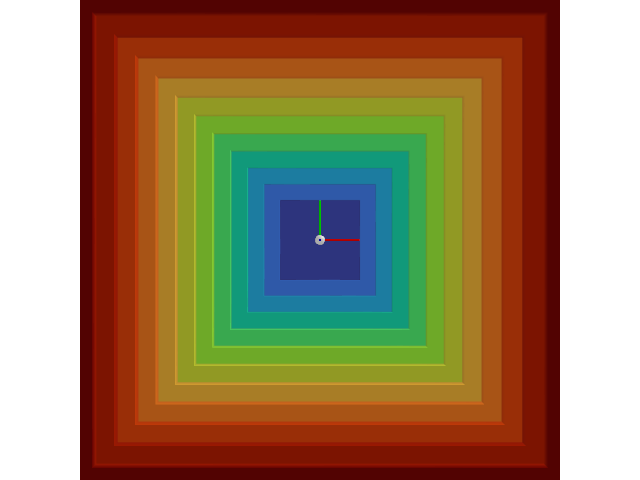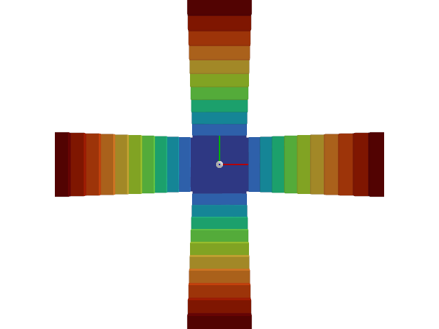
* **매개변수:**
  * **difficulty** – 지형의 난이도. 0과 1 사이의 값이다.
  * **cfg** – 지형의 구성.
* **반환값:**
  지형의 트리메시와 지형의 원점(미터 단위)을 포함하는 튜플.

### *class* isaaclab.terrains.trimesh.mesh_terrains_cfg.MeshInvertedPyramidStairsTerrainCfg

Bases: [`MeshPyramidStairsTerrainCfg`](#isaaclab.terrains.trimesh.mesh_terrains_cfg.MeshPyramidStairsTerrainCfg)

역피라미드 계단 메쉬 지형의 구성.

#### 참고
이것은 단계가 반전된 것을 제외하고는 [`MeshPyramidStairsTerrainCfg`](#isaaclab.terrains.trimesh.mesh_terrains_cfg.MeshPyramidStairsTerrainCfg)와 동일하다.

**속성:**

| [`proportion`](#isaaclab.terrains.trimesh.mesh_terrains_cfg.MeshInvertedPyramidStairsTerrainCfg.proportion)                   | 생성할 지형의 비율.                                     |
|-------------------------------------------------------------------------------------------------------------------------------|----------------------------------------------------------------------------|
| [`size`](#isaaclab.terrains.trimesh.mesh_terrains_cfg.MeshInvertedPyramidStairsTerrainCfg.size)                               | 지형(미터 단위)의 x축 방향 너비와 y축 방향 길이.            |
| [`flat_patch_sampling`](#isaaclab.terrains.trimesh.mesh_terrains_cfg.MeshInvertedPyramidStairsTerrainCfg.flat_patch_sampling) | 서브-지형에서 평평한 패치를 샘플링하기 위한 구성의 사전. |
| [`border_width`](#isaaclab.terrains.trimesh.mesh_terrains_cfg.MeshInvertedPyramidStairsTerrainCfg.border_width)               | 지형 주변의 테두리 너비(미터 단위).                         |
| [`step_height_range`](#isaaclab.terrains.trimesh.mesh_terrains_cfg.MeshInvertedPyramidStairsTerrainCfg.step_height_range)     | 단계의 최소 및 최대 높이(단위: m).                        |
| [`step_width`](#isaaclab.terrains.trimesh.mesh_terrains_cfg.MeshInvertedPyramidStairsTerrainCfg.step_width)                   | 단계의 너비(단위: m).                                             |
| [`platform_width`](#isaaclab.terrains.trimesh.mesh_terrains_cfg.MeshInvertedPyramidStairsTerrainCfg.platform_width)           | 지형 중앙의 정사각형 플랫폼 너비.             |
| [`holes`](#isaaclab.terrains.trimesh.mesh_terrains_cfg.MeshInvertedPyramidStairsTerrainCfg.holes)                             | True이면 지형에 계단에 구멍이 생깁니다.                         |

#### proportion *: [float](https://docs.python.org/3/library/functions.html#float)*

생성할 지형의 비율. 기본값은 1.0입니다.

이 매개변수는 지형 종류를 섞어 생성하는 데 사용됩니다. 비율은 특정 지형을 샘플링할 확률에 해당합니다. 예를 들어, 두 지형 A와 B의 비율이 각각 0.3과 0.7이라면, 지형 A를 샘플링할 확률은 0.3이고 지형 B를 샘플링할 확률은 0.7입니다.

#### size *: [tuple](https://docs.python.org/3/library/stdtypes.html#tuple)[[float](https://docs.python.org/3/library/functions.html#float), [float](https://docs.python.org/3/library/functions.html#float)]*

지형의 너비(x 방향)와 길이(y 방향)(단위: m). 기본값은 (10.0, 10.0)입니다.

[`TerrainImporterCfg`](#isaaclab.terrains.TerrainImporterCfg)를 사용하는 경우, 이 매개변수는 `isaaclab.scene.TerrainImporterCfg.size` 속성으로 오버라이드됩니다.

#### flat_patch_sampling *: [dict](https://docs.python.org/3/library/stdtypes.html#dict)[[str](https://docs.python.org/3/library/stdtypes.html#str), FlatPatchSamplingCfg] | [None](https://docs.python.org/3/library/constants.html#None)*

서브-지형에서 평평한 패치를 샘플링하기 위한 구성의 사전. 기본값은 None이며, 이 경우 평평한 패치 샘플링이 수행되지 않습니다.

키는 평평한 패치 샘플링 구성의 이름에 해당하고 값은 해당 구성입니다.

#### border_width *: [float](https://docs.python.org/3/library/functions.html#float)*

지형 주변의 테두리 너비(단위: m). 기본값은 0.0입니다.

테두리는 지형과 동일한 높이를 가진 평평한 지형입니다.

#### step_height_range *: [tuple](https://docs.python.org/3/library/stdtypes.html#tuple)[[float](https://docs.python.org/3/library/functions.html#float), [float](https://docs.python.org/3/library/functions.html#float)]*

단계의 최소 및 최대 높이(단위: m).

#### step_width *: [float](https://docs.python.org/3/library/functions.html#float)*

단계의 너비(단위: m).

#### platform_width *: [float](https://docs.python.org/3/library/functions.html#float)*

지형 중앙의 정사각형 플랫폼 너비. 기본값은 1.0입니다.

#### holes *: [bool](https://docs.python.org/3/library/functions.html#bool)*

True이면 지형에 계단에 구멍이 생깁니다. 기본값은 False입니다.

[`holes`](#isaaclab.terrains.trimesh.mesh_terrains_cfg.MeshInvertedPyramidStairsTerrainCfg.holes)가 True이면, 지형은 방향에 따라 [`platform_width`](#isaaclab.terrains.trimesh.mesh_terrains_cfg.MeshInvertedPyramidStairsTerrainCfg.platform_width)의 길이 또는 너비를 가진 피라미드 계단이 남는 영역에 계단 없이 생깁니다. 또한, 테두리는 추가되지 않습니다.

### 랜덤 그리드 지형

### isaaclab.terrains.trimesh.mesh_terrains.random_grid_terrain(difficulty: [float](https://docs.python.org/3/library/functions.html#float), cfg: [mesh_terrains_cfg.MeshRandomGridTerrainCfg](#isaaclab.terrains.trimesh.mesh_terrains_cfg.MeshRandomGridTerrainCfg)) → [tuple](https://docs.python.org/3/library/stdtypes.html#tuple)[[list](https://docs.python.org/3/library/stdtypes.html#list)[[trimesh.Trimesh](https://trimesh.org/trimesh.html#trimesh.Trimesh)], np.ndarray]

지정된 크기 `cfg.grid_width`의 그리드로 나누어지는 임의 높이의 셀을 가진 지형을 생성합니다.

지형은 x-y 평면에 생성되고 높이가 1.0인 상태로 시작됩니다. 그런 다음 지정된 크기 `cfg.grid_width`의 그리드로 나뉩니다. 각 그리드 셀은 `cfg.grid_height_range` 사이에서 균일하게 샘플링된 값으로 z-방향으로 임의 이동됩니다. 지형 중앙에는 지정된 너비 `cfg.platform_width`의 플랫폼이 생성됩니다.

`cfg.holes`가 True이면, 지형은 플랫폼에서 확장되는 평면(플러스 기호와 같은 형태)에만 임의 그리드 셀이 생성되고 나머지 영역은 비워지며 테두리는 추가되지 않습니다.

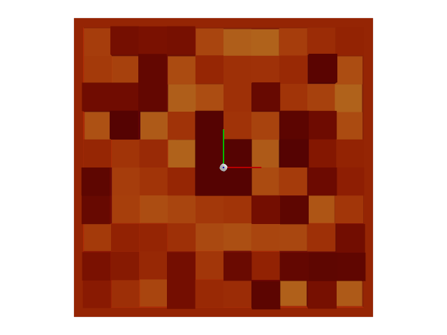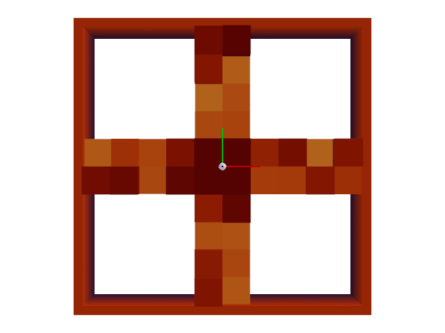
* **매개변수:**
  * **difficulty** – 지형의 난이도. 0과 1 사이의 값입니다.
  * **cfg** – 지형에 대한 구성.
* **반환값:**
  지형의 트리메시와 지형의 원점(단위: m)을 포함하는 튜플.
* **예외:**
  * [**ValueError**](https://docs.python.org/3/library/exceptions.html#ValueError) – 지형이 정사각형이 아닌 경우. 이 메서드는 정사각형 지형만 지원합니다.
  * [**RuntimeError**](https://docs.python.org/3/library/exceptions.html#RuntimeError) – 그리드 너비가 너무 커서 테두리 너비가 음수가 되는 경우.

### *클래스* isaaclab.terrains.trimesh.mesh_terrains_cfg.MeshRandomGridTerrainCfg

Bases: [`SubTerrainBaseCfg`](#isaaclab.terrains.SubTerrainBaseCfg)

랜덤 그리드 메쉬 지형에 대한 구성.

**속성:**

| [`grid_width`](#isaaclab.terrains.trimesh.mesh_terrains_cfg.MeshRandomGridTerrainCfg.grid_width)                   | 그리드 셀의 너비(단위: m).                                        |
|--------------------------------------------------------------------------------------------------------------------|----------------------------------------------------------------------------|
| [`grid_height_range`](#isaaclab.terrains.trimesh.mesh_terrains_cfg.MeshRandomGridTerrainCfg.grid_height_range)     | 그리드 셀의 최소 및 최대 높이(단위: m).                   |
| [`platform_width`](#isaaclab.terrains.trimesh.mesh_terrains_cfg.MeshRandomGridTerrainCfg.platform_width)           | 지형 중앙의 정사각형 플랫폼 너비.             |
| [`holes`](#isaaclab.terrains.trimesh.mesh_terrains_cfg.MeshRandomGridTerrainCfg.holes)                             | True이면 지형에 계단에 구멍이 생깁니다.                         |
| [`proportion`](#isaaclab.terrains.trimesh.mesh_terrains_cfg.MeshRandomGridTerrainCfg.proportion)                   | 생성할 지형의 비율.                                     |
| [`size`](#isaaclab.terrains.trimesh.mesh_terrains_cfg.MeshRandomGridTerrainCfg.size)                               | 지형의 너비(x 방향)와 길이(y 방향)(단위: m).            |
| [`flat_patch_sampling`](#isaaclab.terrains.trimesh.mesh_terrains_cfg.MeshRandomGridTerrainCfg.flat_patch_sampling) | 서브-지형에서 평평한 패치를 샘플링하기 위한 구성의 사전. |

#### grid_width *: [float](https://docs.python.org/3/library/functions.html#float)*

그리드 셀의 너비(단위: m).

#### grid_height_range *: [tuple](https://docs.python.org/3/library/stdtypes.html#tuple)[[float](https://docs.python.org/3/library/functions.html#float), [float](https://docs.python.org/3/library/functions.html#float)]*

그리드 셀의 최소 및 최대 높이(단위: m).

#### platform_width *: [float](https://docs.python.org/3/library/functions.html#float)*

지형 중앙의 정사각형 플랫폼 너비. 기본값은 1.0입니다.

#### holes *: [bool](https://docs.python.org/3/library/functions.html#bool)*

True이면 지형에 계단에 구멍이 생깁니다. 기본값은 False입니다.

[`holes`](#isaaclab.terrains.trimesh.mesh_terrains_cfg.MeshRandomGridTerrainCfg.holes)가 True이면, 지형은 플랫폼에서 확장되는 평면(플러스 기호와 같은 형태)에만 임의 그리드 셀이 생성되고 나머지 영역은 비워지며 테두리는 추가되지 않습니다.

#### proportion *: [float](https://docs.python.org/3/library/functions.html#float)*

생성할 지형의 비율. 기본값은 1.0입니다.

이 매개변수는 지형 종류를 섞어 생성하는 데 사용됩니다. 비율은 특정 지형을 샘플링할 확률에 해당합니다. 예를 들어, 두 지형 A와 B의 비율이 각각 0.3과 0.7이라면, 지형 A를 샘플링할 확률은 0.3이고 지형 B를 샘플링할 확률은 0.7입니다.

#### size *: [tuple](https://docs.python.org/3/library/stdtypes.html#tuple)[[float](https://docs.python.org/3/library/functions.html#float), [float](https://docs.python.org/3/library/functions.html#float)]*

지형의 너비(x 방향)와 길이(y 방향)(단위: m). 기본값은 (10.0, 10.0)입니다.

[`TerrainImporterCfg`](#isaaclab.terrains.TerrainImporterCfg)를 사용하는 경우, 이 매개변수는 `isaaclab.scene.TerrainImporterCfg.size` 속성으로 오버라이드됩니다.

#### flat_patch_sampling *: [dict](https://docs.python.org/3/library/stdtypes.html#dict)[[str](https://docs.python.org/3/library/stdtypes.html#str), FlatPatchSamplingCfg] | [None](https://docs.python.org/3/library/constants.html#None)*

서브-지형에서 평평한 패치를 샘플링하기 위한 구성의 사전. 기본값은 None이며, 이 경우 평평한 패치 샘플링이 수행되지 않습니다.

키는 평평한 패치 샘플링 구성의 이름에 해당하고 값은 해당 구성입니다.

### 레일 지형

### isaaclab.terrains.trimesh.mesh_terrains.rails_terrain(difficulty: [float](https://docs.python.org/3/library/functions.html#float), cfg: [mesh_terrains_cfg.MeshRailsTerrainCfg](#isaaclab.terrains.trimesh.mesh_terrains_cfg.MeshRailsTerrainCfg)) → [tuple](https://docs.python.org/3/library/stdtypes.html#tuple)[[list](https://docs.python.org/3/library/stdtypes.html#list)[[trimesh.Trimesh](https://trimesh.org/trimesh.html#trimesh.Trimesh)], np.ndarray]

상자에 기반한 레일 지형을 압출 형태로 생성합니다.

이 지형은 압출된 두 개의 레일 세트를 포함합니다. 첫 번째 세트(내부 레일)는 지형 중앙의 플랫폼에서 압출되고, 두 번째 세트는 첫 번째 레일 세트와 지형 경계 사이에 압출됩니다. 각 레일 세트는 동일한 높이로 압출됩니다.

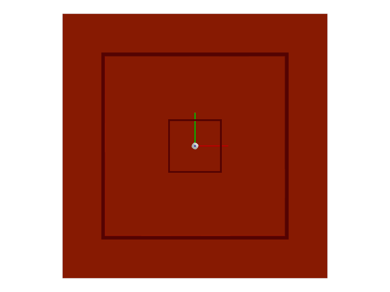
* **매개변수:**
  * **difficulty** – 지형의 난이도. 0과 1 사이의 값입니다.
  * **cfg** – 지형의 구성입니다.
* **반환값:**
  지형의 삼각 메시와 지형의 원점(미터 단위)을 포함하는 튜플입니다.

### *class* isaaclab.terrains.trimesh.mesh_terrains_cfg.MeshRailsTerrainCfg

Bases: [`SubTerrainBaseCfg`](#isaaclab.terrains.SubTerrainBaseCfg)

상자에 기반한 레일 지형을 압출 형태로 생성하기 위한 구성입니다.

**속성:**

| [`rail_thickness_range`](#isaaclab.terrains.trimesh.mesh_terrains_cfg.MeshRailsTerrainCfg.rail_thickness_range)   | 내부 레일과 외부 레일의 두께(미터 단위)입니다.                         |
|-------------------------------------------------------------------------------------------------------------------|----------------------------------------------------------------------------|
| [`rail_height_range`](#isaaclab.terrains.trimesh.mesh_terrains_cfg.MeshRailsTerrainCfg.rail_height_range)         | 레일의 최소 및 최대 높이(미터 단위)입니다.                               |
| [`platform_width`](#isaaclab.terrains.trimesh.mesh_terrains_cfg.MeshRailsTerrainCfg.platform_width)               | 지형 중앙의 사각형 플랫폼 너비(미터 단위)입니다.                         |
| [`proportion`](#isaaclab.terrains.trimesh.mesh_terrains_cfg.MeshRailsTerrainCfg.proportion)                       | 생성할 지형의 비율입니다.                                                |
| [`size`](#isaaclab.terrains.trimesh.mesh_terrains_cfg.MeshRailsTerrainCfg.size)                                   | 지형의 너비(x 방향)와 길이(y 방향)(미터 단위)입니다.                     |
| [`flat_patch_sampling`](#isaaclab.terrains.trimesh.mesh_terrains_cfg.MeshRailsTerrainCfg.flat_patch_sampling)     | 하부 지형에서 평평한 패치를 샘플링하기 위한 구성의 사전입니다.           |

#### rail_thickness_range *: [tuple](https://docs.python.org/3/library/stdtypes.html#tuple)[[float](https://docs.python.org/3/library/functions.html#float), [float](https://docs.python.org/3/library/functions.html#float)]*

내부 레일과 외부 레일의 두께(미터 단위)입니다.

#### rail_height_range *: [tuple](https://docs.python.org/3/library/stdtypes.html#tuple)[[float](https://docs.python.org/3/library/functions.html#float), [float](https://docs.python.org/3/library/functions.html#float)]*

레일의 최소 및 최대 높이(미터 단위)입니다.

#### platform_width *: [float](https://docs.python.org/3/library/functions.html#float)*

지형 중앙의 사각형 플랫폼 너비(미터 단위)입니다. 기본값은 1.0입니다.

#### proportion *: [float](https://docs.python.org/3/library/functions.html#float)*

생성할 지형의 비율입니다. 기본값은 1.0입니다.

다양한 지형을 혼합하여 생성하는 데 사용됩니다. 비율은 해당 지형을 샘플링할 확률에 해당합니다. 예를 들어, 두 가지 지형 A와 B가 비율이 각각 0.3과 0.7이라면, 지형 A를 샘플링할 확률은 0.3이고 지형 B를 샘플링할 확률은 0.7입니다.

#### size *: [tuple](https://docs.python.org/3/library/stdtypes.html#tuple)[[float](https://docs.python.org/3/library/functions.html#float), [float](https://docs.python.org/3/library/functions.html#float)]*

지형의 너비(x 방향)와 길이(y 방향)(미터 단위)입니다. 기본값은 (10.0, 10.0)입니다.

[`TerrainImporterCfg`](#isaaclab.terrains.TerrainImporterCfg)를 사용하는 경우, 이 매개변수는 `isaaclab.scene.TerrainImporterCfg.size` 속성에 의해 재정의됩니다.

#### flat_patch_sampling *: [dict](https://docs.python.org/3/library/stdtypes.html#dict)[[str](https://docs.python.org/3/library/stdtypes.html#str), FlatPatchSamplingCfg] | [None](https://docs.python.org/3/library/constants.html#None)*

하부 지형에서 평평한 패치를 샘플링하기 위한 구성의 사전입니다. 기본값은 None이며, 이 경우 평평한 패치 샘플링이 수행되지 않습니다.

키는 평평한 패치 샘플링 구성의 이름에 해당하고, 값은 해당 구성입니다.

### 구덩이 지형

### isaaclab.terrains.trimesh.mesh_terrains.pit_terrain(difficulty: [float](https://docs.python.org/3/library/functions.html#float), cfg: [mesh_terrains_cfg.MeshPitTerrainCfg](#isaaclab.terrains.trimesh.mesh_terrains_cfg.MeshPitTerrainCfg)) → [tuple](https://docs.python.org/3/library/stdtypes.html#tuple)[[list](https://docs.python.org/3/library/stdtypes.html#list)[[trimesh.Trimesh](https://trimesh.org/trimesh.html#trimesh.Trimesh)], np.ndarray]

계단이 있는 구덩이 지형을 생성합니다. 계단은 구덩이에서 outward(외부 방향으로) 이어집니다.

이 지형은 중앙에 플랫폼이 있고, 구덩이에서 outward로 이어지는 계단이 있습니다. 계단은 x- 및 y- 축을 따라 정렬된 단계들의 시리즈입니다. 단계는 x- 및 y- 축을 따라 반지를 압출하여 생성됩니다. `is_double_pit`가 True이면 구덩이에 두 개의 수준이 있습니다.

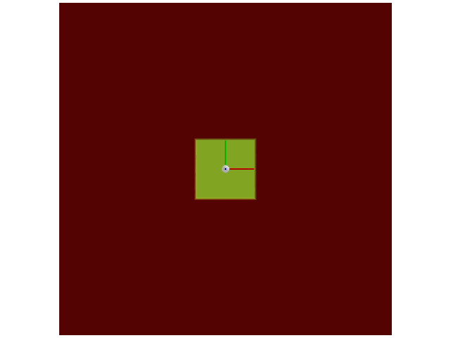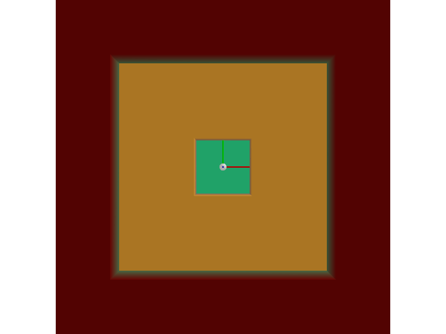
* **매개변수:**
  * **difficulty** – 지형의 난이도. 0과 1 사이의 값입니다.
  * **cfg** – 지형의 구성입니다.
* **반환값:**
  지형의 삼각 메시와 지형의 원점(미터 단위)을 포함하는 튜플입니다.

### *class* isaaclab.terrains.trimesh.mesh_terrains_cfg.MeshPitTerrainCfg

Bases: [`SubTerrainBaseCfg`](#isaaclab.terrains.SubTerrainBaseCfg)

구덩이가 외부로 이어지는 지형을 위한 구성입니다.

**속성:**

| [`pit_depth_range`](#isaaclab.terrains.trimesh.mesh_terrains_cfg.MeshPitTerrainCfg.pit_depth_range)         | 구덩이의 최소 및 최대 깊이(미터 단위)입니다.                             |
|-------------------------------------------------------------------------------------------------------------|----------------------------------------------------------------------------|
| [`platform_width`](#isaaclab.terrains.trimesh.mesh_terrains_cfg.MeshPitTerrainCfg.platform_width)           | 지형 중앙의 사각형 플랫폼 너비(미터 단위)입니다.                         |
| [`double_pit`](#isaaclab.terrains.trimesh.mesh_terrains_cfg.MeshPitTerrainCfg.double_pit)                   | True이면 구덩이에 두 개의 계단 수준이 있습니다.                            |
| [`proportion`](#isaaclab.terrains.trimesh.mesh_terrains_cfg.MeshPitTerrainCfg.proportion)                   | 생성할 지형의 비율입니다.                                                |
| [`size`](#isaaclab.terrains.trimesh.mesh_terrains_cfg.MeshPitTerrainCfg.size)                               | 지형의 너비(x 방향)와 길이(y 방향)(미터 단위)입니다.                     |
| [`flat_patch_sampling`](#isaaclab.terrains.trimesh.mesh_terrains_cfg.MeshPitTerrainCfg.flat_patch_sampling) | 하부 지형에서 평평한 패치를 샘플링하기 위한 구성의 사전입니다.           |

#### pit_depth_range *: [tuple](https://docs.python.org/3/library/stdtypes.html#tuple)[[float](https://docs.python.org/3/library/functions.html#float), [float](https://docs.python.org/3/library/functions.html#float)]*

구덩이의 최소 및 최대 깊이(미터 단위)입니다.

#### platform_width *: [float](https://docs.python.org/3/library/functions.html#float)*

지형 중앙의 사각형 플랫폼 너비(미터 단위)입니다. 기본값은 1.0입니다.

#### double_pit *: [bool](https://docs.python.org/3/library/functions.html#bool)*

True이면 구덩이에 두 개의 계단 수준이 있습니다. 기본값은 False입니다.

#### proportion *: [float](https://docs.python.org/3/library/functions.html#float)*

생성할 지형의 비율입니다. 기본값은 1.0입니다.

다양한 지형을 혼합하여 생성하는 데 사용됩니다. 비율은 해당 지형을 샘플링할 확률에 해당합니다. 예를 들어, 두 가지 지형 A와 B가 비율이 각각 0.3과 0.7이라면, 지형 A를 샘플링할 확률은 0.3이고 지형 B를 샘플링할 확률은 0.7입니다.

#### size *: [tuple](https://docs.python.org/3/library/stdtypes.html#tuple)[[float](https://docs.python.org/3/library/functions.html#float), [float](https://docs.python.org/3/library/functions.html#float)]*

지형의 너비(x 방향)와 길이(y 방향)(미터 단위)입니다. 기본값은 (10.0, 10.0)입니다.

[`TerrainImporterCfg`](#isaaclab.terrains.TerrainImporterCfg)를 사용하는 경우, 이 매개변수는 `isaaclab.scene.TerrainImporterCfg.size` 속성에 의해 재정의됩니다.

#### flat_patch_sampling *: [dict](https://docs.python.org/3/library/stdtypes.html#dict)[[str](https://docs.python.org/3/library/stdtypes.html#str), FlatPatchSamplingCfg] | [None](https://docs.python.org/3/library/constants.html#None)*

하부 지형에서 평평한 패치를 샘플링하기 위한 구성의 사전입니다. 기본값은 None이며, 이 경우 평평한 패치 샘플링이 수행되지 않습니다.

키는 평평한 패치 샘플링 구성의 이름에 해당하고, 값은 해당 구성입니다.

### 상자 지형

### isaaclab.terrains.trimesh.mesh_terrains.box_terrain(difficulty: [float](https://docs.python.org/3/library/functions.html#float), cfg: [mesh_terrains_cfg.MeshBoxTerrainCfg](#isaaclab.terrains.trimesh.mesh_terrains_cfg.MeshBoxTerrainCfg)) → [tuple](https://docs.python.org/3/library/stdtypes.html#tuple)[[list](https://docs.python.org/3/library/stdtypes.html#list)[[trimesh.Trimesh](https://trimesh.org/trimesh.html#trimesh.Trimesh)], np.ndarray]

상자를 이용한 지형을 생성합니다. (피라미드와 유사함)

지형은 그 위에 상자가 쌓여 있는 바닥으로 구성됩니다.
상자는 z축 방향으로 직사각형을 끌어올려 생성됩니다. `double_box`가 True이면,
두 개의 상자가 각각 `box_height` 높이로 위아래에 쌓여 있습니다.

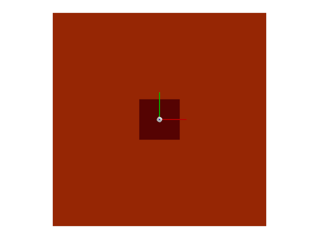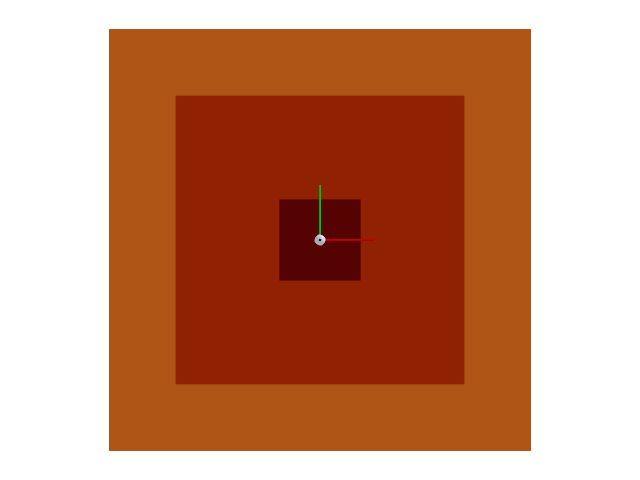
* **매개변수:**
  * **difficulty** – 지형의 난이도. 0과 1 사이의 값입니다.
  * **cfg** – 지형에 대한 구성 정보입니다.
* **반환값:**
  지형의 삼메시와 원점(미터 단위)을 포함하는 튜플.

### *class* isaaclab.terrains.trimesh.mesh_terrains_cfg.MeshBoxTerrainCfg

Bases: [`SubTerrainBaseCfg`](#isaaclab.terrains.SubTerrainBaseCfg)

상자를 이용한 지형(피라미드와 유사함)을 위한 구성 정보입니다.

**속성:**

| [`box_height_range`](#isaaclab.terrains.trimesh.mesh_terrains_cfg.MeshBoxTerrainCfg.box_height_range)       | 상자의 최소 및 최대 높이(미터 단위).                          |
|-------------------------------------------------------------------------------------------------------------|----------------------------------------------------------------------------|
| [`platform_width`](#isaaclab.terrains.trimesh.mesh_terrains_cfg.MeshBoxTerrainCfg.platform_width)           | 지형 중심의 정사각형 플랫폼의 너비.             |
| [`double_box`](#isaaclab.terrains.trimesh.mesh_terrains_cfg.MeshBoxTerrainCfg.double_box)                   | True이면, 구덩이에 두 층의 계단/상자가 있습니다.                      |
| [`proportion`](#isaaclab.terrains.trimesh.mesh_terrains_cfg.MeshBoxTerrainCfg.proportion)                   | 생성할 지형의 비율.                                     |
| [`size`](#isaaclab.terrains.trimesh.mesh_terrains_cfg.MeshBoxTerrainCfg.size)                               | 지형의 너비(x 방향)와 길이(y 방향)(미터 단위).            |
| [`flat_patch_sampling`](#isaaclab.terrains.trimesh.mesh_terrains_cfg.MeshBoxTerrainCfg.flat_patch_sampling) | 서브지형에서 평평한 패치를 샘플링하기 위한 구성의 딕셔너리. |

#### box_height_range *: [tuple](https://docs.python.org/3/library/stdtypes.html#tuple)[[float](https://docs.python.org/3/library/functions.html#float), [float](https://docs.python.org/3/library/functions.html#float)]*

상자의 최소 및 최대 높이(미터 단위).

#### platform_width *: [float](https://docs.python.org/3/library/functions.html#float)*

지형 중심의 정사각형 플랫폼의 너비. 기본값은 1.0입니다.

#### double_box *: [bool](https://docs.python.org/3/library/functions.html#bool)*

True이면, 구덩이에 두 층의 계단/상자가 있습니다. 기본값은 False입니다.

#### proportion *: [float](https://docs.python.org/3/library/functions.html#float)*

생성할 지형의 비율. 기본값은 1.0입니다.

이 값은 지형 조합을 생성할 때 사용됩니다. 비율은 해당 지형을 샘플링할 확률에 해당합니다.
예를 들어, 지형 A와 B의 비율이 각각 0.3과 0.7이라면,
지형 A를 샘플링할 확률은 0.3이고, 지형 B를 샘플링할 확률은 0.7입니다.

#### size *: [tuple](https://docs.python.org/3/library/stdtypes.html#tuple)[[float](https://docs.python.org/3/library/functions.html#float), [float](https://docs.python.org/3/library/functions.html#float)]*

지형의 너비(x 방향)와 길이(y 방향)(미터 단위). 기본값은 (10.0, 10.0)입니다.

[`TerrainImporterCfg`](#isaaclab.terrains.TerrainImporterCfg)가 사용되는 경우,
이 매개변수는 `isaaclab.scene.TerrainImporterCfg.size` 속성에 의해 재정의됩니다.

#### flat_patch_sampling *: [dict](https://docs.python.org/3/library/stdtypes.html#dict)[[str](https://docs.python.org/3/library/stdtypes.html#str), FlatPatchSamplingCfg] | [None](https://docs.python.org/3/library/constants.html#None)*

서브지형에서 평평한 패치를 샘플링하기 위한 구성의 딕셔너리. 기본값은 None이며,
이 경우 평평한 패치 샘플링이 수행되지 않습니다.

키는 평평한 패치 샘플링 구성의 이름에 해당하고, 값은 해당 구성입니다.

### 틈 지형

### isaaclab.terrains.trimesh.mesh_terrains.gap_terrain(difficulty: [float](https://docs.python.org/3/library/functions.html#float), cfg: [mesh_terrains_cfg.MeshGapTerrainCfg](#isaaclab.terrains.trimesh.mesh_terrains_cfg.MeshGapTerrainCfg)) → [tuple](https://docs.python.org/3/library/stdtypes.html#tuple)[[list](https://docs.python.org/3/library/stdtypes.html#list)[[trimesh.Trimesh](https://trimesh.org/trimesh.html#trimesh.Trimesh)], np.ndarray]

플랫폼 주변에 틈이 있는 지형을 생성합니다.

지형은 가운데에 플랫폼이 있는 바닥으로 구성됩니다.
플랫폼은 모든 방향으로 너비 `gap_width`의 틈으로 둘러싸여 있습니다.

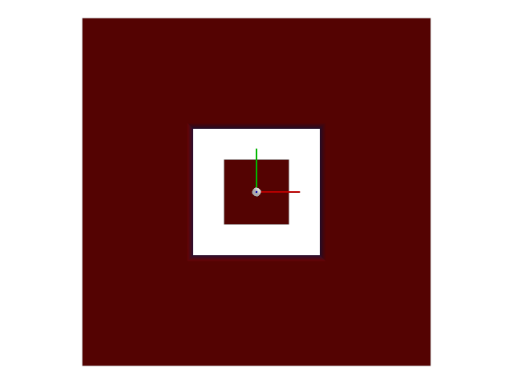
* **매개변수:**
  * **difficulty** – 지형의 난이도. 0과 1 사이의 값입니다.
  * **cfg** – 지형에 대한 구성 정보입니다.
* **반환값:**
  지형의 삼메시와 원점(미터 단위)을 포함하는 튜플.

### *class* isaaclab.terrains.trimesh.mesh_terrains_cfg.MeshGapTerrainCfg

Bases: [`SubTerrainBaseCfg`](#isaaclab.terrains.SubTerrainBaseCfg)

플랫폼 주변에 틈이 있는 지형을 위한 구성 정보입니다.

**속성:**

| [`gap_width_range`](#isaaclab.terrains.trimesh.mesh_terrains_cfg.MeshGapTerrainCfg.gap_width_range)         | 틈의 최소 및 최대 너비(미터 단위).                           |
|-------------------------------------------------------------------------------------------------------------|----------------------------------------------------------------------------|
| [`platform_width`](#isaaclab.terrains.trimesh.mesh_terrains_cfg.MeshGapTerrainCfg.platform_width)           | 지형 중심의 정사각형 플랫폼의 너비.             |
| [`proportion`](#isaaclab.terrains.trimesh.mesh_terrains_cfg.MeshGapTerrainCfg.proportion)                   | 생성할 지형의 비율.                                     |
| [`size`](#isaaclab.terrains.trimesh.mesh_terrains_cfg.MeshGapTerrainCfg.size)                               | 지형의 너비(x 방향)와 길이(y 방향)(미터 단위).            |
| [`flat_patch_sampling`](#isaaclab.terrains.trimesh.mesh_terrains_cfg.MeshGapTerrainCfg.flat_patch_sampling) | 서브지형에서 평평한 패치를 샘플링하기 위한 구성의 딕셔너리. |

#### gap_width_range *: [tuple](https://docs.python.org/3/library/stdtypes.html#tuple)[[float](https://docs.python.org/3/library/functions.html#float), [float](https://docs.python.org/3/library/functions.html#float)]*

틈의 최소 및 최대 너비(미터 단위).

#### platform_width *: [float](https://docs.python.org/3/library/functions.html#float)*

지형 중심의 정사각형 플랫폼의 너비. 기본값은 1.0입니다.

#### proportion *: [float](https://docs.python.org/3/library/functions.html#float)*

생성할 지형의 비율. 기본값은 1.0입니다.

이 값은 지형 조합을 생성할 때 사용됩니다. 비율은 해당 지형을 샘플링할 확률에 해당합니다.
예를 들어, 지형 A와 B의 비율이 각각 0.3과 0.7이라면,
지형 A를 샘플링할 확률은 0.3이고, 지형 B를 샘플링할 확률은 0.7입니다.

#### size *: [tuple](https://docs.python.org/3/library/stdtypes.html#tuple)[[float](https://docs.python.org/3/library/functions.html#float), [float](https://docs.python.org/3/library/functions.html#float)]*

지형의 너비(x 방향)와 길이(y 방향)(미터 단위). 기본값은 (10.0, 10.0)입니다.

[`TerrainImporterCfg`](#isaaclab.terrains.TerrainImporterCfg)가 사용되는 경우,
이 매개변수는 `isaaclab.scene.TerrainImporterCfg.size` 속성에 의해 재정의됩니다.

#### flat_patch_sampling *: [dict](https://docs.python.org/3/library/stdtypes.html#dict)[[str](https://docs.python.org/3/library/stdtypes.html#str), FlatPatchSamplingCfg] | [None](https://docs.python.org/3/library/constants.html#None)*

서브지형에서 평평한 패치를 샘플링하기 위한 구성의 딕셔너리. 기본값은 None이며,
이 경우 평평한 패치 샘플링이 수행되지 않습니다.

키는 평평한 패치 샘플링 구성의 이름에 해당하고, 값은 해당 구성입니다.

### 떠 있는 반지 지형

### isaaclab.terrains.trimesh.mesh_terrains.floating_ring_terrain(difficulty: [float](https://docs.python.org/3/library/functions.html#float), cfg: [mesh_terrains_cfg.MeshFloatingRingTerrainCfg](#isaaclab.terrains.trimesh.mesh_terrains_cfg.MeshFloatingRingTerrainCfg)) → [tuple](https://docs.python.org/3/library/stdtypes.html#tuple)[[list](https://docs.python.org/3/library/stdtypes.html#list)[[trimesh.Trimesh](https://trimesh.org/trimesh.html#trimesh.Trimesh)], np.ndarray]

떠 있는 사각형 반지가 있는 지형을 생성합니다.

지형은 가운데에 떠 있는 반지가 있는 바닥으로 구성됩니다.
반지는 x와 y 방향으로 `platform_width`에서 `platform_width` + `ring_width`까지 확장됩니다.
반지의 두께는 `ring_thickness`이고, 지형으로부터 반지의 높이는 `ring_height`입니다.

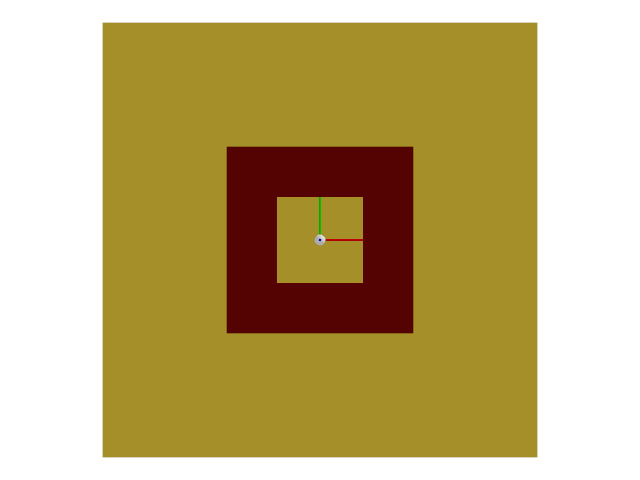
* **매개변수:**
  * **difficulty** – 지형의 난이도. 0과 1 사이의 값입니다.
  * **cfg** – 지형에 대한 구성 정보입니다.
* **반환값:**
  지형 트리메시와 지형 원점(m 단위)을 포함하는 튜플입니다.

### *class* isaaclab.terrains.trimesh.mesh_terrains_cfg.MeshFloatingRingTerrainCfg

Bases: [`SubTerrainBaseCfg`](#isaaclab.terrains.SubTerrainBaseCfg)

중심 주변에 떠 있는 고리가 있는 지형에 대한 구성입니다.

**속성:**

| [`ring_width_range`](#isaaclab.terrains.trimesh.mesh_terrains_cfg.MeshFloatingRingTerrainCfg.ring_width_range)       | 반지의 최소 및 최대 너비(m).                          |
|----------------------------------------------------------------------------------------------------------------------|----------------------------------------------------------------------------|
| [`ring_height_range`](#isaaclab.terrains.trimesh.mesh_terrains_cfg.MeshFloatingRingTerrainCfg.ring_height_range)     | 반지의 최소 및 최대 높이(m).                         |
| [`ring_thickness`](#isaaclab.terrains.trimesh.mesh_terrains_cfg.MeshFloatingRingTerrainCfg.ring_thickness)           | 반지의 두께( z 방향)(m).                                |
| [`platform_width`](#isaaclab.terrains.trimesh.mesh_terrains_cfg.MeshFloatingRingTerrainCfg.platform_width)           | 지형 중앙에 있는 사각형 플랫폼의 너비.             |
| [`proportion`](#isaaclab.terrains.trimesh.mesh_terrains_cfg.MeshFloatingRingTerrainCfg.proportion)                   | 생성할 지형의 비율.                                     |
| [`size`](#isaaclab.terrains.trimesh.mesh_terrains_cfg.MeshFloatingRingTerrainCfg.size)                               | 지형의 너비( x 방향)와 길이( y 방향)(m).            |
| [`flat_patch_sampling`](#isaaclab.terrains.trimesh.mesh_terrains_cfg.MeshFloatingRingTerrainCfg.flat_patch_sampling) | 서브-지형에서 평평한 패치를 샘플링하기 위한 구성의 딕셔너리. |

#### ring_width_range *: [tuple](https://docs.python.org/3/library/stdtypes.html#tuple)[[float](https://docs.python.org/3/library/functions.html#float), [float](https://docs.python.org/3/library/functions.html#float)]*

반지의 최소 및 최대 너비(m).

#### ring_height_range *: [tuple](https://docs.python.org/3/library/stdtypes.html#tuple)[[float](https://docs.python.org/3/library/functions.html#float), [float](https://docs.python.org/3/library/functions.html#float)]*

반지의 최소 및 최대 높이(m).

#### ring_thickness *: [float](https://docs.python.org/3/library/functions.html#float)*

반지의 두께( z 방향)(m).

#### platform_width *: [float](https://docs.python.org/3/library/functions.html#float)*

지형 중앙에 있는 사각형 플랫폼의 너비. 기본값은 1.0입니다.

#### proportion *: [float](https://docs.python.org/3/library/functions.html#float)*

생성할 지형의 비율. 기본값은 1.0입니다.

여러 지형을 혼합하여 생성하는 데 사용됩니다. 비율은 특정 지형을 샘플링할 확률에 해당합니다. 예를 들어, 지형 A와 B의 비율이 각각 0.3과 0.7인 경우, 지형 A를 샘플링할 확률은 0.3이고 지형 B를 샘플링할 확률은 0.7입니다.

#### size *: [tuple](https://docs.python.org/3/library/stdtypes.html#tuple)[[float](https://docs.python.org/3/library/functions.html#float), [float](https://docs.python.org/3/library/functions.html#float)]*

지형의 너비( x 방향)와 길이( y 방향)(m). 기본값은 (10.0, 10.0).

[`TerrainImporterCfg`](#isaaclab.terrains.TerrainImporterCfg)가 사용되는 경우, 이 매개변수는 `isaaclab.scene.TerrainImporterCfg.size` 속성에 의해 재정의됩니다.

#### flat_patch_sampling *: [dict](https://docs.python.org/3/library/stdtypes.html#dict)[[str](https://docs.python.org/3/library/stdtypes.html#str), FlatPatchSamplingCfg] | [None](https://docs.python.org/3/library/constants.html#None)*

서브-지형에서 평평한 패치를 샘플링하기 위한 구성의 딕셔너리. 기본값은 None이며, 이 경우 평평한 패치 샘플링이 수행되지 않습니다.

키는 평평한 패치 샘플링 구성의 이름을 나타내고 값은 해당 구성입니다.

### 별 지형

### isaaclab.terrains.trimesh.mesh_terrains.star_terrain(difficulty: [float](https://docs.python.org/3/library/functions.html#float), cfg: [mesh_terrains_cfg.MeshStarTerrainCfg](#isaaclab.terrains.trimesh.mesh_terrains_cfg.MeshStarTerrainCfg)) → [tuple](https://docs.python.org/3/library/stdtypes.html#tuple)[[list](https://docs.python.org/3/library/stdtypes.html#list)[[trimesh.Trimesh](https://trimesh.org/trimesh.html#trimesh.Trimesh)], np.ndarray]

별 모양의 지형을 생성합니다.

지형은 중앙에 원통이 있는 땅으로 구성됩니다. 별은 중심을 기준으로均등하게 배치된 `num_bars`개의 바로 구성되며, 각 바의 너비는 `bar_width`이고 높이는 `bar_height`입니다. 바는 지형의 둘레까지 이어집니다.

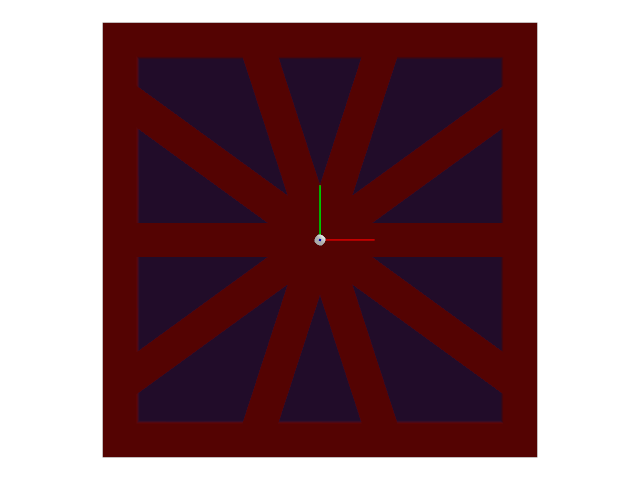
* **매개변수:**
  * **difficulty** – 지형의 난이도. 0과 1 사이의 값입니다.
  * **cfg** – 지형의 구성입니다.
* **반환값:**
  지형의 트리메시와 지형 원점(m 단위)을 포함하는 튜플입니다.
* **예외:**
  [**ValueError**](https://docs.python.org/3/library/exceptions.html#ValueError) – `num_bars`가 2보다 작을 경우.

### *class* isaaclab.terrains.trimesh.mesh_terrains_cfg.MeshStarTerrainCfg

Bases: [`SubTerrainBaseCfg`](#isaaclab.terrains.SubTerrainBaseCfg)

별 모양 패턴이 있는 지형에 대한 구성입니다.

**속성:**

| [`num_bars`](#isaaclab.terrains.trimesh.mesh_terrains_cfg.MeshStarTerrainCfg.num_bars)                       | 별의 각 변에 있는 바의 수.                                      |
|--------------------------------------------------------------------------------------------------------------|----------------------------------------------------------------------------|
| [`bar_width_range`](#isaaclab.terrains.trimesh.mesh_terrains_cfg.MeshStarTerrainCfg.bar_width_range)         | 별의 바의 최소 및 최대 너비(m).              |
| [`bar_height_range`](#isaaclab.terrains.trimesh.mesh_terrains_cfg.MeshStarTerrainCfg.bar_height_range)       | 별의 바의 최소 및 최대 높이(m).             |
| [`platform_width`](#isaaclab.terrains.trimesh.mesh_terrains_cfg.MeshStarTerrainCfg.platform_width)           | 지형 중앙에 있는 원통형 플랫폼의 너비.        |
| [`proportion`](#isaaclab.terrains.trimesh.mesh_terrains_cfg.MeshStarTerrainCfg.proportion)                   | 생성할 지형의 비율.                                     |
| [`size`](#isaaclab.terrains.trimesh.mesh_terrains_cfg.MeshStarTerrainCfg.size)                               | 지형의 너비( x 방향)와 길이( y 방향)(m).            |
| [`flat_patch_sampling`](#isaaclab.terrains.trimesh.mesh_terrains_cfg.MeshStarTerrainCfg.flat_patch_sampling) | 서브-지형에서 평평한 패치를 샘플링하기 위한 구성의 딕셔너리. |

#### num_bars *: [int](https://docs.python.org/3/library/functions.html#int)*

별의 각 변에 있는 바의 수. 2보다 커야 합니다.

#### bar_width_range *: [tuple](https://docs.python.org/3/library/stdtypes.html#tuple)[[float](https://docs.python.org/3/library/functions.html#float), [float](https://docs.python.org/3/library/functions.html#float)]*

별의 바의 최소 및 최대 너비(m).

#### bar_height_range *: [tuple](https://docs.python.org/3/library/stdtypes.html#tuple)[[float](https://docs.python.org/3/library/functions.html#float), [float](https://docs.python.org/3/library/functions.html#float)]*

별의 바의 최소 및 최대 높이(m).

#### platform_width *: [float](https://docs.python.org/3/library/functions.html#float)*

지형 중앙에 있는 원통형 플랫폼의 너비. 기본값은 1.0입니다.

#### proportion *: [float](https://docs.python.org/3/library/functions.html#float)*

생성할 지형의 비율. 기본값은 1.0입니다.

여러 지형을 혼합하여 생성하는 데 사용됩니다. 비율은 특정 지형을 샘플링할 확률에 해당합니다. 예를 들어, 지형 A와 B의 비율이 각각 0.3과 0.7인 경우, 지형 A를 샘플링할 확률은 0.3이고 지형 B를 샘플링할 확률은 0.7입니다.

#### size *: [tuple](https://docs.python.org/3/library/stdtypes.html#tuple)[[float](https://docs.python.org/3/library/functions.html#float), [float](https://docs.python.org/3/library/functions.html#float)]*

지형의 너비( x 방향)와 길이( y 방향)(m). 기본값은 (10.0, 10.0).

[`TerrainImporterCfg`](#isaaclab.terrains.TerrainImporterCfg)가 사용되는 경우, 이 매개변수는 `isaaclab.scene.TerrainImporterCfg.size` 속성에 의해 재정의됩니다.

#### flat_patch_sampling *: [dict](https://docs.python.org/3/library/stdtypes.html#dict)[[str](https://docs.python.org/3/library/stdtypes.html#str), FlatPatchSamplingCfg] | [None](https://docs.python.org/3/library/constants.html#None)*

서브-지형에서 평평한 패치를 샘플링하기 위한 구성의 딕셔너리. 기본값은 None이며, 이 경우 평평한 패치 샘플링이 수행되지 않습니다.

키는 평평한 패치 샘플링 구성의 이름을 나타내고 값은 해당 구성입니다.

### 반복 오브젝트 지형

### isaaclab.terrains.trimesh.mesh_terrains.repeated_objects_terrain(difficulty: [float](https://docs.python.org/3/library/functions.html#float), cfg: [mesh_terrains_cfg.MeshRepeatedObjectsTerrainCfg](#isaaclab.terrains.trimesh.mesh_terrains_cfg.MeshRepeatedObjectsTerrainCfg)) → [tuple](https://docs.python.org/3/library/stdtypes.html#tuple)[[list](https://docs.python.org/3/library/stdtypes.html#list)[[trimesh.Trimesh](https://trimesh.org/trimesh.html#trimesh.Trimesh)], np.ndarray]

반복된 객체로 지형을 생성합니다.

지형에는 중앙에 플랫폼이 있는 지면이 있습니다. 객체들은 플랫폼과 겹치지 않도록 지형 위에 무작위로 배치됩니다.

객체 유형에 따라 객체는 다른 매개변수로 생성됩니다. 객체 유형은 `"cylinder"`, `"box"`, `"cone"` 중 하나일 수 있습니다.

객체 매개변수는 커리큘럼 매개변수로 설정에서 지정됩니다. 난이도는 매개변수의 최소값과 최대값 사이에서 선형 보간에 사용됩니다.

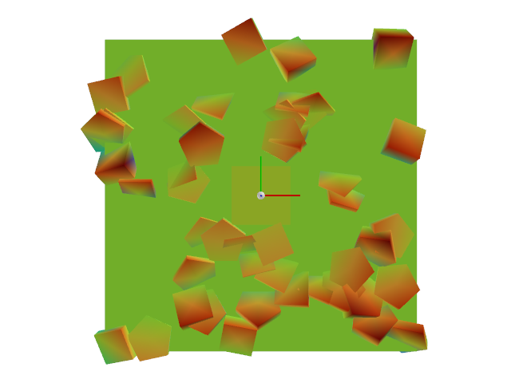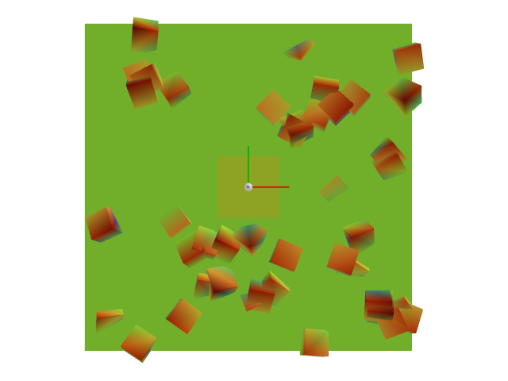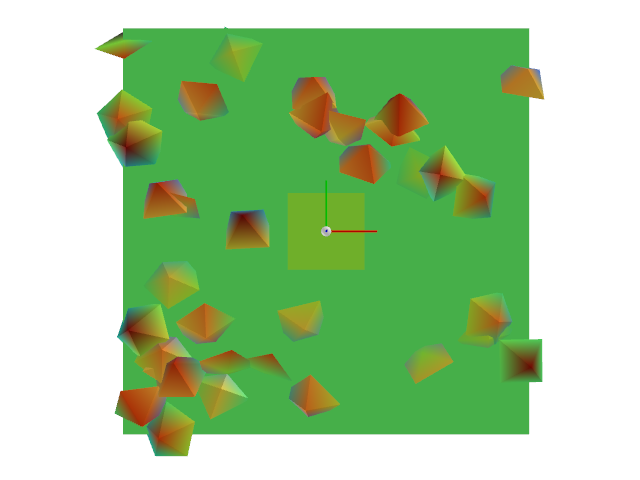
* **Parameters:**
  * **difficulty** – 지형의 난이도입니다. 이는 0과 1 사이의 값입니다.
  * **cfg** – 지형에 대한 구성입니다.
* **Returns:**
  지형의 트라이메시와 지형의 원점(단위: 미터)을 포함하는 튜플입니다.
* **Raises:**
  [**ValueError**](https://docs.python.org/3/library/exceptions.html#ValueError) – 지원되지 않는 객체 유형인 경우. 반드시 문자열이거나 호출 가능한 객체여야 합니다.

### *class* isaaclab.terrains.trimesh.mesh_terrains_cfg.MeshRepeatedObjectsTerrainCfg

Bases: [`SubTerrainBaseCfg`](#isaaclab.terrains.SubTerrainBaseCfg)

반복된 객체가 있는 지형에 대한 기본 구성입니다.

**클래스:**

| [`ObjectCfg`](#isaaclab.terrains.trimesh.mesh_terrains_cfg.MeshRepeatedObjectsTerrainCfg.ObjectCfg)   | 반복된 객체의 구성입니다.   |
|-------------------------------------------------------------------------------------------------------|--------------------------------------|

**속성:**

| [`object_type`](#isaaclab.terrains.trimesh.mesh_terrains_cfg.MeshRepeatedObjectsTerrainCfg.object_type)                 | 생성할 객체의 유형입니다.                                                       |
|-------------------------------------------------------------------------------------------------------------------------|---------------------------------------------------------------------------------------|
| [`proportion`](#isaaclab.terrains.trimesh.mesh_terrains_cfg.MeshRepeatedObjectsTerrainCfg.proportion)                   | 지형에서 생성할 비율입니다.                                                |
| [`size`](#isaaclab.terrains.trimesh.mesh_terrains_cfg.MeshRepeatedObjectsTerrainCfg.size)                               | 지형의 너비(x 방향)와 길이(y 방향)(단위: 미터)입니다.                       |
| [`flat_patch_sampling`](#isaaclab.terrains.trimesh.mesh_terrains_cfg.MeshRepeatedObjectsTerrainCfg.flat_patch_sampling) | 서브 지형에서 평평한 패치를 샘플링하기 위한 구성 사전입니다.            |
| [`object_params_start`](#isaaclab.terrains.trimesh.mesh_terrains_cfg.MeshRepeatedObjectsTerrainCfg.object_params_start) | 커리큘럼 시작 시의 객체 매개변수입니다.                      |
| [`object_params_end`](#isaaclab.terrains.trimesh.mesh_terrains_cfg.MeshRepeatedObjectsTerrainCfg.object_params_end)     | 커리큘럼 종료 시의 객체 매개변수입니다.                        |
| [`max_height_noise`](#isaaclab.terrains.trimesh.mesh_terrains_cfg.MeshRepeatedObjectsTerrainCfg.max_height_noise)       | "이 매개변수는 더 이상 사용되지 않지만, 하위 호환성을 위해 여기에 명시되어 있습니다.      |
| [`abs_height_noise`](#isaaclab.terrains.trimesh.mesh_terrains_cfg.MeshRepeatedObjectsTerrainCfg.abs_height_noise)       | 객체 높이의 가산 노이즈 최소값과 최대값(단위: 미터)입니다.       |
| [`rel_height_noise`](#isaaclab.terrains.trimesh.mesh_terrains_cfg.MeshRepeatedObjectsTerrainCfg.rel_height_noise)       | 객체 높이의 승법적 노이즈 최소값과 최대값입니다. |
| [`platform_width`](#isaaclab.terrains.trimesh.mesh_terrains_cfg.MeshRepeatedObjectsTerrainCfg.platform_width)           | 지형 중앙의 원통형 플랫폼의 너비(단위: 미터)입니다.                   |
| [`platform_height`](#isaaclab.terrains.trimesh.mesh_terrains_cfg.MeshRepeatedObjectsTerrainCfg.platform_height)         | 플랫폼의 높이(단위: 미터)입니다.                                                           |

#### *class* ObjectCfg

Bases: [`object`](https://docs.python.org/3/library/functions.html#object)

반복된 객체의 구성입니다.

**속성:**

| [`num_objects`](#isaaclab.terrains.trimesh.mesh_terrains_cfg.MeshRepeatedObjectsTerrainCfg.ObjectCfg.num_objects)   | 지형에 추가할 객체의 수입니다.   |
|---------------------------------------------------------------------------------------------------------------------|------------------------------------------------|
| [`height`](#isaaclab.terrains.trimesh.mesh_terrains_cfg.MeshRepeatedObjectsTerrainCfg.ObjectCfg.height)             | 객체의 높이(z 방향)(단위: 미터)입니다.     |

#### num_objects *: [int](https://docs.python.org/3/library/functions.html#int)*

지형에 추가할 객체의 수입니다.

#### height *: [float](https://docs.python.org/3/library/functions.html#float)*

객체의 높이(z 방향)(단위: 미터)입니다.

#### object_type *: [Literal](https://docs.python.org/3/library/typing.html#typing.Literal)['cylinder', 'box', 'cone'] | callable*

생성할 객체의 유형입니다.

문자열일 경우, 현재 모듈 스코프에서 `make_{object_type}`이라는 이름의 함수를 찾습니다. 호출 가능한 객체일 경우, 해당 호출 가능 객체를 사용하여 객체를 생성합니다.

#### proportion *: [float](https://docs.python.org/3/library/functions.html#float)*

지형에서 생성할 비율입니다. 기본값은 1.0입니다.

이는 지형의 혼합을 생성하는 데 사용됩니다. 비율은 특정 지형을 샘플링할 확률에 해당합니다. 예를 들어, 두 지형 A와 B가 각각 비율 0.3과 0.7을 가지고 있다면, 지형 A를 샘플링할 확률은 0.3이고 지형 B를 샘플링할 확률은 0.7입니다.

#### size *: [tuple](https://docs.python.org/3/library/stdtypes.html#tuple)[[float](https://docs.python.org/3/library/functions.html#float), [float](https://docs.python.org/3/library/functions.html#float)]*

지형의 너비(x 방향)와 길이(y 방향)(단위: 미터)입니다. 기본값은 (10.0, 10.0)입니다.

[`TerrainImporterCfg`](#isaaclab.terrains.TerrainImporterCfg)를 사용하는 경우, 이 매개변수는 `isaaclab.scene.TerrainImporterCfg.size` 속성에 의해 재정의됩니다.

#### flat_patch_sampling *: [dict](https://docs.python.org/3/library/stdtypes.html#dict)[[str](https://docs.python.org/3/library/stdtypes.html#str), FlatPatchSamplingCfg] | [None](https://docs.python.org/3/library/constants.html#None)*

서브 지형에서 평평한 패치를 샘플링하기 위한 구성 사전입니다. 기본값은 None이며, 이 경우 평평한 패치 샘플링이 수행되지 않습니다.

키는 평평한 패치 샘플링 구성의 이름에 해당하고, 값은 해당 구성입니다.

#### object_params_start *: [ObjectCfg](#isaaclab.terrains.trimesh.mesh_terrains_cfg.MeshRepeatedObjectsTerrainCfg.ObjectCfg)*

커리큘럼 시작 시의 객체 매개변수입니다.

#### object_params_end *: [ObjectCfg](#isaaclab.terrains.trimesh.mesh_terrains_cfg.MeshRepeatedObjectsTerrainCfg.ObjectCfg)*

커리큘럼 종료 시의 객체 매개변수입니다.

#### max_height_noise *: [float](https://docs.python.org/3/library/functions.html#float) | [None](https://docs.python.org/3/library/constants.html#None)*

“이 매개변수는 더 이상 사용되지 않지만, 하위 호환성을 위해 여기에 명시되어 있습니다.”

#### abs_height_noise *: [tuple](https://docs.python.org/3/library/stdtypes.html#tuple)[[float](https://docs.python.org/3/library/functions.html#float), [float](https://docs.python.org/3/library/functions.html#float)]*

객체 높이의 가산 노이즈 최소값과 최대값(단위: 미터)입니다. 기본값은 0.0으로 설정되어 있으며, 이는 노이즈가 없음을 의미합니다.

#### rel_height_noise *: [tuple](https://docs.python.org/3/library/stdtypes.html#tuple)[[float](https://docs.python.org/3/library/functions.html#float), [float](https://docs.python.org/3/library/functions.html#float)]*

객체 높이의 승법적 노이즈 최소값과 최대값입니다. 기본값은 1.0으로 설정되어 있으며, 이는 노이즈가 없음을 의미합니다.

#### platform_width *: [float](https://docs.python.org/3/library/functions.html#float)*

지형 중앙의 원통형 플랫폼의 너비(단위: 미터)입니다. 기본값은 1.0입니다.

#### platform_height *: [float](https://docs.python.org/3/library/functions.html#float)*

플랫폼의 높이(단위: 미터)입니다. 기본값은 -1.0입니다.

값이 음수인 경우, 플랫폼의 높이는 객체의 높이와 동일하게 설정됩니다.

### *class* isaaclab.terrains.trimesh.mesh_terrains_cfg.MeshRepeatedPyramidsTerrainCfg

Bases: [`MeshRepeatedObjectsTerrainCfg`](#isaaclab.terrains.trimesh.mesh_terrains_cfg.MeshRepeatedObjectsTerrainCfg)

반복된 피라미드가 있는 지형에 대한 구성입니다.

**속성:**

| [`proportion`](#isaaclab.terrains.trimesh.mesh_terrains_cfg.MeshRepeatedPyramidsTerrainCfg.proportion)                   | 지형에서 생성할 비율입니다.                                                |
|--------------------------------------------------------------------------------------------------------------------------|---------------------------------------------------------------------------------------|
| [`size`](#isaaclab.terrains.trimesh.mesh_terrains_cfg.MeshRepeatedPyramidsTerrainCfg.size)                               | 지형의 너비(x 방향)와 길이(y 방향)(단위: 미터)입니다.                       |
| [`flat_patch_sampling`](#isaaclab.terrains.trimesh.mesh_terrains_cfg.MeshRepeatedPyramidsTerrainCfg.flat_patch_sampling) | 서브 지형에서 평평한 패치를 샘플링하기 위한 구성 사전입니다.            |
| [`max_height_noise`](#isaaclab.terrains.trimesh.mesh_terrains_cfg.MeshRepeatedPyramidsTerrainCfg.max_height_noise)       | "이 매개변수는 더 이상 사용되지 않지만, 이전 버전과의 호환성을 위해 여기에 명시되어 있습니다      |
| [`abs_height_noise`](#isaaclab.terrains.trimesh.mesh_terrains_cfg.MeshRepeatedPyramidsTerrainCfg.abs_height_noise)       | 객체의 높이에 대한 가법적 노이즈의 최소 및 최대량입니다.       |
| [`rel_height_noise`](#isaaclab.terrains.trimesh.mesh_terrains_cfg.MeshRepeatedPyramidsTerrainCfg.rel_height_noise)       | 객체의 높이에 대한 승법적 노이즈의 최소 및 최대량입니다. |
| [`platform_width`](#isaaclab.terrains.trimesh.mesh_terrains_cfg.MeshRepeatedPyramidsTerrainCfg.platform_width)           | 지형 중심의 원통형 플랫폼의 너비입니다.                   |
| [`platform_height`](#isaaclab.terrains.trimesh.mesh_terrains_cfg.MeshRepeatedPyramidsTerrainCfg.platform_height)         | 플랫폼의 높이입니다.                                                           |
| [`object_type`](#isaaclab.terrains.trimesh.mesh_terrains_cfg.MeshRepeatedPyramidsTerrainCfg.object_type)                 | 생성할 객체의 유형입니다.                                                       |
| [`object_params_start`](#isaaclab.terrains.trimesh.mesh_terrains_cfg.MeshRepeatedPyramidsTerrainCfg.object_params_start) | 커리큘럼 시작 시의 객체 교육 과정 매개변수입니다.                      |
| [`object_params_end`](#isaaclab.terrains.trimesh.mesh_terrains_cfg.MeshRepeatedPyramidsTerrainCfg.object_params_end)     | 커리큘럼 종료 시의 객체 교육 과정 매개변수입니다.                        |

**클래스:**

| [`ObjectCfg`](#isaaclab.terrains.trimesh.mesh_terrains_cfg.MeshRepeatedPyramidsTerrainCfg.ObjectCfg)   | 반복 피라미드에 대한 교육 과정의 구성입니다.   |
|--------------------------------------------------------------------------------------------------------|--------------------------------------------------------|

#### proportion *: [float](https://docs.python.org/3/library/functions.html#float)*

생성할 지형의 비율입니다. 기본값은 1.0입니다.

이 설정은 지형의 혼합을 생성하는 데 사용됩니다. 비율은 해당 지형을 샘플링할 확률에 해당합니다. 예를 들어, 두 지형 A와 B의 비율이 각각 0.3과 0.7이라면, 지형 A를 샘플링할 확률은 0.3이고 지형 B를 샘플링할 확률은 0.7입니다.

#### size *: [tuple](https://docs.python.org/3/library/stdtypes.html#tuple)[[float](https://docs.python.org/3/library/functions.html#float), [float](https://docs.python.org/3/library/functions.html#float)]*

지형의 너비(x 방향)와 길이(y 방향) (단위: m)입니다. 기본값은 (10.0, 10.0)입니다.

[`TerrainImporterCfg`](#isaaclab.terrains.TerrainImporterCfg)가 사용되는 경우, 이 매개변수는 `isaaclab.scene.TerrainImporterCfg.size` 속성으로 오버라이드됩니다.

#### flat_patch_sampling *: [dict](https://docs.python.org/3/library/stdtypes.html#dict)[[str](https://docs.python.org/3/library/stdtypes.html#str), FlatPatchSamplingCfg] | [None](https://docs.python.org/3/library/constants.html#None)*

서브 지형에서 평평한 패치를 샘플링하기 위한 구성의 딕셔너리입니다. 기본값은 None이며, 이 경우 평평한 패치 샘플링이 수행되지 않습니다.

키에는 평평한 패치 샘플링 구성의 이름이 해당되고, 값은 해당 구성입니다.

#### max_height_noise *: [float](https://docs.python.org/3/library/functions.html#float) | [None](https://docs.python.org/3/library/constants.html#None)*

“이 매개변수는 더 이상 사용되지 않지만, 이전 버전과의 호환성을 위해 여기에 명시되어 있습니다

#### abs_height_noise *: [tuple](https://docs.python.org/3/library/stdtypes.html#tuple)[[float](https://docs.python.org/3/library/functions.html#float), [float](https://docs.python.org/3/library/functions.html#float)]*

객체의 높이에 대한 가법적 노이즈의 최소 및 최대량입니다. 기본값은 0.0이며, 이는 노이즈가 없음을 의미합니다.

#### rel_height_noise *: [tuple](https://docs.python.org/3/library/stdtypes.html#tuple)[[float](https://docs.python.org/3/library/functions.html#float), [float](https://docs.python.org/3/library/functions.html#float)]*

객체의 높이에 대한 승법적 노이즈의 최소 및 최대량입니다. 기본값은 1.0이며, 이는 노이즈가 없음을 의미합니다.

#### platform_width *: [float](https://docs.python.org/3/library/functions.html#float)*

지형 중심의 원통형 플랫폼의 너비입니다. 기본값은 1.0입니다.

#### platform_height *: [float](https://docs.python.org/3/library/functions.html#float)*

플랫폼의 높이입니다. 기본값은 -1.0입니다.

값이 음수인 경우, 높이는 객체의 높이와 동일합니다.

#### *class* ObjectCfg

기반 클래스: [`ObjectCfg`](#isaaclab.terrains.trimesh.mesh_terrains_cfg.MeshRepeatedObjectsTerrainCfg.ObjectCfg)

반복 피라미드에 대한 교육 과정의 구성입니다.

**속성:**

| [`num_objects`](#isaaclab.terrains.trimesh.mesh_terrains_cfg.MeshRepeatedPyramidsTerrainCfg.ObjectCfg.num_objects)   | 지형에 추가할 객체의 수입니다.   |
|----------------------------------------------------------------------------------------------------------------------|------------------------------------------------|
| [`height`](#isaaclab.terrains.trimesh.mesh_terrains_cfg.MeshRepeatedPyramidsTerrainCfg.ObjectCfg.height)             | 객체의 높이(z 방향) (단위: m)입니다.     |
| [`radius`](#isaaclab.terrains.trimesh.mesh_terrains_cfg.MeshRepeatedPyramidsTerrainCfg.ObjectCfg.radius)             | 피라미드의 반지름 (단위: m)입니다.             |
| [`max_yx_angle`](#isaaclab.terrains.trimesh.mesh_terrains_cfg.MeshRepeatedPyramidsTerrainCfg.ObjectCfg.max_yx_angle) | y축과 x축을 따라 형성되는 최대 각도입니다.      |
| [`degrees`](#isaaclab.terrains.trimesh.mesh_terrains_cfg.MeshRepeatedPyramidsTerrainCfg.ObjectCfg.degrees)           | 각도가 도 단위인지 여부입니다.               |

#### num_objects *: [int](https://docs.python.org/3/library/functions.html#int)*

지형에 추가할 객체의 수입니다.

#### height *: [float](https://docs.python.org/3/library/functions.html#float)*

객체의 높이(z 방향) (단위: m)입니다.

#### radius *: [float](https://docs.python.org/3/library/functions.html#float)*

피라미드의 반지름 (단위: m)입니다.

#### max_yx_angle *: [float](https://docs.python.org/3/library/functions.html#float)*

y축과 x축을 따라 형성되는 최대 각도입니다. 기본값은 0.0입니다.

#### degrees *: [bool](https://docs.python.org/3/library/functions.html#bool)*

각도가 도 단위인지 여부입니다. 기본값은 True입니다.

#### object_type *: [Literal](https://docs.python.org/3/library/typing.html#typing.Literal)['cylinder', 'box', 'cone'] | callable*

생성할 객체의 유형입니다.

유형은 문자열 또는 호출 가능한(callable) 객체일 수 있습니다. 문자열인 경우, 현재 모듈 스코프에서 `make_{object_type}`이라는 이름의 함수를 찾습니다. 호출 가능한 객체인 경우, 해당 호출 가능한 객체를 사용하여 객체를 생성합니다.

#### object_params_start *: [ObjectCfg](#isaaclab.terrains.trimesh.mesh_terrains_cfg.MeshRepeatedPyramidsTerrainCfg.ObjectCfg)*

커리큘럼 시작 시의 객체 교육 과정 매개변수입니다.

#### object_params_end *: [ObjectCfg](#isaaclab.terrains.trimesh.mesh_terrains_cfg.MeshRepeatedPyramidsTerrainCfg.ObjectCfg)*

커리큘럼 종료 시의 객체 교육 과정 매개변수입니다.

### *class* isaaclab.terrains.trimesh.mesh_terrains_cfg.MeshRepeatedBoxesTerrainCfg

기반 클래스: [`MeshRepeatedObjectsTerrainCfg`](#isaaclab.terrains.trimesh.mesh_terrains_cfg.MeshRepeatedObjectsTerrainCfg)

반복되는 상자로 구성된 지형에 대한 구성입니다.

**속성:**

| [`proportion`](#isaaclab.terrains.trimesh.mesh_terrains_cfg.MeshRepeatedBoxesTerrainCfg.proportion)                   | 생성할 지형의 비율입니다.                                                |
|-----------------------------------------------------------------------------------------------------------------------|---------------------------------------------------------------------------------------|
| [`size`](#isaaclab.terrains.trimesh.mesh_terrains_cfg.MeshRepeatedBoxesTerrainCfg.size)                               | 지형의 너비(x 방향)와 길이(y 방향) (단위: m)입니다.                       |
| [`flat_patch_sampling`](#isaaclab.terrains.trimesh.mesh_terrains_cfg.MeshRepeatedBoxesTerrainCfg.flat_patch_sampling) | 서브 지형에서 평평한 패치를 샘플링하기 위한 구성의 딕셔너리입니다.            |
| [`max_height_noise`](#isaaclab.terrains.trimesh.mesh_terrains_cfg.MeshRepeatedBoxesTerrainCfg.max_height_noise)       | "이 매개변수는 더 이상 사용되지 않지만, 이전 버전과의 호환성을 위해 여기에 명시되어 있습니다      |
| [`abs_height_noise`](#isaaclab.terrains.trimesh.mesh_terrains_cfg.MeshRepeatedBoxesTerrainCfg.abs_height_noise)       | 객체의 높이에 대한 가법적 노이즈의 최소 및 최대량입니다.       |
| [`rel_height_noise`](#isaaclab.terrains.trimesh.mesh_terrains_cfg.MeshRepeatedBoxesTerrainCfg.rel_height_noise)       | 객체의 높이에 대한 승법적 노이즈의 최소 및 최대량입니다. |
| [`platform_width`](#isaaclab.terrains.trimesh.mesh_terrains_cfg.MeshRepeatedBoxesTerrainCfg.platform_width)           | 지형 중심의 원통형 플랫폼의 너비입니다.                   |
| [`platform_height`](#isaaclab.terrains.trimesh.mesh_terrains_cfg.MeshRepeatedBoxesTerrainCfg.platform_height)         | 플랫폼의 높이입니다.                                                           |
| [`object_type`](#isaaclab.terrains.trimesh.mesh_terrains_cfg.MeshRepeatedBoxesTerrainCfg.object_type)                 | 생성할 객체의 유형입니다.                                                       |
| [`object_params_start`](#isaaclab.terrains.trimesh.mesh_terrains_cfg.MeshRepeatedBoxesTerrainCfg.object_params_start) | 커리큘럼 시작 시 박스 커리큘럼 파라미터.                                                     |
| [`object_params_end`](#isaaclab.terrains.trimesh.mesh_terrains_cfg.MeshRepeatedBoxesTerrainCfg.object_params_end)     | 커리큘럼 종료 시 박스 커리큘럼 파라미터.                                                     |

**클래스:**

| [`ObjectCfg`](#isaaclab.terrains.trimesh.mesh_terrains_cfg.MeshRepeatedBoxesTerrainCfg.ObjectCfg)   | 반복된 상자에 대한 구성.   |
|-----------------------------------------------------------------------------------------------------|----------------------------|

#### proportion *: [float](https://docs.python.org/3/library/functions.html#float)*

생성할 terrain의 비율. 기본값은 1.0입니다.

이것은 terrain 혼합을 생성하는 데 사용됩니다. 비율은 특정 terrain을 샘플링할 확률에 해당합니다. 예를 들어, 두 개의 terrain A와 B가 있고 비율이 각각 0.3과 0.7이라면, terrain A를 샘플링할 확률은 0.3이고 terrain B를 샘플링할 확률은 0.7입니다.

#### size *: [tuple](https://docs.python.org/3/library/stdtypes.html#tuple)[[float](https://docs.python.org/3/library/functions.html#float), [float](https://docs.python.org/3/library/functions.html#float)]*

terrain의 너비(x 축 기준)와 길이(y 축 기준)(m 단위). 기본값은 (10.0, 10.0)입니다.

[`TerrainImporterCfg`](#isaaclab.terrains.TerrainImporterCfg)가 사용되는 경우, 이 파라미터는 `isaaclab.scene.TerrainImporterCfg.size` 속성으로 재정의됩니다.

#### flat_patch_sampling *: [dict](https://docs.python.org/3/library/stdtypes.html#dict)[[str](https://docs.python.org/3/library/stdtypes.html#str), FlatPatchSamplingCfg] | [None](https://docs.python.org/3/library/constants.html#None)*

sub-terrain에서 평평한 패치를 샘플링하기 위한 구성 딕셔너리. 기본값은 None이며, 이 경우 평평한 패치 샘플링이 수행되지 않습니다.

키는 평평한 패치 샘플링 구성의 이름을, 값은 해당 구성에 대응합니다.

#### max_height_noise *: [float](https://docs.python.org/3/library/functions.html#float) | [None](https://docs.python.org/3/library/constants.html#None)*

“이 파라미터는 사용되지 않지만, 하위 호환성을 위해 여기에 명시되어 있습니다.”

#### abs_height_noise *: [tuple](https://docs.python.org/3/library/stdtypes.html#tuple)[[float](https://docs.python.org/3/library/functions.html#float), [float](https://docs.python.org/3/library/functions.html#float)]*

물체의 높이에 대한 가법적 노이즈의 최소 및 최대량. 기본값은 0.0이며, 이는 노이즈가 없음을 의미합니다.

#### rel_height_noise *: [tuple](https://docs.python.org/3/library/stdtypes.html#tuple)[[float](https://docs.python.org/3/library/functions.html#float), [float](https://docs.python.org/3/library/functions.html#float)]*

물체의 높이에 대한 승법적 노이즈의 최소 및 최대량. 기본값은 1.0이며, 이는 노이즈가 없음을 의미합니다.

#### platform_width *: [float](https://docs.python.org/3/library/functions.html#float)*

terrain 중앙의 원통형 플랫폼의 너비. 기본값은 1.0입니다.

#### platform_height *: [float](https://docs.python.org/3/library/functions.html#float)*

플랫폼의 높이. 기본값은 -1.0입니다.

값이 음수이면 높이는 객체 높이와 동일하게 설정됩니다.

#### *class* ObjectCfg

Bases: [`ObjectCfg`](#isaaclab.terrains.trimesh.mesh_terrains_cfg.MeshRepeatedObjectsTerrainCfg.ObjectCfg)

반복된 상자에 대한 구성.

**속성:**

| [`num_objects`](#isaaclab.terrains.trimesh.mesh_terrains_cfg.MeshRepeatedBoxesTerrainCfg.ObjectCfg.num_objects)   | terrain에 추가할 객체의 수.                        |
|-------------------------------------------------------------------------------------------------------------------|----------------------------------------------------|
| [`height`](#isaaclab.terrains.trimesh.mesh_terrains_cfg.MeshRepeatedBoxesTerrainCfg.ObjectCfg.height)             | 객체의 높이(z 축 기준, m 단위).                   |
| [`size`](#isaaclab.terrains.trimesh.mesh_terrains_cfg.MeshRepeatedBoxesTerrainCfg.ObjectCfg.size)                 | 박스의 너비(x 축 기준)와 길이(y 축 기준, m 단위). |
| [`max_yx_angle`](#isaaclab.terrains.trimesh.mesh_terrains_cfg.MeshRepeatedBoxesTerrainCfg.ObjectCfg.max_yx_angle) | y 및 x 축을 따라 허용되는 최대 각도.               |
| [`degrees`](#isaaclab.terrains.trimesh.mesh_terrains_cfg.MeshRepeatedBoxesTerrainCfg.ObjectCfg.degrees)           | 각도가 도 단위인지 여부.                           |

#### num_objects *: [int](https://docs.python.org/3/library/functions.html#int)*

terrain에 추가할 객체의 수.

#### height *: [float](https://docs.python.org/3/library/functions.html#float)*

객체의 높이(z 축 기준, m 단위).

#### size *: [tuple](https://docs.python.org/3/library/stdtypes.html#tuple)[[float](https://docs.python.org/3/library/functions.html#float), [float](https://docs.python.org/3/library/functions.html#float)]*

박스의 너비(x 축 기준)와 길이(y 축 기준, m 단위).

#### max_yx_angle *: [float](https://docs.python.org/3/library/functions.html#float)*

y 및 x 축을 따라 허용되는 최대 각도. 기본값은 0.0입니다.

#### degrees *: [bool](https://docs.python.org/3/library/functions.html#bool)*

각도가 도 단위인지 여부. 기본값은 True입니다.

#### object_type *: [Literal](https://docs.python.org/3/library/typing.html#typing.Literal)['cylinder', 'box', 'cone'] | callable*

생성할 객체의 유형.

유형은 문자열 또는 호출 가능한 객체일 수 있습니다. 문자열인 경우, 현재 모듈 스코프에서 `make_{object_type}`이라는 이름의 함수를 찾습니다. 호출 가능한 객체인 경우, 해당 객체를 사용하여 객체를 생성합니다.

#### object_params_start *: [ObjectCfg](#isaaclab.terrains.trimesh.mesh_terrains_cfg.MeshRepeatedBoxesTerrainCfg.ObjectCfg)*

커리큘럼 시작 시 박스 커리큘럼 파라미터.

#### object_params_end *: [ObjectCfg](#isaaclab.terrains.trimesh.mesh_terrains_cfg.MeshRepeatedBoxesTerrainCfg.ObjectCfg)*

커리큘럼 종료 시 박스 커리큘럼 파라미터.

### *class* isaaclab.terrains.trimesh.mesh_terrains_cfg.MeshRepeatedCylindersTerrainCfg

Bases: [`MeshRepeatedObjectsTerrainCfg`](#isaaclab.terrains.trimesh.mesh_terrains_cfg.MeshRepeatedObjectsTerrainCfg)

반복된 원통형 객체를 가진 terrain에 대한 구성.

**속성:**

| [`proportion`](#isaaclab.terrains.trimesh.mesh_terrains_cfg.MeshRepeatedCylindersTerrainCfg.proportion)                   | 생성할 terrain의 비율.                                              |
|---------------------------------------------------------------------------------------------------------------------------|---------------------------------------------------------------------|
| [`size`](#isaaclab.terrains.trimesh.mesh_terrains_cfg.MeshRepeatedCylindersTerrainCfg.size)                               | terrain의 너비(x 축 기준)와 길이(y 축 기준)(m 단위).                |
| [`flat_patch_sampling`](#isaaclab.terrains.trimesh.mesh_terrains_cfg.MeshRepeatedCylindersTerrainCfg.flat_patch_sampling) | sub-terrain에서 평평한 패치를 샘플링하기 위한 구성 딕셔너리.         |
| [`max_height_noise`](#isaaclab.terrains.trimesh.mesh_terrains_cfg.MeshRepeatedCylindersTerrainCfg.max_height_noise)       | "이 파라미터는 사용되지 않지만, 하위 호환성을 위해 여기에 명시되어 있습니다." |
| [`abs_height_noise`](#isaaclab.terrains.trimesh.mesh_terrains_cfg.MeshRepeatedCylindersTerrainCfg.abs_height_noise)       | 물체의 높이에 대한 가법적 노이즈의 최소 및 최대량.                   |
| [`rel_height_noise`](#isaaclab.terrains.trimesh.mesh_terrains_cfg.MeshRepeatedCylindersTerrainCfg.rel_height_noise)       | 물체의 높이에 대한 승법적 노이즈의 최소 및 최대량.                   |
| [`platform_width`](#isaaclab.terrains.trimesh.mesh_terrains_cfg.MeshRepeatedCylindersTerrainCfg.platform_width)           | terrain 중앙의 원통형 플랫폼의 너비.                                 |
| [`platform_height`](#isaaclab.terrains.trimesh.mesh_terrains_cfg.MeshRepeatedCylindersTerrainCfg.platform_height)         | 플랫폼의 높이.                                                      |
| [`object_type`](#isaaclab.terrains.trimesh.mesh_terrains_cfg.MeshRepeatedCylindersTerrainCfg.object_type)                 | 생성할 객체의 유형.                                                 |
| [`object_params_start`](#isaaclab.terrains.trimesh.mesh_terrains_cfg.MeshRepeatedCylindersTerrainCfg.object_params_start) | 커리큘럼 시작 시 박스 커리큘럼 파라미터.                             |
| [`object_params_end`](#isaaclab.terrains.trimesh.mesh_terrains_cfg.MeshRepeatedCylindersTerrainCfg.object_params_end)     | 커리큘럼 종료 시 박스 커리큘럼 파라미터.                             |

**클래스:**

| [`ObjectCfg`](#isaaclab.terrains.trimesh.mesh_terrains_cfg.MeshRepeatedCylindersTerrainCfg.ObjectCfg)   | 반복된 원통형 객체에 대한 구성.   |
|---------------------------------------------------------------------------------------------------------|-----------------------------------|

#### proportion *: [float](https://docs.python.org/3/library/functions.html#float)*

생성할 terrain의 비율. 기본값은 1.0입니다.

이것은 terrain 혼합을 생성하는 데 사용됩니다. 비율은 특정 terrain을 샘플링할 확률에 해당합니다. 예를 들어, 두 개의 terrain A와 B가 있고 비율이 각각 0.3과 0.7이라면, terrain A를 샘플링할 확률은 0.3이고 terrain B를 샘플링할 확률은 0.7입니다.

#### size *: [tuple](https://docs.python.org/3/library/stdtypes.html#tuple)[[float](https://docs.python.org/3/library/functions.html#float), [float](https://docs.python.org/3/library/functions.html#float)]*

지형(단위: m)의 x 방향(폭)과 y 방향(길이). 기본값은 (10.0, 10.0).

[`TerrainImporterCfg`](#isaaclab.terrains.TerrainImporterCfg)를 사용하는 경우, 이 매개변수는 `isaaclab.scene.TerrainImporterCfg.size` 속성으로 재정의됩니다.

#### flat_patch_sampling *: [dict](https://docs.python.org/3/library/stdtypes.html#dict)[[str](https://docs.python.org/3/library/stdtypes.html#str), FlatPatchSamplingCfg] | [None](https://docs.python.org/3/library/constants.html#None)*

지형 서브터레인에서 평평한 패치를 샘플링하기 위한 구성 사전. 기본값은 None이며, 이 경우 평평한 패치 샘플링이 수행되지 않습니다.

키값은 평평한 패치 샘플링 구성의 이름에 대응하며, 값은 해당 구성입니다.

#### max_height_noise *: [float](https://docs.python.org/3/library/functions.html#float) | [None](https://docs.python.org/3/library/constants.html#None)*

"이 매개변수는 더 이상 사용되지 않지만, 하위 호환성을 지원하기 위해 여기에서 명시됩니다.

#### abs_height_noise *: [tuple](https://docs.python.org/3/library/stdtypes.html#tuple)[[float](https://docs.python.org/3/library/functions.html#float), [float](https://docs.python.org/3/library/functions.html#float)]*

지형 객체의 높이에 추가되는 잡음의 최소 및 최대 양. 기본값은 0.0으로, 잡음이 없음을 의미합니다.

#### rel_height_noise *: [tuple](https://docs.python.org/3/library/stdtypes.html#tuple)[[float](https://docs.python.org/3/library/functions.html#float), [float](https://docs.python.org/3/library/functions.html#float)]*

지형 객체의 높이에 곱해지는 잡음의 최소 및 최대 양. 기본값은 1.0으로, 잡음이 없음을 의미합니다.

#### platform_width *: [float](https://docs.python.org/3/library/functions.html#float)*

지형 중앙에 위치한 원통형 플랫폼의 너비. 기본값은 1.0입니다.

#### platform_height *: [float](https://docs.python.org/3/library/functions.html#float)*

플랫폼의 높이. 기본값은 -1.0입니다.

값이 음수인 경우, 높이는 객체의 높이와 동일하게 설정됩니다.

#### *class* ObjectCfg

기반: [`ObjectCfg`](#isaaclab.terrains.trimesh.mesh_terrains_cfg.MeshRepeatedObjectsTerrainCfg.ObjectCfg)

반복된 원통형 객체에 대한 구성입니다.

**속성:**

| [`num_objects`](#isaaclab.terrains.trimesh.mesh_terrains_cfg.MeshRepeatedCylindersTerrainCfg.ObjectCfg.num_objects)   | 지형에 추가할 객체의 수.   |
|-----------------------------------------------------------------------------------------------------------------------|------------------------------------------------|
| [`height`](#isaaclab.terrains.trimesh.mesh_terrains_cfg.MeshRepeatedCylindersTerrainCfg.ObjectCfg.height)             | 객체의 높이(단위: m, z 방향).     |
| [`radius`](#isaaclab.terrains.trimesh.mesh_terrains_cfg.MeshRepeatedCylindersTerrainCfg.ObjectCfg.radius)             | 피라미드의 반지름(단위: m).             |
| [`max_yx_angle`](#isaaclab.terrains.trimesh.mesh_terrains_cfg.MeshRepeatedCylindersTerrainCfg.ObjectCfg.max_yx_angle) | y축과 x축을 따라 허용되는 최대 각도.      |
| [`degrees`](#isaaclab.terrains.trimesh.mesh_terrains_cfg.MeshRepeatedCylindersTerrainCfg.ObjectCfg.degrees)           | 각도가 도 단위인지 여부.               |

#### num_objects *: [int](https://docs.python.org/3/library/functions.html#int)*

지형에 추가할 객체의 수.

#### height *: [float](https://docs.python.org/3/library/functions.html#float)*

객체의 높이(단위: m, z 방향).

#### radius *: [float](https://docs.python.org/3/library/functions.html#float)*

피라미드의 반지름(단위: m).

#### max_yx_angle *: [float](https://docs.python.org/3/library/functions.html#float)*

y축과 x축을 따라 허용되는 최대 각도. 기본값은 0.0입니다.

#### degrees *: [bool](https://docs.python.org/3/library/functions.html#bool)*

각도가 도 단위인지 여부. 기본값은 True입니다.

#### object_type *: [Literal](https://docs.python.org/3/library/typing.html#typing.Literal)['cylinder', 'box', 'cone'] | callable*

생성할 객체의 유형.

유형은 문자열 또는 호출 가능한 객체일 수 있습니다. 문자열인 경우, 현재 모듈 범위에서 `make_{object_type}`이라는 이름의 함수를 찾습니다. 호출 가능한 객체인 경우, 해당 호출 가능한 객체를 사용하여 객체를 생성합니다.

#### object_params_start *: [ObjectCfg](#isaaclab.terrains.trimesh.mesh_terrains_cfg.MeshRepeatedCylindersTerrainCfg.ObjectCfg)*

커리큘럼 시작 시의 박스 커리큘럼 매개변수.

#### object_params_end *: [ObjectCfg](#isaaclab.terrains.trimesh.mesh_terrains_cfg.MeshRepeatedCylindersTerrainCfg.ObjectCfg)*

커리큘럼 종료 시의 박스 커리큘럼 매개변수.

## 유틸리티

**함수:**

| [`color_meshes_by_height`](#isaaclab.terrains.utils.color_meshes_by_height)(meshes, \*\*kwargs)        | 트리메시 객체의 정점을 z-좌표(높이)에 따라 색칠하며, Turbo 컬러맵을 사용합니다.   |
|--------------------------------------------------------------------------------------------------------|-----------------------------------------------------------------------------------------------------------------------|
| [`create_prim_from_mesh`](#isaaclab.terrains.utils.create_prim_from_mesh)(prim_path, mesh, \*\*kwargs) | 정점과 삼각형으로부터 정의된 메시를 갖는 USD 프리미브를 생성합니다.                                                      |
| [`find_flat_patches`](#isaaclab.terrains.utils.find_flat_patches)(wp_mesh, num_patches, ...)           | 입력 메시에서 지정된 반지름을 갖는 평평한 패치를 찾습니다.                                                                 |

### isaaclab.terrains.utils.color_meshes_by_height(meshes: [list](https://docs.python.org/3/library/stdtypes.html#list)[[trimesh.Trimesh](https://trimesh.org/trimesh.html#trimesh.Trimesh)], \*\*kwargs) → [trimesh.Trimesh](https://trimesh.org/trimesh.html#trimesh.Trimesh)

트리메시 객체의 정점을 각 정점의 z-좌표(높이)에 따라 색칠하며, Turbo 컬러맵을 사용합니다. 모든 정점의 z-좌표가 동일한 경우, 모든 정점을 단일 색으로 색칠합니다.

* **매개변수:**
  **meshes** – 트리메시 객체의 리스트.
* **키워드 인수:**
  * **color** – 0~255 범위의 3개 정수로 구성된 리스트로, 메시를 표현하는 RGB 색상. 정점의 z-좌표가 모두 동일한 경우에 사용됩니다. 기본값은 [172, 216, 230]입니다.
  * **color_map** – 사용할 컬러맵의 이름. 기본값은 "turbo"입니다.
* **반환값:**
  각 정점의 z-좌표(높이)에 따라 색칠된 트리메시 객체.

### isaaclab.terrains.utils.create_prim_from_mesh(prim_path: [str](https://docs.python.org/3/library/stdtypes.html#str), mesh: [trimesh.Trimesh](https://trimesh.org/trimesh.html#trimesh.Trimesh), \*\*kwargs)

정점과 삼각형으로부터 정의된 메시를 갖는 USD 프리미브를 생성합니다.

이 함수는 다음과 같은 단계로 프리미브를 생성합니다:

- 경로 `prim_path`에 USD Xform 프리미브를 생성합니다.
- 입력된 정점과 삼각형으로부터 정의된 메시를 갖는 USD 프리미브를 경로 `{prim_path}/mesh`에 생성합니다.
- 경로 `{prim_path}/physicsMaterial`에 물리 재질을 메시에게 할당합니다.
- 경로 `{prim_path}/visualMaterial`에 시각 재질을 메시에게 할당합니다.

* **매개변수:**
  * **prim_path** – 생성할 프리미브의 경로.
  * **mesh** – 프리미브에 사용될 메시를 지정합니다.
* **키워드 인수:**
  * **translation** – 지형의 평행 이동. 기본값은 None입니다.
  * **orientation** – 지형의 방향. 기본값은 None입니다.
  * **visual_material** – 메시에 적용할 시각 재질. 기본값은 None입니다.
  * **physics_material** – 메시에 적용할 물리 재질. 기본값은 None입니다.

### isaaclab.terrains.utils.find_flat_patches(wp_mesh: wp.Mesh, num_patches: [int](https://docs.python.org/3/library/functions.html#int), patch_radius: [float](https://docs.python.org/3/library/functions.html#float) | [list](https://docs.python.org/3/library/stdtypes.html#list)[[float](https://docs.python.org/3/library/functions.html#float)], origin: np.ndarray | [torch.Tensor](https://docs.pytorch.org/docs/stable/tensors.html#torch.Tensor) | [tuple](https://docs.python.org/3/library/stdtypes.html#tuple)[[float](https://docs.python.org/3/library/functions.html#float), [float](https://docs.python.org/3/library/functions.html#float), [float](https://docs.python.org/3/library/functions.html#float)], x_range: [tuple](https://docs.python.org/3/library/stdtypes.html#tuple)[[float](https://docs.python.org/3/library/functions.html#float), [float](https://docs.python.org/3/library/functions.html#float)], y_range: [tuple](https://docs.python.org/3/library/stdtypes.html#tuple)[[float](https://docs.python.org/3/library/functions.html#float), [float](https://docs.python.org/3/library/functions.html#float)], z_range: [tuple](https://docs.python.org/3/library/stdtypes.html#tuple)[[float](https://docs.python.org/3/library/functions.html#float), [float](https://docs.python.org/3/library/functions.html#float)], max_height_diff: [float](https://docs.python.org/3/library/functions.html#float)) → [torch.Tensor](https://docs.pytorch.org/docs/stable/tensors.html#torch.Tensor)

입력 메시에서 지정된 반지름을 갖는 평평한 패치를 찾습니다.

이 함수는 입력 범위로 정의된 탐색 공간 내에서 지정된 반지름을 갖는 평평한 패치를 찾습니다. 탐색 공간은 메시 좌표계에서의 origin과 x, y, z 범위로 특징지워집니다. x 및 y 범위는 원점 주변의 2D 영역에서 점들을 샘플링하는 데 사용되며, z 범위는 점들의 높이에 따라 패치를 필터링하는 데 사용됩니다.

함수는 다음 단계들을 수행하여 거부 샘플링을 통해 패치를 찾습니다:

1. 원점 주변의 2D 영역에서 패치 위치들을 샘플링합니다.
2. 각 패치 위치 주변에 점을 정의하여, 레이캐스팅을 이용해 해당 점들의 높이를 쿼리합니다.
3. z 범위를 벗어나거나 높낮이 차이가 너무 큰 패치를 거부합니다.
4. 모든 패치가 유효할 때까지 샘플링을 계속합니다.

* **매개변수:**
  * **wp_mesh** – 평평한 패치를 찾을 워프 메시.
  * **num_patches** – 찾고자 하는 패치의 원하는 개수.
  * **patch_radius** – 패치를 형성하는 데 사용되는 반지름. 리스트가 제공된 경우, 여러 가지 패치 크기를 확인합니다. 메시의 구멍이나 기타 아티팩트를 처리하는 데 유용합니다.
  * **origin** – 탐색 공간의 중심을 정의하는 점. 메시 좌표계에서 지정됩니다.
  * **x_range** – X 좌표의 샘플링 범위.
  * **y_range** – Y 좌표의 샘플링 범위.
  * **z_range** – 패치 필터링에 사용되는 유효한 Z 좌표 범위.
  * **max_height_diff** – 한 패치에서 가장 낮은 점과 가장 높은 점 사이의 최대 허용 거리. 이 값보다 차이가 클 경우 패치는 거부됩니다.
* **반환값:**
  (num_patches, 3) 형태의 텐서로, 메시 좌표계에서 정의된 평평한 패치를 포함합니다.
* **예외:**
  [**RuntimeError**](https://docs.python.org/3/library/exceptions.html#RuntimeError) – 유효한 패치를 찾지 못한 경우 발생합니다. 이는 입력 매개변수가 유효한 패치를 찾는 데 적합하지 않거나 최대 반복 횟수에 도달했을 때 발생할 수 있습니다.
