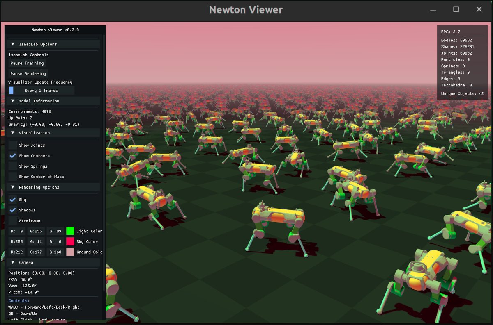
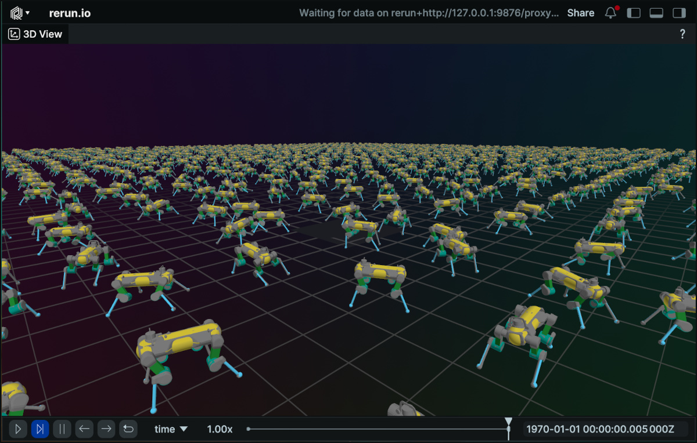

# 시각화

Isaac Lab은 실시간 시뮬레이션 검사 및 디버깅을 위한 몇 가지 가벼운 시각화 도구를 제공합니다. 센서 데이터를 처리하는 렌더러와 달리, 시각화 도구는 빠른 인터랙티브 피드백을 위해 설계되었습니다.

선택한 물리 엔진이나 렌더링 백엔드에 관계없이 모든 시각화 도구를 사용할 수 있습니다.

## 개요

Isaac Lab은 다양한 사용 사례에 최적화된 세 가지 시각화 백엔드를 지원합니다.

#### 시각화 도구 비교

| 시각화 도구    | 최적의 용도                        | 주요 기능                                  |
|---------------|-------------------------------------|--------------------------------------------|
| **Omniverse** | 높은 정확도, Isaac Sim 통합        | USD, 시각적 마커, 실시간 플롯              |
| **Newton**    | 빠른 반복                           | 낮은 오버헤드, 시각적 마커                 |
| **Rerun**     | 원격 시청, 재생                     | 웹뷰어, 타임 스크러빙, 녹화 내보내기       |

*다음 시각화 도구들은 Isaac-Velocity-Flat-Anymal-D-v0 환경을 훈련하는 동안 보여집니다.*



## 빠른 시작

명령줄에서 `--visualizer` 옵션을 사용하여 시각화 도구를 실행합니다:

```bash
# 모든 시각화 도구 실행
python scripts/reinforcement_learning/rsl_rl/train.py --task Isaac-Cartpole-v0 --visualizer omniverse newton rerun

# Newton 시각화 도구만 실행
python scripts/reinforcement_learning/rsl_rl/train.py --task Isaac-Cartpole-v0 --visualizer newton
```

`--headless` 옵션이 제공되면 시각화 도구가 실행되지 않습니다.

#### 참고
앞으로 `--headless` 인수는 `--visualizer` 인수와의 혼란을 방지하기 위해 향후 버전에서 사용되지 않을 수 있습니다. 현재는 `--headless`가 우선이며 모든 시각화 도구를 비활성화합니다.

### 구성

명령줄을 사용하여 시각화 도구를 실행하면 기본 시각화 도구 구성이 사용됩니다. 기본 구성은 `source/isaaclab/isaaclab/visualizers`에서 찾아서 편집할 수 있습니다.

`SimulationCfg`에 새로운 `VisualizerCfg` 인스턴스를 정의하여 코드에서도 사용자 지정 시각화 도구를 구성할 수 있습니다. 예를 들어:

```python
from isaaclab.sim import SimulationCfg
from isaaclab.visualizers import NewtonVisualizerCfg, OVVisualizerCfg, RerunVisualizerCfg

sim_cfg = SimulationCfg(
    visualizer_cfgs=[
        OVVisualizerCfg(
            viewport_name="시각화 도구 뷰포트",
            create_viewport=True,
            dock_position="SAME",
            window_width=1280,
            window_height=720,
            camera_position=(0.0, 0.0, 20.0), # 높은 탑다운 뷰
            camera_target=(0.0, 0.0, 0.0),
        ),
        NewtonVisualizerCfg(
            camera_position=(5.0, 5.0, 5.0), # 가까운 쿼터 뷰
            camera_target=(0.0, 0.0, 0.0),
            show_joints=True,
        ),
        RerunVisualizerCfg(
            keep_historical_data=True,
            keep_scalar_history=True,
            record_to_rrd="my_training.rrd",
        ),
    ]
)
```

## 시각화 도구 백엔드

### Omniverse 시각화 도구

**주요 기능:**

- 네이티브 USD 스테이지 통합
- 디버깅을 위한 시각화 마커 (화살표, 프레임, 점 등)
- 훈련 메트릭스 모니터링을 위한 실시간 플롯
- 완전한 Isaac Sim 렌더링 기능 및 도구

**핵심 구성:**

```python
from isaaclab.visualizers import OVVisualizerCfg

visualizer_cfg = OVVisualizerCfg(
    # 뷰포트 설정
    viewport_name="시각화 도구 뷰포트",      # 뷰포트 창 이름
    create_viewport=True,                     # 새 뷰포트 생성 vs. 기존 뷰포트 사용
    dock_position="SAME",                     # 도킹: 'LEFT', 'RIGHT', 'BOTTOM', 'SAME'
    window_width=1280,                        # 뷰포트 너비 (픽셀)
    window_height=720,                        # 뷰포트 높이 (픽셀)

    # 카메라 설정
    camera_position=(8.0, 8.0, 3.0),         # 초기 카메라 위치 (x, y, z)
    camera_target=(0.0, 0.0, 0.0),           # 카메라가 바라볼 대상

    # 기능 토글
    enable_markers=True,                      # 시각화 마커 활성화
    enable_live_plots=True,                   # 실시간 플롯 활성화 (프레임 자동 확장)
)
```

### Newton 시각화 도구

**주요 기능:**

- 낮은 오버헤드의 가벼운 OpenGL 렌더링
- 시각화 마커 (관절, 접촉, 스프링, 질량중심)
- 훈련 및 렌더링 일시 정지 컨트롤
- 성능 튜닝을 위한 조정 가능한 업데이트 주파수
- 일부 사용자 지정 렌더링 옵션 (그림자, 하늘, 와이어프레임)

**인터랙티브 컨트롤:**

| 키/입력                        | 동작                                     |
|----------------------------------|--------------------------------------------|
| **W, A, S, D** 또는 **화살표 키** | 앞쪽 / 왼쪽 / 뒤쪽 / 오른쪽              |
| **Q, E**                         | 아래 / 위                                  |
| **Left Click + Drag**            | 둘러보기                                   |
| **마우스 스크롤**                 | 줌 인/아웃                                |
| **스페이스**                     | 렌더링 일시 정지/재개 (물리 시뮬레이션은 계속됨) |
| **H**                            | UI 사이드바 토글                           |
| **ESC**                          | 뷰어 종료                                 |

**핵심 구성:**

```python
from isaaclab.visualizers import NewtonVisualizerCfg

visualizer_cfg = NewtonVisualizerCfg(
    # 창 설정
    window_width=1920,                        # 창 너비 (픽셀)
    window_height=1080,                       # 창 높이 (픽셀)

    # 카메라 설정
    camera_position=(8.0, 8.0, 3.0),         # 초기 카메라 위치 (x, y, z)
    camera_target=(0.0, 0.0, 0.0),           # 카메라가 바라볼 대상

    # 성능 튜닝
    update_frequency=1,                       # N 프레임마다 업데이트 (1=매 프레임)

    # 물리 디버그 시각화
    show_joints=False,                        # 관절 시각화 표시
    show_contacts=False,                      # 접촉 점 및 법선 표시
    show_springs=False,                       # 스프링 제약 표시
    show_com=False,                           # 질량중심 마커 표시

    # 렌더링 옵션
    enable_shadows=True,                      # 그림자 렌더링 활성화
    enable_sky=True,                          # 하늘 렌더링 활성화
    enable_wireframe=False,                   # 와이어프레임 모드 활성화

    # 색상 커스터마이징
    background_color=(0.53, 0.81, 0.92),     # 하늘/배경 색상 (RGB [0,1])
    ground_color=(0.18, 0.20, 0.25),         # 바닥 평면 색상 (RGB [0,1])
    light_color=(1.0, 1.0, 1.0),             # 방향성 조명 색상 (RGB [0,1])
)
```

### Rerun 시각화 도구

**주요 기능:**

- 로컬 또는 원격 브라우저에서 접근 가능한 웹 뷰어 인터페이스
- 메타데이터 로깅 및 필터링
- 오프라인 재생을 위한 .rrd 파일 녹화 (.rrd 파일은 웹 뷰어에서 ctrl+O로 열 수 있음)
- 녹화의 타임 스크러빙 및 재생 컨트롤

**핵심 구성:**

```python
from isaaclab.visualizers import RerunVisualizerCfg

visualizer_cfg = RerunVisualizerCfg(
    # 서버 설정
    app_id="isaaclab-simulation",             # 뷰어를 위한 애플리케이션 식별자
    web_port=9090,                            # 로컬 웹 뷰어 포트 (브라우저에서 실행)

    # 카메라 설정
    camera_position=(8.0, 8.0, 3.0),         # 초기 카메라 위치 (x, y, z)
    camera_target=(0.0, 0.0, 0.0),           # 카메라가 바라볼 대상

    # 기록 설정
    keep_historical_data=False,               # 타임 스크러빙을 위한 변환 유지
    keep_scalar_history=False,                # 스칼라/플롯 기록 유지

    # 녹화
    record_to_rrd="recording.rrd",            # .rrd 파일 저장 경로 (None = 녹화 없음)
)
```

## 성능 참고

대규모 환경 시각화 시 오버헤드를 줄이려면 다음을 고려하세요:

- Omniverse 또는 Rerun 대신 Newton 사용
- 창 크기 감소
- 더 높은 업데이트 주파수
- 사용하지 않을 때 시각화 도구 일시 정지

## 제한 사항

**Rerun 시각화 도구 성능**

Rerun 웹 기반 시각화 도구는 대규모 환경을 시각화할 때 성능 문제나 충돌이 발생할 수 있습니다. 대규모 시뮬레이션의 경우 Newton 시각화 도구를 사용하는 것이 좋습니다. 또는 `--num_envs`를 사용하여 환경 수를 덮어쓰고 감소시켜 부하를 줄일 수 있습니다:

```bash
python scripts/reinforcement_learning/rsl_rl/train.py --task Isaac-Cartpole-v0 --visualizer rerun --num_envs 512
```

#### 참고
향후 기능에서는 환경의 일부만 시각화하여 시각화 성능을 개선하고 리소스 사용량을 줄이면서 백그라운드에서 전체 규모 훈련을 유지할 수 있도록 지원할 예정입니다.

**Rerun 시각화 도구 FPS 제어**

Rerun 시각화 도구 UI의 FPS 제어가 모든 구성에서 시각화 프레임 속도에 영향을 미치지 않을 수 있습니다.

**Newton 시각화 도구 접촉 및 질량중심 마커**

접촉 및 질량중심 마커는 현재 Newton 시각화 도구에서 지원되지 않습니다. 이는 향후 릴리스에서 해결될 예정입니다.

**Newton 시각화 도구 CUDA/OpenGL 상호운용성 경고**

일부 시스템 구성에서 Newton 시각화 도구는 CUDA/OpenGL 상호운용성에 대한 경고를 표시할 수 있습니다:

```text
Warning: Could not get MSAA config, falling back to non-AA.
Warp CUDA error 999: unknown error (in function wp_cuda_graphics_register_gl_buffer)
Warp UserWarning: Could not register GL buffer since CUDA/OpenGL interoperability
is not available. Falling back to copy operations between the Warp array and the
OpenGL buffer.
```

시각화 도구는 여전히 올바르게 작동하지만, 직접 GPU 메모리 공유 대신 CPU 복사 작업으로 대체되어 성능이 저하될 수 있습니다.
