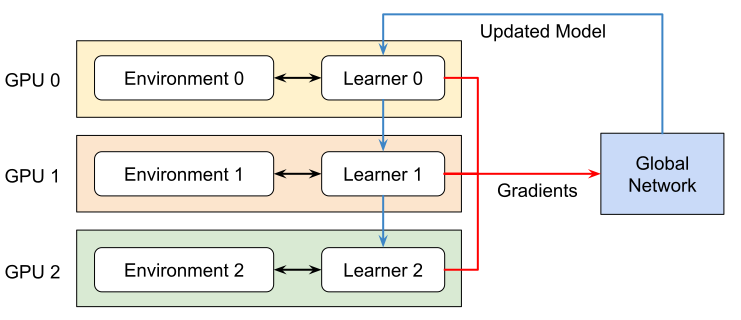
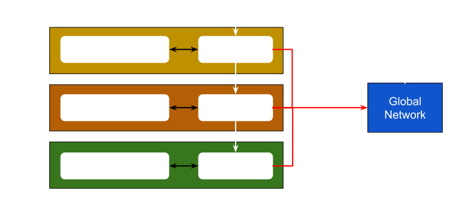

# 다중 GPU 및 다중 노드 훈련

Isaac Lab은 다중 GPU 및 다중 노드 강화 학습을 지원합니다. 현재 이 기능은 RL-Games, RSL-RL 및 skrl 라이브러리 워크플로우에서만 사용할 수 있습니다. 다른 워크플로우로 이 기능을 확장하는 작업을 진행 중입니다.

#### 주의
다중 GPU 및 다중 노드 훈련은 Linux에서만 지원됩니다. 현재 Windows 지원은 제공되지 않습니다. 이는 Windows에서 NCCL 라이브러리의 제한 사항 때문입니다.

## 다중 GPU 훈련

Isaac Lab은 다음 다중 GPU 훈련 프레임워크를 지원합니다:

* [Torchrun](https://docs.pytorch.org/docs/stable/elastic/run.html) (PyTorch 분산 기반)
* [JAX 분산](https://jax.readthedocs.io/en/latest/jax.distributed.html)

### Pytorch Torchrun 구현

다중 GPU 훈련을 관리하기 위해 [Pytorch Torchrun](https://docs.pytorch.org/docs/stable/elastic/run.html)을 사용합니다. Torchrun은 다음과 같이 분산 훈련을 관리합니다:

* **프로세스 관리**: 각 GPU당 하나의 프로세스를 시작하며, 각 프로세스는 특정 GPU에 할당됩니다.
* **스크립트 실행**: 각 프로세스에서 동일한 훈련 스크립트(예: RL Games 트레이너)를 실행합니다.
* **환경 인스턴스**: 각 프로세스가 Isaac Lab 환경을 독립적으로 인스턴스화합니다.
* **그래디언트 동기화**: 모든 프로세스 간의 그래디언트를 집계하고, 각 훈련 단계 후에 동기화된 그래디언트를 모든 프로세스로 브로드캐스트합니다.

이 설정의 핵심 구성 요소는 다음과 같습니다:

* **Torchrun**: 프로세스 생성, 통신 및 그래디언트 동기화를 처리합니다.
* **RL 라이브러리**: 실제 훈련 알고리즘을 실행하는 강화 학습 라이브러리입니다.
* **Isaac Lab**: 각 프로세스가 독립적으로 인스턴스화하는 시뮬레이션 환경을 제공합니다.

내부적으로 Torchrun은 [DistributedDataParallel](https://docs.pytorch.org/docs/2.7/notes/ddp.html#internal-design) 모듈을 사용하여 분산 훈련을 관리합니다. Torchrun을 사용한 다중 GPU 훈련 시 다음과 같은 일이 발생합니다:

* 각 GPU가 독립적인 프로세스를 실행합니다.
* 각 프로세스가 전체 훈련 스크립트를 실행합니다.
* 각 프로세스가 다음을 유지합니다:
  * Isaac Lab 환경 인스턴스 (병렬 환경 *n*개 포함)
  * 정책 네트워크 복사본
  * 롤아웃 수집을 위한 경험 버퍼
* 모든 프로세스는 그래디언트 업데이트에서만 동기화됩니다.

Torchrun의 작동 방식에 대한 자세한 내용은 다음을 참조하세요:
[PyTorch Docs: DistributedDataParallel - Internal Design](https://pytorch.org/docs/stable/notes/ddp.html#internal-design).

### JAX 구현

JAX에서는 [skrl.utils.distributed.jax](https://skrl.readthedocs.io/en/latest/api/utils/distributed.html)를 사용합니다. ML 프레임워크가 단일 프로그램 호출로부터 자동으로 여러 프로세스를 시작하지 않기 때문에, skrl 라이브러리는 이를 시작하는 모듈을 제공합니다.


<br/>

### 다중 GPU 훈련 실행

여러 GPU로 훈련하려면 다음 명령을 사용합니다. 여기서 `--nproc_per_node`는 사용 가능한 GPU 수를 나타냅니다:

### rl_games

```shell
python -m torch.distributed.run --nnodes=1 --nproc_per_node=2 scripts/reinforcement_learning/rl_games/train.py --task=Isaac-Cartpole-v0 --headless --distributed
```

### rsl_rl

```shell
python -m torch.distributed.run --nnodes=1 --nproc_per_node=2 scripts/reinforcement_learning/rsl_rl/train.py --task=Isaac-Cartpole-v0 --headless --distributed
```

### skrl

#### PyTorch

```shell
python -m torch.distributed.run --nnodes=1 --nproc_per_node=2 scripts/reinforcement_learning/skrl/train.py --task=Isaac-Cartpole-v0 --headless --distributed
```

#### JAX

```shell
python -m skrl.utils.distributed.jax --nnodes=1 --nproc_per_node=2 scripts/reinforcement_learning/skrl/train.py --task=Isaac-Cartpole-v0 --headless --distributed --ml_framework jax
```

## 다중 노드 훈련

단일 머신에서의 다중 GPU를 넘어 훈련 규모를 확장하려면 여러 노드에서 훈련하는 것도 가능합니다. 여러 노드/머신에서 훈련하려면 각 노드에서 개별 프로세스를 시작해야 합니다.

마스터 노드의 경우, 다음 명령을 사용합니다. 여기서 `--nproc_per_node`는 사용 가능한 GPU 수를 나타내고, `--nnodes`는 노드 수를 나타냅니다:

### rl_games

```shell
python -m torch.distributed.run --nproc_per_node=2 --nnodes=2 --node_rank=0 --master_addr=<ip_of_master> --master_port=5555 scripts/reinforcement_learning/rl_games/train.py --task=Isaac-Cartpole-v0 --headless --distributed
```

### rsl_rl

```shell
python -m torch.distributed.run --nproc_per_node=2 --nnodes=2 --node_rank=0 --master_addr=<ip_of_master> --master_port=5555 scripts/reinforcement_learning/rsl_rl/train.py --task=Isaac-Cartpole-v0 --headless --distributed
```

### skrl

#### PyTorch

```shell
python -m torch.distributed.run --nproc_per_node=2 --nnodes=2 --node_rank=0 --master_addr=<ip_of_master> --master_port=5555 scripts/reinforcement_learning/skrl/train.py --task=Isaac-Cartpole-v0 --headless --distributed
```

#### JAX

```shell
python -m skrl.utils.distributed.jax --nproc_per_node=2 --nnodes=2 --node_rank=0 --coordinator_address=ip_of_master_machine:5555 scripts/reinforcement_learning/skrl/train.py --task=Isaac-Cartpole-v0 --headless --distributed --ml_framework jax
```

참고: 포트(`5555`)는 다른 사용 가능한 포트로 대체할 수 있습니다.

비마스터 노드의 경우, 다음 명령을 사용하고 `--node_rank`를 각 머신의 인덱스로 바꾸세요:

### rl_games

```shell
python -m torch.distributed.run --nproc_per_node=2 --nnodes=2 --node_rank=1 --master_addr=<ip_of_master> --master_port=5555 scripts/reinforcement_learning/rl_games/train.py --task=Isaac-Cartpole-v0 --headless --distributed
```

### rsl_rl

```shell
python -m torch.distributed.run --nproc_per_node=2 --nnodes=2 --node_rank=1 --master_addr=<ip_of_master> --master_port=5555 scripts/reinforcement_learning/rsl_rl/train.py --task=Isaac-Cartpole-v0 --headless --distributed
```

### skrl

#### PyTorch

```shell
python -m torch.distributed.run --nproc_per_node=2 --nnodes=2 --node_rank=1 --master_addr=<ip_of_master> --master_port=5555 scripts/reinforcement_learning/skrl/train.py --task=Isaac-Cartpole-v0 --headless --distributed
```

#### JAX

```shell
python -m skrl.utils.distributed.jax --nproc_per_node=2 --nnodes=2 --node_rank=1 --coordinator_address=ip_of_master_machine:5555 scripts/reinforcement_learning/skrl/train.py --task=Isaac-Cartpole-v0 --headless --distributed --ml_framework jax
```

다중 노드 훈련에 대한 PyTorch의 자세한 내용은 다음을 방문하세요:
[PyTorch 문서](https://pytorch.org/tutorials/intermediate/ddp_series_multinode.html).
다중 노드 훈련에 대한 JAX의 자세한 내용은 다음을 방문하세요:
[skrl 문서](https://skrl.readthedocs.io/en/latest/api/utils/distributed.html) 및
[JAX 문서](https://jax.readthedocs.io/en/latest/multi_process.html).

#### 참고
PyTorch 문서에서 언급한 바와 같이, “다중 노드 훈련은 노드 간 통신 지연 시간으로 병목 현상이 발생합니다”. 이 지연 시간이 높을 경우, 다중 노드 훈련이 단일 노드 인스턴스에서 실행하는 것보다 성능이 낮을 수 있습니다.
