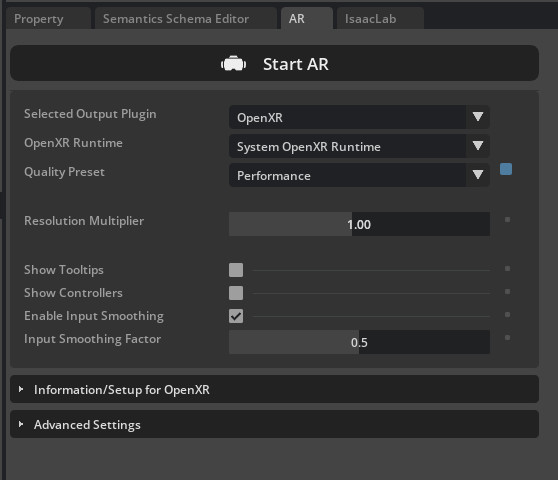
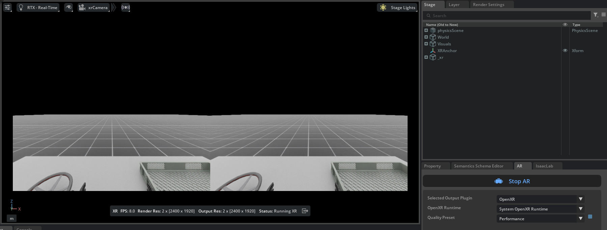
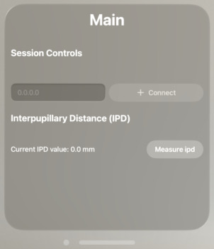
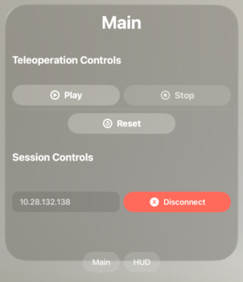
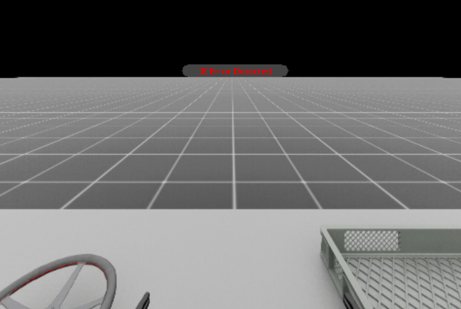
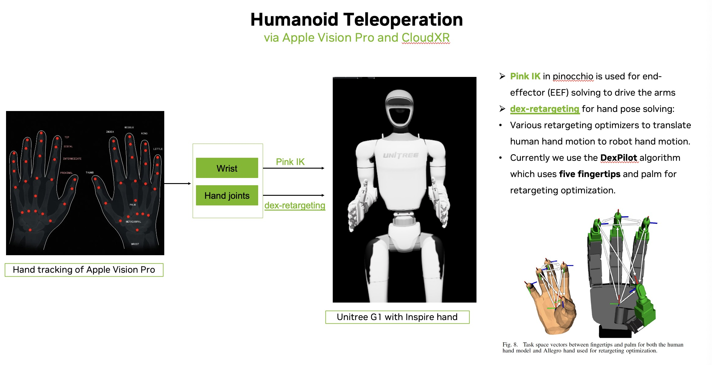
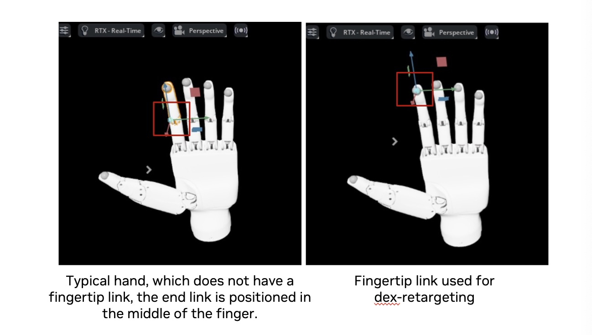

<a id="cloudxr-teleoperation"></a>

# CloudXR 텔레오퍼레이션 설정하기

[NVIDIA CloudXR](https://developer.nvidia.com/cloudxr-sdk)은 어떤 네트워크에서도 확장 현실(XR) 디바이스로 고충실도 몰입형 스트리밍을 지원합니다.

Isaac Lab 개발자는 Isaac Lab과 CloudXR을 함께 사용하여 공간 정확도를 높이고/dexterous 로봇의 텔레오퍼레이션을 위한 손 추적을 제공하는 몰입형 XR 렌더링이 필요한 텔레오퍼레이션 워크플로를 구축할 수 있습니다.

이 워크플로에서 Isaac Lab은 로봇 시뮬레이션의 스테레오 뷰를 렌더링하여 CloudXR에 전달하고, CloudXR은 이를 인코딩하여 낮은 지연시간의 GPU 가속 파이프라인을 사용해 호환되는 XR 디바이스로 실시간 스트리밍합니다. 손 추적 데이터 같은 제어 입력은 XR 디바이스에서 CloudXR을 통해 Isaac Lab으로 다시 전송되어 로봇을 제어하는 데 사용될 수 있습니다.

이 가이드에서는 CloudXR과 [Apple Vision Pro](https://www.apple.com/apple-vision-pro/)를 Isaac Lab에서 몰입형 스트리밍과 텔레오퍼레이션에 사용하는 방법을 설명합니다.

#### 참고
지원되는 손 추출 주변 기기에 대한 자세한 내용은 [Manus + Vive Hand Tracking](#manus-vive-handtracking)을 참조하세요.

#### 참고
**Meta Quest 3 및 Pico 4 Ultra 지원 (Early Access)**

Meta Quest 3 및 Pico 4 Ultra는 [CloudXR Early Access 프로그램](https://developer.nvidia.com/cloudxr-sdk-early-access-program/join)을 통해 이제 지원됩니다. 프로그램에 참여하려면 isaac 사용 사례를 언급해야 합니다. 승인되면 NGC 설정을 위한 이메일을 받게 되며, [CloudXR.js with Isaac Teleop samples](https://catalog.ngc.nvidia.com/orgs/nvidia/resources/cloudxr-js-early-access?version=6.0.0-beta)를 다운로드하고 해당 가이드를 따를 수 있습니다. Pico 4 Ultra는 HTTPS 모드를 사용해야 합니다(NGC 문서에서 세부 정보를 확인할 수 있습니다). 일반 출시는 Isaac Lab의 미래 버전에서 제공됩니다.

## 개요

Isaac Lab과 CloudXR을 함께 사용하면 다음과 같은 구성 요소가 포함됩니다.

* **Isaac Lab**은 로봇 환경을 시뮬레이션하고 텔레오퍼레이터로부터 받은 제어 데이터를 적용하는 데 사용됩니다.
* **NVIDIA CloudXR Runtime**은 Isaac Lab 워크스테이션의 Docker 컨테이너에서 실행되며, Isaac Lab의 가상 시뮬레이션을 호환되는 XR 디바이스로 스트리밍합니다.
* **Isaac XR Teleop Sample Client**는 Apple Vision Pro용 샘플 앱으로, CloudXR을 사용하여 Isaac Lab 시뮬레이션의 몰입형 스트리밍과 텔레오퍼레이션을 가능하게 합니다.

이 가이드에서는 다음 방법을 단계별로 안내합니다:

* [Isaac Lab과 함께 CloudXR Runtime 실행하기](#run-isaac-lab-with-the-cloudxr-runtime)
* [Apple Vision Pro를 사용한 텔레오퍼레이션](#use-apple-vision-pro) - [Apple Vision Pro용 Isaac XR Teleop 샘플 클라이언트 앱 빌드 및 설치하기](#build-apple-vision-pro), [Apple Vision Pro로 Isaac Lab 로봇 텔레오퍼레이션하기](#teleoperate-apple-vision-pro), [Manus + Vive Hand Tracking](#manus-vive-handtracking) 포함
* [Isaac Lab에서 XR용 개발](#develop-xr-isaac-lab) - [XR 확장이 활성화된 Isaac Lab 실행하기](#run-isaac-lab-with-xr), [XR 장면 배치 구성하기](#configure-scene-placement), [XR 성능 최적화하기](#optimize-xr-performance) 포함
* [XR 디바이스 입력을 사용한 로봇 제어](#control-robot-with-xr) - [OpenXR 디바이스](#openxr-device-architecture), [제어 로봇을 위한 XR Retargeting 아키텍처](#control-robot-with-xr-retargeters), [XR UI 이벤트를 위한 콜백 추가하기 구현 방법](#control-robot-with-xr-callbacks) 포함

또한 [알려진 문제](#xr-known-issues)도 다룹니다.

## 시스템 요구 사항

Isaac Lab과 CloudXR을 사용하기 전에 다음 시스템 요구 사항을 검토하세요:

> * Isaac Lab 워크스테이션
>   * Ubuntu 22.04 또는 Ubuntu 24.04
>   * 120Hz 물리 시뮬레이션으로 45 FPS 유지하기 위한 하드웨어 요구 사항:
>     : * CPU: 16코어 AMD Ryzen Threadripper Pro 5955WX 이상
>       * 메모리: 64GB RAM
>       * GPU: 1x RTX PRO 6000 GPU(또는 동등한 성능의 1x RTX 5090 이상) 또는 그 이상
>   * 드라이버 요구 사항에 대한 자세한 내용은 [Technical Requirements](https://docs.omniverse.nvidia.com/materials-and-rendering/latest/common/technical-requirements.html) 가이드를 참조하세요
>   * [Docker](https://docs.docker.com/desktop/install/linux-install/) 26.0.0+, [Docker Compose](https://docs.docker.com/compose/install/linux/#install-using-the-repository) 2.25.0+, 및 [NVIDIA Container Toolkit](https://github.com/NVIDIA/nvidia-container-toolkit). Isaac Lab [Docker 가이드](../deployment/docker.md#deployment-docker)를 참조하여 설치 방법을 확인하세요.
> * Apple Vision Pro
>   * visionOS 26
>   * Apple M3 Pro 칩(최소 5개의 성능 코어와 6개의 효율성 코어를 갖춘 11코어 CPU)
>   * 16GB 통합 메모리
>   * 256GB SSD
> * Isaac XR Teleop 샘플 클라이언트 앱을 Apple Vision Pro용으로 빌드하기 위한 Apple Silicon 기반 Mac
>   * macOS Sequoia 15.6 이상
>   * Xcode 26.0
> * Wi-Fi 6 지원 라우터
>   * 강력한 무선 연결은 고품질 스트리밍 경험에 필수적입니다. [Omniverse Spatial Streaming](https://docs.omniverse.nvidia.com/avp/latest/setup-network.html)의 요구 사항을 참조하여 추가 세부 정보를 확인하세요.
>   * 동시 사용으로 인해 품질이 저하될 수 있으므로 전용 라우터 사용을 권장합니다.
>   * Apple Vision Pro와 Isaac Lab 워크스테이션은 서로 IP 도달 가능해야 합니다(참고: 많은 기관 무선 네트워크에서는 디바이스 간 연결을 차단하여 Apple Vision Pro가 Isaac Lab 워크스테이션을 네트워크에서 찾지 못하는 경우가 발생할 수 있음)

#### 참고
DGX Spark를 사용하는 경우 [DGX Spark 제한 사항](https://isaac-sim.github.io/IsaacLab/v2.3.2/source/setup/installation/index.html#dgx-spark-details-and-limitations)을 확인하여 호환성을 검토하세요.

<a id="run-isaac-lab-with-the-cloudxr-runtime"></a>

## Isaac Lab과 함께 CloudXR Runtime 실행하기

CloudXR Runtime은 Isaac Lab 워크스테이션의 Docker 컨테이너에서 실행되며, Isaac Lab 시뮬레이션을 호환되는 XR 디바이스로 스트리밍하는 역할을 담당합니다.

[Docker](https://docs.docker.com/desktop/install/linux-install/), [Docker Compose](https://docs.docker.com/compose/install/linux/#install-using-the-repository), 및 [NVIDIA Container Toolkit](https://github.com/NVIDIA/nvidia-container-toolkit)이 Isaac Lab [Docker 가이드](../deployment/docker.md#deployment-docker)에 설명된 대로 Isaac Lab 워크스테이션에 설치되어 있는지 확인하세요.

또한 다음 명령을 실행하여 CloudXR에서 사용하는 포트로의 연결이 방화벽에서 허용되는지 확인하세요:

```bash
sudo ufw allow 47998:48000,48005,48008,48012/udp
sudo ufw allow 48010/tcp
```

CloudXR Runtime Docker 컨테이너를 실행하는 두 가지 옵션이 있습니다.

### 옵션 1 (권장): Docker Compose를 사용하여 Isaac Lab과 CloudXR Runtime<br/>           컨테이너를 함께 실행하기

Isaac Lab 워크스테이션에서:

1. Isaac Lab 저장소의 루트에서 Isaac Lab `container.py` 스크립트를 사용하여 Isaac Lab과 CloudXR Runtime 컨테이너를 시작합니다.
   ```bash
   ./docker/container.py start \
       --files docker-compose.cloudxr-runtime.patch.yaml \
       --env-file .env.cloudxr-runtime
   ```

   프롬프트가 표시되면 Isaac Sim UI를 보기 위해 필요한 X11 forwarding을 활성화하세요.

   #### 참고
   `container.py` 스크립트는 Docker Compose를 둘러싼 얇은 래퍼입니다. 추가적인 `--files` 및 `--env-file` 인수는 기본 Docker Compose 구성을 강화하여 CloudXR Runtime도 함께 실행하도록 합니다.

   `container.py` 및 Docker Compose를 사용한 Isaac Lab 실행에 대한 자세한 내용은
   [Docker 가이드](../deployment/docker.md#deployment-docker)를 참조하세요.
2. 다음 명령으로 Isaac Lab 기본 컨테이너에 진입합니다:
   ```bash
   ./docker/container.py enter base
   ```

   Isaac Lab 기본 컨테이너 내에서 XR을 사용하는 Isaac Lab 스크립트를 실행할 수 있습니다.
3. 다음 명령으로 예제 텔레오퍼레이션 작업을 실행합니다:
   ```bash
   ./isaaclab.sh -p scripts/environments/teleoperation/teleop_se3_agent.py \
       --task Isaac-PickPlace-GR1T2-Abs-v0 \
       --teleop_device handtracking \
       --enable_pinocchio
   ```
4. 다음 단계를 위해 컨테이너를 실행 상태로 유지하세요. 하지만 완료되면 다음 명령으로 컨테이너를 중지할 수 있습니다:
   ```bash
   ./docker/container.py stop \
       --files docker-compose.cloudxr-runtime.patch.yaml \
       --env-file .env.cloudxr-runtime
   ```

### 옵션 2: 로컬 프로세스로 Isaac Lab 실행하고 Docker로 CloudXR Runtime 컨테이너 실행하기

Isaac Lab은 로컬 프로세스로 실행되어 CloudXR Runtime Docker 컨테이너에 연결할 수 있습니다. 그러나 이 방법은 Isaac Lab 인스턴스와 CloudXR Runtime 사이의 통신을 위한 공유 디렉터리를 수동으로 지정해야 합니다.

Isaac Lab 워크스테이션에서:

1. Isaac Lab 저장소의 루트에서 임시 캐시 파일을 위한 로컬 폴더를 생성합니다:
   ```bash
   mkdir -p $(pwd)/openxr
   ```
2. 위에서 생성한 디렉터리를 컨테이너의 `/openxr` 디렉터리에 마운트하여 CloudXR Runtime을 시작합니다:
   ```bash
   docker run -it --rm --name cloudxr-runtime \
       --user $(id -u):$(id -g) \
       --gpus=all \
       -e "ACCEPT_EULA=Y" \
       --mount type=bind,src=$(pwd)/openxr,dst=/openxr \
       -p 48010:48010 \
       -p 47998:47998/udp \
       -p 47999:47999/udp \
       -p 48000:48000/udp \
       -p 48005:48005/udp \
       -p 48008:48008/udp \
       -p 48012:48012/udp \
       nvcr.io/nvidia/cloudxr-runtime:5.0.1
   ```

   #### 참고
   `all` 대신 특정 GPU를 선택하는 경우 Isaac Lab도 해당 GPU에서 실행되도록 해야 합니다.
3. Isaac Lab을 실행할 새 터미널에서 위에서 생성한 디렉터리를 참조하는 다음 환경 변수를 내보냅니다:
   ```bash
   export XDG_RUNTIME_DIR=$(pwd)/openxr/run
   export XR_RUNTIME_JSON=$(pwd)/openxr/share/openxr/1/openxr_cloudxr.json
   ```

   이제 XR을 사용하는 Isaac Lab 스크립트를 실행할 수 있습니다.
4. 다음 명령으로 예제 텔레오퍼레이션 작업을 실행합니다:
   ```bash
   ./isaaclab.sh -p scripts/environments/teleoperation/teleop_se3_agent.py \
       --task Isaac-PickPlace-GR1T2-Abs-v0 \
       --teleop_device handtracking \
       --enable_pinocchio
   ```

Isaac Lab과 CloudXR Runtime이 실행 중인 상태에서:

1. Isaac Sim UI에서 **AR** 패널을 찾고 다음 옵션을 선택합니다:
   * 선택한 출력 플러그인: **OpenXR**
   * OpenXR 런타임: **System OpenXR Runtime**

   

   #### 참고
   Isaac Sim에서는 여러 OpenXR 런타임 옵션 중 선택할 수 있습니다:
   * **System OpenXR Runtime**: Isaac Lab 외부에서 설치된 런타임 사용. 예를 들어 이 튜토리얼에서 Docker를 통해 설정된 CloudXR 런타임과 같습니다.
   * **CloudXR Runtime (5.0)**: 내장된 CloudXR 런타임 사용.
   * **Custom**: 사용자 지정 OpenXR 런타임을 지정하고 실행할 수 있습니다.
2. **Start AR** 를 클릭합니다.

   Viewport에서 두 눈의 렌더링이 표시되고, 상태가 “AR 프로파일이 활성화됨”으로 표시되어야 합니다.

   

   Isaac Lab은 이제 CloudXR 클라이언트로부터의 연결을 받을 준비가 되었습니다. 다음 섹션에서는 CloudXR 클라이언트를 빌드하고 연결하는 방법을 안내합니다.

<a id="use-apple-vision-pro"></a>

## Apple Vision Pro를 사용한 원격조작

이 섹션에서는 Apple Vision Pro용 Isaac XR Teleop 샘플 클라이언트를 빌드하고 설치하고, Isaac Lab에 연결하여 시뮬레이션 로봇을 원격조작하는 방법을 안내합니다.

<a id="build-apple-vision-pro"></a>

### Apple Vision Pro용 Isaac XR Teleop 샘플 클라이언트 앱 빌드 및 설치

Mac에서:

1. [Isaac XR Teleop 샘플 클라이언트](https://github.com/isaac-sim/isaac-xr-teleop-sample-client-apple) GitHub 저장소 복제:
   ```bash
   git clone git@github.com:isaac-sim/isaac-xr-teleop-sample-client-apple.git
   ```
2. Isaac Lab 버전과 일치하는 앱 버전을 체크아웃합니다:

   |   Isaac Lab 버전 | 클라이언트 앱 버전   |
   |---------------------|----------------------|
   |                 2.3 | v2.3.0               |
   |                 2.2 | v2.2.0               |
   |                 2.1 | v1.0.0               |
   ```bash
   git checkout <client_app_version>
   ```
3. 저장소의 README를 따라 Apple Vision Pro에 앱을 빌드하고 설치합니다.

<a id="teleoperate-apple-vision-pro"></a>

### Apple Vision Pro로 Isaac Lab 로봇 원격조작

Apple Vision Pro에 Isaac XR Teleop 샘플 클라이언트가 설치되면 Isaac Lab에 연결할 준비가 된 것입니다.

Isaac Lab 워크스테이션에서:

1. [CloudXR 런타임으로 Isaac Lab 실행하기](#run-isaac-lab-with-the-cloudxr-runtime)에 설명된 대로 Isaac Lab과 CloudXR이 모두 실행 중인지 확인합니다. 원격조작을 지원하는 스크립트로 Isaac Lab을 시작해야 합니다. 예를 들어:
   ```bash
   ./isaaclab.sh -p scripts/environments/teleoperation/teleop_se3_agent.py \
       --task Isaac-PickPlace-GR1T2-Abs-v0 \
       --teleop_device handtracking \
       --enable_pinocchio
   ```

   #### 참고
   위 스크립트는 Isaac Lab Docker 컨테이너 내부에서 실행해야 합니다(옵션 1, 권장), 또는 실행 중인 CloudXR 런타임 Docker 컨테이너와 공유되는 디렉터리에 환경 변수를 설정하여 실행해야 합니다(옵션 2).
2. **AR** 라는 이름의 패널을 찾습니다.
3. **Start AR** 를 클릭하고 뷰포트에서 두 눈의 렌더링이 표시되는지 확인합니다.

Apple Vision Pro에서:

1. Isaac XR Teleop 샘플 클라이언트를 엽니다. UI 창이 표시되어야 합니다:
   
2. Isaac Lab 워크스테이션의 IP 주소를 입력합니다.

   #### 참고
   Apple Vision Pro와 Isaac Lab 머신은 서로 IP로 연결 가능해야 합니다.

   많은 기관 무선 네트워크에서는 장치 간 연결이 차단될 수 있으므로, Apple Vision Pro가 Isaac Lab 워크스테이션을 찾지 못하는 문제를 방지하기 위해 전용 Wi-Fi 6 라우터 사용을 권장합니다.
3. **Connect** 를 클릭합니다.

   처음 연결을 시도할 때는 애플리케이션이 핸드 트래킹 및 로컬 네트워크 사용 권한에 대한 접근을 허용해야 할 수 있으며, 그 후에 다시 연결해야 합니다.
4. 잠시 후 Apple Vision Pro에서 Isaac Lab 시뮬레이션이 렌더링되고, 원격조작을 위한 컨트롤 세트가 표시되어야 합니다.
   
5. **Play** 를 클릭하여 시뮬레이션 로봇 원격조작을 시작합니다. 이제 로봇 이동이 손 움직임에 의해 제어되어야 합니다.

   UI 컨트롤을 사용하여 **Play**, **Stop**, **Reset** 을 반복하여 원격조작 세션을 제어할 수 있습니다.
6. 손을 움직여 시뮬레이션 로봇을 원격조작합니다.
   

   #### 참고
   빨간 점은 손 관절의 추적 위치를 나타냅니다. 점의 움직임과 로봇 움직임 간의 지연 또는 오프셋은 로봇 관절의 한계 및/또는 로봇 컨트롤러로 인해 발생할 수 있습니다.

   #### 참고
   역운동학 솔버가 유효한 해를 찾지 못할 경우 XR 기기 디스플레이에 오류 메시지가 표시됩니다. 이 상태에서 복구하려면 **Reset** 버튼을 클릭하여 로봇을 원래 자세로 돌려놓고 원격조작을 계속하세요.
   
7. 예제가 끝나면 **Disconnect** 를 클릭하여 Isaac Lab과의 연결을 끊습니다.

<a id="manus-vive-handtracking"></a>

### Manus + Vive 손 트래킹

Manus 장갑과 HTC Vive 트래커는 헤드셋의 광학 손 트래킹이 가려질 때 손 트래킹을 제공할 수 있습니다. 이 설정에는 Manus SDK 라이선스가 있는 Manus 장갑과 장갑에 부착된 Vive 트래커가 필요합니다. Isaac Sim 5.1 이상이 필요합니다.

Manus + Vive 트래킹을 사용한 원격조작 예제 실행:

### 설치 안내

Vive 트래커 통합은 libsurvive 라이브러리를 통해 제공됩니다.

설치하려면 저장소를 복제하고 Python 패키지를 빌드한 후 필수 udev 규칙을 설치합니다. Isaac Lab 가상 환경에서 다음 명령을 실행합니다:

```bash
git clone https://github.com/collabora/libsurvive.git
cd libsurvive
pip install scikit-build
python setup.py install

sudo cp ./useful_files/81-vive.rules /etc/udev/rules.d/
sudo udevadm control --reload-rules && sudo udevadm trigger
```

Manus 통합은 Isaac Sim 원격조작 입력 플러그인 프레임워크를 통해 제공됩니다. [isaac-teleop-device-plugins](https://github.com/isaac-sim/isaac-teleop-device-plugins)의 빌드 및 설치 단계를 따라 플러그인을 설치합니다.

Isaac Lab을 실행할 터미널과 동일한 터미널에서:

```bash
export ISAACSIM_HANDTRACKER_LIB=<path to isaac-teleop-device-plugins>/build-manus-default/lib/libIsaacSimManusHandTracking.so
```

플러그인이 설치되면 원격조작 예제를 실행합니다:

```bash
./isaaclab.sh -p scripts/environments/teleoperation/teleop_se3_agent.py \
    --task Isaac-PickPlace-GR1T2-Abs-v0 \
    --teleop_device manusvive \
    --xr \
    --enable_pinocchio
```

권장 워크플로우는 Isaac Lab을 시작한 후 **Start AR** 를 클릭하고, 그 다음에 Manus 장갑, Vive 트래커 및 헤드셋을 착용하는 것입니다. 세션을 시작할 준비가 되면 음성 명령을 사용하여 Isaac XR teleop 샘플 클라이언트를 실행하고 Isaac Lab에 연결합니다.

Isaac Lab은 세션 초기 프레임 동안 Apple Vision Pro의 손목 포즈 데이터를 사용하여 Vive 트래커를 자동으로 보정합니다. 보정이 실패하는 경우(예: 빨간 점이 원격조작자의 손을 정확하게 따르지 않을 경우), Isaac Lab을 다시 시작하고 손을 palm-up 위치로 놓아 보정 신뢰도를 높이세요.

최적의 성능을 위해 라이스테이션을 손 위에 위치시키고 약간 아래로 기울이세요. 라이스테이션이 안정되도록 스탠드를 사용하는 것이 권장됩니다.

원격조작 중 작업이 수행되는 동안 손이 라이스테이션에 안정적이고 항상 보이도록 유지하세요. 참고: [베이스 스테이션 설치](https://www.vive.com/us/support/vive/category_howto/installing-the-base-stations.html) 및 [베이스 스테이션 설정 팁](https://www.vive.com/us/support/vive/category_howto/tips-for-setting-up-the-base-stations.html)

#### 참고
Manus Vive 기기를 처음 실행할 때 Vive 라이스테이션이 보정되려면 몇 초가 걸릴 수 있습니다. 이 시간 동안 Vive 트래커를 안정시키고 라이스테이션에 보이도록 유지하세요. 라이스테이션이 이동되거나 추적이 실패하거나 불안정해지면 `$XDG_RUNTIME_DIR/libsurvive/config.json`의 보정 파일을 삭제하여 보정을 강제할 수 있습니다. `XDG_RUNTIME_DIR`이 설정되지 않은 경우 기본 디렉터리는 `~/.config/libsurvive`입니다.

자세한 내용은 libsurvive 문서를 참조하세요: [libsurvive](https://github.com/collabora/libsurvive).

최적의 성능을 위해 라이스테이션을 손 위에 위치시키고 약간 아래로 기울이세요. 두 손이 모두 sichtbar하면 하나의 라이스테이션만으로 충분합니다. 라이스테이션이 안정되도록 스탠드를 사용하는 것이 권장됩니다.

#### 참고
자원 경합 및 충돌을 방지하려면 Manus와 Vive 장치를 서로 다른 USB 컨트롤러/버스에 연결하세요. `lsusb -t` 를 사용하여 다양한 버스를 식별하고 이에 따라 장치를 연결하십시오.

Vive 트래커는 안정적인 OpenXR 손 트래킹 손목 포즈에서 얻은 왼쪽 및 오른쪽 손목 관절에 자동으로 매핑됩니다. 이 자동 매핑 계산은 최대 2개의 Vive 트래커를 지원합니다. 2개 이상의 Vive 트래커가 감지되면 감지된 첫 두 트래커를 보정에 사용하며,これが正しいマッピングではない可能性があります。

<a id="develop-xr-isaac-lab"></a>

## Isaac Lab에서 XR 개발

이 섹션에서는 Isaac Lab에서 XR 환경을 개발하여 원격조작 워크플로우를 구축하는 방법을 안내합니다.

<a id="run-isaac-lab-with-xr"></a>

### XR 확장 기능이 활성화된 Isaac Lab 실행

XR에 필요한 확장 기능을 활성화하고 UI에서 AR 패널을 보려면 Isaac Lab을 XR 경험 파일과 함께 로드해야 합니다. 이는 [`app.AppLauncher`](../api/lab/isaaclab.app.md#isaaclab.app.AppLauncher)를 사용하는 모든 Isaac Lab 스크립트에 `--xr` 플래그를 전달하여 자동으로 수행할 수 있습니다.

예를 들어, [`Tutorials`](../tutorials/index.md#tutorials)의 모든 튜토리얼에서 `--xr` 플래그를 호출하여 XR을 활성화하고 사용할 수 있습니다.
additional `--xr` 플래그.

<a id="configure-scene-placement"></a>

### XR 씬 배치 구성

로봇 시뮬레이션을 XR 기기의 로컬 좌표 프레임 내에 배치하는 것은 XR 앵커를 사용하여 달성할 수 있으며, 환경 구성의 `xr` 필드(타입 `openxr.XrCfg`)를 통해 구성 가능합니다.

구체적으로, `openxr.XrCfg`의 `anchor_pos` 및 `anchor_rot` 필드로 지정된 포즈가 XR 기기의 로컬 좌표 프레임의 원점에 나타나며, 이는 바닥 위에 있어야 함을 의미합니다.

#### NOTE
Apple Vision Pro에서는 사용자 발밑 바닥의 특정 지점으로 로컬 좌표 프레임을 재설정하려면 디지털 크라운을 잡고 있으면 됩니다.

예를 들어, 로봇이 사용자의 위치에 나타나야 한다면, `anchor_pos` 및 `anchor_rot` 속성을 로봇 바로 아래 바닥 위의 포즈로 설정해야 합니다.

#### NOTE
XR 앵커 구성은 `openxr.OpenXRDevice`에서 앵커 위치에 프리미스를 생성하고 `xr/profile/ar/anchorMode` 및 `/xrstage/profile/ar/customAnchor` 설정을 수정함으로써 적용됩니다.

`openxr.OpenXRDevice`를 사용하지 않는 스크립트를 실행하는 경우, 이를 명시적으로 수행해야 합니다.

<a id="optimize-xr-performance"></a>

### XR 성능 최적화

### 물리 및 렌더 타임스텝 구성

고품질의 몰입형 경험을 제공하기 위해 시뮬레이션 렌더 타임스텝이 XR 기기 디스플레이 타임스텝과 대략적으로 일치하도록 하는 것이 권장됩니다.

또한 이 타임스텝이 실시간으로 시뮬레이션 및 렌더링될 수 있도록 하는 것도 중요합니다.

Apple Vision Pro 디스플레이는 90Hz로 실행되지만, 많은 Isaac Lab 시뮬레이션은 XR을 위한 스테레오 뷰 렌더링 시 90Hz 성능을 달성하지 못할 수 있으므로, Apple Vision Pro에서 최적의 경험을 위해서는 시뮬레이션 dt를 90Hz로 설정하고 렌더 간격을 2로 설정하는 것을 권장합니다. 즉, 두 번의 시뮬레이션 단계마다 한 번씩 렌더링되거나(즉, 45Hz), 성능이 허용되는 경우입니다.

요구 사항에 따라 시뮬레이션 dt를 더 낮게 또는 높게 설정할 수 있지만, 이는 XR에서 렌더링될 때 시뮬레이션이 더 빠르게 또는 더 느리게 보이게 할 수 있습니다.

환경의 타임스텝 구성은 환경의 `__post_init__` 함수에서 [`sim.SimulationCfg`](../api/lab/isaaclab.sim.md#isaaclab.sim.SimulationCfg)를 수정하여 재정의할 수 있습니다. 예를 들어:

```python
@configclass
class XrTeleopEnvCfg(ManagerBasedRLEnvCfg):

    def __post_init__(self):
        self.sim.dt = 1.0 / 90
        self.sim.render_interval = 2
```

또한 기본적으로 CloudXR 런타임은 Isaac Lab이 렌더링에 걸리는 시간을 기반으로 페이싱을 동적으로 조정하려고 시도합니다. 렌더 시간이 크게 변동될 경우, 이는 XR에서 렌더링될 때 시뮬레이션이 속도를 높이거나 낮추는 것처럼 보일 수 있습니다. 이 문제가 발생하는 경우, CloudXR 런타임을 시작할 때 환경 변수 `NV_PACER_FIXED_TIME_STEP_MS`를 정수 값으로 설정하여 고정된 타임스텝을 사용하도록 구성할 수 있습니다.

### 물리 계산을 CPU에서 실행 시도

현재 Isaac Lab 텔레포테이션 스크립트에 `--device cpu` 플래그를 사용하여 실행하는 것이 권장됩니다. 이로 인해 물리 계산을 CPU에서 수행하게 되며, 시뮬레이션에 단일 환경만 존재할 경우 지연 시간을 줄이는 데 도움이 될 수 있습니다.

<a id="control-robot-with-xr"></a>

### XR 기기 입력을 사용하여 로봇 제어

Isaac Lab은 XR 추적 데이터를 사용하여 시뮬레이션된 로봇을 제어할 수 있는 유연한 아키텍처를 제공합니다. 이 섹션에서는 이 아키텍처의 구성 요소와 이들이 어떻게 함께 작동하는지 설명합니다.

<a id="openxr-device-architecture"></a>

#### OpenXR 기기

`isaaclab.devices.OpenXRDevice`는 Isaac Lab에서 XR 기반 텔레포테이션을 가능하게 하는 핵심 구성 요소입니다. 이 장치는 CloudXR과 인터페이스를 통해 XR 헤드셋에서 추적 데이터를 받아 로봇 제어 명령으로 변환합니다.

핵심적으로, XR 텔레포테이션은 사용자 입력(예: 손 움직임 및 자세)을 로봇 제어 신호로 매핑하거나(즉, "리타겟팅")하는 것이 필요합니다. Isaac Lab은 OpenXRDevice 및 리타게이터 아키텍처를 통해 이를 간단하게 만듭니다. OpenXRDevice는 Isaac Sim의 OpenXR API를 통해 손 추적 데이터를 캡처한 다음, 이 데이터를 하나 이상의 리타게이터에 전달하여 로봇 행동으로 변환합니다.

OpenXRDevice는 또한 CloudXR을 사용할 때 XR 기기의 사용자 인터페이스와 통합되어 사용자가 XR 환경에서 직접 시뮬레이션 이벤트를 트리거할 수 있도록 합니다.

<a id="control-robot-with-xr-retargeters"></a>

#### 리타게팅 아키텍처

리타게이터는 원시 추적 데이터를 로봇에 의미 있는 제어 신호로 변환하는 특수 구성 요소입니다. 이들은 [`isaaclab.devices.RetargeterBase`](../api/lab/isaaclab.devices.md#isaaclab.devices.RetargeterBase) 인터페이스를 구현하며, OpenXRDevice 초기화 중에 전달됩니다.

Isaac Lab은 손 추적을 위한 세 가지 주요 리타게이터를 제공합니다:

### Se3RelRetargeter (`isaaclab.devices.openxr.retargeters.Se3RelRetargeter`)

* 상대 손 움직임을 기반으로 증가식 로봇 명령 생성
* 정밀 조작 작업에 가장 적합

### Se3AbsRetargeter (`isaaclab.devices.openxr.retargeters.Se3AbsRetargeter`)

* 손 위치를 직접 로봇 엔드이펙터 위치에 매핑
* 1:1 공간 제어 허용

### GripperRetargeter (`isaaclab.devices.openxr.retargeters.GripperRetargeter`)

* 엄지-검지 손가락 거리 기반으로 그리퍼 상태 제어
* 완전한 로봇 제어를 위해 위치 리타게이터와 함께 사용됨

### GR1T2Retargeter (`isaaclab.devices.openxr.retargeters.GR1T2Retargeter`)

* OpenXR 손 추적 데이터를 GR1T2 손 엔드이펙터 명령으로 리타게팅
* 왼쪽 및 오른쪽 손을 모두 처리하며, GR1T2 로봇의 손을 위한 관절 각도로 손 자세 변환
* 추적된 손 관점 시각화 지원

### UnitreeG1Retargeter (`isaaclab.devices.openxr.retargeters.UnitreeG1Retargeter`)

* OpenXR 손 추적 데이터를 Unitree G1의 Inspire 5-손가락 손 엔드이펙터 명령으로 리타게팅
* 왼쪽 및 오른쪽 손을 모두 처리하며, G1 로봇의 손을 위한 관절 각도로 손 자세 변환
* 추적된 손 관점 시각화 지원

리타게이터를 결합하여 서로 다른 로봇 기능을 동시에 제어할 수 있습니다.

#### 손 추적과 리타게이터 사용

손 추적 설정에 대한 예시는 다음과 같습니다:

```python
from isaaclab.devices import OpenXRDevice, OpenXRDeviceCfg
from isaaclab.devices.openxr.retargeters import Se3AbsRetargeter, GripperRetargeter

# 리타게이터 생성
position_retargeter = Se3AbsRetargeter(
    bound_hand=DeviceBase.TrackingTarget.HAND_RIGHT,
    zero_out_xy_rotation=True,
    use_wrist_position=False  # 손목 위치 대신 pinch 위치(엄지-검지 중점) 사용
)
gripper_retargeter = GripperRetargeter(bound_hand=DeviceBase.TrackingTarget.HAND_RIGHT)

# 손 추적 및 두 리타게이터를 사용한 OpenXR 기기 생성
device = OpenXRDevice(
    OpenXRDeviceCfg(xr_cfg=env_cfg.xr),
    retargeters=[position_retargeter, gripper_retargeter],
)

# 메인 제어 루프
while True:
    # XR 기기에서 최신 명령 가져오기
    commands = device.advance()
    if commands is None:
        continue

    # 환경을 명령에 적용
    obs, reward, terminated, truncated, info = env.step(commands)

    if terminated or truncated:
        break
```

휴머노이드 텔레포테이션에서 사용되는 데이터 흐름 및 알고리즘에 대한 다이어그램은 다음과 같습니다. Apple Vision Pro를 사용하여 각 손에 대해 26개의 키포인트를 수집합니다. 손목 키포인트는 손 엔드이펙터를 제어하는 데 사용되며, 나머지 손 키포인트는 손 리타게팅에 사용됩니다.



덱스 리타게팅을 위해서는 현재 Dexpilot 최적화기를 사용하고 있으며, 이는 다섯 개의 손가락 끝과 손바닥을 기반으로 리타게팅을 수행합니다. 리타게팅에 사용되는 링크가 손가락 끝에서 정확히 정의되어야 최적화 정확도를 보장할 수 있으며, 손가락 중간에는 정의되지 않아야 함을 유의해야 합니다. 손 에셋 선택을 위한 아래 이미지를 참조하거나 적합한 손 에셋을 찾거나, 필요한 경우 IsaacLab에서 손가락 끝 링크를 추가하십시오.



<a id="control-robot-with-xr-callbacks"></a>

#### XR UI 이벤트를 위한 콜백 추가

OpenXRDevice는 버튼과 메뉴와 같은 XR UI 요소와의 사용자 상호작용으로 트리거되는 이벤트를 처리할 수 있습니다. 사용자가 이러한 요소와 상호작용할 때, 장치는 등록된 콜백 함수를 트리거합니다:

```python
# 텔레포테이션 제어 이벤트를 위한 콜백 등록
device.add_callback("RESET", reset_callback)
device.add_callback("START", start_callback)
device.add_callback("STOP", stop_callback)
```

사용자가 XR UI와 상호작용할 때, 이러한 콜백이 트리거되어 시뮬레이션 또는 녹화 프로세스를 제어합니다. 또한 맞춤 키를 사용하여 클라이언트 측에서 맞춤 메시지를 추가할 수 있으며, 이 키들은 등록된 콜백과 일치하는 모든 문자열 값일 수 있습니다. 이를 통해 직접 사용자 상호작용과 함께 프로그래밍 방식으로 시뮬레이션을 제어할 수 있습니다.

#### 텔레포테이션 환경 구성

XR 기반 텔레포테이션은 환경 구성의 `teleop_devices` 필드를 사용하여 Isaac Lab의 환경 구성 시스템과 통합할 수 있습니다:

```python
from dataclasses import field
from isaaclab.envs import ManagerBasedEnvCfg
from isaaclab.devices import DevicesCfg, OpenXRDeviceCfg
from isaaclab.devices.openxr import XrCfg
from isaaclab.devices.openxr.retargeters import Se3AbsRetargeterCfg, GripperRetargeterCfg

@configclass
class MyEnvironmentCfg(ManagerBasedEnvCfg):
    """텔레포테이션이 활성화된 환경에 대한 구성."""

    # 맞춤 앵커 위치가 있는 XR 구성 추가
    xr: XrCfg = XrCfg(
        anchor_pos=[0.0, 0.0, 0.0],
        anchor_rot=[1.0, 0.0, 0.0, 0.0]
    )

    # 텔레포테이션 장치 정의
    teleop_devices: DevicesCfg = field(default_factory=lambda: DevicesCfg(
        # 절대 위치 제어를 위한 손 추적 구성
        handtracking=OpenXRDeviceCfg(
            xr_cfg=None,  # 환경의 xr 구성 사용
            retargeters=[
                Se3AbsRetargeterCfg(
                    bound_hand=0,  # HAND_LEFT enum 값
                    zero_out_xy_rotation=True,
                    use_wrist_position=False,
                ),
                GripperRetargeterCfg(bound_hand=0),
            ]
        ),
        # 필요에 따라 다른 장치 구성 추가
    ))
```

#### 텔레옵 디바이스 팩토리

환경 구성에서 텔레옵 디바이스를 생성하려면 `create_teleop_device` 팩토리 함수를 사용하세요:

```python
from isaaclab.devices import create_teleop_device
from isaaclab.envs import ManagerBasedEnv

# 구성에서 환경 생성
env_cfg = MyEnvironmentCfg()
env = ManagerBasedEnv(env_cfg)

# 텔레옵 이벤트에 대한 콜백 정의
callbacks = {
    "RESET": lambda: print("시뮬레이션 초기화"),
    "START": lambda: print("텔레옵 시작"),
    "STOP": lambda: print("텔레옵 중지"),
}

# 콜백과 함께 구성에서 텔레옵 디바이스 생성
device_name = "handtracking"  # teleop_devices의 키와 일치해야 함
device = create_teleop_device(
    device_name,
    env_cfg.teleop_devices,
    callbacks=callbacks
)

# 제어 루프에서 디바이스 사용
while True:
    # 디바이스로부터 최신 명령 가져오기
    commands = device.advance()
    if commands is None:
        continue

    # 환경에 명령 적용
    obs, reward, terminated, truncated, info = env.step(commands)
```

#### 리타게팅 시스템 확장

리타게팅 시스템은 확장 가능하도록 설계되었습니다. 다음 단계를 따라 커스텀 리타게터를 만들 수 있습니다:

1. 리타게터에 대한 구성 데이터클래스를 생성하세요:

```python
from dataclasses import dataclass
from isaaclab.devices.retargeter_base import RetargeterCfg

@dataclass
class MyCustomRetargeterCfg(RetargeterCfg):
    """커스텀 리타게터에 대한 구성."""
    scaling_factor: float = 1.0
    filter_strength: float = 0.5
    # 리타게터에 필요한 기타 구성 매개변수 추가
```

1. RetargeterBase를 확장하여 리타게터 클래스를 구현하세요:

```python
from isaaclab.devices.retargeter_base import RetargeterBase
from isaaclab.devices import OpenXRDevice
import torch
from typing import Any

class MyCustomRetargeter(RetargeterBase):
    """OpenXR 추적 데이터를 처리하는 커스텀 리타게터."""

    def __init__(self, cfg: MyCustomRetargeterCfg):
        """구성을 사용하여 리타게터 초기화.

        Args:
            cfg: 리타게터 설정에 대한 구성 객체.
        """
        super().__init__()
        self.scaling_factor = cfg.scaling_factor
        self.filter_strength = cfg.filter_strength
        # 기타 필요한 속성 초기화

    def retarget(self, data: dict) -> Any:
        """원시 추적 데이터를 로봇 제어 명령으로 변환합니다.

        Args:
            data: OpenXRDevice에서의 추적 데이터를 포함하는 딕셔너리.
                키는 TrackingTarget enum 값이고, 값은 관절 포즈 딕셔너리입니다.

        Returns:
            Any: 로봇에 대한 변환된 제어 명령.
        """
        # TrackingTarget enum을 사용하여 손 추적 데이터 접근
        right_hand_data = data[DeviceBase.TrackingTarget.HAND_RIGHT]

        # 특정 관절 위치 및 방향 추출
        wrist_pose = right_hand_data.get("wrist")
        thumb_tip_pose = right_hand_data.get("thumb_tip")
        index_tip_pose = right_hand_data.get("index_tip")

        # 머리 추적 데이터 접근
        head_pose = data[DeviceBase.TrackingTarget.HEAD]

        # 추적 데이터 처리 및 커스텀 로직 적용
        # ...

        # 적절한 형식으로 제어 명령 반환
        return torch.tensor([0.0, 0.0, 0.0, 0.0, 0.0, 0.0, 1.0])  # 예시 출력
```

1. `retargeter_type`을 설정하여 리타게터를 등록하세요:

```python
# 모듈 상단에서 리타게터 가져오기
from my_package.retargeters import MyCustomRetargeter, MyCustomRetargeterCfg

# 팩토리 구성을 위해 구현에 구성 연결
MyCustomRetargeterCfg.retargeter_type = MyCustomRetargeter
```

1. 이제 커스텀 리타게터를 텔레옵 디바이스 구성에서 사용할 수 있습니다:

```python
from isaaclab.devices import OpenXRDeviceCfg, DevicesCfg
from isaaclab.devices.openxr import XrCfg
from my_package.retargeters import MyCustomRetargeterCfg

# 적절한 장면 배치를 위한 XR 구성 생성
xr_config = XrCfg(anchor_pos=[0.0, 0.0, 0.0], anchor_rot=[1.0, 0.0, 0.0, 0.0])

# 커스텀 리타게터를 사용한 텔레옵 디바이스 정의
teleop_devices = DevicesCfg(
    handtracking=OpenXRDeviceCfg(
        xr_cfg=xr_config,
        retargeters=[
            MyCustomRetargeterCfg(
                scaling_factor=1.5,
                filter_strength=0.7,
            ),
        ]
    ),
)
```

OpenXR 기능이 손 추적을 넘어 머리 추적 및 기타 기능으로 확장됨에 따라,
다양한 로봇 제어 패러다임에 이 데이터를 매핑하는 추가 리타게터를 개발할 수 있습니다.

#### 커스텀 텔레옵 디바이스 생성

다음 단계를 따라 커스텀 텔레옵션 디바이스를 생성하고 등록할 수 있습니다:

1. 디바이스에 대한 구성 데이터클래스를 생성하세요:

```python
from dataclasses import dataclass
from isaaclab.devices import DeviceCfg

@dataclass
class MyCustomDeviceCfg(DeviceCfg):
    """커스텀 디바이스에 대한 구성."""
    sensitivity: float = 1.0
    invert_controls: bool = False
    # 디바이스에 필요한 기타 구성 매개변수 추가
```

1. DeviceBase를 상속하여 디바이스 클래스를 구현하세요:

```python
from isaaclab.devices import DeviceBase
import torch

class MyCustomDevice(DeviceBase):
    """커스텀 텔레옵션 디바이스."""

    def __init__(self, cfg: MyCustomDeviceCfg):
        """구성을 사용하여 디바이스 초기화.

        Args:
            cfg: 디바이스 설정에 대한 구성 객체.
        """
        super().__init__()
        self.sensitivity = cfg.sensitivity
        self.invert_controls = cfg.invert_controls
        # 기타 필요한 속성 초기화
        self._device_input = torch.zeros(7)  # 예시: 6D 포즈 + 그리퍼

    def reset(self):
        """디바이스 상태 초기화."""
        self._device_input.zero_()
        # 기타 상태 변수 초기화

    def add_callback(self, key: str, func):
        """버튼/이벤트에 대한 콜백 함수 추가.

        Args:
            key: 버튼 또는 이벤트 이름.
            func: 이벤트 발생 시 호출될 콜백 함수.
        """
        # 콜백 등록 구현
        pass

    def advance(self) -> torch.Tensor:
        """디바이스로부터 최신 명령을 가져옵니다.

        Returns:
            torch.Tensor: 제어 명령 (예: 델타 포즈 + 그리퍼).
        """
        # 디바이스 입력 기반 내부 상태 업데이트
        # 명령 텐서 반환
        return self._device_input
```

1. `DEVICE_MAP`에 추가하여 텔레옵션 디바이스 팩토리에 디바이스를 등록하세요:

```python
# 모듈 상단에서 디바이스 가져오기
from my_package.devices import MyCustomDevice, MyCustomDeviceCfg

# 팩토리에 디바이스 추가
from isaaclab.devices.teleop_device_factory import DEVICE_MAP

# 생성자와 함께 디바이스 유형 등록
DEVICE_MAP[MyCustomDeviceCfg] = MyCustomDevice
```

1. 이제 환경 구성에서 커스텀 디바이스를 사용할 수 있습니다:

```python
from dataclasses import field
from isaaclab.envs import ManagerBasedEnvCfg
from isaaclab.devices import DevicesCfg
from my_package.devices import MyCustomDeviceCfg

@configclass
class MyEnvironmentCfg(ManagerBasedEnvCfg):
    """커스텀 텔레옵션 디바이스를 가진 환경 구성."""

    teleop_devices: DevicesCfg = field(default_factory=lambda: DevicesCfg(
        my_custom_device=MyCustomDeviceCfg(
            sensitivity=1.5,
            invert_controls=True,
        ),
    ))
```

<a id="xr-known-issues"></a>

## 알려진 문제

* `XR_ERROR_VALIDATION_FAILURE: xrWaitFrame(frameState->type == 0)`이 AR Mode 중지 시 발생

  이 오류 메시지는 무시해도 안전합니다. AR Mode의 종료 핸들러에서의 경쟁 조건으로 인해 발생합니다.
* `XR_ERROR_INSTANCE_LOST in xrPollEvent: Call to "xrt_session_poll_events" failed`

  이 오류는 CloudXR 런타임이 Isaac Lab보다 먼저 종료될 경우 발생할 수 있습니다.
  CloudXR 런타임을 재시작하여 텔레옵션을 재개하세요.
* `[omni.usd] TF_PYTHON_EXCEPTION`이 AR Mode 시작/중지 시 발생

  이 오류 메시지는 무시해도 안전합니다. AR Mode의 진입/종료 핸들러에서의 경쟁 조건으로 인해 발생합니다.
* `Invalid version string in _ParseVersionString`

  이 오류 메시지는 오래된 버전의 USD로 작성된 셰이더 에셋으로 인해 발생할 수 있으며,
  일반적으로 무시해도 안전합니다.
* XR 디바이스는 성공적으로 연결되지만, Isaac Lab 뷰포트이 추적에 반응함에도 불구하고 비디오가 표시되지 않습니다.

  이 오류는 호스트와 컨테이너 간의 GPU 인덱스가 다르므로 CUDA가 잘못된 GPU에 로드되어 발생합니다.
  이를 해결하려면 런타임 컨테이너에서 `NV_GPU_INDEX`를 `0`, `1`, 또는 `2`로 설정하여
  CUDA에서 선택한 GPU가 호스트의 GPU와 일치하도록 하세요.

## Kubernetes 배포

Kubernetes 클러스터에서 Isaac Lab용 XR Teleop을 배포하는 방법에 대한 정보는
[Deploying CloudXR Teleoperation on Kubernetes](../deployment/cloudxr_teleoperation_cluster.md#cloudxr-teleoperation-cluster)를 참조하세요.

<!-- References -->
