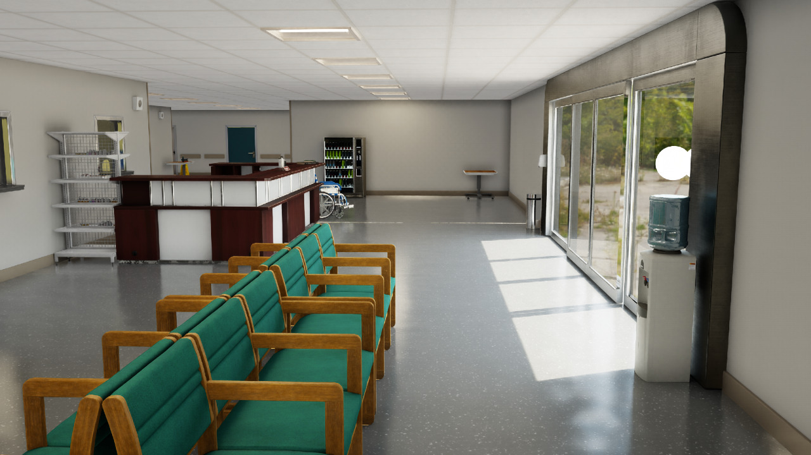
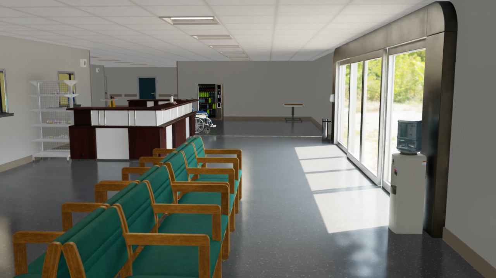
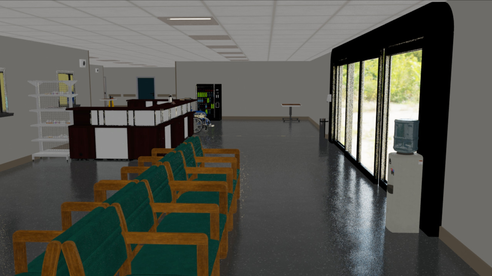

# 렌더링 설정 구성

Isaac Lab은 성능, 균형, 품질의 3가지 사전 정의된 렌더링 모드를 제공합니다.
명령줄 인수 또는 스크립트 내에서 모드를 선택하고 필요에 따라 설정을 커스터마이징할 수 있습니다.
워크플로에 최적의 균형을 달성하기 위해 렌더링을 조정하고 미세 조정하세요.

## 렌더링 모드 선택

렌더링 모드는 2가지 방식으로 선택할 수 있습니다.

1. `RenderCfg`의 `rendering_mode` 입력 클래스 인수 사용
   ```python
   # 이 사용법을 확인하려면 튜토리얼 스크립트를 참조하세요
   # scripts/tutorials/00_sim/set_rendering_mode.py
   render_cfg = sim_utils.RenderCfg(rendering_mode="performance")
   ```
2. `--rendering_mode` CLI 인수 사용. 이는 `RenderCfg`의 `rendering_mode` 인수보다 우선됩니다.
   ```bash
   ./isaaclab.sh -p scripts/tutorials/00_sim/set_rendering_mode.py --rendering_mode {performance/balanced/quality}
   ```

참고: `rendering_mode`의 기본값은 `balanced`입니다.
하지만 `--enable_cameras` 런처 인수가 설정되지 않은 경우,
기본 `rendering_mode`가 적용되지 않고 대신 기본 키트 렌더링 설정이 사용됩니다.

`set_rendering_mode.py` 스크립트의 예시 렌더링 결과.
렌더링 평가를 돕기 위해 예시 장면에 반사, 반투명, 직접 및 주변 조명, 그리고 여러 재질 유형이 포함되어 있습니다.

- 품질 모드
  
- 균형 모드
  
- 성능 모드
  

## 특정 렌더링 설정 덮어쓰기

사전 정의된 렌더링 설정은 `RenderCfg` 클래스를 통해 덮어쓸 수 있습니다.

설정을 사전 정의된 값으로 덮어쓰는 2가지 방법이 있습니다.

1. `RenderCfg`는 사용자 친화적인 설정 이름을 통해 특정 설정을 덮어쓸 수 있습니다. 이 설정 이름은 기본 RTX 설정에 매핑됩니다.
   예를 들어:
   ```python
   render_cfg = sim_utils.RenderCfg(
      rendering_mode="performance",
      # 사용자 친화적 설정 덮어쓰기
      enable_translucency=True, # 성능 모드에서 기본값은 False
      enable_reflections=True, # 성능 모드에서 기본값은 False
      dlss_mode="3", # 성능 모드에서 기본값은 1
   )
   ```

   사용자 친화적 설정 목록.

   | enable_translucency        | Bool. 유리와 같은 спе큘러 투과 표면에 대한 투명성을 활성화하지만 성능의 일부 손실을 감수해야 함.                                                                                                                                                                                                                                                                                                                                                                                                                                    |
   |----------------------------|-----------------------------------------------------------------------------------------------------------------------------------------------------------------------------------------------------------------------------------------------------------------------------------------------------------------------------------------------------------------------------------------------------------------------------------------------------------------------------------------------------------------------------------------------------|
   | enable_reflections         | Bool. 반사를 활성화하지만 성능의 일부 손실을 감수해야 함.                                                                                                                                                                                                                                                                                                                                                                                                                                                                                          |
   | enable_global_illumination | Bool. 확산 전역 조명을 활성화하지만 성능의 일부 손실을 감수해야 함.                                                                                                                                                                                                                                                                                                                                                                                                                                                                     |
   | antialiasing_mode          | Literal[“Off”, “FXAA”, “DLSS”, “TAA”, “DLAA”].<br/><br/>DLSS: AI를 사용하여 낮은 해상도 입력을 더 높은 해상도 프레임으로 출력함으로써 성능을 향상시킵니다. DLSS는 여러 낮은 해상도 이미지를 샘플링하고 이전 프레임의 운동 데이터 및 피드백을 사용하여 네이티브 품질 이미지를 재구성합니다.<br/>DLAA: AI 기반 안티앨리어싱 기술을 통해 더 높은 이미지 품질을 제공합니다. DLAA는 DLSS에서 개발된 동일한 슈퍼 해상도 기술을 사용하여 네이티브 해상도 이미지를 재구성하여 이미지 품질을 극대화합니다. |
   | enable_dlssg               | Bool. DLSS-G 사용을 활성화합니다. DLSS 프레임 생성은 AI를 사용하여 더 많은 프레임을 생성함으로써 성능을 향상시킵니다. 이 기능은 Ada Lovelace 아키텍처 GPU가 필요하며 스레드 관련 추가 활동으로 인해 성능에 악영향을 줄 수 있습니다.                                                                                                                                                                                                                                                                                             |
   | enable_dl_denoiser         | Bool. DL 디노이저 사용을 활성화합니다. 이는 렌더링 품질을 향상시키지만 성능의 일부 손실을 감수해야 함.                                                                                                                                                                                                                                                                                                                                                                                                                                       |
   | dlss_mode                  | Literal[0, 1, 2, 3]. DLSS 안티앨리어싱에 대해 성능/품질 트레이드오프 모드를 선택합니다. 유효한 값은 0(성능), 1(균형), 2(품질), 또는 3(자동).                                                                                                                                                                                                                                                                                                                                                                      |
   | enable_direct_lighting     | Bool. 라이트에서의 직접 조명 기여를 활성화합니다.                                                                                                                                                                                                                                                                                                                                                                                                                                                                                                |
   | samples_per_pixel          | Int. 픽셀당 직접 조명 샘플 수를 정의합니다. 값이 높을수록 직접 조명 품질이 향상되지만 성능의 일부 손실을 감수해야 함.                                                                                                                                                                                                                                                                                                                                                                                                              |
   | enable_shadows             | Bool. 그림자를 활성화하지만 성능의 일부 손실을 감수해야 함. 비활성화 시 라이트는 그림자를 생성하지 않습니다.                                                                                                                                                                                                                                                                                                                                                                                                                                                  |
   | enable_ambient_occlusion   | Bool. 주변 빛 차단 효과를 활성화하지만 성능의 일부 손실을 감수해야 함.                                                                                                                                                                                                                                                                                                                                                                                                                                                                                    |
2. 보다 세밀한 제어를 위해 `RenderCfg`는 `carb_settings` 인수를 사용하여 어떤 RTX 설정이든 덮어쓸 수 있습니다.

   RTX 설정의 예시는 저장소 내의 `apps/rendering_modes`에 위치한 렌더링 모드 프리셋 파일에서 확인할 수 있습니다.

   또한, RTX 문서는 다음 링크에서 확인할 수 있습니다 - [https://docs.omniverse.nvidia.com/materials-and-rendering/latest/rtx-renderer.html](https://docs.omniverse.nvidia.com/materials-and-rendering/latest/rtx-renderer.html).

   `carb_settings` 사용 예시.
   ```python
   render_cfg = sim_utils.RenderCfg(
      rendering_mode="quality",
      # carb 설정 덮어쓰기
      carb_settings={
         "rtx.translucency.enabled": False,
         "rtx.reflections.enabled": False,
         "rtx.domeLight.upperLowerStrategy": 3,
      }
   )
   ```

## 현재 제한 사항

성능상의 이유로 DLSS를 디노이징에 기본적으로 사용하며, 일반적으로 더 나은 성능을 제공합니다.
이로 인해 렌더링 품질이 낮아질 수 있으며, 특히 낮은 해상도에서는 더 두드러질 수 있습니다.
따라서 100 x 100 이상의 타일당 또는 카메라당 해상도를 사용할 것을 권장합니다.
낮은 해상도로 렌더링하는 경우, `RenderCfg`의 `antialiasing_mode` 속성을 `DLAA`로 설정하고, 또한 `enable_dl_denoiser`를 잠재적으로 활성화하는 것을 권장합니다. 이러한 설정들은 렌더링 품질을 개선하는 데 도움이 되지만 성능의 일부 손실을 감수해야 합니다. 추가 렌더링 매개변수도 `RenderCfg`에서 지정할 수 있습니다.
