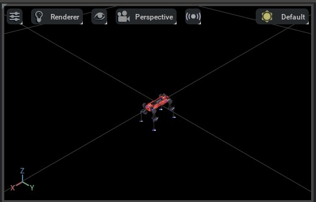
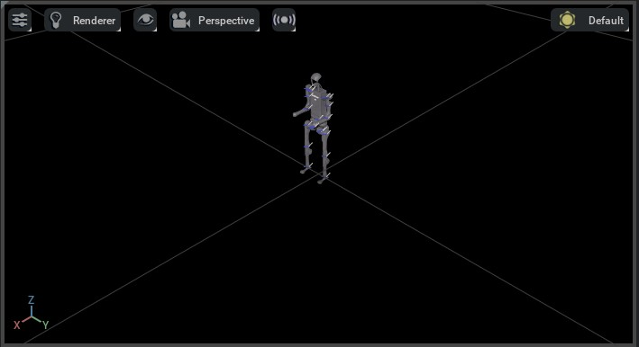
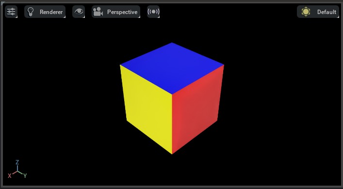

# 새 애셋 가져오기

NVIDIA Omniverse는 애셋을 가져오고 내보내기 위해 Universal Scene Description(USD) 파일 형식을 기반으로 합니다. USD는 Pixar 애니메이션 스튜디오에서 개발한 오픈 소스 파일 형식입니다. 대용량, 복잡한 데이터 세트에 최적화된 씬 설명 형식입니다. 이 형식은 영화 및 애니메이션 산업에서 널리 사용되지만, 로봇공학 커뮤니티에서는 덜 사용됩니다.

이를 위해 NVIDIA는 다른 파일 형식의 애셋을 USD로 가져올 수 있는 다양한 임포터를 개발했습니다. 이러한 임포터는 Omniverse Kit의 확장으로 제공됩니다:

* **URDF 임포터** - URDF 파일에서 애셋을 가져옵니다.
* **MJCF 임포터** - MJCF 파일에서 애셋을 가져옵니다.
* **메시 임포터** - OBJ, FBX, STL 및 glTF를 포함한 다양한 파일 형식에서 애셋을 가져옵니다.

NVIDIA에서 권장하는 워크플로우는 위의 임포터를 사용하여 애셋을 USD 표현으로 변환하는 것입니다. 애셋이 USD 형식으로 변환되면 Omniverse Kit을 사용하여 애셋을 편집하고 다른 파일 형식으로 내보낼 수 있습니다. Isaac Sim에는 이러한 임포터가 기본적으로 포함되어 있습니다. 또한 Omniverse Kit에서 수동으로 활성화할 수도 있습니다.

대규모 시뮬레이션을 위해 애셋을 사용할 때 중요한 점은 애셋이 [인스턴스 가능](https://openusd.org/dev/api/_usd__page__scenegraph_instancing.html) 형식인지 확인하는 것입니다. 이렇게 하면 애셋을 메모리에 효율적으로 로드하고 씬에서 여러 번 사용할 수 있습니다. 그렇지 않으면 애셋이 메모리에 여러 번 로드되어 성능 문제가 발생할 수 있습니다. 인스턴스 가능 애셋에 대한 자세한 내용은 Isaac Sim [문서](https://docs.isaacsim.omniverse.nvidia.com/latest/isaac_lab_tutorials/tutorial_instanceable_assets.html)를 확인하세요.

## URDF 임포터 사용하기

GUI에서 URDF 임포터를 사용하는 방법은 [URDF 임포터](https://docs.isaacsim.omniverse.nvidia.com/latest/importer_exporter/ext_isaacsim_asset_importer_urdf.html) 문서를 참조하세요. Python 스크립트에서 URDF 임포터를 사용하는 경우 `convert_urdf.py`라는 유틸리티 도구를 제공합니다. 이 스크립트는 [`UrdfConverterCfg`](../api/lab/isaaclab.sim.converters.md#isaaclab.sim.converters.UrdfConverterCfg)의 인스턴스를 생성하고, 이를 [`UrdfConverter`](../api/lab/isaaclab.sim.converters.md#isaaclab.sim.converters.UrdfConverter) 클래스에 전달합니다.

URDF 임포터에는 임포터의 동작을 제어하기 위해 설정할 수 있는 다양한 구성 매개변수가 있습니다. 임포터의 구성 매개변수 기본값은 [`UrdfConverterCfg`](../api/lab/isaaclab.sim.converters.md#isaaclab.sim.converters.UrdfConverterCfg) 클래스에 지정되어 있으며, 아래에 나열되어 있습니다. 일반적으로 수정되는 몇 가지 설정은 `convert_urdf.py`를 호출할 때 명령줄 인수로 제공되며, 목록에서 `*`로 표시되어 있습니다. 구성 매개변수에 대한 종합적인 목록은 [URDF 임포터](https://docs.isaacsim.omniverse.nvidia.com/latest/importer_exporter/ext_isaacsim_asset_importer_urdf.html) 문서를 참조하세요.

* [`fix_base`](../api/lab/isaaclab.sim.converters.md#isaaclab.sim.converters.UrdfConverterCfg.fix_base) \* - 로봇의 베이스를 고정할지 여부를 지정합니다.
  로봇이 플로팅 베이스인지 고정 베이스인지에 따라 달라집니다. 명령줄 플래그는 `--fix-base`이며, 설정되면 임포터가 로봇의 베이스를 고정하고, 그렇지 않으면 플로팅 베이지로 기본 설정됩니다.
* [`root_link_name`](../api/lab/isaaclab.sim.converters.md#isaaclab.sim.converters.UrdfConverterCfg.root_link_name) - PhysX 아티큘레이션 루트가 배치되는 링크를 지정합니다.
* [`merge_fixed_joints`](../api/lab/isaaclab.sim.converters.md#isaaclab.sim.converters.UrdfConverterCfg.merge_fixed_joints) \* - 고정 조인트를 병합할지 여부를 지정합니다.
  일반적으로 애셋의 복잡성을 줄이기 위해 이 값을 `True`로 설정해야 합니다. 명령줄 플래그는 `--merge-joints`이며, 설정되면 임포터가 고정 조인트를 병합하고, 그렇지 않으면 고정 조인트를 병합하지 않는 동작으로 기본 설정됩니다.
* [`joint_drive`](../api/lab/isaaclab.sim.converters.md#isaaclab.sim.converters.UrdfConverterCfg.joint_drive) - 로봇의 조인트 드라이브 구성을 지정합니다.
  * [`drive_type`](../api/lab/isaaclab.sim.converters.md#isaaclab.sim.converters.UrdfConverterCfg.JointDriveCfg.drive_type) - 조인트의 드라이브 유형을 지정합니다.
    `"acceleration"` 또는 `"force"`일 수 있습니다. 대부분의 경우 `"force"`를 사용하는 것이 좋습니다.
  * [`target_type`](../api/lab/isaaclab.sim.converters.md#isaaclab.sim.converters.UrdfConverterCfg.JointDriveCfg.target_type) - 조인트의 대상 유형을 지정합니다.
    `"none"`, `"position"`, 또는 `"velocity"`일 수 있습니다. 대부분의 경우 `"position"`을 사용하는 것이 좋습니다.
    이를 `"none"`으로 설정하면 드라이브가 비활성화되고 조인트 게인이 0.0으로 설정됩니다.
  * [`gains`](../api/lab/isaaclab.sim.converters.md#isaaclab.sim.converters.UrdfConverterCfg.JointDriveCfg.gains) - 조인트의 드라이브 강성과 감쇠 게인을 지정합니다.
    두 가지 방법을 지원합니다:
    * [`PDGainsCfg`](../api/lab/isaaclab.sim.converters.md#isaaclab.sim.converters.UrdfConverterCfg.JointDriveCfg.PDGainsCfg) - 강성과 감쇠를 직접 설정합니다.
    * [`NaturalFrequencyGainsCfg`](../api/lab/isaaclab.sim.converters.md#isaaclab.sim.converters.UrdfConverterCfg.JointDriveCfg.NaturalFrequencyGainsCfg) - 시스템의 원하는 자연 주파수 응답을 사용하여 게인을 설정합니다.

구성 매개변수에 대한 자세한 내용은 [`UrdfConverterCfg`](../api/lab/isaaclab.sim.converters.md#isaaclab.sim.converters.UrdfConverterCfg) 문서를 참조하세요.

### 사용 예시

이 예시에서는 ANYmal-D 로봇의 사전 처리된 URDF 파일을 사용합니다. 사전 처리된 URDF를 확인하려면 [anymal.urdf](https://github.com/isaac-orbit/anymal_d_simple_description/blob/master/urdf/anymal.urdf) 파일을 참조하세요. 사전 처리된 URDF와 원래 URDF의 주요 차이점은 다음과 같습니다:

* URDF에서 `<gazebo>` 태그를 제거했습니다. 이 태그는 URDF 임포터에서 지원되지 않습니다.
* URDF에서 `<transmission>` 태그를 제거했습니다. 이 태그는 URDF 임포터에서 지원되지 않습니다.
* 애셋의 복잡성을 줄이기 위해 다양한 충돌 바디를 URDF에서 제거했습니다.
* 모든 조인트의 댐핑과 마찰 매개변수를 `0.0`으로 변경했습니다. 이렇게 하면 PhysX가 추가적인 댐핑을 추가하지 않고 조인트에 대한 노력 제어를 수행할 수 있습니다.
* 고정 조인트에 `<dont_collapse>` 태그를 추가했습니다. 이렇게 하면 임포터가 이러한 고정 조인트를 병합하지 않도록 보장합니다.

다음은 리포지토리를 클론하고 컨버터를 실행하는 단계를 보여줍니다:

### Linux

```bash
# URDF 파일이 포함된 리포지토리 클론
git clone git@github.com:isaac-orbit/anymal_d_simple_description.git

# Isaac Lab 리포지토리 최상위로 이동
cd IsaacLab
# 컨버터 실행
./isaaclab.sh -p scripts/tools/convert_urdf.py \
  ../anymal_d_simple_description/urdf/anymal.urdf \
  source/isaaclab_assets/data/Robots/ANYbotics/anymal_d.usd \
  --merge-joints \
  --joint-stiffness 0.0 \
  --joint-damping 0.0 \
  --joint-target-type none
```

### Windows

```batch
:: URDF 파일이 포함된 리포지토리 클론
git clone git@github.com:isaac-orbit/anymal_d_simple_description.git

:: Isaac Lab 리포지토리 최상위로 이동
cd IsaacLab
:: 컨버터 실행
isaaclab.bat -p scripts\tools\convert_urdf.py ^
  ..\anymal_d_simple_description\urdf\anymal.urdf ^
  source\isaaclab_assets\data\Robots\ANYbotics\anymal_d.usd ^
  --merge-joints ^
  --joint-stiffness 0.0 ^
  --joint-damping 0.0 ^
  --joint-target-type none
```

위의 스크립트를 실행하면 `source/isaaclab_assets/data/Robots/ANYbotics/` 디렉터리 내에 USD 파일이 생성됩니다:

* `anymal_d.usd` - 이 파일은 주요 애셋 파일입니다.

스크립트를 헤드리스 모드로 실행하려면 `--headless` 플래그를 추가할 수 있습니다.これにより、GUIが開かず、変換が完了したらスクリプトが終了します。

開いたウィンドウで再生ボタンを押して、シーン内のアセットを確認できます。アセットは重力の影響で落下するはずです。爆発する場合は、URDFに自己衝突が存在している可能性があります。



## MJCF 임포터 사용하기

URDF 임포터와 유사하게, MJCF 임포터도 GUI 인터페이스를 제공합니다. 자세한 내용은 [MJCF 임포터](https://docs.isaacsim.omniverse.nvidia.com/latest/importer_exporter/ext_isaacsim_asset_importer_mjcf.html) 문서를 참조하세요. Python 스크립트에서 MJCF 임포터를 사용하는 경우 `convert_mjcf.py`라는 유틸리티 도구를 제공합니다. 이 스크립트는 [`MjcfConverterCfg`](../api/lab/isaaclab.sim.converters.md#isaaclab.sim.converters.MjcfConverterCfg)의 인스턴스를 생성하고, 이를 [`MjcfConverter`](../api/lab/isaaclab.sim.converters.md#isaaclab.sim.converters.MjcfConverter) 클래스에 전달합니다.

임포터의 구성 매개변수 기본값은 [`MjcfConverterCfg`](../api/lab/isaaclab.sim.converters.md#isaaclab.sim.converters.MjcfConverterCfg) 클래스에 지정되어 있으며, 아래에 나열되어 있습니다. 일반적으로 수정되는 몇 가지 설정은 `convert_mjcf.py`를 호출할 때 명령줄 인수로 제공되며, 목록에서 `*`로 표시되어 있습니다. 구성 매개변수에 대한 종합적인 목록은 [MJCF 임포터](https://docs.isaacsim.omniverse.nvidia.com/latest/importer_exporter/ext_isaacsim_asset_importer_mjcf.html) 문서를 참조하세요.

* `fix_base*` - 로봇의 베이스를 고정할지 여부를 지정합니다.
  로봇이 플로팅 베이스인지 고정 베이스인지에 따라 달라집니다. 명령줄 플래그는 `--fix-base`이며, 설정되면 임포터가 로봇의 베이스를 고정하고, 그렇지 않으면 플로팅 베이지로 기본 설정됩니다.
* `make_instanceable*` - 인스턴스 가능 애셋을 생성할지 여부를 지정합니다.
  일반적으로 이 값을 `True`로 설정해야 합니다. 명령줄 플래그는 `--make-instanceable`이며, 설정되면 임포터가 인스턴스 가능 애셋을 생성하고, 그렇지 않으면 인스턴스 불가능 애셋으로 기본 설정됩니다.
* `import_sites*` - MJCF의 `<site>` 태그를 파싱할지 여부를 지정합니다.
  일반적으로 이 값을 `True`로 설정해야 합니다. 명령줄 플래그는 `--import-sites`이며, 설정하면 임포터가 `<site>` 태그를 파싱하고, 설정하지 않으면 `<site>` 태그를 파싱하지 않는 기본값을 따릅니다.

### 사용 예시

이 예시에서는 [mujoco_menagerie](https://github.com/google-deepmind/mujoco_menagerie/tree/main/unitree_h1)의 Unitree H1 휴머노이드 로봇의 MuJoCo 모델을 사용합니다.

다음은 리포지토리를 클론하고 변환기를 실행하는 단계를 보여줍니다.

#### Linux

```bash
# URDF 파일이 포함된 리포지토리 클론
git clone git@github.com:google-deepmind/mujoco_menagerie.git

# Isaac Lab 리포지토리 최상위로 이동
cd IsaacLab
# 변환기 실행
./isaaclab.sh -p scripts/tools/convert_mjcf.py \
  ../mujoco_menagerie/unitree_h1/h1.xml \
  source/isaaclab_assets/data/Robots/Unitree/h1.usd \
  --import-sites \
  --make-instanceable
```

#### Windows

```batch
:: URDF 파일이 포함된 리포지토리 클론
git clone git@github.com:google-deepmind/mujoco_menagerie.git

:: Isaac Lab 리포지토리 최상위로 이동
cd IsaacLab
:: 변환기 실행
isaaclab.bat -p scripts\tools\convert_mjcf.py ^
  ..\mujoco_menagerie\unitree_h1\h1.xml ^
  source\isaaclab_assets\data\Robots\Unitree\h1.usd ^
  --import-sites ^
  --make-instanceable
```

위 스크립트를 실행하면 `source/isaaclab_assets/data/Robots/Unitree/` 디렉터리 내에 USD 파일이 생성됩니다:

* `h1.usd` - 메인 애셋 파일. 메시가 아닌 모든 데이터를 포함합니다.
* `Props/instanceable_assets.usd` - 메시 데이터 파일.



## 메시 임포터 사용하기

Omniverse Kit에는 ASSIMP 라이브러리를 사용하는 메시 변환 도구가 포함되어 있으며, 다양한 메시 형식(예: OBJ, FBX, STL, glTF 등)에서 애셋을 가져올 수 있습니다. 애셋 변환 도구는 Omniverse Kit의 확장 프로그램으로 제공됩니다. 자세한 내용은 [애셋 변환기](https://docs.omniverse.nvidia.com/extensions/latest/ext_asset-converter.html) 문서를 확인하세요.
하지만 Isaac Sim의 URDF 및 MJCF 임포터와 달리, 이 애셋 변환 도구는 인스턴스화 가능한 애셋 생성을 지원하지 않습니다. 따라서 씬에서 여러 번 사용되는 애셋은 메모리에 여러 번 로드됩니다.

따라서 애셋 변환 도구를 사용하여 애셋을 가져온 후 인스턴스화 가능한 애셋으로 변환하는 유틸리티 도구 `convert_mesh.py`를 제공합니다. 내부적으로 이 스크립트는 [`MeshConverterCfg`](../api/lab/isaaclab.sim.converters.md#isaaclab.sim.converters.MeshConverterCfg)의 인스턴스를 생성하고, 이를 [`MeshConverter`](../api/lab/isaaclab.sim.converters.md#isaaclab.sim.converters.MeshConverter) 클래스에 전달합니다. 메쉬 파일에는 물리 정보가 없으므로, 구성 클래스는 질량, 충돌 형태(예: 충돌 형태)와 같은 다양한 물리 속성을 입력으로 받아들입니다. 자세한 내용은 [`MeshConverterCfg`](../api/lab/isaaclab.sim.converters.md#isaaclab.sim.converters.MeshConverterCfg) 문서를 확인하세요.

### 사용 예시

OBJ 형식의 큐브 파일을 사용하여 메시 변환기의 사용법을 보여줍니다. 다음은 리포지토리를 클론하고 변환기를 실행하는 단계를 보여줍니다.

#### Linux

```bash
# URDF 파일이 포함된 리포지토리 클론
git clone git@github.com:NVIDIA-Omniverse/IsaacGymEnvs.git

# Isaac Lab 리포지토리 최상위로 이동
cd IsaacLab
# 변환기 실행
./isaaclab.sh -p scripts/tools/convert_mesh.py \
  ../IsaacGymEnvs/assets/trifinger/objects/meshes/cube_multicolor.obj \
  source/isaaclab_assets/data/Props/CubeMultiColor/cube_multicolor.usd \
  --make-instanceable \
  --collision-approximation convexDecomposition \
  --mass 1.0
```

#### Windows

```batch
:: URDF 파일이 포함된 리포지토리 클론
git clone git@github.com:NVIDIA-Omniverse/IsaacGymEnvs.git

:: Isaac Lab 리포지토리 최상위로 이동
cd IsaacLab
:: 변환기 실행
isaaclab.bat -p scripts\tools\convert_mesh.py ^
  ..\IsaacGymEnvs\assets\trifinger\objects\meshes\cube_multicolor.obj ^
  source\isaaclab_assets\data\Props\CubeMultiColor\cube_multicolor.usd ^
  --make-instanceable ^
  --collision-approximation convexDecomposition ^
  --mass 1.0
```

가져온 후 에셋에 초점을 맞추려면 ‘F’ 키를 누를 필요가 있을 수 있습니다.

URDF 및 MJCF 변환기와 마찬가지로, 위 스크립트를 실행하면 `source/isaaclab_assets/data/Props/CubeMultiColor/` 디렉터리 내에 두 개의 USD 파일이 생성됩니다. 또한, 열린 창에서 재생을 누르면 중력의 영향으로 애셋이 떨어지는 것을 볼 수 있습니다.

* `--mass` 플래그를 설정하지 않으면 애셋에 강체 속성이 추가되지 않습니다. 정적 애셋으로 가져옵니다.
* `--collision-approximation` 플래그도 설정하지 않으면 애셋에 콜라이더 속성도 추가되지 않으며, 시각적 애셋으로만 가져옵니다.


