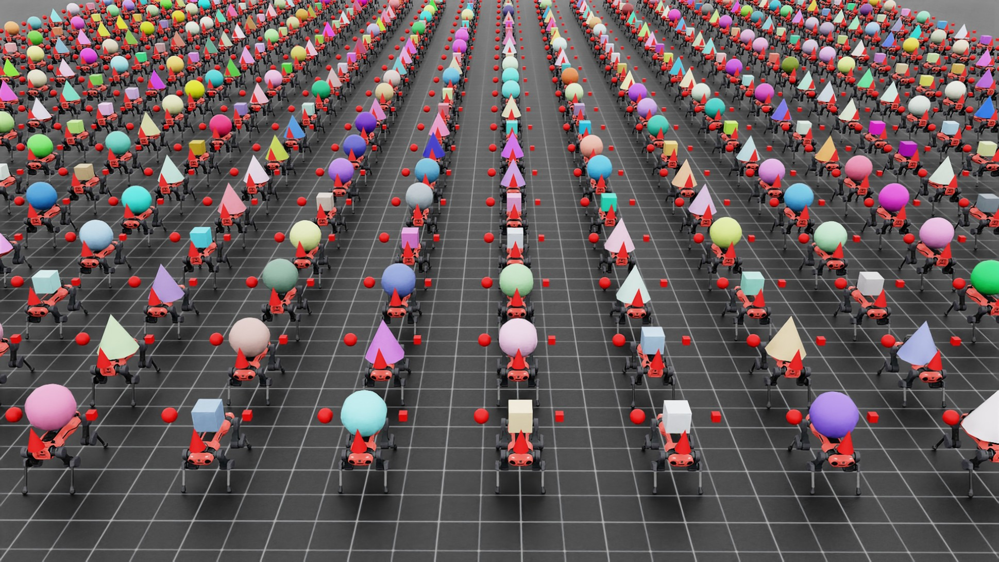

# 다중 애셋 스폰

일반적인 스폰 구성([씬에 프리미 스폰](../tutorials/00_sim/spawn_prims.md#tutorial-spawn-prims) 튜토리얼에서 소개됨)은 동일한
애셋(또는 USD 프리미)을 표현식에서 해결된 다른 프리미 경로에 복사합니다.
예를 들어, 사용자가 “/World/Table_.\*/Object”에서 애셋을 스폰하도록 지정하면,
동일한 애셋이 경로 “/World/Table_0/Object”, “/World/Table_1/Object” 등에 생성됩니다.

하지만 다음 두 가지 메커니즘을 통해 다중 애셋 스폰도 지원합니다.

1. 강체 객체 컬렉션. 이를 통해 사용자는 각 환경에서 여러 강체 객체를 스폰하고 통일된 API로 접근 및 수정하여 성능을 향상시킬 수 있습니다.
2. 동일한 프리미 경로 아래에 다른 애셋 스폰. 이를 통해 사용자는 각 환경에 다른 애셋이 있는 다양한 시뮬레이션을 생성할 수 있습니다.

이 가이드에서는 이러한 두 가지 메커니즘의 사용 방법을 설명합니다.

샘플 스크립트 `multi_asset.py`는 `IsaacLab/scripts/demos` 디렉터리에 위치하며 참조용으로 사용됩니다.

### multi_asset.py 코드

```python
# Copyright (c) 2022-2026, The Isaac Lab Project Developers (https://github.com/isaac-sim/IsaacLab/blob/main/CONTRIBUTORS.md).
# All rights reserved.
#
# SPDX-License-Identifier: BSD-3-Clause

"""여러 환경에서 여러 객체를 스폰하는 방법을 보여주는 스크립트입니다.

.. code-block:: bash

    # 사용법
    ./isaaclab.sh -p scripts/demos/multi_asset.py --num_envs 2048

"""

from __future__ import annotations

"""Isaac Sim 시뮬레이터 먼저 실행하기."""


import argparse

from isaaclab.app import AppLauncher

# add argparse arguments
parser = argparse.ArgumentParser(description="여러 환경에서 다른 객체를 스폰하는 데모.")
parser.add_argument("--num_envs", type=int, default=512, help="스폰할 환경의 수.")
# append AppLauncher cli args
AppLauncher.add_app_launcher_args(parser)
# parse the arguments
args_cli = parser.parse_args()

# launch omniverse app
app_launcher = AppLauncher(args_cli)
simulation_app = app_launcher.app

"""Rest everything follows."""

import random

from pxr import Gf, Sdf

import isaaclab.sim as sim_utils
from isaaclab.assets import (
    Articulation,
    ArticulationCfg,
    AssetBaseCfg,
    RigidObject,
    RigidObjectCfg,
    RigidObjectCollection,
    RigidObjectCollectionCfg,
)
from isaaclab.scene import InteractiveScene, InteractiveSceneCfg
from isaaclab.sim import SimulationContext
from isaaclab.sim.utils.stage import get_current_stage
from isaaclab.utils import Timer, configclass
from isaaclab.utils.assets import ISAACLAB_NUCLEUS_DIR

##
# 사전 정의된 구성
##

from isaaclab_assets.robots.anymal import ANYDRIVE_3_LSTM_ACTUATOR_CFG  # isort: skip


##
# 랜덤화 이벤트.
##


def randomize_shape_color(prim_path_expr: str):
    """기하학의 색상을 랜덤화합니다."""
    # 스테이지 핸들 가져오기
    stage = get_current_stage()
    # 스폰 및 클론을 위한 프리미 경로 해결
    prim_paths = sim_utils.find_matching_prim_paths(prim_path_expr)
    # 소스 프리미 경로가 정규 표현식인 경우 프리미 수동 클론
    with Sdf.ChangeBlock():
        for prim_path in prim_paths:
            # 단일 인스턴스 스폰
            prim_spec = Sdf.CreatePrimInLayer(stage.GetRootLayer(), prim_path)

            # 여기에서 다른 종류의 랜덤화를 수행하세요!
            # 참고: 설정하려는 속성에 대한 정확한 속성을 가져오기만 하면 됩니다.
            # 여기서는 색상을 랜덤으로 설정하는 예시를 보여줍니다.
            color_spec = prim_spec.GetAttributeAtPath(prim_path + "/geometry/material/Shader.inputs:diffuseColor")
            color_spec.default = Gf.Vec3f(random.random(), random.random(), random.random())


##
# 씬 구성
##


@configclass
class MultiObjectSceneCfg(InteractiveSceneCfg):
    """다중 객체 씬에 대한 구성."""

    # 지면 평면
    ground = AssetBaseCfg(prim_path="/World/defaultGroundPlane", spawn=sim_utils.GroundPlaneCfg())

    # 조명
    dome_light = AssetBaseCfg(
        prim_path="/World/Light", spawn=sim_utils.DomeLightCfg(intensity=3000.0, color=(0.75, 0.75, 0.75))
    )

    # 강체 객체
    object: RigidObjectCfg = RigidObjectCfg(
        prim_path="/World/envs/env_.*/Object",
        spawn=sim_utils.MultiAssetSpawnerCfg(
            assets_cfg=[
                sim_utils.ConeCfg(
                    radius=0.3,
                    height=0.6,
                    visual_material=sim_utils.PreviewSurfaceCfg(diffuse_color=(0.0, 1.0, 0.0), metallic=0.2),
                ),
                sim_utils.CuboidCfg(
                    size=(0.3, 0.3, 0.3),
                    visual_material=sim_utils.PreviewSurfaceCfg(diffuse_color=(1.0, 0.0, 0.0), metallic=0.2),
                ),
                sim_utils.SphereCfg(
                    radius=0.3,
                    visual_material=sim_utils.PreviewSurfaceCfg(diffuse_color=(0.0, 0.0, 1.0), metallic=0.2),
                ),
            ],
            random_choice=True,
            rigid_props=sim_utils.RigidBodyPropertiesCfg(
                solver_position_iteration_count=4, solver_velocity_iteration_count=0
            ),
            mass_props=sim_utils.MassPropertiesCfg(mass=1.0),
            collision_props=sim_utils.CollisionPropertiesCfg(),
        ),
        init_state=RigidObjectCfg.InitialStateCfg(pos=(0.0, 0.0, 2.0)),
    )

    # 객체 컬렉션
    object_collection: RigidObjectCollectionCfg = RigidObjectCollectionCfg(
        rigid_objects={
            "object_A": RigidObjectCfg(
                prim_path="/World/envs/env_.*/Object_A",
                spawn=sim_utils.SphereCfg(
                    radius=0.1,
                    visual_material=sim_utils.PreviewSurfaceCfg(diffuse_color=(1.0, 0.0, 0.0), metallic=0.2),
                    rigid_props=sim_utils.RigidBodyPropertiesCfg(
                        solver_position_iteration_count=4, solver_velocity_iteration_count=0
                    ),
                    mass_props=sim_utils.MassPropertiesCfg(mass=1.0),
                    collision_props=sim_utils.CollisionPropertiesCfg(),
                ),
                init_state=RigidObjectCfg.InitialStateCfg(pos=(0.0, -0.5, 2.0)),
            ),
            "object_B": RigidObjectCfg(
                prim_path="/World/envs/env_.*/Object_B",
                spawn=sim_utils.CuboidCfg(
                    size=(0.1, 0.1, 0.1),
                    visual_material=sim_utils.PreviewSurfaceCfg(diffuse_color=(1.0, 0.0, 0.0), metallic=0.2),
                    rigid_props=sim_utils.RigidBodyPropertiesCfg(
                        solver_position_iteration_count=4, solver_velocity_iteration_count=0
                    ),
                    mass_props=sim_utils.MassPropertiesCfg(mass=1.0),
                    collision_props=sim_utils.CollisionPropertiesCfg(),
                ),
                init_state=RigidObjectCfg.InitialStateCfg(pos=(0.0, 0.5, 2.0)),
            ),
            "object_C": RigidObjectCfg(
                prim_path="/World/envs/env_.*/Object_C",
                spawn=sim_utils.ConeCfg(
                    radius=0.1,
                    height=0.3,
                    visual_material=sim_utils.PreviewSurfaceCfg(diffuse_color=(1.0, 0.0, 0.0), metallic=0.2),
                    rigid_props=sim_utils.RigidBodyPropertiesCfg(
                        solver_position_iteration_count=4, solver_velocity_iteration_count=0
                    ),
                    mass_props=sim_utils.MassPropertiesCfg(mass=1.0),
                    collision_props=sim_utils.CollisionPropertiesCfg(),
                ),
                init_state=RigidObjectCfg.InitialStateCfg(pos=(0.5, 0.0, 2.0)),
            ),
        }
    )

    # арти큘레이션
    robot: ArticulationCfg = ArticulationCfg(
        prim_path="/World/envs/env_.*/Robot",
        spawn=sim_utils.MultiUsdFileCfg(
            usd_path=[
                f"{ISAACLAB_NUCLEUS_DIR}/Robots/ANYbotics/ANYmal-C/anymal_c.usd",
                f"{ISAACLAB_NUCLEUS_DIR}/Robots/ANYbotics/ANYmal-D/anymal_d.usd",
            ],
            random_choice=True,
            rigid_props=sim_utils.RigidBodyPropertiesCfg(
                disable_gravity=False,
                retain_accelerations=False,
                linear_damping=0.0,
                angular_damping=0.0,
                max_linear_velocity=1000.0,
                max_angular_velocity=1000.0,
                max_depenetration_velocity=1.0,
            ),
            articulation_props=sim_utils.ArticulationRootPropertiesCfg(
                enabled_self_collisions=True, solver_position_iteration_count=4, solver_velocity_iteration_count=0
            ),
            activate_contact_sensors=True,
        ),
        init_state=ArticulationCfg.InitialStateCfg(
            pos=(0.0, 0.0, 0.6),
            joint_pos={
                ".*HAA": 0.0,  # all HAA
                ".*F_HFE": 0.4,  # both front HFE
                ".*H_HFE": -0.4,  # both hind HFE
                ".*F_KFE": -0.8,  # both front KFE
                ".*H_KFE": 0.8,  # both hind KFE
            },
        ),
        actuators={"legs": ANYDRIVE_3_LSTM_ACTUATOR_CFG},
    )


##
# 시뮬레이션 루프
##


def run_simulator(sim: SimulationContext, scene: InteractiveScene):
    """시뮬레이션 루프를 실행합니다."""
    # 씬 엔티티 추출
    # note: 여기서는 가독성을 위해 이렇게 수행합니다.
    rigid_object: RigidObject = scene["object"]
    rigid_object_collection: RigidObjectCollection = scene["object_collection"]
    robot: Articulation = scene["robot"]
    # 시뮬레이션 스텝 정의
    sim_dt = sim.get_physics_dt()
    count = 0
    # 시뮬레이션 루프
    while simulation_app.is_running():
        # 리셋
        if count % 250 == 0:
            # 카운터 리셋
            count = 0
            # 씬 엔티티 리셋
            # object
            root_state = rigid_object.data.default_root_state.clone()
            root_state[:, :3] += scene.env_origins
            rigid_object.write_root_pose_to_sim(root_state[:, :7])
            rigid_object.write_root_velocity_to_sim(root_state[:, 7:])
            # object collection
            object_state = rigid_object_collection.data.default_object_state.clone()
            object_state[..., :3] += scene.env_origins.unsqueeze(1)
            rigid_object_collection.write_object_link_pose_to_sim(object_state[..., :7])
            rigid_object_collection.write_object_com_velocity_to_sim(object_state[..., 7:])
            # robot
            # -- 루트 상태
            root_state = robot.data.default_root_state.clone()
            root_state[:, :3] += scene.env_origins
            robot.write_root_pose_to_sim(root_state[:, :7])
            robot.write_root_velocity_to_sim(root_state[:, 7:])
            # -- 조인트 상태
            joint_pos, joint_vel = robot.data.default_joint_pos.clone(), robot.data.default_joint_vel.clone()
            robot.write_joint_state_to_sim(joint_pos, joint_vel)
            # 내부 버퍼 클리어
            scene.reset()
            print("[INFO]: 씬 상태 리셋...")

        # 로봇에 액션 적용
        robot.set_joint_position_target(robot.data.default_joint_pos)
        # 시뮬레이터에 데이터 쓰기
        scene.write_data_to_sim()
        # 스텝 수행
        sim.step()
        # 카운터 증가
        count += 1
        # 버퍼 업데이트
        scene.update(sim_dt)


def main():
    """메인 함수."""
    # 키트 헬퍼 로드
    sim_cfg = sim_utils.SimulationCfg(dt=0.005, device=args_cli.device)
    sim = SimulationContext(sim_cfg)
    # 메인 카메라 설정
    sim.set_camera_view([2.5, 0.0, 4.0], [0.0, 0.0, 2.0])

    # 씬 설계
    scene_cfg = MultiObjectSceneCfg(num_envs=args_cli.num_envs, env_spacing=2.0, replicate_physics=False)
    with Timer("[INFO] 씬 생성 시간: "):
        scene = InteractiveScene(scene_cfg)

    with Timer("[INFO] 씬 랜덤화 시간: "):
        # 여기에서 다른 종류의 랜덤화를 수행하세요!
        # 참고: 설정하려는 속성에 대한 정확한 속성을 가져오기만 하면 됩니다.
        # 여기서는 색상을 랜덤으로 설정하는 예시를 보여줍니다.
        randomize_shape_color(scene_cfg.object.prim_path)

    # 시뮬레이터 재생
    sim.reset()
    # 이제 준비 완료!
    print("[INFO]: 설정 완료...")
    # 시뮬레이터 실행
    run_simulator(sim, scene)


if __name__ == "__main__":
    # 메인 실행 실행
    main()
    # 시뮬레이터 앱 종료
    simulation_app.close()
```

이 스크립트는 각 환경이 다음과 같은 여러 환경을 생성합니다.

* 원기둥, 정육면체, 구를 포함하는 강체 객체 컬렉션
* 원기둥, 정육면체 또는 구 중에서 무작위로 선택된 강체 객체
* ANYmal-C 또는 ANYmal-D 로봇 중에서 무작위로 선택된 관절 모델



## 강체 객체 컬렉션

각 환경에서 여러 강체 객체를 생성하고, 통합된 `(env_ids, obj_ids)` API를 통해 접근하거나 수정할 수 있습니다.
사용자는 개별적으로 강체 객체를 스폰하여 여러 객체를 만들 수도 있지만, 후면 단일 물리 뷰를 사용하기 때문에 이 API는 더 사용자 친화적이며 효율적입니다.

```python
# 객체 컬렉션
object_collection: RigidObjectCollectionCfg = RigidObjectCollectionCfg(
    rigid_objects={
        "object_A": RigidObjectCfg(
            prim_path="/World/envs/env_.*/Object_A",
            spawn=sim_utils.SphereCfg(
                radius=0.1,
                visual_material=sim_utils.PreviewSurfaceCfg(diffuse_color=(1.0, 0.0, 0.0), metallic=0.2),
                rigid_props=sim_utils.RigidBodyPropertiesCfg(
                    solver_position_iteration_count=4, solver_velocity_iteration_count=0
                ),
                mass_props=sim_utils.MassPropertiesCfg(mass=1.0),
                collision_props=sim_utils.CollisionPropertiesCfg(),
            ),
            init_state=RigidObjectCfg.InitialStateCfg(pos=(0.0, -0.5, 2.0)),
        ),
        "object_B": RigidObjectCfg(
            prim_path="/World/envs/env_.*/Object_B",
            spawn=sim_utils.CuboidCfg(
                size=(0.1, 0.1, 0.1),
                visual_material=sim_utils.PreviewSurfaceCfg(diffuse_color=(1.0, 0.0, 0.0), metallic=0.2),
                rigid_props=sim_utils.RigidBodyPropertiesCfg(
                    solver_position_iteration_count=4, solver_velocity_iteration_count=0
                ),
                mass_props=sim_utils.MassPropertiesCfg(mass=1.0),
                collision_props=sim_utils.CollisionPropertiesCfg(),
            ),
            init_state=RigidObjectCfg.InitialStateCfg(pos=(0.0, 0.5, 2.0)),
        ),
        "object_C": RigidObjectCfg(
            prim_path="/World/envs/env_.*/Object_C",
            spawn=sim_utils.ConeCfg(
                radius=0.1,
                height=0.3,
                visual_material=sim_utils.PreviewSurfaceCfg(diffuse_color=(1.0, 0.0, 0.0), metallic=0.2),
                rigid_props=sim_utils.RigidBodyPropertiesCfg(
                    solver_position_iteration_count=4, solver_velocity_iteration_count=0
                ),
                mass_props=sim_utils.MassPropertiesCfg(mass=1.0),
                collision_props=sim_utils.CollisionPropertiesCfg(),
            ),
            init_state=RigidObjectCfg.InitialStateCfg(pos=(0.5, 0.0, 2.0)),
        ),
    }
)
```

[`RigidObjectCollectionCfg`](../api/lab/isaaclab.assets.md#isaaclab.assets.RigidObjectCollectionCfg) 구성을 사용하여 컬렉션을 생성합니다. 이 구성의 [`rigid_objects`](../api/lab/isaaclab.assets.md#isaaclab.assets.RigidObjectCollectionCfg.rigid_objects) 속성은 [`RigidObjectCfg`](../api/lab/isaaclab.assets.md#isaaclab.assets.RigidObjectCfg) 객체를 포함하는 사전입니다. 키는 컬렉션 내 각 강체 객체의 고유 식별자로 사용됩니다.

## 동일한 prim 경로 아래에서 다양한 자산 스폰

[`MultiAssetSpawnerCfg`](../api/lab/isaaclab.sim.spawners.md#isaaclab.sim.spawners.wrappers.MultiAssetSpawnerCfg)와 [`MultiUsdFileCfg`](../api/lab/isaaclab.sim.spawners.md#isaaclab.sim.spawners.wrappers.MultiUsdFileCfg) 스포너를 사용하면 각 환경에서 동일한 prim 경로 아래에 다양한 자산과 USD 파일을 스폰할 수 있습니다.

* [`RigidObjectCfg`](../api/lab/isaaclab.assets.md#isaaclab.assets.RigidObjectCfg)의 스폰 구성을 [`MultiAssetSpawnerCfg`](../api/lab/isaaclab.sim.spawners.md#isaaclab.sim.spawners.wrappers.MultiAssetSpawnerCfg)로 설정합니다:
  ```python
  object: RigidObjectCfg = RigidObjectCfg(
      prim_path="/World/envs/env_.*/Object",
      spawn=sim_utils.MultiAssetSpawnerCfg(
          assets_cfg=[
              sim_utils.ConeCfg(
                  radius=0.3,
                  height=0.6,
                  visual_material=sim_utils.PreviewSurfaceCfg(diffuse_color=(0.0, 1.0, 0.0), metallic=0.2),
              ),
              sim_utils.CuboidCfg(
                  size=(0.3, 0.3, 0.3),
                  visual_material=sim_utils.PreviewSurfaceCfg(diffuse_color=(1.0, 0.0, 0.0), metallic=0.2),
              ),
              sim_utils.SphereCfg(
                  radius=0.3,
                  visual_material=sim_utils.PreviewSurfaceCfg(diffuse_color=(0.0, 0.0, 1.0), metallic=0.2),
              ),
          ],
          random_choice=True,
          rigid_props=sim_utils.RigidBodyPropertiesCfg(
              solver_position_iteration_count=4, solver_velocity_iteration_count=0
          ),
          mass_props=sim_utils.MassPropertiesCfg(mass=1.0),
          collision_props=sim_utils.CollisionPropertiesCfg(),
      ),
      init_state=RigidObjectCfg.InitialStateCfg(pos=(0.0, 0.0, 2.0)),
  )
  ```

  이 함수를 통해 다양한 자산을 강체 객체로 스폰할 수 있는 목록을 정의할 수 있습니다. [`random_choice`](../api/lab/isaaclab.sim.spawners.md#isaaclab.sim.spawners.wrappers.MultiAssetSpawnerCfg.random_choice)를 True로 설정하면 목록에서 하나의 자산이 무작위로 선택되어 지정된 prim 경로에 스폰됩니다.
* 마찬가지로 [`ArticulationCfg`](../api/lab/isaaclab.assets.md#isaaclab.assets.ArticulationCfg)의 스폰 구성을 [`MultiUsdFileCfg`](../api/lab/isaaclab.sim.spawners.md#isaaclab.sim.spawners.wrappers.MultiUsdFileCfg)로 설정합니다:
  ```python
  robot: ArticulationCfg = ArticulationCfg(
      prim_path="/World/envs/env_.*/Robot",
      spawn=sim_utils.MultiUsdFileCfg(
          usd_path=[
              f"{ISAACLAB_NUCLEUS_DIR}/Robots/ANYbotics/ANYmal-C/anymal_c.usd",
              f"{ISAACLAB_NUCLEUS_DIR}/Robots/ANYbotics/ANYmal-D/anymal_d.usd",
          ],
          random_choice=True,
          rigid_props=sim_utils.RigidBodyPropertiesCfg(
              disable_gravity=False,
              retain_accelerations=False,
              linear_damping=0.0,
              angular_damping=0.0,
              max_linear_velocity=1000.0,
              max_angular_velocity=1000.0,
              max_depenetration_velocity=1.0,
          ),
          articulation_props=sim_utils.ArticulationRootPropertiesCfg(
              enabled_self_collisions=True, solver_position_iteration_count=4, solver_velocity_iteration_count=0
          ),
          activate_contact_sensors=True,
      ),
      init_state=ArticulationCfg.InitialStateCfg(
          pos=(0.0, 0.0, 0.6),
          joint_pos={
              ".*HAA": 0.0,  # all HAA
              ".*F_HFE": 0.4,  # both front HFE
              ".*H_HFE": -0.4,  # both hind HFE
              ".*F_KFE": -0.8,  # both front KFE
              ".*H_KFE": 0.8,  # both hind KFE
          },
      ),
      actuators={"legs": ANYDRIVE_3_LSTM_ACTUATOR_CFG},
  )
  ```

  앞의 경우와 마찬가지로 이 구성을 통해 다양한 관절 자산을 표현하는 USD 파일 중 하나를 선택할 수 있습니다.

### 주의 사항

### 유사한 자산 구조화

같은 물리 인터페이스(강체 객체 또는 관절 클래스)를 사용하여 여러 자산을 스폰하고 처리할 때는 모든 prim 위치의 자산이 유사한 구조를 따라야 합니다. 관절의 경우 이는 모든 자산이 동일한 수의 링크와 조인트, 동일한 수의 충돌 바디를 가지고 있으며, 이들에 대한 이름이 동일해야 함을 의미합니다.これが成り立たない場合、primの物理パースに影響を与え、失敗する可能性があります。

この機能の主な目的は、リンクの長さが異なるロボットやコライダーの形状が異なる剛体オブジェクトなど、同じアセットのランダム化バージョンをユーザーが作成できるようにすることです。

### 인터랙티브 씬에서 물리 복제 비활성화

기본적으로 `scene.InteractiveScene.replicate_physics` 플래그는 True로 설정되어 있습니다. 이 플래그는 물리 엔진에 시뮬레이션 환경이 서로의 복사본임을 알리기 때문에, 첫 번째 환경만 파싱하여 전체 시뮬레이션 장면을 이해하면 되므로 시뮬레이션 장면 파싱 속도를 높일 수 있습니다.

하지만 서로 다른 환경에 서로 다른 자산을 스폰하는 경우에는 이 가정이 더 이상 성립하지 않습니다. 따라서 `scene.InteractiveScene.replicate_physics` 플래그는 비활성화해야 합니다.

```python
# 메인 카메라 설정
sim.set_camera_view([2.5, 0.0, 4.0], [0.0, 0.0, 2.0])

# 씬 설계
```

## 코드 실행

여러 환경과 무작위 자산을 사용하여 스크립트를 실행하려면 다음 명령을 사용하세요:

```bash
./isaaclab.sh -p scripts/demos/multi_asset.py --num_envs 2048
```

이 명령은 각각 무작위로 선택된 자산을 가진 2048개의 환경에서 시뮬레이션을 실행합니다.
시뮬레이션을 중지하려면 창을 닫거나 터미널에서 `Ctrl+C`를 누르면 됩니다.
