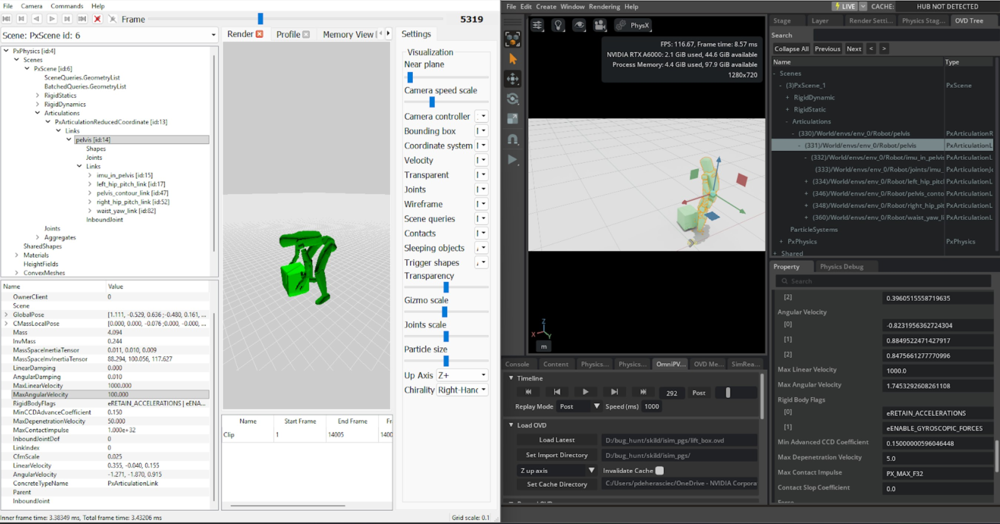

<a id="migrating-from-isaacgymenvs-comparing-simulation"></a>

# Isaac Gym과 Isaac Lab 사이의 시뮬레이션 비교

Isaac Gym에서 Isaac Lab로 시뮬레이션을 마이그레이션할 때, 두 설정 간의 차이를 식별하기 위해 Isaac Gym과 Isaac Lab의 시뮬레이션 구성 요소를 비교하는 것이 때때로 도움이 될 수 있습니다. 기본값이 어떻게 해석되는지, 임포터가 특정 몸체 계층 구조를 어떻게 처리하는지, 그리고 값이 어떻게 스케일링되는지에는 차이가 있을 수 있습니다. PhysX 관점에서 두 시뮬레이션이 동등함을 확신하는 유일한 방법은 두 설정의 시뮬레이션 추적을 기록하고 나란히 비교하여 검사하는 것입니다. 이 접근 방식이 효과적인 이유는 PhysX가 Isaac Gym과 Isaac Lab의 동일한 기본 엔진이지만 서로 다른 버전을 사용하기 때문입니다.

## Isaac Gym Preview Release에서 PXD2로 기록

Isaac Gym에서 시뮬레이션 추적은 내장된 PhysX 시각적 디버거(PVD) 파일 출력 기능을 사용하여 기록할 수 있습니다. 운영 체제 환경 변수 `GYM_PVD_FILE`을 원하는 출력 파일 경로로 설정하면, `.pxd2` 파일 확장자가 자동으로 추가됩니다.

자세한 지침은 Isaac Gym과 함께 제공되는 튜닝 문서를 참조하세요:

```text
isaacgym/docs/_sources/programming/tuning.rst.txt
```

#### 참고
이 파일 참조는 Isaac Gym에 온라인 설명서가 제공되지 않기 때문에 제공됩니다.

## Isaac Lab에서 OVD로 기록

Isaac Lab에서 OVD 시뮬레이션 추적 파일을 기록하려면 적절한 Isaac Sim Kit 인수를 설정해야 합니다. `omniPvdOvdRecordingDirectory` 변수를 `omniPvdOutputEnabled`를 `true`로 설정하기 **전에** 설정하는 것이 중요합니다.

```bash
./isaaclab.sh -p scripts/benchmarks/benchmark_non_rl.py --task <task_name> \
    --kit_args="--/persistent/physics/omniPvdOvdRecordingDirectory=/tmp/myovds/ \
    --/physics/omniPvdOutputEnabled=true"
```

이 예시는 `/tmp/myovds/` 디렉터리에 OVD 파일 시리즈를 출력합니다.

특정 설정에서 `--kit_args` 인수가 작동하지 않는 경우, Isaac Sim 소스 코드 내의 다음 파일을 직접 편집하여 Kit 인수를 수동으로 설정할 수 있습니다:

```text
source/extensions/isaacsim.simulation_app/isaacsim/simulation_app/simulation_app.py
```

`args = []` 블록 뒤에 다음 줄을 추가합니다:

```python
args.append("--/persistent/physics/omniPvdOvdRecordingDirectory=/path/to/output/ovds/")
args.append("--/physics/omniPvdOutputEnabled=true")
```

## PXD2 및 OVD 파일 검사

PVD 뷰어에서 PXD2 파일을 열고, OmniPVD(Kit 확장)에서 OVD 파일을 열면 두 시뮬레이션 실행 및 각각의 매개변수를 수동으로 비교할 수 있습니다.

**PXD2 파일을 위한 PhysX 시각적 디버거(PVD)**

NVIDIA 개발자 도구 페이지에서 PVD 뷰어를 다운로드하세요:

> [https://developer.nvidia.com/tools-downloads#?search=PVD](https://developer.nvidia.com/tools-downloads#?search=PVD)

PVD 뷰어 버전 2와 버전 3은 모두 PXD2 파일과 호환됩니다.

**OVD 파일을 위한 OmniPVD**

OVD 파일을 보려면 Isaac Sim 애플리케이션에서 OmniPVD 확장을 활성화하세요. 자세한 지침은 OmniPVD 개발자 가이드를 참조하세요:

> [https://docs.omniverse.nvidia.com/kit/docs/omni_physics/latest/extensions/ux/source/omni.physx.pvd/docs/dev_guide/physx_visual_debugger.html](https://docs.omniverse.nvidia.com/kit/docs/omni_physics/latest/extensions/ux/source/omni.physx.pvd/docs/dev_guide/physx_visual_debugger.html)

**OmniPVD에서 접촉 기즈모 검사**

객체 간 접촉 지점을 검사하려면 OmniPVD에서 접촉 기즈모를 활성화하세요. 시뮬레이션 프레임을 OmniPVD 타임라인에서 **PRE**(각 시뮬레이션 단계의 프리-시뮬레이션 프레임)로 설정하거나 재생 모드를 **PRE**로 설정하세요. 이렇게 하면 솔버가 각 단계를 처리하기 전에 접촉 정보를 시각화할 수 있습니다.

**PVD 및 OVD 파일 비교**

PVD 뷰어와 OmniPVD 확장을 사용하면 이제 시뮬레이션을 나란히 비교하여 구성 차이를 식별할 수 있습니다. 왼쪽은 PXD2 검사를 위한 PVD이고, 오른쪽은 OVD 파일을 검사하기 위해 로드된 OmniPVD 확장입니다.



## 시뮬레이션 비교 중에 확인해야 할 매개변수

PhysX artikูล레이션의 경우, 각 속성은 접촉 시, 드라이브 하에서, 그리고 제약 조건에서 링크 또는 모양이 실제로 어떻게 동작할지 드러내므로 검사하는 것이 유용합니다. 아래에서 각 속성을 확장하고 시뮬레이션 디버깅 및 튜닝에 왜 중요한지 설명합니다.

### PxArticulationLink

각 링크는 질량 특성, 감쇠, 속도 제한, 접촉 해상도 제한을 가진 강체처럼 동작합니다. 이러한 속성을 검사하면 불안정성, 떨림, 힘에 대한 비정상적인 반응을 설명하는 데 도움이 됩니다.

#### 질량 특성

**질량**
: 힘이 작용했을 때 링크가 얼마나 강하게 가속되는지와 충돌 및 조인트 제약에서 충격을 어떻게 공유하는지 결정합니다.
  <br/>
  *검사 시기:* 링크가 "너무 무겁다"(밀어도 거의 움직이지 않음) 또는 "너무 가볍다"(작은 impulso에도 날아다님) 하는 이유를 이해하고, 체인 전체에서 일관되지 않은 질량 분포로 인해 비현실적인 움직임이나 조인트 스트레스가 발생하는지 감지할 때.

**질량 중심(포즈)**
: 힘이 효과적으로 작용하는 위치와 링크의 균형을 제어합니다.
  <br/>
  *검사 시기:* 캐릭터나 메커니즘이 예기치 않게 넘어지거나 균형을 잃는 느낌일 때; 동일한 접촉에 대해 비현실적인 토크를 유발할 수 있는 COM 오프셋.

**관성 텐서 / 관성 스케일**
: 각 축에 대한 회전 저항을 정의합니다.
  <br/>
  *검사 시기:* 링크의 질량에 비해 회전이 너무 쉬우거나 너무 어려운 경우, 이는 조인트 드라이브 튜닝과 충격 반응에 영향을 줍니다.

#### 감쇠 특성

**선형 감쇠**
: 이동에 비례하는 드래그를 모델링합니다; 값이 높을수록 링크의 선형 속도가 더 빨리 감소합니다.
  <br/>
  *검사 시기:* 링크가 너무 멀리 미끄러짐(감쇠가 너무 낮음)하거나 "수중" 느낌(감쇠이 너무 높음)인 경우, 또는 명백한 접촉 없이 관절 에너지가 소모되는 것 같을 때.

**각도 감쇠**
: 회전에 대한 드래그를 모델링합니다; 값이 높을수록 회전하는 링크가 더 빨리 느려집니다.
  <br/>
  *검사 시기:* 링크가 충격이나 모터 구동 후에도 계속 회전함(너무 낮음)하거나, 조인트가 "끈적거려" 중력 하에서 자유롭게 흔들리지 못함(너무 높음).

#### 속도 특성

**선형 속도**
: 링크의 순간적인 월드 공간 이동 속도.
  <br/>
  *검사 시기:* 조인트 모터, 중력, 또는 접촉이 예상된 움직임을 생성하고 있는지 확인하고, 수치적 폭발(큰 spikes)을 감지하며, CCD 임계값 및 최대 선형 속도 제한과 관련시킵니다.

**각속도**
: 순간적인 월드 공간 회전 속도.
  <br/>
  *검사 시기:* 조인트 드라이브, 충격, 또는 제약이 올바른 회전을 생성하고 있는지 확인하고, 클램핑이 적용되기 전의 불안정성 또는 터널링을 유발할 수 있는 런어웨이 스핀을 발견합니다.

**최대 선형 속도**
: PhysX가 속도를 해결하기 전에 선형 속도를 클램핑하는 상한값이며, 매우 빠른 움직임으로 인한 수치적 문제를 방지하기 위한 것입니다.
  <br/>
  *검사 시기:* 높은 속도에서 객체가 터널링되거나 시뮬레이션이 폭발하기 시작할 때. 너무 높으면 링크가 한 단계에서 너무 멀리 이동할 수 있고, 너무 낮으면 링크가 비자연적으로 제한된 것처럼 보일 수 있음("속도 제한된" 로봇과 유사).

**최대 각속도**
: 각속도의 상한값이며, PhysX는 선형 속도와 유사하게 각속도를 클램핑합니다.
  <br/>
  *검사 시기:* 링크가 충돌이나 드라이브 후 비현실적으로 빠르게 회전함(값이 너무 큼)하거나, 바퀴 또는 로터와 같이 빠르게 회전해야 하는 물체에서 회전이 비자연적으로 제한되어 보임(값이 너무 작음).

#### 접촉 해상도 특성

**최대 관통 깊이 해소 속도**
: 접촉에서의 관통을 해결하기 위해 솔버가 한 단계에 추가할 수 있는 수정 속도를 제한합니다.
  <br/>
  *검사 시기:* 겹치는 링크가 관통 시작 후 "폭발" outward하거나 떨림 현상이 나타날 때(너무 높음), 또는 내장된 링크가 너무 천천히 분리되어 붙어 있는 것처럼 보일 때(너무 낮음).

**최대 접촉 임펄스**
: 솔버가 접촉에서 적용할 수 있는 임펄스를 제한합니다; 신체당 제한이며, 실제 접촉 제한은 두 신체의 값 중 최소값입니다.
  <br/>
  *검사 시기:* 접촉이 너무 부드러워서(신체가 환경에 깊게 관통하거나 가라앉음) 또는 너무 딱딱해서(날카로운 임펄스로 인해 ringing 또는 bouncing 발생), 또는 고무나 피부와 같은 surface와의 "soft 충돌"을 튜닝할 때.

#### 상태 및 동작 플래그

**운동학적 vs 동적 플래그 / 중력 비활성화**
: 링크가 운동학적으로 구동되는지 아니면 완전히 시뮬레이션되는지, 그리고 중력이 영향을 미치는지 나타냅니다.
  <br/>
  *검사 시기:* 부품이 얼어 보이거나, 바로 포즈로 스냅되거나, 중력을 무시하는 경우; 이는 artikูล레이션 동작을 크게 변경할 수 있습니다.

**수면 임계값(선형, 각도) 및 웨이크 카운터**
: 링크가 잠자기 상태가 되어 시뮬레이션을 중지하도록 허용하는 시기를 제어합니다.
  <br/>
  *검사 시기:* artikูล레이션이 너무 일찍 잠자기 상태가 되어 움직임이 멈추거나, 절대 잠자기 상태가 되지 않아 성능 낭비 및 저진폭 떨림 유발 시.
  limpact과 불안정의 원인입니다.

#### Drive 속성

**Drive 목표 위치(배향)와 목표 속도**
: 스프링-댐퍼 모델을 사용해 일반적으로 구동되는, articulation이 구동해야 하는 원하는 상대 위치와 상대 속도.
  <br/>
  *검사 시기:* 컨트롤러가 너무 느리거나 과도하게 치고 진동할 경우—목표 값과 드라이브 파라미터가 링크의 질량 및 관성에 일치해야 합니다.

**드라이브 강성과 감쇠(스프링 강도, 접선 감쇠)**
: 관절이 목표 자세를 얼마나 적극적으로 따라가려 하는지와 overshoot(과도한 움직임)를 얼마나 감쇠시키는지를 제어합니다.
  <br/>
  *검사 시기:* 하중 하에서 관절이 윙윙거리거나 진동할 때(강성 높음, 감쇠 낮음) 또는 반응이 느리고 “고무같은” 느낌을 줄 때(강성 낮음).

**관절 마찰 / 저항(구성된 경우)**
: 드라이브에 명시적 감쇠가 없더라도 저항을 추가합니다.
  <br/>
  *검사 시기:* 수동 관절이 너무 오래 흔들리거나, 드라이브 없이도 멈춘 것처럼 보이는 경우.

### PxShape

링크에 부착된 형태는 충돌 표현과 접촉 동작을 결정합니다. OmniPhysics 내부에 내부적으로 존재하더라도, 그 특성은 안정성, 접촉 타이밍, 시각적 정렬에 큰 영향을 미칩니다.

#### 충돌 오프셋

**Rest Offset(휴식 오프셋)**
: 두 형태가 휴식 상태에 도달하는 거리이며, 두 형태의 rest offset의 합이 그들이 “안정화”되는 분리 거리를 정의합니다.
  <br/>
  *검사 시기:* 그래픽스와 충돌이 맞지 않아 보이는 경우(틈새 또는 시각적 교차), 또는 메쉬 위를 슬라이드할 때 거칠게 느껴지는 경우. 작은 양의 오프셋은 슬라이드를 부드럽게 만들 수 있지만, 0 오프셋은 정확히 정렬되도록 하여 기하학에 걸릴 가능성이 있습니다.

**Contact Offset(접촉 오프셋)**
: 접촉 생성이 시작되는 거리이며, 두 형태의 거리가 contact offset의 합보다 작으면 접촉이 생성됩니다.
  <br/>
  *검사 시기:* 접촉이 “너무 일찍” 발생하는 경우(시각적으로 닿기 전에 물체가 충돌하는 것처럼 보여 접촉 수가 증가함) 또는 “너무 늦게” 발생하는 경우(터널링 또는 진동). 접촉 오프셋과 rest 오프셋의 차이는 예측 가능하고 안정적인 접촉을 위해 매우 중요합니다.

#### 기하학 및 재질

**기하학 유형과 크기**
: 상자, 구, 캡슐, 볼록, 메시와 관련된 크기 파라미터.
  <br/>
  *검사 시기:* 충돌 영역이 시각적 메시와 일치하지 않을 경우—너무 큰 형태는 접촉을 prematurely(예측보다 일찍) 유발하고, 너무 작은 형태는 시각적 교차를 허용하며 접촉 시 레버리지를 변경합니다.

**재질(들): 마찰, 복원력, 순응도**
: 마찰 계수와 복원력은 미끄러짐과 탄성을 정의합니다.
  <br/>
  *검사 시기:* 관절의 발이 너무 쉽게 미끄러지거나 땅에 달라붙거나 예기치 않게 튕기는 경우. 잘못된 재질 설정은 메커니즘을 불안정하거나 unresponsive(반응 없음)로 만들 수 있습니다.

#### Shape 플래그

**시뮬레이션 / 쿼리 / 트리거 플래그**
: 형태가 시뮬레이션 접촉에 참여하는지, 레이캐스트만 하는지, 트리거 이벤트를 발생시키는지 여부.
  <br/>
  *검사 시기:* 접촉이 나타나지 않는 경우(쿼리 전용으로 설정됨) 또는 트리거가 예기치 않게 물리적 충돌을 발생시키는 경우.

**접촉 밀도(CCD 플래그, 사용되는 경우)**
: 고속 링크가 어떻게 처리되는지에 영향을 주는 연속 충돌 탐지 플래그.
  <br/>
  *검사 시기:* 고속 articulation 부품이 얇은 장애물을 관통하거나(터널링) CCD가 지나치게 공격적이어서 성능을 저하시키는 경우.

### PxRigidDynamic

`PxRigidDynamic`은 PhysX에서 핵심 시뮬레이션 강체 유형이므로, 그 속성을 검사하는 것은 장면에 있는 개별 객체의 동작, 안정성, 성능을 이해하는 데 필수적입니다. 많은 속성이 `PxArticulationLink`와 유사하지만, 강체 동적은 articulation 조속에 의해 구속되지 않으며, 키네마틱 모드로도 사용될 수 있습니다.

#### 질량 및 질량 관련 속성

**질량**
: 힘과 충격에 대한 traslational(평행이동) 반응을 제어하며, 동일한 충격에 대해 질량이 낮을수록 속도 변화가 큽니다.
  <br/>
  *검사 시기:* 객체가 충격에 거의 반응하지 않는 경우(질량이 너무 큼) 또는 작은 힘에도 멀리 날아가는 경우(질량이 너무 작음), 또는 상호작용하는 객체 간의 질량 비율이 과도하게 dominante(우세)하거나 쉽게 bullied(흔들림)되는 경우.

**질량 중심(COM) 포즈**
: 힘이 효과적으로 작용하는 지점과 그 주위로 회전하는 지점을 정의합니다.
  <br/>
  *검사 시기:* 객체가 예기치 않게 넘어지거나 직관적이지 않은 방식으로 굴러가거나 “균형이 안 맞는다”고 느껴질 경우. COM이 너무 높이 있거나 중심에서 벗어나면 작은 접촉에서도 강한 토크가 발생할 수 있습니다.

**관성 텐서 / 관성 스케일링**
: given 토크에 대해 각 축 주변의 각가속도에 대한 저항을 결정합니다.
  <br/>
  *검사 시기:* 물체가 특정 축으로 회전하기 너무 쉬우거나 너무 어려운 경우(예: 작은 충격으로도 큰 물체가 빠르게 회전), 또는 각방향성 동작이 필요한 경우(예: 하나의 축 주위로는 쉽게 회전하지만 다른 축 주위로는 저항하는 바퀴).

#### 감쇠 및 속도 제한

**선형 감쇠**
: 평행이동에 속도 비례 드래그를 추가합니다.
  <br/>
  *검사 시기:* 물체가 너무 멀리 또는 너무 오래 미끄러지는 경우(감쇠 너무 낮음) 또는 두꺼운 유체를 통과하는 것처럼 움직이는 경우(감쇠 demasiado 높음), 그리고 마찰만으로는 설명할 수 없을 정도로 씬이 에너지를 빠르게 잃는 경우.

**각도 감쇠**
: 회전에 드래그를 추가하여 시간이 지남에 따라 각속도를 줄입니다.
  <br/>
  *검사 시기:* 회전하는 물체가 절대 멈추지 않거나 비현실적으로 오랫동안 회전하는 경우(감쇠 너무 낮음), 또는 충돌 또는 모터 충격 직후 거의 즉시 회전이 멈추는 경우(감쇠 너무 높음).

**선형 속도**
: 적분기와 솔버가 사용하는 현재 평행이동 속도입니다.
  <br/>
  *검사 시기:* 디버그 충격, 중력, 또는 적용된 힘을 통해 객체가 기대대로 가속하고 있는지 확인하거나, 속도의 스파이크 또는 비물리적 점프를 감지합니다.

**각도 속도**
: 각 축 주변의 현재 회전 속도입니다.
  <br/>
  *검사 시기:* 회전이 뒤틀려 보이거나 수치적으로 폭발하거나 적용된 토크에 반응하지 않는 경우. 시간 단계와 객체 규모에 비해 높은 값은 불안정을 나타낼 수 있습니다.

**최대 선형 속도**
: 해결 전 선형 속도를 제한하기 위한 상한값입니다.
  <br/>
  *검사 시기:* 매우 빠른 물체가 터널링 또는 시뮬레이션 폭발을 일으키는 경우(값이 너무 높음) 또는 고에너지 씬의 투사체나 파편처럼 비자연적으로 “속도 제한”된 것처럼 보이는 경우(값이 너무 낮음).

**최대 각도 속도**
: 해결 전 각속도를 제한하기 위한 상한값입니다.
  <br/>
  *검사 시기:* 얇거나 작은 물체가 너무 빠르게 회전하여 씬을 불안정하게 만드는 경우(값이 너무 높음) 또는 바퀴, 프로펠러, 파편과 같은 회전 요소가 인공적으로 제한된 것처럼 보이는 경우(값이 너무 낮음).

#### 접촉 해결 및 충격

**최대 관통 깊이 해소 속도**
: 한 단계에서 관통을 해결하기 위해 솔버가 도입할 수 있는 보정 속도의 상한값입니다.
  <br/>
  *검사 시기:* 교차하는 물체가 너무 높게 설정되어 “폭발”하듯 떨어지거나 격렬하게 진동하는 경우, 또는 너무 낮게 설정되어 매우 langsam히 분리되어 몇 프레임 동안 붙어버리거나 관통된 상태로 보이는 경우.

**최대 접촉 충격**
: 이 물체와 관련된 접촉에 적용할 수 있는 충격을 제한하며, 실질적인 한계는 두 물체 사이의 최소값이거나, 정적-동적 접촉의 경우 동적 물체입니다.
  <br/>
  *검사 시기:* 충격 제한을 낮춰 더 부드러운 접촉을 만들거나, 높거나 기본 제한으로 거의 항복하지 않는 강성 물체를 만듦. 물체가 서로 안으로 가라앉거나 비현실적으로 튀는 경우.

#### 수면 및 활성화 동작

**수면 임계값**
: 몸이 수면 후보가 되는 질량 정규화된 운동 에너지 이하 값입니다.
  <br/>
  *검사 시기:* 물체가 움직여야 할 때 너무 일찍 잠드는 경우(임계값이 너무 높음) 또는 계속 진동하여 절대 잠들지 않는 경우(임계값이 너무 낮음)—성능 저하를 초래할 수 있음.

**웨이크 카운터 / isSleeping 플래그**
: 몸이 활성 상태인지 여부를 나타내는 내부 타이머와 상태 플래그.
  <br/>
  *검사 시기:* 물체가 상호작용 시 깨지 않거나 너무 쉽게 깨는 경우. 나쁜 수면 동작은 씬이 “ morto”(죽은 듯이) 느껴지거나 지나치게 시끄럽게 만들 수 있음.

#### 키네마틱 모드 및 잠금

**키네마틱 플래그(PxRigidBodyFlag::eKINEMATIC)**
: 설정 시, 몸은 `setKinematicTarget`로 이동하고 힘과 중력을 무시하면서도 접촉하는 동적 물체에 영향을 미칩니다.
  <br/>
  *검사 시기:* 물체가 무한한 질량을 가진 것처럼 보이며(다른 것을 밀지만 자신은 반응하지 않음) 또는 중력과 충격을 무시하는 경우. 여기서의 기대 불일치는 캐릭터, 이동 플랫폼, 또는 문에서 흔히 발생하는 이상한 동작의 원인이 됩니다.

**강체 동적 잠금 플래그(PxRigidDynamicLockFlag)**
: 선형 및 각도 자유도를 축별로 잠그는 플래그로, 조인트 없이 동작을 효과적으로 제한합니다.
  <br/>
  *검사 시기:* 잠금이 설정되지 않았는데도 몸을 제한된 방향으로 움직이는 경우 또는 잠금이 잘못 설정되어야 할 방향으로 움직이지/회전하지 않는 경우—특히 2D 스타일 움직임이나 간단한 제한 메커니즘에서 중요함.

**중력 비활성화(PxActorFlag::eDISABLE_GRAVITY)**
: 장면의 중력이 몸에 영향을 미치는지 여부를 토글합니다.
  <br/>
  *검사 시기:* 물체가 중력의 영향을 받지 않아 공중에 떠 있거나 예기치 않게 떨어지는 경우. 일부 물체에 중력이 없고 일부에는 있는 혼합 설정에서 흔히 발생하는 혼란의 원인입니다.

#### 힘 및 솔버 오버라이드

**적용된 힘과 토크(단계당 누적)**
: 속도에 적분될 순 힘과 토크입니다.
  <br/>
  *검사 시기:* 스러스터, 캐릭터 푸시, 폭발과 같은 게임플레이 힘을 디버그하여 해당 입력이 실제로 몸까지 도달하는지 확인합니다.

**물체별 솔버 반복 횟수 오버라이드(minPositionIters, minVelocityIters)**
: 이 물체가 구속 및 접촉에서 받는 솔버 반복 횟수를 재정의합니다.
  <br/>
  *검사 시기:* 특정 물체(예: 캐릭터, 쌓인 상자, 취약한 구조물)가 더 높은 안정성 또는 정확한 쌓기를 위해 필요한 경우. 반복 횟수가 너무 낮으면 진동과 관통이 발생할 수 있고, 너무 높으면 성능이 낭비됩니다.

#### 형태 관련 측면

`PxRigidDynamic` 자체의 속성은 아니지만, 그에 부착된 형태는 동작에 크게 영향을 미칩니다.

**부착된 형태의 Rest 및 Contact 오프셋**
: 앞서 설명한 것과 같이 예측 가능한 접촉 생성 및 시각적 분리를 제어합니다.
  <br/>
  *검사 시기:* 동적 물체가 너무 일찍/늦게 충돌하는 것처럼 보이거나, 표면 위에서 떠 있거나 시각적으로 교차하는 경우.

**부착된 재질(마찰, 복원력)**
: 이 물체의 접촉에 대한 미끄러짐과 탄성을 정의합니다.
  <br/>
  *검사 시기:* 강체가 예기치 않게 미끄러지거나 달라붙거나 튀는 경우. 종종 “동작 문제”는 질량이나 감쇠가 아니라 재질 구성 때문입니다.

### 요약: 무엇을 점검하고 왜 점검해야 하는가

다음 표는 각 PhysX 컴포넌트에 대한 주요 점검 영역을 요약한 것입니다.

| 컴포넌트         | 주요 속성                                                     | 디버깅 초점                                                     |
|------------------|-------------------------------------------------------------|-------------------------------------------------------------|
| **링크**         | 질량, 감쇠, 속도, 제한                                      | 전체 에너지, 안정성, 조인트/접촉에 대한 반응                  |
| **조인트**       | 운동, 제한, 드라이브                                        | 관절 자세의 진화 과정; 과제약 또는 과잉 제약된 움직임         |
| **형태**         | 오프셋, 재질, 기하학                                        | 접촉 타이밍, 마찰 동작, 시각적 vs 물리적 정렬                 |
| **강체 동적**    | 질량, 관성, 감쇠, 속도 제한, 수면, 키네마틱 플래그          | 가속도, 안정화, 극한 동작, 몸 상태                            |

이 모든 속성들을 함께 고려하면 관절식 또는 강체가 특정 방식으로 동작하는 이유를 종합적으로 이해하고, 안정성, 현실감, 또는 제어 성능을 위해 파라미터를 조정해야 할 위치를 파악할 수 있습니다.
