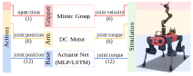
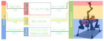

# 액추에이터

관절식 시스템은 자유도(DOF)라고도 하는 액추에이팅된 관절로 구성됩니다. 물리적 시스템에서 액추에이션은 전기 또는 유압 모터와 같은 액티브 컴포넌트, 또는 스프링과 같은 패시브 컴포넌트를 통해 일반적으로 발생합니다. 이러한 컴포넌트는 지연 또는 최대 생성 가능한 속도 또는 토크와 같은 특정 비선형 특성을 도입할 수 있습니다.

시뮬레이션에서 관절은 위치, 속도 또는 토크로 제어됩니다. 위치 및 속도 제어의 경우, 물리 엔진이 내부적으로 스프링-댐퍼(PD) 컨트롤러를 구현하여 액추에이팅된 관절에 가해지는 토크를 계산합니다. 토크 제어의 경우, 명령이 직접 관절 노력으로 설정됩니다. 이는 관절 메커니즘의 이상적인 행동을 모방하지만, 물리 세계에서 드라이브가 실제로 어떻게 작동하는지를 진정으로 모델링하지는 않습니다. 따라서, 물리 로봇의 동작을 대표하는 관절 명령을 계산하기 위해 외부 모델을 주입하는 메커니즘을 제공합니다.

## 액추에이터 모델

우리는 두 가지 다른 유형의 액추에이터 모델을 정의합니다:

1. **암시적**: 물리 엔진에서 제공되는 이상적인 시뮬레이션 메커니즘에 해당됩니다.
2. **명시적**: 사용자에 의해 구현된 외부 드라이브 모델에 해당됩니다.

명시적 액추에이터 모델은 두 단계로 수행됩니다: 1) 입력 명령을 추적하기 위한 원하는 관절 토크를 계산하고, 2) 모터 기능에 따라 원하는 토크를 클리핑합니다. 클리핑된 토크는 시뮬레이터에 설정되는 원하는 액추에이션 노력이 됩니다.

이상적인 명시적 액추에이터 모델의 예로, 피드-포워드 노력이 포함된 PD 컨트롤러를 구현하고 구성된 최대 노력에 기반한 단순한 클리핑을 수행하는 [`isaaclab.actuators.IdealPDActuator`](../../api/lab/isaaclab.actuators.md#isaaclab.actuators.IdealPDActuator) 클래스를 제공합니다:

$$
\tau_{j, computed} & = k_p * (q_{des} - q) + k_d * (\dot{q}_{des} - \dot{q}) + \tau_{ff} \\
\tau_{j, max} & = \gamma \times \tau_{motor, max} \\
\tau_{j, applied} & = clip(\tau_{computed}, -\tau_{j, max}, \tau_{j, max})
$$

여기서, $k_p$와 $k_d$는 관절 강성 및 감쇠 이득이며, $q$와 $\dot{q}$는 현재 관절 위치 및 속도, $q_{des}$، $\dot{q}_{des}$ 및 $\tau_{ff}$는 원하는 관절 위치, 속도 및 토크 명령입니다. 파라미터 $\gamma$ 및 $\tau_{motor, max}$는 기어 박스 비율 및 최대 가능 모터 노력입니다.

## 액추에이터 그룹

액추에이터 모델 자체는 원하는 관절 명령을 입력으로 받아 시뮬레이터에 적용할 관절 명령을 출력하는 계산 블록입니다. 자체적으로 작용하는 관절에 대한 지식을 포함하지 않습니다. 이는 물리 엔진의 관절 클래스를 래핑하는 [`isaaclab.assets.Articulation`](../../api/lab/isaaclab.assets.md#isaaclab.assets.Articulation) 클래스가 처리합니다.

액추에이터는 동일한 액추에이터 모델을 사용하는 관절의 집합으로서 액추에이션이 가능한 관절 그룹으로 수집됩니다. 예를 들어, 사족 보행 로봇인 ANYmal-C는 모든 관절에 시리즈 탄성 액추에이터인 ANYdrive 3.0을 사용합니다. 이 그룹화는 해당 관절에 대한 액추에이터 모델을 구성하고, 입력 명령을 관절 수준 명령으로 변환하며, 시뮬레이터에 설정할 관절 행동을 반환합니다. DC 모터와 같은 다른 액추에이터 모델을 사용하는 팔의 경우, 다른 액추에이터 그룹을 구성해야 합니다.

다음 그림은 다리 이동 조작기의 액추에이터 그룹을 보여줍니다:

#### 참고
다양한 명시적 액추에이터 모델의 구현을 제공합니다.詳細は[isaaclab.actuators](../../api/lab/isaaclab.actuators.html) 서브패키지에서 확인할 수 있습니다.

## 액추에이터 사용 시 고려 사항

앞 섹션에서 설명한 것처럼, 액추에이터 모델에는 암시적과 명시적의 두 가지 주요 유형이 있습니다. 암시적 액추에이터 모델은 물리 엔진에서 제공됩니다. 이는 사용자가 원하는 위치 또는 속도를 설정할 때, 물리 엔진이 내부적으로 원하는 행동을 달성하기 위해 관절에 가해야 하는 노력을 계산함을 의미합니다. PhysX에서, PD 컨트롤러는 원하는 노력에 수치적 감쇠를 추가하여 더 안정적인 동작을 초래합니다.

명시적 액추에이터 모델은 사용자가 제공합니다. 이는 사용자가 원하는 위치 또는 속도를 설정할 때, 사용자의 모델이 원하는 행동을 달성하기 위해 관절에 가해야 하는 노력을 계산함을 의미합니다. 이는 더 많은 유연성을 제공하지만, 일부 수치적 불안정성을 초래할 수도 있습니다. 이를 완화하는 한 가지 방법은 USD 파일 또는 articulation 구성에서 액추에이터 모델의 `armature` 매개변수를 사용하는 것입니다. 이 매개변수는 관절 반응을 감쇠시키고 시뮬레이션의 수치적 안정성을 향상시키는 데 사용됩니다. 관절 안정성을 향상시키는 방법에 대한 자세한 내용은 [OmniPhysics 문서](https://docs.omniverse.nvidia.com/kit/docs/omni_physics/latest/dev_guide/guides/articulation_stability_guide.html)에서 확인할 수 있습니다.

이는 사용자에게 어떤 의미인가요? 암시적 액추에이터로 훈련된 정책이 명시적 액추에이터를 사용할 때 정확한 동일 로봇 모델로 전이되지 않을 수 있음을 의미합니다. 이와 같은 문제로 어려움을 겪고 있거나, 명시적 액추에이터에서는 정책이 수렴하지 않지만 암시적 액추에이터에서는 수렴하는 경우, `armature` 매개변수를 증가시키거나 더 높은 값으로 설정하면 도움이 될 수 있습니다.
