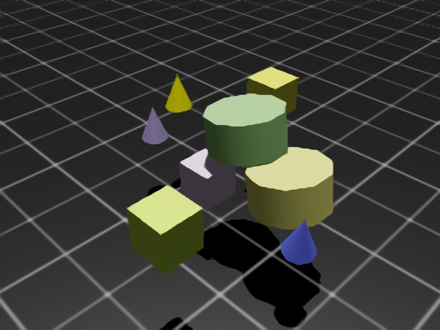
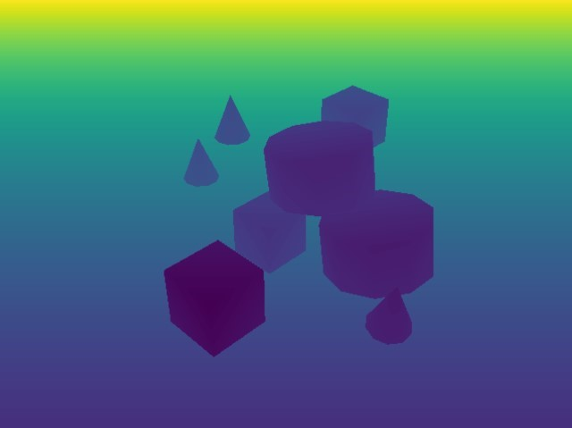
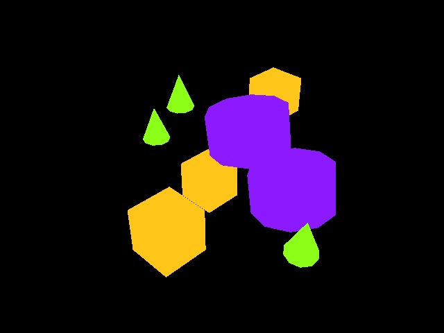
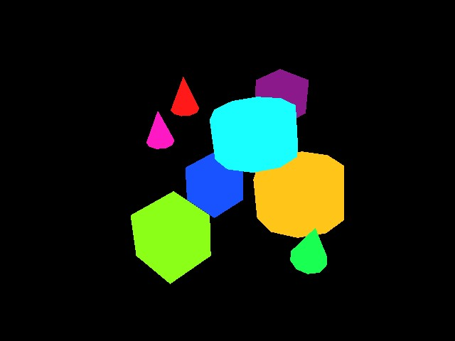

<a id="overview-sensors-camera"></a>

# Camera

카메라 센서는 `render_product` 사용을 통해 고유하게 정의됩니다. 이는 렌더링 파이프라인에서 생성된 데이터(이미지)를 관리하기 위한 구조입니다. Isaac Lab은 초점 거리, 포즈, 유형 등 카메라 파라미터를 통해 이러한 렌더링이 어떻게 생성되는지를 완전히 제어할 수 있도록 제공합니다. Annotator를 사용하면 RGB뿐만 아니라 인스턴스 세분화, 객체 포즈, 객체 ID 등 다양한 종류의 데이터를 렌더링할 수 있습니다.

렌더링된 이미지는 이동 시 inherent한 대역폭 요구 사항으로 인해 Isaac Lab에서 지원되는 다른 데이터 유형과 차별화됩니다. 800 x 600 해상도의 32비트 색상(픽셀당 단일 float) 이미지 하나로도 약 2 MB에 해당됩니다. 60 fps로 렌더링하고 모든 프레임을 기록하면 카메라당 초당 120 MB의 데이터 이동이 필요합니다. 환경 내 카메라 수와 시뮬레이션 내 환경 수를 곱하면 naive한 카메라 데이터 벡터화 확장이 대역폭 문제를 초래할 수 있음을 빠르게 알 수 있습니다. NVIDIA의 Isaac Lab은 GPU 하드웨어 전문성을 활용하여 렌더링 파이프라인에서의 이러한 확장성 문제를 해결하는 API를 제공합니다.

## 타일 렌더링

#### NOTE
이 기능은 Isaac Sim 버전 4.2.0부터 제공됩니다.

타일 렌더링은 이미지 처리 네트워크와 결합될 때 특히 높은 해상도에서 막대한 메모리 리소스를 요구합니다. RTX 4090 GPU 또는 유사한 사양에서는 장면 내 512대의 카메라 실행을 권장합니다.

타일 렌더링 API는 카메라 센서로부터의 데이터 수집을 위한 벡터화된 인터페이스를 제공합니다. 이는 강화 학습 환경에서 병렬 처리를 활용하여 데이터 수집을 가속화하고 따라서 학습 루프를 개선하는 데 유용합니다. 타일 렌더링은 장면 내 단일 카메라의 모든 클론에 대해 단일 `render_product`를 사용합니다. 단일 이미지의 원하는 치수와 환경 수를 활용하여 훨씬 더 큰 `render_product`를 계산하는데, 이는 카메라의 별도 클론으로부터 타일링된 개별 렌더링으로 구성됩니다. 모든 카메라가 버퍼를 채우면 렌더 제품이 "완성" 상태가 되며, 호스트에서 디바이스로 데이터를 이동하는 오버헤드를 크게 줄인 단일 대형 이미지로 이동될 수 있습니다. 카메라당 한 번의 호출 대신 단일 호출만으로 디바이스 데이터를 동기화할 수 있으며, 이것이 타일 렌더링 API가 비전 데이터 작업에 더 효율적인 핵심 요소입니다.

Isaac Lab은 [`TiledCamera`](../../../api/lab/isaaclab.sensors.md#isaaclab.sensors.TiledCamera) 클래스를 통해 RGB, 깊이 및 기타 annotator에 대한 타일 렌더링 API를 제공합니다. 타일 렌더링 API 구성은 [`TiledCameraCfg`](../../../api/lab/isaaclab.sensors.md#isaaclab.sensors.TiledCameraCfg) 클래스를 통해 정의할 수 있으며, 여기서 모든 카메라 경로에 대한 정규식 표현, 카메라 변환, 원하는 데이터 유형, 장면에 추가할 카메라 유형, 카메라 해상도 등의 매개변수를 지정할 수 있습니다.

```python
tiled_camera: TiledCameraCfg = TiledCameraCfg(
    prim_path="/World/envs/env_.*/Camera",
    offset=TiledCameraCfg.OffsetCfg(pos=(-7.0, 0.0, 3.0), rot=(0.9945, 0.0, 0.1045, 0.0), convention="world"),
    data_types=["rgb"],
    spawn=sim_utils.PinholeCameraCfg(
        focal_length=24.0, focus_distance=400.0, horizontal_aperture=20.955, clipping_range=(0.1, 20.0)
    ),
    width=80,
    height=80,
)
```

타일 렌더링 인터페이스에 접근하려면 [`TiledCamera`](../../../api/lab/isaaclab.sensors.md#isaaclab.sensors.TiledCamera) 객체를 생성하여 카메라로부터 데이터를 가져올 수 있습니다.

```python
tiled_camera = TiledCamera(cfg.tiled_camera)
data_type = "rgb"
data = tiled_camera.data.output[data_type]
```

반환된 데이터는 (num_cameras, height, width, num_channels) 형태가 되며, 이는 강화 학습의 관측값으로 직접 사용할 수 있습니다.

렌더링 작업 시 환경을 실행할 때 `--enable_cameras` 인자를 추가해야 합니다. 예를 들어:

```shell
python scripts/reinforcement_learning/rl_games/train.py --task=Isaac-Cartpole-RGB-Camera-Direct-v0 --headless --enable_cameras
```

## Annotators

[`TiledCamera`](../../../api/lab/isaaclab.sensors.md#isaaclab.sensors.TiledCamera)와 [`Camera`](../../../api/lab/isaaclab.sensors.md#isaaclab.sensors.Camera) 클래스 모두 Replicator에서 다양한 유형의 annotator 데이터를 가져오는 API를 제공합니다.

* `"rgb"`: 3채널 렌더링된 컬러 이미지.
* `"rgba"`: 알파 채널이 포함된 4채널 렌더링된 컬러 이미지.
* `"distance_to_camera"`: 카메라 광학 중심까지의 거리를 포함하는 이미지.
* `"distance_to_image_plane"`: 카메라 평면으로부터 카메라의 Z축을 따라 3D 점들의 거리를 포함하는 이미지.
* `"depth"`: `"distance_to_image_plane"`와 동일합니다.
* `"normals"`: 각 픽셀에서의 로컬 표면 법선 벡터를 포함하는 이미지.
* `"motion_vectors"`: 각 픽셀에서의 모션 벡터 데이터를 포함하는 이미지.
* `"semantic_segmentation"`: 의미론적 세분화 데이터.
* `"instance_segmentation_fast"`: 인스턴스 세분화 데이터.
* `"instance_id_segmentation_fast"`: 인스턴스 ID 세분화 데이터.

## RGB 및 RGBA



`rgb` 데이터 유형은 `torch.uint8` 타입의 3채널 RGB 컬러 이미지를 반환하며, 차원은 (B, H, W, 3)입니다.

`rgba` 데이터 유형은 `torch.uint8` 타입의 4채널 RGBA 컬러 이미지를 반환하며, 차원은 (B, H, W, 4)입니다.

`torch.uint8` 데이터를 `torch.float32`로 변환하려면 버퍼를 255.0으로 나누어 0에서 1 사이의 값을 갖는 `torch.float32` 버퍼를 얻을 수 있습니다.

## 깊이 및 거리



`distance_to_camera`는 카메라 광학 중심까지의 거리를 갖는 단일 채널 깊이 이미지를 반환합니다. 이 어노테이터의 차원은 (B, H, W, 1)이며 타입은 `torch.float32`입니다.

`distance_to_image_plane`는 카메라 평면으로부터 카메라의 Z축을 따라 3D 점들의 거리를 갖는 단일 채널 깊이 이미지를 반환합니다. 이 어노테이터의 차원은 (B, H, W, 1)이며 타입은 `torch.float32`입니다.

`depth`는 `distance_to_image_plane`의 별칭으로 제공되며, 차원 (B, H, W, 1)과 타입 `torch.float32`를 갖는 `distance_to_image_plane` 어노테이터와 동일한 데이터를 반환합니다.

## 법선


`normals`는 각 픽셀에서의 로컬 표면 법선 벡터를 포함하는 이미지를 반환합니다. 버퍼는 차원 (B, H, W, 3)를 가지며, 각 벡터에 대한 (x, y, z) 정보를 포함하고 데이터 타입은 `torch.float32`입니다.

## 모션 벡터

`motion_vectors`는 이미지 공간에서의 픽셀별 모션 벡터를 반환하며, 카메라의 뷰포트에서 프레임 간 픽셀의 상대적 움직임을 나타내는 2D 모션 벡터 배열을 갖습니다. 버퍼는 차원 (B, H, W, 2)를 가지며, x는 이미지 너비(가로 축)에 대한 이동 거리(이미지 왼쪽으로의 이동은 양수, 오른쪽으로의 이동은 음수)를 나타내고, y는 이미지 높이(세로 축)에 대한 이동 거리(이미지 위쪽으로의 이동은 양수, 아래쪽으로의 이동은 음수)를 나타냅니다. 데이터 타입은 `torch.float32`입니다.

## 의미론적 세분화



`semantic_segmentation`은 시맨틱 라벨이 있는 카메라 뷰포트의 각 엔티티에 대한 의미론적 세분화를 출력합니다. 이미지 버퍼 외에도 `tiled_camera.data.info['semantic_segmentation']`을 통해 ID-라벨 정보를 포함한 `info` 딕셔너리를 가져올 수 있습니다.

- 카메라 설정에서 `colorize_semantic_segmentation=True`이면, 차원 (B, H, W, 4)와 타입 `torch.uint8`인 4채널 RGBA 이미지가 반환됩니다. 정보의 `idToLabels` 딕셔너리는 색상에서 의미론적 라벨로의 매핑이 됩니다.
- `colorize_semantic_segmentation=False`이면, 차원 (B, H, W, 1)과 타입 `torch.int32`인 버퍼가 반환되며, 각 픽셀의 의미론적 ID를 포함합니다. 정보의 `idToLabels` 딕셔너리는 의미론적 ID에서 의미론적 라벨로의 매핑이 됩니다.

## 인스턴스 ID 세분화


`instance_id_segmentation_fast`는 카메라 뷰포트의 각 엔티티에 대한 인스턴스 ID 세분화를 출력합니다. 인스턴스 ID는 경로가 다른 씬의 각 프림에 대해 고유합니다. 이미지 버퍼 외에도 `tiled_camera.data.info['instance_id_segmentation_fast']`을 통해 ID-라벨 정보를 포함한 `info` 딕셔너리를 가져올 수 있습니다.

`instance_id_segmentation_fast`와 `instance_segmentation_fast`의 주요 차이점은 인스턴스 세분화 어노테이터가 의미론적 라벨을 가진 가장 낮은 수준의 프림까지 계층을 내려가는 반면, 인스턴스 ID 세분화는 항상 리프 프림까지 내려간다는 점입니다.

- 카메라 설정에서 `colorize_instance_id_segmentation=True`이면, 차원 (B, H, W, 4)와 타입 `torch.uint8`인 4채널 RGBA 이미지가 반환됩니다. 정보의 `idToLabels` 딕셔너리는 색상에서 해당 엔티티의 USD 프림 경로로의 매핑이 됩니다.
- `colorize_instance_id_segmentation=False`이면, 차원 (B, H, W, 1)과 타입 `torch.int32`인 버퍼가 반환되며, 각 픽셀의 인스턴스 ID를 포함합니다. 정보의 `idToLabels` 딕셔너리는 인스턴스 ID에서 해당 엔티티의 USD 프림 경로로의 매핑이 됩니다.

### 인스턴스 세분화



`instance_segmentation_fast`는 카메라 뷰포트의 각 엔티티에 대한 인스턴스 세분화를 출력합니다. 이미지 버퍼 외에도 `tiled_camera.data.info['instance_segmentation_fast']`을 통해 ID-라벨 및 ID-시맨틱 정보를 포함한 `info` 딕셔너리를 가져올 수 있습니다.

- 카메라 설정에서 `colorize_instance_segmentation=True`이면, 차원 (B, H, W, 4)와 타입 `torch.uint8`인 4채널 RGBA 이미지가 반환됩니다.
- `colorize_instance_segmentation=False`이면, 차원 (B, H, W, 1)과 타입 `torch.int32`인 버퍼가 반환되며, 각 픽셀의 인스턴스 ID를 포함합니다.

정보의 `idToLabels` 딕셔너리는 색상에서 해당 의미론적 엔티티의 USD 프림 경로로의 매핑이 됩니다. 정보의 `idToSemantics` 딕셔너리는 색상에서 해당 의미론적 엔티티의 의미론적 라벨로의 매핑이 됩니다.
