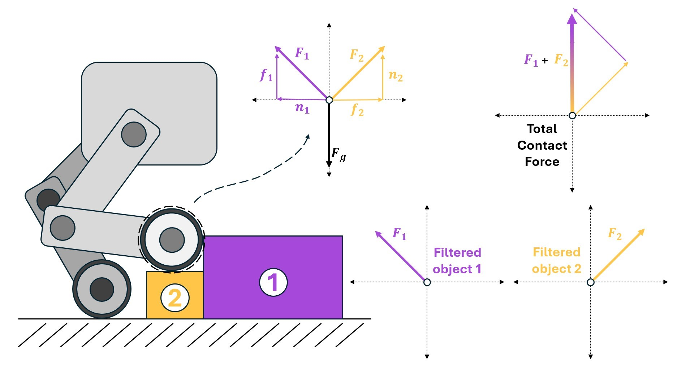
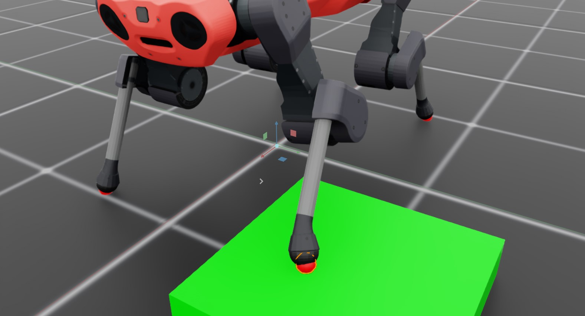

<a id="overview-sensors-contact"></a>

# 접촉 센서



접촉 센서는 특정 강성(body) 신체에 작용하는 순(net) 접촉 힘을 반환하도록 설계되었습니다. 센서는 물리적 객체처럼 동작하도록 작성되었으며, 따라서 "범위"는 접촉 센서를 정의하는 신체(또는 신체들)로 제한됩니다. 접촉에서 발생하는 힘을 필터링해야 하는 요구에 따라 이 범위를 정의하는 여러 가지 방법이 있습니다.

기본적으로 보고되는 힘은 총 접촉력이지만, 애플리케이션에서는 특정 객체로 인한 접촉 힘만 관심이 있을 수 있습니다. 특정 객체로부터의 접촉 힘을 얻으려면 필터링이 필요하며, 이는 "다대일" 방식으로만 수행할 수 있습니다. 다리 로봇이 발에 대한 필터링 가능한 접촉 정보를 필요로 하는 경우, 발마다 하나의 센서를 환경에서 정의해야 하지만, 각 손가락 끝에 접촉 센서가 있는 로봇 손은 하나의 센서로 정의할 수 있습니다.

안ymal 쿼드러페드와 블록이 있는 간단한 환경을 고려해 보세요

```python
@configclass
class ContactSensorSceneCfg(InteractiveSceneCfg):
    """로봇에 센서를 배치한 씬 설계."""

    # ground plane
    ground = AssetBaseCfg(prim_path="/World/defaultGroundPlane", spawn=sim_utils.GroundPlaneCfg())

    # lights
    dome_light = AssetBaseCfg(
        prim_path="/World/Light", spawn=sim_utils.DomeLightCfg(intensity=3000.0, color=(0.75, 0.75, 0.75))
    )

    # robot
    robot = ANYMAL_C_CFG.replace(prim_path="{ENV_REGEX_NS}/Robot")

    # Rigid Object
    cube = RigidObjectCfg(
        prim_path="{ENV_REGEX_NS}/Cube",
        spawn=sim_utils.CuboidCfg(
            size=(0.5, 0.5, 0.1),
            rigid_props=sim_utils.RigidBodyPropertiesCfg(),
            mass_props=sim_utils.MassPropertiesCfg(mass=100.0),
            collision_props=sim_utils.CollisionPropertiesCfg(),
            physics_material=sim_utils.RigidBodyMaterialCfg(static_friction=1.0),
            visual_material=sim_utils.PreviewSurfaceCfg(diffuse_color=(0.0, 1.0, 0.0), metallic=0.2),
        ),
        init_state=RigidObjectCfg.InitialStateCfg(pos=(0.5, 0.5, 0.05)),
    )

    contact_forces_LF = ContactSensorCfg(
        prim_path="{ENV_REGEX_NS}/Robot/LF_FOOT",
        update_period=0.0,
        history_length=6,
        debug_vis=True,
        filter_prim_paths_expr=["{ENV_REGEX_NS}/Cube"],
    )

    contact_forces_RF = ContactSensorCfg(
        prim_path="{ENV_REGEX_NS}/Robot/RF_FOOT",
        update_period=0.0,
        history_length=6,
        debug_vis=True,
        filter_prim_paths_expr=["{ENV_REGEX_NS}/Cube"],
    )

    contact_forces_H = ContactSensorCfg(
        prim_path="{ENV_REGEX_NS}/Robot/.*H_FOOT",
        update_period=0.0,
        history_length=6,
        debug_vis=True,
    )
```

로봇 발에 센서를 두 가지 다른 방식으로 정의합니다. 앞발은 독립적인 센서(발당 하나의 센서 몸체)로 정의하고, "큐브"는 왼쪽 발 아래에 배치합니다. 반면에 뒤발은 여러 몸체를 가진 단일 센서로 정의합니다.

그런 다음 씬을 실행하고 센서에서 데이터를 출력할 수 있습니다

```python
def run_simulator(sim: sim_utils.SimulationContext, scene: InteractiveScene):
  .
  .
  .
  # Simulate physics
  while simulation_app.is_running():
    .
    .
    .
    # 센서에서 정보 출력
    print("-------------------------------")
    print(scene["contact_forces_LF"])
    print("Received force matrix of: ", scene["contact_forces_LF"].data.force_matrix_w)
    print("Received contact force of: ", scene["contact_forces_LF"].data.net_forces_w)
    print("-------------------------------")
    print(scene["contact_forces_RF"])
    print("Received force matrix of: ", scene["contact_forces_RF"].data.force_matrix_w)
    print("Received contact force of: ", scene["contact_forces_RF"].data.net_forces_w)
    print("-------------------------------")
    print(scene["contact_forces_H"])
    print("Received force matrix of: ", scene["contact_forces_H"].data.force_matrix_w)
    print("Received contact force of: ", scene["contact_forces_H"].data.net_forces_w)
```

여기서는 씬에 정의된 각 접촉 센서에 대해 순 접촉 힘과 필터링된 힘 행렬을 모두 출력합니다. 앞 왼쪽 발과 앞 오른쪽 발은 다음과 같이 보고합니다

```bash
-------------------------------
Contact sensor @ '/World/envs/env_.*/Robot/LF_FOOT':
        view type         : <class 'omni.physics.tensors.impl.api.RigidBodyView'>
        update period (s) : 0.0
        number of bodies  : 1
        body names        : ['LF_FOOT']

Received force matrix of:  tensor([[[[-1.3923e-05,  1.5727e-04,  1.1032e+02]]]], device='cuda:0')
Received contact force of:  tensor([[[-1.3923e-05,  1.5727e-04,  1.1032e+02]]], device='cuda:0')
-------------------------------
Contact sensor @ '/World/envs/env_.*/Robot/RF_FOOT':
        view type         : <class 'omni.physics.tensors.impl.api.RigidBodyView'>
        update period (s) : 0.0
        number of bodies  : 1
        body names        : ['RF_FOOT']

Received force matrix of:  tensor([[[[0., 0., 0.]]]], device='cuda:0')
Received contact force of:  tensor([[[1.3529e-05, 0.0000e+00, 1.0069e+02]]], device='cuda:0')
```



필터링을 적용하더라도 두 센서 모두 발에 작용하는 순 접촉 힘을 보고한다는 점에 유의하세요. 하지만 오른쪽 발의 "힘 행렬"은 필터링된 대상인 `/World/envs/env_.*/Cube`와 접촉하지 않아 0입니다. 이제 뒤발에서 나오는 데이터를 확인해 보세요!

```bash
-------------------------------
Contact sensor @ '/World/envs/env_.*/Robot/.*H_FOOT':
        view type         : <class 'omni.physics.tensors.impl.api.RigidBodyView'>
        update period (s) : 0.0
        number of bodies  : 2
        body names        : ['LH_FOOT', 'RH_FOOT']

Received force matrix of:  None
Received contact force of:  tensor([[[9.7227e-06, 0.0000e+00, 7.2364e+01],
        [2.4322e-05, 0.0000e+00, 1.8102e+02]]], device='cuda:0')
```

이 경우, 접촉 센서는 왼쪽과 오른쪽 뒤발을 각각 하나의 신체로 가지고 있습니다. 힘 행렬을 쿼리하면 결과가 `None`인 이유는 이것이 다신체 센서이며, 현재 Isaac Lab은 "다대일" 접촉 힘 필터링만 지원하기 때문입니다. 단일 신체 접촉 센서와 달리, 보고된 힘 텐서는 여러 항목을 가지며, 각 "행"은 센서의 단일 신체에 작용하는 접촉 힘에 해당합니다(구축 시 순서와 일치합니다).

### contact_sensor.py 코드

```python
# Copyright (c) 2022-2026, The Isaac Lab Project Developers (https://github.com/isaac-sim/IsaacLab/blob/main/CONTRIBUTORS.md).
# All rights reserved.
#
# SPDX-License-Identifier: BSD-3-Clause

"""Isaac Sim 시뮬레이터 먼저 실행."""

import argparse

from isaaclab.app import AppLauncher

# add argparse arguments
parser = argparse.ArgumentParser(description="Example on using the contact sensor.")
parser.add_argument("--num_envs", type=int, default=1, help="Number of environments to spawn.")
# append AppLauncher cli args
AppLauncher.add_app_launcher_args(parser)
# parse the arguments
args_cli = parser.parse_args()

# launch omniverse app
app_launcher = AppLauncher(args_cli)
simulation_app = app_launcher.app

"""Rest everything follows."""

import torch

import isaaclab.sim as sim_utils
from isaaclab.assets import AssetBaseCfg, RigidObjectCfg
from isaaclab.scene import InteractiveScene, InteractiveSceneCfg
from isaaclab.sensors import ContactSensorCfg
from isaaclab.utils import configclass

##
# Pre-defined configs
##
from isaaclab_assets.robots.anymal import ANYMAL_C_CFG  # isort: skip


@configclass
class ContactSensorSceneCfg(InteractiveSceneCfg):
    """로봇에 센서를 배치한 씬 설계."""

    # ground plane
    ground = AssetBaseCfg(prim_path="/World/defaultGroundPlane", spawn=sim_utils.GroundPlaneCfg())

    # lights
    dome_light = AssetBaseCfg(
        prim_path="/World/Light", spawn=sim_utils.DomeLightCfg(intensity=3000.0, color=(0.75, 0.75, 0.75))
    )

    # robot
    robot = ANYMAL_C_CFG.replace(prim_path="{ENV_REGEX_NS}/Robot")

    # Rigid Object
    cube = RigidObjectCfg(
        prim_path="{ENV_REGEX_NS}/Cube",
        spawn=sim_utils.CuboidCfg(
            size=(0.5, 0.5, 0.1),
            rigid_props=sim_utils.RigidBodyPropertiesCfg(),
            mass_props=sim_utils.MassPropertiesCfg(mass=100.0),
            collision_props=sim_utils.CollisionPropertiesCfg(),
            physics_material=sim_utils.RigidBodyMaterialCfg(static_friction=1.0),
            visual_material=sim_utils.PreviewSurfaceCfg(diffuse_color=(0.0, 1.0, 0.0), metallic=0.2),
        ),
        init_state=RigidObjectCfg.InitialStateCfg(pos=(0.5, 0.5, 0.05)),
    )

    contact_forces_LF = ContactSensorCfg(
        prim_path="{ENV_REGEX_NS}/Robot/LF_FOOT",
        update_period=0.0,
        history_length=6,
        debug_vis=True,
        filter_prim_paths_expr=["{ENV_REGEX_NS}/Cube"],
    )

    contact_forces_RF = ContactSensorCfg(
        prim_path="{ENV_REGEX_NS}/Robot/RF_FOOT",
        update_period=0.0,
        history_length=6,
        debug_vis=True,
        filter_prim_paths_expr=["{ENV_REGEX_NS}/Cube"],
    )

    contact_forces_H = ContactSensorCfg(
        prim_path="{ENV_REGEX_NS}/Robot/.*H_FOOT",
        update_period=0.0,
        history_length=6,
        debug_vis=True,
    )


def run_simulator(sim: sim_utils.SimulationContext, scene: InteractiveScene):
    """Run the simulator."""
    # Define simulation stepping
    sim_dt = sim.get_physics_dt()
    sim_time = 0.0
    count = 0

    # Simulate physics
    while simulation_app.is_running():
        if count % 500 == 0:
            # reset counter
            count = 0
            # reset the scene entities
            # root state
            # we offset the root state by the origin since the states are written in simulation world frame
            # if this is not done, then the robots will be spawned at the (0, 0, 0) of the simulation world
            root_state = scene["robot"].data.default_root_state.clone()
            root_state[:, :3] += scene.env_origins
            scene["robot"].write_root_pose_to_sim(root_state[:, :7])
            scene["robot"].write_root_velocity_to_sim(root_state[:, 7:])
            # set joint positions with some noise
            joint_pos, joint_vel = (
                scene["robot"].data.default_joint_pos.clone(),
                scene["robot"].data.default_joint_vel.clone(),
            )
            joint_pos += torch.rand_like(joint_pos) * 0.1
            scene["robot"].write_joint_state_to_sim(joint_pos, joint_vel)
            # clear internal buffers
            scene.reset()
            print("[INFO]: Resetting robot state...")
        # Apply default actions to the robot
        # -- generate actions/commands
        targets = scene["robot"].data.default_joint_pos
        # -- apply action to the robot
        scene["robot"].set_joint_position_target(targets)
        # -- write data to sim
        scene.write_data_to_sim()
        # perform step
        sim.step()
        # update sim-time
        sim_time += sim_dt
        count += 1
        # update buffers
        scene.update(sim_dt)

        # print information from the sensors
        print("-------------------------------")
        print(scene["contact_forces_LF"])
        print("Received force matrix of: ", scene["contact_forces_LF"].data.force_matrix_w)
        print("Received contact force of: ", scene["contact_forces_LF"].data.net_forces_w)
        print("-------------------------------")
        print(scene["contact_forces_RF"])
        print("Received force matrix of: ", scene["contact_forces_RF"].data.force_matrix_w)
        print("Received contact force of: ", scene["contact_forces_RF"].data.net_forces_w)
        print("-------------------------------")
        print(scene["contact_forces_H"])
        print("Received force matrix of: ", scene["contact_forces_H"].data.force_matrix_w)
        print("Received contact force of: ", scene["contact_forces_H"].data.net_forces_w)


def main():
    """Main function."""

    # Initialize the simulation context
    sim_cfg = sim_utils.SimulationCfg(dt=0.005, device=args_cli.device)
    sim = sim_utils.SimulationContext(sim_cfg)
    # Set main camera
    sim.set_camera_view(eye=[3.5, 3.5, 3.5], target=[0.0, 0.0, 0.0])
    # design scene
    scene_cfg = ContactSensorSceneCfg(num_envs=args_cli.num_envs, env_spacing=2.0)
    scene = InteractiveScene(scene_cfg)
    # Play the simulator
    sim.reset()
    # Now we are ready!
    print("[INFO]: Setup complete...")
    # Run the simulator
    run_simulator(sim, scene)


if __name__ == "__main__":
    # run the main function
    main()
    # close sim app
    simulation_app.close()
```
