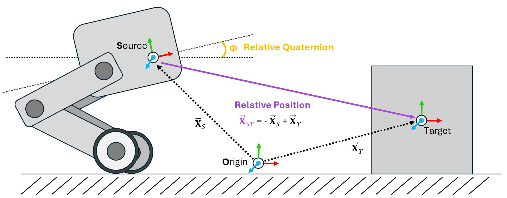
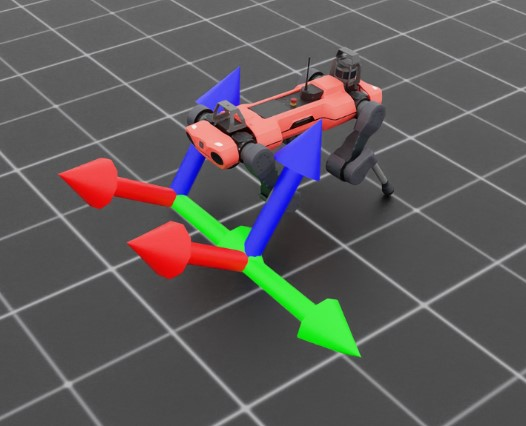

<a id="overview-sensors-frame-transformer"></a>

# 프레임 변환기


<!-- 한 눈에 다른 물체와의 상대적 위치를 알고 싶으신가요? 그렇다면 프레임 변환기가 바로 필요한 센서입니다!* -->

물리 시뮬레이션 내에서 가장 흔히 수행해야 하는 작업 중 하나는 프레임 변환입니다. 이는 임의의 유클리드 좌표계 기준으로 벡터 또는 쿼터니언을 다시 작성하는 것을 의미합니다. Isaac과 USD 내에서 이를 수행하는 방법은 여러 가지가 있지만, 이러한 방법들은 Isaac Lab의 GPU 기반 시뮬레이션 및 클론된 환경 내에서 구현하기가 번거로울 수 있습니다. 이 문제를 해결하기 위해 우리는 프레임 변환기 센서를 설계했습니다. 이 센서는 장면 내에 관심 있는 강체의 상대 프레임 변환을 추적하고 계산합니다.

이 센서는 소스 프레임과 타겟 프레임 목록으로 최소한 정의됩니다. 이러한 정의는 소스에 대한 프리미엄 경로(prim path)와 타겟으로 추적할 강체에 대한 정규 표현식 기능이 있는 프리미엄 경로 목록 형태로 이루어집니다.

```python
@configclass
class FrameTransformerSensorSceneCfg(InteractiveSceneCfg):
    """로봇에 센서를 배치한 장면 설계."""

    # 바닥 평면
    ground = AssetBaseCfg(prim_path="/World/defaultGroundPlane", spawn=sim_utils.GroundPlaneCfg())

    # 조명
    dome_light = AssetBaseCfg(
        prim_path="/World/Light", spawn=sim_utils.DomeLightCfg(intensity=3000.0, color=(0.75, 0.75, 0.75))
    )

    # 로봇
    robot = ANYMAL_C_CFG.replace(prim_path="{ENV_REGEX_NS}/Robot")

    # 강체 객체
    cube = RigidObjectCfg(
        prim_path="{ENV_REGEX_NS}/Cube",
        spawn=sim_utils.CuboidCfg(
            size=(1, 1, 1),
            rigid_props=sim_utils.RigidBodyPropertiesCfg(),
            mass_props=sim_utils.MassPropertiesCfg(mass=100.0),
            collision_props=sim_utils.CollisionPropertiesCfg(),
            physics_material=sim_utils.RigidBodyMaterialCfg(static_friction=1.0),
            visual_material=sim_utils.PreviewSurfaceCfg(diffuse_color=(0.0, 1.0, 0.0), metallic=0.2),
        ),
        init_state=RigidObjectCfg.InitialStateCfg(pos=(5, 0, 0.5)),
    )

    specific_transforms = FrameTransformerCfg(
        prim_path="{ENV_REGEX_NS}/Robot/base",
        target_frames=[
            FrameTransformerCfg.FrameCfg(prim_path="{ENV_REGEX_NS}/Robot/LF_FOOT"),
            FrameTransformerCfg.FrameCfg(prim_path="{ENV_REGEX_NS}/Robot/RF_FOOT"),
        ],
        debug_vis=True,
    )

    cube_transform = FrameTransformerCfg(
        prim_path="{ENV_REGEX_NS}/Robot/base",
        target_frames=[FrameTransformerCfg.FrameCfg(prim_path="{ENV_REGEX_NS}/Cube")],
        debug_vis=False,
    )

    robot_transforms = FrameTransformerCfg(
        prim_path="{ENV_REGEX_NS}/Robot/base",
        target_frames=[FrameTransformerCfg.FrameCfg(prim_path="{ENV_REGEX_NS}/Robot/.*")],
        debug_vis=False,
    )
```

이제 장면을 실행하고 센서에서 데이터를 쿼리할 수 있습니다.

```python
def run_simulator(sim: sim_utils.SimulationContext, scene: InteractiveScene):
  .
  .
  .
  # 물리 시뮬레이션 수행
  while simulation_app.is_running():
    .
    .
    .

    # 센서 정보 출력
    print("-------------------------------")
    print(scene["specific_transforms"])
    print("상대 변환:", scene["specific_transforms"].data.target_pos_source)
    print("상대 방향:", scene["specific_transforms"].data.target_quat_source)
    print("-------------------------------")
    print(scene["cube_transform"])
    print("상대 변환:", scene["cube_transform"].data.target_pos_source)
    print("-------------------------------")
    print(scene["robot_transforms"])
    print("상대 변환:", scene["robot_transforms"].data.target_pos_source)
```

특정 객체를 추적하는 결과를 살펴보겠습니다. 먼저 발에 부착된 센서에서 나오는 데이터를 확인해 보겠습니다.

```bash
-------------------------------
FrameTransformer @ '/World/envs/env_.*/Robot/base':
        추적된 바디 프레임: ['base', 'LF_FOOT', 'RF_FOOT']
        환경 수: 1
        소스 바디 프레임: base
        타겟 프레임 (개수: ['LF_FOOT', 'RF_FOOT']): 2

상대 변환: tensor([[[ 0.4658,  0.3085, -0.4840],
        [ 0.4487, -0.2959, -0.4828]]], device='cuda:0')
상대 방향: tensor([[[ 0.9623,  0.0072, -0.2717, -0.0020],
        [ 0.9639,  0.0052, -0.2663, -0.0014]]], device='cuda:0')
```



시각화 도구를 활성화하면 발의 프레임이 약간 "위로" 회전되어 있는 것을 볼 수 있습니다. 센서에서 데이터를 쿼리하여 명시적인 상대 위치 및 회전을 확인할 수도 있으며, 이 값들은 추적된 프레임과 동일한 순서로 반환된 목록 형태로 제공됩니다. 정규 표현식을 사용하여 지정된 변환을 검토하면 더욱 명확해집니다.

```bash
-------------------------------
FrameTransformer @ '/World/envs/env_.*/Robot/base':
        추적된 바디 프레임: ['base', 'LF_FOOT', 'LF_HIP', 'LF_SHANK', 'LF_THIGH', 'LH_FOOT', 'LH_HIP', 'LH_SHANK', 'LH_THIGH', 'RF_FOOT', 'RF_HIP', 'RF_SHANK', 'RF_THIGH', 'RH_FOOT', 'RH_HIP', 'RH_SHANK', 'RH_THIGH', 'base']
        환경 수: 1
        소스 바디 프레임: base
        타겟 프레임 (개수: ['LF_FOOT', 'LF_HIP', 'LF_SHANK', 'LF_THIGH', 'LH_FOOT', 'LH_HIP', 'LH_SHANK', 'LH_THIGH', 'RF_FOOT', 'RF_HIP', 'RF_SHANK', 'RF_THIGH', 'RH_FOOT', 'RH_HIP', 'RH_SHANK', 'RH_THIGH', 'base']): 17

상대 변환: tensor([[[ 4.6581e-01,  3.0846e-01, -4.8398e-01],
        [ 2.9990e-01,  1.0400e-01, -1.7062e-09],
        [ 2.1409e-01,  2.9177e-01, -2.4214e-01],
        [ 3.5980e-01,  1.8780e-01,  1.2608e-03],
        [-4.8813e-01,  3.0973e-01, -4.5927e-01],
        [-2.9990e-01,  1.0400e-01,  2.7044e-09],
        [-2.1495e-01,  2.9264e-01, -2.4198e-01],
        [-3.5980e-01,  1.8780e-01,  1.5582e-03],
        [ 4.4871e-01, -2.9593e-01, -4.8277e-01],
        [ 2.9990e-01, -1.0400e-01, -2.7057e-09],
        [ 1.9971e-01, -2.8554e-01, -2.3778e-01],
        [ 3.5980e-01, -1.8781e-01, -9.1049e-04],
        [-5.0090e-01, -2.9095e-01, -4.5746e-01],
        [-2.9990e-01, -1.0400e-01,  6.3592e-09],
        [-2.1860e-01, -2.8251e-01, -2.5163e-01],
        [-3.5980e-01, -1.8779e-01, -1.8792e-03],
        [ 0.0000e+00,  0.0000e+00,  0.0000e+00]]], device='cuda:0')
```

여기서 센서는 `Robot/base`의 모든 강체 자식을 추적하지만, 이 표현은 **포함적**인 것으로, 소스 바디 자신도 타겟에 포함됩니다. 이는 소스 및 타겟 목록을 살펴보면 `base`가 두 번 나타나는 사실과, 반환된 데이터에서 센서가 자기 자신에 대한 상대 변환(0, 0, 0)을 반환하는 사실을 통해 확인할 수 있습니다.

### frame_transformer_sensor.py 코드

```python
# Copyright (c) 2022-2026, The Isaac Lab Project Developers (https://github.com/isaac-sim/IsaacLab/blob/main/CONTRIBUTORS.md).
# All rights reserved.
#
# SPDX-License-Identifier: BSD-3-Clause

import argparse

from isaaclab.app import AppLauncher

# add argparse arguments
parser = argparse.ArgumentParser(description="프레임 변환기 센서 사용 예시.")
parser.add_argument("--num_envs", type=int, default=1, help="생성할 환경 수.")
# append AppLauncher cli args
AppLauncher.add_app_launcher_args(parser)
# parse the arguments
args_cli = parser.parse_args()

# launch omniverse app
app_launcher = AppLauncher(args_cli)
simulation_app = app_launcher.app

"""Rest everything follows."""

import torch

import isaaclab.sim as sim_utils
from isaaclab.assets import AssetBaseCfg, RigidObjectCfg
from isaaclab.scene import InteractiveScene, InteractiveSceneCfg
from isaaclab.sensors import FrameTransformerCfg
from isaaclab.utils import configclass

##
# Pre-defined configs
##
from isaaclab_assets.robots.anymal import ANYMAL_C_CFG  # isort: skip


@configclass
class FrameTransformerSensorSceneCfg(InteractiveSceneCfg):
    """로봇에 센서를 배치한 장면 설계."""

    # 바닥 평면
    ground = AssetBaseCfg(prim_path="/World/defaultGroundPlane", spawn=sim_utils.GroundPlaneCfg())

    # 조명
    dome_light = AssetBaseCfg(
        prim_path="/World/Light", spawn=sim_utils.DomeLightCfg(intensity=3000.0, color=(0.75, 0.75, 0.75))
    )

    # 로봇
    robot = ANYMAL_C_CFG.replace(prim_path="{ENV_REGEX_NS}/Robot")

    # 강체 객체
    cube = RigidObjectCfg(
        prim_path="{ENV_REGEX_NS}/Cube",
        spawn=sim_utils.CuboidCfg(
            size=(1, 1, 1),
            rigid_props=sim_utils.RigidBodyPropertiesCfg(),
            mass_props=sim_utils.MassPropertiesCfg(mass=100.0),
            collision_props=sim_utils.CollisionPropertiesCfg(),
            physics_material=sim_utils.RigidBodyMaterialCfg(static_friction=1.0),
            visual_material=sim_utils.PreviewSurfaceCfg(diffuse_color=(0.0, 1.0, 0.0), metallic=0.2),
        ),
        init_state=RigidObjectCfg.InitialStateCfg(pos=(5, 0, 0.5)),
    )

    specific_transforms = FrameTransformerCfg(
        prim_path="{ENV_REGEX_NS}/Robot/base",
        target_frames=[
            FrameTransformerCfg.FrameCfg(prim_path="{ENV_REGEX_NS}/Robot/LF_FOOT"),
            FrameTransformerCfg.FrameCfg(prim_path="{ENV_REGEX_NS}/Robot/RF_FOOT"),
        ],
        debug_vis=True,
    )

    cube_transform = FrameTransformerCfg(
        prim_path="{ENV_REGEX_NS}/Robot/base",
        target_frames=[FrameTransformerCfg.FrameCfg(prim_path="{ENV_REGEX_NS}/Cube")],
        debug_vis=False,
    )

    robot_transforms = FrameTransformerCfg(
        prim_path="{ENV_REGEX_NS}/Robot/base",
        target_frames=[FrameTransformerCfg.FrameCfg(prim_path="{ENV_REGEX_NS}/Robot/.*")],
        debug_vis=False,
    )


def run_simulator(sim: sim_utils.SimulationContext, scene: InteractiveScene):
    """시뮬레이터 실행."""
    # 시뮬레이션 스텝 정의
    sim_dt = sim.get_physics_dt()
    sim_time = 0.0
    count = 0

    # 물리 시뮬레이션 수행
    while simulation_app.is_running():
        if count % 500 == 0:
            # 카운터 리셋
            count = 0
            # 씬 엔티티 리셋
            # 루트 상태
            # 상태가 시뮬레이션 월드 프레임으로 쓰여지므로, 원점만큼 오프셋을 줘야 함
            #これをしないと、ロボットがシミュレーションワールドの(0, 0, 0)にスポーンしてしまう
            root_state = scene["robot"].data.default_root_state.clone()
            root_state[:, :3] += scene.env_origins
            scene["robot"].write_root_pose_to_sim(root_state[:, :7])
            scene["robot"].write_root_velocity_to_sim(root_state[:, 7:])
            # 조인트 위치에 약간의 노이즈를 줘서 설정
            joint_pos, joint_vel = (
                scene["robot"].data.default_joint_pos.clone(),
                scene["robot"].data.default_joint_vel.clone(),
            )
            joint_pos += torch.rand_like(joint_pos) * 0.1
            scene["robot"].write_joint_state_to_sim(joint_pos, joint_vel)
            # 내부 버퍼 클리어
            scene.reset()
            print("[INFO]: 로봇 상태 리셋 중...")
        # 로봇에 기본 동작 적용
        # -- 동작/명령 생성
        targets = scene["robot"].data.default_joint_pos
        # -- 로봇에 동작 적용
        scene["robot"].set_joint_position_target(targets)
        # -- 시뮬레이션에 데이터 쓰기
        scene.write_data_to_sim()
        # 스텝 수행
        sim.step()
        # sim-시간 업데이트
        sim_time += sim_dt
        count += 1
        # 버퍼 업데이트
        scene.update(sim_dt)

        # 센서에서 정보 출력
        print("-------------------------------")
        print(scene["specific_transforms"])
        print("상대 변환:", scene["specific_transforms"].data.target_pos_source)
        print("상대 방향:", scene["specific_transforms"].data.target_quat_source)
        print("-------------------------------")
        print(scene["cube_transform"])
        print("상대 변환:", scene["cube_transform"].data.target_pos_source)
        print("-------------------------------")
        print(scene["robot_transforms"])
        print("상대 변환:", scene["robot_transforms"].data.target_pos_source)


def main():
    """메인 함수."""

    # 시뮬레이션 컨텍스트 초기화
    sim_cfg = sim_utils.SimulationCfg(dt=0.005, device=args_cli.device)
    sim = sim_utils.SimulationContext(sim_cfg)
    # 메인 카메라 설정
    sim.set_camera_view(eye=[3.5, 3.5, 3.5], target=[0.0, 0.0, 0.0])
    # 장면 설계
    scene_cfg = FrameTransformerSensorSceneCfg(num_envs=args_cli.num_envs, env_spacing=2.0)
    scene = InteractiveScene(scene_cfg)
    # 시뮬레이터 실행
    sim.reset()
    # 이제 준비 완료!
    print("[INFO]: 설정 완료...")
    # 시뮬레이터 실행
    run_simulator(sim, scene)


if __name__ == "__main__":
    # 메인 함수 실행
    main()
    # 시뮬레이션 앱 종료
    simulation_app.close()
```
