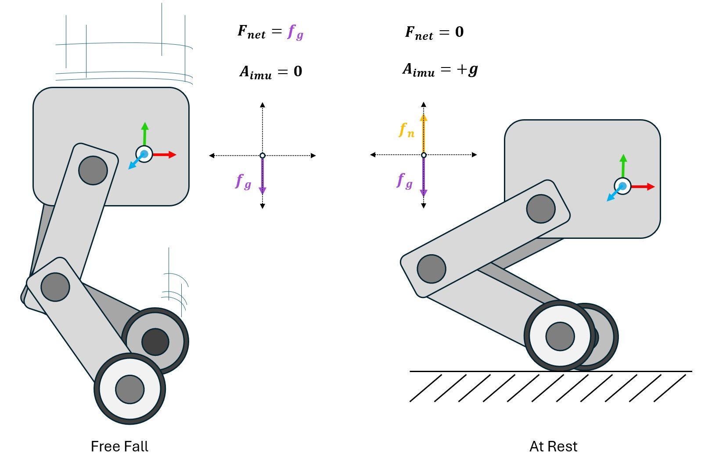
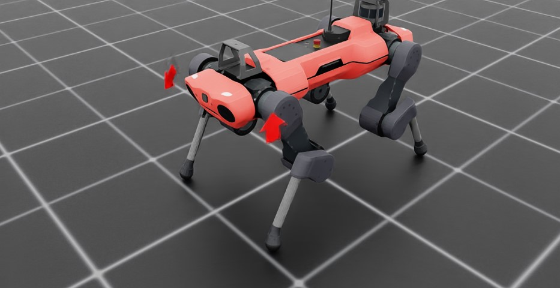

<a id="overview-sensors-imu"></a>

# 관성 측정 장치 (IMU)



관성 측정 장치(IMU)는 물체의 가속도를 측정하는 센서 유형입니다. 이러한 센서는 전통적으로 선형 가속도와 각속도를 보고하도록 설계되었으며, 디지털 저울의 원리와 유사한 원리로 작동합니다. 이들은 센서에 작용하는 **순 힘**에서 유도된 가속도를 보고합니다.

IMU의 나중 구현에서는 중력장에 정지해 있는 센서가 중력로 인한 음의 가속도를 보고합니다. 이는 대부분의 실제 응용 프로그램에서는 일반적으로 필요하지 않으며, 따라서 대부분의 실제 IMU 센서는 중력 편향을 포함하고 장치가 지구 표면에서 작동한다고 가정합니다. Isaac Lab에서 제공하는 IMU는 이와 유사한 편항 항을 포함하며, 기본값은 +g입니다. 즉, 시뮬레이션에 IMU를 추가하고 이 편향 항을 변경하지 않으면 중력 가속도와 반대 방향인 $+ 9.81 m/s^{2}$의 가속도를 감지하게 됩니다.

Anymal 사족 보행 로봇에 각 앞발에 IMU가 장착된 간단한 환경을 고려해 보겠습니다.

```python

@configclass
class ImuSensorSceneCfg(InteractiveSceneCfg):
    """센서가 장착된 로봇을 위한 장면 설계."""

    # 지면 평면
    ground = AssetBaseCfg(prim_path="/World/defaultGroundPlane", spawn=sim_utils.GroundPlaneCfg())

    # 조명
    dome_light = AssetBaseCfg(
        prim_path="/World/Light", spawn=sim_utils.DomeLightCfg(intensity=3000.0, color=(0.75, 0.75, 0.75))
    )

    # 로봇
    robot = ANYMAL_C_CFG.replace(prim_path="{ENV_REGEX_NS}/Robot")

    imu_RF = ImuCfg(prim_path="{ENV_REGEX_NS}/Robot/LF_FOOT", debug_vis=True)

    imu_LF = ImuCfg(prim_path="{ENV_REGEX_NS}/Robot/RF_FOOT", gravity_bias=(0, 0, 0), debug_vis=True)


def run_simulator(sim: sim_utils.SimulationContext, scene: InteractiveScene):
    """시뮬레이터 실행."""
    # 시뮬레이션 스텝 정의
    sim_dt = sim.get_physics_dt()
```

여기서 우리는 센서 중 하나의 편향을 명시적으로 제거했으며, 샘플 스크립트를 실행하여 센서를 시각화함으로써 이것이 보고된 값에 어떻게 영향을 미치는지 확인할 수 있습니다.



오른쪽 앞발이 명시적으로 (0,0,0)의 편향을 갖는 것을 알 수 있습니다. 시각화에서는 오른쪽 IMU에서 가속도를 표시하는 화살표가 시간에 따라 빠르게 변화하는 것을 볼 수 있으며, 왼쪽 IMU의 가속도를 시각화하는 화살표는 수직 축을 따라 일정하게 가리키는 것을 볼 수 있습니다.

센서에서 값을 가져오는 것은 일반적인 방식으로 수행됩니다.

```python
def run_simulator(sim: sim_utils.SimulationContext, scene: InteractiveScene):
  .
  .
  .
  # 물리 시뮬레이션 실행
  while simulation_app.is_running():
    .
    .
    .
    # 센서에서 정보 출력
    print("-------------------------------")
    print(scene["imu_LF"])
    print("수신된 선형 속도: ", scene["imu_LF"].data.lin_vel_b)
    print("수신된 각속도: ", scene["imu_LF"].data.ang_vel_b)
    print("수신된 선형 가속도: ", scene["imu_LF"].data.lin_acc_b)
    print("수신된 각 가속도: ", scene["imu_LF"].data.ang_acc_b)
    print("-------------------------------")
    print(scene["imu_RF"])
    print("수신된 선형 속도: ", scene["imu_RF"].data.lin_vel_b)
    print("수신된 각속도: ", scene["imu_RF"].data.ang_vel_b)
    print("수신된 선형 가속도: ", scene["imu_RF"].data.lin_acc_b)
    print("수신된 각 가속도: ", scene["imu_RF"].data.ang_acc_b)
```

센서에서 보고된 값의 진동은 센서가 가속도를 어떻게 계산하는지와 직접적인 관련이 있으며, 이는 시뮬레이션에서 보고된 인접한 기초 진리 속도 값 사이의 유한 차분 근사값을 통해 이루어집니다. 오른쪽 발의 가속도가 작지만 명시적으로 0이 아님을 주의 깊게 살피며 보고된 결과에서 이를 확인할 수 있습니다(**선형 가속도**에 주목).

```bash
Imu 센서 @ '/World/envs/env_.*/Robot/LF_FOOT':
        view 유형         : <class 'omni.physics.tensors.impl.api.RigidBodyView'>
        업데이트 기간 (s) : 0.0
        센서 수          : 1

수신된 선형 속도:  tensor([[ 0.0203, -0.0054,  0.0380]], device='cuda:0')
수신된 각속도:  tensor([[-0.0104, -0.1189,  0.0080]], device='cuda:0')
수신된 선형 가속도:  tensor([[ 4.8344, -0.0205,  8.5305]], device='cuda:0')
수신된 각 가속도:  tensor([[-0.0389, -0.0262, -0.0045]], device='cuda:0')
-------------------------------
Imu 센서 @ '/World/envs/env_.*/Robot/RF_FOOT':
        view 유형         : <class 'omni.physics.tensors.impl.api.RigidBodyView'>
        업데이트 기간 (s) : 0.0
        센서 수          : 1

수신된 선형 속도:  tensor([[0.0244, 0.0077, 0.0431]], device='cuda:0')
수신된 각속도:  tensor([[ 0.0122, -0.1360, -0.0042]], device='cuda:0')
수신된 선형 가속도:  tensor([[-0.0018,  0.0010, -0.0032]], device='cuda:0')
수신된 각 가속도:  tensor([[-0.0373, -0.0050, -0.0053]], device='cuda:0')
-------------------------------
```

### imu_sensor.py 코드

```python
# Copyright (c) 2022-2026, The Isaac Lab Project Developers (https://github.com/isaac-sim/IsaacLab/blob/main/CONTRIBUTORS.md).
# All rights reserved.
#
# SPDX-License-Identifier: BSD-3-Clause

"""먼저 Isaac Sim 시뮬레이터 실행."""

import argparse

from isaaclab.app import AppLauncher

# argparse 인수 추가
parser = argparse.ArgumentParser(description="IMU 센서 사용 예시.")
parser.add_argument("--num_envs", type=int, default=1, help="생성할 환경 수.")
# AppLauncher cli 인수 추가
AppLauncher.add_app_launcher_args(parser)
# 인수 파싱
args_cli = parser.parse_args()

# omniverse 앱 실행
app_launcher = AppLauncher(args_cli)
simulation_app = app_launcher.app

"""나머지는 모두これに 따릅니다."""

import torch

import isaaclab.sim as sim_utils
from isaaclab.assets import AssetBaseCfg
from isaaclab.scene import InteractiveScene, InteractiveSceneCfg
from isaaclab.sensors import ImuCfg
from isaaclab.utils import configclass

##
# 사전 정의된 구성
##
from isaaclab_assets.robots.anymal import ANYMAL_C_CFG  # isort: skip


@configclass
class ImuSensorSceneCfg(InteractiveSceneCfg):
    """센서가 장착된 로봇을 위한 장면 설계."""

    # 지면 평면
    ground = AssetBaseCfg(prim_path="/World/defaultGroundPlane", spawn=sim_utils.GroundPlaneCfg())

    # 조명
    dome_light = AssetBaseCfg(
        prim_path="/World/Light", spawn=sim_utils.DomeLightCfg(intensity=3000.0, color=(0.75, 0.75, 0.75))
    )

    # 로봇
    robot = ANYMAL_C_CFG.replace(prim_path="{ENV_REGEX_NS}/Robot")

    imu_RF = ImuCfg(prim_path="{ENV_REGEX_NS}/Robot/LF_FOOT", debug_vis=True)

    imu_LF = ImuCfg(prim_path="{ENV_REGEX_NS}/Robot/RF_FOOT", gravity_bias=(0, 0, 0), debug_vis=True)


def run_simulator(sim: sim_utils.SimulationContext, scene: InteractiveScene):
    """시뮬레이터 실행."""
    # 시뮬레이션 스텝 정의
    sim_dt = sim.get_physics_dt()
    sim_time = 0.0
    count = 0

    # 물리 시뮬레이션 실행
    while simulation_app.is_running():
        if count % 500 == 0:
            # 카운터 리셋
            count = 0
            # 장면 엔티티 리셋
            # 루트 상태
            # 루트 상태를 오프셋으로 이동시킴. 이는 상태가 시뮬레이션 월드 프레임에서 작성되기 때문임
            # 이렇게 하지 않으면 로봇이 시뮬레이션 월드의 (0, 0, 0)에서 생성됨
            root_state = scene["robot"].data.default_root_state.clone()
            root_state[:, :3] += scene.env_origins
            scene["robot"].write_root_link_pose_to_sim(root_state[:, :7])
            scene["robot"].write_root_com_velocity_to_sim(root_state[:, 7:])
            # 일부 노이즈를加えて joint 위치 설정
            joint_pos, joint_vel = (
                scene["robot"].data.default_joint_pos.clone(),
                scene["robot"].data.default_joint_vel.clone(),
            )
            joint_pos += torch.rand_like(joint_pos) * 0.1
            scene["robot"].write_joint_state_to_sim(joint_pos, joint_vel)
            # 내부 버퍼 클리어
            scene.reset()
            print("[INFO]: 로봇 상태 리셋...")
        # 로봇에 기본 동작 적용
        # -- 동작/명령 생성
        targets = scene["robot"].data.default_joint_pos
        # -- 로봇에 동작 적용
        scene["robot"].set_joint_position_target(targets)
        # -- 시뮬레이션에 데이터 쓰기
        scene.write_data_to_sim()
        # 스텝 수행
        sim.step()
        # sim-시간 업데이트
        sim_time += sim_dt
        count += 1
        # 버퍼 업데이트
        scene.update(sim_dt)

        # 센서에서 정보 출력
        print("-------------------------------")
        print(scene["imu_LF"])
        print("수신된 선형 속도: ", scene["imu_LF"].data.lin_vel_b)
        print("수신된 각속도: ", scene["imu_LF"].data.ang_vel_b)
        print("수신된 선형 가속도: ", scene["imu_LF"].data.lin_acc_b)
        print("수신된 각 가속도: ", scene["imu_LF"].data.ang_acc_b)
        print("-------------------------------")
        print(scene["imu_RF"])
        print("수신된 선형 속도: ", scene["imu_RF"].data.lin_vel_b)
        print("수신된 각속도: ", scene["imu_RF"].data.ang_vel_b)
        print("수신된 선형 가속도: ", scene["imu_RF"].data.lin_acc_b)
        print("수신된 각 가속도: ", scene["imu_RF"].data.ang_acc_b)


def main():
    """메인 함수."""

    # 시뮬레이션 컨텍스트 초기화
    sim_cfg = sim_utils.SimulationCfg(dt=0.005, device=args_cli.device)
    sim = sim_utils.SimulationContext(sim_cfg)
    # 메인 카메라 설정
    sim.set_camera_view(eye=[3.5, 3.5, 3.5], target=[0.0, 0.0, 0.0])
    # 장면 설계
    scene_cfg = ImuSensorSceneCfg(num_envs=args_cli.num_envs, env_spacing=2.0)
    scene = InteractiveScene(scene_cfg)
    # 시뮬레이터 실행
    sim.reset()
    # 이제 준비 완료!
    print("[INFO]: 설정 완료...")
    # 시뮬레이터 실행
    run_simulator(sim, scene)


if __name__ == "__main__":
    # 메인 함수 실행
    main()
    # 시뮬레이터 앱 종료
    simulation_app.close()
```
