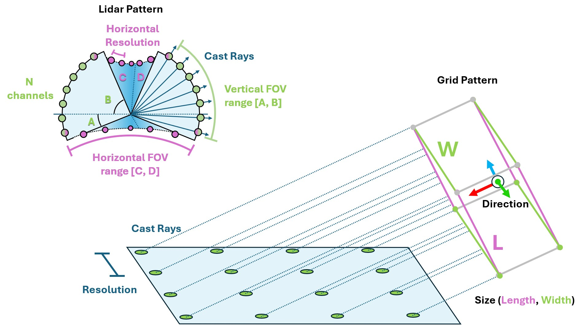
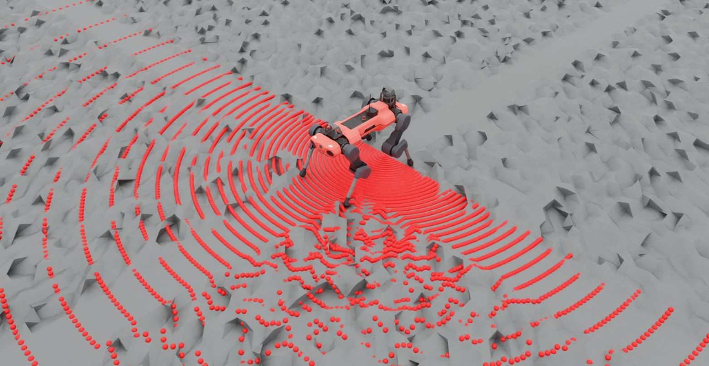

<a id="overview-sensors-ray-caster"></a>

# Ray Caster



Ray Caster 센서(및 Ray Caster 카메라)는 RTX 기반 렌더링과 유사하며, 두 가지 모두 레이 발사를 포함한다는 점에서 비슷합니다. 여기서의 차이점은 Ray Caster 센서에 의해 발사된 레이스가 충돌 정보만을 반환하고, 각 개별 레이의 방향을 지정할 수 있다는 점입니다. 레이스는 튀지 않으며, 재질이나 불투명도와 같은 요소에도 영향을 받지 않습니다. 센서에 의해 지정된 각 레이스는 레이스를 따라 선을 추적하고 지정된 메시와의 첫 충돌 위치를 반환합니다. 이는 일부 사족 로봇 예제에서 로컬 높이 필드를 측정하는 데 사용되는 방법입니다.

많은 복제된 환경이 있을 때 센서의 성능을 유지하기 위해, 레이 추적은 [Warp](https://nvidia.github.io/warp/)에서 직접 수행됩니다. 이것이 특정 메시를 캐스트 대상으로 식별해야 하는 이유입니다. 해당 메시 데이터는 센서 초기화 시 Warp에 의해 디바이스에 로드되기 때문입니다. 결과적으로, 현재 버전의 이 센서는 기본 USD 파일에서 지정된 메시와 변경되지 않은 정적 메시(문자 그대로 변경되지 않은 메시)에 대해서만 작동합니다. 이 제한은 향후 릴리스에서 제거될 예정입니다.

레이 캐스터 센서를 사용하려면 **패턴**과 부모 xform을 연결해야 합니다. 패턴은 레이스가 어떻게 발사되는지를 정의하며, prim 속성은 센서의 방향과 위치를 정의합니다(더 정확한 배치를 위해 추가 오프셋을 지정할 수 있습니다). Isaac Lab은 일반 라이다 및 그리드 패턴을 포함하여 다양한 레이 캐스팅 패턴 구성 방식을 지원합니다.

```python
@configclass
class RaycasterSensorSceneCfg(InteractiveSceneCfg):
    """로봇에 센서를 배치하여 장면을 설계합니다."""

    # 지면 평면
    ground = AssetBaseCfg(
        prim_path="/World/Ground",
        spawn=sim_utils.UsdFileCfg(
            usd_path=f"{ISAAC_NUCLEUS_DIR}/Environments/Terrains/rough_plane.usd",
            scale=(1, 1, 1),
        ),
    )

    # 조명
    dome_light = AssetBaseCfg(
        prim_path="/World/Light", spawn=sim_utils.DomeLightCfg(intensity=3000.0, color=(0.75, 0.75, 0.75))
    )

    # 로봇
    robot = ANYMAL_C_CFG.replace(prim_path="{ENV_REGEX_NS}/Robot")

    ray_caster = RayCasterCfg(
        prim_path="{ENV_REGEX_NS}/Robot/base/lidar_cage",
        update_period=1 / 60,
        offset=RayCasterCfg.OffsetCfg(pos=(0, 0, 0.5)),
        mesh_prim_paths=["/World/Ground"],
        ray_alignment="yaw",
        pattern_cfg=patterns.LidarPatternCfg(
            channels=100, vertical_fov_range=[-90, 90], horizontal_fov_range=[-90, 90], horizontal_res=1.0
        ),
        debug_vis=not args_cli.headless,
    )
```

패턴 설정의 단위는 **도** 단위임을 주의하세요! 또한 여기서는 렌더링에서 패턴을 명시적으로 표시하기 위해 시각화를 활성화하지만, 이는 필수가 아니며 성능 튜닝을 위해 비활성화해야 합니다.



시뮬레이션 실행 중에 다른 센서와 마찬가지로 레이 캐스터 센서에서 데이터를 쿼리할 수 있습니다.

```python
def run_simulator(sim: sim_utils.SimulationContext, scene: InteractiveScene):
  .
  .
  .
  # 물리 시뮬레이션
  while simulation_app.is_running():
    .
    .
    .
    # 센서에서 정보 출력
      print("-------------------------------")
      print(scene["ray_caster"])
      print("Ray cast hit results: ", scene["ray_caster"].data.ray_hits_w)
```

```bash
-------------------------------
Ray-caster @ '/World/envs/env_.*/Robot/base/lidar_cage':
        view type            : <class 'isaacsim.core.prims.xform_prim.XFormPrim'>
        update period (s)    : 0.016666666666666666
        number of meshes     : 1
        number of sensors    : 1
        number of rays/sensor: 18000
        total number of rays : 18000
Ray cast hit results:  tensor([[[-0.3698,  0.0357,  0.0000],
        [-0.3698,  0.0357,  0.0000],
        [-0.3698,  0.0357,  0.0000],
        ...,
        [    inf,     inf,     inf],
        [    inf,     inf,     inf],
        [    inf,     inf,     inf]]], device='cuda:0')
-------------------------------
```

여기서 센서 자체에서 반환된 데이터를 볼 수 있습니다. 먼저 데이터가 센서 수에 따라 배치되어 세 개의 대괄호로 시작하고 끝나는 것을 확인할 수 있습니다. 레이 캐스트 패턴도 평탄화되어 배열의 차원이 `[N, B, 3]`이 되며, 여기서 `N`은 센서의 수, `B`는 패턴에서의 캐스트 레이 수, `3`은 캐스팅 공간의 차원을 나타냅니다. 마지막으로, 이 캐스팅 패턴의 첫 번째 여러 값이 동일한 것을 볼 수 있습니다. 이는 라이다 패턴이 구형이며, 우리가 FOV를 반구형으로 지정했기 때문이며, 이는 극점을 포함합니다. 이 구성에서 "평탄화 패턴"이 명확해집니다: 첫 번째 180개의 항목이 동일한데, 이는 이 반구의 하단 극점 때문이며, 수평 FOV가 180도이고 해상도가 1도이기 때문에 180개의 항목이 있습니다.

`triggered` 변수를 줄 81에서 변경하여 패턴 구성으로 실험하고 데이터가 어떻게 저장되는지 직관을 쌓을 수 있습니다.

### raycaster_sensor.py 코드

```python
# Copyright (c) 2022-2026, The Isaac Lab Project Developers (https://github.com/isaac-sim/IsaacLab/blob/main/CONTRIBUTORS.md).
# All rights reserved.
#
# SPDX-License-Identifier: BSD-3-Clause

import argparse

from isaaclab.app import AppLauncher

# add argparse arguments
parser = argparse.ArgumentParser(description="레이캐스터 센서 사용 예시.")
parser.add_argument("--num_envs", type=int, default=1, help="생성할 환경의 수.")
# append AppLauncher cli args
AppLauncher.add_app_launcher_args(parser)
# parse the arguments
args_cli = parser.parse_args()

# launch omniverse app
app_launcher = AppLauncher(args_cli)
simulation_app = app_launcher.app

"""Rest everything follows."""

import numpy as np
import torch

import isaaclab.sim as sim_utils
from isaaclab.assets import AssetBaseCfg
from isaaclab.scene import InteractiveScene, InteractiveSceneCfg
from isaaclab.sensors.ray_caster import RayCasterCfg, patterns
from isaaclab.utils import configclass
from isaaclab.utils.assets import ISAAC_NUCLEUS_DIR

##
# Pre-defined configs
##
from isaaclab_assets.robots.anymal import ANYMAL_C_CFG  # isort: skip


@configclass
class RaycasterSensorSceneCfg(InteractiveSceneCfg):
    """로봇에 센서를 배치하여 장면을 설계합니다."""

    # 지면 평면
    ground = AssetBaseCfg(
        prim_path="/World/Ground",
        spawn=sim_utils.UsdFileCfg(
            usd_path=f"{ISAAC_NUCLEUS_DIR}/Environments/Terrains/rough_plane.usd",
            scale=(1, 1, 1),
        ),
    )

    # 조명
    dome_light = AssetBaseCfg(
        prim_path="/World/Light", spawn=sim_utils.DomeLightCfg(intensity=3000.0, color=(0.75, 0.75, 0.75))
    )

    # 로봇
    robot = ANYMAL_C_CFG.replace(prim_path="{ENV_REGEX_NS}/Robot")

    ray_caster = RayCasterCfg(
        prim_path="{ENV_REGEX_NS}/Robot/base/lidar_cage",
        update_period=1 / 60,
        offset=RayCasterCfg.OffsetCfg(pos=(0, 0, 0.5)),
        mesh_prim_paths=["/World/Ground"],
        ray_alignment="yaw",
        pattern_cfg=patterns.LidarPatternCfg(
            channels=100, vertical_fov_range=[-90, 90], horizontal_fov_range=[-90, 90], horizontal_res=1.0
        ),
        debug_vis=not args_cli.headless,
    )


def run_simulator(sim: sim_utils.SimulationContext, scene: InteractiveScene):
    """시뮬레이터를 실행합니다."""
    # 시뮬레이션 스텝 정의
    sim_dt = sim.get_physics_dt()
    sim_time = 0.0
    count = 0

    triggered = True
    countdown = 42

    # 물리 시뮬레이션
    while simulation_app.is_running():
        if count % 500 == 0:
            # 카운터 리셋
            count = 0
            # scene 엔티티 리셋
            # 루트 상태
            # 루트 상태를 오프셋으로 조정하여 상태가 시뮬레이션 월드 프레임에서 작성되도록 함
            # 이렇게 하지 않으면 로봇이 시뮬레이션 월드의 (0, 0, 0)에 생성됨
            root_state = scene["robot"].data.default_root_state.clone()
            root_state[:, :3] += scene.env_origins
            scene["robot"].write_root_pose_to_sim(root_state[:, :7])
            scene["robot"].write_root_velocity_to_sim(root_state[:, 7:])
            # 일부 노이즈를加えて joint 위치 설정
            joint_pos, joint_vel = (
                scene["robot"].data.default_joint_pos.clone(),
                scene["robot"].data.default_joint_vel.clone(),
            )
            joint_pos += torch.rand_like(joint_pos) * 0.1
            scene["robot"].write_joint_state_to_sim(joint_pos, joint_vel)
            # 내부 버퍼 클리어
            scene.reset()
            print("[INFO]: 리셋팅 로봇 상태...")
        # 로봇에 기본 액션 적용
        # -- 액션/명령 생성
        targets = scene["robot"].data.default_joint_pos
        # -- 로봇에 액션 적용
        scene["robot"].set_joint_position_target(targets)
        # -- 시뮬레이션에 데이터 작성
        scene.write_data_to_sim()
        # 스텝 수행
        sim.step()
        # 시뮬레이션 시간 업데이트
        sim_time += sim_dt
        count += 1
        # 버퍼 업데이트
        scene.update(sim_dt)

        # 센서에서 정보 출력
        print("-------------------------------")
        print(scene["ray_caster"])
        print("Ray cast hit results: ", scene["ray_caster"].data.ray_hits_w)

        if not triggered:
            if countdown > 0:
                countdown -= 1
                continue
            data = scene["ray_caster"].data.ray_hits_w.cpu().numpy()
            np.save("cast_data.npy", data)
            triggered = True
        else:
            continue


def main():
    """메인 함수."""

    # 시뮬레이션 컨텍스트 초기화
    sim_cfg = sim_utils.SimulationCfg(dt=0.005, device=args_cli.device)
    sim = sim_utils.SimulationContext(sim_cfg)
    # 메인 카메라 설정
    sim.set_camera_view(eye=[3.5, 3.5, 3.5], target=[0.0, 0.0, 0.0])
    # 장면 설계
    scene_cfg = RaycasterSensorSceneCfg(num_envs=args_cli.num_envs, env_spacing=2.0)
    scene = InteractiveScene(scene_cfg)
    # 시뮬레이터 실행
    sim.reset()
    # 이제 준비 완료!
    print("[INFO]: 설정 완료...")
    # 시뮬레이터 실행
    run_simulator(sim, scene)


if __name__ == "__main__":
    # 메인 함수 실행
    main()
    # 시뮬레이션 앱 종료
    simulation_app.close()
```
