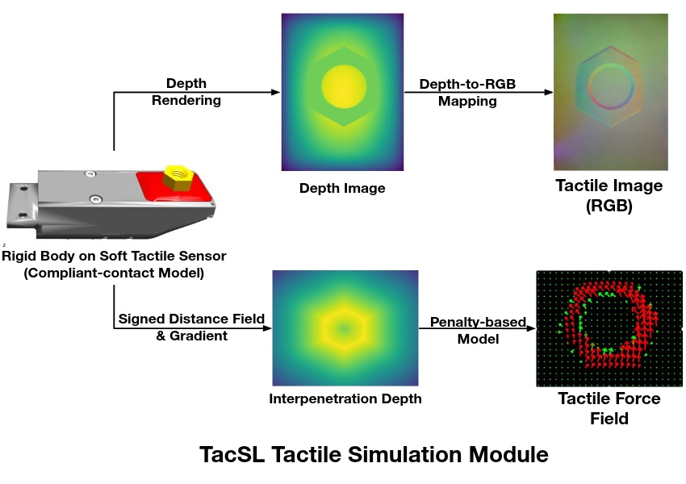
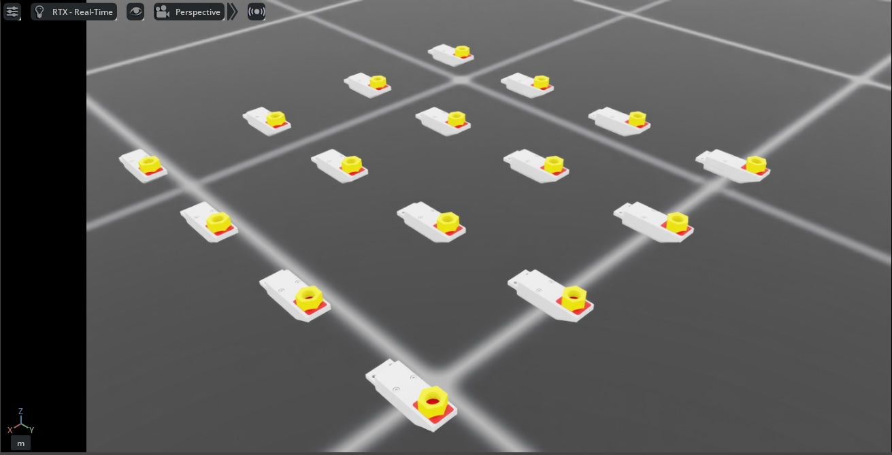
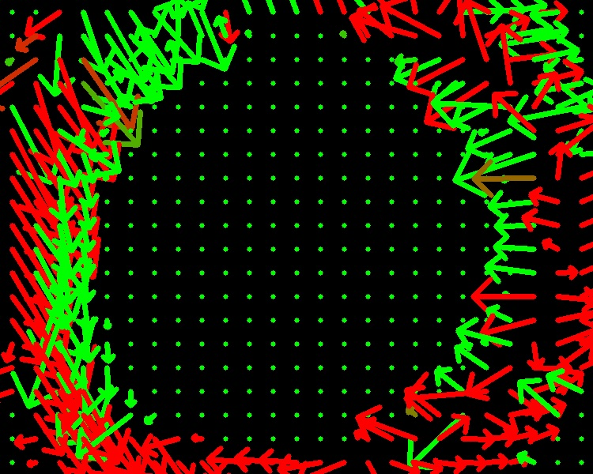

<a id="overview-sensors-tactile"></a>

# 비주오-택타일 센서

Isaac Lab의 비주오-택타일 센서는 TacSL(Tactile Sensor Learning)과의 통합을 통해 현실적인 택타일 피드백을 제공합니다 [[Akinola2025]](#akinola2025). 이 센서는 GelSight 장치와 같은 실제 택타일 센서를 반영하는 시각적 및 힘 기반 데이터를 생성하여 고충실도의 택타일 상호작용을 시뮬레이션하도록 설계되었습니다. 센서는 미세한 택타일 피드백이 필요한 로봇 조작 작업에 필수적인 택타일 RGB 이미지, 힘 필드 분포 및 기타 중간 택타일 측정값을 제공할 수 있습니다.



## 구성

택타일 센서는 동작과 데이터 수집 속성을 정의하기 위해 특정 구성 매개변수가 필요합니다. 센서는 해상도, 힘 민감도, 출력 데이터 유형 등 다양한 매개변수로 구성할 수 있습니다.

```python
from isaaclab.sensors import TiledCameraCfg
from isaaclab_assets.sensors import GELSIGHT_R15_CFG
import isaaclab.sim as sim_utils

from isaaclab_contrib.sensors.tacsl_sensor import VisuoTactileSensorCfg

# 택타일 센서 구성
tactile_sensor = VisuoTactileSensorCfg(
    prim_path="{ENV_REGEX_NS}/Robot/elastomer/tactile_sensor",
    ## 센서 구성
    render_cfg=GELSIGHT_R15_CFG,
    enable_camera_tactile=True,
    enable_force_field=True,
    ## 엘라스토머 구성
    tactile_array_size=(20, 25),
    tactile_margin=0.003,
    ## 접촉 객체 구성
    contact_object_prim_path_expr="{ENV_REGEX_NS}/contact_object",
    ## 힘 필드 물리 파라미터
    normal_contact_stiffness=1.0,
    friction_coefficient=2.0,
    tangential_stiffness=0.1,
    ## 카메라 구성
    camera_cfg=TiledCameraCfg(
        prim_path="{ENV_REGEX_NS}/Robot/elastomer_tip/cam",
        update_period=1 / 60,  # 60 Hz
        height=320,
        width=240,
        data_types=["distance_to_image_plane"],
        spawn=None,  # 카메라가 USD 파일에 이미 생성됨
    ),
)
```

구성은 다음 사항의 사용자 정의를 지원합니다:

* **렌더 구성**: 사전 정의된 구성(예: `isaaclab_assets.sensors`의 `GELSIGHT_R15_CFG`, `GELSIGHT_MINI_CFG`)을 사용하여 GelSight 센서 렌더링 매개변수 지정
* **택타일 모달리티**:
  : * `enable_camera_tactile` - 카메라 센서를 통한 택타일 RGB 이미징 활성화
    * `enable_force_field` - 힘 필드 계산 및 시각화 활성화
* **힘 필드 그리드**: 택타일 그리드 차원(`tactile_array_size`) 및 마진 설정으로, 계산된 힘 필드의 공간 해상도에 직접 영향을 미침
* **접촉 객체 구성**: SDF 충돌 메시가 있는 객체를 위치시키기 위해 prim 경로 표현을 사용하여 상호작용하는 객체의 속성 정의
* **물리 파라미터**: 센서의 힘 필드 계산 제어:
  : * `normal_contact_stiffness`, `friction_coefficient`, `tangential_stiffness` - 일반 강성, 마찰 계수 및 접선 강성
* **카메라 설정**: 해상도, 업데이트 속도 및 데이터 유형 구성, 현재 `distance_to_image_plane` (즉, `depth`에 대한 별칭)만 지원됨.
  : `spawn`은 기본적으로 `None`으로 설정되어 있으며, 이는 카메라가 USD 파일에 이미 생성되었음을 의미합니다.
    카메라를 직접 생성하고 초점 거리 등을 설정하려면 spawn 구성을 유효한 spawn 구성으로 설정할 수 있습니다.

## 구성 요구 사항

#### IMPORTANT
적절한 센서 작동을 위해 다음 요구 사항을 충족해야 합니다:

**카메라 택타일 이미징**
: `enable_camera_tactile=True`인 경우, 적절한 카메라 매개변수를 갖춘 유효한 `camera_cfg` (TiledCameraCfg)를 제공해야 합니다.

**힘 필드 계산**
: `enable_force_field=True`인 경우 다음 매개변수가 필요합니다:
  <br/>
  * `contact_object_prim_path_expr` - SDF 충돌 메시가 있는 접촉 객체를 찾기 위한 prim 경로 표현

**SDF 계산**
: 힘 필드 계산이 활성화된 경우, Signed Distance Field(SDF) 쿼리를 사용하여 패널티 기반 일반 및 전단 힘이 계산됩니다. GPU 가속을 달성하려면:
  <br/>
  * 상호작용하는 객체는 SDF 충돌 메시가 있어야 함
  * 초기화 중에 SDFView가 정의되어야 하므로, 상호작용하는 객체는 시뮬레이션 전에 지정되어야 함

**엘라스토머 구성**
: 센서의 `prim_path`는 USD 계층 구조에서 엘라스토머 prim의 자식이어야 구성되어야 합니다.
  힘 필드 계산의 쿼리 포인트는 엘라스토머 메시의 표면에서 계산되며, 이는 엘라스토머의 prim 경로에서 탐색됩니다.

**물리 재질**
: 센서는 엘라스토머의 준수 접촉 속성을 구성하기 위해 물리 재질을 사용합니다.
  기본적으로 물리 재질 속성은 USD 자산에서 미리 구성되어 있습니다. 그러나 로봇을 생성할 때 `UsdFileWithCompliantContactCfg`에서 다음 매개변수를 지정하여 이러한 속성을 재정의할 수 있습니다:
  <br/>
  * `compliant_contact_stiffness` - 엘라스토머 표면의 접촉 강성
  * `compliant_contact_damping` - 엘라스토머 표면의 접촉 감쇠
  * `physics_material_prim_path` - 물리 재질이 적용되는 prim 경로(일반적으로 `"elastomer"`)
  <br/>
  어떤 매개변수가 `None`으로 설정되면, 해당 속성은 USD 자산의 속성을 유지합니다.

## 사용 예시

시뮬레이션 환경에서 택타일 센서를 사용하려면 데모를 실행하세요:

```bash
cd scripts/demos/sensors
python tacsl_sensor.py --use_tactile_rgb --use_tactile_ff --tactile_compliance_stiffness 100.0 --tactile_compliant_damping 1.0 --contact_object_type nut --num_envs 16 --save_viz --enable_cameras
```

사용 가능한 명령줄 옵션은 다음과 같습니다:

* `--use_tactile_rgb`: 카메라 기반 택타일 센싱 활성화
* `--use_tactile_ff`: 힘 필드 택타일 센싱 활성화
* `--contact_object_type`: 접촉 객체 유형 지정(너트, 큐브 등)
* `--num_envs`: 병렬 환경 수
* `--save_viz`: 분석을 위한 시각화 출력 저장
* `--tactile_compliance_stiffness`: 준수 접촉 강성 재정의(기본값: USD 자산 값 사용)
* `--tactile_compliant_damping`: 준수 접촉 감쇠 재정의(기본값: USD 자산 값 사용)
* `--normal_contact_stiffness`: 힘 필드 계산을 위한 일반 접촉 강성
* `--tangential_stiffness`: 전단 힘을 위한 접선 강성
* `--friction_coefficient`: 전단 힘을 위한 마찰 계수
* `--debug_sdf_closest_pts`: 디버깅을 위한 가장 가까운 SDF 점 시각화
* `--debug_tactile_sensor_pts`: 택타일 센서 점 시각화 디버깅
* `--trimesh_vis_tactile_points`: 트라이메시 기반 택타일 점 시각화 활성화

사용 가능한 모든 옵션 목록을 보려면:

```bash
python tacsl_sensor.py -h
```

#### 참고
데모 예시는 현재 단종된 프로토타입 센서인 Gelsight R1.5를 기반으로 합니다. 동일한 절차를 다른 visuotactile 센서에 적용할 수 있습니다.



택타일 센서는 접촉 상호작용에 대한 포괄적인 정보를 제공하는 여러 데이터 모달리티를 지원합니다:

## 출력 택타일 데이터

**RGB 택타일 이미지**
: 객체가 센서 표면과 접촉할 때 실시간으로 생성되는 택타일 RGB 이미지. 이러한 이미지는 젤 기반 택타일 센서와 유사한 변형 패턴 및 접촉 기하학을 보여줍니다 [[Si2022]](#si2022)

**힘 필드**
: 센서 표면 전반의 일반 및 전단 성분을 포함하는 자세한 접촉 힘 필드 및 압력 분포.

|    |    |
|-----------------------------------------------------------------------------------------------------|-------------------------------------------------------------------------------------------------------------------|

## 학습 프레임워크와의 통합

택타일 센서는 강화 학습 및 모방 학습 프레임워크와 원활하게 통합되도록 설계되었습니다. 구조화된 텐서 출력은 학습 알고리즘의 관찰값으로 직접 사용할 수 있습니다:

```python
def get_tactile_observations(self):
    """학습을 위한 택타일 관찰값 추출."""
    tactile_data = self.scene["tactile_sensor"].data

    # 택타일 RGB 이미지
    tactile_rgb = tactile_data.tactile_rgb_image

    # 택타일 깊이 이미지
    tactile_depth = tactile_data.tactile_depth_image

    # 힘 필드
    tactile_normal_force = tactile_data.tactile_normal_force
    tactile_shear_force = tactile_data.tactile_shear_force

    return [tactile_rgb, tactile_depth, tactile_normal_force, tactile_shear_force]
```

## 참조
</translate>
