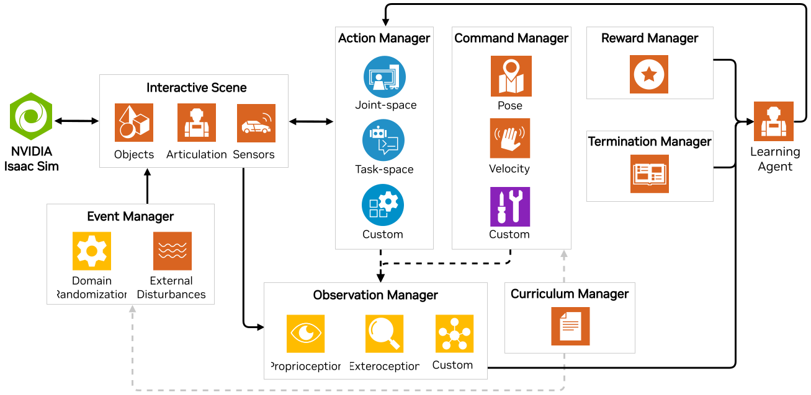
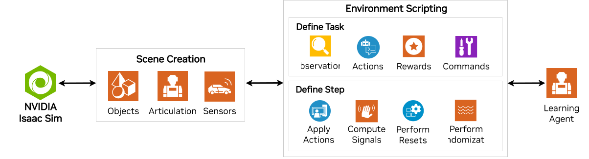

<a id="feature-workflows"></a>

# 태스크 설계 워크플로

**태스크**는 특정 에이전트(로봇)에 대한 관측과 동작을 처리하기 위한 특정 인터페이스를 가진 환경으로 정의됩니다. 환경은 에이전트에게 현재 관측을 제공하고, 시뮬레이션을 시간에 따라 앞으로 진행시켜 해당 에이전트의 동작을 실행합니다. 로봇을 환경에서 시뮬레이션할 때, 그 로봇이 무엇을 해야 하는지 또는 어떻게 훈련되어야 하는지와 무관하게 많은 공통 구성 요소가 존재합니다.

특히 강화 학습(RL)에서는 벡터화된 GPU 시뮬레이션에서 행동, 관측, 보상 등을 관리하는 것이 생각만으로도 막연할 수 있습니다! 이러한 필요에 대응하여, Isaac Lab은 **관리자 기반**(Manager-based) 시스템 내에서 RL 환경을 구축할 수 있는 기능을 제공하여, 적절한 관리자 클래스의 세부 사항을 신뢰할 수 있도록 합니다. 그러나 개발 과정에서 환경을 세밀하게 제어해야 하는 필요성도 인식하고 있습니다. 이러한 필요를 위해 우리는 시뮬레이션에 대한 **직접**(Direct) 인터페이스도 제공하여, 완전한 제어를 가능하게 합니다!

* **관리자 기반**: 환경은 개별 구성 요소(또는 관리자)로 분해되어, 관측 계산, 동작 적용, 랜덤화 적용과 같은 환경의 다양한 측면을 처리합니다. 사용자는 각 구성 요소에 대한 구성 클래스를 정의하고, 환경은 관리자를 조정하고 그 함수를 호출하는 책임을 집니다.
* **직접**: 사용자는 별도의 관리자 없이 전체 환경을 직접 구현하는 단일 클래스를 정의합니다. 이 클래스는 관측 계산, 동작 적용, 보상 계산에 대한 책임을 집니다.

두 워크플로에는 각각의 장단점이 있습니다. 관리자 기반 워크플로는 모듈형이므로 환경의 다양한 구성 요소를 쉽게 교체할 수 있습니다. 이는 환경을 프로토타이핑하고 다른 구성으로 실험하는 데 유용합니다. 반면, 직접 워크플로는 더 효율적이며 환경 로직에 대한 미세한 제어를 허용합니다. 이는 환경의 성능을 최적화하거나 별도의 구성 요소로 분해하기 어려운 복잡한 로직을 구현하는 데 유용합니다.

## 관리자 기반 환경



관리자 기반 환경은 작업을 개별 관리 구성 요소로 분해하여 모듈형 구현을 촉진합니다. 작업의 각 구성 요소(예: 보상 계산, 관측 등)는 해당 관리자에 대한 구성으로 지정할 수 있습니다. 이러한 관리자는 특정 계산을 필요에 따라 실행하도록 책임지는 구성 가능한 함수를 정의합니다. 다양한 관리자 컬렉션을 조정하는 것은 [`envs.ManagerBasedEnv`](../../api/lab/isaaclab.envs.md#isaaclab.envs.ManagerBasedEnv)를 상속받는 Environment 클래스가 담당합니다. 구성도 마찬가지로 [`envs.ManagerBasedEnvCfg`](../../api/lab/isaaclab.envs.md#isaaclab.envs.ManagerBasedEnvCfg)를 상속받아야 합니다.

새로운 훈련 환경을 개발할 때는 환경을 독립적인 구성 요소로 나누는 것이 종종 유용합니다. 이는 협업에 매우 효과적이며, 개별 개발자가 환경의 다양한 측면에 집중할 수 있도록 하고, 이러한 분산된 노력을 다시 하나의 실행 가능한 작업으로 결합할 수 있게 합니다. 예를 들어, 서로 다른 센서 구성을 가진 여러 로봇이 있을 수 있으며, 이를 처리하기 위해 서로 다른 관측 관리자가 필요할 수 있습니다. 팀 구성원마다 목표 달성을 위한 보상에 대한 아이디어가 다를 수 있으며, 각자가 자신만의 보상 관리자를 개발함으로써 원하는 대로 교체하고 테스트할 수 있습니다. 관리자 워크플로의 모듈형 특성은 더 복잡한 프로젝트에 필수적입니다!

강화 학습에서는 이미 대부분이 구현되어 있습니다! 대부분의 경우, [`envs.ManagerBasedRLEnv`](../../api/lab/isaaclab.envs.md#isaaclab.envs.ManagerBasedRLEnv)를 상속하여 환경을 작성하고, 구성은 [`envs.ManagerBasedRLEnvCfg`](../../api/lab/isaaclab.envs.md#isaaclab.envs.ManagerBasedRLEnvCfg)를 상속하는 것으로 충분합니다.

### 관리자 스타일로 카트폴 태스크의 보상 함수 정의 예시

다음 클래스는 카트폴 환경 구성 클래스의 일부입니다. `RewardsCfg` 클래스는 보상 함수를 구성하는 개별 항목을 정의합니다. 각 보상 항목은 함수 구현, 가중치, 그리고 함수에 전달할 추가 매개변수로 정의됩니다. 사용자는 보상 함수에 사용하기 위해 여러 보상 항목과 그 가중치를 정의할 수 있습니다.

```python
@configclass
class RewardsCfg:
    """MDP의 보상 항목."""

    # (1) 상수 실행 보상
    alive = RewTerm(func=mdp.is_alive, weight=1.0)
    # (2) 종료 패널티
    terminating = RewTerm(func=mdp.is_terminated, weight=-2.0)
    # (3) 주요 작업: 기둥을 수직으로 유지
    pole_pos = RewTerm(
        func=mdp.joint_pos_target_l2,
        weight=-1.0,
        params={"asset_cfg": SceneEntityCfg("robot", joint_names=["cart_to_pole"]), "target": 0.0},
    )
    # (4) 형태 작업: 카트 속도 감소
    cart_vel = RewTerm(
        func=mdp.joint_vel_l1,
        weight=-0.01,
        params={"asset_cfg": SceneEntityCfg("robot", joint_names=["slider_to_cart"])},
    )
    # (5) 형태 작업: 기둥 각속도 감소
    pole_vel = RewTerm(
        func=mdp.joint_vel_l1,
        weight=-0.005,
        params={"asset_cfg": SceneEntityCfg("robot", joint_names=["cart_to_pole"])},
    )
```

#### 참고
관리자 기반 워크플로를 사용하여 환경을 설정하는 방법에 대한 보다 상세한 튜토리얼은 다음에서 확인할 수 있습니다.
[관리자 기반 RL 환경 생성](../../tutorials/03_envs/create_manager_rl_env.md#tutorial-create-manager-rl-env).

## 직접 환경



직접 스타일 환경은 다른 라이브러리에서의 전통적인 환경 구현과 더 가깝게 맞춰집니다. 단일 클래스가 보상 함수, 관측 함수, 리셋, 그리고 환경의 모든 기타 구성 요소를 구현합니다. 이 접근 방식은 관리자 클래스가 필요하지 않습니다. 대신, 사용자는 [`envs.DirectRLEnv`](../../api/lab/isaaclab.envs.md#isaaclab.envs.DirectRLEnv) 또는 [`envs.DirectMARLEnv`](../../api/lab/isaaclab.envs.md#isaaclab.envs.DirectMARLEnv)의 API를 통해 자신의 작업을 자유롭게 구현할 수 있습니다. 모든 직접 태스크 환경은 이 두 클래스 중 하나에서 상속받아야 합니다. 직접 환경도 구성을 정의해야 하며, 구체적으로는 [`envs.DirectRLEnvCfg`](../../api/lab/isaaclab.envs.md#isaaclab.envs.DirectRLEnvCfg) 또는 [`envs.DirectMARLEnvCfg`](../../api/lab/isaaclab.envs.md#isaaclab.envs.DirectMARLEnvCfg)에서 상속받아야 합니다. 이 워크플로는 [IsaacGymEnvs](https://github.com/isaac-sim/IsaacGymEnvs)와 [OmniIsaacGymEnvs](https://github.com/isaac-sim/OmniIsaacGymEnvs) 프레임워크에서 이전하는 사용자에게 가장 익숙할 수 있습니다.

### 직접 스타일로 카트폴 태스크의 보상 함수 정의 예시

다음 함수는 카트폴 환경 클래스의 일부이며, 보상을 계산하는 역할을 담당합니다.

```python
def _get_rewards(self) -> torch.Tensor:
    total_reward = compute_rewards(
        self.cfg.rew_scale_alive,
        self.cfg.rew_scale_terminated,
        self.cfg.rew_scale_pole_pos,
        self.cfg.rew_scale_cart_vel,
        self.cfg.rew_scale_pole_vel,
        self.joint_pos[:, self._pole_dof_idx[0]],
        self.joint_vel[:, self._pole_dof_idx[0]],
        self.joint_pos[:, self._cart_dof_idx[0]],
        self.joint_vel[:, self._cart_dof_idx[0]],
        self.reset_terminated,
    )
    return total_reward
```

이 함수는 성능상의 이점을 위해 토치 JIT으로 컴파일된 `compute_rewards()` 함수를 호출합니다.

```python
@torch.jit.script
def compute_rewards(
    rew_scale_alive: float,
    rew_scale_terminated: float,
    rew_scale_pole_pos: float,
    rew_scale_cart_vel: float,
    rew_scale_pole_vel: float,
    pole_pos: torch.Tensor,
    pole_vel: torch.Tensor,
    cart_pos: torch.Tensor,
    cart_vel: torch.Tensor,
    reset_terminated: torch.Tensor,
):
    rew_alive = rew_scale_alive * (1.0 - reset_terminated.float())
    rew_termination = rew_scale_terminated * reset_terminated.float()
    rew_pole_pos = rew_scale_pole_pos * torch.sum(torch.square(pole_pos).unsqueeze(dim=1), dim=-1)
    rew_cart_vel = rew_scale_cart_vel * torch.sum(torch.abs(cart_vel).unsqueeze(dim=1), dim=-1)
    rew_pole_vel = rew_scale_pole_vel * torch.sum(torch.abs(pole_vel).unsqueeze(dim=1), dim=-1)
    total_reward = rew_alive + rew_termination + rew_pole_pos + rew_cart_vel + rew_pole_vel
    return total_reward
```

이 접근 방식은 관리자를 통해 추상화되는 대신 태스크 클래스 내에서 로직이 정의됨으로써 환경 구현의 투명성을 높입니다. 이는 별도의 구성 요소로 분해하기 어려운 복잡한 로직을 구현할 때 유용할 수 있습니다. 또한, 직접 스타일 구현은 [PyTorch JIT](https://pytorch.org/docs/stable/jit.html) 또는 [Warp](https://github.com/NVIDIA/warp)와 같은 최적화된 프레임워크로 대용량 로직 청크를 구현함으로써 환경의 성능 향상을 가져올 수 있습니다. 이는 환경 내 개별 작업을 최적화해야 하는 막대한 규모의 훈련 확장에 귀중한 접근 방식이 될 수 있습니다.

#### 참고
직접 워크플로를 사용하여 RL 환경을 설정하는 방법에 대한 보다 상세한 튜토리얼은 다음에서 확인할 수 있습니다.
[직접 워크플로 RL 환경 생성](../../tutorials/03_envs/create_direct_rl_env.md#tutorial-create-direct-rl-env).
