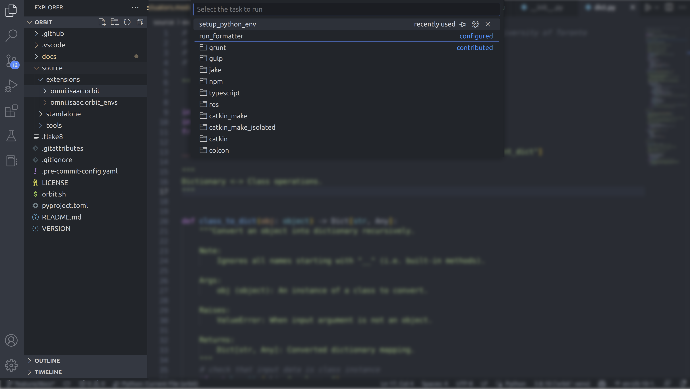

<a id="setup-vs-code"></a>

# Visual Studio Code 설정하기

**이 부분은 선택 사항이며, Isaac Lab을 사용하려면 VScode를 반드시 사용할 필요는 없습니다.**

[Visual Studio Code](https://code.visualstudio.com/)는 Isaac Lab 개발에서 매우 유용한 도구로 입증되었습니다. Isaac Lab 저장소에는 개발 환경을 설정하기 위한 VSCode 파일이 포함되어 있으며, 이 파일들은 `.vscode` 디렉터리에 있습니다. 포함된 파일은 다음과 같습니다:

```bash
.vscode
├── tools
│   ├── launch.template.json
│   ├── settings.template.json
│   └── setup_vscode.py
├── extensions.json
├── launch.json  # <- setup_vscode.py에 의해 생성됨
├── settings.json  # <- setup_vscode.py에 의해 생성됨
└── tasks.json
```

#### 주의 사항
다음 Visual Studio Code 설정 방법은
[Isaac Sim 바이너리 설치](../../setup/installation/binaries_installation.md#isaaclab-binaries-installation)에만 적용되며,
[Pip 설치](../../setup/installation/pip_installation.md#isaaclab-pip-installation)에는 적용되지 않습니다.

IDE를 설정하려면 다음 단계를 따르세요:

1. Visual Studio Code IDE에서 `IsaacLab` 디렉터리를 엽니다.
2. `Ctrl+Shift+P`를 누르고 `Tasks: Run Task`를 선택한 후, 드롭다운 메뉴에서 `setup_python_env`를 실행하여 VSCode [Tasks](https://code.visualstudio.com/docs/editor/tasks)를 실행합니다.
   

#### 참고 사항
VS Code에서 처음으로 태스크를 실행하는 경우, 경고를 어떻게 처리할지 묻는 메시지가 나타날 수 있습니다. 프롬프트에 따라 진행하여 태스크 창이 닫힐 때까지 진행하세요.

모든 것이 정상적으로 실행되면 다음 파일이 생성됩니다:

* `.vscode/launch.json`: Python 코드 디버깅을 위한 실행 구성을 포함합니다.
* `.vscode/settings.json`: Python 인터프리터 및 Python 환경 설정을 포함합니다.

VSCode에서 Omniverse 지원에 대한 자세한 내용은 다음 링크를 참조하세요:

* [Isaac Sim VSCode 지원](https://docs.isaacsim.omniverse.nvidia.com/latest/development_tools/vscode.html#visual-studio-code-vs-code)

# Python 인터프리터 구성하기

제공된 구성에서는 Omniverse에서 제공하는 Python 실행 파일을 기본 Python 인터프리터로 설정합니다. 이는 `.vscode/settings.json` 파일에서 지정됩니다:

```json
{
   "python.defaultInterpreterPath": "${workspaceFolder}/_isaac_sim/python.sh",
}
```

conda 또는 uv 환경의 Python 인터프리터와 같이 다른 Python 인터프리터를 사용하려면, VSCode 왼쪽 하단에서 원하는 Python 인터프리터를 선택하고 활성화하거나, 명령 팔레트(`Ctrl+Shift+P`)를 열고 `Python: Select Interpreter`를 선택하여 변경할 수 있습니다.

VSCode에서 Python 인터프리터를 설정하는 방법에 대한 자세한 내용은 [VSCode 문서](https://code.visualstudio.com/docs/python/environments#_working-with-python-interpreters)를 참조하세요.

# 서식 및 린팅 설정하기

우리는 [ruff](https://github.com/astral-sh/ruff/)를 포맷터 및 린터로 사용합니다. 이 도구들은 `.vscode/settings.json` 파일에서 구성됩니다:

```json
{
   "ruff.configuration": "${workspaceFolder}/pyproject.toml",
}
```

ruff 린터는 코드에 경고와 오류를 표시하여 Python 모범 사례 및 프로젝트의 코딩 표준을 준수하도록 도와줍니다.
