<a id="environments"></a>

# 사용 가능한 환경

다음은 Isaac Lab에서 사용 가능한 모든 RL 및 IL 작업 구현 목록입니다.
목록을 최신 상태로 유지하려고 노력하지만, 다음 명령을 실행하여 언제든지 최신 환경 목록을 얻을 수 있습니다.

### Linux

#### NOTE
키워드 검색을 위해 `--keyword <search_term>` 옵션을 사용할 수 있습니다(선택 사항).

```bash
./isaaclab.sh -p scripts/environments/list_envs.py --keyword <search_term>
```

### Windows

#### NOTE
키워드 검색을 위해 `--keyword <search_term>` 옵션을 사용할 수 있습니다(선택 사항).

```batch
isaaclab.bat -p scripts\environments\list_envs.py --keyword <search_term>
```

환경 목록을 계속 확장하고 있습니다. Isaac Lab에 추가하고 싶은 환경이 있다면 언제든지 풀 리퀘스트를 열어주세요!

## 단일 에이전트

### 클래식

IsaacGymEnvs의 MuJoCo 스타일 환경 구현을 기반으로 하는 클래식 환경입니다.

| World                                                  | Environment ID                                                                                                                                                                                                                                                                                                                                                                                                                                                                                                                                                                                                                                                                                                       | Description                                                                                                                                                                                                              |
|--------------------------------------------------------|----------------------------------------------------------------------------------------------------------------------------------------------------------------------------------------------------------------------------------------------------------------------------------------------------------------------------------------------------------------------------------------------------------------------------------------------------------------------------------------------------------------------------------------------------------------------------------------------------------------------------------------------------------------------------------------------------------------------|--------------------------------------------------------------------------------------------------------------------------------------------------------------------------------------------------------------------------|
| 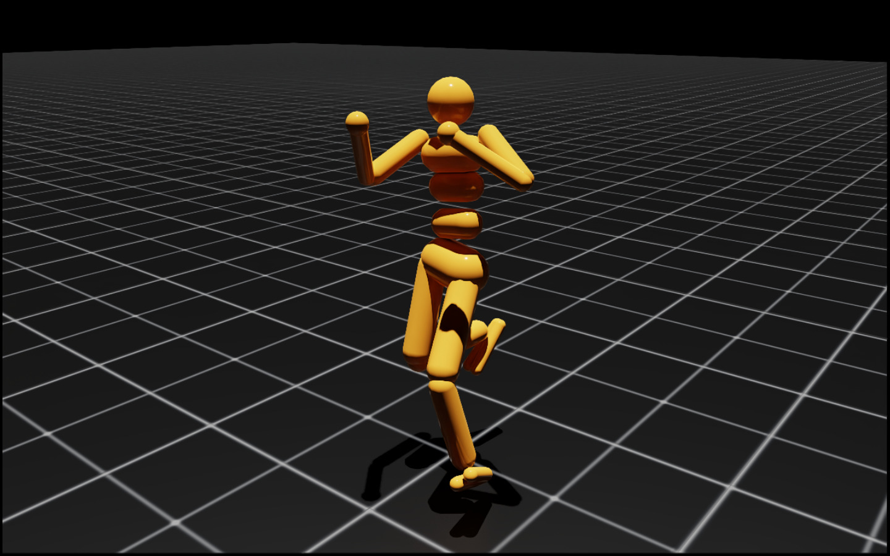 | [Isaac-Humanoid-v0](https://github.com/isaac-sim/IsaacLab/blob/main/source/isaaclab_tasks/isaaclab_tasks/manager_based/classic/humanoid/humanoid_env_cfg.py)<br/><br/>[Isaac-Humanoid-Direct-v0](https://github.com/isaac-sim/IsaacLab/blob/main/source/isaaclab_tasks/isaaclab_tasks/direct/humanoid/humanoid_env.py)                                                                                                                                                                                                                                                                                                                                                                                               | MuJoCo 인간형 로봇을 특정 방향으로 이동                                                                                                                                                                  |
| 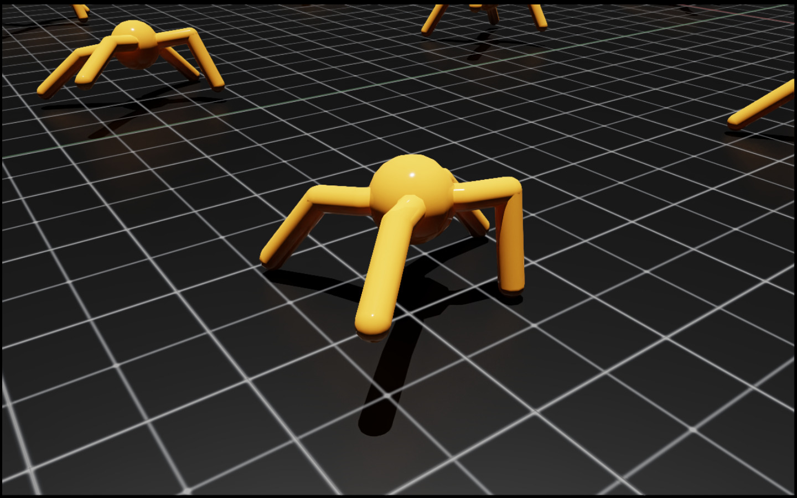           | [Isaac-Ant-v0](https://github.com/isaac-sim/IsaacLab/blob/main/source/isaaclab_tasks/isaaclab_tasks/manager_based/classic/ant/ant_env_cfg.py)<br/><br/>[Isaac-Ant-Direct-v0](https://github.com/isaac-sim/IsaacLab/blob/main/source/isaaclab_tasks/isaaclab_tasks/direct/ant/ant_env.py)                                                                                                                                                                                                                                                                                                                                                                                                                             | MuJoCo 개미 로봇을 특정 방향으로 이동                                                                                                                                                                       |
| 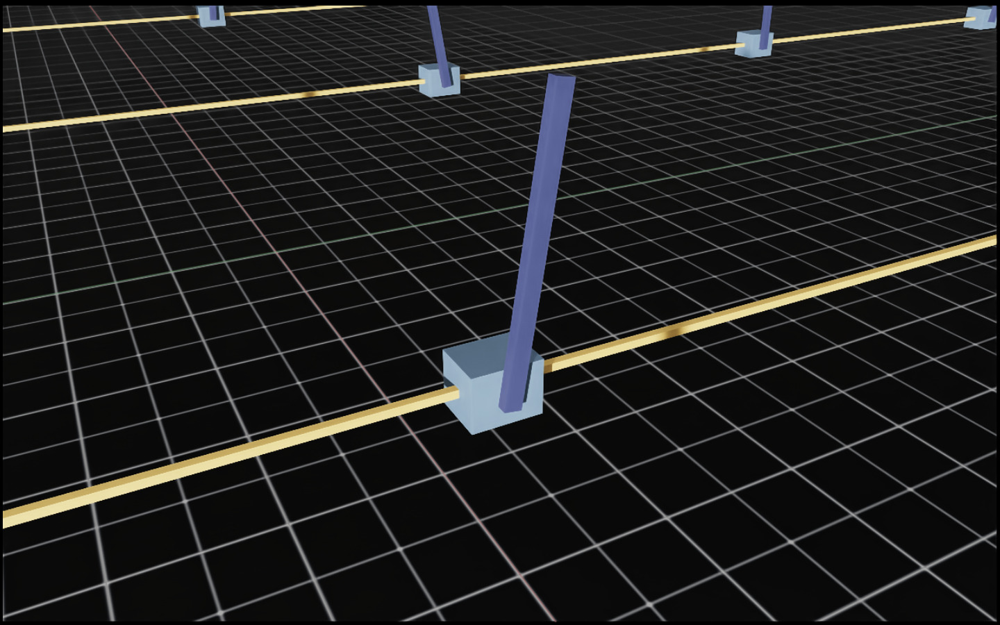 | [Isaac-Cartpole-v0](https://github.com/isaac-sim/IsaacLab/blob/main/source/isaaclab_tasks/isaaclab_tasks/manager_based/classic/cartpole/cartpole_env_cfg.py)<br/><br/>[Isaac-Cartpole-Direct-v0](https://github.com/isaac-sim/IsaacLab/blob/main/source/isaaclab_tasks/isaaclab_tasks/direct/cartpole/cartpole_env.py)                                                                                                                                                                                                                                                                                                                                                                                               | 클래식 카트폴 제어에서 카트를 움직여 폴을 수직으로 유지                                                                                                                                                   |
|  | [Isaac-Cartpole-RGB-v0](https://github.com/isaac-sim/IsaacLab/blob/main/source/isaaclab_tasks/isaaclab_tasks/manager_based/classic/cartpole/cartpole_camera_env_cfg.py)<br/><br/>[Isaac-Cartpole-Depth-v0](https://github.com/isaac-sim/IsaacLab/blob/main/source/isaaclab_tasks/isaaclab_tasks/manager_based/classic/cartpole/cartpole_camera_env_cfg.py)<br/><br/>[Isaac-Cartpole-RGB-Camera-Direct-v0](https://github.com/isaac-sim/IsaacLab/blob/main/source/isaaclab_tasks/isaaclab_tasks/direct/cartpole/cartpole_camera_env.py)<br/><br/>[Isaac-Cartpole-Depth-Camera-Direct-v0](https://github.com/isaac-sim/IsaacLab/blob/main/source/isaaclab_tasks/isaaclab_tasks/direct/cartpole/cartpole_camera_env.py) | 클래식 카트폴 제어에서 카트를 움직여 폴을 수직으로 유지<br/>그리고 인식 입력 사용. `--enable_cameras` 옵션으로 실행해야 합니다.                                                                              |
|  | [Isaac-Cartpole-RGB-ResNet18-v0](https://github.com/isaac-sim/IsaacLab/blob/main/source/isaaclab_tasks/isaaclab_tasks/manager_based/classic/cartpole/cartpole_camera_env_cfg.py)<br/><br/>[Isaac-Cartpole-RGB-TheiaTiny-v0](https://github.com/isaac-sim/IsaacLab/blob/main/source/isaaclab_tasks/isaaclab_tasks/manager_based/classic/cartpole/cartpole_camera_env_cfg.py)                                                                                                                                                                                                                                                                                                                                          | 클래식 카트폴 제어에서 카트를 움직여 폴을 수직으로 유지<br/>사전 훈련된 고정 시각 인코더에서 추출한 인식 입력의 특징 기반.<br/>`--enable_cameras` 옵션으로 실행해야 합니다. |

### 조작

고정형 팔 조작 작업 기반 환경입니다.

많은 작업에서 다양한 팔 액션 공간 구성을 제공합니다. 예를 들어, lift-cube 환경의 경우:

* [Isaac-Lift-Cube-Franka-v0](https://github.com/isaac-sim/IsaacLab/blob/main/source/isaaclab_tasks/isaaclab_tasks/manager_based/manipulation/lift/config/franka/joint_pos_env_cfg.py): 프랑카 팔과 관절 위치 제어
* [Isaac-Lift-Cube-Franka-IK-Abs-v0](https://github.com/isaac-sim/IsaacLab/blob/main/source/isaaclab_tasks/isaaclab_tasks/manager_based/manipulation/lift/config/franka/ik_abs_env_cfg.py): 프랑카 팔과 절대 IK 제어
* [Isaac-Lift-Cube-Franka-IK-Rel-v0](https://github.com/isaac-sim/IsaacLab/blob/main/source/isaaclab_tasks/isaaclab_tasks/manager_based/manipulation/lift/config/franka/ik_rel_env_cfg.py): 프랑카 팔과 상대 IK 제어

| World                                                                                     | Environment ID                                                                                                                                                                                                                                                                                                                                                                                                                                                                                                                                         | Description                                                                                                                                                                                                                                                        |
|-------------------------------------------------------------------------------------------|--------------------------------------------------------------------------------------------------------------------------------------------------------------------------------------------------------------------------------------------------------------------------------------------------------------------------------------------------------------------------------------------------------------------------------------------------------------------------------------------------------------------------------------------------------|--------------------------------------------------------------------------------------------------------------------------------------------------------------------------------------------------------------------------------------------------------------------|
| 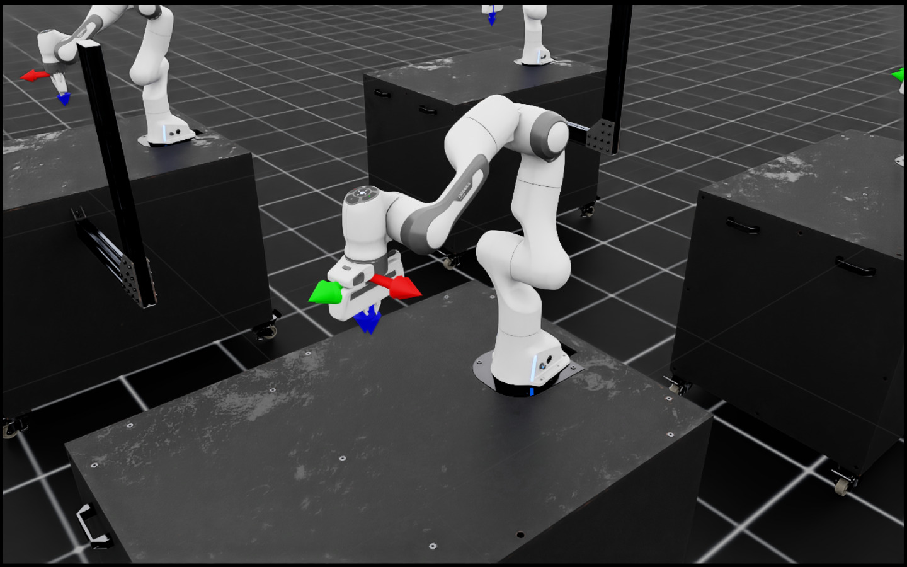                       | [Isaac-Reach-Franka-v0](https://github.com/isaac-sim/IsaacLab/blob/main/source/isaaclab_tasks/isaaclab_tasks/manager_based/manipulation/reach/config/franka/joint_pos_env_cfg.py)                                                                                                                                                                                                                                                                                                                                                                      | 프랑카 로봇으로 엔드 이펙터를 샘플링된 목표 포즈로 이동                                                                                                                                                                                               |
| 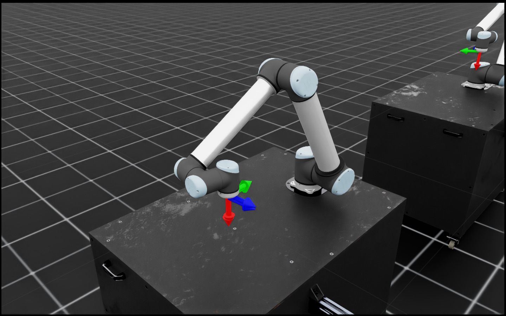                           | [Isaac-Reach-UR10-v0](https://github.com/isaac-sim/IsaacLab/blob/main/source/isaaclab_tasks/isaaclab_tasks/manager_based/manipulation/reach/config/ur_10/joint_pos_env_cfg.py)                                                                                                                                                                                                                                                                                                                                                                         | UR10 로봇으로 엔드 이펙터를 샘플링된 목표 포즈로 이동                                                                                                                                                                                                 |
| 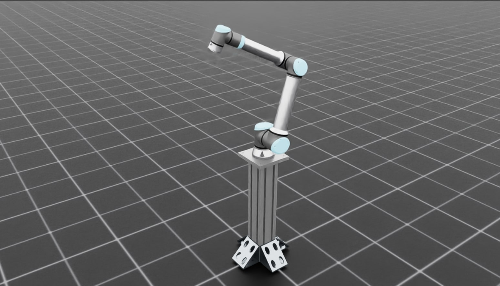                  | [Isaac-Deploy-Reach-UR10e-v0](https://github.com/isaac-sim/IsaacLab/blob/main/source/isaaclab_tasks/isaaclab_tasks/manager_based/manipulation/deploy/reach/config/ur_10e/joint_pos_env_cfg.py)                                                                                                                                                                                                                                                                                                                                                         | UR10e 로봇으로 엔드 이펙터를 샘플링된 목표 포즈로 이동<br/>이 정책이 실제 로봇에 배포되었음                                                                                                                                              |
| 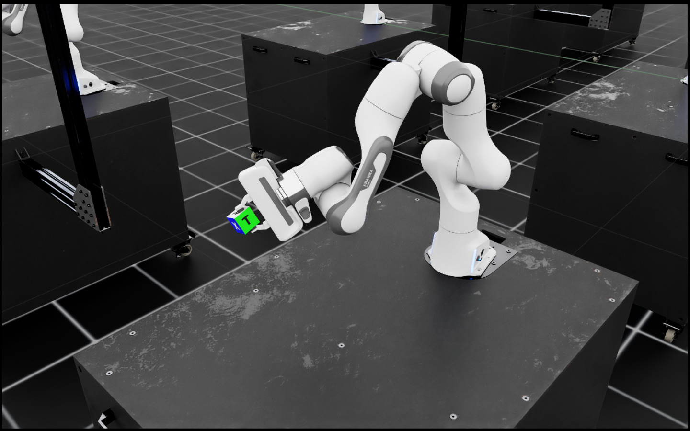                           | [Isaac-Lift-Cube-Franka-v0](https://github.com/isaac-sim/IsaacLab/blob/main/source/isaaclab_tasks/isaaclab_tasks/manager_based/manipulation/lift/config/franka/joint_pos_env_cfg.py)                                                                                                                                                                                                                                                                                                                                                                   | 프랑카 로봇으로 큐브를 집어 샘플링된 목표 위치로 이동                                                                                                                                                                                        |
| 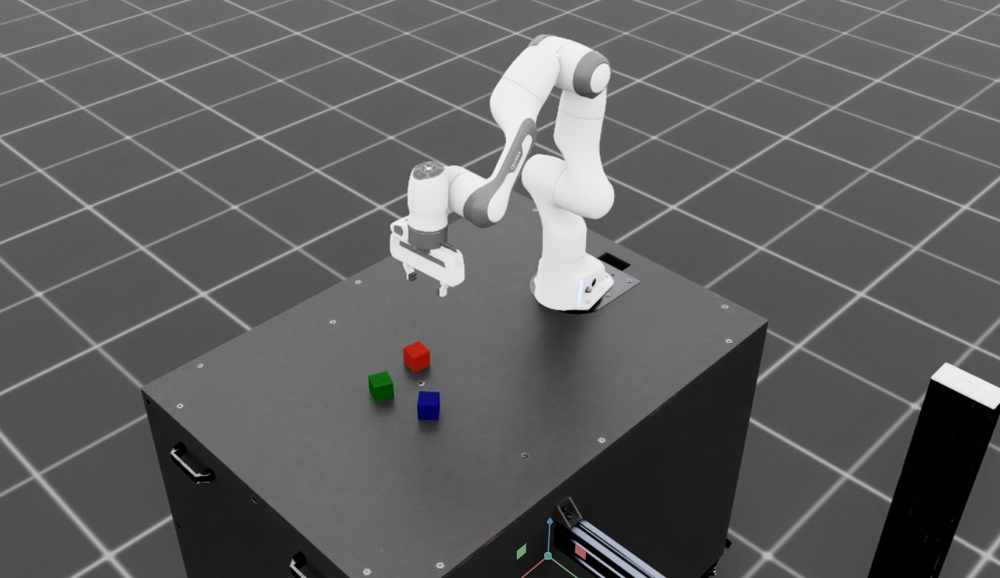                         | [Isaac-Stack-Cube-Franka-v0](https://github.com/isaac-sim/IsaacLab/blob/main/source/isaaclab_tasks/isaaclab_tasks/manager_based/manipulation/stack/config/franka/stack_joint_pos_env_cfg.py)<br/><br/>[Isaac-Stack-Cube-Franka-IK-Rel-Blueprint-v0](https://github.com/isaac-sim/IsaacLab/blob/main/source/isaaclab_tasks/isaaclab_tasks/manager_based/manipulation/stack/config/franka/stack_ik_rel_blueprint_env_cfg.py)                                                                                                                             | 프랑카 로봇으로 세 개의 큐브를 쌓기 (바닥에서 위로: 파란색, 빨간색, 초록색)<br/>NVIDIA Isaac GR00T 블루프린트를 위한 합성 조작 움직임 생성을 위한 블루프린트 환경 사용                                                                            |
| 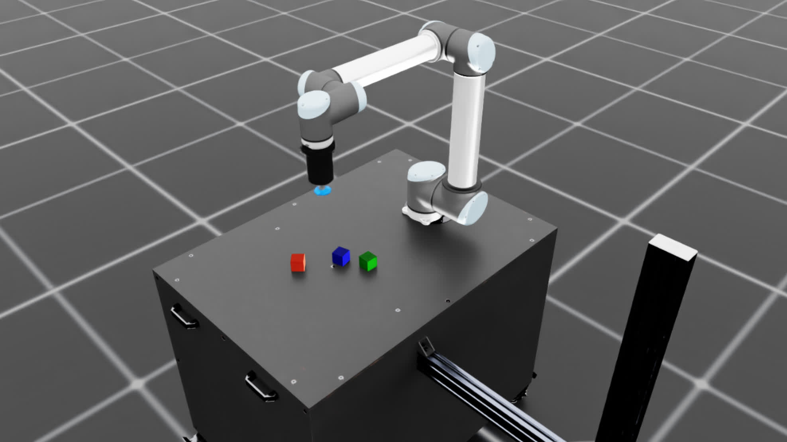      | [Isaac-Stack-Cube-UR10-Long-Suction-IK-Rel-v0](https://github.com/isaac-sim/IsaacLab/blob/main/source/isaaclab_tasks/isaaclab_tasks/manager_based/manipulation/stack/config/ur10_gripper/stack_ik_rel_env_cfg.py)<br/><br/>[Isaac-Stack-Cube-UR10-Short-Suction-IK-Rel-v0](https://github.com/isaac-sim/IsaacLab/blob/main/source/isaaclab_tasks/isaaclab_tasks/manager_based/manipulation/stack/config/ur10_gripper/stack_ik_rel_env_cfg.py)                                                                                                          | UR10 팔과 긴 표면 그리퍼 또는 짧은 표면 그리퍼로<br/>세 개의 큐브를 쌓기 (바닥에서 위로: 파란색, 빨간색, 초록색)                                                                                                                                   |
| 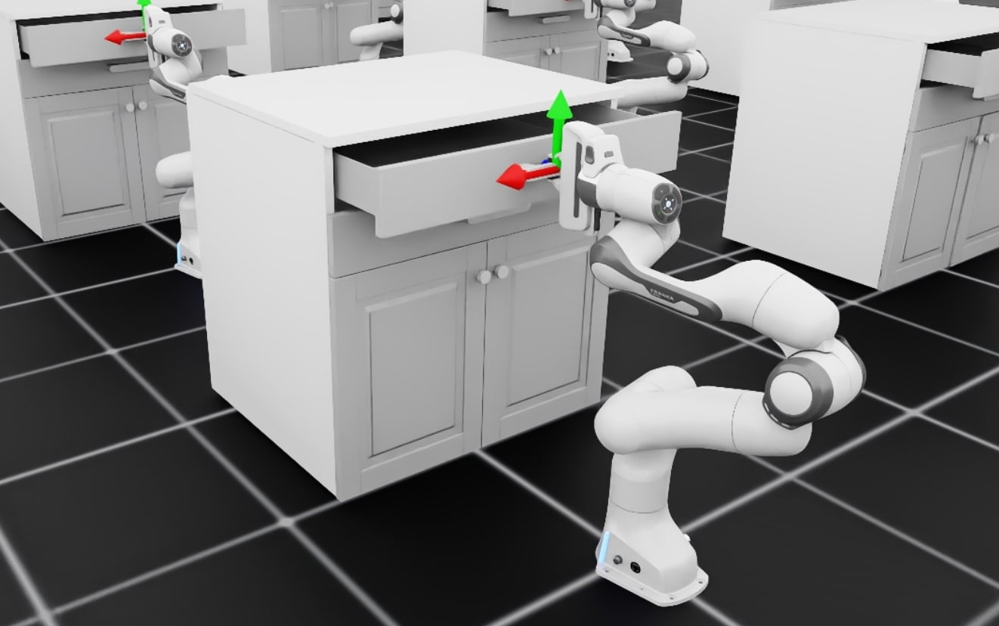                  | [Isaac-Open-Drawer-Franka-v0](https://github.com/isaac-sim/IsaacLab/blob/main/source/isaaclab_tasks/isaaclab_tasks/manager_based/manipulation/cabinet/config/franka/joint_pos_env_cfg.py)<br/><br/>[Isaac-Franka-Cabinet-Direct-v0](https://github.com/isaac-sim/IsaacLab/blob/main/source/isaaclab_tasks/isaaclab_tasks/direct/franka_cabinet/franka_cabinet_env.py)                                                                                                                                                                                  | 프랑카 로봇으로 캐비닛 서랍의 손잡이를 잡고 열기                                                                                                                                                                                           |
| 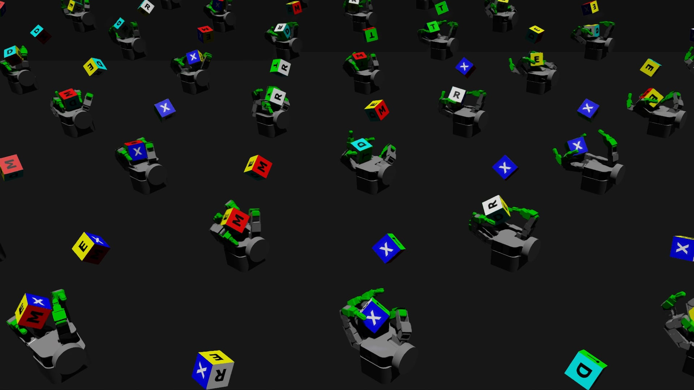                       | [Isaac-Repose-Cube-Allegro-v0](https://github.com/isaac-sim/IsaacLab/blob/main/source/isaaclab_tasks/isaaclab_tasks/manager_based/manipulation/inhand/config/allegro_hand/allegro_env_cfg.py)<br/><br/>[Isaac-Repose-Cube-Allegro-Direct-v0](https://github.com/isaac-sim/IsaacLab/blob/main/source/isaaclab_tasks/isaaclab_tasks/direct/allegro_hand/allegro_hand_env_cfg.py)                                                                                                                                                                         | 알레그로 손을 사용한 큐브의 손끝 재조정                                                                                                                                                                                                                 |
| 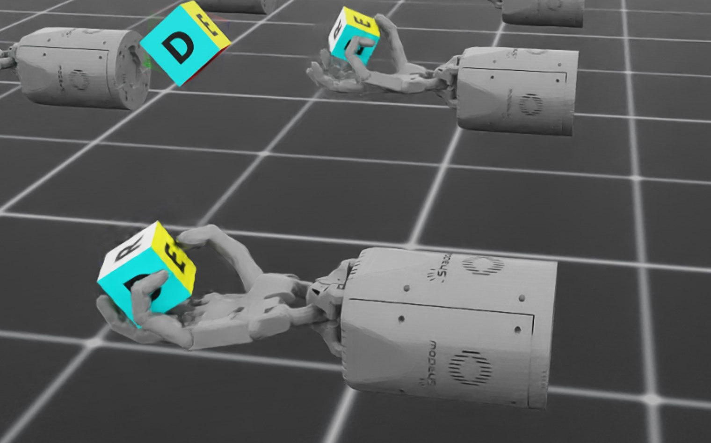                         | [Isaac-Repose-Cube-Shadow-Direct-v0](https://github.com/isaac-sim/IsaacLab/blob/main/source/isaaclab_tasks/isaaclab_tasks/direct/shadow_hand/shadow_hand_env_cfg.py)<br/><br/>[Isaac-Repose-Cube-Shadow-OpenAI-FF-Direct-v0](https://github.com/isaac-sim/IsaacLab/blob/main/source/isaaclab_tasks/isaaclab_tasks/direct/shadow_hand/shadow_hand_env_cfg.py)<br/><br/>[Isaac-Repose-Cube-Shadow-OpenAI-LSTM-Direct-v0](https://github.com/isaac-sim/IsaacLab/blob/main/source/isaaclab_tasks/isaaclab_tasks/direct/shadow_hand/shadow_hand_env_cfg.py) | 섀도우 손을 사용한 큐브의 손끝 재조정                                                                                                                                                                                                                  |
|                          | [Isaac-Repose-Cube-Shadow-Vision-Direct-v0](https://github.com/isaac-sim/IsaacLab/blob/main/source/isaaclab_tasks/isaaclab_tasks/direct/shadow_hand/shadow_hand_vision_env.py)                                                                                                                                                                                                                                                                                                                                                                         | perceptive 입력을 사용한 섀도우 손을 통한 큐브의 손끝 재조정<br/>`--enable_cameras` 옵션으로 실행해야 함                                                                                                                                           |
| 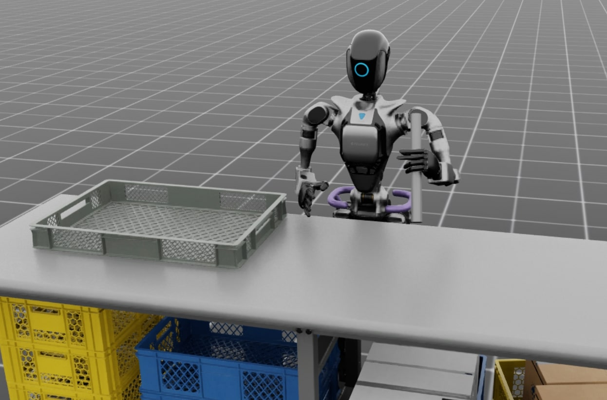                  | [Isaac-PickPlace-GR1T2-Abs-v0](https://github.com/isaac-sim/IsaacLab/blob/main/source/isaaclab_tasks/isaaclab_tasks/manager_based/manipulation/pick_place/pickplace_gr1t2_env_cfg.py)                                                                                                                                                                                                                                                                                                                                                                  | GR-1 휴머노이드 로봇을 사용하여 물체를 바구니에 집고 놓기                                                                                                                                                                                                 |
| 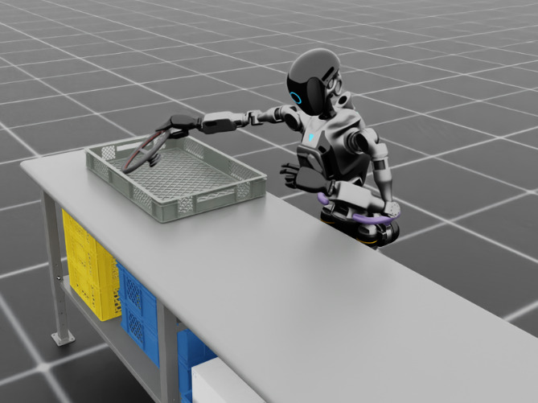              | [Isaac-PickPlace-GR1T2-WaistEnabled-Abs-v0](https://github.com/isaac-sim/IsaacLab/blob/main/source/isaaclab_tasks/isaaclab_tasks/manager_based/manipulation/pick_place/pickplace_gr1t2_waist_enabled_env_cfg.py)                                                                                                                                                                                                                                                                                                                                       | 허리 자유도가 활성화된 GR-1 휴머노이드 로봇을 사용하여 물체를 바구니에 집고 놓기<br/>넓은 작업 공간을 제공하는 허리 움직임이 활성화되어 있음.                                                                                                                    |
| 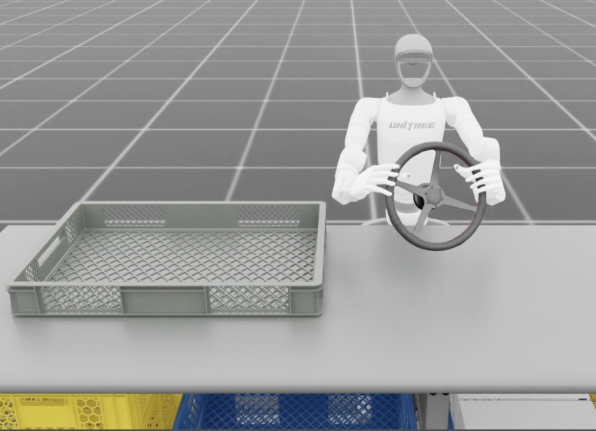                     | [Isaac-PickPlace-G1-InspireFTP-Abs-v0](https://github.com/isaac-sim/IsaacLab/blob/main/source/isaaclab_tasks/isaaclab_tasks/manager_based/manipulation/pick_place/pickplace_unitree_g1_inspire_hand_env_cfg.py)                                                                                                                                                                                                                                                                                                                                        | Unitree G1 휴머노이드 로봇을 사용하여 물체를 바구니에 집고 놓기                                                                                                                                                                                           |
| 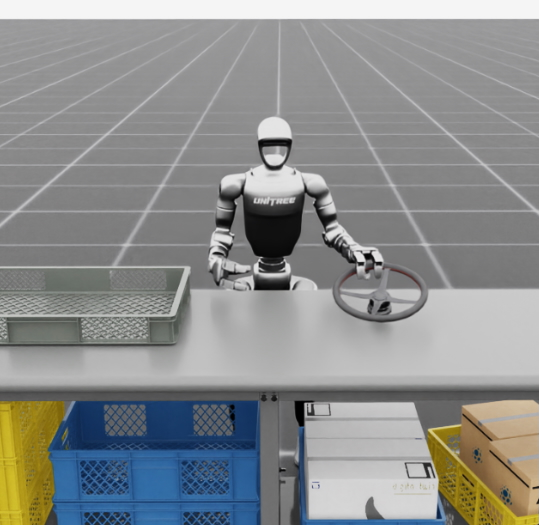    | [Isaac-PickPlace-FixedBaseUpperBodyIK-G1-Abs-v0](https://github.com/isaac-sim/IsaacLab/blob/main/source/isaaclab_tasks/isaaclab_tasks/manager_based/locomanipulation/pick_place/fixed_base_upper_body_ik_g1_env_cfg.py)                                                                                                                                                                                                                                                                                                                                | Unitree G1 휴머노이드 로봇을 사용하여 물체를 바구니에 집고 놓기<br/>세 손가락 손이 장착되어 있고, 로봇 베이스가 고정된 상태로 설정됨.                                                                                                              |
| 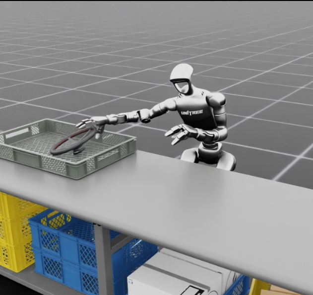 | [Isaac-PickPlace-Locomanipulation-G1-Abs-v0](https://github.com/isaac-sim/IsaacLab/blob/main/source/isaaclab_tasks/isaaclab_tasks/manager_based/locomanipulation/pick_place/locomanipulation_g1_env_cfg.py)                                                                                                                                                                                                                                                                                                                                            | Unitree G1 휴머노이드 로봇을 사용하여 물체를 바구니에 집고 놓기<br/>세 손가락 손과 제자리 로코맨필레이션 기능이 활성화되어 있음<br/>(즉, 로봇 하체는 제자리에서 균형을 유지하면서 상체는 역운동학을 통해 제어됨). |
| 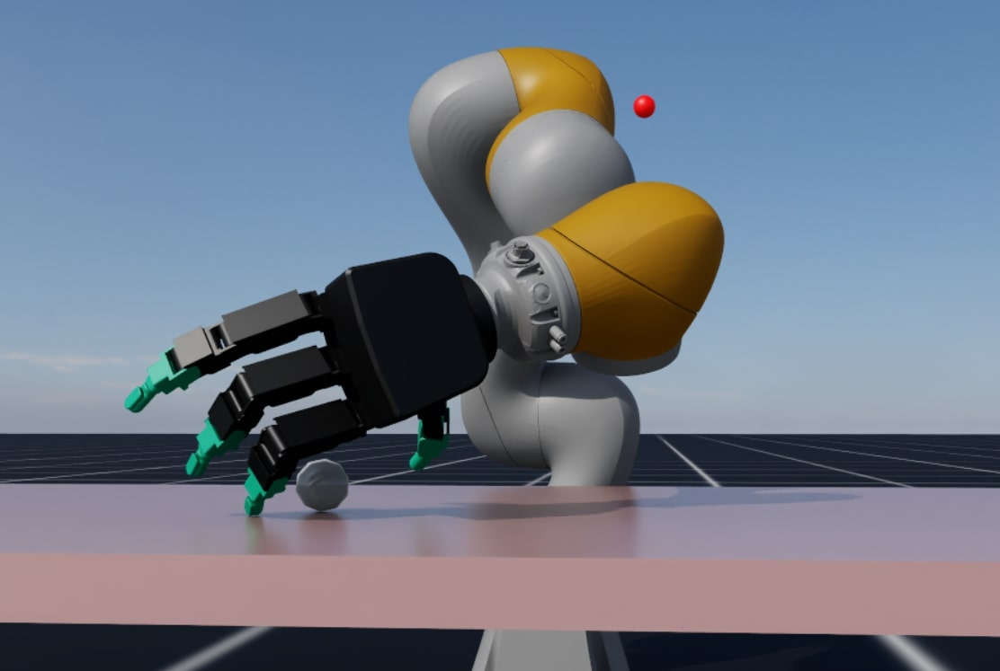             | [Isaac-Dexsuite-Kuka-Allegro-Lift-v0](https://github.com/isaac-sim/IsaacLab/blob/main/source/isaaclab_tasks/isaaclab_tasks/manager_based/manipulation/dexsuite/config/kuka_allegro/dexsuite_kuka_allegro_env_cfg.py)                                                                                                                                                                                                                                                                                                                                   | 테이블 위에 있는 원시 도형을 들어올려 목표 위치로 옮기기                                                                                                                                                                                              |
| 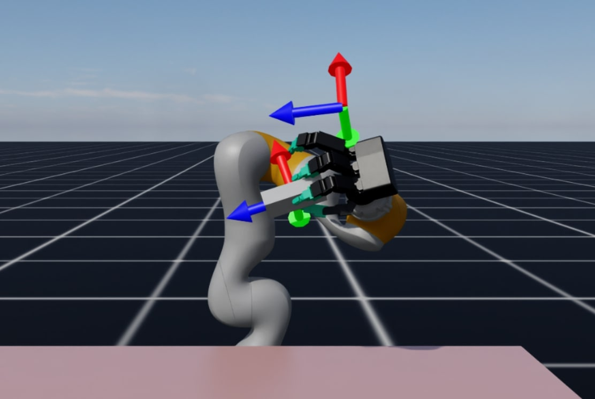     | [Isaac-Dexsuite-Kuka-Allegro-Reorient-v0](https://github.com/isaac-sim/IsaacLab/blob/main/source/isaaclab_tasks/isaaclab_tasks/manager_based/manipulation/dexsuite/config/kuka_allegro/dexsuite_kuka_allegro_env_cfg.py)                                                                                                                                                                                                                                                                                                                               | 테이블 위에 있는 원시 도형을 들어올려 목표 자세로 방향 전환하기                                                                                                                                                                                                |
| 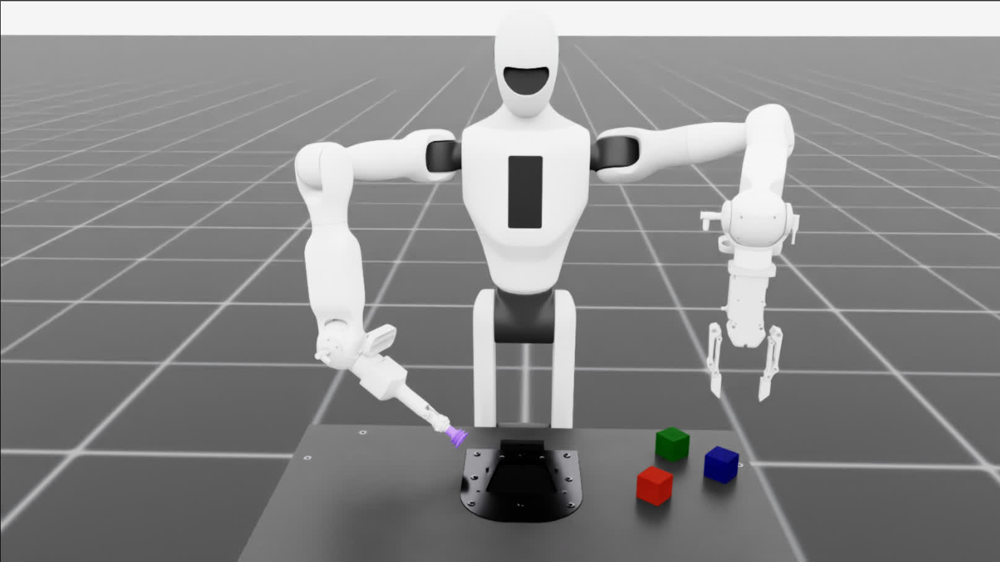                  | [Isaac-Stack-Cube-Galbot-Left-Arm-Gripper-RmpFlow-v0](https://github.com/isaac-sim/IsaacLab/blob/main/source/isaaclab_tasks/isaaclab_tasks/manager_based/manipulation/stack/config/galbot/stack_rmp_rel_env_cfg.py)                                                                                                                                                                                                                                                                                                                                    | Galbot 휴머노이드 로봇의 왼쪽 팔을 사용하여 세 개의 큐브를 쌓기 (아래에서 위쪽으로: 파란색, 빨간색, 초록색)                                                                                                                                                               |
| 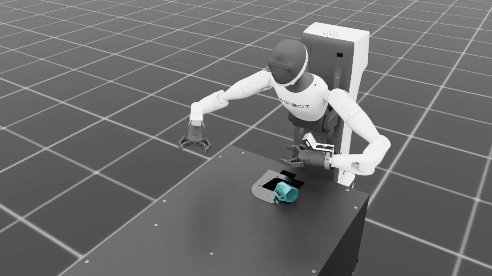               | [Isaac-Place-Mug-Agibot-Left-Arm-RmpFlow-v0](https://github.com/isaac-sim/IsaacLab/blob/main/source/isaaclab_tasks/isaaclab_tasks/manager_based/manipulation/place/config/agibot/place_upright_mug_rmp_rel_env_cfg.py)                                                                                                                                                                                                                                                                                                                                 | Agibot A2D 휴머노이드 로봇을 사용하여 머그컵을 바르게 집어 올려 놓기                                                                                                                                                                                                   |
| 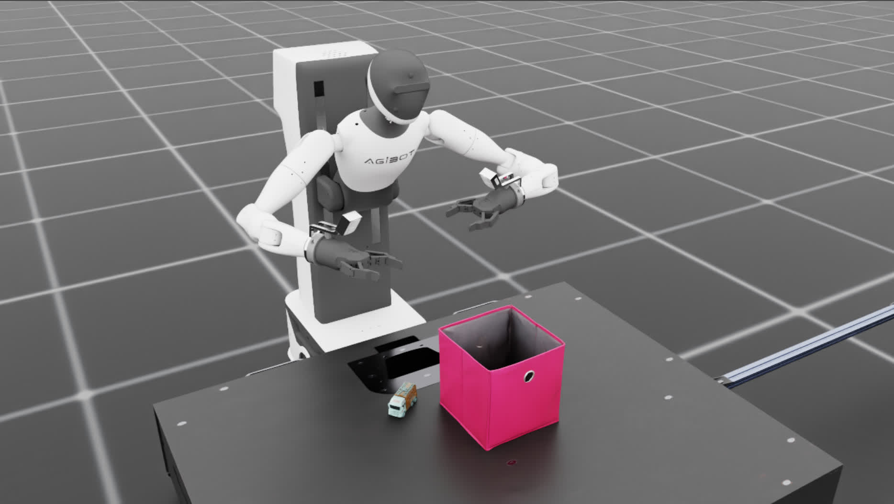               | [Isaac-Place-Toy2Box-Agibot-Right-Arm-RmpFlow-v0](https://github.com/isaac-sim/IsaacLab/blob/main/source/isaaclab_tasks/isaaclab_tasks/manager_based/manipulation/place/config/agibot/place_toy2box_rmp_rel_env_cfg.py)                                                                                                                                                                                                                                                                                                                                | Agibot A2D 휴머노이드 로봇을 사용하여 물체를 상자에 집어 넣기                                                                                                                                                                                              |
| 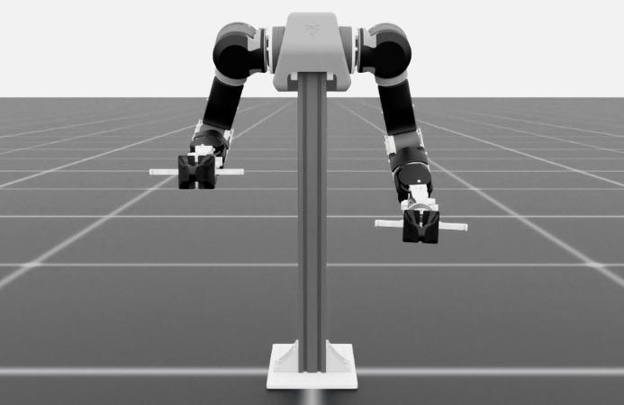               | [Isaac-Reach-OpenArm-Bi-v0](https://github.com/isaac-sim/IsaacLab/blob/main/source/isaaclab_tasks/isaaclab_tasks/manager_based/manipulation/reach/config/openarm/bimanual/joint_pos_env_cfg.py)                                                                                                                                                                                                                                                                                                                                                        | OpenArm 로봇의 엔드 이펙터를 샘플링된 목표 자세로 이동하기                                                                                                                                                                                               |
| 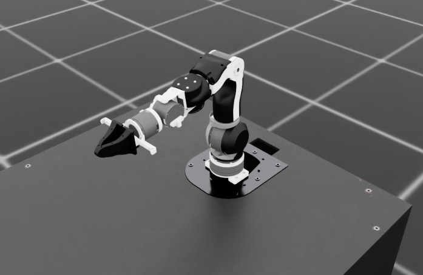             | [Isaac-Reach-OpenArm-v0](https://github.com/isaac-sim/IsaacLab/blob/main/source/isaaclab_tasks/isaaclab_tasks/manager_based/manipulation/reach/config/openarm/unimanual/joint_pos_env_cfg.py)                                                                                                                                                                                                                                                                                                                                                          | OpenArm 로봇으로 엔드 이펙터를 샘플링된 목표 포즈로 이동                                                                                                                                                                                              |
| 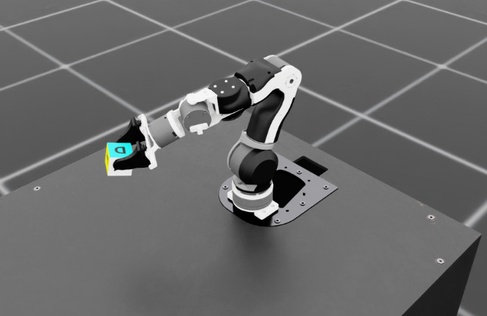               | [Isaac-Lift-Cube-OpenArm-v0](https://github.com/isaac-sim/IsaacLab/blob/main/source/isaaclab_tasks/isaaclab_tasks/manager_based/manipulation/lift/config/openarm/joint_pos_env_cfg.py)                                                                                                                                                                                                                                                                                                                                                                 | OpenArm 로봇으로 큐브를 집어 샘플링된 목표 위치로 옮기기                                                                                                                                                                                       |
| 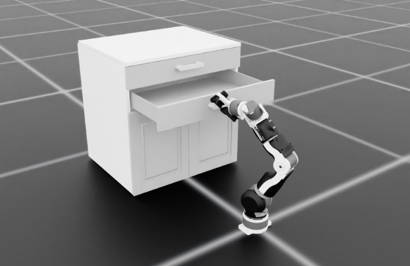        | [Isaac-Open-Drawer-OpenArm-v0](https://github.com/isaac-sim/IsaacLab/blob/main/source/isaaclab_tasks/isaaclab_tasks/manager_based/manipulation/cabinet/config/openarm/joint_pos_env_cfg.py)                                                                                                                                                                                                                                                                                                                                                            | OpenArm 로봇으로 캐비닛 서랍의 손잡이를 잡은 뒤 열기                                                                                                                                                                                          |

### 접촉이 풍부한 조작

페그 삽입, 기어 맞물림, 너트-볼트 체결과 같은 접촉이 풍부한 조작 작업을 기반으로 한 환경입니다.

이러한 작업은 동일한 작업 구성과 제어 옵션을 공유합니다. 작업 이름을 지정하여 전환할 수 있습니다.
예를 들어:

* [Isaac-Factory-PegInsert-Direct-v0](https://github.com/isaac-sim/IsaacLab/blob/main/source/isaaclab_tasks/isaaclab_tasks/direct/factory/factory_env_cfg.py): 프란카 로봇으로 페그 삽입
* [Isaac-Factory-GearMesh-Direct-v0](https://github.com/isaac-sim/IsaacLab/blob/main/source/isaaclab_tasks/isaaclab_tasks/direct/factory/factory_env_cfg.py): 프란카 로봇으로 기어 맞물림
* [Isaac-Factory-NutThread-Direct-v0](https://github.com/isaac-sim/IsaacLab/blob/main/source/isaaclab_tasks/isaaclab_tasks/direct/factory/factory_env_cfg.py): 프란카 로봇으로 너트-볼트 체결

| World                                                       | Environment ID                                                                                                                                              | Description                                                                 |
|-------------------------------------------------------------|-------------------------------------------------------------------------------------------------------------------------------------------------------------|-----------------------------------------------------------------------------|
| 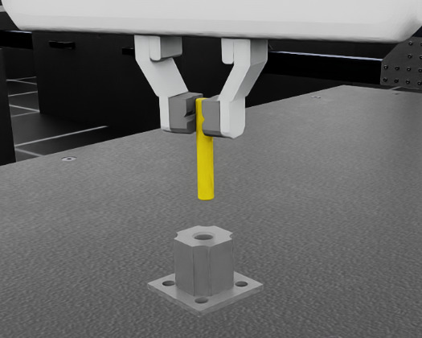 | [Isaac-Factory-PegInsert-Direct-v0](https://github.com/isaac-sim/IsaacLab/blob/main/source/isaaclab_tasks/isaaclab_tasks/direct/factory/factory_env_cfg.py) | 프란카 로봇으로 소켓에 페그 삽입                            |
| 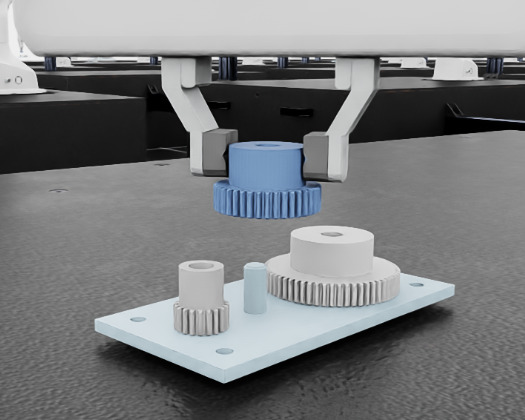 | [Isaac-Factory-GearMesh-Direct-v0](https://github.com/isaac-sim/IsaacLab/blob/main/source/isaaclab_tasks/isaaclab_tasks/direct/factory/factory_env_cfg.py)  | 프란카 로봇으로 기어를 기본 기어와 맞물려 삽입 |
| 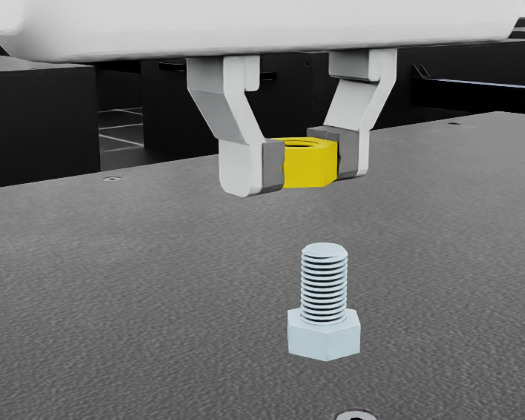 | [Isaac-Factory-NutThread-Direct-v0](https://github.com/isaac-sim/IsaacLab/blob/main/source/isaaclab_tasks/isaaclab_tasks/direct/factory/factory_env_cfg.py) | 프란카 로봇으로 볼트의 첫 번째 두 나사에 너트 조이기 |

### AutoMate

소켓에 플러그를 삽입하는 100가지 다양한 조립 작업으로 구성된 환경입니다. 각 작업은 부품의 기하학적 형태와 속성에 따라 다릅니다. 모든 작업은 동일한 구성을 공유합니다.

해당하는 asset ID를 지정하여 작업을 전환할 수 있습니다. 가능한 asset ID는 다음과 같습니다:

‘00004’, ‘00007’, ‘00014’, ‘00015’, ‘00016’, ‘00021’, ‘00028’, ‘00030’, ‘00032’, ‘00042’, ‘00062’, ‘00074’, ‘00077’, ‘00078’, ‘00081’, ‘00083’, ‘00103’, ‘00110’, ‘00117’, ‘00133’, ‘00138’, ‘00141’, ‘00143’, ‘00163’, ‘00175’, ‘00186’, ‘00187’, ‘00190’, ‘00192’, ‘00210’, ‘00211’, ‘00213’, ‘00255’, ‘00256’, ‘00271’, ‘00293’, ‘00296’, ‘00301’, ‘00308’, ‘00318’, ‘00319’, ‘00320’, ‘00329’, ‘00340’, ‘00345’, ‘00346’, ‘00360’, ‘00388’, ‘00410’, ‘00417’, ‘00422’, ‘00426’, ‘00437’, ‘00444’, ‘00446’, ‘00470’, ‘00471’, ‘00480’, ‘00486’, ‘00499’, ‘00506’, ‘00514’, ‘00537’, ‘00553’, ‘00559’, ‘00581’, ‘00597’, ‘00614’, ‘00615’, ‘00638’, ‘00648’, ‘00649’, ‘00652’, ‘00659’, ‘00681’, ‘00686’, ‘00700’, ‘00703’, ‘00726’, ‘00731’, ‘00741’, ‘00755’, ‘00768’, ‘00783’, ‘00831’, ‘00855’, ‘00860’, ‘00863’, ‘01026’, ‘01029’, ‘01036’, ‘01041’, ‘01053’, ‘01079’, ‘01092’, ‘01102’, ‘01125’, ‘01129’, ‘01132’, ‘01136’.

분해 및 조립을 위한 환경을 모두 제공합니다.

#### 주의
Nvidia 드라이버 570을 사용하는 Linux x86_64 아키텍처에서 AutoMate 환경을 실행할 때는 CUDA 12.8을 권장합니다. 아래 단계를 따라 CUDA 12.8을 설치하면 AutoMate 환경에서 CUDA를 사용해 보상을 계산할 수 있습니다. 다른 운영 체제나 아키텍처를 사용하는 경우, [CUDA 설치 페이지](https://developer.nvidia.com/cuda-12-8-0-download-archive)를 참조하여 추가 지침을 확인하세요.

```bash
wget https://developer.download.nvidia.com/compute/cuda/12.8.0/local_installers/cuda_12.8.0_570.86.10_linux.run
sudo sh cuda_12.8.0_570.86.10_linux.run --toolkit
```

conda를 사용할 경우, 다음과 같이 cuda 툴킷을 설치할 수 있습니다:

```bash
conda install cudatoolkit
```

Nvidia 드라이버 580과 CUDA 13을 사용할 때는 현재 AutoMate 환경에서 CUDA를 사용해 보상을 계산할 수 없습니다. 코드가 자동으로 CPU로 폴백되어 성능이 약간 낮아집니다.

* [Isaac-AutoMate-Disassembly-Direct-v0](https://github.com/isaac-sim/IsaacLab/blob/main/source/isaaclab_tasks/isaaclab_tasks/direct/automate/disassembly_env_cfg.py): 플러그가 소켓에 삽입된 상태에서 시작됩니다. 저레벨 컨트롤러가 플러그를 들어 올려 랜덤한 위치로 이동시킵니다. 이 과정은 완전히 스크립트로 제어되며 학습된 정책을 사용하지 않으므로 정책 훈련이나 평가가 필요하지 않습니다. 생성된 궤적은 역과정, 즉 조립을 배우기 위한 시연으로 사용됩니다. 특정 작업에 대한 분해를 실행하려면 다음 명령을 사용합니다: `python source/isaaclab_tasks/isaaclab_tasks/direct/automate/run_disassembly_w_id.py --assembly_id=ASSEMBLY_ID --disassembly_dir=DISASSEMBLY_DIR`. 모든 생성된 궤적은 로컬 디렉터리 `DISASSEMBLY_DIR`에 저장됩니다.
* [Isaac-AutoMate-Assembly-Direct-v0](https://github.com/isaac-sim/IsaacLab/blob/main/source/isaaclab_tasks/isaaclab_tasks/direct/automate/assembly_env_cfg.py): 목표는 플러그를 소켓에 삽입하는 것입니다. 이 환경을 사용하여 강화 학습으로 정책을 훈련하거나 사전 훈련된 체크포인트를 평가할 수 있습니다.
  * 조립 정책을 훈련하려면 다음 명령을 실행합니다: `python source/isaaclab_tasks/isaaclab_tasks/direct/automate/run_w_id.py --assembly_id=ASSEMBLY_ID --train`. 선택적 플래그를 사용하여 훈련 과정을 커스터마이즈할 수 있습니다: `--headless`는 GUI 창 없이 실행, `--max_iterations=MAX_ITERATIONS`는 훈련 반복 횟수 설정, `--num_envs=NUM_ENVS`는 훈련 중 병렬 환경 수 설정, `--seed=SEED`는 랜덤 시드 지정. 정책 체크포인트는 훈련 중에 자동으로 `logs/rl_games/Assembly/test` 디렉터리에 저장됩니다.
  * 조립 정책을 평가하려면 다음 명령을 실행합니다: `python source/isaaclab_tasks/isaaclab_tasks/direct/automate/run_w_id.py --assembly_id=ASSEMBLY_ID --checkpoint=CHECKPOINT --log_eval`. 평가 결과는 `evaluation_{ASSEMBLY_ID}.h5`에 저장됩니다.

| World                                                               | Environment ID                                                                                                                                                      | Description                                                       |
|---------------------------------------------------------------------|---------------------------------------------------------------------------------------------------------------------------------------------------------------------|-------------------------------------------------------------------|
| 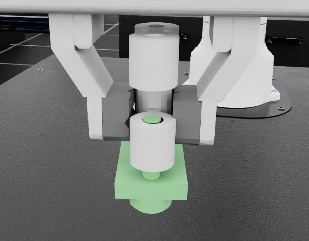 | [Isaac-AutoMate-Disassembly-Direct-v0](https://github.com/isaac-sim/IsaacLab/blob/main/source/isaaclab_tasks/isaaclab_tasks/direct/automate/disassembly_env_cfg.py) | 프랑카 로봇을 사용하여 소켓에서 플러그 들어올리기              |
| 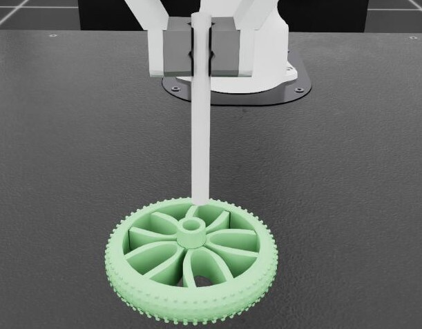                | [Isaac-AutoMate-Assembly-Direct-v0](https://github.com/isaac-sim/IsaacLab/blob/main/source/isaaclab_tasks/isaaclab_tasks/direct/automate/assembly_env_cfg.py)       | 프랑카 로봇을 사용하여 플러그를 해당 소켓에 삽입하기 |

### FORGE

FORGE 환경은 다음 기능을 추가하여 Factory 환경을 확장합니다:

* 힘 감지: 엔드 이펙터가 경험하는 힘에 대한 옵저베이션 추가.
* 과도한 힘 패널티: 과도한 접촉 힘에 대해 에이전트를 패널티화하는 옵션 추가.
* 다이내믹스 랜덤화: 컨트롤러 게인, 자산 속성(마찰, 질량) 및 데드존 랜덤화.
* 성공 예측: 작업 성공을 예측하는 추가 액션 추가.

이러한 작업들은 동일한 작업 구성 및 제어 옵션을 공유합니다. 작업 이름을 지정하여 전환할 수 있습니다.

* [Isaac-Forge-PegInsert-Direct-v0](https://github.com/isaac-sim/IsaacLab/blob/main/source/isaaclab_tasks/isaaclab_tasks/direct/forge/forge_env_cfg.py): 프랑카 팔을 사용한 페그 삽입
* [Isaac-Forge-GearMesh-Direct-v0](https://github.com/isaac-sim/IsaacLab/blob/main/source/isaaclab_tasks/isaaclab_tasks/direct/forge/forge_env_cfg.py): 프랑카 팔을 사용한 기어 맞물림
* [Isaac-Forge-NutThread-Direct-v0](https://github.com/isaac-sim/IsaacLab/blob/main/source/isaaclab_tasks/isaaclab_tasks/direct/forge/forge_env_cfg.py): 프랑카 팔을 사용한 너트-볼트 체결

| World                                                     | Environment ID                                                                                                                                        | Description                                                                 |
|-----------------------------------------------------------|-------------------------------------------------------------------------------------------------------------------------------------------------------|-----------------------------------------------------------------------------|
|  | [Isaac-Forge-PegInsert-Direct-v0](https://github.com/isaac-sim/IsaacLab/blob/main/source/isaaclab_tasks/isaaclab_tasks/direct/forge/forge_env_cfg.py) | 프랑카 로봇을 사용하여 소켓에 페그 삽입                            |
|  | [Isaac-Forge-GearMesh-Direct-v0](https://github.com/isaac-sim/IsaacLab/blob/main/source/isaaclab_tasks/isaaclab_tasks/direct/forge/forge_env_cfg.py)  | 프랑카 로봇을 사용하여 베이스에 다른 기어와 함께 기어 삽입 및 맞물림 |
|  | [Isaac-Forge-NutThread-Direct-v0](https://github.com/isaac-sim/IsaacLab/blob/main/source/isaaclab_tasks/isaaclab_tasks/direct/forge/forge_env_cfg.py) | 프랑카 로봇을 사용하여 볼트의 처음 2개의 나사에 너트 조이기       |

### Locomotion

다리 기반 이동 작업을 기반으로 한 환경입니다.

| World                                                                                      | Environment ID                                                                                                                                                                                                                                                                                                                                                       | Description                                                                  |
|--------------------------------------------------------------------------------------------|----------------------------------------------------------------------------------------------------------------------------------------------------------------------------------------------------------------------------------------------------------------------------------------------------------------------------------------------------------------------|------------------------------------------------------------------------------|
| 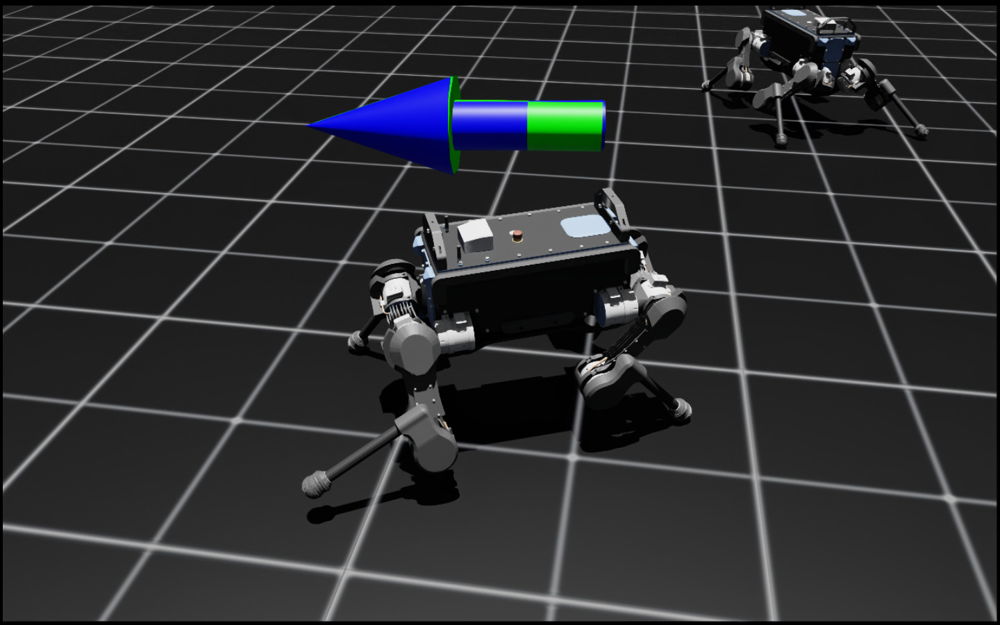               | [Isaac-Velocity-Flat-Anymal-B-v0](https://github.com/isaac-sim/IsaacLab/blob/main/source/isaaclab_tasks/isaaclab_tasks/manager_based/locomotion/velocity/config/anymal_b/flat_env_cfg.py)                                                                                                                                                                            | Anymal B 로봇을 사용하여 평탄한 지형에서 속도 명령 추적                      |
| 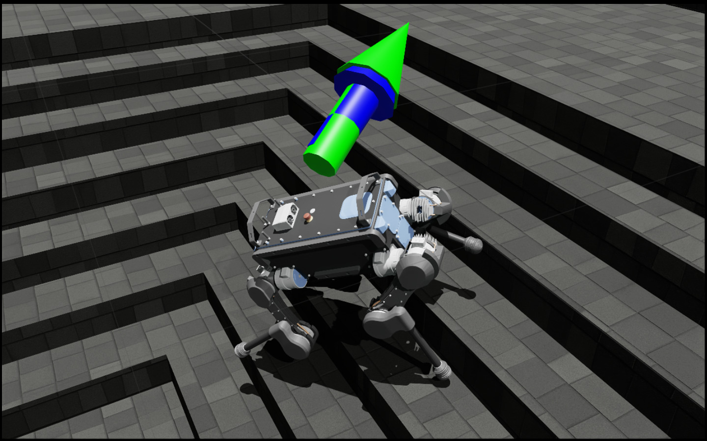             | [Isaac-Velocity-Rough-Anymal-B-v0](https://github.com/isaac-sim/IsaacLab/blob/main/source/isaaclab_tasks/isaaclab_tasks/manager_based/locomotion/velocity/config/anymal_b/rough_env_cfg.py)                                                                                                                                                                          | Anymal B 로봇을 사용하여 거친 지형에서 속도 명령 추적                        |
| 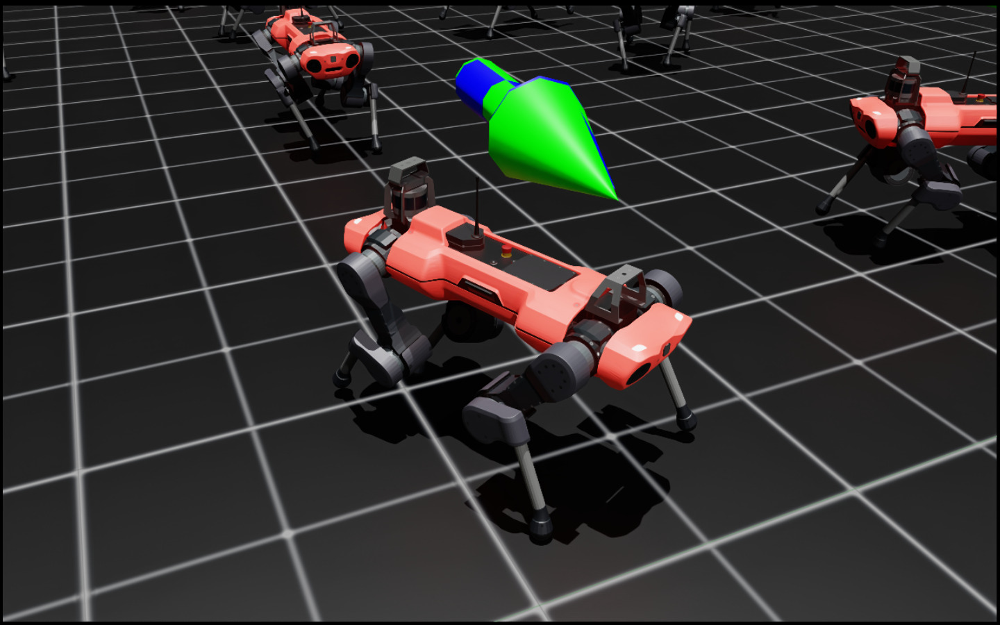               | [Isaac-Velocity-Flat-Anymal-C-v0](https://github.com/isaac-sim/IsaacLab/blob/main/source/isaaclab_tasks/isaaclab_tasks/manager_based/locomotion/velocity/config/anymal_c/flat_env_cfg.py)<br/><br/>[Isaac-Velocity-Flat-Anymal-C-Direct-v0](https://github.com/isaac-sim/IsaacLab/blob/main/source/isaaclab_tasks/isaaclab_tasks/direct/anymal_c/anymal_c_env.py)    | Anymal C 로봇을 사용하여 평탄한 지형에서 속도 명령 추적                      |
| 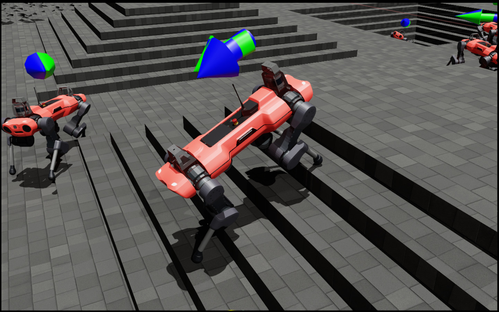             | [Isaac-Velocity-Rough-Anymal-C-v0](https://github.com/isaac-sim/IsaacLab/blob/main/source/isaaclab_tasks/isaaclab_tasks/manager_based/locomotion/velocity/config/anymal_c/rough_env_cfg.py)<br/><br/>[Isaac-Velocity-Rough-Anymal-C-Direct-v0](https://github.com/isaac-sim/IsaacLab/blob/main/source/isaaclab_tasks/isaaclab_tasks/direct/anymal_c/anymal_c_env.py) | Anymal C 로봇을 사용하여 거친 지형에서 속도 명령 추적                        |
| 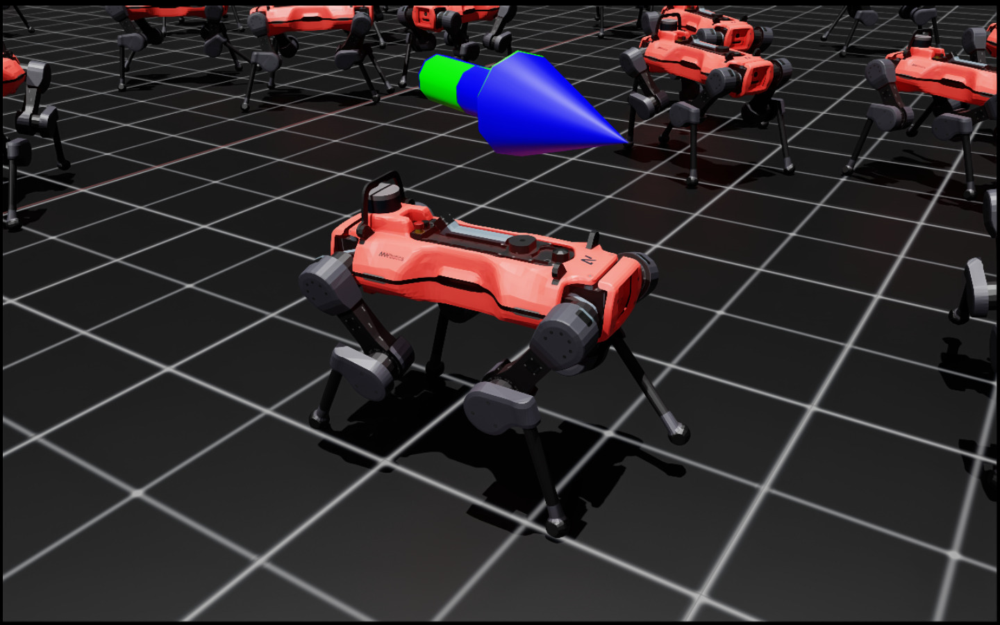               | [Isaac-Velocity-Flat-Anymal-D-v0](https://github.com/isaac-sim/IsaacLab/blob/main/source/isaaclab_tasks/isaaclab_tasks/manager_based/locomotion/velocity/config/anymal_d/flat_env_cfg.py)                                                                                                                                                                            | Anymal D 로봇을 사용하여 평탄한 지형에서 속도 명령 추적                      |
| 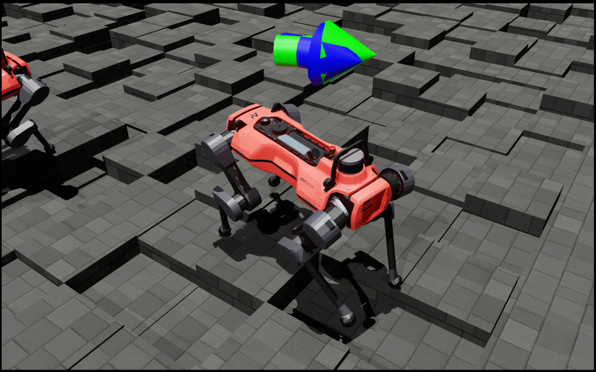             | [Isaac-Velocity-Rough-Anymal-D-v0](https://github.com/isaac-sim/IsaacLab/blob/main/source/isaaclab_tasks/isaaclab_tasks/manager_based/locomotion/velocity/config/anymal_d/rough_env_cfg.py)                                                                                                                                                                          | Anymal D 로봇을 사용하여 거친 지형에서 속도 명령 추적                        |
| 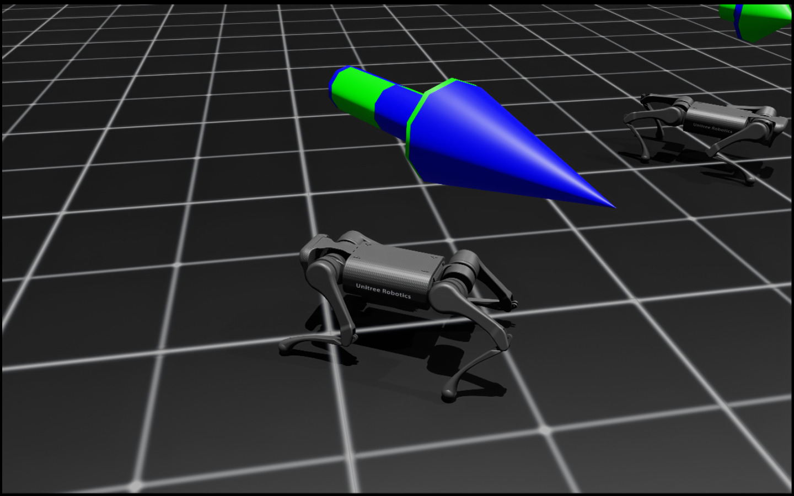                   | [Isaac-Velocity-Flat-Unitree-A1-v0](https://github.com/isaac-sim/IsaacLab/blob/main/source/isaaclab_tasks/isaaclab_tasks/manager_based/locomotion/velocity/config/a1/flat_env_cfg.py)                                                                                                                                                                                | Unitree A1 로봇을 사용하여 평탄한 지형에서 속도 명령 추적                    |
| 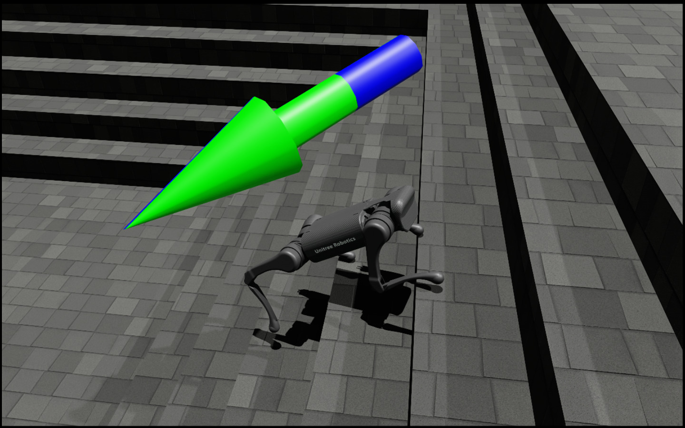                 | [Isaac-Velocity-Rough-Unitree-A1-v0](https://github.com/isaac-sim/IsaacLab/blob/main/source/isaaclab_tasks/isaaclab_tasks/manager_based/locomotion/velocity/config/a1/rough_env_cfg.py)                                                                                                                                                                              | Unitree A1 로봇을 사용하여 거친 지형에서 속도 명령 추적                      |
| 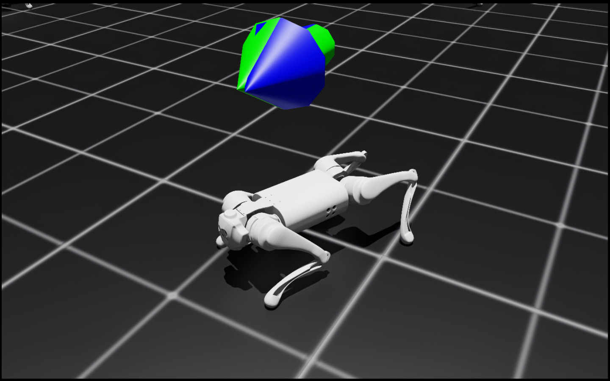                 | [Isaac-Velocity-Flat-Unitree-Go1-v0](https://github.com/isaac-sim/IsaacLab/blob/main/source/isaaclab_tasks/isaaclab_tasks/manager_based/locomotion/velocity/config/go1/flat_env_cfg.py)                                                                                                                                                                              | Unitree Go1 로봇을 사용하여 평탄한 지형에서 속도 명령 추적                   |
| 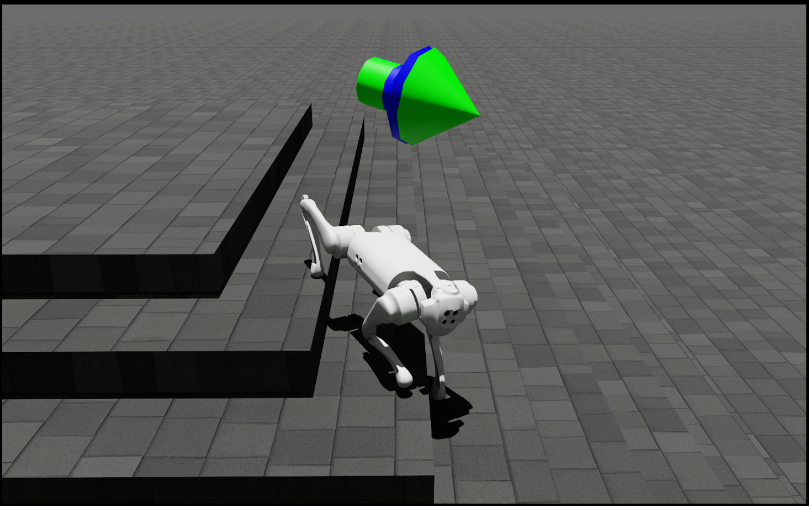               | [Isaac-Velocity-Rough-Unitree-Go1-v0](https://github.com/isaac-sim/IsaacLab/blob/main/source/isaaclab_tasks/isaaclab_tasks/manager_based/locomotion/velocity/config/go1/rough_env_cfg.py)                                                                                                                                                                            | Unitree Go1 로봇을 사용하여 거친 지형에서 속도 명령 추적                     |
| 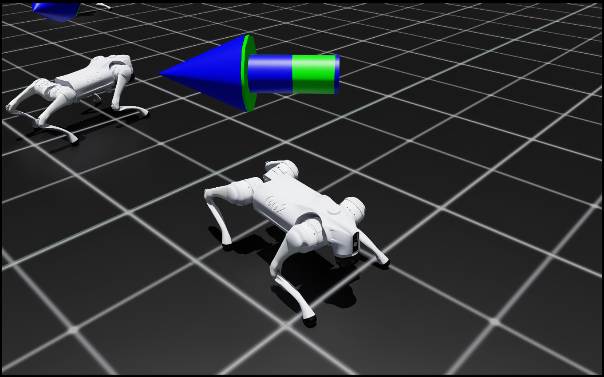                 | [Isaac-Velocity-Flat-Unitree-Go2-v0](https://github.com/isaac-sim/IsaacLab/blob/main/source/isaaclab_tasks/isaaclab_tasks/manager_based/locomotion/velocity/config/go2/flat_env_cfg.py)                                                                                                                                                                              | 평평한 지형에서 Unitree Go2 로봇으로 속도 명령 추적          |
| 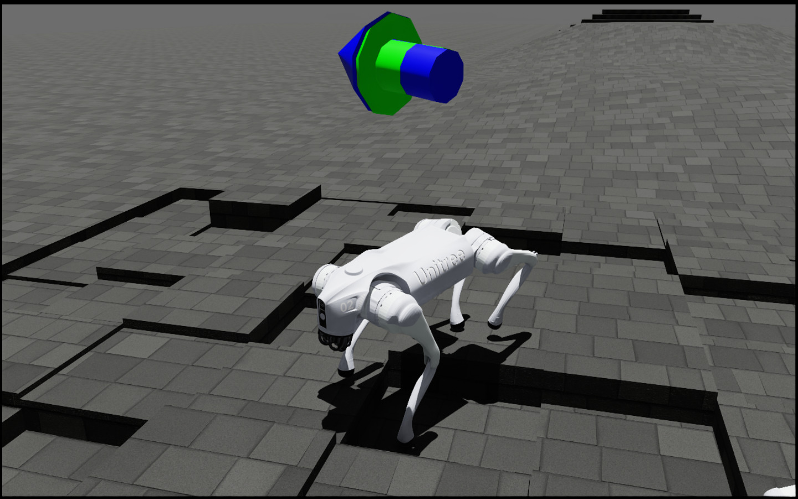               | [Isaac-Velocity-Rough-Unitree-Go2-v0](https://github.com/isaac-sim/IsaacLab/blob/main/source/isaaclab_tasks/isaaclab_tasks/manager_based/locomotion/velocity/config/go2/rough_env_cfg.py)                                                                                                                                                                            | 거친 지형에서 Unitree Go2 로봇으로 속도 명령 추적         |
| 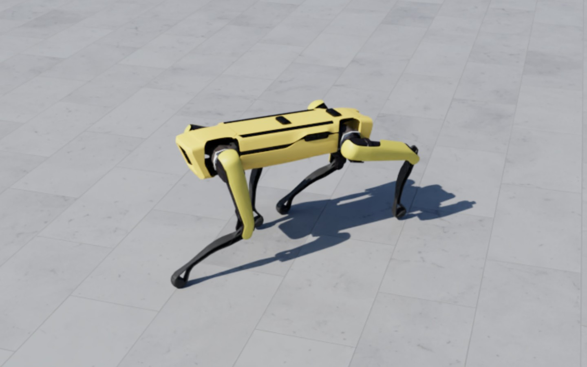                       | [Isaac-Velocity-Flat-Spot-v0](https://github.com/isaac-sim/IsaacLab/blob/main/source/isaaclab_tasks/isaaclab_tasks/manager_based/locomotion/velocity/config/spot/flat_env_cfg.py)                                                                                                                                                                                    | 평평한 지형에서 Boston Dynamics Spot 로봇으로 속도 명령 추적 |
| 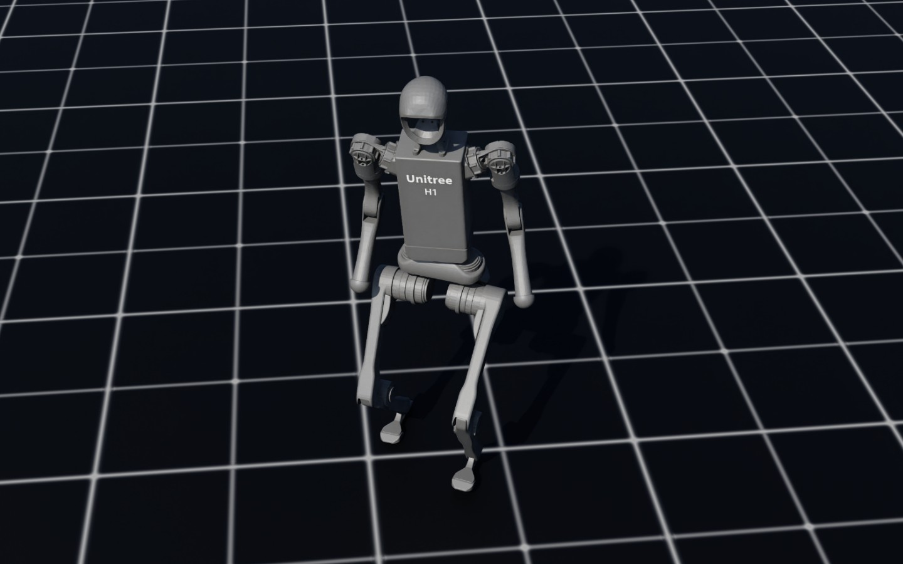                           | [Isaac-Velocity-Flat-H1-v0](https://github.com/isaac-sim/IsaacLab/blob/main/source/isaaclab_tasks/isaaclab_tasks/manager_based/locomotion/velocity/config/h1/flat_env_cfg.py)                                                                                                                                                                                        | 평평한 지형에서 Unitree H1 로봇으로 속도 명령 추적           |
| 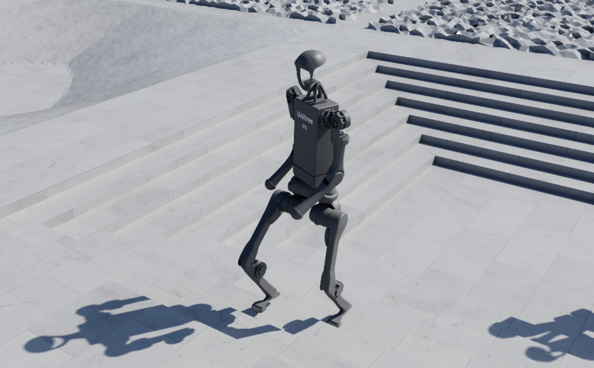                         | [Isaac-Velocity-Rough-H1-v0](https://github.com/isaac-sim/IsaacLab/blob/main/source/isaaclab_tasks/isaaclab_tasks/manager_based/locomotion/velocity/config/h1/rough_env_cfg.py)                                                                                                                                                                                      | 거친 지형에서 Unitree H1 로봇으로 속도 명령 추적          |
| 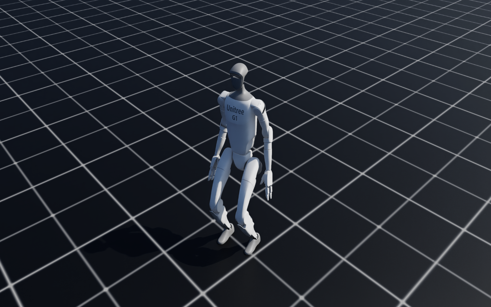                           | [Isaac-Velocity-Flat-G1-v0](https://github.com/isaac-sim/IsaacLab/blob/main/source/isaaclab_tasks/isaaclab_tasks/manager_based/locomotion/velocity/config/g1/flat_env_cfg.py)                                                                                                                                                                                        | 평평한 지형에서 Unitree G1 로봇으로 속도 명령 추적           |
|                          | [Isaac-Velocity-Rough-G1-v0](https://github.com/isaac-sim/IsaacLab/blob/main/source/isaaclab_tasks/isaaclab_tasks/manager_based/locomotion/velocity/config/g1/rough_env_cfg.py)                                                                                                                                                                                      | 거친 지형에서 Unitree G1 로봇으로 속도 명령 추적          |
| 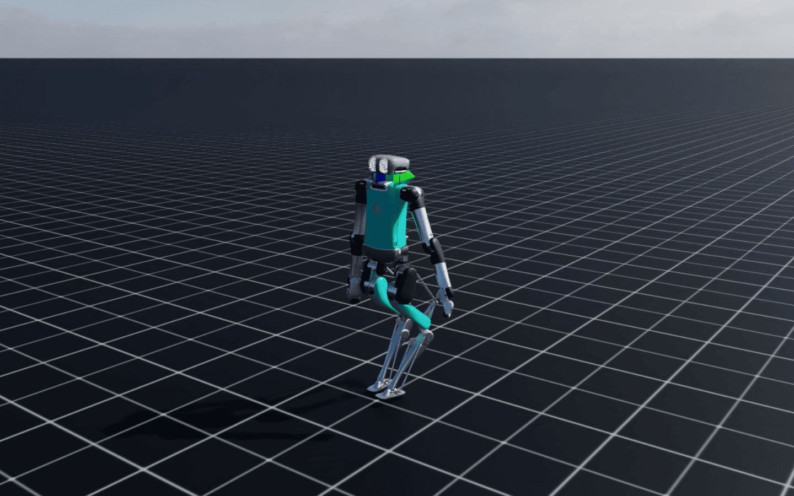             | [Isaac-Velocity-Flat-Digit-v0](https://github.com/isaac-sim/IsaacLab/blob/main/source/isaaclab_tasks/isaaclab_tasks/manager_based/locomotion/velocity/config/digit/flat_env_cfg.py)                                                                                                                                                                                  | 평평한 지형에서 Agility Digit 로봇으로 속도 명령 추적        |
| 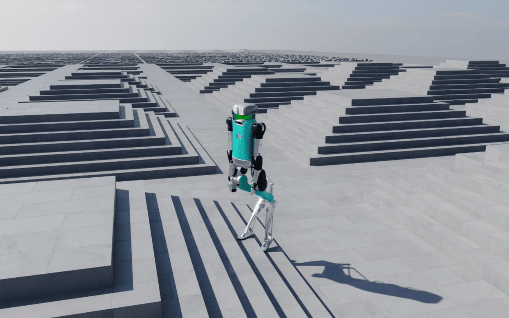           | [Isaac-Velocity-Rough-Digit-v0](https://github.com/isaac-sim/IsaacLab/blob/main/source/isaaclab_tasks/isaaclab_tasks/manager_based/locomotion/velocity/config/digit/rough_env_cfg.py)                                                                                                                                                                                | 거친 지형에서 Agility Digit 로봇으로 속도 명령 추적       |
| 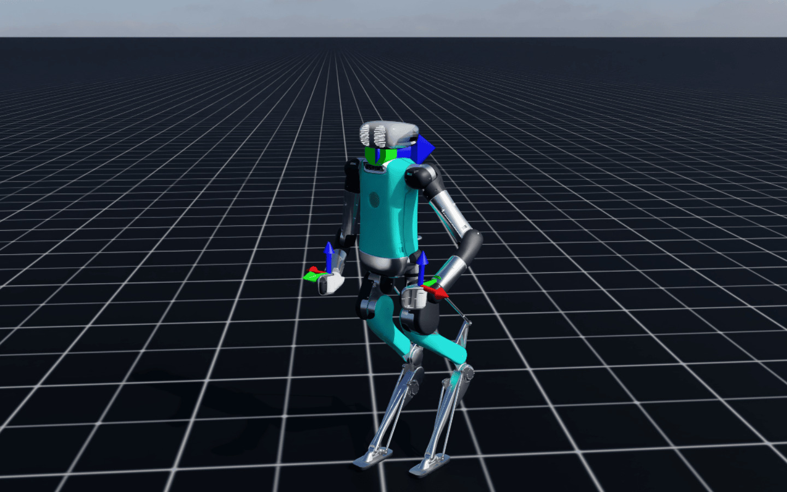 | [Isaac-Tracking-LocoManip-Digit-v0](https://github.com/isaac-sim/IsaacLab/blob/main/source/isaaclab_tasks/isaaclab_tasks/manager_based/locomanipulation/tracking/config/digit/loco_manip_env_cfg.py)                                                                                                                                                                 | Agility Digit 로봇으로 루트 속도 및 손 포즈 명령 추적     |

### 내비게이션

| World                                                             | Environment ID                                                                                                                                                                           | Description                                                                 |
|-------------------------------------------------------------------|------------------------------------------------------------------------------------------------------------------------------------------------------------------------------------------|-----------------------------------------------------------------------------|
| 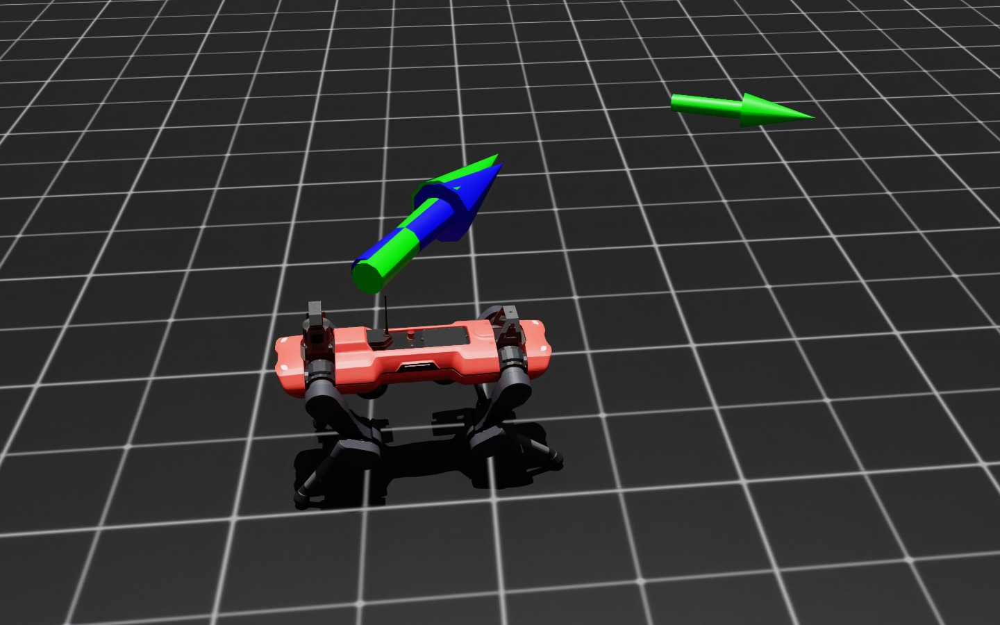 | [Isaac-Navigation-Flat-Anymal-C-v0](https://github.com/isaac-sim/IsaacLab/blob/main/source/isaaclab_tasks/isaaclab_tasks/manager_based/navigation/config/anymal_c/navigation_env_cfg.py) | ANYmal C 로봇으로 목표 x-y 위치 및 방위를 향해 내비게이션. |

### 멀티로터

#### NOTE
멀티로터 항목은 ARL 로봇을 비행하기 위한 환경 구성을 제공합니다.
자세한 내용은 드론_arl 폴더 및 코드베이스의 ARL 로봇 구성
(ARL_ROBOT_1_CFG)을 참조하십시오.

| World                                                                                                              | Environment ID                                                                                                                                                                                                                                    | Description                                                                            |
|--------------------------------------------------------------------------------------------------------------------|---------------------------------------------------------------------------------------------------------------------------------------------------------------------------------------------------------------------------------------------------|----------------------------------------------------------------------------------------|
| 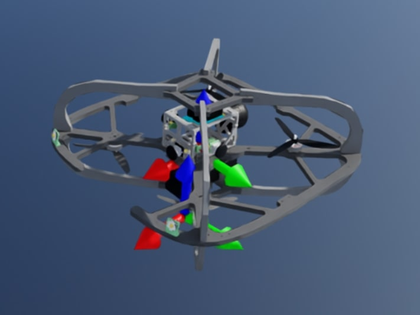 | [Isaac-TrackPositionNoObstacles-ARL-Robot-1-v0](https://github.com/isaac-sim/IsaacLab/blob/main/source/isaaclab_tasks/isaaclab_tasks/manager_based/drone_arl/track_position_state_based/config/arl_robot_1/track_position_state_based_env_cfg.py) | track_position_state_based 태스크를 사용하여 ARL 로봇에 대한 세트포지션 제어. |

### 기타

#### NOTE
적대적 동작 사전(AMP) 훈련은 skrl 라이브러리와만 사용할 수 있습니다. 현재 통합된 라이브러리 중에서 이를 기본적으로 지원하는 유일한 라이브러리이기 때문입니다(다른 라이브러리의 경우 알고리즘 및 아키텍처를 구현해야 함).
자세한 내용은 [skrl의 AMP 문서](https://skrl.readthedocs.io/en/latest/api/agents/amp.html)를 참조하십시오.
AMP 알고리즘은 훈련/재생 스크립트에 명령줄 입력 `--algorithm AMP`를 추가하여 활성화할 수 있습니다.

평가를 위해, 재생 스크립트의 명령줄 입력 `--real-time`은 가능한 경우 환경과 에이전트 간의 상호작용 루프를 실시간으로 실행할 수 있습니다.

| World                                                         | Environment ID                                                                                                                                                                                                                                                                                                                                                                                                                                                                                                                      | Description                                                                                                 |
|---------------------------------------------------------------|-------------------------------------------------------------------------------------------------------------------------------------------------------------------------------------------------------------------------------------------------------------------------------------------------------------------------------------------------------------------------------------------------------------------------------------------------------------------------------------------------------------------------------------|-------------------------------------------------------------------------------------------------------------|
| 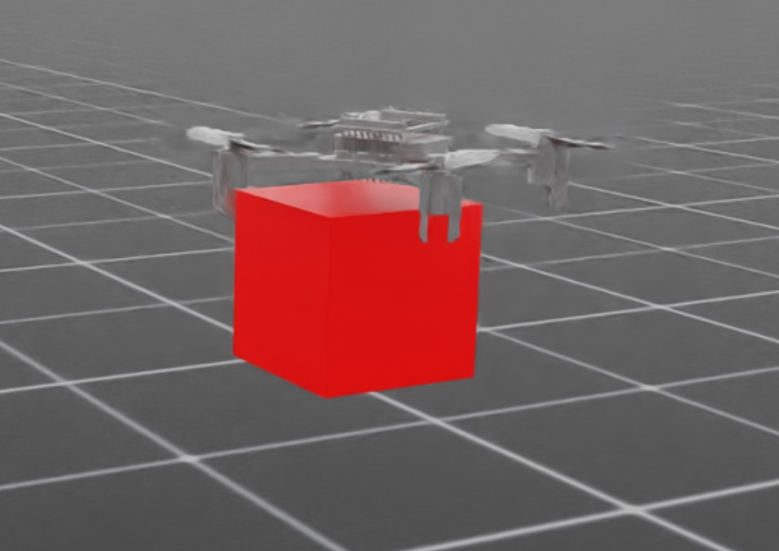     | [Isaac-Quadcopter-Direct-v0](https://github.com/isaac-sim/IsaacLab/blob/main/source/isaaclab_tasks/isaaclab_tasks/direct/quadcopter/quadcopter_env.py)                                                                                                                                                                                                                                                                                                                                                                              | 추력을 적용하여 Crazyflie 쿼드콥터를 목표 지점으로 비행 및 호버링합니다.                                      |
| 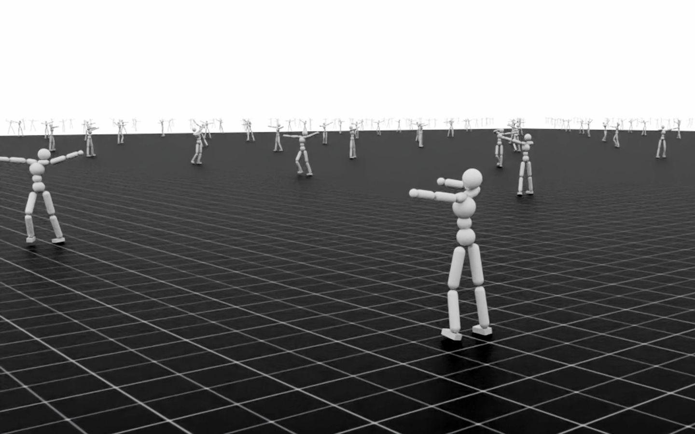 | [Isaac-Humanoid-AMP-Dance-Direct-v0](https://github.com/isaac-sim/IsaacLab/blob/main/source/isaaclab_tasks/isaaclab_tasks/direct/humanoid_amp/humanoid_amp_env_cfg.py)<br/><br/>[Isaac-Humanoid-AMP-Run-Direct-v0](https://github.com/isaac-sim/IsaacLab/blob/main/source/isaaclab_tasks/isaaclab_tasks/direct/humanoid_amp/humanoid_amp_env_cfg.py)<br/><br/>[Isaac-Humanoid-AMP-Walk-Direct-v0](https://github.com/isaac-sim/IsaacLab/blob/main/source/isaaclab_tasks/isaaclab_tasks/direct/humanoid_amp/humanoid_amp_env_cfg.py) | 사전 기록된 인간 애니메이션을 모방하여 인간형 로봇을 이동시킵니다<br/>(Adversarial Motion Priors). |

### Spaces showcase

The [cartpole_showcase](https://github.com/isaac-sim/IsaacLab/tree/main/source/isaaclab_tasks/isaaclab_tasks/direct/cartpole_showcase) folder contains showcase tasks (based on the *Cartpole* and *Cartpole-Camera* Direct tasks)
for the definition/use of the various Gymnasium observation and action spaces supported in Isaac Lab.

#### NOTE
현재, Isaac Lab의 Direct 워크플로우만 `Box` 이외의 관측 및 행동 공간 정의를 지원합니다.
Direct 워크플로우의 [`observation_space`](../api/lab/isaaclab.envs.md#isaaclab.envs.DirectRLEnvCfg.observation_space) / [`action_space`](../api/lab/isaaclab.envs.md#isaaclab.envs.DirectRLEnvCfg.action_space)
문서를 참조하여 더 많은 세부 정보를 확인하세요.

다음 테이블은 *Cartpole* 및 *Cartpole-Camera* 작업에 대한 다양한 관측 및 행동 공간 쌍의 요약을 보여줍니다.
`<OBSERVATION>`과 `<ACTION>`을 작업 이름에서 훈련 및 평가에 탐색하려는 관측 및 행동 공간으로 대체하세요.

<table class="showcase-table">
<caption>
  <p>Cartpole 작업의 쇼케이스 공간</p>
  <p><code>Isaac-Cartpole-Showcase-&lt;OBSERVATION&gt;-&lt;ACTION&gt;-Direct-v0</code></p>
</caption>
<tbody>
  <tr>
    <td colspan="2" rowspan="2"></td>
    <td colspan="5" class="center">행동 공간</td>
  </tr>
  <tr>
    <td><strong>&nbsp;Box</strong></td>
    <td><strong>&nbsp;Discrete</strong></td>
    <td><strong>&nbsp;MultiDiscrete</strong></td>
  </tr>
  <tr>
    <td rowspan="5" class="rot90 center"><p>관측</p><p>공간</p></td>
    <td><strong>&nbsp;Box</strong></td>
    <td class="center">x</td>
    <td class="center">x</td>
    <td class="center">x</td>
  </tr>
  <tr>
    <td><strong>&nbsp;Discrete</strong></td>
    <td class="center">x</td>
    <td class="center">x</td>
    <td class="center">x</td>
  </tr>
  <tr>
    <td><strong>&nbsp;MultiDiscrete</strong></td>
    <td class="center">x</td>
    <td class="center">x</td>
    <td class="center">x</td>
  </tr>
  <tr>
    <td><strong>&nbsp;Dict</strong></td>
    <td class="center">x</td>
    <td class="center">x</td>
    <td class="center">x</td>
  </tr>
  <tr>
    <td><strong>&nbsp;Tuple</strong></td>
    <td class="center">x</td>
    <td class="center">x</td>
    <td class="center">x</td>
  </tr>
</tbody>
</table>
<br>
<table class="showcase-table">
<caption>
    <p>Cartpole-Camera 작업의 쇼케이스 공간</p>
    <p><code>Isaac-Cartpole-Camera-Showcase-&lt;OBSERVATION&gt;-&lt;ACTION&gt;-Direct-v0</code></p>
</caption>
<tbody>
  <tr>
    <td colspan="2" rowspan="2"></td>
    <td colspan="5" class="center">행동 공간</td>
  </tr>
  <tr>
    <td><strong>&nbsp;Box</strong></td>
    <td><strong>&nbsp;Discrete</strong></td>
    <td><strong>&nbsp;MultiDiscrete</strong></td>
  </tr>
  <tr>
    <td rowspan="5" class="rot90 center"><p>관측</p><p>공간</p></td>
    <td><strong>&nbsp;Box</strong></td>
    <td class="center">x</td>
    <td class="center">x</td>
    <td class="center">x</td>
  </tr>
  <tr>
    <td><strong>&nbsp;Discrete</strong></td>
    <td class="center">-</td>
    <td class="center">-</td>
    <td class="center">-</td>
  </tr>
  <tr>
    <td><strong>&nbsp;MultiDiscrete</strong></td>
    <td class="center">-</td>
    <td class="center">-</td>
    <td class="center">-</td>
  </tr>
  <tr>
    <td><strong>&nbsp;Dict</strong></td>
    <td class="center">x</td>
    <td class="center">x</td>
    <td class="center">x</td>
  </tr>
  <tr>
    <td><strong>&nbsp;Tuple</strong></td>
    <td class="center">x</td>
    <td class="center">x</td>
    <td class="center">x</td>
  </tr>
</tbody></table>

## 멀티 에이전트

#### NOTE
진정한 멀티 에이전트 훈련은 skrl 라이브러리와 함께만 사용할 수 있습니다. 자세한 내용은 [멀티 에이전트 문서](https://skrl.readthedocs.io/en/latest/api/multi_agents.html)를 참조하세요.
IPPO 및 MAPPO 알고리즘을 지원하며, 훈련/재생 스크립트에 명령줄 입력 `--algorithm IPPO` 또는 `--algorithm MAPPO`를 추가하여 활성화할 수 있습니다.
다른 라이브러리와 함께 실행하거나 IPPO 또는 MAPPO 플래그 없이 실행하면, 이러한 환경은 내부적으로 싱글 에이전트 환경으로 변환됩니다.

### 클래식

| World                                                                          | Environment ID                                                                                                                                                                       | 설명                                                                                                           |
|--------------------------------------------------------------------------------|--------------------------------------------------------------------------------------------------------------------------------------------------------------------------------------|-----------------------------------------------------------------------------------------------------------------------|
| 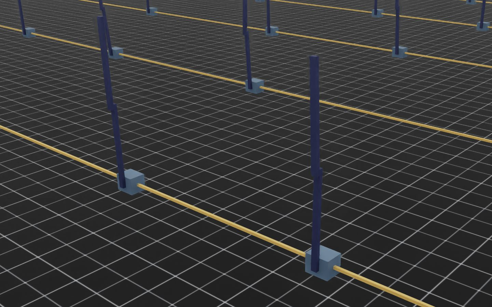 | [Isaac-Cart-Double-Pendulum-Direct-v0](https://github.com/isaac-sim/IsaacLab/blob/main/source/isaaclab_tasks/isaaclab_tasks/direct/cart_double_pendulum/cart_double_pendulum_env.py) | 카트를 이동하여 마지막 pendulum이 위쪽으로 향하도록 고전적인 카트 위의 뒤집힌 이중 pendulum 제어를 유지합니다. |

### 조작

고정-arm 조작 작업을 기반으로 한 환경입니다.

| World                                                                       | Environment ID                                                                                                                                                           | 설명                                            |
|-----------------------------------------------------------------------------|--------------------------------------------------------------------------------------------------------------------------------------------------------------------------|--------------------------------------------------------|
| 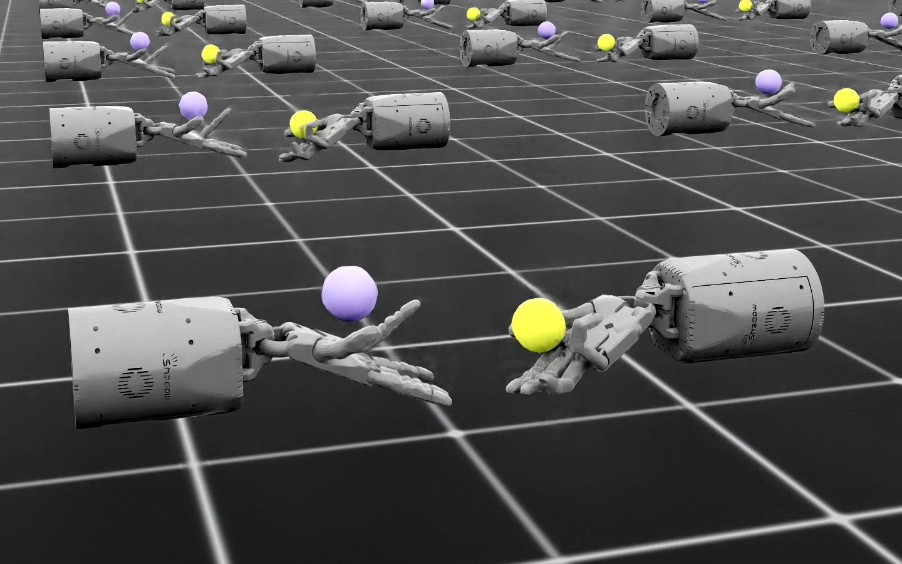 | [Isaac-Shadow-Hand-Over-Direct-v0](https://github.com/isaac-sim/IsaacLab/blob/main/source/isaaclab_tasks/isaaclab_tasks/direct/shadow_hand_over/shadow_hand_over_env.py) | 한 손에서 다른 손으로 물체를 전달합니다. |

<br/>

# 환경 포괄적 목록

`Inference Task Name`에 다른 작업 이름이 나열된 환경의 경우, `play.py` 실행 또는 추론 워크플로우 시 제공된 **추론 작업 이름**을 사용하세요.
이러한 작업은 훈련된 체크포인트에서 읽기 및 훈련에 사용되는 런타임 perturbation 비활성화를 포함한 추론에 적합한 구성을 제공합니다.

| **작업 이름**                                                                                           | **추론 작업 이름**                                                                   | **워크플로우**   | **RL 라이브러리**                                                      |
|---------------------------------------------------------------------------------------------------------|-------------------------------------------------------------------------------------------|----------------|---------------------------------------------------------------------|
| Isaac-Ant-Direct-v0                                                                                     |                                                                                           | Direct         | **rl_games** (PPO), **rsl_rl** (PPO), **skrl** (PPO)                |
| Isaac-Ant-v0                                                                                            |                                                                                           | Manager Based  | **rsl_rl** (PPO), **rl_games** (PPO), **skrl** (PPO), **sb3** (PPO) |
| Isaac-Cart-Double-Pendulum-Direct-v0                                                                    |                                                                                           | Direct         | **rl_games** (PPO), **skrl** (IPPO, PPO, MAPPO)                     |
| Isaac-Cartpole-Camera-Showcase-Box-Box-Direct-v0 (카메라 사용 시 `--enable_cameras` 플래그 필요) |                                                                                           | Direct         | **skrl** (PPO)                                                      |
| Isaac-Cartpole-Camera-Showcase-Box-Discrete-Direct-v0 (`--enable_cameras`로 실행해야 함)        |                                                                                           | Direct         | **skrl** (PPO)                                                      |
| Isaac-Cartpole-Camera-Showcase-Box-MultiDiscrete-Direct-v0 (`--enable_cameras`로 실행해야 함)   |                                                                                           | Direct         | **skrl** (PPO)                                                      |
| Isaac-Cartpole-Camera-Showcase-Dict-Box-Direct-v0 (`--enable_cameras`로 실행해야 함)            |                                                                                           | Direct         | **skrl** (PPO)                                                      |
| Isaac-Cartpole-Camera-Showcase-Dict-Discrete-Direct-v0 (`--enable_cameras`로 실행해야 함)       |                                                                                           | Direct         | **skrl** (PPO)                                                      |
| Isaac-Cartpole-Camera-Showcase-Dict-MultiDiscrete-Direct-v0 (`--enable_cameras`로 실행해야 함)  |                                                                                           | Direct         | **skrl** (PPO)                                                      |
| Isaac-Cartpole-Camera-Showcase-Tuple-Box-Direct-v0 (`--enable_cameras`로 실행해야 함)           |                                                                                           | Direct         | **skrl** (PPO)                                                      |
| Isaac-Cartpole-Camera-Showcase-Tuple-Discrete-Direct-v0 (`--enable_cameras`로 실행해야 함)      |                                                                                           | Direct         | **skrl** (PPO)                                                      |
| Isaac-Cartpole-Camera-Showcase-Tuple-MultiDiscrete-Direct-v0 (`--enable_cameras`로 실행해야 함) |                                                                                           | Direct         | **skrl** (PPO)                                                      |
| Isaac-Cartpole-Depth-Camera-Direct-v0 (`--enable_cameras`로 실행해야 함)                        |                                                                                           | Direct         | **rl_games** (PPO), **skrl** (PPO)                                  |
| Isaac-Cartpole-Depth-v0 (`--enable_cameras`로 실행해야 함)                                      |                                                                                           | Manager Based  | **rl_games** (PPO)                                                  |
| Isaac-Cartpole-Direct-v0                                                                                |                                                                                           | Direct         | **rl_games** (PPO), **rsl_rl** (PPO), **skrl** (PPO), **sb3** (PPO) |
| Isaac-Cartpole-RGB-Camera-Direct-v0 (`--enable_cameras`로 실행해야 함)                          |                                                                                           | Direct         | **rl_games** (PPO), **skrl** (PPO)                                  |
| Isaac-Cartpole-RGB-ResNet18-v0 (`--enable_cameras`로 실행해야 함)                               |                                                                                           | Manager Based  | **rl_games** (PPO)                                                  |
| Isaac-Cartpole-RGB-TheiaTiny-v0 (`--enable_cameras`로 실행해야 함)                              |                                                                                           | Manager Based  | **rl_games** (PPO)                                                  |
| Isaac-Cartpole-RGB-v0 (`--enable_cameras`로 실행해야 함)                                        |                                                                                           | Manager Based  | **rl_games** (PPO)                                                  |
| Isaac-Cartpole-Showcase-Box-Box-Direct-v0                                                               |                                                                                           | Direct         | **skrl** (PPO)                                                      |
| Isaac-Cartpole-Showcase-Box-Discrete-Direct-v0                                                          |                                                                                           | Direct         | **skrl** (PPO)                                                      |
| Isaac-Cartpole-Showcase-Box-MultiDiscrete-Direct-v0                                                     |                                                                                           | Direct         | **skrl** (PPO)                                                      |
| Isaac-Cartpole-Showcase-Dict-Box-Direct-v0                                                              |                                                                                           | Direct         | **skrl** (PPO)                                                      |
| Isaac-Cartpole-Showcase-Dict-Discrete-Direct-v0                                                         |                                                                                           | Direct         | **skrl** (PPO)                                                      |
| Isaac-Cartpole-Showcase-Dict-MultiDiscrete-Direct-v0                                                    |                                                                                           | Direct         | **skrl** (PPO)                                                      |
| Isaac-Cartpole-Showcase-Discrete-Box-Direct-v0                                                          |                                                                                           | Direct         | **skrl** (PPO)                                                      |
| Isaac-Cartpole-Showcase-Discrete-Discrete-Direct-v0                                                     |                                                                                           | Direct         | **skrl** (PPO)                                                      |
| Isaac-Cartpole-Showcase-Discrete-MultiDiscrete-Direct-v0                                                |                                                                                           | Direct         | **skrl** (PPO)                                                      |
| Isaac-Cartpole-Showcase-MultiDiscrete-Box-Direct-v0                                                     |                                                                                           | Direct         | **skrl** (PPO)                                                      |
| Isaac-Cartpole-Showcase-MultiDiscrete-Discrete-Direct-v0                                                |                                                                                           | Direct         | **skrl** (PPO)                                                      |
| Isaac-Cartpole-Showcase-MultiDiscrete-MultiDiscrete-Direct-v0                                           |                                                                                           | Direct         | **skrl** (PPO)                                                      |
| Isaac-Cartpole-Showcase-Tuple-Box-Direct-v0                                                             |                                                                                           | Direct         | **skrl** (PPO)                                                      |
| Isaac-Cartpole-Showcase-Tuple-Discrete-Direct-v0                                                        |                                                                                           | Direct         | **skrl** (PPO)                                                      |
| Isaac-Cartpole-Showcase-Tuple-MultiDiscrete-Direct-v0                                                   |                                                                                           | Direct         | **skrl** (PPO)                                                      |
| Isaac-Cartpole-v0                                                                                       |                                                                                           | Manager Based  | **rl_games** (PPO), **rsl_rl** (PPO), **skrl** (PPO), **sb3** (PPO) |
| Isaac-Factory-GearMesh-Direct-v0                                                                        |                                                                                           | Direct         | **rl_games** (PPO)                                                  |
| Isaac-Factory-NutThread-Direct-v0                                                                       |                                                                                           | Direct         | **rl_games** (PPO)                                                  |
| Isaac-Factory-PegInsert-Direct-v0                                                                       |                                                                                           | Direct         | **rl_games** (PPO)                                                  |
| Isaac-AutoMate-Assembly-Direct-v0                                                                       |                                                                                           | 직접      | **rl_games** (PPO)                                                  |
| Isaac-AutoMate-Disassembly-Direct-v0                                                                    |                                                                                           | 직접      |                                                                     |
| Isaac-Forge-GearMesh-Direct-v0                                                                          |                                                                                           | 직접      | **rl_games** (PPO)                                                  |
| Isaac-Forge-NutThread-Direct-v0                                                                         |                                                                                           | 직접      | **rl_games** (PPO)                                                  |
| Isaac-Forge-PegInsert-Direct-v0                                                                         |                                                                                           | 직접      | **rl_games** (PPO)                                                  |
| Isaac-Franka-Cabinet-Direct-v0                                                                          |                                                                                           | 직접      | **rl_games** (PPO), **rsl_rl** (PPO), **skrl** (PPO)                |
| Isaac-Humanoid-AMP-Dance-Direct-v0                                                                      |                                                                                           | 직접      | **skrl** (AMP)                                                      |
| Isaac-Humanoid-AMP-Run-Direct-v0                                                                        |                                                                                           | 직접      | **skrl** (AMP)                                                      |
| Isaac-Humanoid-AMP-Walk-Direct-v0                                                                       |                                                                                           | 직접      | **skrl** (AMP)                                                      |
| Isaac-Humanoid-Direct-v0                                                                                |                                                                                           | 직접      | **rl_games** (PPO), **rsl_rl** (PPO), **skrl** (PPO)                |
| Isaac-Humanoid-v0                                                                                       |                                                                                           | 관리자 기반 | **rsl_rl** (PPO), **rl_games** (PPO), **skrl** (PPO), **sb3** (PPO) |
| Isaac-Lift-Cube-Franka-IK-Abs-v0                                                                        |                                                                                           | 관리자 기반 |                                                                     |
| Isaac-Lift-Cube-Franka-IK-Rel-v0                                                                        |                                                                                           | 관리자 기반 |                                                                     |
| Isaac-Lift-Cube-Franka-v0                                                                               | Isaac-Lift-Cube-Franka-Play-v0                                                            | 관리자 기반 | **rsl_rl** (PPO), **skrl** (PPO), **rl_games** (PPO), **sb3** (PPO) |
| Isaac-Lift-Teddy-Bear-Franka-IK-Abs-v0                                                                  |                                                                                           | 관리자 기반 |                                                                     |
| Isaac-Tracking-LocoManip-Digit-v0                                                                       | Isaac-Tracking-LocoManip-Digit-Play-v0                                                    | 관리자 기반 | **rsl_rl** (PPO)                                                    |
| Isaac-Navigation-Flat-Anymal-C-v0                                                                       | Isaac-Navigation-Flat-Anymal-C-Play-v0                                                    | 관리자 기반 | **rsl_rl** (PPO), **skrl** (PPO)                                    |
| Isaac-Open-Drawer-Franka-IK-Abs-v0                                                                      |                                                                                           | 관리자 기반 |                                                                     |
| Isaac-Open-Drawer-Franka-IK-Rel-v0                                                                      |                                                                                           | 관리자 기반 |                                                                     |
| Isaac-Open-Drawer-Franka-v0                                                                             | Isaac-Open-Drawer-Franka-Play-v0                                                          | 관리자 기반 | **rsl_rl** (PPO), **rl_games** (PPO), **skrl** (PPO)                |
| Isaac-Quadcopter-Direct-v0                                                                              |                                                                                           | 직접      | **rl_games** (PPO), **rsl_rl** (PPO), **skrl** (PPO)                |
| Isaac-Reach-Franka-IK-Abs-v0                                                                            |                                                                                           | 관리자 기반 |                                                                     |
| Isaac-Reach-Franka-IK-Rel-v0                                                                            |                                                                                           | 관리자 기반 |                                                                     |
| Isaac-Reach-Franka-OSC-v0                                                                               | Isaac-Reach-Franka-OSC-Play-v0                                                            | 관리자 기반 | **rsl_rl** (PPO)                                                    |
| Isaac-Reach-Franka-v0                                                                                   | Isaac-Reach-Franka-Play-v0                                                                | 관리자 기반 | **rl_games** (PPO), **rsl_rl** (PPO), **skrl** (PPO)                |
| Isaac-Reach-UR10-v0                                                                                     | Isaac-Reach-UR10-Play-v0                                                                  | 관리자 기반 | **rl_games** (PPO), **rsl_rl** (PPO), **skrl** (PPO)                |
| Isaac-Deploy-Reach-UR10e-v0                                                                             | Isaac-Deploy-Reach-UR10e-Play-v0                                                          | 관리자 기반 | **rsl_rl** (PPO)                                                    |
| Isaac-Repose-Cube-Allegro-Direct-v0                                                                     |                                                                                           | 직접      | **rl_games** (PPO), **rsl_rl** (PPO), **skrl** (PPO)                |
| Isaac-Repose-Cube-Allegro-NoVelObs-v0                                                                   | Isaac-Repose-Cube-Allegro-NoVelObs-Play-v0                                                | 관리자 기반 | **rsl_rl** (PPO), **rl_games** (PPO), **skrl** (PPO)                |
| Isaac-Repose-Cube-Allegro-v0                                                                            | Isaac-Repose-Cube-Allegro-Play-v0                                                         | 관리자 기반 | **rsl_rl** (PPO), **rl_games** (PPO), **skrl** (PPO)                |
| Isaac-Repose-Cube-Shadow-Direct-v0                                                                      |                                                                                           | 직접      | **rl_games** (PPO), **rsl_rl** (PPO), **skrl** (PPO)                |
| Isaac-Repose-Cube-Shadow-OpenAI-FF-Direct-v0                                                            |                                                                                           | 직접      | **rl_games** (FF), **rsl_rl** (PPO), **skrl** (PPO)                 |
| Isaac-Repose-Cube-Shadow-OpenAI-LSTM-Direct-v0                                                          |                                                                                           | 직접      | **rl_games** (LSTM)                                                 |
| Isaac-Repose-Cube-Shadow-Vision-Direct-v0 (카메라 활성화를 위해 `--enable_cameras` 옵션으로 실행해야 함) | Isaac-Repose-Cube-Shadow-Vision-Direct-Play-v0 (카메라 활성화를 위해 `--enable_cameras` 옵션으로 실행해야 함) | 직접      | **rsl_rl** (PPO), **rl_games** (VISION)                             |
| Isaac-Shadow-Hand-Over-Direct-v0                                                                        |                                                                                           | Direct         | **rl_games** (PPO), **skrl** (IPPO, PPO, MAPPO)                     |
| Isaac-Stack-Cube-Franka-IK-Rel-v0                                                                       |                                                                                           | Manager Based  |                                                                     |
| Isaac-Dexsuite-Kuka-Allegro-Lift-v0                                                                     | Isaac-Dexsuite-Kuka-Allegro-Lift-Play-v0                                                  | Manager Based  | **rl_games** (PPO), **rsl_rl** (PPO)                                |
| Isaac-Dexsuite-Kuka-Allegro-Reorient-v0                                                                 | Isaac-Dexsuite-Kuka-Allegro-Reorient-Play-v0                                              | Manager Based  | **rl_games** (PPO), **rsl_rl** (PPO)                                |
| Isaac-Stack-Cube-Franka-v0                                                                              |                                                                                           | Manager Based  |                                                                     |
| Isaac-Stack-Cube-Instance-Randomize-Franka-IK-Rel-v0                                                    |                                                                                           | Manager Based  |                                                                     |
| Isaac-Stack-Cube-Instance-Randomize-Franka-v0                                                           |                                                                                           | Manager Based  |                                                                     |
| Isaac-PickPlace-G1-InspireFTP-Abs-v0                                                                    |                                                                                           | Manager Based  |                                                                     |
| Isaac-Stack-Cube-UR10-Long-Suction-IK-Rel-v0                                                            |                                                                                           | Manager Based  |                                                                     |
| Isaac-Stack-Cube-UR10-Short-Suction-IK-Rel-v0                                                           |                                                                                           | Manager Based  |                                                                     |
| Isaac-Stack-Cube-Galbot-Left-Arm-Gripper-RmpFlow-v0                                                     |                                                                                           | Manager Based  |                                                                     |
| Isaac-Stack-Cube-Galbot-Right-Arm-Suction-RmpFlow-v0                                                    |                                                                                           | Manager Based  |                                                                     |
| Isaac-Stack-Cube-Galbot-Left-Arm-Gripper-Visuomotor-v0                                                  | Isaac-Stack-Cube-Galbot-Left-Arm-Gripper-Visuomotor-Play-v0                               | Manager Based  |                                                                     |
| Isaac-Place-Mug-Agibot-Left-Arm-RmpFlow-v0                                                              |                                                                                           | Manager Based  |                                                                     |
| Isaac-Place-Toy2Box-Agibot-Right-Arm-RmpFlow-v0                                                         |                                                                                           | Manager Based  |                                                                     |
| Isaac-Stack-Cube-Galbot-Left-Arm-Gripper-RmpFlow-v0                                                     |                                                                                           | Manager Based  |                                                                     |
| Isaac-Stack-Cube-Galbot-Right-Arm-Suction-RmpFlow-v0                                                    |                                                                                           | Manager Based  |                                                                     |
| Isaac-Stack-Cube-Galbot-Left-Arm-Gripper-Visuomotor-v0                                                  | Isaac-Stack-Cube-Galbot-Left-Arm-Gripper-Visuomotor-Play-v0                               | Manager Based  |                                                                     |
| Isaac-Place-Mug-Agibot-Left-Arm-RmpFlow-v0                                                              |                                                                                           | Manager Based  |                                                                     |
| Isaac-Place-Toy2Box-Agibot-Right-Arm-RmpFlow-v0                                                         |                                                                                           | Manager Based  |                                                                     |
| Isaac-Velocity-Flat-Anymal-B-v0                                                                         | Isaac-Velocity-Flat-Anymal-B-Play-v0                                                      | Manager Based  | **rsl_rl** (PPO), **skrl** (PPO)                                    |
| Isaac-Velocity-Flat-Anymal-C-Direct-v0                                                                  |                                                                                           | Direct         | **rl_games** (PPO), **rsl_rl** (PPO), **skrl** (PPO)                |
| Isaac-Velocity-Flat-Anymal-C-v0                                                                         | Isaac-Velocity-Flat-Anymal-C-Play-v0                                                      | Manager Based  | **rsl_rl** (PPO), **rl_games** (PPO), **skrl** (PPO)                |
| Isaac-Velocity-Flat-Anymal-D-v0                                                                         | Isaac-Velocity-Flat-Anymal-D-Play-v0                                                      | Manager Based  | **rsl_rl** (PPO), **skrl** (PPO)                                    |
| Isaac-Velocity-Flat-Cassie-v0                                                                           | Isaac-Velocity-Flat-Cassie-Play-v0                                                        | Manager Based  | **rsl_rl** (PPO), **skrl** (PPO)                                    |
| Isaac-Velocity-Flat-Digit-v0                                                                            | Isaac-Velocity-Flat-Digit-Play-v0                                                         | Manager Based  | **rsl_rl** (PPO)                                                    |
| Isaac-Velocity-Flat-G1-v0                                                                               | Isaac-Velocity-Flat-G1-Play-v0                                                            | Manager Based  | **rsl_rl** (PPO), **skrl** (PPO)                                    |
| Isaac-Velocity-Flat-H1-v0                                                                               | Isaac-Velocity-Flat-H1-Play-v0                                                            | Manager Based  | **rsl_rl** (PPO), **skrl** (PPO)                                    |
| Isaac-Velocity-Flat-Spot-v0                                                                             | Isaac-Velocity-Flat-Spot-Play-v0                                                          | Manager Based  | **rsl_rl** (PPO), **skrl** (PPO)                                    |
| Isaac-Velocity-Flat-Unitree-A1-v0                                                                       | Isaac-Velocity-Flat-Unitree-A1-Play-v0                                                    | Manager Based  | **rsl_rl** (PPO), **skrl** (PPO), **sb3** (PPO)                     |
| Isaac-Velocity-Flat-Unitree-Go1-v0                                                                      | Isaac-Velocity-Flat-Unitree-Go1-Play-v0                                                   | Manager Based  | **rsl_rl** (PPO), **skrl** (PPO)                                    |
| Isaac-Velocity-Flat-Unitree-Go2-v0                                                                      | Isaac-Velocity-Flat-Unitree-Go2-Play-v0                                                   | Manager Based  | **rsl_rl** (PPO), **skrl** (PPO)                                    |
| Isaac-Velocity-Rough-Anymal-B-v0                                                                        | Isaac-Velocity-Rough-Anymal-B-Play-v0                                                     | Manager Based  | **rsl_rl** (PPO), **skrl** (PPO)                                    |
| Isaac-Velocity-Rough-Anymal-C-Direct-v0                                                                 |                                                                                           | Direct         | **rl_games** (PPO), **rsl_rl** (PPO), **skrl** (PPO)                |
| Isaac-Velocity-Rough-Anymal-C-v0                                                                        | Isaac-Velocity-Rough-Anymal-C-Play-v0                                                     | Manager Based  | **rl_games** (PPO), **rsl_rl** (PPO), **skrl** (PPO)                |
| Isaac-Velocity-Rough-Anymal-D-v0                                                                        | Isaac-Velocity-Rough-Anymal-D-Play-v0                                                     | Manager Based  | **rsl_rl** (PPO), **skrl** (PPO)                                    |
| Isaac-Velocity-Rough-Cassie-v0                                                                          | Isaac-Velocity-Rough-Cassie-Play-v0                                                       | Manager Based  | **rsl_rl** (PPO), **skrl** (PPO)                                    |
| Isaac-Velocity-Rough-Digit-v0                                                                           | Isaac-Velocity-Rough-Digit-Play-v0                                                        | Manager Based  | **rsl_rl** (PPO)                                                    |
| Isaac-Velocity-Rough-G1-v0                                                                              | Isaac-Velocity-Rough-G1-Play-v0                                                           | Manager Based  | **rsl_rl** (PPO), **skrl** (PPO)                                    |
| Isaac-Velocity-Rough-H1-v0                                                                              | Isaac-Velocity-Rough-H1-Play-v0                                                           | Manager Based  | **rsl_rl** (PPO), **skrl** (PPO)                                    |
| Isaac-Velocity-Rough-Unitree-A1-v0                                                                      | Isaac-Velocity-Rough-Unitree-A1-Play-v0                                                   | Manager Based  | **rsl_rl** (PPO), **skrl** (PPO), **sb3** (PPO)                     |
| Isaac-Velocity-Rough-Unitree-Go1-v0                                                                     | Isaac-Velocity-Rough-Unitree-Go1-Play-v0                                                  | Manager Based  | **rsl_rl** (PPO), **skrl** (PPO)                                    |
| Isaac-Velocity-Rough-Unitree-Go2-v0                                                                     | Isaac-Velocity-Rough-Unitree-Go2-Play-v0                                                  | Manager Based  | **rsl_rl** (PPO), **skrl** (PPO)                                    |
| Isaac-Reach-OpenArm-Bi-v0                                                                               | Isaac-Reach-OpenArm-Bi-Play-v0                                                            | Manager Based  | **rsl_rl** (PPO), **rl_games** (PPO)                                |
| Isaac-Reach-OpenArm-v0                                                                                  | Isaac-Reach-OpenArm-Play-v0                                                               | Manager Based  | **rsl_rl** (PPO), **skrl** (PPO), **rl_games** (PPO)                |
| Isaac-Lift-Cube-OpenArm-v0                                                                              | Isaac-Lift-Cube-OpenArm-Play-v0                                                           | Manager Based  | **rsl_rl** (PPO), **rl_games** (PPO)                                |
| Isaac-Open-Drawer-OpenArm-v0                                                                            | Isaac-Open-Drawer-OpenArm-Play-v0                                                         | Manager Based  | **rsl_rl** (PPO), **rl_games** (PPO)                                |
