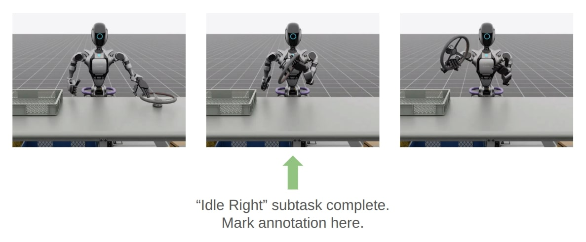

<a id="teleoperation-imitation-learning"></a>

# 텔레operation 및 Isaac Lab Mimic을 통한 모방 학습

## 텔레operation

우리는 로봇 제어를 위해 SE(2) 및 SE(3) 공간에서 명령을 제공하는 인터페이스를 제공합니다. SE(2) 텔레operation의 경우 반환된 명령은 선형 x-y 속도와 요율이며, SE(3)의 경우 반환된 명령은 포즈 변화를 나타내는 6-D 벡터입니다.

#### NOTE
현재 Isaac Lab Mimic은 Linux에서만 지원됩니다.

키보드 장치를 사용한 역 운동학(IK) 제어를 재생하려면:

```bash
./isaaclab.sh -p scripts/environments/teleoperation/teleop_se3_agent.py --task Isaac-Stack-Cube-Franka-IK-Rel-v0 --num_envs 1 --teleop_device keyboard
```

더 부드러운 작동과 오프-액스 작동을 위해 SpaceMouse를 입력 장치로 사용하는 것을 권장합니다. 부드러운 시연을 제공하면 정책이 동작을 복제하는 것이 더 쉬워집니다. SpaceMouse를 사용하려면 단순히 teleop 장치를 변경하면 됩니다:

```bash
./isaaclab.sh -p scripts/environments/teleoperation/teleop_se3_agent.py --task Isaac-Stack-Cube-Franka-IK-Rel-v0 --num_envs 1 --teleop_device spacemouse
```

#### NOTE
SpaceMouse가 감지되지 않은 경우 `sudo chmod 666 /dev/hidraw<#>`을 실행하여 추가 사용자 권한을 부여해야 할 수 있습니다. 여기서 `<#>`는 연결된 SpaceMouse의 장치 인덱스에 해당합니다.

장치 인덱스를 확인하려면 `ls -l /dev/hidraw*`을 실행하여 모든 `hidraw` 장치를 나열하세요.
각 장치에서 `cat /sys/class/hidraw/hidraw<#>/device/uevent`을 실행하여 SpaceMouse에 해당하는 장치를 식별합니다.

SpaceMouse를 사용하려면 Isaac Lab의 로컬 배포를 사용하는 것이 좋습니다. 컨테이너 배포([Docker 가이드](../../deployment/docker.md#deployment-docker))를 사용하는 경우, `docker-compose.yaml` 파일에 `devices` 속성을 추가하여 `isaac-lab-base` 컨테이너에 SpaceMouse를 수동으로 마운트해야 합니다:

```yaml
devices:
   - /dev/hidraw<#>:/dev/hidraw<#>
```

여기서 `<#>`는 연결된 SpaceMouse의 장치 인덱스입니다.

IsaacLab + CloudXR 컨테이너 배포([CloudXR 텔레operation 설정](../../how-to/cloudxr_teleoperation.md#cloudxr-teleoperation))를 사용하는 경우, `docker/docker-compose.cloudxr-runtime.patch.yaml` 파일의 `services -> isaac-lab-base` 섹션 아래에 `devices` 속성을 추가할 수 있습니다.

Isaac Lab은 3Dconnexion의 SpaceMouse Wireless 및 SpaceMouse Compact 모델과만 호환됩니다.

손 추적을 활용한 확장 현실(XR) 장치를 사용하는 작업의 경우, Isaac Lab은 NVIDIA CloudXR을 사용하여 호환되는 XR 장치에 장면을 몰입적으로 스트리밍하여 텔레operation을 지원합니다. 손 추적을 사용할 때는 `handtracking` 장치가 필요한 절대 변형 작업(`Isaac-Stack-Cube-Franka-IK-Abs-v0`)을 사용하는 것이 좋습니다:

```bash
./isaaclab.sh -p scripts/environments/teleoperation/teleop_se3_agent.py --task Isaac-Stack-Cube-Franka-IK-Abs-v0 --teleop_device handtracking --device cpu
```

#### NOTE
[CloudXR 텔레operation 설정](../../how-to/cloudxr_teleoperation.md#cloudxr-teleoperation)을 참조하여 CloudXR 사용 방법과 Isaac Lab을 통한 텔레operation 체험 방법을 알아보세요.

스크립트는 구성된 텔레operation 이벤트를 출력합니다. 키보드의 경우 다음과 같습니다:

```text
Keyboard Controller for SE(3): Se3Keyboard
   Reset all commands: R
   Toggle gripper (open/close): K
   Move arm along x-axis: W/S
   Move arm along y-axis: A/D
   Move arm along z-axis: Q/E
   Rotate arm along x-axis: Z/X
   Rotate arm along y-axis: T/G
   Rotate arm along z-axis: C/V
```

SpaceMouse의 경우 다음과 같습니다:

```text
SpaceMouse Controller for SE(3): Se3SpaceMouse
   Reset all commands: Right click
   Toggle gripper (open/close): Click the left button on the SpaceMouse
   Move arm along x/y-axis: Tilt the SpaceMouse
   Move arm along z-axis: Push or pull the SpaceMouse
   Rotate arm: Twist the SpaceMouse
```

다음 섹션에서는 텔레operation 장치를 모방 학습을 위한 데이터 수집에 어떻게 사용할 수 있는지 설명합니다.

## Isaac Lab Mimic을 통한 모방 학습

텔레operation 장치를 사용하면 시연으로부터 학습(LfD)을 위한 데이터 수집도 가능합니다. 이를 위해 우리는 오픈 HDF5 형식으로 데이터를 수집하는 스크립트를 제공합니다.

### 시연 수집

환경 `Isaac-Stack-Cube-Franka-IK-Rel-v0`에 대해 텔레operation으로 시연을 수집하려면 다음 명령을 사용하세요:

```bash
# 단계 a: 데이터셋 폴더 생성
mkdir -p datasets
# 단계 b: 선택한 텔레operation 장치로 데이터 수집. <teleop_device>를 선호하는 입력 장치로 대체하세요.
# 사용 가능한 옵션: spacemouse, keyboard, handtracking
./isaaclab.sh -p scripts/tools/record_demos.py --task Isaac-Stack-Cube-Franka-IK-Rel-v0 --device cpu --teleop_device <teleop_device> --dataset_file ./datasets/dataset.hdf5 --num_demos 10
# 단계 a: 수집된 데이터셋 재생
./isaaclab.sh -p scripts/tools/replay_demos.py --task Isaac-Stack-Cube-Franka-IK-Rel-v0 --device cpu --dataset_file ./datasets/dataset.hdf5
```

#### NOTE
쌓인 큐브의 순서는 아래쪽 파란색, 중간 빨간색, 위쪽 초록색이어야 합니다.

다음 단계가 성공하려면 약 10개의 성공적인 시연이 필요합니다.

성공적인 정책 훈련으로 이어지는 시연을 수행하는 몇 가지 팁은 다음과 같습니다:

* 시연을 짧게 유지하세요. 짧은 시연은 정책이 내릴 결정이 적어져 훈련이 더 쉬워집니다.
* 직접적인 경로를 취하세요. 임의의 축을 따라가지 말고 목표를 향해 직진하세요.
* 일시 중지하지 마세요. 대신 부드럽고 연속적인 움직임을 수행하세요. 정책이 왜 언제 일시 중지해야 하는지 알기 어려우므로 연속적인 움직임이 더 쉽게 학습됩니다.

시연을 수행하는 중에 실수가 발생했거나 다른 이유로 현재 시연을 기록하지 않아야 하는 경우, `R` 키를 눌러 현재 시연을 버리면 새로운 시작 위치로 리셋됩니다.

#### NOTE
IsaacLab의 물리 엔진이 비결정적으로 재현되지 않으므로 재생 중에 비결정성이 관찰될 수 있습니다.

### 사전 녹화된 시연

우리는 여기 [[Franka 데이터셋]](https://omniverse-content-production.s3-us-west-2.amazonaws.com/Assets/Isaac/5.1/Isaac/IsaacLab/Mimic/franka_stack_datasets/dataset.hdf5)에서 `Isaac-Stack-Cube-Franka-IK-Rel-v0`용 10개의 인간 시연이 포함된 사전 녹화된 `dataset.hdf5`를 제공합니다. 자신의 시연을 수집하지 않으려는 경우 이 데이터셋을 다운로드하여 남은 튜토리얼 단계에서 사용할 수 있습니다.

#### NOTE
사전 녹화된 데이터셋 사용은 선택 사항입니다.

<a id="generating-additional-demonstrations"></a>

### Isaac Lab Mimic을 통한 추가 시연 생성

Isaac Lab Mimic을 사용하여 추가 시연을 생성할 수 있습니다.

Isaac Lab Mimic은 Isaac Lab의 기능으로, 추가 시연을 자동으로 생성하여 몇 번의 수동 시연만으로도 정책이 성공적으로 학습할 수 있도록 허용합니다.

다음 예시에서는 Isaac Lab Mimic을 사용하여 상태 기반 정책(`Isaac-Stack-Cube-Franka-IK-Rel-Mimic-v0` 환경 사용) 또는 visuomotor 정책(`Isaac-Stack-Cube-Franka-IK-Rel-Visuomotor-Mimic-v0` 환경 사용)을 훈련시키는 데 사용할 수 있는 추가 시연을 생성하는 방법을 보여줍니다.

#### NOTE
다음 명령은 I/O 바운드이고 계산 바운드가 아닌 작은 수의 envs를 사용하므로 CPU 모드로 실행됩니다.

#### IMPORTANT
다음 섹션의 모든 명령은 일관된 정책 유형을 유지해야 합니다. 예를 들어, 상태 기반 정책을 선택하는 경우, 모든 명령은 “상태 기반 정책” 탭에서 나와야 합니다.

Isaac Lab Mimic을 기록된 데이터셋과 함께 사용하려면 먼저 녹화에서 서브태스크를 주석 처리해야 합니다:

### 상태 기반 정책

```bash
./isaaclab.sh -p scripts/imitation_learning/isaaclab_mimic/annotate_demos.py \
--device cpu --task Isaac-Stack-Cube-Franka-IK-Rel-Mimic-v0 --auto \
--input_file ./datasets/dataset.hdf5 --output_file ./datasets/annotated_dataset.hdf5
```

### visuomotor 정책

```bash
./isaaclab.sh -p scripts/imitation_learning/isaaclab_mimic/annotate_demos.py \
--device cpu --enable_cameras --task Isaac-Stack-Cube-Franka-IK-Rel-Visuomotor-Mimic-v0 --auto \
--input_file ./datasets/dataset.hdf5 --output_file ./datasets/annotated_dataset.hdf5
```

그런 다음 Isaac Lab Mimic을 사용하여 일부 추가 시연을 생성합니다:

### 상태 기반 정책

```bash
./isaaclab.sh -p scripts/imitation_learning/isaaclab_mimic/generate_dataset.py \
--device cpu --num_envs 10 --generation_num_trials 10 \
--input_file ./datasets/annotated_dataset.hdf5 --output_file ./datasets/generated_dataset_small.hdf5
```

### visuomotor 정책

```bash
./isaaclab.sh -p scripts/imitation_learning/isaaclab_mimic/generate_dataset.py \
--device cpu --enable_cameras --num_envs 10 --generation_num_trials 10 \
--input_file ./datasets/annotated_dataset.hdf5 --output_file ./datasets/generated_dataset_small.hdf5
```

#### NOTE
`annotate_demos.py` 스크립트의 output_file은 `generate_dataset.py` 스크립트의 input_file입니다.

생성된 데이터의 출력(파일명: `generated_dataset_small.hdf5`)을 검사하고 만족스러우면 전체 데이터셋을 생성합니다:

### 상태 기반 정책

```bash
./isaaclab.sh -p scripts/imitation_learning/isaaclab_mimic/generate_dataset.py \
--device cpu --headless --num_envs 10 --generation_num_trials 1000 \
--input_file ./datasets/annotated_dataset.hdf5 --output_file ./datasets/generated_dataset.hdf5
```

### visuomotor 정책

```bash
./isaaclab.sh -p scripts/imitation_learning/isaaclab_mimic/generate_dataset.py \
--device cpu --enable_cameras --headless --num_envs 10 --generation_num_trials 1000 \
--input_file ./datasets/annotated_dataset.hdf5 --output_file ./datasets/generated_dataset.hdf5
```

데모의 수는 증가하거나 감소시킬 수 있으며, 이 작업에 대해 1000개의 데모가 좋은 훈련 결과를 제공하는 것으로 나타났습니다.

또한 `--num_envs` 매개변수의 환경 수를 조정하여 데이터 생성을 가속화할 수 있습니다.
10으로 제안된 수는 중간 사양의 랩탑 GPU에서도 실행할 수 있습니다.
더 강력한 데스크톱 머신을 사용할 경우, 더 많은 환경을 사용해 이 단계의 속도를 크게 높일 수 있습니다.

### Robomimic 설정

예를 들어, [Robomimic](https://robomimic.github.io/)에서 구현된 BC 에이전트를 훈련하여 정책을 학습할 수 있습니다. 다른 프레임워크나 훈련 방법도 사용할 수 있습니다.

robomimic 프레임워크를 설치하려면 다음 명령을 사용하세요:

```bash
# install the dependencies
sudo apt install cmake build-essential
# install python module (for robomimic)
./isaaclab.sh -i robomimic
```

### 에이전트 훈련

Mimic에서 생성된 데이터를 사용해 `Isaac-Stack-Cube-Franka-IK-Rel-v0`에 대한 상태 기반 BC 에이전트, 또는 `Isaac-Stack-Cube-Franka-IK-Rel-Visuomotor-v0`에 대한 visuomotor BC 에이전트를 훈련할 수 있습니다.

### 상태 기반 정책

```bash
./isaaclab.sh -p scripts/imitation_learning/robomimic/train.py \
--task Isaac-Stack-Cube-Franka-IK-Rel-v0 --algo bc \
--dataset ./datasets/generated_dataset.hdf5
```

### visuomotor 정책

```bash
./isaaclab.sh -p scripts/imitation_learning/robomimic/train.py \
--task Isaac-Stack-Cube-Franka-IK-Rel-Visuomotor-v0 --algo bc \
--dataset ./datasets/generated_dataset.hdf5
```

#### NOTE
기본적으로 훈련된 모델과 로그는 `IssacLab/logs/robomimic`에 저장됩니다.

### 결과 시각화

생성된 모델을 사용해 추론하면 정책의 결과를 시각화할 수 있습니다:

### 상태 기반 정책

```bash
./isaaclab.sh -p scripts/imitation_learning/robomimic/play.py \
--device cpu --task Isaac-Stack-Cube-Franka-IK-Rel-v0 --num_rollouts 50 \
--checkpoint /PATH/TO/desired_model_checkpoint.pth
```

### visuomotor 정책

```bash
./isaaclab.sh -p scripts/imitation_learning/robomimic/play.py \
--device cpu --enable_cameras --task Isaac-Stack-Cube-Franka-IK-Rel-Visuomotor-v0 --num_rollouts 50 \
--checkpoint /PATH/TO/desired_model_checkpoint.pth
```

#### NOTE
**Franka 큐브 스택 작업의 예상 성공률 및 시간**

* 데이터 생성 성공률: ~50% (상태 + visuomotor 모두)
* 데이터 생성 시간: 상태 기준 ~30분, visuomotor 기준 ~4시간 (사용자가 실행하는 환경 수에 따라 변동)
* BC RNN 훈련 시간: 상태 기준 1000 에포크 + ~30분, visuomotor 기준 600 에포크 + ~6시간
* BC RNN 정책 성공률: ~40-60% (상태 + visuomotor 모두)
* **권장 사항:** 훈련 전반에 걸친 다양한 에포크의 체크포인트를 평가하여 최고 성능을 보이는 모델을 식별하세요

## 데모 1: 인간형 로봇을 위한 데이터 생성 및 정책 훈련


Isaac Lab Mimic은 다수의 엔드 이펙터를 가진 로봇에 대한 데이터 생성을 지원합니다. 다음 시연에서는 Fourier GR-1 인간형 로봇이 픽 앤드 플레이스 작업을 수행하도록 데이터를 생성하는 방법을 보여줍니다.

### 선택 사항: 시연 수집 및 주석 추가

#### 인간 시연 수집

#### NOTE
GR-1 인간형 로봇 환경의 데이터 수집에는 Apple Vision Pro 헤드셋이 필요합니다. Apple Vision Pro에 접근할 수 없는 경우 이 단계를 건너뛰고 다음 단계로 진행하세요: [데이터세트 생성]().
다음 단계에서 사전 기록된 주석이 있는 데이터세트를 제공합니다.

[CloudXR 텔레포트 설정하기](../../how-to/cloudxr_teleoperation.md#cloudxr-teleoperation)의 단계를 따라 CloudXR 런타임과 Apple Vision Pro를 텔레포트에 맞게 설정하세요. 단일 환경에서 실행할 때 XR 성능을 더 높이기 위해 다음 단계에서는 CPU 시뮬레이션을 사용합니다.

인간 시연 세트를 수집하세요.
성공 시연은 물체가 바인에 놓이고 로봇의 오른쪽 팔이 시작 위치로 retracted(수축)되어야 합니다.

Isaac Lab Mimic 환경의 GR-1 인간형 로봇은 왼쪽 손에 하나의 서브태스크, 오른쪽 손에 두 개의 서브태스크가 설정되어 있습니다. 첫 번째 서브태스크에서는 오른쪽 손이 idle 상태를 유지하면서 왼쪽 손이 물체를 집어서 오른쪽 손이 이를 잡을 위치로 이동시킵니다. 이 설정은 물체의 자세가 데이터 생성 과정에서 랜덤화될 때도 Isaac Lab Mimic이 물체의 자세를 이용해 오른쪽 손의 경로를 정확히 보간할 수 있도록 합니다. 따라서 왼쪽 손이 물체를 집어서 안정적인 위치로 가져올 때는 오른쪽 손을 움직이지 않도록 주의하세요.

 

다음 명령을 실행해 5회의 시연을 수집하세요:

```bash
./isaaclab.sh -p scripts/tools/record_demos.py \
--device cpu \
--task Isaac-PickPlace-GR1T2-Abs-v0 \
--teleop_device handtracking \
--dataset_file ./datasets/dataset_gr1.hdf5 \
--num_demos 5 --enable_pinocchio
```

#### NOTE
허리 자유도를 활성화한 GR-1 픽 앤드 플레이스 작업도 제공됩니다: `Isaac-PickPlace-GR1T2-WaistEnabled-Abs-v0` (사용 가능한 환경에 대한 자세한 내용은 [사용 가능한 환경](../environments.md#environments)을 참조하세요). 위의 명령과 동일하지만 작업 이름을 `Isaac-PickPlace-GR1T2-WaistEnabled-Abs-v0`으로 변경하면 됩니다.

다음 명령을 실행해 수집된 시연을 재생할 수 있습니다:

```bash
./isaaclab.sh -p scripts/tools/replay_demos.py \
--device cpu \
--task Isaac-PickPlace-GR1T2-Abs-v0 \
--dataset_file ./datasets/dataset_gr1.hdf5 --enable_pinocchio
```

#### NOTE
IsaacLab의 물리 시뮬레이션은 `env.reset` 사용 시 결정적 재현이 불가능하므로 재생 중에 비결정성이 나타날 수 있습니다.

#### 시연 주석 추가

이전 Franka 스태킹 작업과 달리, GR-1 픽 앤드 플레이스 작업은 서브태스크를 정의하기 위해 수동 주석이 필요합니다.

픽 앤드 플레이스 작업은 왼쪽 팔에 하나의 서브태스크(집기), 오른쪽 팔에 두 개의 서브태스크(대기, 배치)가 있습니다. 주석은 서브태스크의 끝을 나타냅니다. 픽 앤드 플레이스 작업의 경우 왼쪽 팔에는 주석이 없고, 오른쪽 팔에는 하나의 주석이 있습니다(마지막 서브태스크의 끝은 항상 암시적입니다).

각 시연은 오른쪽 팔의 첫 번째와 두 번째 서브태스크 사이(즉, "대기" 서브태스크가 끝나고 대상 객체를 향해 이동하기 시작할 때)에 하나의 주석("S" 버튼 누름)이 필요합니다. 올바른 주석의 예시는 다음과 같습니다:



다음 명령을 실행해 시연에 주석을 추가하세요:

```bash
./isaaclab.sh -p scripts/imitation_learning/isaaclab_mimic/annotate_demos.py \
--device cpu \
--task Isaac-PickPlace-GR1T2-Abs-Mimic-v0 \
--input_file ./datasets/dataset_gr1.hdf5 \
--output_file ./datasets/dataset_annotated_gr1.hdf5 --enable_pinocchio
```

#### NOTE
스크립트는 수동 주석에 대한 키보드 명령과 현재 주석 중인 서브태스크를 출력합니다:

```text
Annotating episode #0 (demo_0)
   Playing the episode for subtask annotations for eef "right".
   Subtask signals to annotate:
      - Termination:      ['idle_right']

   Press "N" to begin.
   Press "B" to pause.
   Press "S" to annotate subtask signals.
   Press "Q" to skip the episode.
```

### 데이터세트 생성

이전 수집 및 주석 추가 단계를 건너뛴 경우, 여기서 사전 기록된 주석이 있는 데이터세트 `dataset_annotated_gr1.hdf5`를 다운로드하세요: [[주석이 있는 GR1 데이터세트]](https://omniverse-content-production.s3-us-west-2.amazonaws.com/Assets/Isaac/5.1/Isaac/IsaacLab/Mimic/pick_place_datasets/dataset_annotated_gr1.hdf5). 파일을 `IsaacLab/datasets` 폴더에 놓고 다음 명령을 실행해 1000개의 시연으로 구성된 새 데이터세트를 생성하세요:

```bash
./isaaclab.sh -p scripts/imitation_learning/isaaclab_mimic/generate_dataset.py \
--device cpu --headless --num_envs 20 --generation_num_trials 1000 --enable_pinocchio \
--input_file ./datasets/dataset_annotated_gr1.hdf5 --output_file ./datasets/generated_dataset_gr1.hdf5
```

### 정책 훈련

[Robomimic](https://robomimic.github.io/)을 사용해 생성된 데이터세트에 대한 정책을 훈련하세요.

```bash
./isaaclab.sh -p scripts/imitation_learning/robomimic/train.py \
--task Isaac-PickPlace-GR1T2-Abs-v0 --algo bc \
--normalize_training_actions \
--dataset ./datasets/generated_dataset_gr1.hdf5
```

훈련 스크립트는 데이터세트의 행동을 [-1, 1] 범위로 정규화합니다.
정규화 파라미터는 모델 디렉터리 아래의 `PATH_TO_MODEL_DIRECTORY/logs/normalization_params.txt`에 저장됩니다.
이 파라미터를 기록해 나중에 시각화 단계에서 사용하세요.

#### NOTE
기본적으로 훈련된 모델과 로그는 `IssacLab/logs/robomimic`에 저장됩니다.

### 결과 시각화

훈련 단계에서 기록한 정규화 파라미터를 사용해 다음 명령을 실행해 훈련된 정책의 결과를 시각화하세요:

```bash
./isaaclab.sh -p scripts/imitation_learning/robomimic/play.py \
--device cpu \
--enable_pinocchio \
--task Isaac-PickPlace-GR1T2-Abs-v0 \
--num_rollouts 50 \
--horizon 400 \
--norm_factor_min <NORM_FACTOR_MIN> \
--norm_factor_max <NORM_FACTOR_MAX> \
--checkpoint /PATH/TO/desired_model_checkpoint.pth
```

#### NOTE
위의 명령에서 `NORM_FACTOR`를 훈련 단계에서 생성된 값으로 변경하세요.


#### NOTE
**픽 앤드 플레이스 GR1T2 작업의 예상 성공률 및 시간**

* 데이터 생성 성공률은 인간 시연의 품질(사용자가 시연을 얼마나 잘 수행하는지)과 데이터셋 주석 품질에 따라 달라집니다. 데이터 생성 및 다운스트림 정책 성공은 이 요소들에 민감하며 높은 변동을 보일 수 있습니다. 데이터셋 개선을 위한 팁은 [데이터 생성 시 흔한 함정](#common-pitfalls-generating-data)을 참고하세요.
* 이 작업의 데이터 생성 성공률은 1000회 시연 기준으로 일반적으로 65-80%이며, GPU 하드웨어 및 성공률에 따라 18-40분이 소요됩니다(RTX ADA 6000에서 80% 성공률 시 19분).
* Behavior Cloning(BC) 정책 성공률은 1000개의 생성된 시연으로 2000 에포크(기본값)를 훈련했을 때 75-86% 수준(50회 롤아웃 기준)이며, 시연 품질에 따라 달라집니다. RTX ADA 6000에서는 훈련에 약 29분이 소요됩니다.
* **권장 사항:** 1000개의 생성된 시연으로 2000 에포크 훈련을 진행하고, 1000번째 에포크와 2000번째 에포크 사이에 저장된 여러 체크포인트를 **평가하여 성능이 가장 좋은 정책을 선택**하세요. 다양한 에포크를 테스트하는 것이 최적 성능을 찾는 데 필수적입니다.

## Demo 2: Unitree G1 휴머노이드 로봇을 사용한 로코맨풀레이션 데이터 생성 및 정책 훈련

이 데모에서는 단일 휴머노이드 로봇 시스템 내에서 locomotion(이동)과 manipulation(조작) 기능을 통합하는 방법을 보여줍니다.
이 로코맨풀레이션 환경은 내비게이션과 객체 조작을 결합한 복잡한 작업을 위한 데이터 수집을 가능하게 합니다.
시연은 다단계 프로세스로 구성됩니다: 먼저 Demo 1과 유사한 픽 앤드 플레이스 작업을 생성한 후, 특수 스크립트를 사용하여 휴머노이드 로봇이 점 A에서 점 B로 이동해야 하는 장면을 생성하는 내비게이션 구성 요소를 도입합니다. 로봇은 초기 위치(점 A)에서 물체를 집어서 목적지(점 B)에 놓습니다.


#### NOTE
**로코모션 정책 훈련**

이 통합 예제에서 사용된 로코모션 정책은 [AGILE](https://github.com/nvidia-isaac/WBC-AGILE) 프레임워크를 사용하여 훈련되었습니다.
AGILE은 Isaac Lab의 관리자 기반 환경을 활용하는 공식적으로 지원되는 휴머노이드 제어 훈련 파이프라인입니다. 또한 Isaac 제품 전반의 다른 평가 및 배포 도구와 원활하게 통합됩니다. 이를 통해 팀은 정책 훈련에 필요한 모든 인프라 및 도구를 다루는 단일 유지 관리 스택에 의존할 수 있으며, 실제 배포를 위한 간단한 내보내기도 가능합니다. AGILE 저장소에는 유연성을 위한 별도의 상체 및 하체 정책이 포함된 업데이트된 사전 훈련된 정책이 들어 있습니다. 이들은 실제 세계에서 검증되었으며 직접 배포할 수 있습니다. 사용자는 AGILE 프레임워크를 사용하여 자체 로코모션 또는 전신 제어 정책도 훈련할 수 있습니다.

### 조작 데이터셋 생성

Demo 1.0의 동일한 데이터 생성 및 정책 훈련 단계를 G1 휴머노이드 로봇의 로코맨풀레이션 기능에 적용할 수 있습니다.
이 시연은 전체 신체 로코모션과 조작을 갖춘 G1 로봇을 픽 앤드 플레이스 작업을 수행하도록 훈련하는 방법을 보여줍니다.

이 과정은 Demo 1.0과 동일한 워크플로우를 따르지만, `Isaac-PickPlace-Locomanipulation-G1-Abs-v0` 작업 환경을 사용합니다.

Demo 1.0에서 보여준 것과 동일한 데이터 수집, 주석 및 생성 프로세스를 따르되, G1 로코맨풀레이션 작업에 맞게 적응시켜야 합니다.

#### HINT
원하는 경우, 데이터 수집 및 주석은 이전 예시와 동일한 명령을 사용하여 데이터셋의 유효성을 검증할 수 있습니다.

G1 로봇의 로코맨풀레이션 기능은 전신 로코모션과 조작을 결합하여 픽 앤드 플레이스 작업을 수행합니다.

**다음 명령은 참조 및 데이터셋 검증 목적으로만 제공되며, 이 데모에서는 필수가 아님을 명심하세요.**

시연 수집 방법:

```bash
./isaaclab.sh -p scripts/tools/record_demos.py \
--device cpu \
--task Isaac-PickPlace-Locomanipulation-G1-Abs-v0 \
--teleop_device handtracking \
--dataset_file ./datasets/dataset_g1_locomanip.hdf5 \
--num_demos 5 --enable_pinocchio
```

#### NOTE
Apple Vision Pro 앱이 어떻게 초기화되었는지에 따라 작업자의 손이 G1 로봇의 손보다 훨씬 위나 아래에 위치할 수 있습니다. 이런 경우, Isaac Lab의 AR 탭에서 **AR 중지**를 클릭하고 AR Anchor prim을 이동하세요. 작업자의 손을 낮추려면 아래로, 높이려면 위로 조정하세요. **AR 시작**을 클릭하여 텔레오퍼레이션 세션을 재개하세요. Apple Vision Pro에서 **재생**을 클릭하기 전에 로봇의 손 위치와 일치시켜야 하며, 그렇지 않으면 inizialmente 원치 않는 큰 힘이 발생할 수 있습니다.

수집된 시연을 재생하려면 다음 명령을 실행하세요:

```bash
./isaaclab.sh -p scripts/tools/replay_demos.py \
--device cpu \
--task Isaac-PickPlace-Locomanipulation-G1-Abs-v0 \
--dataset_file ./datasets/dataset_g1_locomanip.hdf5 --enable_pinocchio
```

시연 주석 추가 방법:

```bash
./isaaclab.sh -p scripts/imitation_learning/isaaclab_mimic/annotate_demos.py \
--device cpu \
--task Isaac-Locomanipulation-G1-Abs-Mimic-v0 \
--input_file ./datasets/dataset_g1_locomanip.hdf5 \
--output_file ./datasets/dataset_annotated_g1_locomanip.hdf5 --enable_pinocchio
```

이전 수집 및 주석 단계를 건너뛰었다면, 여기에서 사전 기록된 주석이 있는 데이터셋 `dataset_annotated_g1_locomanip.hdf5`을 다운로드하세요: [[주석이 추가된 G1 데이터셋]](https://omniverse-content-production.s3-us-west-2.amazonaws.com/Assets/Isaac/5.1/Isaac/IsaacLab/Mimic/pick_place_datasets/dataset_annotated_g1_locomanip.hdf5).
파일을 `IsaacLab/datasets` 디렉터리에 배치하고 다음 명령을 실행하여 1000회 시연으로 구성된 새로운 데이터셋을 생성하세요.

```bash
./isaaclab.sh -p scripts/imitation_learning/isaaclab_mimic/generate_dataset.py \
--device cpu --headless --num_envs 20 --generation_num_trials 1000 --enable_pinocchio \
--input_file ./datasets/dataset_annotated_g1_locomanip.hdf5 --output_file ./datasets/generated_dataset_g1_locomanip.hdf5
```

### 조작 전용 정책 훈련

이 시점에서 생성된 데이터셋을 사용하여 조작 작업만 수행하는 정책을 훈련할 수 있습니다:

```bash
./isaaclab.sh -p scripts/imitation_learning/robomimic/train.py \
--task Isaac-PickPlace-Locomanipulation-G1-Abs-v0 --algo bc \
--normalize_training_actions \
--dataset ./datasets/generated_dataset_g1_locomanip.hdf5
```

### 결과 시각화

훈련된 정책의 성능을 시각화하려면:

```bash
./isaaclab.sh -p scripts/imitation_learning/robomimic/play.py \
--device cpu \
--enable_pinocchio \
--task Isaac-PickPlace-Locomanipulation-G1-Abs-v0 \
--num_rollouts 50 \
--horizon 400 \
--norm_factor_min <NORM_FACTOR_MIN> \
--norm_factor_max <NORM_FACTOR_MAX> \
--checkpoint /PATH/TO/desired_model_checkpoint.pth
```

#### NOTE
위의 명령에서 `NORM_FACTOR` 값을 훈련 단계에서 생성된 값으로 변경하세요.


#### NOTE
**로코맨풀레이션 픽 앤드 플레이스 작업의 기대 성공률 및 소요 시간**

* 데이터 생성 성공률은 인간 시연의 품질(사용자가 시연을 얼마나 잘 수행하는지)과 데이터셋 주석 품질에 따라 달라집니다. 데이터 생성 및 다운스트림 정책 성공은 이 요소들에 민감하며 높은 변동을 보일 수 있습니다. 데이터셋 개선을 위한 팁은 [데이터 생성 시 흔한 함정](#common-pitfalls-generating-data)을 참고하세요.
* 이 작업의 데이터 생성 성공률은 1000회 시연 기준으로 일반적으로 65-82%이며, GPU 하드웨어 및 성공률에 따라 18-40분이 소요됩니다(RTX ADA 6000에서 82% 성공률 시 18분).
* Behavior Cloning(BC) 정책 성공률은 1000개의 생성된 시연으로 2000 에포크(기본값)를 훈련했을 때 75-85% 수준(50회 롤아웃 기준)이며, 시연 품질에 따라 달라집니다. RTX ADA 6000에서는 훈련에 약 40분이 소요됩니다.
* **권장 사항:** 1000개의 생성된 시연으로 2000 에포크 훈련을 진행하고, 1000번째 에포크와 2000번째 에포크 사이에 저장된 여러 체크포인트를 **평가하여 성능이 가장 좋은 정책을 선택**하세요. 다양한 에포크를 테스트하는 것이 최적 성능을 찾는 데 필수적입니다.

### 조작 및 점 대 점 내비게이션 결합 데이터셋 생성

조작과 내비게이션 기능을 모두 결합한 포괄적인 로코맨풀레이션 데이터셋을 생성하려면, 이전 단계에서 생성한 조작 데이터셋을 입력으로 사용하여 내비게이션 데이터셋을 만들 수 있습니다.


로코맨풀레이션 데이터셋 생성 과정은 이전에 생성한 조작 데이터셋을 취하여 로봇이 조작 작업을 수행하면서 한 위치에서 다른 위치로 내비게이션해야 하는 시나리오를 만듭니다. 이렇게 하면 locomotion과 조작 동작을 모두 포함하는 보다 복잡한 데이터셋이 생성됩니다.

로코맨풀레이션 데이터셋을 생성하려면 다음 명령을 사용하세요:

```bash
./isaaclab.sh -p \
    scripts/imitation_learning/locomanipulation_sdg/generate_data.py \
    --device cpu \
    --kit_args="--enable isaacsim.replicator.mobility_gen" \
    --task="Isaac-G1-SteeringWheel-Locomanipulation" \
    --dataset ./datasets/generated_dataset_g1_locomanip.hdf5 \
    --num_runs 1 \
    --lift_step 60 \
    --navigate_step 130 \
    --enable_pinocchio \
    --output_file ./datasets/generated_dataset_g1_locomanipulation_sdg.hdf5 \
    --enable_cameras
```

#### NOTE
입력 데이터셋(`--dataset`)은 이전 단계에서 생성한 조작 데이터셋이어야 합니다. `--output_file_name` 매개변수를 사용하여 원하는 출력 파일 이름을 지정할 수 있습니다.

로코맨풀레이션 데이터셋 생성을 위한 주요 매개변수는 다음과 같습니다:

* `--lift_step 70`: 조작 작업의 리프트 단계 수입니다. 로봇이 객체를grasped한 직후의 지점을 표시해야 합니다.
* `--navigate_step 120`: 위치 간의 이동 단계 수입니다. 로봇이 객체를 들어올리고 걸을 준비가 된 지점이어야 합니다.
* `--output_file`: 출력 데이터셋 파일 이름

이 프로세스는 로봇이 서로 다른 위치에서 조작 작업을 수행하면서 점들 간에 이동하면서 학습된 조작 동작을 유지하는 데이터셋을 생성합니다. 결과 데이터셋은 locomotion과 manipulation 기능을 모두 결합한 정책을 훈련시키는 데 사용할 수 있습니다.

#### 참고
다음 스크립트 명령을 사용하여 로봇 궤적 결과를 시각화할 수 있습니다:

```bash
./isaaclab.sh -p scripts/imitation_learning/locomanipulation_sdg/plot_navigation_trajectory.py --input_file datasets/generated_dataset_g1_locomanipulation_sdg.hdf5 --output_dir /PATH/TO/DESIRED_OUTPUT_DIR
```

이 locomanipulation 파이프라인에서 생성된 데이터는 GR00T N1.5를 사용한 imitation learning 정책의 파인튜닝에도 사용될 수 있습니다. 이를 위해,
생성된 데이터셋을 GR00T N1.5에서 예상하는 LeRobot 형식으로 변환한 다음, GR00T N1.5 저장소에 제공된 파인튜닝 스크립트를 실행하세요. 아래 비디오에 폐쇄형 정책 실행 예시가 나와 있습니다:


위에서 보여지는 정책은 카메라 이미지, 손 자세, 손 관절 위치, 객체 자세, 및 기본 목표 자세를 입력으로 사용합니다.
모델의 출력은 다음 몇 타임스텝을 위한 목표 기본 속도, 손 자세, 및 손 관절 위치입니다.

## 데모 3: 휴머노이드 로봇을 위한 visuomotor 정책


### 데이터셋 다운로드

[여기](https://download.isaacsim.omniverse.nvidia.com/isaaclab/dataset/generated_dataset_gr1_nut_pouring.hdf5)에서 사전 생성된 데이터셋을 다운로드하여 `IsaacLab/datasets/generated_dataset_gr1_nut_pouring.hdf5`에 배치하세요
(**참고: 데이터셋 크기는 약 12GB입니다**).
데이터셋은 Isaac Lab Mimic을 사용하여 `Isaac-NutPour-GR1T2-Pink-IK-Abs-Mimic-v0` 태스크에 대해 생성된 휴머노이드 로봇이 수행하는 주조/배치 작업의 1000회 시연을 포함합니다.

#### 힌트
필요한 경우, 데이터 수집, 주석 추가 및 생성을 이전 예시와 동일한 명령어로 수행할 수 있습니다.

로봇은 먼저 빨간 비커를 집어들고 내용을 노란 그릇에 붓습니다.
그 다음, 빨간 비커를 파란 쓰레기통에 떨어뜨립니다. 마지막으로, 노란 그릇을 흰 저울 위에 놓습니다.
아래 [결과 시각화](#visualize-results-demo-2) 섹션의 비디오에서 작업의 시각적 시연을 확인할 수 있습니다.

**이 작업의 성공 기준은 빨간 비커가 파란 쓰레기통에 배치되고, 녹색 너트가 노란 그릇 안에 있으며, 노란 그릇이 흰 저울 위에 놓여 있어야 한다는 것입니다.**

#### 주의
**다음 명령은 참고용이며 이 데모에는 필수가 아닙니다.**

데모를 수집하려면:

```bash
./isaaclab.sh -p scripts/tools/record_demos.py \
--device cpu \
--task Isaac-NutPour-GR1T2-Pink-IK-Abs-v0 \
--teleop_device handtracking \
--dataset_file ./datasets/dataset_gr1_nut_pouring.hdf5 \
--num_demos 5 --enable_pinocchio
```

이것이 visuomotor 환경이기 때문에, 주석 추가 및 데이터 생성 명령에 `--enable_cameras` 플래그를 추가해야 합니다.

데모에 주석 추가하기:

```bash
./isaaclab.sh -p scripts/imitation_learning/isaaclab_mimic/annotate_demos.py \
--device cpu \
--enable_cameras \
--rendering_mode balanced \
--task Isaac-NutPour-GR1T2-Pink-IK-Abs-Mimic-v0 \
--input_file ./datasets/dataset_gr1_nut_pouring.hdf5 \
--output_file ./datasets/dataset_annotated_gr1_nut_pouring.hdf5 --enable_pinocchio
```

#### 경고
이 작업에 대해 여러 개의 오른쪽 eef 주석이 있습니다. 동일한 eef에 대한 서브태스크 주석은 동일한 액션 인덱스를 가질 수 없습니다.
오른쪽 eef 서브태스크에 대해 다른 액션 인덱스를 사용하도록 주석을 추가해야 합니다.

데이터셋 생성하기:

```bash
./isaaclab.sh -p scripts/imitation_learning/isaaclab_mimic/generate_dataset.py \
--device cpu \
--headless \
--enable_pinocchio \
--enable_cameras \
--rendering_mode balanced \
--task Isaac-NutPour-GR1T2-Pink-IK-Abs-Mimic-v0 \
--generation_num_trials 1000 \
--num_envs 5 \
--input_file ./datasets/dataset_annotated_gr1_nut_pouring.hdf5 \
--output_file ./datasets/generated_dataset_gr1_nut_pouring.hdf5
```

### 정책 훈련

[Robomimic](https://robomimic.github.io/)을 사용하여 작업용 visuomotor BC 에이전트를 훈련하세요.

```bash
./isaaclab.sh -p scripts/imitation_learning/robomimic/train.py \
--task Isaac-NutPour-GR1T2-Pink-IK-Abs-v0 --algo bc \
--normalize_training_actions \
--dataset ./datasets/generated_dataset_gr1_nut_pouring.hdf5
```

훈련 스크립트는 데이터셋의 행동을 [-1, 1] 범위로 정규화합니다.
정규화 파라미터는 모델 디렉터리 아래 `PATH_TO_MODEL_DIRECTORY/logs/normalization_params.txt`에 저장됩니다.
시각화 단계에서 나중에 사용하기 위해 정규화 파라미터를 기록해 두세요.

#### 참고
기본적으로 훈련된 모델과 로그는 `IsaacLab/logs/robomimic`에 저장됩니다.

또한 [GR00T](https://github.com/NVIDIA/Isaac-GR00T) 기반 모델을 후훈련하여 작업용 Vision-Language-Action 정책을 배포할 수 있습니다.

자세한 내용은 [IsaacLabEvalTasks](https://github.com/isaac-sim/IsaacLabEvalTasks/) 저장소를 참조하세요.

<a id="visualize-results-demo-2"></a>

### 결과 시각화

이전 훈련 단계에서 기록한 정규화 파라미터를 사용하여 다음 명령을 실행하여 훈련된 정책의 결과를 시각화하세요:

```bash
./isaaclab.sh -p scripts/imitation_learning/robomimic/play.py \
--device cpu \
--enable_pinocchio \
--enable_cameras \
--rendering_mode balanced \
--task Isaac-NutPour-GR1T2-Pink-IK-Abs-v0 \
--num_rollouts 50 \
--horizon 350 \
--norm_factor_min <NORM_FACTOR_MIN> \
--norm_factor_max <NORM_FACTOR_MAX> \
--checkpoint /PATH/TO/desired_model_checkpoint.pth
```

#### 참고
위의 명령에서 `NORM_FACTOR`를 훈련 단계에서 생성된 값으로 변경하세요.


#### 참고
**Visuomotor Nut Pour GR1T2 태스크에 대한 예상 성공률 및 시간**

* 데이터 생성의 성공률은 인간 시연의 품질(사용자가 얼마나 잘 수행하는지)과 데이터셋 주석 품질에 따라 달라집니다. 데이터 생성 및 다운스트림 정책 성공은 모두 이 요소에 민감하며 높은 변동을 보일 수 있습니다. 데이터셋 개선을 위한 팁은 [데이터 생성 시 일반적인 함정](#common-pitfalls-generating-data)을 참조하세요.
* RTX ADA 6000에서 1000개의 시연에 대한 데이터 생성은 약 10시간이 소요됩니다.
* 행동 클론(BC) 정책의 성공률은 일반적으로 1000개의 생성된 시연으로 600 에포크(기본값)를 훈련했을 때 50-60%(50회 롤아웃 기준)이며, 훈련 시간은 RTX ADA 6000에서 약 15시간입니다.
* **권장사항:** 1000개의 생성된 시연으로 600 에포크를 훈련하고, 300번째 에포크부터 600번째 에포크 사이에 저장된 여러 체크포인트를 평가하여 가장 성능이 좋은 정책을 선택하세요. 다양한 에포크를 테스트하는 것이 최적의 성능을 달성하는 데 중요합니다.

<a id="common-pitfalls-generating-data"></a>

## 데이터 생성 시 일반적인 함정

**시연이 너무 길다:**

* 더 긴 시간 지향은 정책이 배우기 어려움
* 첫 번째 객체에 가깝게 시작하고 움직임을 최소화

**시연이 부드럽지 않음:**

* 불규칙한 움직임은 정책이 해독하기 어려움
* 더 나은 텔레옵 장치가 더 나은 데이터를 생성함 (예: SpaceMouse가 키보드보다 우수함)

**시연에서의 일시 정지:**

* 일시 정지는 정책이 배우기 어려움
* 인간의 움직임을 부드럽고 유동적으로 유지

**서브태스크의 과도한 수:**

* 주어진 작업을 완료하기 위해 정의된 서브태스크 수를 최소화
* 서브태스크 수가 적으면 트랙트 스티칭이 적어져 데이터 생성 성공률이 높아짐

**액션 노이즈 부족:**

* 액션 노이즈는 정책을 보다 강건하게 만듦

**녹화가 너무 tightly crop됨:**

* 녹화가 성공 조건이 트리거되는 프레임에서 중지되면 재생 시 트리거되지 않을 수 있음
* 녹화 끝에 약간의 버퍼를 허용

**비결정적 재생:**

* IsaacLab의 물리 엔진은 `env.reset`를 사용할 때 결정적으로 재현되지 않으므로 시연이 재생 시 실패할 수 있음
* 필요한 것보다 더 많은 인간 시연을 수집하고, 주석 단계에서 성공한 것을 사용
* Isaac Lab Mimic으로 생성된 HDF5 파일의 모든 데이터는 성공적인 시연을 나타내며 훈련에 사용될 수 있음 (비결정성으로 인해 재생 시 실패하더라도)

## 자신만의 Isaac Lab Mimic 호환 환경 만들기

### 작동 원리

Isaac Lab Mimic은 입력 시연을 서브태스크로 분할하여 작동합니다. 서브태스크는 모든 시연에 공통적인 사용자 정의 구간이며, 예를 들어 "객체 잡기", "끝 эффек터를 사전 정의된 위치로 이동", "객체 놓기" 등이 있습니다. 대부분의 서브태스크는 로봇이 상호작용하는 일부 객체에 상대적으로 정의됨을 참고하세요.

서브태스크를 정의하고, 각 입력 시연에 주석을 추가해야 합니다. 주석은 위에서 예시와 같이 서브태스크 감지를 위한 휴리스틱을 정의하여 알고리즘적으로 수행할 수도 있고, 수동으로 수행할 수도 있습니다.

서브태스크가 정의되고 주석이 추가되면, Isaac Lab Mimic은 소수의 헬퍼 메서드를 사용하여 서브태스크 세그먼트를 변환하고, 새로운 작업에 맞게 서로 연결하여 새로운 시연을 생성합니다.

생성된 후보 시연 각각에 대해, Isaac Lab Mimic은 불리언 성공 기준을 사용하여 해당 시연이 작업을 성공적으로 수행했는지 판단하고, 성공한 경우 출력 데이터셋에 추가합니다. 후보 시연의 성공률은 간단한 작업에서는 70%까지 높을 수 있으며, 작업의 난이도와 로봇 자체의 복잡성에 따라 1% 미만으로 낮아질 수도 있습니다.

### 구성 및 서브태스크 정의

Isaac Lab Mimic의 서브태스크 및 기타 구성 설정은 기존 환경 구성 클래스를 확장하여 Mimic 필수 파라미터를 추가한 Mimic 호환 환경 구성 클래스에서 정의됩니다.

모든 Mimic 필수 구성 파라미터는 [`MimicEnvCfg`](../../api/lab/isaaclab.envs.md#isaaclab.envs.MimicEnvCfg) 클래스에 명시되어 있습니다.

구성 클래스 `FrankaCubeStackIKRelMimicEnvCfg`는 위에 제시된 예제에서 사용된 Franka 쌓기 작업을 위한 Mimic 호환 환경 구성 클래스를 생성하는 예시입니다.

`DataGenConfig` 멤버에는 데이터 생성 방식에 영향을 미치는 다양한 파라미터가 포함되어 있습니다. 처음에는 `name` 파라미터만 설정하고 나머지는 나중에 수정하는 것이 충분합니다.

서브태스크는 [`SubTaskConfig`](../../api/lab/isaaclab.envs.md#isaaclab.envs.SubTaskConfig) 객체들의 리스트이며, 가장 중요한 멤버는 다음과 같습니다:

* `object_ref`는 상호작용 중인 객체입니다. 이 객체는 데이터 생성 중에 이동을 기준으로 삼아 이동을 조정하는 데 사용됩니다. 현재 서브태스크가 어떤 객체도 포함하지 않는 경우 `None`일 수 있습니다.
* `subtask_term_signal`은 서브태스크가 활성 상태인지 여부를 나타내는 신호의 ID입니다.

멀티 엔드이펙터 환경에서는 엔드이펙터 간 서브태스크 순서를 강제하기 위해 서브태스크 제약 조건을 지정할 수 있습니다. 이러한 제약 조건은 [`SubTaskConstraintConfig`](../../api/lab/isaaclab.envs.md#isaaclab.envs.SubTaskConstraintConfig) 클래스에서 정의됩니다.

### 서브태스크 주석 달기

서브태스크를 정의한 후에는 소스 데이터에 주석을 달아야 합니다. 소스 시연의 서브태스크 경계를 주석으로 표시하는 방법에는 두 가지가 있습니다: 수동 주석 달기 또는 휴리스틱 사용.

입력 시연의 수가 일반적으로 매우 적기 때문에 수동 주석 달기가 가장 쉬운 경우가 많습니다. 수동 주석을 달기 위해서는 `--auto` 플래그 없이 `annotate_demos.py` 스크립트를 사용합니다. 그런 다음 `B`를 눌러 일시 중지하고, `N`을 눌러 계속 진행하며, `S`를 눌러 서브태스크 경계를 주석으로 표시합니다.

보다 정확한 경계를 얻거나, 실험을 위해 주어진 작업의 반복 처리를 속히기 위해서는 휴리스틱을 구현하여 동일한 작업을 수행할 수 있습니다. 휴리스틱은 환경에서의 관측값입니다. 서브태스크 용어를 추가하는 예시는 `source/isaaclab_tasks/isaaclab_tasks/manager_based/manipulation/stack/stack_env_cfg.py`에서 찾을 수 있으며, 여기서 `SubtaskCfg` 라고 하는 관측 그룹으로 추가됩니다. 이 예시는 사전 구축된 휴리스틱을 사용하지만, 맞춤형 휴리스틱도 쉽게 구현할 수 있습니다.

### 시연 생성 도우미

Isaac Lab Mimic에 필요한 도우미들은 환경 내에서 정의됩니다. Isaac Lab Mimic과 함께 사용되는 모든 작업은 [`ManagerBasedRLMimicEnv`](../../api/lab/isaaclab.envs.md#isaaclab.envs.ManagerBasedRLMimicEnv) 기본 클래스에서 파생되어야 하며, 다음 함수들을 구현해야 합니다:

* `get_robot_eef_pose`: 로봇 엔드 이펙터 컨트롤러에서 사용되는 동일한 프레임에서의 현재 로봇 엔드 이펙터 포즈를 반환합니다.
* `target_eef_pose_to_action`: 엔드 이펙터 컨트롤러의 목표 포즈와 그리퍼 동작을 입력으로 받아 목표 포즈를 달성하는 동작을 반환합니다.
* `action_to_target_eef_pose`: 동작을 입력으로 받아 엔드 이펙터 컨트롤러를 위한 목표 포즈를 반환합니다.
* `actions_to_gripper_actions`: 동작 시퀀스를 입력으로 받아 해당 동작들의 그리퍼 구동 부분을 반환합니다.
* `get_object_poses`: 데이터 생성에 사용되는 장면 내 각 객체의 포즈를 반환합니다.
* `get_subtask_term_signals`: 작업 내 각 서브태스크에 대한 바이너리 플래그 딕셔너리를 반환합니다. 서브태스크가 완료된 경우 플래그는 true로 설정되며, 그렇지 않은 경우 false입니다.

클래스 `FrankaCubeStackIKRelMimicEnv`은 기존 Isaac Lab 환경으로부터 Mimic 호환 환경을 생성하는 예를 보여줍니다.

### 환경 등록

Mimic 호환 환경 및 환경 구성 클래스가 모두 생성된 후, `gym.register`를 사용하여 새로운 Mimic 호환 환경을 등록할 수 있습니다. 위에 제시된 예제의 Franka 쌓기 작업에 대해, Mimic 환경은 `Isaac-Stack-Cube-Franka-IK-Rel-Mimic-v0`로 등록됩니다.

등록된 환경은 이제 Isaac Lab Mimic과 함께 사용할 준비가 되었습니다.

## Isaac Lab Mimic을 사용한 성공적인 데이터 생성을 위한 팁

### 서브태스크 분할

일반적인 경험 법칙은 작업을 수행할 수 있을 만큼 충분히 서브태스크를 나�되, 가능한 한 적은 수로 나누는 것입니다. Isaac Lab Mimic 데이터 생성은 선형 보간을 사용하여 서브태스크 구간을 연결하고 이어붙입니다.
서브태스크 수가 많아질수록 trajectory의 연결이 늘어남을 의미하며, 이는 움직임이 덜 부드러워지고 시연 실패율이 증가할 수 있습니다.このため、ロボットの動きが他のオブジェクトと衝突しにくい場所でサブタスクの境界を注釈することがしばしば最善です。

例えば、以下のシナリオでは、ロボットの左腕がオブジェクトを掴んだ後にサブタスクの区切りがあります。左では、掴んだ直後にサブタスクの注釈が付いており、右では、オブジェクトを掴んで上げた後に注釈が付いています。
左のケースでは、補間によりロボットの左腕がテーブルと衝突し、動きが遅れますが、右のケースでは動きが連続的で滑らかです。


### 보간 단계 수 선택

서브태스크 구간 간의 보간 단계 수는 [`SubTaskConfig`](../../api/lab/isaaclab.envs.md#isaaclab.envs.SubTaskConfig) 클래스에서 지정할 수 있습니다. 변환 후, 서브태스크 구간은 시작점과 끝점이 다르게 되므로, 연속적인 움직임을 만들기 위해 Isaac Lab Mimic은 이전 서브태스크의 마지막 점과 다음 서브태스크의 첫 점 사이에 선형 보간을 적용합니다.

보간 단계 수는 이 스티칭 과정 동안 생성된 시연의 부드러움을 조절하기 위해 조정할 수 있습니다.
적절한 보간 단계 수는 로봇의 속도와 작업의 복잡도에 따라 달라집니다. 복잡한 작업과 큰 객체 재설정 분포가 있는 경우 서브태스크 구간 간 간격이 커져서 부드러운 움직임을 만들기 위해 더 많은 보간 단계가 필요할 수 있습니다.
반대로, 서브태스크 구간 간 간격이 작은 작업의 경우, 너무 많은 단계로 인한 불필요한 움직임 지연을 피하기 위해 보간 단계 수를 작게 설정해야 합니다.

보간 단계 수가 생성된 시연에 미치는 영향의 예시는 아래에 표시되어 있습니다.
예시에서, 왼쪽 팔의 grasp과 오른쪽 팔의 placement 사이의 간격을 메우기 위해 로봇의 오른쪽 팔에 보간이 적용됩니다. 0 단계일 때 오른쪽 팔은 움직임에서 끊어지는 점프를 보이며, 20 단계일 때는 움직임이 느리게 느껴집니다. 5 단계일 때는 움직임이 부드럽고 자연스럽습니다.

  
