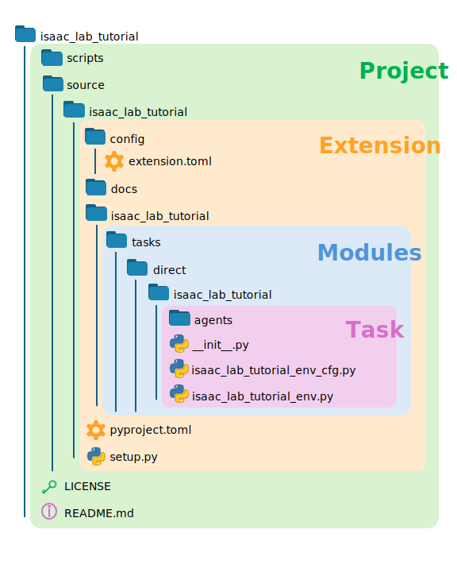

# 프로젝트 구조

직접 워크플로우에서 Isaac Lab 템플릿 프로젝트를 사용할 때 인식해야 하는 네 가지 중첩된 구조는 **Project**(프로젝트), **Extension**(확장), **Modules**(모듈), **Task**(작업)입니다.

**Project**(프로젝트)는 생성된 템플릿의 루트 디렉터리입니다. 소스 및 스크립트 디렉터리와 `README.md` 파일을 포함합니다. 템플릿을 만들 때 프로젝트를 *IsaacLabTutorial*이라고 명명했으며, 이는 Git 저장소의 루트 디렉터리를 정의합니다. 프로젝트 루트를 숨김 파일을 포함하여 확인하면 Git에 대한 프로젝트 동작을 정의하는 여러 파일을 볼 수 있습니다. `scripts` 디렉터리는 템플릿 생성 시 선택한 다양한 RL 라이브러리를 위한 `train.py` 및 `play.py` 스크립트를 포함하며, 소스 디렉터리는 프로젝트의 Python 패키지를 포함합니다.

**Extension**(확장)은 pip를 통해 설치한 Python 패키지의 이름입니다. 기본적으로 템플릿은 동일한 이름을 가진 단일 확장을 가진 프로젝트를 생성합니다. 프로젝트는 여러 확장을 가질 수 있으며, 따라서 공통 `source` 디렉터리에 보관됩니다. 전통적인 Python 패키지는 패키지 메타데이터를 설명하는 `pyproject.toml` 파일의 존재로 정의되지만, Isaac Lab을 사용하는 패키지는 Isaac Sim 확장도 되어야 하므로 Isaac Sim 확장 관리자에 필요한 메타데이터를 설명하는 `config` 디렉터리와 accompanying `extension.toml` 파일이 필요합니다. 마지막으로, 템플릿은 pip를 통해 설치되도록 의도되었으므로 `extension.toml` 구성으로 설정 절차를 완료하기 위해 `setup.py` 파일이 필요합니다. 프로젝트는 여러 확장을 가질 수 있으며, 이는 Isaac Lab 저장소 자체에서도 확인할 수 있습니다!

**Modules**(모듈)는 Isaac Lab에서 훈련을 실행할 때 실제로 로드되는 코어 코드입니다. 기본적으로 템플릿은 프로젝트와 동일한 이름을 가진 단일 모듈을 가진 확장을 생성합니다. 확장의 다양한 서브모듈 구조는 Isaac Lab에서 환경의 `entry_point`를 결정합니다.这就是为什么我们的模板项目需要在我们能够调用 `train.py` 之前先进行安装：运行任务所需的必要组件的路径需要暴露给 Python，以便 Isaac Lab 能够找到它们。

마지막으로, **Task**(작업)는 직접 워크플로우의 핵심입니다. 기본적으로 템플릿은 프로젝트와 동일한 이름을 가진 단일 작업을 생성합니다. 환경과 구성 파일은 여기에 저장되며, RL 라이브러리 종속적인 플레이스홀더 `agents`도 포함됩니다. 중요한 점은 `__init__.py`의 내용을 확인하는 것입니다! 구체적으로, Isaac Lab `train.py` 및 `play.py` 스크립트와 함께 환경과 작업을 사용하기 전에 `gym.register` 함수를 최소 한 번 호출해야 합니다. 이 함수는 설치 시 호출되도록 모듈의 `__init__.py` 파일 중 하나에 포함되어야 합니다. 이 초기화 파일의 경로가 작업의 진입점을 정의합니다!

템플릿의 경우, `gym.register`는 `isaac_lab_tutorial/source/isaac_lab_tutorial/isaac_lab_tutorial/tasks/direct/isaac_lab_tutorial/__init__.py` 내에서 호출됩니다. 반복된 이름은 템플릿에 대한 기본 이름 지정의 결과이지만, 이제 프로젝트 구조를 볼 수 있습니다.
**Project**/source/**Extension**/**Module**/tasks/direct/**Task**/_\_init_\_.py
