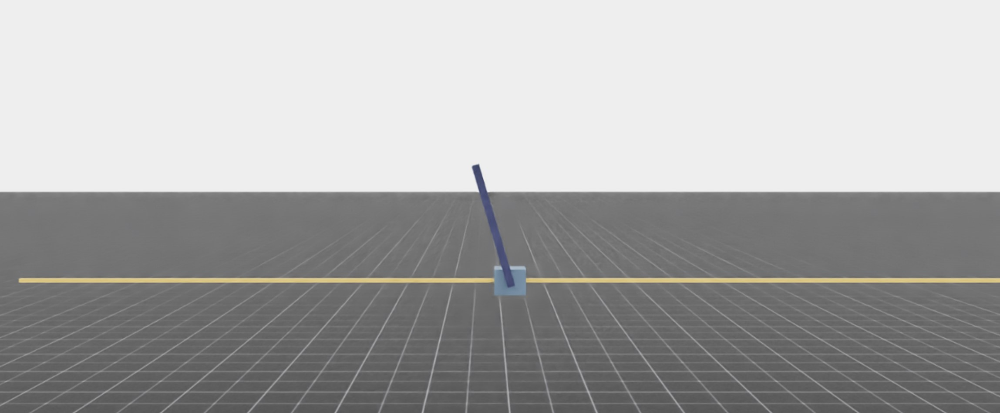
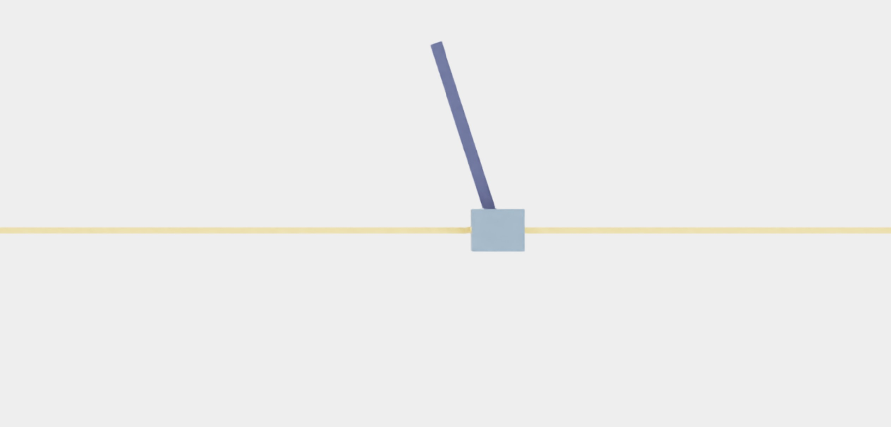
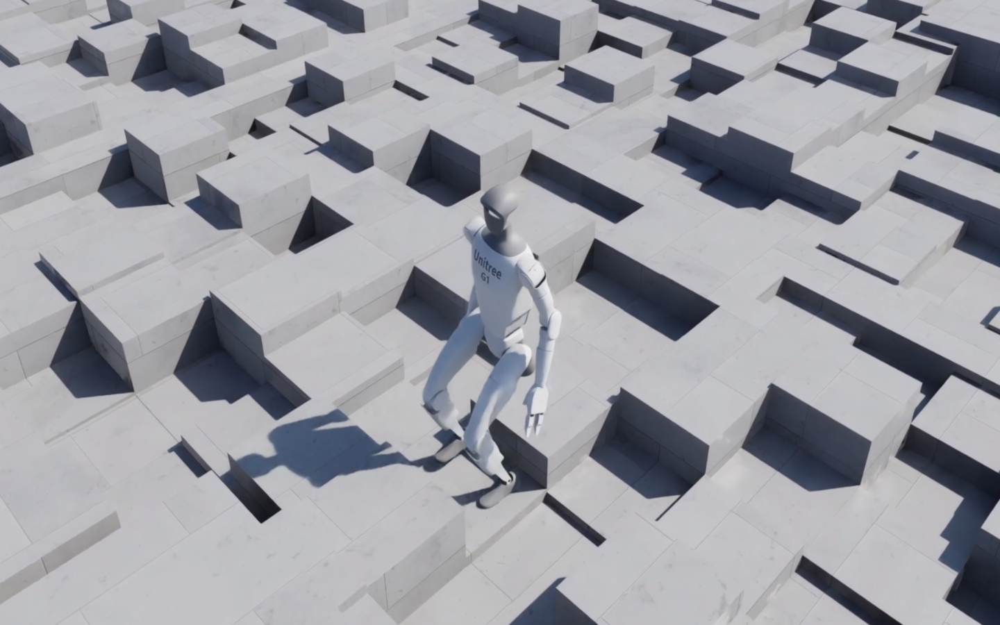
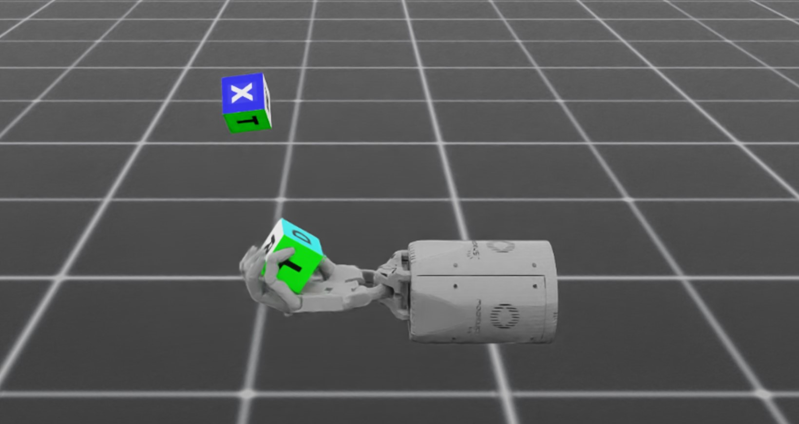

# 성능 벤치마크

Isaac Lab은 엔드-투-엔드 GPU 훈련을 활용하여 강화 학습 워크플로우를 수행하며,
수천 개의 환경에 걸쳐 병렬 훈련을 빠르게 수행할 수 있습니다.
이 섹션에서는 다양한 GPU 설정에서 다양한 예시 환경에 대한 강화 학습 훈련의 런타임 성능 벤치마크 결과를 제공합니다.
멀티-GPU 및 멀티-노드 훈련 성능 결과도 설명되어 있습니다.

## 벤치마크 결과

모든 벤치마크 결과는 Ubuntu 22.04에서 RL Games 라이브러리와 `--headless` 플래그를 사용하여 수행되었습니다.
`Isaac-Velocity-Rough-G1-v0` 환경 벤치마크는 RSL RL 라이브러리를 사용하여 수행되었습니다.

### 메모리 소비

| 환경 이름                    |                                                                |   # of Environments |   RAM (GB) |   VRAM (GB) |
|-------------------------------------|----------------------------------------------------------------|---------------------|------------|-------------|
| Isaac-Cartpole-Direct-v0            |             |                4096 |        3.7 |         3.3 |
| Isaac-Cartpole-RGB-Camera-Direct-v0 |  |                1024 |        7.5 |        16.7 |
| Isaac-Velocity-Rough-G1-v0          |                   |                4096 |        6.5 |         6.1 |
| Isaac-Repose-Cube-Shadow-Direct-v0  |                 |                8192 |        6.7 |         6.4 |

### 단일 GPU - RTX 4090

CPU: AMD Ryzen 9 7950X 16코어 프로세서

| 환경 이름                    |   # of Environments |   환경<br/>스텝 FPS |   환경 단계<br/>및<br/>추론 FPS |   환경 단계,<br/>추론,<br/>및 훈련 FPS |
|-------------------------------------|---------------------|----------------------------|----------------------------------------------|------------------------------------------------------|
| Isaac-Cartpole-Direct-v0            |                4096 |                    1100000 |                                       910000 |                                               510000 |
| Isaac-Cartpole-RGB-Camera-Direct-v0 |                1024 |                      50000 |                                        45000 |                                                32000 |
| Isaac-Velocity-Rough-G1-v0          |                4096 |                      94000 |                                        88000 |                                                82000 |
| Isaac-Repose-Cube-Shadow-Direct-v0  |                8192 |                     200000 |                                       190000 |                                               170000 |

### 단일 GPU - L40

CPU: Intel(R) Xeon(R) Platinum 8362 CPU @ 2.80GHz

| 환경 이름                    |   # of Environments |   환경<br/>스텝 FPS |   환경 단계<br/>및<br/>추론 FPS |   환경 단계,<br/>추론,<br/>및 훈련 FPS |
|-------------------------------------|---------------------|----------------------------|----------------------------------------------|------------------------------------------------------|
| Isaac-Cartpole-Direct-v0            |                4096 |                     620000 |                                       490000 |                                               260000 |
| Isaac-Cartpole-RGB-Camera-Direct-v0 |                1024 |                      30000 |                                        28000 |                                                21000 |
| Isaac-Velocity-Rough-G1-v0          |                4096 |                      72000 |                                        64000 |                                                62000 |
| Isaac-Repose-Cube-Shadow-Direct-v0  |                8192 |                     170000 |                                       140000 |                                               120000 |

### 단일 노드, 4 x L40 GPU

CPU: Intel(R) Xeon(R) Platinum 8362 CPU @ 2.80GHz

| 환경 이름                    |   # of Environments |   환경<br/>스텝 FPS |   환경 단계<br/>및<br/>추론 FPS |   환경 단계,<br/>추론,<br/>및 훈련 FPS |
|-------------------------------------|---------------------|----------------------------|----------------------------------------------|------------------------------------------------------|
| Isaac-Cartpole-Direct-v0            |                4096 |                    2700000 |                                      2100000 |                                               950000 |
| Isaac-Cartpole-RGB-Camera-Direct-v0 |                1024 |                     130000 |                                       120000 |                                                90000 |
| Isaac-Velocity-Rough-G1-v0          |                4096 |                     290000 |                                       270000 |                                               250000 |
| Isaac-Repose-Cube-Shadow-Direct-v0  |                8192 |                     440000 |                                       420000 |                                               390000 |

### 4 노드, 노드당 4 x L40 GPU

CPU: Intel(R) Xeon(R) Platinum 8362 CPU @ 2.80GHz

| 환경 이름                    |   # of Environments |   환경<br/>스텝 FPS |   환경 단계<br/>및<br/>추론 FPS |   환경 단계,<br/>추론,<br/>및 훈련 FPS |
|-------------------------------------|---------------------|----------------------------|----------------------------------------------|------------------------------------------------------|
| Isaac-Cartpole-Direct-v0            |                4096 |                   10200000 |                                      8200000 |                                              3500000 |
| Isaac-Cartpole-RGB-Camera-Direct-v0 |                1024 |                     530000 |                                       490000 |                                               260000 |
| Isaac-Velocity-Rough-G1-v0          |                4096 |                    1200000 |                                      1100000 |                                               960000 |
| Isaac-Repose-Cube-Shadow-Direct-v0  |                8192 |                    2400000 |                                      2300000 |                                              1800000 |

## 벤치마크 스크립트

재현성을 위해 `scripts/benchmarks`에서 벤치마크 스크립트를 제공합니다.
이 폴더에는 RL-Games 및 RSL RL용 `train.py` 스크립트와 유사한 개별 벤치마크 스크립트가 포함되어 있습니다.
또한, 강화 학습 라이브러리 없이 환경 구현만 실행하는 벤치마크 스크립트도 제공합니다.

예시 스크립트는 훈련 스크립트와 유사하게 실행할 수 있습니다:

```bash
# RSL RL로 벤치마크 실행
python scripts/benchmarks/benchmark_rsl_rl.py --task=Isaac-Cartpole-v0 --headless

# RL Games로 벤치마크 실행
python scripts/benchmarks/benchmark_rlgames.py --task=Isaac-Cartpole-v0 --headless

# RL 라이브러리 없이 벤치마크 실행
python scripts/benchmarks/benchmark_non_rl.py --task=Isaac-Cartpole-v0 --headless
```

각 스크립트는 실행 종료 시 시작 시간, 런타임 통계(시뮬레이션 또는 렌더링 단계당 소요 시간 포함) 및 전체 환경 FPS(환경 단계 수행, 롤아웃 중 추론 수행, 훈련 수행)를 포함한 KPI 파일을 생성합니다.
