# 쇼룸 데모

Isaac Lab `isaaclab`의 주요 핵심 인터페이스 확장은 액추에이터, 객체, 로봇 및 센서를 위한 주요 모듈을 제공합니다. 제공되는 인터페이스를 코드 내에서 최소한의 방식으로 사용하는 방법을 보여주는 데모 스크립트와 튜토리얼 목록을 제공합니다.

실행하여 확인해 볼 수 있는 몇 가지 빠른 쇼룸 스크립트:

- 다양한 팔을 생성하고 무작위 관절 위치 명령 적용:

  ### Linux

  ```bash
  ./isaaclab.sh -p scripts/demos/arms.py
  ```

  ### Windows

  ```batch
  isaaclab.bat -p scripts\demos\arms.py
  ```

  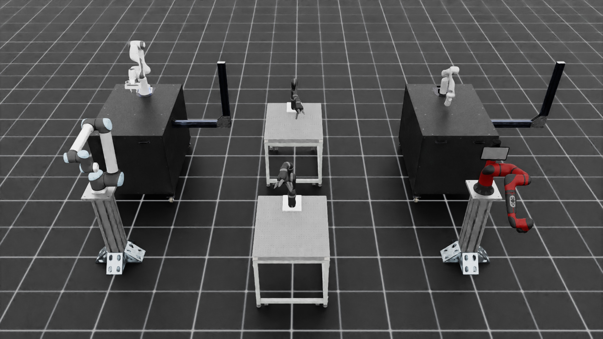
- 다양한 biped 로봇 생성:

  ### Linux

  ```bash
  ./isaaclab.sh -p scripts/demos/bipeds.py
  ```

  ### Windows

  ```batch
  isaaclab.bat -p scripts\demos\bipeds.py
  ```

  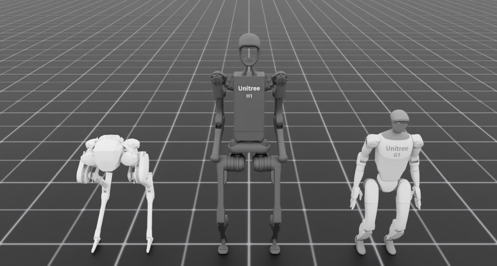
- 다양한 변형 가능한(소프트) 물체를 생성하고 높이에서 떨어트리기:

  ### Linux

  ```bash
  ./isaaclab.sh -p scripts/demos/deformables.py
  ```

  ### Windows

  ```batch
  isaaclab.bat -p scripts\demos\deformables.py
  ```

  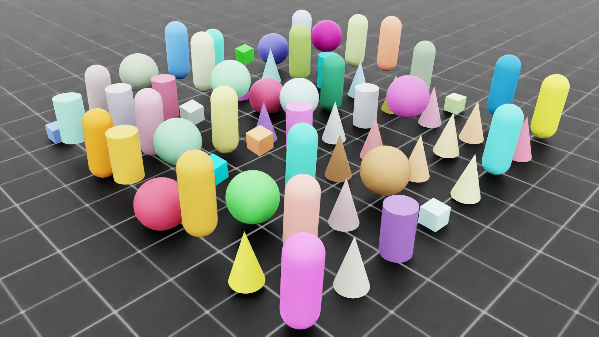
- 훈련된 H1 거친 지형 이동 정책의 대화형 추론:

  ### Linux

  ```bash
  ./isaaclab.sh -p scripts/demos/h1_locomotion.py
  ```

  ### Windows

  ```batch
  isaaclab.bat -p scripts\demos\h1_locomotion.py
  ```

  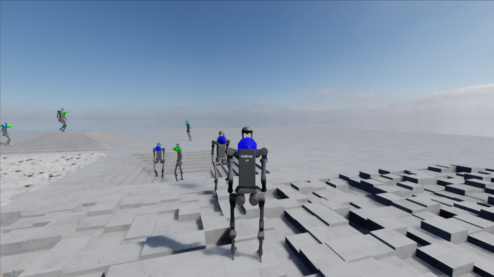

  이는 마우스와 키보드를 사용하여 실행할 수 있는 대화형 데모입니다. trzec인칭 시점으로 들어가려면 장면에서 인간형 캐릭터를 클릭하세요. derde인칭 뷰에 진입한 후, 인간형 캐릭터는 키보드를 사용하여 다음과 같이 제어할 수 있습니다:
  * `UP`: 앞으로 이동
  * `LEFT`: 왼쪽으로 회전
  * `RIGHT`: 오른쪽으로 회전
  * `DOWN`: 정지
  * `C`: trzec인칭 및 퍼스펙티브 뷰 간 전환
  * `ESC`: 현재 trzec인칭 뷰 종료

  인간형 몸을 선택하는 과정에서 인간형 몸 외부를 클릭하면 오류를 나타내는 메시지가 콘솔에 출력됩니다. 예를 들어
  `선택한 prim은 H1 로봇이 아닙니다` 또는
  `여러 prim이 선택되었습니다. 하나만 선택해 주세요!`.
- 다양한 손을 생성하고 열리고 닫히도록 명령:

  ### Linux

  ```bash
  ./isaaclab.sh -p scripts/demos/hands.py
  ```

  ### Windows

  ```batch
  isaaclab.bat -p scripts\demos\hands.py
  ```

  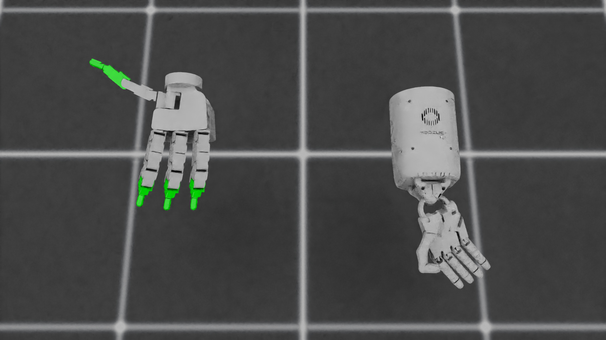
- 시각화에 유용한 여러 마커 정의:

  ### Linux

  ```bash
  ./isaaclab.sh -p scripts/demos/markers.py
  ```

  ### Windows

  ```batch
  isaaclab.bat -p scripts\demos\markers.py
  ```

  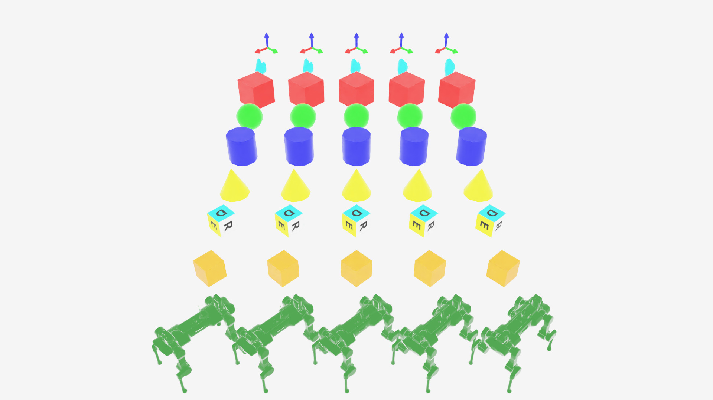
- 대화형 장면을 사용하고 개별 환경에서 다양한 에셋 생성:

  ### Linux

  ```bash
  ./isaaclab.sh -p scripts/demos/multi_asset.py
  ```

  ### Windows

  ```batch
  isaaclab.bat -p scripts\demos\multi_asset.py
  ```

  
- RigidObjectCollection 스폰 및 뷰 조작을 사용하여 팩킹 예제 시연:

  ### Linux

  ```bash
  ./isaaclab.sh -p scripts/demos/bin_packing.py
  ```

  ### Windows

  ```batch
  isaaclab.bat -p scripts\demos\bin_packing.py
  ```

  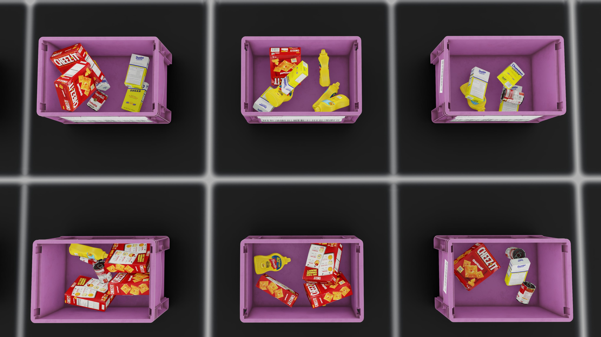
- 대화형 장면을 사용하고 간단한 병렬 로봇을 스폰하여 픽 앤드 플레이스 시연:

  ### Linux

  ```bash
  ./isaaclab.sh -p scripts/demos/pick_and_place.py
  ```

  ### Windows

  ```batch
  isaaclab.bat -p scripts\demos\pick_and_place.py
  ```

  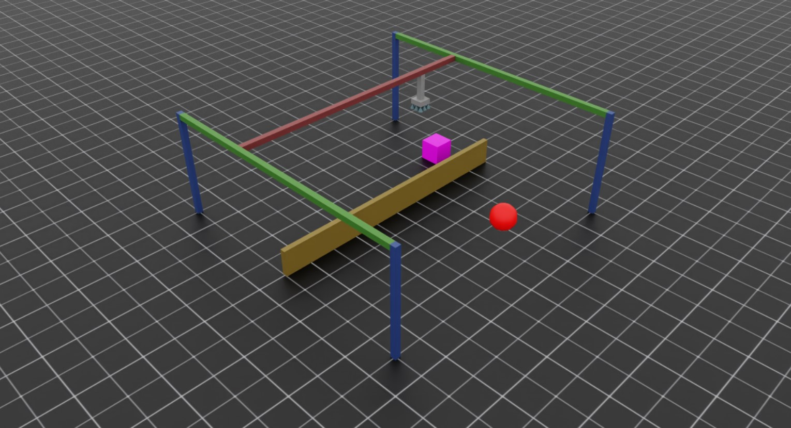

  이는 마우스와 키보드를 사용하여 실행할 수 있는 대화형 데모입니다. 목표는 보라색 큐브를 집어 들어 빨간 구 위에 놓는 것입니다! 다음 컨트롤을 사용하여 시뮬레이션과 상호작용하세요:
  * `A` 키를 누르고 있으면 그리퍼가 큐브 위치를 추적합니다.
  * `D` 키를 누르고 있으면 그리퍼가 목표 위치를 추적합니다.
  * `W` 또는 `S` 키를 눌러 갠트리를 각각 위로 또는 아래로 이동시킵니다.
  * `Q` 또는 `E`를 눌러 그리퍼를 각각 열거나 닫습니다.
- Haply 햅틱 장치와 힘 피드백을 사용하여 프랑카 팬다 로봇 원격 조작:

  ### Linux

  ```bash
  ./isaaclab.sh -p scripts/demos/haply_teleoperation.py --websocket_uri ws://localhost:10001 --pos_sensitivity 1.65
  ```

  ### Windows

  ```batch
  isaaclab.bat -p scripts\demos\haply_teleoperation.py --websocket_uri ws://localhost:10001 --pos_sensitivity 1.65
  ```

  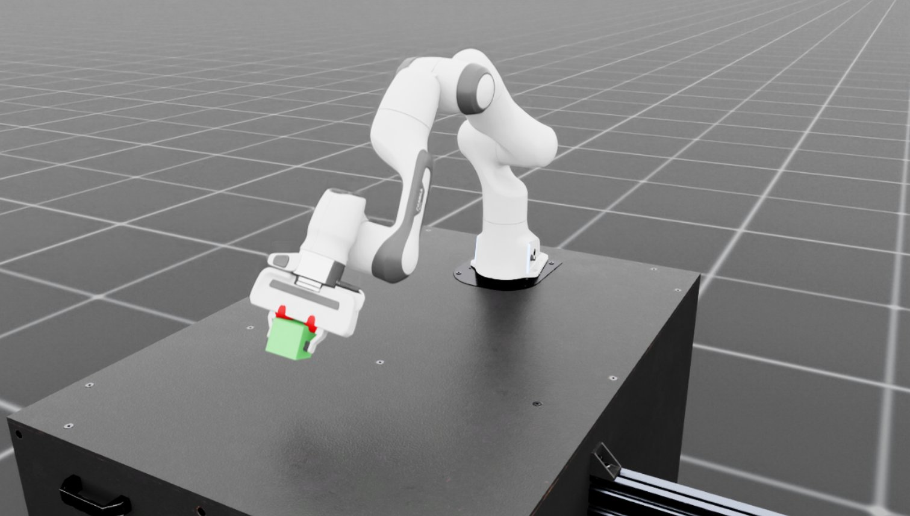

  이 데모는 Haply Inverse3 및 VerseGrip 장치가 필요합니다. 이 데모의 목표는 큐브를 집거나 엔드 이펙터로 터치하는 것입니다. Haply 장치는 다음과 같은 기능을 제공합니다:
  * 엔드 이펙터 제어를 위한 3차원 위치 추적
  * 접촉 감지를 위한 방향성 힘 피드백
  * 그리퍼 및 엔드 이펙터 회전 제어를 위한 버튼 입력

  자세한 설정 방법은 [Haply 원격 조작 설정](../how-to/haply_teleoperation.md#haply-teleoperation)을 참조하세요.
- 다양한 구성의 프로시저적으로 생성된 지형 생성 및 스폰:

  ### Linux

  ```bash
  ./isaaclab.sh -p scripts/demos/procedural_terrain.py
  ```

  ### Windows

  ```batch
  isaaclab.bat -p scripts\demos\procedural_terrain.py
  ```

  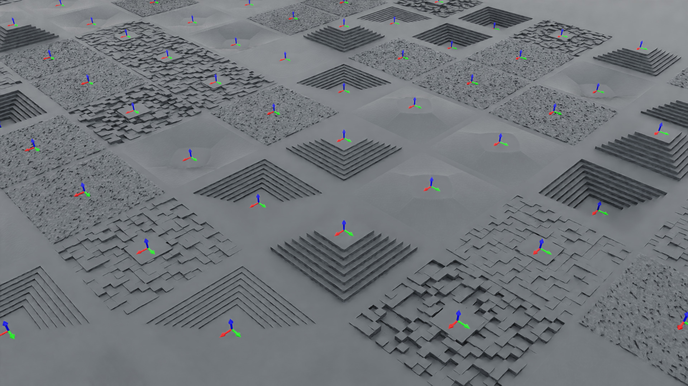
- 기본 환경에서 쿼드콥터 스폰:

  ### Linux

  ```bash
  ./isaaclab.sh -p scripts/demos/quadcopter.py
  ```

  ### Windows

  ```batch
  isaaclab.bat -p scripts\demos\quadcopter.py
  ```

  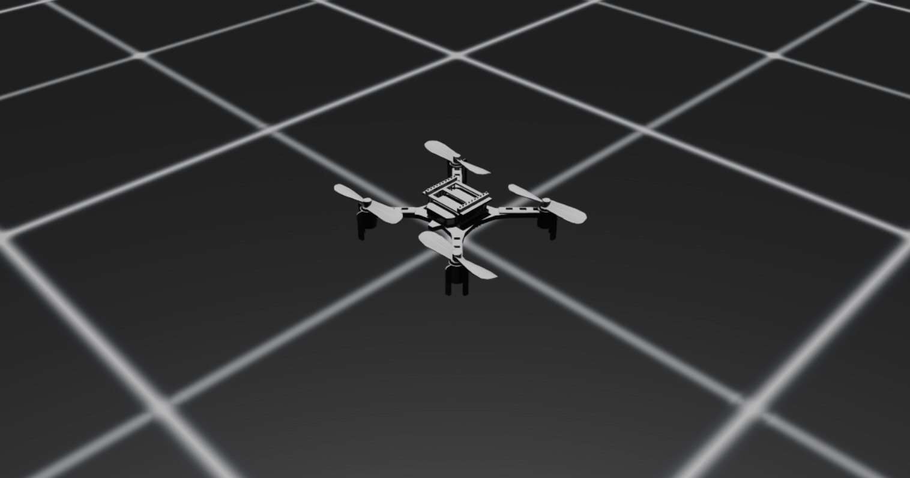
- 다양한 사족 보행 로봇을 생성하고 위치 명령을 사용하여 로봇이 서 있도록 하기:

  ### Linux

  ```bash
  ./isaaclab.sh -p scripts/demos/quadrupeds.py
  ```

  ### Windows

  ```batch
  isaaclab.bat -p scripts\demos\quadrupeds.py
  ```

  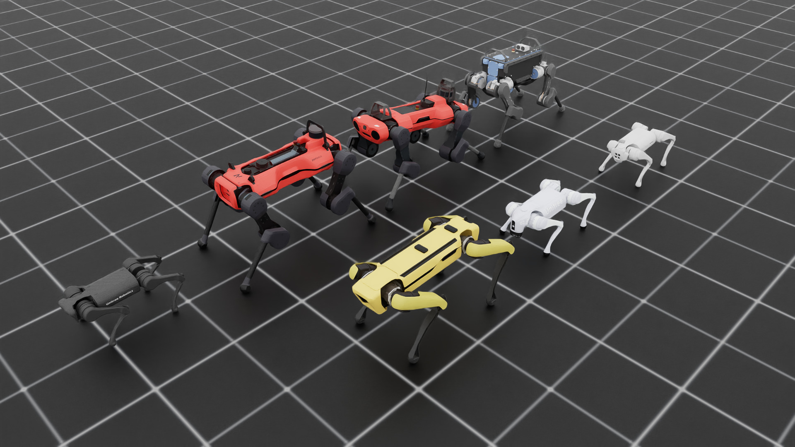
- Warp 커널을 사용하여 레이캐스팅을 수행하는 다중 메시 레이 캐스터 스폰:

  ### Linux

  ```bash
  ./isaaclab.sh -p scripts/demos/sensors/multi_mesh_raycaster.py --num_envs 16 --asset_type objects
  ```

  ### Windows

  ```batch
  isaaclab.bat -p scripts\demos\sensors\multi_mesh_raycaster.py --num_envs 16 --asset_type objects
  ```

  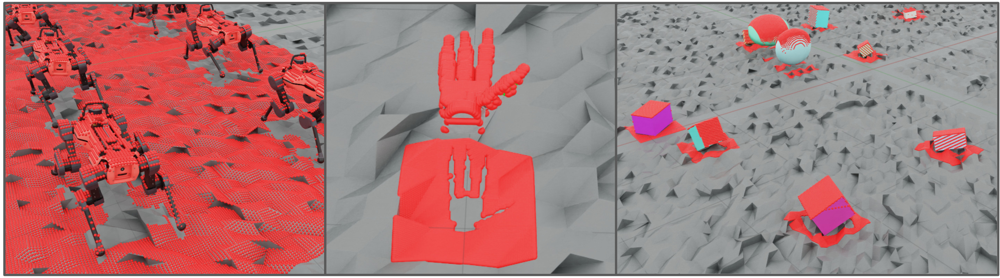
