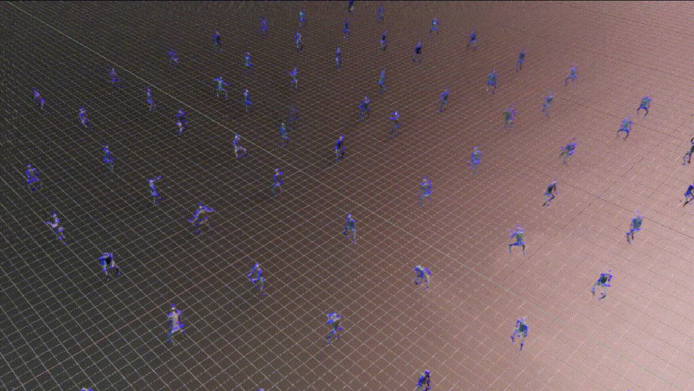
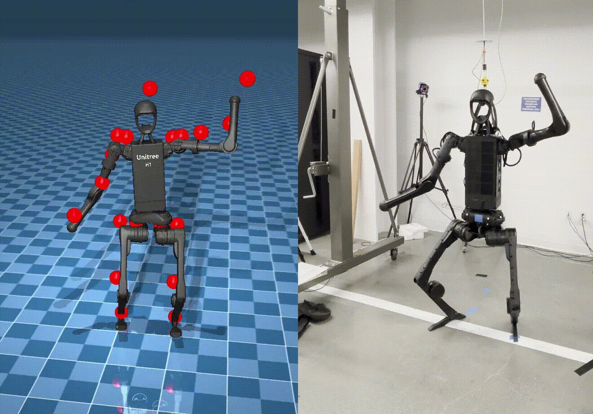

# HOVER 정책 훈련 및 배포

이 튜토리얼은 Isaac Lab 시뮬레이션 환경에서 인간형 로봇용 전체 신체 제어(WBC) 정책인 HOVER를 훈련하고 배포하는 방법을 보여줍니다.
이 튜토리얼은 인간형 로봇용 신경 전체 신체 제어 정책 훈련을 위한 Isaac Lab 확장을 제공하는 [HOVER](https://github.com/NVlabs/HOVER) 저장소를 사용하며, 이는 [HOVER 논문](https://arxiv.org/abs/2410.21229) 및 [OMNIH2O 논문](https://arxiv.org/abs/2410.21229)에 설명되어 있습니다.
프로젝트에 대한 비디오 시연 및 자세한 내용은 [HOVER 프로젝트 웹사이트](https://omni.human2humanoid.com/) 및 [OMNIH2O 프로젝트 웹사이트](https://hover-versatile-humanoid.github.io/)를 방문해 주세요.



## 설치

#### 참고
이 튜토리얼은 Linux 전용입니다.

HOVER는 Isaac Lab 2.0과 Isaac Sim 4.5를 지원합니다. HOVER 워크플로를 실행하기 위해 올바른 버전의 Isaac Lab과 Isaac Sim이 설치되어 있는지 확인하세요.

1. [Isaac Lab 설치 가이드](https://isaac-sim.github.io/IsaacLab/v2.0.0/source/setup/installation/index.html)의 지침을 따라 Isaac Lab을 설치합니다.
2. Isaac Lab 설치 경로를 지정하는 다음 환경 변수를 정의합니다:

```bash
# Isaac Lab 설치 디렉터리를 가리키는 ISAACLAB_PATH 환경 변수 설정
export ISAACLAB_PATH=<your_isaac_lab_path>
```

1. 워크스페이스에서 [HOVER](https://github.com/NVlabs/HOVER) 저장소와 그 서브모듈을 클론합니다.

```bash
git clone --recurse-submodules https://github.com/NVlabs/HOVER.git
```

1. 의존성을 설치합니다.

```bash
cd HOVER
./install_deps.sh
```

## 정책 훈련

### 데이터셋

정책 훈련을 위한 데이터 획득 및 처리 단계는 [HOVER 데이터셋](https://github.com/NVlabs/HOVER/?tab=readme-ov-file#data-processing) 저장소를 참조하세요.

### 교사 정책 훈련

`HOVER` 디렉터리에서 다음 명령을 실행하여 교사 정책을 훈련합니다.

```bash
${ISAACLAB_PATH:?}/isaaclab.sh -p scripts/rsl_rl/train_teacher_policy.py \
    --num_envs 1024 \
    --reference_motion_path neural_wbc/data/data/motions/stable_punch.pkl \
    --headless
```

교사 정책은 10,000,000번 반복 훈련되거나 사용자가 훈련을 중지할 때까지 훈련됩니다.
결과 체크포인트는 `neural_wbc/data/data/policy/h1:teacher/`에 저장되며 파일 이름은 `model_<iteration_number>.pt`입니다.

### 학생 정책 훈련

`HOVER` 디렉터리에서 다음 명령을 실행하여 교사 정책 체크포인트를 사용해 학생 정책을 훈련합니다.

```bash
${ISAACLAB_PATH:?}/isaaclab.sh -p scripts/rsl_rl/train_student_policy.py \
    --num_envs 1024 \
    --reference_motion_path neural_wbc/data/data/motions/stable_punch.pkl \
    --teacher_policy.resume_path neural_wbc/data/data/policy/h1:teacher \
    --teacher_policy.checkpoint model_<iteration_number>.pt \
    --headless
```

이 명령은 저장소에 제공된 교사 정책이 없으므로 교사 정책을 이미 훈련했다는 전제를 기반으로 합니다.

훈련 구성에 대한 자세한 내용은 HOVER 저장소의 다음 섹션을 참조하세요:
: - [훈련 일반 비고](https://github.com/NVlabs/HOVER/?tab=readme-ov-file#general-remarks-for-training)
  - [범용형 vs 전문형 정책](https://github.com/NVlabs/HOVER/?tab=readme-ov-file#generalist-vs-specialist-policy)

## 훈련된 정책 테스트

### 교사 정책 재생

`HOVER` 디렉터리에서 다음 명령을 실행하여 훈련된 교사 정책 체크포인트를 재생합니다.

```bash
${ISAACLAB_PATH:?}/isaaclab.sh -p scripts/rsl_rl/play.py \
    --num_envs 10 \
    --reference_motion_path neural_wbc/data/data/motions/stable_punch.pkl \
    --teacher_policy.resume_path neural_wbc/data/data/policy/h1:teacher \
    --teacher_policy.checkpoint model_<iteration_number>.pt
```

### 학생 정책 재생

`HOVER` 디렉터리에서 다음 명령을 실행하여 훈련된 학생 정책 체크포인트를 재생합니다.

```bash
${ISAACLAB_PATH:?}/isaaclab.sh -p scripts/rsl_rl/play.py \
    --num_envs 10 \
    --reference_motion_path neural_wbc/data/data/motions/stable_punch.pkl \
    --student_player \
    --student_path neural_wbc/data/data/policy/h1:student \
    --student_checkpoint model_<iteration_number>.pt
```

## 훈련된 정책 평가

Isaac Lab 환경에서 훈련된 정책 체크포인트를 평가합니다.
평가는 `--reference_motion_path` 옵션으로 지정된 데이터셋에 포함된 모든 참조 움직임을 반복 처리하고 모든 움직임이 평가되면 종료됩니다. 평가 중 랜덤화는 비활성화됩니다.

평가 파이프라인 및 사용된 메트릭에 대한 자세한 내용은 [HOVER 평가](https://github.com/NVlabs/HOVER/?tab=readme-ov-file#evaluation) 저장소를 참조하세요.

평가 스크립트 `scripts/rsl_rl/eval.py`는 재생 스크립트 `scripts/rsl_rl/play.py`와 동일한 인수를 사용합니다. 교사 정책 및 학생 정책 모두에 사용할 수 있습니다.

```bash
${ISAACLAB_PATH}/isaaclab.sh -p scripts/rsl_rl/eval.py \
--num_envs 10 \
--teacher_policy.resume_path neural_wbc/data/data/policy/h1:teacher \
--teacher_policy.checkpoint model_<iteration_number>.pt
```

## 정책 검증

Isaac Lab에서 훈련된 정책은 다른 시뮬레이션 환경이나 실제 로봇에서 검증할 수 있습니다.



### Sim-to-Sim 검증

훈련된 정책에 대한 Sim-to-Sim 검증을 수행하기 위해 제공된 [Mujoco 환경](https://github.com/NVlabs/HOVER/tree/main/neural_wbc/mujoco_wrapper)을 사용하세요. Sim2Sim 평가를 실행하려면:

```bash
${ISAACLAB_PATH:?}/isaaclab.sh -p neural_wbc/inference_env/scripts/eval.py \
    --num_envs 1 \
    --headless \
    --student_path neural_wbc/data/data/policy/h1:student/ \
    --student_checkpoint model_<iteration_number>.pt
```

Mujoco 래퍼는 한 번에 하나의 환경만 지원한다는 점을 유의하세요. 참고로, 8k 참조 움직임을 평가하는 데 최대 5시간이 소요될 수 있습니다. inference_env는 최대 다용성을 위해 설계되었습니다.

### Sim-to-Real 배포

Sim-to-Real 배포를 위해 [Unitree H1 로봇](https://unitree.com/h1)을 위한 [하드웨어 환경](https://github.com/NVlabs/HOVER/blob/main/neural_wbc/hw_wrappers/README.md)을 제공합니다. Sim-to-Real 배포 워크플로 설정 단계는 [Sim2Real 배포 README](https://github.com/NVlabs/HOVER/blob/main/neural_wbc/hw_wrappers/README.md)에서 자세히 설명합니다.

H1 로봇에 훈련된 정책을 배포하려면:

```bash
${ISAACLAB_PATH:?}/isaaclab.sh -p neural_wbc/inference_env/scripts/s2r_player.py \
    --student_path neural_wbc/data/data/policy/h1:student/ \
    --student_checkpoint model_<iteration_number>.pt \
    --reference_motion_path neural_wbc/data/data/motions/<motion_name>.pkl \
    --robot unitree_h1 \
    --max_iterations 5000 \
    --num_envs 1 \
    --headless
```

#### 참고
Sim-to-Real 배포 래퍼는 현재 Unitree H1 로봇만 지원합니다. 해당하는 하드웨어 래퍼 인터페이스를 구현하여 다른 로봇으로 확장할 수 있습니다.
