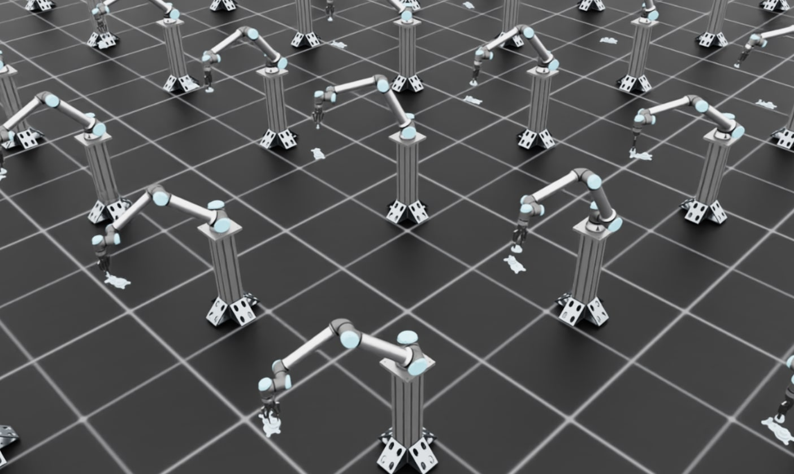

<a id="walkthrough-sim-to-real"></a>

# 훈련된 기어 삽입 정책 및 ROS 배포

이 튜토리얼에서는 시뮬레이션에서 실제 로봇으로 전송되는 기어 조립 강화 학습(RL) 정책을 훈련하는 방법을 안내합니다. 워크플로우는 두 가지 주요 단계로 구성됩니다.

1. **Isaac Lab에서 시뮬레이션 훈련**: 도메인 랜덤화와 함께 고정밀 물리 시뮬레이션에서 정책을 훈련합니다
2. **Isaac ROS를 통한 실제 로봇 배포**: Isaac ROS와 맞춤형 ROS 추론 노드를 사용하여 훈련된 정책을 실제 하드웨어에 배포합니다

이 워크스루는 Isaac Lab을 사용한 시뮬레이션-실제 전송의 핵심 원칙과 모범 사례를 다루며, 실제 예시로 설명합니다.

- UR10e 로봇과 Robotiq 2F-140 그리퍼 또는 2F-85 그리퍼를 사용한 기어 조립 작업

**작업 세부 사항:**

기어 조립 정책은 다음과 같이 작동합니다:

1. **초기 상태**: 정책은 에피소드 시작 시 그리퍼가 이미 기어를grasping하고 있다고 가정합니다
2. **입력 관찰값**: 정책은 별도의 인식 파이프라인에서 얻은, 기어가 삽입되어야 하는 기어 샤프트의 포즈(위치 및 방향)를 받습니다
3. **정책 출력**: 정책은 로봇 팔을 제어하고 삽입을 수행하기 위한 delta 관절 위치(관절 각도의 증가량)를 출력합니다
4. **일반화**: 훈련된 정책은 재훈련 없이 3가지 다른 기어 크기에 대해 일반화됩니다


이 환경은 IsaacLab 의존성 없이 실제 UR10e 로봇에 성공적으로 배포되었습니다.

**이 튜토리얼의 범위:**

이 튜토리얼은 Isaac Lab에서 시뮬레이션-실제 전송 워크플로의 **훈련 부분**에만 집중합니다. 실제 로봇에서의 완전한 배포 워크플로, 즉 비전 파이프라인 설정, 로봇 인터페이스 및 ROS 추론 노드를 설정하여 훈련된 정책을 실제 하드웨어에서 실행하는 정확한 단계에 대해서는 [Isaac ROS 문서](https://nvidia-isaac-ros.github.io/reference_workflows/isaac_for_manipulation/packages/isaac_manipulator_ur_dnn_policy/index.html)를 참조하십시오.

## 개요

성공적인 시뮬레이션-실제 전송을 위해서는 세 가지 기본 측면을 해결해야 합니다:

1. **입력 일관성**: 시뮬레이션에서 정책이 받는 관찰값이 실제 로봇에서 사용할 수 있는 값과 일치하도록 보장합니다
2. **시스템 응답 일관성**: 시뮬레이션에서 로봇과 환경이 행동을 처리하는 방식이 실제와 동일하도록 보장합니다
3. **출력 일관성**: Isaac Lab에서 정책 출력에 적용된 후처리가 실제 세계 추론 중에도 적용되도록 보장합니다

모든 세 가지 측면이 적절히 해결되면, 순수하게 시뮬레이션에서 훈련된 정책도 실제 세계 훈련 데이터 없이 실제 하드웨어에서 강력한 성능을 달성할 수 있습니다.

**디버깅 팁**: 실제 로봇에서 정책이 실패할 경우, 실제 로봇을 시뮬레이션에서의 초기 관찰값과 동일한 상태로 설정한 후 컨트롤러/시스템의 반응을 비교하는 것이 가장 좋습니다. 이렇게 하면 관측값 불일치(입력 일관성) 문제인지 물리/컨트롤러 불일치(시스템 응답 일관성) 문제인지 확인할 수 있습니다.

## Part 1: 입력 일관성

정책이 받는 관찰값은 시뮬레이션과 현실 사이에서 일관적이어야 합니다. 즉:

1. 관찰 공간에는 실제 센서에서만 사용 가능한 정보만 포함되어야 합니다
2. 센서 노이즈와 지연은 적절히 모델링되어야 합니다

### 실제 로봇에서 사용 가능한 관찰값 사용

시뮬레이션 환경은 실제 로봇에서 사용 가능한 관찰값만 사용해야 하며, 배포 시에는 사용할 수 없는 “특권” 정보는 사용해서는 안 됩니다.

#### 관찰 사양: Isaac-Deploy-GearAssembly-UR10e-2F140-v0

기어 조립 환경은 proprioceptive(자체 감각적)와 exteroceptive(외부 감각적, 시각) 관찰값을 모두 사용합니다:

#### 기어 조립 환경 관찰값

| 관찰값          | 차원                  | 실제 세계 소스                     | 훈련 시 노이즈                                                                                       |
|-----------------|-----------------------|------------------------------------|-------------------------------------------------------------------------------------------------------|
| `joint_pos`     | 6 (UR10e 팔 관절)     | UR10e 컨트롤러                     | 없음 (proprioceptive)                                                                                 |
| `joint_vel`     | 6 (UR10e 팔 관절)     | UR10e 컨트롤러                     | 없음 (proprioceptive)                                                                                 |
| `gear_shaft_pos`| 3 (x, y, z 위치)      | FoundationPose + RealSense depth   | ±0.005 m (5mm, FoundationPose + RealSense depth 파이프라인의 추정 오차)                          |
| `gear_shaft_quat`| 4 (쿼터니언 방향)   | FoundationPose + RealSense depth   | ±0.01 per component (~5° 각도 오차, FoundationPose + RealSense depth 파이프라인의 추정 오차) |

**구현:**

```python
from isaaclab.utils.noise import AdditiveUniformNoiseCfg as Unoise

@configclass
class PolicyCfg(ObsGroup):
    """정책 그룹을 위한 관찰값."""

    # 로봇 관절 상태 - proprioceptive 관찰값에는 노이즈 없음
    joint_pos = ObsTerm(
        func=mdp.joint_pos,
        params={"asset_cfg": SceneEntityCfg("robot", joint_names=["shoulder_pan_joint", ...])},
    )

    joint_vel = ObsTerm(
        func=mdp.joint_vel,
        params={"asset_cfg": SceneEntityCfg("robot", joint_names=["shoulder_pan_joint", ...])},
    )

    # FoundationPose 인식에서의 기어 샤프트 포즈
    # 외관(시각 기반) 관찰값에 노이즈 추가
    # FoundationPose + RealSense D435 오차에 맞게 교정
    # 일반적 오차: 3-8mm 위치, 3-7° 방향
    gear_shaft_pos = ObsTerm(
        func=mdp.gear_shaft_pos_w,
        params={"asset_cfg": SceneEntityCfg("factory_gear_base")},
        noise=Unoise(n_min=-0.005, n_max=0.005),  # ±5mm
    )

    # 쿼터니언 노이즈: 각 컴포넌트에 작은 균일 노이즈
    # 약 5° 방향 오차 결과
    gear_shaft_quat = ObsTerm(
        func=mdp.gear_shaft_quat_w,
        params={"asset_cfg": SceneEntityCfg("factory_gear_base")},
        noise=Unoise(n_min=-0.01, n_max=0.01),
    )

    def __post_init__(self):
        self.enable_corruption = True  # percepion 관찰값에 대해서만 활성화
        self.concatenate_terms = True
```

**왜 proprioceptive 관찰값에는 노이즈가 없을까?**

경험적으로, proprioceptive 관찰값(관절 위치 및 속도)에 노이즈 없이 훈련된 정책이 실제 하드웨어로 잘 전송된다는 것을 발견했습니다. UR10e 컨트롤러가 충분히 정확한 관절 상태 피드백을 제공하기 때문에 이러한 작업에서는 센서 노이즈를 모델링해도 시뮬레이션-실제 전송을 개선하지 못합니다.

## Part 2: 시스템 응답 일관성

관찰값이 일관되면, 시뮬레이션된 로봇과 환경이 실제 시스템과 동일한 방식으로 행동에 반응하도록 해야 합니다. 이 사용 사례에서는 다음 세 가지 주요 측면을 포함합니다:

1. 물리 시뮬레이션 파라미터(마찰, 접촉 속성)
2. 액추에이터 모델링(PD 컨트롤러Gain, 노력 제한)
3. 도메인 랜덤화

### 물리 파라미터 튜닝

접촉이 풍부한 작업에서는 정확한 물리 시뮬레이션이 중요합니다. 주요 파라미터에는 다음이 포함됩니다:

- 마찰 계수(정적 및 동적)
- 접촉 솔버 파라미터
- 재질 속성
- 강체 속성

**예시: 기어 조립 물리 구성**

기어 조립 작업은 삽입을 위한 정확한 접촉 모델링이 필요합니다. 다음은 마찰이 어떻게 구성되는지 보여줍니다:

```python
# Isaac-Deploy-GearAssembly-UR10e-2F140-v0의 joint_pos_env_cfg.py에서

@configclass
class EventCfg:
    """물리 랜덤화를 포함한 이벤트 구성."""

    # 기어 객체의 마찰 랜덤화
    small_gear_physics_material = EventTerm(
        func=mdp.randomize_rigid_body_material,
        mode="startup",
        params={
            "asset_cfg": SceneEntityCfg("factory_gear_small", body_names=".*"),
            "static_friction_range": (0.75, 0.75),   # 실제 기어 재질에 맞게 교정
            "dynamic_friction_range": (0.75, 0.75),
            "restitution_range": (0.0, 0.0),         # 튕김 없음
            "num_buckets": 16,
        },
    )

    # 그리퍼 손가락에 대한 유사한 구성
    robot_physics_material = EventTerm(
        func=mdp.randomize_rigid_body_material,
        mode="startup",
        params={
            "asset_cfg": SceneEntityCfg("robot", body_names=".*finger"),
            "static_friction_range": (0.75, 0.75),   # 실제 그리퍼에 맞게 교정
            "dynamic_friction_range": (0.75, 0.75),
            "restitution_range": (0.0, 0.0),
            "num_buckets": 16,
        },
    )
```

이 마찰 값들(0.75)은 다음과 같은 반복적인 시각적 비교를 통해 결정되었습니다:

1. 실제 하드웨어에서 기어가 잡히고 조작되는 동영상 기록
2. 시뮬레이션에서 훈련 시작 및 라이브 시뮬레이션 뷰어 관찰
3. 물리 문제(관통, 비현실적인 미끄러짐, 나쁜 접촉) 확인
4. 마찰 계수 및 솔버 파라미터 조정 후 재시도
5. 시뮬레이션과 실제에서의 그리퍼 내 기어 행동을 시각적으로 비교
6. 행동이 일치할 때까지 조정 반복 (정책 훈련 완료 대기 불필요)
7. 물리行为看起来良好后，以无头模式进行训练并录制视频：
   ```bash
   python scripts/reinforcement_learning/rsl_rl/train.py \
       --task Isaac-Deploy-GearAssembly-UR10e-2F140-v0 \
       --headless \
       --video --video_length 800 --video_interval 5000
   ```
8. 기록된 비디오를 검토하고 실제 하드웨어 비디오와 비교하여 물리 동작을 확인

**접촉 솔버 구성**

접촉이 풍부한 조작에는 신중한 솔버 튜닝이 필요합니다. 이러한 파라미터는 마찰 계수와 동일한 반복적인 시각적 비교 과정을 통해 교정되었습니다:

```python
# 로봇 강체 속성
rigid_props=sim_utils.RigidBodyPropertiesCfg(
    disable_gravity=True,                    # 로봇은 장착되어 있으므로 중력 없음
    max_depenetration_velocity=5.0,          # 관통 해상도 제어
    linear_damping=0.0,                      # 인위적 감쇠 없음
    angular_damping=0.0,
    max_linear_velocity=1000.0,
    max_angular_velocity=3666.0,
    enable_gyroscopic_forces=True,           # 정확한 동역학에 중요
    solver_position_iteration_count=4,       # 정확도 vs 성능 균형
    solver_velocity_iteration_count=1,
    max_contact_impulse=1e32,               # 큰 접촉 힘 허용
),
```

**중요**: `solver_position_iteration_count`은 접촉이 풍부한 작업에 대한 중요한 매개변수입니다. 이 값을 증가시키면 충돌 시뮬레이션의 안정성이 향상되고 관통 문제가 감소하지만, 시뮬레이션 및 훈련 시간도 늘어납니다. 기어 조립 작업의 경우, 물리 정확도와 계산 성능의 균형을 위해 `solver_position_iteration_count=4`를 사용합니다. 관통 또는 불안정한 접촉이 관찰되면 8 또는 16으로 증가시켜 보되, 훈련 속도가 느려질 것을 예상해야 합니다.

```python
# 관절 특성
articulation_props=sim_utils.ArticulationRootPropertiesCfg(
    enabled_self_collisions=False,
    solver_position_iteration_count=4,
    solver_velocity_iteration_count=1,
),

# 접촉 특성
collision_props=sim_utils.CollisionPropertiesCfg(
    contact_offset=0.005,                    # 5mm 접촉 감지 거리
    rest_offset=0.0,                         # 객체가 0 거리에서 접촉
),
```

### 액추에이터 모델링

정확한 액추에이터 모델링은 시뮬레이션된 로봇이 실제 로봇처럼 움직이도록 보장합니다. 여기에는 다음이 포함됩니다:

- PD 컨트롤러 게인 (강성 및 감쇠)
- 노력 및 속도 제한
- 관절 마찰

**컨트롤러 선택: 임피던스 컨트롤**

UR10e 배포의 경우, 임피던스 컨트롤러 인터페이스를 사용합니다. 임피던스 컨트롤과 같은 간단한 컨트롤러를 사용하면, 동작 공간 제어 또는 하이브리드 힘-위치 제어와 같은 더 복잡한 컨트롤러에 비해 시뮬레이션과 현실 사이의 변이 가능성을 줄일 수 있습니다. 간단한 컨트롤러는 다음과 같은 장점이 있습니다:

- 시뮬레이션과 실제 간에 불일치할 수 있는 매개변수가 적음
- 시뮬레이션에서 정확하게 모델링하기 쉬움
- 동작이 더 예측 가능하여 복제하기 쉬움
- 시뮬-실제 차이의 원인인 컨트롤러 복잡성을 감소시킴

**예시: UR10e 액추에이터 구성**

```python
# 기본 UR10e 액추에이터 구성
actuators = {
    "arm": ImplicitActuatorCfg(
        joint_names_expr=["shoulder_pan_joint", "shoulder_lift_joint",
                        "elbow_joint", "wrist_1_joint", "wrist_2_joint", "wrist_3_joint"],
        effort_limit=87.0,           # UR10e 사양에서 가져옴
        velocity_limit=2.0,          # UR10e 사양에서 가져옴
        stiffness=800.0,             # 실제 동작과 일치하도록 보정됨
        damping=40.0,                # 실제 동작과 일치하도록 보정됨
    ),
}
```

**액추에이터 매개변수의 도메인 랜덤화**

실제 로봇 행동의 변이를 고려하여 훈련 중에 액추에이터 게인을 랜덤화합니다:

```python
# 기어 조립 환경의 EventCfg에서 가져옴
robot_joint_stiffness_and_damping = EventTerm(
    func=mdp.randomize_actuator_gains,
    mode="reset",
    params={
        "asset_cfg": SceneEntityCfg("robot", joint_names=["shoulder_.*", "elbow_.*", "wrist_.*"]),
        "stiffness_distribution_params": (0.75, 1.5),    # 명목값의 75%에서 150%
        "damping_distribution_params": (0.3, 3.0),       # 명목값의 30%에서 300%
        "operation": "scale",
        "distribution": "log_uniform",
    },
)
```

**관절 마찰 랜덤화**

실제 로봇은 위치, 속도 및 온도에 따라 변하는 관절 마찰을 가집니다. UR10e의 임피던스 컨트롤러 인터페이스를 사용할 때, 목표 관절 위치에 도달하지 못하게 하는 현저한 스티션(정적 마찰)을 관찰했습니다.

**실제 로봇 행동 특성화:**

이 행동을 정량화하기 위해 실제 로봇에서 임피던스 컨트롤러의 단계 응답을 플로팅하고, 명령된 세트포인트로부터 약 0.25도의 접촉 오프셋을 관찰했습니다. 이 정상 상태 오류는 컨트롤러가 명령한 움직임에 반대하는 관절 마찰로 인해 발생합니다. 이러한 측정 결과를 바탕으로, 이 행동을 시뮬레이션에서 복제하기 위해 관절 마찰 모델링을 추가했습니다:

```python
joint_friction = EventTerm(
    func=mdp.randomize_joint_parameters,
    mode="reset",
    params={
        "asset_cfg": SceneEntityCfg("robot", joint_names=["shoulder_.*", "elbow_.*", "wrist_.*"]),
        "friction_distribution_params": (0.3, 0.7),     # 0.3에서 0.7 Nm 마찰 추가
        "operation": "add",
        "distribution": "uniform",
    },
)
```

**왜 관절 마찰이 중요한가**: 시뮬레이션에 관절 마찰을 모델링하지 않으면, 정책은 명령된 관절 위치가 항상 도달될 것이라고 학습합니다. 실제 로봇에서는 스티션이 작은 움직임을 방지하고 정상 상태 오류를 유발합니다. 훈련 중에 마찰을 추가함으로써, 정책은 이러한 영향을 고려하여 마찰을 극복하기 위해 적절히 더 큰 동작을 명령하도록 학습합니다.

**액션 스케일링을 통한 스티션 보상:**

실제 로봇에서 스티션을 극복하는 데 정책을 돕기 위해 출력 액션 스케일링도 증가시켰습니다. ISAAC ROS 문서에 따르면, 2F-85 그리퍼보다 더 높은 정적 마찰(스티션)을 극복하기 위해 더 높은 액션 스케일(0.0325 대 0.025)이 필요합니다. 이 증가된 스케일은 단계 응답 분석에서 관찰된 마찰 힘을 극복할 만큼 정책 명령이 충분히 크도록 보장합니다.

### 액션 공간 설계

액션 공간은 실제 로봇 컨트롤러가 실행할 수 있는 것과 일치해야 합니다. 이 작업에서는 **증분 관절 위치 제어**가 가장 신뢰할 수 있는 접근 방식임을 발견했습니다.

**예시: 기어 조립 액션 구성**

```python
# 접촉이 풍부한 조작을 위해 더 정밀한 제어를 위한 더 작은 액션 스케일
self.joint_action_scale = 0.025  # 단계당 ±2.5도

self.actions.arm_action = mdp.RelativeJointPositionActionCfg(
    asset_name="robot",
    joint_names=["shoulder_pan_joint", "shoulder_lift_joint", "elbow_joint",
                "wrist_1_joint", "wrist_2_joint", "wrist_3_joint"],
    scale=self.joint_action_scale,
    use_zero_offset=True,
)
```

액션 스케일은 다음과 기준으로 조정해야 하는 중요한 하이퍼파라미터입니다:

- 작업 정밀도 요건 (접촉이 풍부한 작업의 경우 더 작게)
- 제어 빈도 (더 높은 빈도는 더 큰 단계 허용)

### 도메인 랜덤화 전략

도메인 랜덤화는 실제 로봇이 수행하기를 원하는 조건 범위를覆盖해야 합니다. 랜덤화 범위를 늘리면 정책이 학습하기 어려워지지만, 입력 및 시스템 파라미터의 더 큰 변이를 허용합니다. 핵심은 훈련 난이도와 robustness 사이의 균형을 맞추는 것입니다: 실제 세계의 변이를 커버할 만큼 충분히 랜덤화하지만, 정책이 효과적으로 학습할 수 없도록 과도하게 랜덤화하지는 마세요.

**포즈 랜덤화**

조작 작업의 경우, 워크스페이스 전반에서 정책이 작동하도록 객체 포즈를 랜덤화합니다:

```python
# 기어 조립 환경에서 가져옴
randomize_gears_and_base_pose = EventTerm(
    func=gear_assembly_events.randomize_gears_and_base_pose,
    mode="reset",
    params={
        "pose_range": {
            "x": [-0.1, 0.1],                          # ±10cm
            "y": [-0.25, 0.25],                        # ±25cm
            "z": [-0.1, 0.1],                          # ±10cm
            "roll": [-math.pi/90, math.pi/90],         # ±2도
            "pitch": [-math.pi/90, math.pi/90],        # ±2도
            "yaw": [-math.pi/6, math.pi/6],            # ±30도
        },
        "gear_pos_range": {
            "x": [-0.02, 0.02],                        # 기준점으로부터 ±2cm
            "y": [-0.02, 0.02],
            "z": [0.0575, 0.0775],                     # 기준점 위에서 5.75-7.75cm
        },
        "rot_randomization_range": {
            "roll": [-math.pi/36, math.pi/36],         # ±5도
            "pitch": [-math.pi/36, math.pi/36],
            "yaw": [-math.pi/36, math.pi/36],
        },
    },
)
```

**초기 상태 랜덤화**

로봇의 초기 구성을 랜덤화하면 정책이 다양한 시작 조건을 처리하는 데 도움이 됩니다:

```python
set_robot_to_grasp_pose = EventTerm(
    func=gear_assembly_events.set_robot_to_grasp_pose,
    mode="reset",
    params={
        "robot_asset_cfg": SceneEntityCfg("robot"),
        "rot_offset": [0.0, math.sqrt(2)/2, math.sqrt(2)/2, 0.0],  # 베이스 그리퍼 방향
        "pos_randomization_range": {
            "x": [-0.0, 0.0],
            "y": [-0.005, 0.005],                      # ±5mm 변동
            "z": [-0.003, 0.003],                      # ±3mm 변동
        },
        "gripper_type": "2f_140",
    },
)
```

## 파트 3: Isaac Lab에서 정책 훈련

이제 시뮬-실제 전이를 위한 핵심 원칙을 다뤘으니, Isaac Lab에서 기어 조립 정책을 훈련해 보겠습니다.

### 단계 1: 환경 시각화

먼저, 환경이 올바르게 설정되었는지 확인하기 위해 시각화가 활성화된 소수의 환경으로 훈련을 lancement합니다:

```bash
# 시각화와 함께 훈련 lancement
python scripts/reinforcement_learning/rsl_rl/train.py \
    --task Isaac-Deploy-GearAssembly-UR10e-2F140-v0 \
    --num_envs 4
```

#### 참고
로보티크 2F-85 그리퍼의 경우, `--task Isaac-Deploy-GearAssembly-UR10e-2F85-v0`를 대신 사용하십시오.

이 명령은 Isaac Sim 뷰어를 열어 실시간으로 훈련 과정을 관찰할 수 있도록 합니다.



**예상 내용:**

훈련의 초기 단계에서는 그리퍼로 잡은 기어를 가진 로봇들이 움직이고 있지만, 아직 기어를 성공적으로 삽입하지는 못하는 것을 볼 수 있어야 합니다. 이는 정책이 아직 학습 중이기 때문에 예상되는 동작입니다. 로봇들은 잡은 기어를 다양한 방향으로 움직일 것입니다. 환경이 올바르게 보인다면, 훈련을 중지(Ctrl+C)하고 전체 규모 훈련으로 진행하십시오.

### 단계 2: 비디오 기록과 함께 전체 규모 훈련

이제 더 많은 병렬 환경으로 헤드리스 모드에서 전체 훈련 런을 lancement하여 더 빠른 훈련을 진행하겠습니다. 또한 진행 상황을 모니터링하기 위해 비디오 기록도 활성화하겠습니다:

```bash
# 비디오 기록과 함께 전체 훈련
python scripts/reinforcement_learning/rsl_rl/train.py \
    --task Isaac-Deploy-GearAssembly-UR10e-2F140-v0 \
    --headless \
    --num_envs 256 \
    --video --video_length 800 --video_interval 5000
```

이 명령은 다음과 같이 동작합니다:

- 효율적인 훈련을 위해 256개의 병렬 환경 실행
- 헤드리스 모드에서 실행(시각화 없음)으로 최대 성능 달성
- 학습 진행 상황을 모니터링하기 위해 5000 스텝마다 비디오 기록
- 800프레임 길이의 비디오 저장

학습은 보통 강력한 삽입 정책을 위해 ~12-24시간이 소요됩니다. 비디오는 `logs` 디렉터리에 저장되며, 학습 중 정책 성능을 평가하기 위해 이를 검토할 수 있습니다.

#### NOTE
**GPU 메모리 고려사항**: 기본 설정은 256개의 병렬 환경을 사용하며, 대부분의 현대 GPU(예: RTX 3090, RTX 4090, A100)에서 작동해야 합니다. sim-to-real 전송 성능을 더 좋게 하려면 `gear_assembly_env_cfg.py` 및 `joint_pos_env_cfg.py`에서 `solver_position_iteration_count`를 4에서 196로 늘려 더 현실적인 접촉 시뮬레이션을 할 수 있지만, 이는 더 큰 GPU(예: 40GB+ VRAM이 있는 RTX PRO 6000)가 필요합니다. 더 높은 솔버 반복 횟수는 침투를 줄이고 접촉 안정성을 향상시키지만 GPU 메모리 사용량을 크게 증가시킵니다.

**TensorBoard로 학습 진행 상황 모니터링하기:**

TensorBoard를 사용하여 학습 메트릭을 실시간으로 모니터링할 수 있습니다. 새 터미널을 열고 다음을 실행합니다:

```bash
./isaaclab.sh -p -m tensorboard.main --logdir <log_dir>
```

`<log_dir>`을 학습 로그의 경로로 교체하세요(예: `logs/rsl_rl/gear_assembly_ur10e/2025-11-19_19-31-01`). TensorBoard는 보상, 에피소드 길이 및 기타 메트릭을 보여주는 플롯을 표시합니다. 보상이 시간이 지남에 따라 증가하는지 확인하여 정책이 성공적으로 학습되고 있는지 검증하세요.

### 단계 3: 실제 로봇에 배포

학습이 완료되면 [Isaac ROS 추론 문서](https://nvidia-isaac-ros.github.io/reference_workflows/isaac_for_manipulation/packages/isaac_manipulator_ur_dnn_policy/index.html)를 따라 정책을 배포하세요.

Isaac ROS 배포 파이프라인은 학습 중에 생성된 훈련된 모델 체크포인트(`.pt` 파일)와 `agent.yaml` 및 `env.yaml` 구성 파일을 직접 사용합니다. 추가 내보내기 단계가 필요하지 않습니다.

배포 파이프라인은 Isaac ROS와 커스텀 ROS 추론 노드를 사용하여 실제 하드웨어에서 정책을 실행합니다. 파이프라인은 다음을 포함합니다:

1. **인식**: 카메라 기반 자세 추정(FoundationPose, Segment Anything)
2. **운동 계획**: 충돌-free 궤적을 위한 cuMotion
3. **정책 추론**: 커스텀 ROS 추론 노드에서 제어 주파수로 실행되는 학습된 정책
4. **로봇 제어**: 명령어를 실행하는 저레벨 컨트롤러

## 문제 해결

이 섹션에서는 학습 중 발생할 수 있는 일반적인 오류와 그 해결 방법을 다룹니다.

### PhysX 충돌 스택 오버플로

**오류 메시지:**

```text
PhysX error: PxGpuDynamicsMemoryConfig::collisionStackSize buffer overflow detected,
please increase its size to at least 269452544 in the scene desc!
Contacts have been dropped.
```

**원인:** 이 오류는 GPU 충돌 탐지 버퍼가 시뮬레이션 중인 접촉 수에 비해 너무 작을 때 발생합니다. 이는 기어 조립과 같은 접촉이 풍부한 환경에서 흔합니다.

**해결 방법:** `gear_assembly_env_cfg.py`에서 `gpu_collision_stack_size` 매개변수를 늘립니다:

```python
# In GearAssemblyEnvCfg class
sim: SimulationCfg = SimulationCfg(
    physx=PhysxCfg(
        gpu_collision_stack_size=2**31,  # Increase this value if you see overflow errors
        gpu_max_rigid_contact_count=2**23,
        gpu_max_rigid_patch_count=2**23,
    ),
)
```

오류 메시지는 최소한의 크기를 제안합니다. 오류 메시지에서 “적어도 269452544”라고 표시되면 `gpu_collision_stack_size`를 `2**28` 또는 `2**29`로 설정하세요(해당 값보다 작지 않게). 이 값을 늘리면 GPU 메모리 사용량이 증가한다는 점을 기억하세요.

### CUDA 메모리 부족

**오류 메시지:**

```text
torch.OutOfMemoryError: CUDA out of memory.
```

**원인:** GPU가 현재 시뮬레이션 매개변수와 함께 요청된 수의 병렬 환경을 실행하기에 충분한 메모리가 없습니다.

**해결 방법 (우선순위 순):**

1. **병렬 환경 수 감소:**
   ```bash
   python scripts/reinforcement_learning/rsl_rl/train.py \
       --task Isaac-Deploy-GearAssembly-UR10e-2F140-v0 \
       --headless \
       --num_envs 128  # Reduce from 256 to 128, 64, etc.
   ```

   **트레이드-오프**: 환경 수를 줄이면 학습 반복당 샘플 다양성이 줄어들고 학습 수렴 속도가 느려질 수 있습니다. 동일한 성능을 달성하기 위해 더 많은 반복 학습이 필요할 수 있습니다. 그러나 최종 정책 품질은 유사해야 합니다.
2. **증가된 솔버 반복 횟수 사용 시** (기본값 4보다 높은 값):

   `gear_assembly_env_cfg.py` 및 `joint_pos_env_cfg.py`에서 `solver_position_iteration_count`를 기본값인 4로 되돌리거나 8 또는 16과 같은 중간 값을 사용합니다:
   ```python
   rigid_props=sim_utils.RigidBodyPropertiesCfg(
       solver_position_iteration_count=4,  # Use default value
       # ... other parameters
   ),

   articulation_props=sim_utils.ArticulationRootPropertiesCfg(
       solver_position_iteration_count=4,  # Use default value
       # ... other parameters
   ),
   ```

   **트레이드-오프**: 솔버 반복 횟수를 낮추면 접촉 동역학이 덜 현실적이 되고 관통 문제가 더 많이 발생할 수 있습니다. 기본값인 4는 대부분의 사용 사례에 좋은 균형을 제공합니다.
3. **학습 중 비디오 기록 비활성화:**

   `--video` 플래그를 제거하여 GPU 메모리를 절약합니다:
   ```bash
   python scripts/reinforcement_learning/rsl_rl/train.py \
       --task Isaac-Deploy-GearAssembly-UR10e-2F140-v0 \
       --headless \
       --num_envs 256
   ```

   학습된 정책은 나중에 시각화와 함께 평가할 수 있습니다.

## 추가 자료

- [IndustReal: Transferring Contact-Rich Assembly Tasks from Simulation to Reality](https://arxiv.org/abs/2305.17110)
- [FORGE: Force-Guided Exploration for Robust Contact-Rich Manipulation under Uncertainty](https://arxiv.org/abs/2408.04587)
- Sim-to-Real Policy Transfer for Whole Body Controllers: [Sim-to-Real Policy Transfer](../../experimental-features/newton-physics-integration/sim-to-real.md#sim2real) - Shows how to train and deploy a whole body controller for legged robots using Isaac Lab with the Newton backend
- [Isaac ROS Manipulation Documentation](https://nvidia-isaac-ros.github.io/reference_workflows/isaac_for_manipulation/index.html)
- [Isaac ROS Gear Assembly Tutorial](https://nvidia-isaac-ros.github.io/reference_workflows/isaac_for_manipulation/tutorials/tutorial_gear_assembly.html)
- RL Training Tutorial: [Training with an RL Agent](../../tutorials/03_envs/run_rl_training.md#tutorial-run-rl-training)
