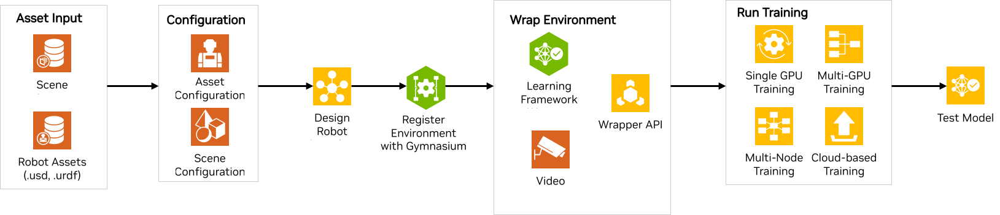
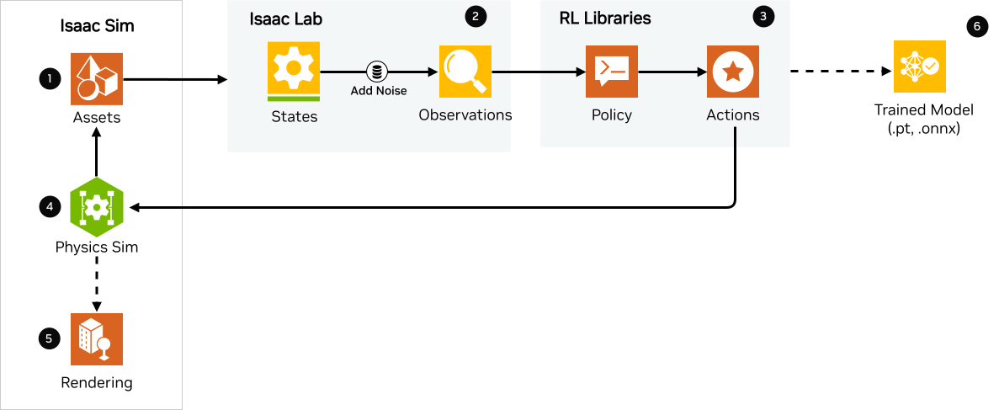
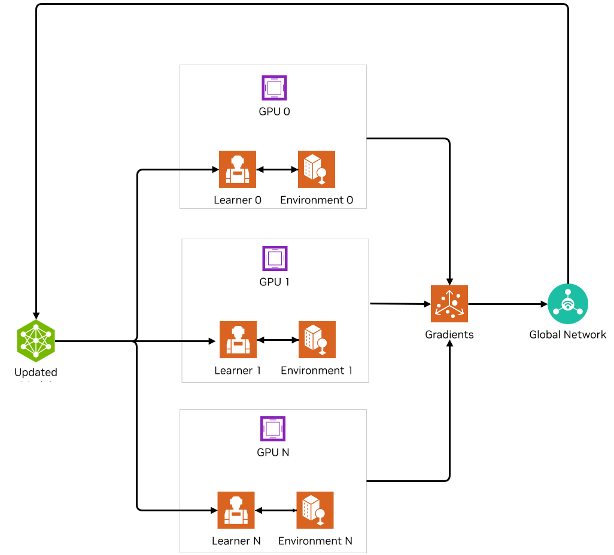
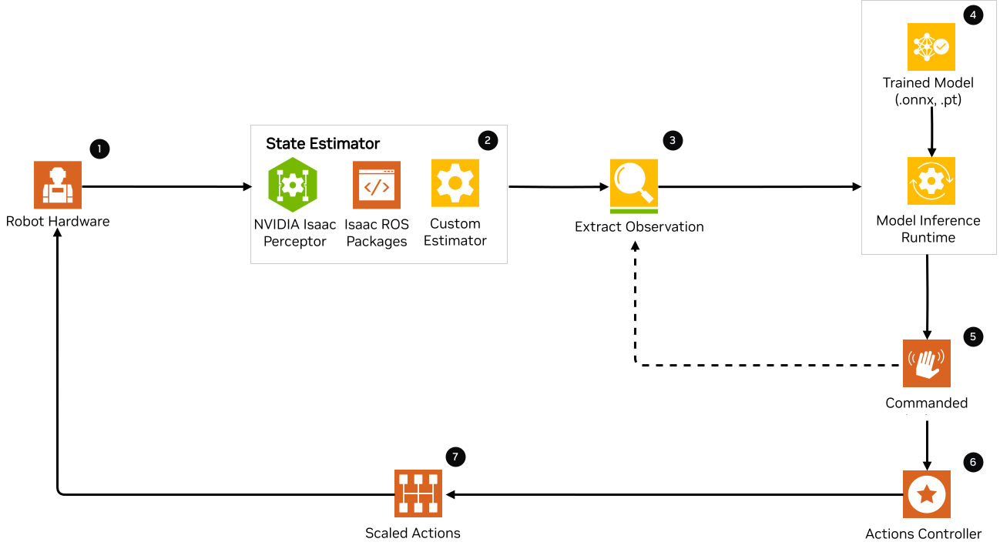

# 참조 아키텍처

이 문서에서는 Isaac Lab과 Isaac Sim을 사용한 엔드-투-엔드 로봇 학습 과정에 대한 개요를 제시합니다. 이는 학습 및 배포 워크플로의 주요 구성 요소를 강조하는 참조 아키텍처를 통해 보여집니다. 훈련부터 실제 세계에서 훈련된 모델을 배포하는 전체 애플리케이션 개발 과정에 대한 포괄적이고 사용자 친화적인 가이드를 제공하며, 데모, 작동 예시 및 문서에 대한 링크도 포함됩니다.

## 이 문서는 누구를 위한 것인가요?

이 문서는 NVIDIA Isaac Lab을 사용하여 로봇 학습 분야에서 활동하는 로봇 공학 개발자와 연구자를 지원하기 위해 설계되었습니다. 연구소, 원본 장비 제조업체(OEM), 솔루션 제공업체, 솔루션 통합업체(SI), 독립 소프트웨어 공급업체(ISV) 등 다양한 대상을 포함합니다. Isaac Lab의 로봇 훈련 프레임워크와 워크플로를 활용하여 환경 설정, 작업 설계, 정책 훈련 및 테스트를 위한 기초를 마련하는 방법에 대한 지침을 제공합니다.

 

Isaac Lab의 참조 아키텍처는 다음과 같은 구성 요소로 이루어집니다:

1. [Asset Input](#ra-asset-input)
2. [Configuration - Assets & Scene](#ra-configuration)
3. [Robot Learning Task Design](#ra-robot-learning-task-design)
4. [Register with Gymnasium](#ra-register-gym)
5. [Environment Wrapping](#ra-env-wrap)
6. [Run Training](#ra-run-training)
7. [Run Testing](#ra-run-testing)

## 구성 요소

이 섹션에서는 Isaac Lab에서 샘플 참조 애플리케이션을 만들기 위한 개별 블록을 간단히 논의할 것입니다.

### 구성 요소 1 - Asset Input

Isaac Lab은 자산에 대해 URDF, MJCF XML 또는 USD 파일을 허용합니다. Isaac Lab을 사용한 훈련의 첫 번째 단계는 자산의 USD 파일과 로봇의 USD 또는 URDF 파일을 갖는 것입니다. 이는 다음과 같은 방법으로 달성할 수 있습니다:

1. Isaac Sim에서 자산 또는 로봇을 설계하고 USD 파일을 내보냅니다.
2. 원하는 소프트웨어에서 자산 또는 로봇을 설계하고 Isaac Sim 변환기를 사용하여 USD로 내보냅니다. Isaac Sim은 [CAD 컨버터](https://docs.omniverse.nvidia.com/extensions/latest/ext_cad-converter.html), [URDF 임포터](https://docs.isaacsim.omniverse.nvidia.com/latest/importer_exporter/ext_isaacsim_asset_importer_urdf.html), [MJCF 임포터](https://docs.isaacsim.omniverse.nvidia.com/latest/importer_exporter/ext_isaacsim_asset_importer_mjcf.html), [Onshape 임포터](https://docs.omniverse.nvidia.com/extensions/latest/ext_onshape.html) 등을 포함한 다양한 컨버터/임포터를 USD로 지원합니다. 자세한 내용은 [Isaac Sim 참조 아키텍처](https://docs.isaacsim.omniverse.nvidia.com/latest/introduction/reference_architecture.html)의 [자산 가져오기 섹션](https://docs.isaacsim.omniverse.nvidia.com/latest/importer_exporter/importers_exporters.html)에서 확인할 수 있습니다.
3. 이미 로봇의 URDF 또는 MJCF 파일을 가지고 있는 경우, Isaac Lab이 URDF와 MJCF XML을 직접 받아들기 때문에 USD로 변환할 필요가 없습니다.

### 구성 요소 2 - Configuration (자산 및 씬)

#### 자산 구성

로봇 및 작업에 기반한 환경 객체 등의 자산 파일을 이미 가지고 있다면, 다음 단계는 이를 Isaac Lab에 가져오는 것입니다. Isaac Lab은 자산 구성 클래스를 사용하여 파이썬으로 씬에 다양한 객체(또는 prims)를 생성합니다. 첫 번째 단계는 작업을 완료하는 데 필요한 자산의 속성을 정의하는 구성 클래스를 작성하는 것입니다. 예를 들어, 모바일 로봇의 간단한 go-to-goal 작업은 로봇 자산, 목표 자세를 시각적으로 표시하는 큐브와 같은 객체, 조명, 바닥 평면 등을 포함합니다. Isaac Lab은 이러한 자산을 구성 클래스를 통해 이해합니다. Isaac Lab은 정확한 물리적 속성과 동작을 포괄하는 물리적으로 정확한 3D 객체와 같은 다양한 sim-ready 자산을 제공합니다. 또한 [robots](https://github.com/isaac-sim/IsaacLab/tree/main/source/isaaclab_assets/isaaclab_assets) (ANYbotics Anymal, Unitree H1 휴머노이드 등)와 [센서](https://github.com/isaac-sim/IsaacLab/tree/main/source/isaaclab/isaaclab/sensors)와 같은 시뮬레이션된 디지털 세계에서 실제 세계를 나타내는 연결된 데이터 스트림도 제공합니다. 이러한 자산 구성 클래스를 제공하며, 사용자는 구성 클래스를 사용하여 자체 자산도 정의할 수 있습니다.

[Articulation과 ArticulationCfg 클래스 작성 방법](https://isaac-sim.github.io/IsaacLab/main/source/how-to/write_articulation_cfg.html)에 대한 튜토리얼을 따라하세요.

#### 씬 구성

개별 자산 구성이 주어지면, 다음 단계는 모든 자산을 씬에 함께 배치하는 것입니다. 씬 구성은 작업과 시각화에 필요한 모든 자산을 씬에 초기화하는 간단한 구성 클래스입니다. 이는 [Cartpole 예시 씬 구성](https://isaac-sim.github.io/IsaacLab/main/source/tutorials/02_scene/create_scene.html#scene-configuration)의 예시로, 카트폴, 바닥 평면 및 돔 조명을 포함합니다.

### 구성 요소 3 - Robot Learning Task Design

이제 작업에 대한 씬을 가지고 있지만, 로봇 학습 작업을 정의해야 합니다. 여기서는 [강화 학습 (RL)](https://www.andrew.cmu.edu/course/10-703/textbook/BartoSutton.pdf) 알고리즘에 초점을 맞춥니다. 에이전트가 수행할 RL 작업을 정의합니다. RL 작업은 현재 상태와 상호작용하는 환경을 고려하여 선택적 결정을 내리는 확률적 의사결정 과정인 마르코프 결정 프로세스(MDP)로 정의됩니다. 환경은 에이전트의 현재 상태 또는 관측치를 제공하고, 에이전트가 제공하는 행동을 실행합니다. 환경은 다음 상태, 행동을 취함으로 인한 보상, 종료 플래그 및 현재 에피소드에 대한 정보를 제공하여 에이전트에 응답합니다. 따라서 MDP formulation(환경)의 다양한 구성 요소(상태, 행동, 보상, 리셋, 종료 등)는 사용자에 의해 정의되어야 에이전트가 주어진 작업을 수행할 수 있습니다.

Isaac Lab에서는 환경을 설계하기 위한 두 가지 다른 워크플로를 제공합니다.

#### 관리자 기반

이 워크플로는 모듈식이므로, 환경은 관측치 계산, 행동 적용, 랜덤화 적용 등의 다양한 측면을 처리하는 개별 구성 요소(또는 관리자)로 분해됩니다. 사용자는 각 구성 요소에 대한 다양한 구성 클래스를 정의합니다.

- RL 작업에는 다음과 같은 구성 클래스가 있어야 합니다:
  - 관찰 설정(Config): 작업에 대한 에이전트의 관측치를 정의합니다.
  - 행동 설정(Config): 에이전트의 행동 유형, 즉 에이전트의 출력이 로봇의 제어 입력에 어떻게 매핑되는지를 정의합니다.
  - 보상 설정(Config): 작업에 대한 보상 함수를 정의합니다.
  - 종료 설정(Config): 에피소드의 종료 조건 또는 작업이 완료되는 시점을 정의합니다.
  - 선택 사항으로 이벤트 설정(Config)과 같은 다른 구성 클래스를 추가할 수 있습니다. 이는 에이전트와 환경에 대한 랜덤화 및 노이즈화 집합을 정의하며, [커리큘럼 학습](https://arxiv.org/abs/2109.11978)이 필요한 작업을 위한 커리큘럼 설정(Config)과, 게임패드 컨트롤러와 같은 컨트롤러/세트포인트 제어에서 입력이 오는 작업을 위한 명령 설정(Config)도 포함할 수 있습니다.

#### 직접 기반

이 워크플로에서는 관측치 계산, 행동 적용, 보상 계산을 담당하는 단일 클래스를 구현합니다. 이를 통해 환경 로직에 대한 직접적인 제어가 가능합니다.

사용자는 Isaac Lab의 사전 구성된 환경의 큰 스위트에서 선택하거나, 자체 환경을 정의할 수 있습니다. 두 워크플로에 대한 보다 기술적인 정보는 [문서](https://isaac-sim.github.io/IsaacLab/main/source/overview/core-concepts/task_workflows.html)를 참조하세요.

RL 작업을 설계하는 것 외에도, 에이전트의 모델인 신경망 정책과 가치 함수를 설계해야 합니다. RL 에이전트를 훈련시켜 작업을 해결하도록 하려면, 훈련을 위한 하이퍼파라미터(에포크 수, 학습률 등)와 정책/가치 모델 아키텍처를 정의해야 합니다. 이는 사용하려는 RL 라이브러리 특유의 훈련 구성 파일에서 정의됩니다. 예를 들어, [RSL-RL](https://github.com/isaac-sim/IsaacLab/blob/main/source/isaaclab_tasks/isaaclab_tasks/manager_based/locomotion/velocity/config/anymal_b/agents/rsl_rl_ppo_cfg.py)의 Anymal-B용 설정을 참조하세요.

### 구성 요소 4 - Gymnasium에 등록

다음 단계는 환경을 등록하여 고유한 환경 이름을 사용하여 환경을 생성할 수 있도록 gymnasium 레지스트리에 등록하는 것입니다. 등록은 다양한 RL 알고리즘과 실험에서 환경에 접근하고 재사용할 수 있게 하는 방법입니다. 이는 RL 커뮤니티에서 흔히 사용됩니다. [환경 등록](https://isaac-sim.github.io/IsaacLab/main/source/tutorials/03_envs/register_rl_env_gym.html) 튜토리얼을 따라 직접 환경을 등록하는 방법에 대해 자세히 알아보세요.

### 구성 요소 5 - 환경 래핑

RL 작업을 실행하는 동안 환경 자체를 변경하지 않고 환경의 동작을 변경하고 싶을 수 있습니다. 예를 들어, 관측치 또는 보상을 수정하는 함수를 만들거나, 비디오를 기록하거나, 시간 제한을 적용하고 싶을 수 있습니다. Isaac Lab은 API를 활용합니다.
다음은 제공된 영어 Markdown 문서를 한국어로 번역한 내용입니다. 코드 블록 내 주석은 한국어로 번역했으며, 나머지 내용은 모두 한국어로 자연스럽게 표현했습니다. 마크다운 구조, 링크, 이미지 등은 원본을 그대로 유지했습니다.

[gymnasium.Wrapper](https://gymnasium.farama.org/api/wrappers/table/) 클래스를 통해 시뮬레이션된 환경과의 인터페이스를 생성하는 데 사용할 수 있습니다.

일부 래퍼는 다음과 같습니다:

* [Video Wrappers](https://isaac-sim.github.io/IsaacLab/main/source/how-to/wrap_rl_env.html#wrapper-for-recording-videos)
* [RL Libraries Wrappers](https://isaac-sim.github.io/IsaacLab/main/source/how-to/wrap_rl_env.html#wrapper-for-learning-frameworks)

대부분의 RL 라이브러리는 자체적인 환경 인터페이스의 변형을 기대합니다. 이는 각 라이브러리가 필요로 하는 데이터 유형이 다르다는 의미입니다. Isaac Lab은 사용자가 사용하고 싶은 RL 라이브러리가 기대하는 인터페이스로 환경을 변환하는 자체 래퍼를 제공합니다. 이러한 래퍼는 다음에서 확인할 수 있습니다:
[`isaaclab_rl`](../../api/lab_rl/isaaclab_rl.md#module-isaaclab_rl)

[전체 목록](https://gymnasium.farama.org/api/wrappers/#gymnasium.Wrapper)의 기타 래퍼 API를 확인하세요. 이러한 래퍼가 어떻게 작동하는지에 대한 자세한 내용은 [Wrapping environments](https://isaac-sim.github.io/IsaacLab/main/source/how-to/wrap_rl_env.html#how-to-env-wrappers) 문서를 참조하세요.

#### 자신의 래퍼 추가하기

Isaac Lab utils 래퍼 모듈에 자신의 래퍼를 추가하여 정의할 수 있습니다. 자세한 내용은 [GitHub 페이지에서 wrapping environments](https://isaac-sim.github.io/IsaacLab/main/source/how-to/wrap_rl_env.html#adding-new-wrappers)를 참조하세요.

### 컴포넌트 6 - 훈련 실행

마지막으로, RL 에이전트의 훈련을 실행하는 단계입니다. Isaac Lab은 모델 훈련(GPU 기반 훈련)을 위해 네 가지 인기 있는 RL 라이브러리를 활용하는 스크립트를 제공합니다:

* [StableBaselines3](https://stable-baselines3.readthedocs.io/en-master/)
* [RSL-RL](https://github.com/leggedrobotics/rsl_rl)
* [RL-Games](https://github.com/Denys88/rl_games)
* [SKRL](https://skrl.readthedocs.io/en-latest/)

#### 참고 사항
Isaac Lab은 이러한 RL 라이브러리의 구현을 제공하지 않습니다. 이들은 다양한 저자에 의해 이미 구현되어 있습니다. 우리는 RL 라이브러리를 위한 환경과 프레임워크 래퍼를 제공합니다.

제공된 알고리즘의 다른 버전이나 자신만의 학습 라이브러리를 통합하고 싶다면, 다음 지침을 따를 수 있습니다:
[이러한 지침](https://isaac-sim.github.io/IsaacLab/main/source/how-to/add_own_library.html)

#### 단일 GPU 훈련

Isaac Lab은 RL 훈련 속도를 높이기 위해 대량의 병렬 환경을 지원하며, 모델을 훈련하기 위한 풍부한 데이터를 제공합니다. 단일 GPU 훈련에서 Isaac Sim과 Isaac Lab에서의 작동 방식은 다음과 같습니다:

1. **Isaac Sim 내**

* Isaac Sim은 태스크 옵저베이션 설정 클래스에 정의된 옵저베이션을 포함하여 로봇 및 센서 상태와 같은 자산 상태를 제공합니다.

1. **Isaac Lab 내**

* 이벤트 구성 클래스에 정의된 상태에 랜덤화가 추가되어 태스크에 대한 옵저베이션을 얻습니다. 랜덤화는 선택 사항입니다. 정의되지 않은 경우, 상태는 옵저베이션이 됩니다.
* 옵저베이션은 PyTorch 텐서로 계산되며, 태스크에 따라 훈련된 모델이 제공하는 행동을 선택적으로 포함할 수 있습니다.

1. **RL 라이브러리 내**

* 옵저베이션이 정책에 전달됩니다.
* 정책은 PPO, TRPO 등과 같은 RL 라이브러리 알고리즘을 사용하여 로봇에 적절한 행동을 출력하도록 훈련됩니다.
* 행동은 로봇에 행동을 생성하는 컨트롤러의 세트포인트로 사용되거나, 태스크에 따라 로봇에 직접 사용되는 행동이 될 수 있습니다.
* 사중 보행 robot의 관절 위치와 같은 행동 유형은 관절 컨트롤러의 입력으로 사용되며, 카트폴 작업에서 속도 1 또는 0은 카트를 직접 제어하는 데 사용됩니다 등.
* 또한, 태스크 정의에 따라 이전 행동이 다음 옵저베이션 세트의 일부로 전달될 수 있습니다.

1. **Isaac Sim 내**

* 정책에서의 행동이 학습 중인 에이전트(즉, 로봇)를 제어하기 위해 Isaac Sim으로 다시 전송됩니다. 이는 물리 시뮬레이션(sim) 단계이며, 이는 Isaac Sim에서의 다음 상태를 생성하고, Isaac Lab에서 보상이 계산됩니다.

1. **렌더링**

* 씬을 렌더링하여 카메라 이미지를 생성할 수 있습니다.

그 다음 상태는 훈련이 지정된 훈련 스텝 또는 에포크에 도달할 때까지 흐름을 따라 전달됩니다. 최종 결과는 훈련된 모델/에이전트입니다.

#### 멀티-GPU 및 멀티-노드 훈련

Isaac Lab은 Linux에서 멀티-GPU 및 멀티-노드 훈련을 활용하여 훈련 규모를 확장할 수 있도록 지원합니다. 시작하려면 [멀티-GPU 훈련](https://isaac-sim.github.io/IsaacLab/main/source/features/multi_gpu.html#multi-gpu-training)과 [멀티-노드 훈련](https://isaac-sim.github.io/IsaacLab/main/source/features/multi_gpu.html#multi-node-training) 튜토리얼을 따르세요.

#### 클라우드 기반 훈련

Isaac Lab은 [Isaac Automator](https://github.com/isaac-sim/IsaacAutomator)와 함께 공용 클라우드에 배포될 수 있습니다. 현재 AWS, GCP, Azure 및 알리바바 클라우드가 지원됩니다. [클라우드에서 Isaac Lab 실행 방법](https://isaac-sim.github.io/IsaacLab/main/source/setup/installation/cloud_installation.html)에 대한 튜토리얼을 따르세요.

#### 참고 사항
멀티-GPU 및 멀티-노드 작업은 [OSMO](https://developer.nvidia.com/osmo)를 통해 이질적인 환경에서 쉽게 확장할 수 있습니다. OSMO는 복잡한 멀티스테이지 및 멀티컨테이너 이질적 컴퓨팅 워크플로우를 위한 클라우드 네이티브 오케스트레이션 플랫폼입니다. Isaac Lab은 또한 Docker에서 RL 작업을 실행할 수 있는 도구를 제공합니다. 자세한 내용은 [컨테이너 배포](https://isaac-sim.github.io/IsaacLab/main/source/deployment/index.html)를 참조하세요.

### 컴포넌트 7: 테스트 실행

Isaac Lab은 환경에서 [훈련된 정책 테스트/플레이](https://isaac-sim.github.io/IsaacLab/main/source/tutorials/03_envs/run_rl_training.html#playing-the-trained-agent)를 위한 스크립트와, 훈련된 모델을 .pt에서 .jit 및 .onnx로 변환하여 배포하기 위한 함수를 제공합니다.

## 실제 로봇에 대한 배포

실제 로봇에서 훈련된 모델을 배포하려면 흐름도에서 보여지는 것이 필요합니다. 참고로, 이는 샘플 참조 아키텍처이므로 다른 애플리케이션에 맞게 조정할 수 있습니다. 먼저, [NVIDIA Jetson](https://www.nvidia.com/en-us/autonomous-machines/embedded-systems/)과 같은 필요한 센서 및 처리 컴퓨터를 갖춘 로봇이 필요합니다. 다음으로, 로봇에 대한 상태 추정기가 필요합니다. 상태 추정기는 훈련에 사용된 옵저베이션 목록을 제공할 수 있어야 합니다.

옵저베이션이 추출되면, 모델에 전달되어 모델 추론 런타임을 사용하여 행동을 전달합니다. 모델에서 전달된 명령된 행동은 행동 컨트롤러의 세트포인트로 작용합니다. 행동 컨트롤러는 스케일링된 행동을 출력하며, 이는 로봇을 제어하여 다음 상태로 이동하는 데 사용됩니다. 태스크가 완료될 때까지 이 과정이 반복됩니다.

NVIDIA Isaac 플랫폼은 상태 추정을 위한 일부 도구를 제공하며, 이는 시각적 SLAM 및 추론 엔진인 [TensorRT](https://developer.nvidia.com/tensorrt-getting-started#:~:text=NVIDIA%C2%AE%20TensorRT%E2%84%A2%20is,high%20throughput%20for%20production%20applications.) 등을 포함합니다.其他推理运行时包括[OnnxRuntime](https://onnxruntime.ai/)，直接在PyTorch模型上进行推理等。

## 요약

이 문서는 SQA 테스트를 거친 Isaac Lab에 대한 참조 아키텍처를 제시합니다. 우리는 Isaac Lab과 Isaac Sim을 사용하여 엔드 투 엔드 로봇 학습에 대한 사용자 친화적인 가이드를 제공했으며, 이는 훈련부터 실제 세계 배포까지 데모, 예시 및 문서 링크를 포함합니다.

## 시작하기 방법

로봇과 함께 Isaac Lab을 사용하는 우리의 자료를 확인하세요.

문서 및 샘플 자료 검토

* [Isaac Lab 튜토리얼](../../tutorials/index.md#tutorials)
* [NVIDIA Isaac Lab을 사용한 시뮬레이션에서의 빠른 로봇 학습 트랙](https://developer.nvidia.com/blog/fast-track-robot-learning-in-simulation-using-nvidia-isaac-lab/)
* [NVIDIA Isaac Sim 4.0과 NVIDIA Isaac Lab을 사용한 AI 및 시뮬레이션을 통한 로봇 워크플로우 강화](https://developer.nvidia.com/blog/supercharge-robotics-workflows-with-ai-and-simulation-using-nvidia-isaac-sim-4-0-and-nvidia-isaac-lab/)
* [NVIDIA Isaac Lab을 사용한 Spot 사보행 로코모션 훈련으로 시뮬-리얼 격차 해소](https://developer.nvidia.com/blog/closing-the-sim-to-real-gap-training-spot-quadruped-locomotion-with-nvidia-isaac-lab/)
* [추가 자료](https://isaac-sim.github.io/IsaacLab/main/source/refs/additional_resources.html)

주목할 만한 NVIDIA 솔루션에 대해 자세히 알아보기

* [NVIDIA OSMO를 사용한 AI 기반 로봇 개발 워크로드 규모 확장](https://developer.nvidia.com/blog/scale-ai-enabled-robotics-development-workloads-with-nvidia-osmo/)
* [파쿠르 및 기타: 시뮬레이션 기반 RL이 다리 달린 로코모션의 경계를 어떻게 확장하는지 (GTC 세션)](https://www.nvidia.com/en-us/on-demand/session/gtc24-s63140/)
* [Isaac Perceptor](https://developer.nvidia.com/isaac/perceptor)
* [Isaac Manipulator](https://developer.nvidia.com/isaac/manipulator)
