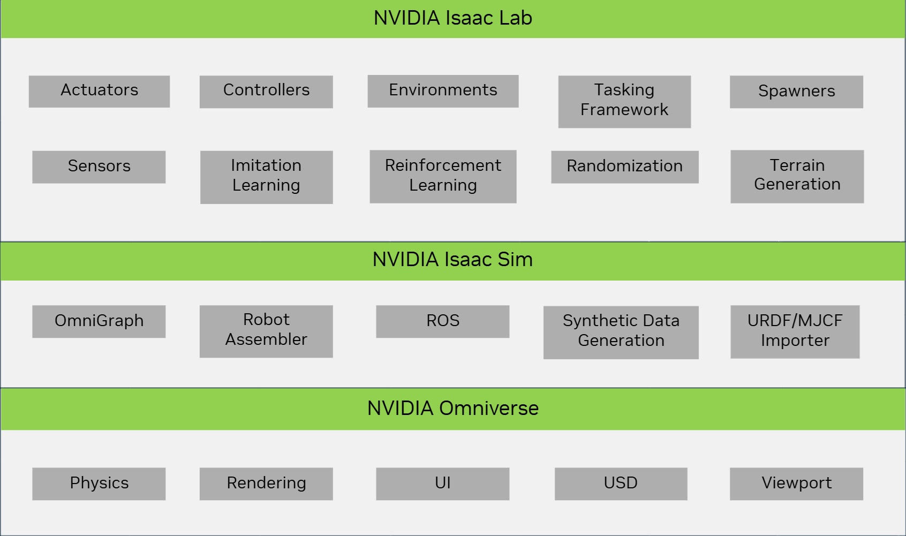

# Isaac Lab 생태계

Isaac Lab은 Isaac Sim을 기반으로 구축되어 최신 시뮬레이션 기술을 활용한 로봇 학습을 위한 통합 및 유연한 프레임워크를 제공합니다. 모듈화 및 확장성을 고려하여 설계되었으며, 로봇 공학 연구에서 일반적인 워크플로(예: RL, 시연 학습, 동작 계획)를 단순화하는 것을 목표로 합니다. 일부 사전 구축된 환경, 센서 및 작업을 포함하지만, 주요 목표는 커스텀 환경 및 로봇 학습 알고리즘을 개발하고 테스트하기 위한 오픈 소스, 통합, 사용하기 쉬운 인터페이스를 제공하는 것입니다.

Isaac Lab을 사용하려면 Isaac Sim을 설치해야 하며, Isaac Sim에는 URDF 및 MJCF 임포터, 시뮬레이션 관리자 및 ROS 기능과 같이 Isaac Lab에 종속되는 핵심 로봇 도구가 포함됩니다. Isaac Sim은 NVIDIA Omniverse 플랫폼을 기반으로 구축되어 PhysX의 고급 물리 시뮬레이션, 포토리얼리스틱 렌더링 기술, 그리고 씬 생성을 위한 Universal Scene Description(USD)을 활용합니다.

Isaac Lab은 Isaac Sim의 기능을 상속할 뿐만 아니라 로봇 학습 연구와 관련된 새로운 기능을 여러 가지 추가합니다. 예를 들어, 시뮬레이션에 액추에이터 동역학 포함, 프로시저얼 지형 생성, 그리고 인간 시연으로부터 데이터 수집 지원 등이 있습니다.

## Isaac Lab은 Isaac 생태계에서 어디에 위치합니까?

수년에 걸쳐 NVIDIA는 로봇 및 AI 분야의 여러 도구를 개발했습니다. 이러한 도구들은 GPU의 성능을 활용하여 속도와 현실감 측면에서 시뮬레이션을 가속화합니다. 시뮬레이션 기술 분야에서 큰 잠재력을 보이며 전 세계의 많은 연구자 및 기업에서 사용되고 있습니다.

[Isaac Gym](https://developer.nvidia.com/isaac-gym) [[MWG+21](../refs/bibliography.md#id12)]은 로봇 학습을 위한 고성능 GPU 기반 물리 시뮬레이션을 제공합니다. [PhysX](https://developer.nvidia.com/physx-sdk)를 기반으로 구축되었으며, 강체에 대한 GPU 가속 시뮬레이션을 지원하고 물리 시뮬레이션 데이터에 직접 접근할 수 있는 Python API를 제공합니다. 엔드 투 엔드 GPU 파이프라인을 통해 CPU 기반 물리 엔진보다 높은 프레임 레이트를 달성할 수 있습니다. 이 도구는 다리 locomotion [[RHRH22](../refs/bibliography.md#id2)] [[RHBH22](../refs/bibliography.md#id10)], 손으로 조작 [[HAM+22](../refs/bibliography.md#id13)] [[AML+22](../refs/bibliography.md#id15)], 산업 조립 [[NSA+22](../refs/bibliography.md#id14)] 등을 포함한 여러 연구 프로젝트에서 성공적으로 사용되었습니다.

Isaac Gym의 성공에도 불구하고, 이 도구는 범용 로봇 시뮬레이터로 설계되지 않았습니다. 예를 들어, 변형 객체와 강성 객체 간의 상호작용, 고해상도 렌더링, ROS 지원을 포함하지 않습니다. 이 도구는 기본 물리 엔진의 기능을 보여주기 위한 프리뷰 릴리스로 주로 설계되었습니다. [Isaac Sim](https://developer.nvidia.com/isaac-sim)의 출시와 함께 NVIDIA는 로봇 및 AI를 위한 범용 시뮬레이터를 구축하고 있으며, Isaac Gym의 기능을 Isaac Sim에 통합하고 있습니다.

[Isaac Sim](https://developer.nvidia.com/isaac-sim)은 로봇 시뮬레이션 툴킷으로, 복잡한 3D 워크플로를 통합하는 것을 목표로 하는 범용 플랫폼인 Omniverse 위에 구축되었습니다. Isaac Sim은 그래픽스 및 물리 시뮬레이션의 최신 발전을 활용하여 로봇 공학을 위한 고충실도 시뮬레이션 환경을 제공합니다. ROS/ROS2, 다양한 센서 시뮬레이션, 도메인 랜덤화 및 합성 데이터 생성 도구를 지원합니다. Isaac Sim의 타이일 렌더링 지원은 환경 전반에 걸친 벡터화된 렌더링을 가능하게 하며, [Isaac Automator](https://github.com/isaac-sim/IsaacAutomator)를 사용하여 클라우드에서 실행하는 것도 지원합니다. 전반적으로, 이는 로봇 공학자에게 강력한 도구이며 로봇 시뮬레이션 분야에서의 큰 진보를 의미합니다.

위의 두 도구가 출시됨과 함께 NVIDIA는 또한 Isaac Gym 및 Isaac Sim 위에 구축된 오픈 소스 환경 세트인 [IsaacGymEnvs](https://github.com/isaac-sim/IsaacGymEnvs)와 [OmniIsaacGymEnvs](https://github.com/isaac-sim/OmniIsaacGymEnvs)를 출시했습니다. 이러한 환경은 기본 시뮬레이터의 기능을 보여주고 로봇 학습에 대해 시뮬레이터로 무엇을 할 수 있는지의 시작점을 제공하도록 설계되었습니다. 이러한 환경은 벤치마킹에 사용될 수 있지만, 커스텀 환경 및 알고리즘을 개발하고 테스트하기 위해 설계되지 않았습니다.这就是Isaac Lab发挥作用的地方。

Isaac Lab은 Isaac Sim을 기반으로 구축되어 최신 시뮬레이션 기술을 활용한 로봇 학습을 위한 통합 및 유연한 프레임워크를 제공합니다. 모듈화 및 확장성을 고려하여 설계되었으며, 로봇 공학 연구에서 일반적인 워크플로(예: RL, 시연 학습, 동작 계획)를 단순화하는 것을 목표로 합니다. 일부 사전 구축된 환경, 센서 및 작업을 포함하지만, 주요 목표는 커스텀 환경 및 로봇 학습 알고리즘을 개발하고 테스트하기 위한 오픈 소스, 통합, 사용하기 쉬운 인터페이스를 제공하는 것입니다. Isaac Lab은 Isaac Sim의 기능을 상속할 뿐만 아니라 로봇 학습 연구와 관련된 새로운 기능을 여러 가지 추가합니다. 예를 들어, 시뮬레이션에 액추에이터 동역학 포함, 프로시저얼 지형 생성, 그리고 인간 시연으로부터 데이터 수집 지원 등이 있습니다.

Isaac Lab은 이전의 [IsaacGymEnvs](https://github.com/isaac-sim/IsaacGymEnvs), [OmniIsaacGymEnvs](https://github.com/isaac-sim/OmniIsaacGymEnvs) 및 [Orbit](https://isaac-orbit.github.io/) 프레임워크를 대체하며, Isaac Sim을 위한 단일 로봇 학습 프레임워크가 될 것입니다. 이전에 출시된 프레임워크는 더 이상 사용되지 않으며, 사용자는 Isaac Lab로 마이그레이션하기 위한 우리의 마이그레이션 가이드를 따르는 것을 권장합니다.

## Isaac Lab은 시뮬레이터입니까?

사람들이 시뮬레이터를 생각할 때 종종 [MuJoCo](https://mujoco.org/), [Bullet](https://github.com/bulletphysics/bullet3), 및 [Flex](https://developer.nvidia.com/flex)와 같은 일반적으로 사용 가능한 엔진들을 생각합니다. 이러한 엔진들은 강력하며 numerosi 연구 프로젝트에서 사용되었습니다. 그러나 이들은 로봇 공학을 위한 범용 시뮬레이터로 설계되지 않았습니다. 오히려 이들은 강체 및 변형체의 동역학을 시뮬레이션하는 데 사용되는 주로 물리 엔진이며, 시뮬레이션을 시각화하기 위한 기본 렌더링 기능과 다양한 씬 설명 형식의 파싱 기능과 함께 제공됩니다.

최근의 여러 연구에서는 이러한 물리 엔진과 다른 렌더링 엔진을 결합하여 보다 완전한 시뮬레이션 환경을 제공합니다. 이들은 물리 및 렌더링 엔진에 대한 읽기 및 쓰기를 허용하는 API를 포함합니다. 일부 사례에서는 ROS 및 하드웨어-인-더-루프 시뮬레이션을 지원하여 보다 로봇 특화된 애플리케이션을 가능하게 합니다. 이러한 예로는 [AirSim](https://microsoft.github.io/AirSim/), [DoorGym](https://github.com/PSVL/DoorGym/), [ManiSkill](https://github.com/haosulab/ManiSkill), [ThreeDWorld](https://www.threedworld.org/) 및 마지막으로 [Isaac Sim](https://developer.nvidia.com/isaac-sim)이 있습니다.

핵심적으로, Isaac Lab은 **로봇 시뮬레이터가 아니라** Isaac Sim 위에 로봇 학습 애플리케이션을 구축하기 위한 프레임워크입니다. 이와 동등한 예로는 [RoboSuite](https://robosuite.ai/)가 있으며, 이는 [MuJoCo](https://mujoco.org/) 위에 구축되고 고정 기반 로봇에 특화되어 있습니다. 다른 예로는 [MuJoCo Playground](https://playground.mujoco.org/) 및 [Isaac Gym](https://developer.nvidia.com/isaac-gym)이 있으며, 각각 [MJX](https://mujoco.readthedocs.io/en/stable/mjx.html) 및 [PhysX](https://developer.nvidia.com/physx-sdk)를 사용합니다. 이들은 개별 작업에 대한 별도의 독립형 구현이 있는 여러 사전 구축된 작업을 포함합니다. 이는 좋은 시작점(그리고 종종 편리할 수 있음)이지만, 다양한 작업 구현 전반에 걸쳐 코드 반복이 발생할 수 있으며, 이는 더 큰 프로젝트 및 팀에 대한 코드 재사용을 감소시킬 수 있습니다.

Isaac Lab의 주요 목표는 로봇 학습에 필요한 다양한 도구 및 기능을 포함하면서 사용하기 쉽고 확장 가능한 통합 프레임워크를 제공하는 것입니다. 로봇 공학 연구에서 일반적인 많은 요구사항을 단순화하는 설계 패턴을 포함합니다. 예를 들어, 다양한 주파수로 센서 시뮬레이션, 데이터 수집을 위한 다양한 텔레오퍼레이션 인터페이스 연결, 정책 학습을 위한 액션 스페이스 전환, 구성 관리를 위한 Hydra 사용, 다양한 학습 라이브러리 지원 등이 있습니다. Isaac Lab은 *관리자 기반(모듈화된)* 및 *직접(Isaac Gym과 유사한 단일 스크립트)* 패턴을 사용하여 작업을 설계하는 것을 지원하며, 사용자가 자신의 사용 사례에 가장 적합한 접근 방식을 선택할 수 있도록 합니다. 각 패턴에 대해 Isaac Lab은 벤치마킹 및 연구에 사용할 수 있는 여러 사전 구축된 작업을 포함합니다.

## 왜 Isaac Lab을 사용해야 합니까?

Isaac Lab은 커뮤니티가 벤치마크 및 로봇 학습 시스템 설계를 위한 공동 이니셔티브를 향해 진전을 이끌어내는 오픈 소스 플랫폼을 제공합니다. 이를 통해 기존 구성 요소 및 알고리즘을 재사용하고 서로의 작업을 기반으로 구축할 수 있습니다.这样做不仅可以节省时间和精力，还能让我们专注于研究中更重要的方面。我们希望Isaac Lab能成为机器人学习研究的事实标准平台，并利用Isaac Sim构建一个环境“动物园”。随着框架的成熟，我们预见它将从NVIDIA内部开发及合作伙伴的最新仿真发展以及机器人学研究中获益良多。

我们已经与大学和研究机构的实验室合作，将他们的工作融入Isaac Lab，并希望社区中的其他人也能加入我们的这一努力。如果您有兴趣为Isaac Lab做出贡献，请与我们联系。
