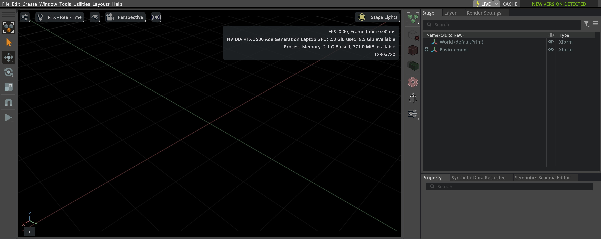

# 에셋 캐싱

Isaac Lab에서 사용되는 에셋은 클라우드의 AWS S3 버킷에 호스트됩니다.
에셋 로딩 시간은 네트워크 연결 상태 및 지리적 위치에 따라 달라질 수 있습니다.
경우에 따라서는 AWS 서버에서 에셋을 가져올 때 로딩 시간이 길어질 수 있습니다.

각 실행 시 에셋이 몇 분 동안 로드되는 문제를 겪는 경우,
아래 단계에 따라 에셋 캐싱을 활성화하는 것을 권장합니다.

먼저, Isaac Sim 애플리케이션을 시작합니다:

### Linux

```bash
./isaaclab.sh -s
```

### Windows

```batch
isaaclab.bat -s
```

Isaac Lab 또는 Isaac Sim 앱의 오른쪽 상단에 `CACHE:` 라고 표시된 아이콘을 찾으세요.
`HUB NOT DETECTED` 또는 `NEW VERSION DETECTED`와 같은 메시지가 보일 수 있습니다.

이 메시지를 클릭하여 [Hub](https://docs.omniverse.nvidia.com/utilities/latest/cache/hub-workstation.html)를 활성화하세요.
Hub는 Isaac Lab 에셋의 로컬 캐시를 자동으로 관리하여, 이후 실행 시 AWS에서 다운로드하는 대신 캐시된 파일을 사용합니다.



Hub는 캐시된 에셋에 대한 제어와 관리를 향상시켜, 인터넷이 제한적이거나 간헐적인 환경에서도 워크플로우를 더 빠르고 안정적으로 만듭니다.

#### 주의 사항
Isaac Lab을 처음 실행할 때는 에셋을 여전히 클라우드에서 가져와야 하므로 로딩 시간이 길어질 수 있습니다.
한 번 캐시된 후에는 후속 실행 시 로딩 시간이 크게 단축됩니다.

## Nucleus

Isaac Sim 4.5 이전 버전에서는 로컬 Nucleus 인스턴스를 포함한 설정에서도 에셋이 Omniverse Nucleus 서버를 통해 액세스되었습니다.

#### 경고
Isaac Sim 4.5부터 Omniverse Nucleus 서버와 Omniverse Launcher는 더 이상 지원되지 않습니다.
기존 Nucleus 설정은 계속 작동하므로, 이미 로컬 Nucleus 서버를 구성해 두신 경우 그대로 사용하실 수 있습니다.
