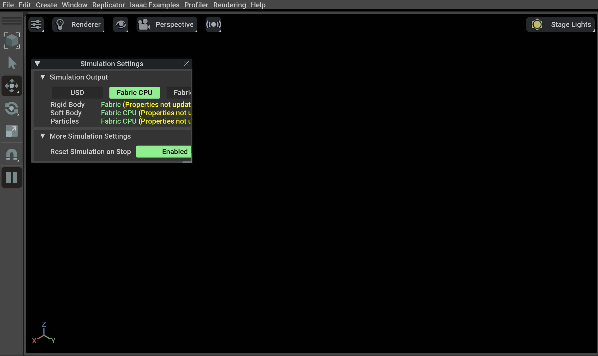
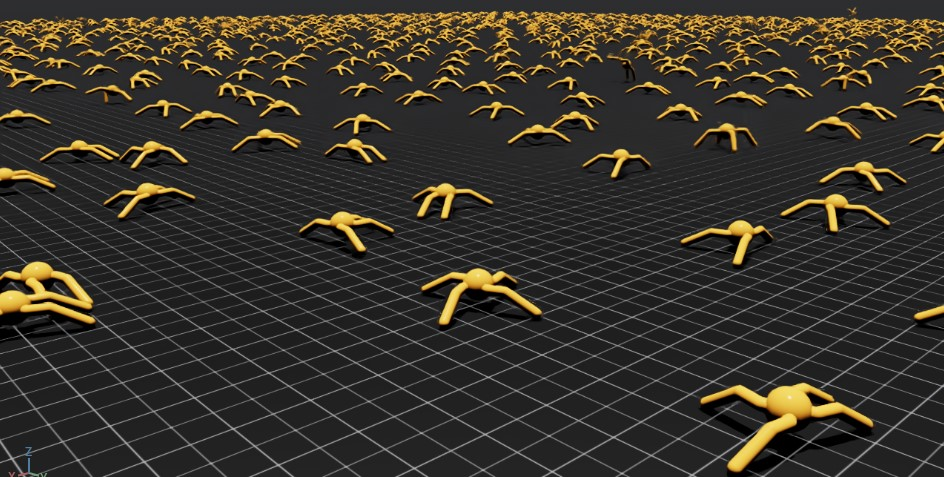

<a id="isaaclab-pip-installation"></a>

# Isaac Sim Pip 패키지를 사용한 설치

다음 단계는 먼저 pip를 사용하여 Isaac Sim을 설치한 후, Isaac Lab을 소스 코드로 설치하는 것입니다.

#### 주의
pip를 사용하여 Isaac Sim을 설치하려면 GLIBC 2.35+ 버전 호환성이 필요합니다.
시스템의 GLIBC 버전을 확인하려면 명령 `ldd --version`을 사용하세요.

이것은 일부 Linux 배포판과의 호환성 문제를 일으킬 수 있습니다. 예를 들어, Ubuntu 20.04 LTS는 기본적으로 GLIBC 2.31을 사용합니다.
호환성 문제가 발생하면, [Isaac Sim 바이너리 설치](binaries_installation.md#isaaclab-binaries-installation) 방법을 따르는 것을 권장합니다.

#### 참고
[Visual Studio Code 설정](../../overview/developer-guide/vs_code.md#setup-vs-code)을 나중에 계획 중이라면,
[Isaac Sim 바이너리 설치](binaries_installation.md#isaaclab-binaries-installation) 방법을 따르는 것을 권장합니다.

## Isaac Sim 설치

Isaac Sim 4.0부터는 pip를 사용하여 Isaac Sim을 설치할 수 있습니다.
이 방식은 Isaac Sim 바이너리를 다운로드하지 않고도 Isaac Sim 설치를 더 쉽게 해줍니다.
문제가 발생하는 경우,
[Isaac Sim 포럼](https://docs.isaacsim.omniverse.nvidia.com/latest/common/feedback.html)으로 보고해 주세요.

#### 주의
Windows에서는 [긴 경로 지원 활성화](https://learn.microsoft.com/en-us/windows/win32/fileio/maximum-file-path-limitation?tabs=registry#enable-long-paths-in-windows-10-version-1607-and-later)가 필요할 수 있습니다.
OS 제한으로 인한 설치 오류를 방지하기 위함입니다.

### Python 환경 준비

전용 Python 환경을 생성하는 것이 **매우 강력히 권장됩니다**. 이는 다음과 같은 이유로 도움이 됩니다.

- **시스템 Python 또는 다른 프로젝트와의 충돌 방지**.
- **의존성 격리 유지**, 이를 통해 다른 프로젝트의 패키지 업그레이드 또는 실험이 Isaac Sim을 깨트리지 않게 함.
- **다양한 환경 쉽게 관리** – 서로 다른 의존성 버전을 가진 설정들을 위한 여러 환경을 쉽게 관리 가능.
- **재현성 간소화** – 현재 프로젝트에 필요한 패키지만 포함된 환경으로, 동료와 세팅을 공유하거나 다른 기계에서 실행하기 쉬워짐.

가상 환경을 생성하기 위해 다양한 패키지 관리자를 선택할 수 있습니다.

- **UV**: 빠르고 안전하며 현대적인 Python용 패키지 관리자.
- **Conda**: 크로스 플랫폼, 언어에 구애받지 않는 Python용 패키지 관리자.
- **venv**: Python에서 가상 환경을 생성하기 위한 표준 라이브러리.

다음 지침은 Isaac Sim 5.X용이며, Python 3.11이 필요합니다.
Isaac Sim 4.5를 설치하려면 지침을 수정하여 Python 3.10을 사용하도록 하세요.

- 패키지 관리자 중 하나를 사용하여 가상 환경을 생성:

  ### Conda 환경

  conda를 설치하려면 다음 [지침](https://docs.conda.io/projects/conda/en/latest/user-guide/install/index.html)을 따르세요.
  다음 명령으로 Isaac Lab 환경을 생성할 수 있습니다.

  경량이며 자원 효율적인 환경 관리 시스템인 [Miniconda](https://www.anaconda.com/docs/getting-started/miniconda/main/) 사용을 권장합니다.
  ```bash
  conda create -n env_isaaclab python=3.11
  conda activate env_isaaclab
  ```

  ### venv 환경

  표준 라이브러리를 사용하여 가상 환경을 생성하려면 다음 명령을 사용할 수 있습니다:

  ### Linux

  ```bash
  # python3.11을 사용하여 env_isaaclab라는 이름의 가상 환경 생성
  python3.11 -m venv env_isaaclab
  # 가상 환경 활성화
  source env_isaaclab/bin/activate
  ```

  ### Windows

  ```batch
  :: python3.11을 사용하여 env_isaaclab라는 이름의 가상 환경 생성
  python3.11 -m venv env_isaaclab
  :: 가상 환경 활성화
  env_isaaclab\Scripts\activate
  ```

  ### UV 환경 (실험적)

  `uv`를 설치하려면 다음 [지침](https://docs.astral.sh/uv/getting-started/installation/)을 따르세요.

  #### 참고
  `uv venv`로 생성된 가상 환경에는 `pip`가 **포함되지 않습니다**.
  Isaac Lab 설치는 `pip`가 필요하므로, 환경 활성화 후에 수동으로 설치해야 합니다.

  다음 명령으로 Isaac Lab 환경을 생성할 수 있습니다:

  ### Linux

  ```bash
  # python3.11과 pip를 사용하여 env_isaaclab라는 이름의 가상 환경 생성
  uv venv --python 3.11 --seed env_isaaclab
  # 가상 환경 활성화
  source env_isaaclab/bin/activate
  ```

  ### Windows

  ```batch
  :: python3.11과 pip를 사용하여 env_isaaclab라는 이름의 가상 환경 생성
  uv venv --python 3.11 --seed env_isaaclab
  :: 가상 환경 활성화
  env_isaaclab\Scripts\activate
  ```
- 최신 pip 버전이 설치되어 있는지 확인하세요. 가상 환경 내부에서 다음 명령을 실행하여 pip를 업데이트하세요:

  ### Linux

  ```bash
  pip install --upgrade pip
  ```

  ### Windows

  ```batch
  python -m pip install --upgrade pip
  ```

### 종속성 설치

#### 참고
가상 환경을 UV로 생성한 경우, 다음 명령에서 `pip` 대신 `uv pip`를 사용하세요.

- Isaac Sim pip 패키지 설치:
  ```none
  pip install "isaacsim[all,extscache]==5.1.0" --extra-index-url https://pypi.nvidia.com
  ```
- 시스템 아키텍처와 일치하는 CUDA 지원 PyTorch 빌드 설치:

  ### Linux (x86_64)

  ```bash
  pip install -U torch==2.7.0 torchvision==0.22.0 --index-url https://download.pytorch.org/whl/cu128
  ```

  ### Windows (x86_64)

  ```bash
  pip install -U torch==2.7.0 torchvision==0.22.0 --index-url https://download.pytorch.org/whl/cu128
  ```

  ### Linux (aarch64)

  ```bash
  pip install -U torch==2.9.0 torchvision==0.24.0 --index-url https://download.pytorch.org/whl/cu130
  ```

  #### 참고
  aarch64에서 Isaac Lab을 설치한 후 다음과 같은 경고가 나타날 수 있습니다:
  ```none
  ERROR: ld.so: object '...torch.libs/libgomp-XXXX.so.1.0.0' cannot be preloaded: ignored.
  ```

  이는 시스템과 PyTorch의 `libgomp`(GNU OpenMP) 라이브러리가 모두 사전 로드되었기 때문에 발생합니다.
  Isaac Sim은 **시스템** OpenMP 런타임을 기대하지만, PyTorch는 때때로 자체 번들을 포함합니다.

  이를 해결하려면 기존 `LD_PRELOAD`를 해제하고 시스템 라이브러리만 사용하도록 설정하세요:
  ```bash
  unset LD_PRELOAD
  export LD_PRELOAD="$LD_PRELOAD:/lib/aarch64-linux-gnu/libgomp.so.1"
  ```

 これにより、Isaac Sim과 Isaac Labの両方に正しい`libgomp`ライブラリがプリロードされるようになり、実行時のプリロード警告がなくなります。

### Isaac Sim 설치 확인

- 가상 환경이 활성화되어 있는지 확인하세요 (해당하는 경우)
- 시뮬레이터가 예상대로 실행되는지 확인:
  ```bash
  # 참고: "--help" 인수를 전달하여 가능한 모든 인수를 볼 수 있습니다.
  isaacsim
  ```
- 특정 경험 파일과 함께 실행하는 것도 가능합니다:
  ```bash
  # 경험 파일은 절대 경로일 수도 있고, isaacsim/apps 또는 omni/apps에서 상대 경로로 검색될 수도 있습니다.
  isaacsim isaacsim.exp.full.kit
  ```

#### 참고
Isaac Sim을 처음 실행할 때, 모든 종속 확장 기능이 레지스트리에서 다운로드됩니다.
이 과정은 경험 파일을 처음 실행할 때 최대 10분 이상 소요될 수 있으며, 필수입니다.
확장 기능이 다운로드된 후, 동일한 경험 파일을 사용한 연속 실행에서는 캐시된 확장 기능을 사용합니다.

#### 주의
첫 실행 시 사용자에게 Nvidia Omniverse 라이선스 계약서 수락을 촉구합니다.
EULA를 수락하려면 아래 메시지에 `Yes`라고 응답하세요:

```bash
By installing or using Isaac Sim, I agree to the terms of NVIDIA OMNIVERSE LICENSE AGREEMENT (EULA)
in https://docs.isaacsim.omniverse.nvidia.com/latest/common/NVIDIA_Omniverse_License_Agreement.html

Do you accept the EULA? (Yes/No): Yes
```

위 지침을 따랐음에도 시뮬레이터가 실행되지 않거나崩溃하는 경우,
잘못된 구성이 있음을 의미합니다. 디버그 및 문제 해결을 위해
Isaac Sim
[문서](https://docs.omniverse.nvidia.com/dev-guide/latest/linux-troubleshooting.html)와
[Isaac Sim 포럼](https://docs.isaacsim.omniverse.nvidia.com/latest/common/feedback.html)을 참조하세요.

## Isaac Lab 설치

### Isaac Lab 복제

#### 참고
프로젝트에 기여하기 위해 Isaac Lab 저장소의 [포크](https://github.com/isaac-sim/IsaacLab/fork)를 만드는 것을 권장하지만,
프레임워크를 사용하는 데는 필수가 아닙니다. 포크를 만든 경우, 다음 지침에서 `isaac-sim`을 사용자 이름으로 바꾸세요.

Isaac Lab 저장소를 프로젝트 워크스페이스로 복제하세요:

### SSH

```bash
git clone git@github.com:isaac-sim/IsaacLab.git
```

### HTTPS

```bash
git clone https://github.com/isaac-sim/IsaacLab.git
```

Linux 및 Windows용으로 각각 확장 기능을 관리하는 유틸리티를 제공하는
[isaaclab.sh](https://github.com/isaac-sim/IsaacLab/blob/main/isaaclab.sh)와
[isaaclab.bat](https://github.com/isaac-sim/IsaacLab/blob/main/isaaclab.bat) 헬퍼 실행 파일을 제공합니다.

### Linux

```text
./isaaclab.sh --help

usage: isaaclab.sh [-h] [-i] [-f] [-p] [-s] [-t] [-o] [-v] [-d] [-n] [-c] -- Utility to manage Isaac Lab.

optional arguments:
   -h, --help           Display the help content.
   -i, --install [LIB]  Install the extensions inside Isaac Lab and learning frameworks (rl_games, rsl_rl, sb3, skrl) as extra dependencies. Default is 'all'.
   -f, --format         Run pre-commit to format the code and check lints.
   -p, --python         Run the python executable provided by Isaac Sim or virtual environment (if active).
   -s, --sim            Run the simulator executable (isaac-sim.sh) provided by Isaac Sim.
   -t, --test           Run all python pytest tests.
   -o, --docker         Run the docker container helper script (docker/container.sh).
   -v, --vscode         Generate the VSCode settings file from template.
   -d, --docs           Build the documentation from source using sphinx.
   -n, --new            Create a new external project or internal task from template.
   -c, --conda [NAME]   Create the conda environment for Isaac Lab. Default name is 'env_isaaclab'.
   -u, --uv [NAME]      Create the uv environment for Isaac Lab. Default name is 'env_isaaclab'.
```

### Windows

```text
isaaclab.bat --help

usage: isaaclab.bat [-h] [-i] [-f] [-p] [-s] [-v] [-d] [-n] [-c] -- Isaac Lab 관리 유틸리티.

optional arguments:
   -h, --help           도움말 내용 표시.
   -i, --install [LIB]  Isaac Lab과 학습 프레임워크(rl_games, rsl_rl, sb3, skrl)의 확장을 추가 의존성으로 설치합니다. 기본값은 'all'입니다.
   -f, --format         코드 포맷팅 및 린트 검사를 위해 pre-commit 실행.
   -p, --python         Isaac Sim 또는 가상 환경(활성 상태인 경우)에서 제공하는 파이썬 실행 파일 실행.
   -s, --sim            Isaac Sim에서 제공하는 시뮬레이터 실행 파일(isaac-sim.bat) 실행.
   -t, --test           모든 파이썬 pytest 테스트 실행.
   -v, --vscode         템플릿에서 VSCode 설정 파일 생성.
   -d, --docs           Sphinx를 사용하여 소스에서 문서 빌드.
   -n, --new            템플릿에서 새로운 외부 프로젝트 또는 내부 작업 생성.
   -c, --conda [NAME]   Isaac Lab용 conda 환경 생성. 기본 이름은 'env_isaaclab'.
   -u, --uv [NAME]      Isaac Lab용 uv 환경 생성. 기본 이름은 'env_isaaclab'.
```

### 설치

- `apt`를 사용하여 의존성 설치 (Linux 전용):
  ```bash
  # 이 의존성은 Windows에서 사용할 수 없는 robomimic에 필요합니다.
  sudo apt install cmake build-essential
  ```
- `source` 디렉터리의 모든 확장을 반복하고 pip를 사용해( `--editable` 플래그 포함) 설치하는 설치 명령을 실행:

  ### Linux

  ```bash
  ./isaaclab.sh --install # 또는 "./isaaclab.sh -i"
  ```

  ### Windows

  ```batch
  isaaclab.bat --install :: 또는 "isaaclab.bat -i"
  ```

  기본적으로 위 명령은 **모든** 학습 프레임워크를 설치합니다. 여기에는
  `rl_games`, `rsl_rl`, `sb3`, `skrl`, `robomimic`이 포함됩니다.

  특정 프레임워크만 설치하려면 프레임워크 이름을 인수로 전달할 수 있습니다.
  예를 들어, `rl_games` 프레임워크만 설치하려면 다음 명령을 실행할 수 있습니다:

  ### Linux

  ```bash
  ./isaaclab.sh --install rl_games  # 또는 "./isaaclab.sh -i rl_games"
  ```

  ### Windows

  ```batch
  isaaclab.bat --install rl_games :: 또는 "isaaclab.bat -i rl_games"
  ```

  유효한 옵션은 `all`, `rl_games`, `rsl_rl`, `sb3`, `skrl`, `robomimic`,
  그리고 `none`입니다. `none`이 전달되면 학습 프레임워크가 설치되지 않습니다.

### Isaac Lab 설치 검증

설치가 성공했는지 확인하려면 저장소 최상위에서 다음 명령을 실행하세요:

### Linux

```bash
# 옵션 1: isaaclab.sh 실행 파일 사용
# 참고: 이는 번들 파이썬과 가상 환경 모두에 적용됩니다.
./isaaclab.sh -p scripts/tutorials/00_sim/create_empty.py

# 옵션 2: 가상 환경의 파이썬 사용
python scripts/tutorials/00_sim/create_empty.py
```

### Windows

```batch
:: 옵션 1: isaaclab.bat 실행 파일 사용
:: 참고: 이는 번들 파이썬과 가상 환경 모두에 적용됩니다.
isaaclab.bat -p scripts\tutorials\00_sim\create_empty.py

:: 옵션 2: 가상 환경의 파이썬 사용
python scripts\tutorials\00_sim\create_empty.py
```

위 명령은 시뮬레이터를 실행하고 검은색 뷰포트 창을 표시해야 합니다.
터미널에서 `Ctrl+C`를 눌러 스크립트를 종료할 수 있습니다.
Windows 머신에서는 명령 프롬프트에서 `Ctrl+Break` 또는 `Ctrl+fn+B`를 사용해 프로세스를 종료하세요.



이 화면이 보이면 설치가 성공한 것입니다! 🎉

#### 주의
`ModuleNotFoundError: No module named 'isaacsim'` 오류가 보이면, 가상 환경이 활성화되어 있고
`source _isaac_sim/setup_conda_env.sh`가 실행되었는지 확인하세요(uv도 동일하게 적용됩니다).

### 로봇 훈련하기!

이제 Isaac Lab을 사용하여 강화 학습으로 로봇을 훈련할 수 있습니다! Isaac Lab을 사용하는 가장 빠른 방법은 **Batteries-included** 로봇 작업 중 하나를 사용하는 사전 정의된 워크플로를 활용하는 것입니다.
다음 명령을 실행하여 개미가 걷는 법을 빠르게 훈련시켜 보세요!
더 빠른 훈련을 위해 `--headless` 옵션을 추가하는 것을 권장합니다.

### Linux

```bash
./isaaclab.sh -p scripts/reinforcement_learning/rsl_rl/train.py --task=Isaac-Ant-v0 --headless
```

### Windows

```batch
isaaclab.bat -p scripts/reinforcement_learning/rsl_rl/train.py --task=Isaac-Ant-v0 --headless
```

… 또는 로봇 개!

### Linux

```bash
./isaaclab.sh -p scripts/reinforcement_learning/rsl_rl/train.py --task=Isaac-Velocity-Rough-Anymal-C-v0 --headless
```

### Windows

```batch
isaaclab.bat -p scripts/reinforcement_learning/rsl_rl/train.py --task=Isaac-Velocity-Rough-Anymal-C-v0 --headless
```

Isaac Lab은 프로젝트 요구 사항에 맞는 자체 **Tasks** 및 **Workflows**를 생성하는 데 필요한 도구를 제공합니다.
[하우투 가이드](../../how-to/index.md#how-to) 에서 [자신의 학습 라이브러리 추가하기](../../how-to/add_own_library.md#how-to-add-library) 또는 [환경 래퍼링하기](../../how-to/wrap_rl_env.md#how-to-env-wrappers)와 같은 가이드를 확인해 보세요.


```
