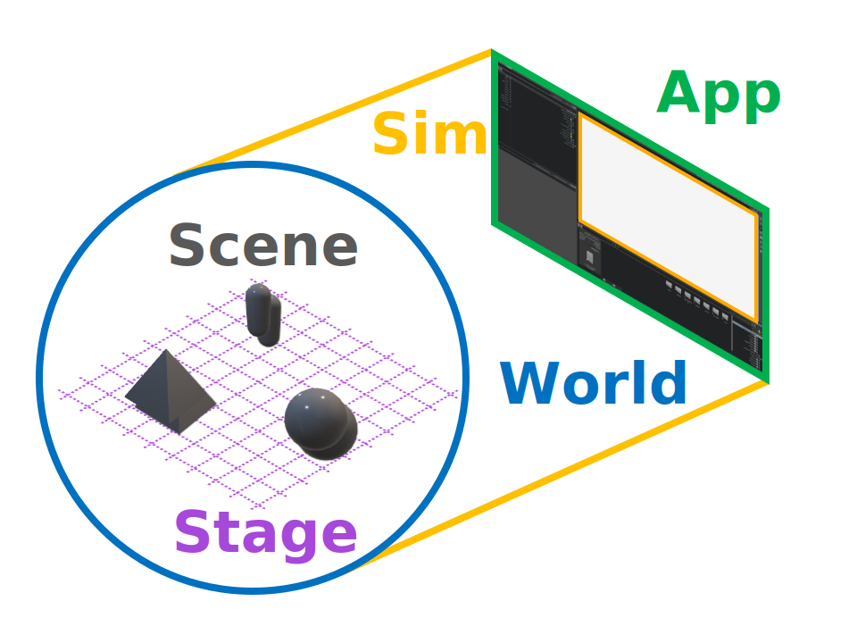
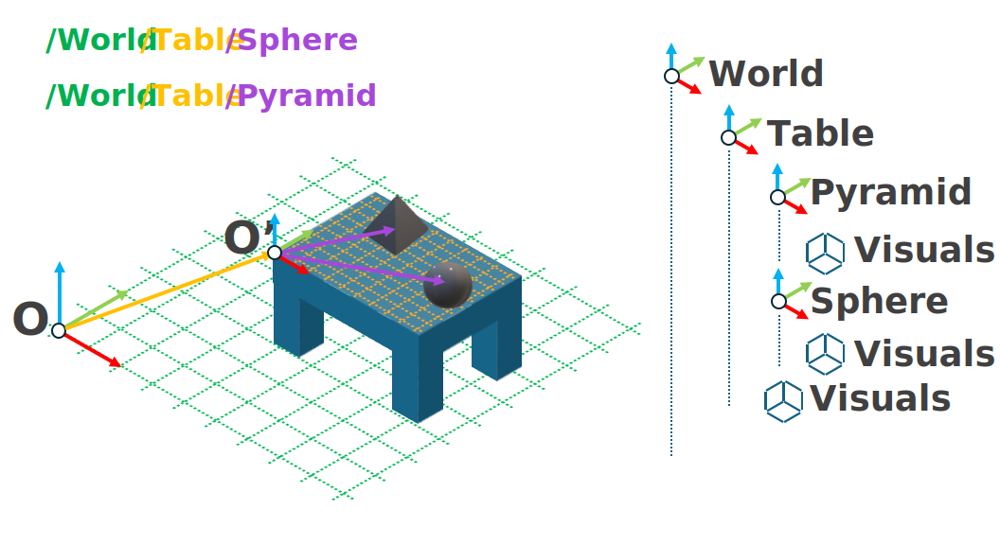

# 환경 설계 배경

이제 프로젝트가 설치되었으므로 환경을 설계하기 시작할 수 있습니다. 강화 학습(RL) 문제의 전통적인 설명에서 환경은 에이전트가 생성한 행동을 사용하여 “세상”의 상태를 업데이트하고, 최종적으로 관측값과 보상 신호를 계산하여 반환하는 역할을 담당합니다. 그러나 Isaac Sim과 Lab에서 자체 시뮬레이션 메커니즘과 관련하여 고유한 개념도 몇 가지 있습니다. 강화 학습 문제의 전통적인 설명은 “세상”을 전제로 하지만 우리는 그런 특혜를 얻지 못합니다. 스스로 세상을 정의해야 하며, 성공은 이 세상을 어떻게 구성하고 시뮬레이션에 어떻게 맞출지를 이해하는 데 달려 있습니다.

## 앱, 시뮬레이션, 월드, 스테이지, 씬

**월드**(World)는 데카르트 좌표계의 원점과それを 정의하는 단위로 정의됩니다. 얼마나 크거나 작을까요? 얼마나 가까우거나 멀까요? 이와 같은 질문에 대한 답은 단지 *상대적*인 어떤 참조 프레임에 대해서만 정의될 수 있으며, 그 참조 프레임이 바로 세상을 정의합니다.

월드 구조 위에 위치한 것은 **시뮬레이션**(Sim)과 **애플리케이션**(App)입니다. **애플리케이션**은 “모든 것을 담당하는 것”이며, 리소스 관리뿐 아니라 시뮬레이션을 실행하고 종료할 때 파괴하는 역할도 담당합니다. 템플릿을 사용해 [학습을 시작했을 때](../../overview/own-project/template.md#template-generator), 카트폴 훈련의 뷰포트가 보이는 창이 바로 애플리케이션 창입니다. 애플리케이션은 GUI에 정의되지 않으며, 헤드리스 모드로 실행될 때조차 모든 시뮬레이션을 관리하는 애플리케이션이 존재합니다.

**시뮬레이션**은 세계의 “규칙”을 제어합니다. 시간과 중력이 어떻게 작동해야 하는지, 렌더링을 얼마나 자주 수행해야 하는지와 같은 물리 법칙을 정의합니다. 애플리케이션이 시뮬레이션을 보유한다면, 시뮬레이션이 세계를 보유합니다. 시뮬레이션은 시간 단계를 여러 개의 서로 다른 서브스텝으로 나누어 각각 세계의 특정 측면을 업데이트하는 데 전념함으로써 하나의 시간 단계를 거버넌스합니다. Isaac Lab의 많은 API는 이러한 다양한 단계에 특별히 연결되도록 작성되며, `_pre_XYZ_step` 및 `_post_XYZ_step`과 같은 함수 이름을 자주 볼 수 있습니다. 여기서 `XYZ_step`은 `physics_step` 또는 `render_step`과 같은 시뮬레이션의 서브스텝 이름입니다.

월드 구조 아래에는 **스테이지**(Stage)와 **씬**(Scene)이 있습니다. 월드가 시뮬레이션에 공간적 맥락을 제공한다면, **스테이지**는 월드를 위한 *구성적 맥락*을 제공합니다. 식사용 테이블이 놓인 방을 시뮬레이션하고 싶다고 가정해 봅시다. 이때 방은 이 경우의 “월드”가 되며, 월드의 원점을 방의 한 모서리로 선택할 수 있습니다. 방 안의 테이블의 위치는 월드의 원점에서 테이블의 특정 점까지의 벡터로 정의되며, 이 점은 테이블에 고정된 *새로운* 좌표계의 원점으로 선택됩니다. 방의 모서리 wzglę해 테이블 위의 음식과 식기의 위치를 이야기하는 것은 *에이전트*에게 유용하지 않습니다. 대신 테이블을 기준으로 정의된 좌표를 사용하는 것이 더 좋습니다. 그러나 시뮬레이션은 다음 시간 단계를 정확히 시뮬레이션하기 위해 이러한 전역 좌표를 알아야 하므로, 이 두 좌표 시스템이 어떻게 *구성*되는지 정의해야 합니다.

스테이지는 바로 이 일을 수행합니다. 시뮬레이션의 모든 것은 [USD 프리미티브](https://openusd.org/release/glossary.html#usdglossary-prim)이며, 스테이지는 이러한 프리미티브 간의 관계를 트리로 나타내고, 트리 내의 상대 경로에 의해 맥락이 정의됩니다. 스테이지上的 모든 프리미티브는 이름과 따라서 트리에서의 경로를 가지며, 예시로는 `/room/table/food` 또는 `room/table/utensils`가 있습니다. 관계는 이 트리의 특정 노드의 “부모”와 “자식”에 의해 정의됩니다: `table`은 `room`의 자식이지만 `food`의 부모입니다. 부모의 구성 속성은 모든 자식에게 적용되지만, 자식 프리미티브는 필요에 따라 부모 속성을 재정의할 수 있습니다. 이는 종종 재질의 경우와 마찬가지입니다.

이 어휘를 무장하고 마침내 Isaac Lab에서 이해해야 할 가장 중요한 요소 중 하나인 **씬**(Scene)에 대해 이야기할 수 있게 되었습니다. 딥러닝은 모든 형태에서 데이터 분석에 뿌리를 두고 있습니다. 이는 로봇 학습에서도 참입니다. 훈련 중인 로봇의 센서를 통해 데이터가 획득되기 때문입니다. 로봇을 설정하고 데이터를 수집하며, 더 많은 데이터를 수집하기 위해 로봇을 리셋하는 데 필요한 시간은 어떤 방법으로도 로봇에게 *무엇이든* 가르치는 데 근본적인 병목 현상입니다. Isaac Sim은 실제 물리적 로봇 없이 로봇에 접근할 수 있게 해 주지만, Isaac Lab은 **벡터화**에 접근할 수 있게 해 줍니다. 즉, 훈련 절차의 여러 복사본을 효율적으로 시뮬레이션하여 데이터 생성 속도를 곱하고 훈련을 비례적으로 가속화할 수 있는 기능입니다. 씬은 이 벡터화 프로세스와 관련된 스테이지상의 프리미티브를 관리하며, 이를 **시뮬레이션 엔티티**(simulation entities)라고 합니다.

테이블 세팅을 시뮬레이션하고 싶은 이유가 로봇을 훈련시켜 테이블 세팅을 놓도록 하고 싶기 때문이라고 가정해 봅시다. 로봇, 테이블, 그리고 그 위에 있는 모든 것들을 환경의 씬에 등록할 수 있습니다. 그런 다음 몇 개의 복사본을 원하는지 지정하면, 씬은 자동으로 스테이지에서 تلك 복사본들을 구성하고 실행합니다. 이러한 복사본들은 스테이지상의 새로운 좌표에 배치되어, 새로운 참조 프레임을 정의하며, 여기서부터 관측값과 보상을 계산할 수 있습니다. 씬의 각 복사본은 스테이지상에 존재하며, 동일한 월드에 의해 시뮬레이션됩니다. 이는 각 복사본에 대해 독특한 시뮬레이션을 실행하는 것보다 훨씬 효율적입니다. 그러나 씬의 복사본 간 원치 않는 상호작용의 가능성을 열어주므로, 디버깅할 때는 이를 염두에 두는 것이 중요합니다.

이제 메커니즘에 대한 이해를 갖게 되었으므로, 템플릿 프로젝트에 대해 생성된 코드를 살펴볼 차례입니다.
