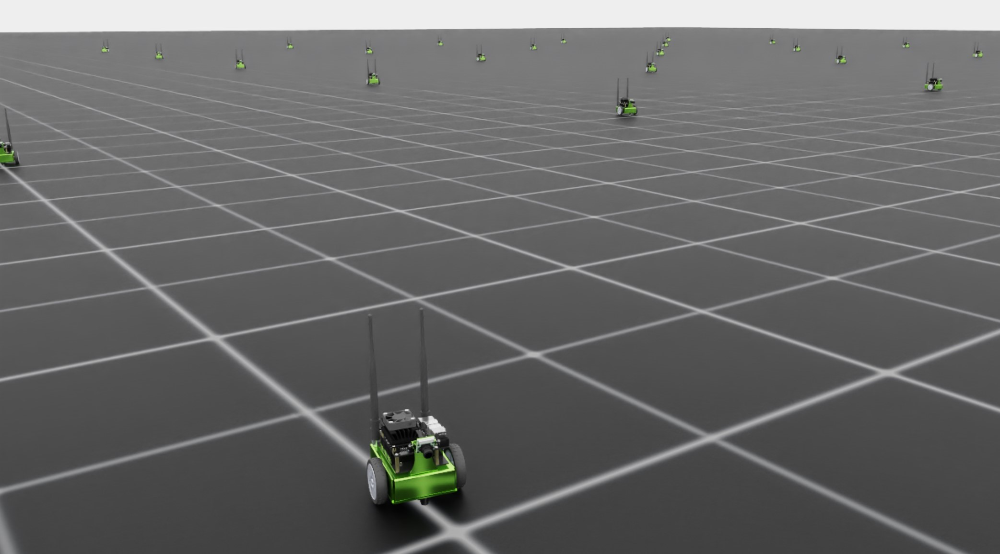

<a id="walkthrough-technical-env-design"></a>

# 환경 설계

프로젝트와 그 구조에 대한 이해를 바탕으로 Jetbot 훈련 요구 사항에 맞게 코드를 수정할 준비가 되었습니다.
템플릿은 **direct** 워크플로우를 위해 설정되어 있으며, 이는 환경 클래스가 모든 세부 정보를 중앙에서 관리함을 의미합니다.
우리는 다음을 수행하는 코드를 작성해야 합니다…

1. 로봇 정의
2. 훈련 시뮬레이션 정의 및 복제 관리
3. 에이전트에서 로봇으로 동작 적용
4. 보상과 관측 계산 및 반환
5. 재설정 및 종료 상태 관리

첫 번째 단계로, 환경 훈련 파이프라인이 로드되고 실행되도록 하는 것이 목표입니다. 이 부분을 위한 워크스루에서는 더미 보상 신호를 사용할 것입니다.
이러한 수정에 대한 코드는 [여기](https://github.com/isaac-sim/IsaacLabTutorial/tree/jetbot-intro-1-1)에서 확인할 수 있습니다!

## 로봇 정의

프로젝트가 성장함에 따라 많은 로봇을 훈련시키고 싶을 수 있습니다. 악의적으로(미리 계획하여) `robots`라는 새 `module`을
튜토리얼 `extension`에 추가하여 개별 Python 스크립트로 로봇 정의를 보관할 것입니다.
`isaac_lab_tutorial/source/isaac_lab_tutorial/isaac_lab_tutorial`로 이동하여 `robots`라는 새 폴더를 생성하세요.
이 폴더 안에 `__init__.py`와 `jetbot.py` 두 개의 파일을 만듭니다. `__init__.py` 파일은 이 디렉터리를 Python 모듈로 표시하며,
우리는 일반적인 방식으로 `jetbot.py`의 내용을 가져올 수 있습니다.

`jetbot.py`의 내용은 비교적 간단합니다.

```python
import isaaclab.sim as sim_utils
from isaaclab.assets import ArticulationCfg
from isaaclab.actuators import ImplicitActuatorCfg
from isaaclab.utils.assets import ISAAC_NUCLEUS_DIR

JETBOT_CONFIG = ArticulationCfg(
    spawn=sim_utils.UsdFileCfg(usd_path=f"{ISAAC_NUCLEUS_DIR}/Robots/NVIDIA/Jetbot/jetbot.usd"),
    actuators={"wheel_acts": ImplicitActuatorCfg(joint_names_expr=[".*"], damping=None, stiffness=None)},
)
```

이 파일의 유일한 목적은 구성 설정을 위한 고유한 범위를 정의하는 것입니다. 로봇 구성의詳細は [이 튜토리얼](../../tutorials/01_assets/add_new_robot.md#tutorial-add-new-robot)에서 확인할 수 있지만,
이 워크스루에서는 `spawn` 인수의 `ArticulationCfg`에 대한 `usd_path`가 가장 noteworthy합니다.
Jetbot 에셋은 호스팅된 Nucleus 서버를 통해 공개적으로 이용 가능하며, 그 경로는 `ISAAC_NUCLEUS_DIR`로 정의됩니다.
그러나 로컬 경로를 포함한 어떤 USD 파일 경로도 유효합니다!

## 환경 구성

환경 구성, `isaac_lab_tutorial/source/isaac_lab_tutorial/isaac_lab_tutorial/tasks/direct/isaac_lab_tutorial/isaac_lab_tutorial_env_cfg.py`로 이동하여
내용을 다음으로 대체하세요.

```python
from isaac_lab_tutorial.robots.jetbot import JETBOT_CONFIG

from isaaclab.assets import ArticulationCfg
from isaaclab.envs import DirectRLEnvCfg
from isaaclab.scene import InteractiveSceneCfg
from isaaclab.sim import SimulationCfg
from isaaclab.utils import configclass

@configclass
class IsaacLabTutorialEnvCfg(DirectRLEnvCfg):
    # env
    decimation = 2
    episode_length_s = 5.0
    # - spaces definition
    action_space = 2
    observation_space = 3
    state_space = 0
    # simulation
    sim: SimulationCfg = SimulationCfg(dt=1 / 120, render_interval=decimation)
    # robot(s)
    robot_cfg: ArticulationCfg = JETBOT_CONFIG.replace(prim_path="/World/envs/env_.*/Robot")
    # scene
    scene: InteractiveSceneCfg = InteractiveSceneCfg(num_envs=100, env_spacing=4.0, replicate_physics=True)
    dof_names = ["left_wheel_joint", "right_wheel_joint"]
```

여기서 우리는 카트폴 대신 Jetbot을 사용한다는 점을 제외하고 이전에 있던 환경 구성과 효과적으로 동일합니다.
`decimation`, `episode_length_s`, `action_space`, `observation_space`, `state_space` 매개변수는
기본 클래스인 `DirectRLEnvCfg`의 멤버이며, 모든 `DirectRLEnv`에 대해 정의되어야 합니다.
공간 매개변수는 주어진 정수 차원의 벡터로 해석되지만, 다음과 같이 [gymnasium spaces](https://gymnasium.farama.org/api/spaces/)로도 정의할 수 있습니다!

동작 및 관측 공간의 차이에 주목하세요. 환경의 설계자로서 우리는 이러한 값을 선택할 수 있습니다.
Jetbot의 경우, 우리는 로봇의 관절을 직접 제어하고자 하며, 구동되는 관절은 단 두 개뿐입니다(따라서 동작 공간이 2입니다).
관측 공간은 현재 선형 속도를 에이전트에게 입력하기 위해 *선택된* 값 3으로 설정됩니다. 환경 개발 과정에서 이를 변경할 예정입니다.
정책은 내부 상태를 유지할 필요가 없으므로 상태 공간은 0입니다.

## 클론의 습격

설정이 정의되었으므로, 환경의 세부 사항을 채울 차례입니다. 초기화 및 설정을 시작으로
환경 정의, `isaac_lab_tutorial/source/isaac_lab_tutorial/isaac_lab_tutorial/tasks/direct/isaac_lab_tutorial/isaac_lab_tutorial_env.py`로 이동하여
`__init__` 및 `_setup_scene` 메서드의 내용을 다음으로 대체하세요.

```python
class IsaacLabTutorialEnv(DirectRLEnv):
    cfg: IsaacLabTutorialEnvCfg

    def __init__(self, cfg: IsaacLabTutorialEnvCfg, render_mode: str | None = None, **kwargs):
        super().__init__(cfg, render_mode, **kwargs)

        self.dof_idx, _ = self.robot.find_joints(self.cfg.dof_names)

    def _setup_scene(self):
        self.robot = Articulation(self.cfg.robot_cfg)
        # add ground plane
        spawn_ground_plane(prim_path="/World/ground", cfg=GroundPlaneCfg())
        # clone and replicate
        self.scene.clone_environments(copy_from_source=False)
        # add articulation to scene
        self.scene.articulations["robot"] = self.robot
        # add lights
        light_cfg = sim_utils.DomeLightCfg(intensity=2000.0, color=(0.75, 0.75, 0.75))
        light_cfg.func("/World/Light", light_cfg)
```

`_setup_scene` 메서드는 변경되지 않았으며, `__init__` 메서드는 단순히 로봇에서 관절 인덱스를 가져오는 것뿐입니다
(기억하세요, 설정은 슈퍼 클래스에서 호출됩니다).

다음으로, 환경은 동작, 관측, 보상을 처리하는 방법을 정의해야 합니다.
먼저, `_pre_physics_step` 및 `_apply_action` 메서드의 내용을 다음으로 대체하세요.

```python
def _pre_physics_step(self, actions: torch.Tensor) -> None:
    self.actions = actions.clone()

def _apply_action(self) -> None:
    self.robot.set_joint_velocity_target(self.actions, joint_ids=self.dof_idx)
```

여기에서 로봇에 동작을 적용하는 환경의 과정은 두 단계로 나뉩니다: `_pre_physics_step`과 `_apply_action`입니다.
물리 시뮬레이션은 정책에서 동작을 쿼리하는 것에 대해 디시메이션되어, 즉 하나의 동작에 대해 여러 물리 단계가 발생할 수 있습니다.
`_pre_physics_step` 메서드는 이 시뮬레이션 단계가 이루어지기 직전에 호출되며,
정책에서 데이터를 가져오는 과정과 물리 시뮬레이션에 업데이트를 적용하는 과정을 분리할 수 있게 해줍니다.
`_apply_action` 메서드에서는 이러한 동작이 실제로 로봇에 적용되며, 그 후에 시뮬레이션이 시간 방향으로 진행됩니다.

다음은 관측과 보상이며, 이는 로봇의 본체 프레임에서의 선형 속도에 따라 달라집니다.
`_get_observations` 및 `_get_rewards` 메서드의 내용을 다음으로 대체하세요.

```python
def _get_observations(self) -> dict:
    self.velocity = self.robot.data.root_com_lin_vel_b
    observations = {"policy": self.velocity}
    return observations

def _get_rewards(self) -> torch.Tensor:
    total_reward = torch.linalg.norm(self.velocity, dim=-1, keepdim=True)
    return total_reward
```

로봇은 Isaac Lab API 내의 `Articulation` 객체로 존재합니다. 이 객체는 특정 로봇의 모든 데이터를 포함하는
`ArticulationData`라는 데이터 클래스를 가지고 있습니다. 장면 엔티티(로봇 등)에 대해 이야기할 때,
로봇을 광범위한 엔티티로(모든 장면에서 존재하는) 보거나, 무대의 특정 singolo 클론 로봇을 설명할 수 있습니다.
`ArticulationData`에는 이러한 개별 클론의 데이터가 포함됩니다. 여기에는 다양한 kinematic 벡터(예: `root_com_lin_vel_b`)와
참조 벡터(예: `robot.data.FORWARD_VEC_B`)가 포함됩니다.

`_apply_action` 메서드에서 보시는 바와 같이, 우리는 `self.robot`의 메서드를 호출하고 있으며, 이는 `Articulation`의 메서드입니다.
적용되는 동작은 `[num_envs, num_actions]` 형태의 2D 텐서입니다. 우리는 무대의 **모든** 로봇에 동시에 동작을 적용하고 있습니다!
여기에서 관측을 가져올 때는 무대의 모든 로봇에 대한 본체 프레임 속도가 필요하며,
따라서 `self.robot.data`에 접근하여 해당 정보를 얻습니다. `root_com_lin_vel_b` 속성은 `ArticulationData`의 속성으로
세계 프레임에서의 질량 중심 선형 속도를 본체 프레임으로 변환해줍니다. finally, Isaac Lab은 관측을 반환할 때
정책 모델을 위한 관측은 `policy`로 정의하고, 비판자 모델을 위한 관측은 `critic`로 정의해야 하는 딕셔너리를 기대합니다
(비대칭 액터-크리틱 훈련의 경우). 우리는 비대칭 액터-크리틱 훈련을 수행하지 않으므로, 단지 `policy`만 정의하면 됩니다.

보상은 더 직관적입니다. 장면의 각 클론에 대해 보상 값을 계산하고 `[num_envs, 1]` 형태의 텐서로 반환해야 합니다.
플레이스홀더로, 우리는 Jetbot의 본체 프레임에서의 선형 속도의 크기를 보상으로 삼겠습니다.
이 보상과 관측 공간을 바탕으로 에이전트는 Jetbot을 앞뒤로 운전하는 법을 배워야 하며,
훈련 시작 직후 무작위로 방향이 결정됩니다.

마지막으로, 종료 및 재설정을 처리하는 환경을 작성할 차례입니다.
`_get_dones` 및 `_reset_idx` 메서드의 내용을 다음으로 대체하세요.

```python
def _get_dones(self) -> tuple[torch.Tensor, torch.Tensor]:
    time_out = self.episode_length_buf >= self.max_episode_length - 1

    return False, time_out

def _reset_idx(self, env_ids: Sequence[int] | None):
    if env_ids is None:
        env_ids = self.robot._ALL_INDICES
    super()._reset_idx(env_ids)

    default_root_state = self.robot.data.default_root_state[env_ids]
    default_root_state[:, :3] += self.scene.env_origins[env_ids]

    self.robot.write_root_state_to_sim(default_root_state, env_ids)
```

작업과 마찬가지로 종료 및 재설정도 두 부분으로 나뉘어 처리됩니다. 먼저 `_get_dones` 메서드가 먼저 호출되며, 이 메서드의 목표는 단순히 어떤 환경이 재설정되어야 하는지, 그리고 그 이유를 표시하는 것입니다.

기존의 강화 학습에서 에피소드는 두 가지 방식으로 종료됩니다: 에이전트가 종료 상태에 도달하거나, 에피소드가 최대 지속 시간에 도달하는 경우입니다. Isaac Lab은 우리에게 친절하기 때문에, 에피소드 지속 시간 추적 과정을 뒤에서 모두 관리해줍니다. 구성 매개변수인 `episode_length_s`는 초 단위로 정의된 최대 에피소드 길이를 지정하고, `episode_length_buff`와 `max_episode_length` 매개변수는 개별 씬(환경이 비동기로 실행될 수 있도록 허용함)에서 수행된 단계 수와 `episode_length_s`에서 변환된 최대 에피소드 길이를 포함합니다. `time_out`을 계산하는 불리언 연산은 현재 버퍼 크기를 최대값과 비교하여 초과하는 경우 `true`를 반환하며, 이는 에피소드 길이 한계에 도달한 씬을 나타냅니다. 현재 환경은 더미 환경이므로 종료 상태를 정의하지 않으며, 따라서 첫 번째 텐서에 대해 단순히 `False`를 반환합니다(이는 파이토치의 기능을 통해 자동으로 올바른 형태로 투영됩니다).

마지막으로, `_reset_idx` 메서드는 재설정이 필요한 씬을 나타내는 불리언 텐서를 받아들이고 해당 씬을 재설정합니다. 이 메서드는 `DirectRLEnv`의 유일한 다른 메서드로, 내부 버퍼(에피소드 길이와 관련된)를 관리하기 위해 `super`를 직접 호출한다는 점에 주목해야 합니다. `env_ids`로 표시된 환경들에 대해 루트 기본 상태를 가져와 해당 씬의 오프셋에 따라 각 로봇의 위치를 조정하면서 로봇을 해당 상태로 재설정합니다. 이는 단일 로봇과 월드 프레임에서 정의된 단일 기본 상태에서 시작하는 복제 절차의 결과입니다. 사용자 지정 환경을 구현할 때는 이 단계를 잊지 마세요!

이러한 변경 사항을 완료하면 템플릿 `train.py` 스크립트를 사용하여 작업을 실행할 때 Jetbot이 천천히 앞으로 이동하는 법을 배우는 것을 확인할 수 있습니다.


