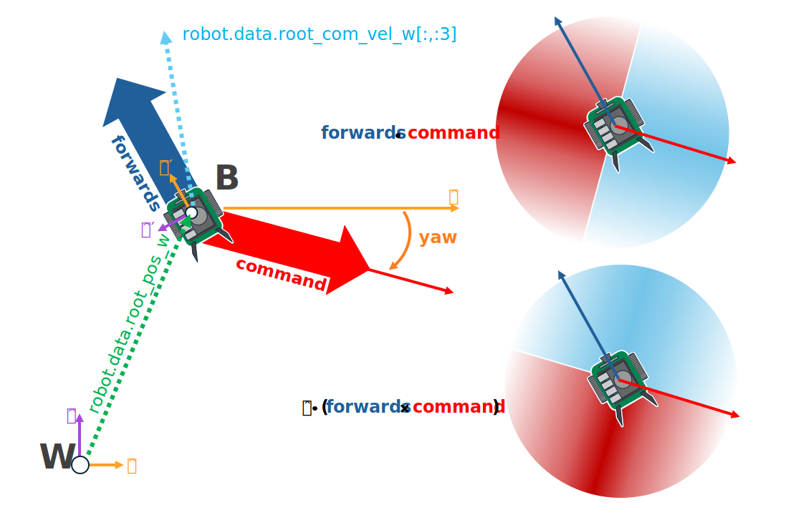
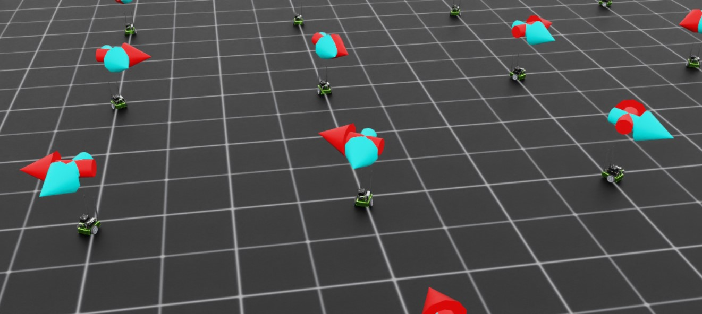

<a id="walkthrough-training-jetbot-gt"></a>

# 제트봇 훈련: 그라운드 트루스

환경이 정의되었으므로, 제트봇을 위한 컨트롤러로 동작하는 정책을 훈련시키기 위해 관측값과 보상을 수정할 수 있습니다.
사용자로서는 제트봇이 특정 방향으로 주행하도록 원하는 방향을 지정하고, 해당 방향으로 가능한 빠르게 주행하도록 휠을 돌리고 싶습니다.
강화 학습(RL)으로 이를 어떻게 달성할 수 있을까요? 이 워크스루의 단계를 마친 결과를 보고 싶다면,
[이 튜토리얼 저장소의 브랜치](https://github.com/isaac-sim/IsaacLabTutorial/tree/jetbot-intro-1-2)를 확인해 보세요!

## 환경 확장

첫 번째로 해야 할 일은 스테이지에 있는 각 제트봇에 대한 명령 설정 로직을 만드는 것입니다.
각 명령은 단위 벡터이며, 스테이지에 있는 로봇 클론마다 하나씩 필요하므로 `[num_envs, 3]` 형태의 텐서가 필요합니다.
제트봇은 2D 평면에서만 탐색하지만, 3D 벡터를 사용하면 아이작 랩에서 제공하는 모든 수학 유틸리티를 활용할 수 있습니다.

시각화를 설정하는 것도 좋은 아이디어입니다. 이렇게 하면 훈련 및 추론 중에 정책이 수행하는 작업을 더 쉽게 파악할 수 있습니다.
이 경우, 두 개의 화살표 `VisualizationMarkers`를 정의할 것입니다: 하나는 로봇의 "전방" 방향을 나타내고,
다른 하나는 명령 방향을 나타냅니다. 정책이 완전히 훈련되면 이 화살표들이 정렬되어야 합니다! 초기에 이러한 시각화를 배치하면
"침묵의 버그"인 코드가 충돌하지는 않지만 문제를 일으키는 문제를 피하는 데 도움이 됩니다.

시작하려면 마커 구성를 정의하고 해당 구성으로 마커를 인스턴스화해야 합니다.
`isaac_lab_tutorial_env.py`의 전역 스코프에 다음을 추가합니다.

```python
from isaaclab.markers import VisualizationMarkers, VisualizationMarkersCfg
from isaaclab.utils.assets import ISAAC_NUCLEUS_DIR
import isaaclab.utils.math as math_utils

def define_markers() -> VisualizationMarkers:
    """Define markers with various different shapes."""
    marker_cfg = VisualizationMarkersCfg(
        prim_path="/Visuals/myMarkers",
        markers={
                "forward": sim_utils.UsdFileCfg(
                    usd_path=f"{ISAAC_NUCLEUS_DIR}/Props/UIElements/arrow_x.usd",
                    scale=(0.25, 0.25, 0.5),
                    visual_material=sim_utils.PreviewSurfaceCfg(diffuse_color=(0.0, 1.0, 1.0)),
                ),
                "command": sim_utils.UsdFileCfg(
                    usd_path=f"{ISAAC_NUCLEUS_DIR}/Props/UIElements/arrow_x.usd",
                    scale=(0.25, 0.25, 0.5),
                    visual_material=sim_utils.PreviewSurfaceCfg(diffuse_color=(1.0, 0.0, 0.0)),
                ),
        },
    )
    return VisualizationMarkers(cfg=marker_cfg)
```

`VisualizationMarkersCfg`는 "마커" 역할을 할 USD 프리임을 정의합니다.
어떤 프리임이라도 사용할 수 있지만, 일반적으로 마커는 가능한 간단하게 유지하는 것이 좋습니다.
이는 런타임 시 매 시간 단계마다 마커 복제가 발생하기 때문입니다.
이러한 마커의 목적은 *디버그 시각화 전용*이며 시뮬레이션의 일부가 아니기 때문입니다:
사용자는 언제 어디서 몇 개의 마커를 그릴지를 완전히 제어할 수 있습니다.
NVIDIA는 공개 핵 서버에 몇 가지 간단한 메시를 제공하며, 위치는 `ISAAC_NUCLEUS_DIR`입니다.
명백한 이유로 우리는 `arrow_x.usd`를 사용하기로 선택했습니다.

`VisualizationMarkers` 사용법의 더 상세한 예시는 `markers.py` 데모를 참조하세요!

### markers.py 데모 코드

```python
# Copyright (c) 2022-2026, The Isaac Lab Project Developers (https://github.com/isaac-sim/IsaacLab/blob/main/CONTRIBUTORS.md).
# All rights reserved.
#
# SPDX-License-Identifier: BSD-3-Clause

"""This script demonstrates different types of markers.

.. code-block:: bash

    # Usage
    ./isaaclab.sh -p scripts/demos/markers.py

"""

"""Launch Isaac Sim Simulator first."""

import argparse

from isaaclab.app import AppLauncher

# add argparse arguments
parser = argparse.ArgumentParser(description="This script demonstrates different types of markers.")
# append AppLauncher cli args
AppLauncher.add_app_launcher_args(parser)
# parse the arguments
args_cli = parser.parse_args()

# launch omniverse app
app_launcher = AppLauncher(args_cli)
simulation_app = app_launcher.app

"""Rest everything follows."""

import torch

import isaaclab.sim as sim_utils
from isaaclab.markers import VisualizationMarkers, VisualizationMarkersCfg
from isaaclab.sim import SimulationContext
from isaaclab.utils.assets import ISAAC_NUCLEUS_DIR, ISAACLAB_NUCLEUS_DIR
from isaaclab.utils.math import quat_from_angle_axis


def define_markers() -> VisualizationMarkers:
    """Define markers with various different shapes."""
    marker_cfg = VisualizationMarkersCfg(
        prim_path="/Visuals/myMarkers",
        markers={
            "frame": sim_utils.UsdFileCfg(
                usd_path=f"{ISAAC_NUCLEUS_DIR}/Props/UIElements/frame_prim.usd",
                scale=(0.5, 0.5, 0.5),
            ),
            "arrow_x": sim_utils.UsdFileCfg(
                usd_path=f"{ISAAC_NUCLEUS_DIR}/Props/UIElements/arrow_x.usd",
                scale=(1.0, 0.5, 0.5),
                visual_material=sim_utils.PreviewSurfaceCfg(diffuse_color=(0.0, 1.0, 1.0)),
            ),
            "cube": sim_utils.CuboidCfg(
                size=(1.0, 1.0, 1.0),
                visual_material=sim_utils.PreviewSurfaceCfg(diffuse_color=(1.0, 0.0, 0.0)),
            ),
            "sphere": sim_utils.SphereCfg(
                radius=0.5,
                visual_material=sim_utils.PreviewSurfaceCfg(diffuse_color=(0.0, 1.0, 0.0)),
            ),
            "cylinder": sim_utils.CylinderCfg(
                radius=0.5,
                height=1.0,
                visual_material=sim_utils.PreviewSurfaceCfg(diffuse_color=(0.0, 0.0, 1.0)),
            ),
            "cone": sim_utils.ConeCfg(
                radius=0.5,
                height=1.0,
                visual_material=sim_utils.PreviewSurfaceCfg(diffuse_color=(1.0, 1.0, 0.0)),
            ),
            "mesh": sim_utils.UsdFileCfg(
                usd_path=f"{ISAAC_NUCLEUS_DIR}/Props/Blocks/DexCube/dex_cube_instanceable.usd",
                scale=(10.0, 10.0, 10.0),
            ),
            "mesh_recolored": sim_utils.UsdFileCfg(
                usd_path=f"{ISAAC_NUCLEUS_DIR}/Props/Blocks/DexCube/dex_cube_instanceable.usd",
                scale=(10.0, 10.0, 10.0),
                visual_material=sim_utils.PreviewSurfaceCfg(diffuse_color=(1.0, 0.25, 0.0)),
            ),
            "robot_mesh": sim_utils.UsdFileCfg(
                usd_path=f"{ISAACLAB_NUCLEUS_DIR}/Robots/ANYbotics/ANYmal-C/anymal_c.usd",
                scale=(2.0, 2.0, 2.0),
                visual_material=sim_utils.GlassMdlCfg(glass_color=(0.0, 0.1, 0.0)),
            ),
        },
    )
    return VisualizationMarkers(marker_cfg)


def main():
    """Main function."""
    # Load kit helper
    sim_cfg = sim_utils.SimulationCfg(dt=0.01, device=args_cli.device)
    sim = SimulationContext(sim_cfg)
    # Set main camera
    sim.set_camera_view([0.0, 18.0, 12.0], [0.0, 3.0, 0.0])

    # Spawn things into stage
    # Lights
    cfg = sim_utils.DomeLightCfg(intensity=3000.0, color=(0.75, 0.75, 0.75))
    cfg.func("/World/Light", cfg)

    # create markers
    my_visualizer = define_markers()

    # define a grid of positions where the markers should be placed
    num_markers_per_type = 5
    grid_spacing = 2.0
    # Calculate the half-width and half-height
    half_width = (num_markers_per_type - 1) / 2.0
    half_height = (my_visualizer.num_prototypes - 1) / 2.0
    # Create the x and y ranges centered around the origin
    x_range = torch.arange(-half_width * grid_spacing, (half_width + 1) * grid_spacing, grid_spacing)
    y_range = torch.arange(-half_height * grid_spacing, (half_height + 1) * grid_spacing, grid_spacing)
    # Create the grid
    x_grid, y_grid = torch.meshgrid(x_range, y_range, indexing="ij")
    x_grid = x_grid.reshape(-1)
    y_grid = y_grid.reshape(-1)
    z_grid = torch.zeros_like(x_grid)
    # marker locations
    marker_locations = torch.stack([x_grid, y_grid, z_grid], dim=1)
    marker_indices = torch.arange(my_visualizer.num_prototypes).repeat(num_markers_per_type)

    # Play the simulator
    sim.reset()
    # Now we are ready!
    print("[INFO]: Setup complete...")

    # Yaw angle
    yaw = torch.zeros_like(marker_locations[:, 0])
    # Simulate physics
    while simulation_app.is_running():
        # rotate the markers around the z-axis for visualization
        marker_orientations = quat_from_angle_axis(yaw, torch.tensor([0.0, 0.0, 1.0]))
        # visualize
        my_visualizer.visualize(marker_locations, marker_orientations, marker_indices=marker_indices)
        # roll corresponding indices to show how marker prototype can be changed
        if yaw[0].item() % (0.5 * torch.pi) < 0.01:
            marker_indices = torch.roll(marker_indices, 1)
        # perform step
        sim.step()
        # increment yaw
        yaw += 0.01


if __name__ == "__main__":
    # run the main function
    main()
    # close sim app
    simulation_app.close()
```

다음으로, 명령뿐만 아니라 마커 위치 및 회전을 추적하기 위해 필요한 데이터를 구성하도록 초기화 및 설정 단계를 확장해야 합니다.
다음 내용으로 `_setup_scene`를 대체합니다.

```python
def _setup_scene(self):
    self.robot = Articulation(self.cfg.robot_cfg)
    # add ground plane
    spawn_ground_plane(prim_path="/World/ground", cfg=GroundPlaneCfg())
    # clone and replicate
    self.scene.clone_environments(copy_from_source=False)
    # add articulation to scene
    self.scene.articulations["robot"] = self.robot
    # add lights
    light_cfg = sim_utils.DomeLightCfg(intensity=2000.0, color=(0.75, 0.75, 0.75))
    light_cfg.func("/World/Light", light_cfg)

    self.visualization_markers = define_markers()

    # setting aside useful variables for later
    self.up_dir = torch.tensor([0.0, 0.0, 1.0]).cuda()
    self.yaws = torch.zeros((self.cfg.scene.num_envs, 1)).cuda()
    self.commands = torch.randn((self.cfg.scene.num_envs, 3)).cuda()
    self.commands[:,-1] = 0.0
    self.commands = self.commands/torch.linalg.norm(self.commands, dim=1, keepdim=True)

    # offsets to account for atan range and keep things on [-pi, pi]
    ratio = self.commands[:,1]/(self.commands[:,0]+1E-8)
    gzero = torch.where(self.commands > 0, True, False)
    lzero = torch.where(self.commands < 0, True, False)
    plus = lzero[:,0]*gzero[:,1]
    minus = lzero[:,0]*lzero[:,1]
    offsets = torch.pi*plus - torch.pi*minus
    self.yaws = torch.atan(ratio).reshape(-1,1) + offsets.reshape(-1,1)

    self.marker_locations = torch.zeros((self.cfg.scene.num_envs, 3)).cuda()
    self.marker_offset = torch.zeros((self.cfg.scene.num_envs, 3)).cuda()
    self.marker_offset[:,-1] = 0.5
    self.forward_marker_orientations = torch.zeros((self.cfg.scene.num_envs, 4)).cuda()
    self.command_marker_orientations = torch.zeros((self.cfg.scene.num_envs, 4)).cuda()
```

대부분의 내용은 명령 및 마커의 장부를 설정하는 것이지만, 명령 초기화 및 요 계산은 자세히 살펴볼 가치가 있습니다. 명령은 z 구성 요소가 0으로 고정된 상태에서 `torch.randn`을 통해 다변량 정규 분포에서 샘플링되고 단위 길이에 맞게 정규화됩니다. 명령 마커를 이러한 벡터를 따라 가리키도록 하려면 기본 화살표 메시를 적절히 회전시켜야 합니다. 즉, 명령에 의해 정의된 각도로 화살표 프리밥을 z 축 주변으로 회전시키는 [쿼터니언](https://en.wikipedia.org/wiki/Quaternion)을 정의해야 합니다. 관례상, z 축 주변의 회전은 "요" 회전이라고 불립니다(롤 및 피치와 유사함).

행운스럽게도 Isaac Lab은 회전축과 각도로부터 쿼터니언을 생성하는 유틸리티를 제공합니다: `isaaclab.utils.math.quat_from_axis_angle()`, 따라서 남은 어려운 부분은 해당 각도를 결정하는 것입니다.



요는 z 축을 기준으로 정의되며, 요가 0일 때 x 축과 일치하고 양의 각도는 반시계 방향으로 열립니다. 명령 벡터의 x 및 y 구성 요소가 이 각도의 탄젠트를 정의하므로, 요를 얻기 위해 이 비율의 *아크탄젠트*가 필요합니다.

이제 두 개의 명령을 고려해 보겠습니다: 명령 A는 제2사분면에 (-x, y)에 위치하고, 명령 B는 제4사분면에 (x, -y)에 위치합니다. 두 명령 모두의 y 성분과 x 성분의 비율은 동일합니다. 이를 보정하지 않으면 일부 명령 화살표가 명령의 반대 방향을 가리키게 됩니다! 본질적으로 우리의 명령은 `[-pi, pi]` 범위에서 정의되지만 `arctangent`는 `[-pi/2, pi/2]` 범위에서만 정의됩니다.

이를 해결하기 위해 명령의 사분면에 따라 요에 `pi`를 더하거나 빼줍니다.

```python
ratio = self.commands[:,1]/(self.commands[:,0]+1E-8) #in case the x component is zero
gzero = torch.where(self.commands > 0, True, False)
lzero = torch.where(self.commands < 0, True, False)
plus = lzero[:,0]*gzero[:,1]
minus = lzero[:,0]*lzero[:,1]
offsets = torch.pi*plus - torch.pi*minus
self.yaws = torch.atan(ratio).reshape(-1,1) + offsets.reshape(-1,1)
```

텐서와 관련된 불리언 표현은 애매할 수 있으며, PyTorch는 이에 대해 오류를 발생시킬 수 있습니다. PyTorch는 정의를 명시적으로 만드는 다양한 방법을 제공합니다. `torch.where` 메서드는 입력과 동일한 형태의 텐서를 생성하며, 출력 텐서의 각 요소는 해당 요소에 대한 표현식의 평가 결과로 결정됩니다. 텐서와 관련된 불리언 연산을 다루는 신뢰할 수 있는 방법은 불리언 인덱싱 텐서를 생성한 다음, 대수적으로 연산을 표현하는 것입니다. 여기서 `AND`는 곱셈, `OR`는 덧셈으로 처리하며, 위에 보이는 방식과 같습니다. 이는 다음과 같은 의사 코드와 동일합니다:

```python
yaws = torch.atan(ratio)
yaws[commands[:,0] < 0 and commands[:,1] > 0] += torch.pi
yaws[commands[:,0] < 0 and commands[:,1] < 0] -= torch.pi
```

다음으로 마커를 실제로 시각화하는 방법을 살펴보겠습니다. 기억하세요, 이 마커들은 씬 엔티티가 아닙니다! 따라서 볼 때마다 "그려야" 합니다.

```python
def _visualize_markers(self):
    # get marker locations and orientations
    self.marker_locations = self.robot.data.root_pos_w
    self.forward_marker_orientations = self.robot.data.root_quat_w
    self.command_marker_orientations = math_utils.quat_from_angle_axis(self.yaws, self.up_dir).squeeze()

    # offset markers so they are above the jetbot
    loc = self.marker_locations + self.marker_offset
    loc = torch.vstack((loc, loc))
    rots = torch.vstack((self.forward_marker_orientations, self.command_marker_orientations))

    # render the markers
    all_envs = torch.arange(self.cfg.scene.num_envs)
    indices = torch.hstack((torch.zeros_like(all_envs), torch.ones_like(all_envs)))
    self.visualization_markers.visualize(loc, rots, marker_indices=indices)
```

`VisualizationMarkers`의 `visualize` 메서드는 마커의 공간 변환을 받는 텐서와 각 마커에 사용할 마커 프로토타입을 지정하는 `marker_indices` 텐서를 받아들이는 이 "그리기" 함수와 유사합니다. 이 모든 텐서의 첫 번째 차원이 일치하는 한, 이 함수는 지정된 변환으로 마커를 그릴 것입니다.这就是我们堆叠位置、旋转和索引的原因。

이제 `_pre_physics_step`에서 `_visualize_markers`를 호출하여 화살표를 보이게 하면 됩니다. 아래와 같이 `_pre_physics_step`를 대체하세요.

```python
def _pre_physics_step(self, actions: torch.Tensor) -> None:
  self.actions = actions.clone()
  self._visualize_markers()
```

RL 훈련을 시작하기 전에 마지막 큰 수정 사항은 명령과 마커를 고려하여 `_reset_idx` 메서드를 업데이트하는 것입니다. 환경을 리셋할 때마다 새로운 명령을 생성하고 마커를 리셋해야 합니다. 이에 대한 로직은 위에서 이미 다뤘습니다. `_reset_idx`의 내용을 다음과 같이 대체하세요.

```python
def _reset_idx(self, env_ids: Sequence[int] | None):
    if env_ids is None:
        env_ids = self.robot._ALL_INDICES
    super()._reset_idx(env_ids)

    # pick new commands for reset envs
    self.commands[env_ids] = torch.randn((len(env_ids), 3)).cuda()
    self.commands[env_ids,-1] = 0.0
    self.commands[env_ids] = self.commands[env_ids]/torch.linalg.norm(self.commands[env_ids], dim=1, keepdim=True)

    # recalculate the orientations for the command markers with the new commands
    ratio = self.commands[env_ids][:,1]/(self.commands[env_ids][:,0]+1E-8)
    gzero = torch.where(self.commands[env_ids] > 0, True, False)
    lzero = torch.where(self.commands[env_ids]< 0, True, False)
    plus = lzero[:,0]*gzero[:,1]
    minus = lzero[:,0]*lzero[:,1]
    offsets = torch.pi*plus - torch.pi*minus
    self.yaws[env_ids] = torch.atan(ratio).reshape(-1,1) + offsets.reshape(-1,1)

    # set the root state for the reset envs
    default_root_state = self.robot.data.default_root_state[env_ids]
    default_root_state[:, :3] += self.scene.env_origins[env_ids]

    self.robot.write_root_state_to_sim(default_root_state, env_ids)
    self._visualize_markers()
```

이제 명령어를 생성하고 제트봇의 heading을 시각화할 수 있습니다. 관측값과 보상을 조정해 볼 준비가 되었습니다.


