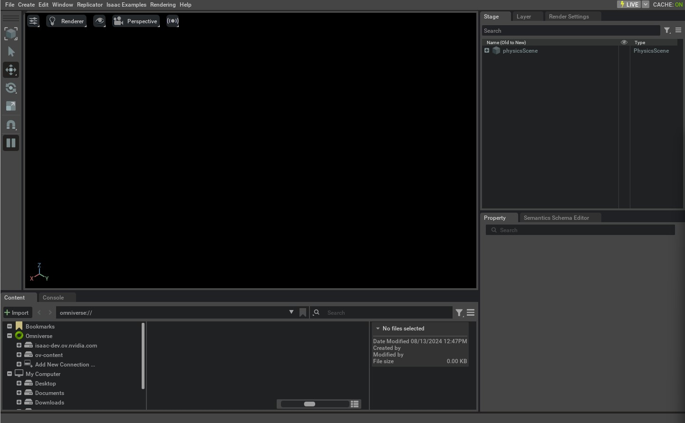

# 빈 장면 만들기

이 튜토리얼은 독립형 Python 스크립트에서 Isaac Sim 시뮬레이터를 실행하고 제어하는 방법을 보여줍니다. 빈 장면을 Isaac Lab에서 설정하고 프레임워크에서 사용되는 두 가지 주요 클래스 [`app.AppLauncher`](../../api/lab/isaaclab.app.md#isaaclab.app.AppLauncher) 및 [`sim.SimulationContext`](../../api/lab/isaaclab.sim.md#isaaclab.sim.SimulationContext)를 소개합니다.

이 튜토리얼을 시작하기 전에 [Isaac Sim Workflows](https://docs.isaacsim.omniverse.nvidia.com/latest/introduction/workflows.html)를 검토하여 시뮬레이터 사용에 대한 기본 이해를 얻으시기 바랍니다.

## 코드

이 튜토리얼은 `scripts/tutorials/00_sim` 디렉터리의 `create_empty.py` 스크립트에 해당합니다.

### create_empty.py의 코드

```python
# Copyright (c) 2022-2026, The Isaac Lab Project Developers (https://github.com/isaac-sim/IsaacLab/blob/main/CONTRIBUTORS.md).
# All rights reserved.
#
# SPDX-License-Identifier: BSD-3-Clause

"""이 스크립트는 Isaac Sim에서 간단한 스테이지를 만드는 방법을 보여줍니다.

.. code-block:: bash

    # 사용법
    ./isaaclab.sh -p scripts/tutorials/00_sim/create_empty.py

"""

"""Isaac Sim 시뮬레이터 먼저 실행하기."""


import argparse

from isaaclab.app import AppLauncher

# argparser 생성
parser = argparse.ArgumentParser(description="빈 스테이지 만들기 튜토리얼.")
# AppLauncher cli 인수 추가
AppLauncher.add_app_launcher_args(parser)
# 인수 구문 분석
args_cli = parser.parse_args()
# 옴니버스 앱 실행
app_launcher = AppLauncher(args_cli)
simulation_app = app_launcher.app

"""나머지 부분은 모두 여기에 있습니다."""

from isaaclab.sim import SimulationCfg, SimulationContext


def main():
    """메인 함수."""

    # 시뮬레이션 컨텍스트 초기화
    sim_cfg = SimulationCfg(dt=0.01)
    sim = SimulationContext(sim_cfg)
    # 메인 카메라 설정
    sim.set_camera_view([2.5, 2.5, 2.5], [0.0, 0.0, 0.0])

    # 시뮬레이터 실행
    sim.reset()
    # 이제 준비 완료!
    print("[INFO]: 설정 완료...")

    # 물리 시뮬레이션 실행
    while simulation_app.is_running():
        # 단계 수행
        sim.step()


if __name__ == "__main__":
    # 메인 함수 실행
    main()
    # 시뮬레이터 앱 종료
    simulation_app.close()
```

## 코드 설명

### 시뮬레이터 실행

독립형 Python 스크립트로 작업할 때 첫 번째 단계는 시뮬레이션 애플리케이션을 실행하는 것입니다.
이 단계는 Isaac Sim의 다양한 종속성 모듈이 시뮬레이션 애플리케이션이 실행된 후에만 사용 가능하기 때문에 시작時に 반드시 수행해야 합니다.

이를 수행하는 방법은 [`app.AppLauncher`](../../api/lab/isaaclab.app.md#isaaclab.app.AppLauncher) 클래스를 가져오는 것입니다. 이 유틸리티 클래스는 `isaacsim.SimulationApp` 클래스를 감싸서 시뮬레이터를 실행합니다. 명령줄 인수와 환경 변수를 사용하여 시뮬레이터를 구성하는 메커니즘을 제공합니다.

이 튜토리얼에서는 사용자 정의 [`argparse.ArgumentParser`](https://docs.python.org/3/library/argparse.html#argparse.ArgumentParser)에 명령줄 옵션을 추가하는 방법을 주로 다룹니다. 이는 parser 인스턴스를 [`app.AppLauncher.add_app_launcher_args()`](../../api/lab/isaaclab.app.md#isaaclab.app.AppLauncher.add_app_launcher_args) 메서드에 전달하여 수행되며, 이 메서드는 다양한 파라미터를 추가합니다. 여기에는 헤드리스 모드로 앱 실행, 다양한 Livestream 옵션 구성, 오프스크린 렌더링 활성화가 포함됩니다.

```python
import argparse

from isaaclab.app import AppLauncher

# argparser 생성
parser = argparse.ArgumentParser(description="빈 스테이지 만들기 튜토리얼.")
# AppLauncher cli 인수 추가
AppLauncher.add_app_launcher_args(parser)
# 인수 구문 분석
args_cli = parser.parse_args()
# 옴니버스 앱 실행
app_launcher = AppLauncher(args_cli)
simulation_app = app_launcher.app
```

### Python 모듈 가져오기

시뮬레이션 애플리케이션이 실행되면 Isaac Sim 및 기타 라이브러리의 다양한 Python 모듈을 가져올 수 있습니다. 여기서 다음 모듈을 가져옵니다:

* [`isaaclab.sim`](../../api/lab/isaaclab.sim.md#module-isaaclab.sim): Isaac Lab의 모든 핵심 시뮬레이터 관련 작업을 처리하는 서브 패키지입니다.

```python
from isaaclab.sim import SimulationCfg, SimulationContext
```

### 시뮬레이션 컨텍스트 구성

독립형 스크립트에서 시뮬레이터를 실행할 때 사용자는 시뮬레이터의 재생, 일시중지 및 단계 실행을 완전히 제어할 수 있습니다. 이러한 작업은 모두 **시뮬레이션 컨텍스트**를 통해 처리됩니다. 시뮬레이션 컨텍스트는 다양한 타임라인 이벤트를 처리하고 [물리 장면](https://docs.omniverse.nvidia.com/prod_extensions/prod_extensions/ext_physics.html#physics-scene)을 시뮬레이션용으로 구성합니다.

Isaac Lab에서 [`sim.SimulationContext`](../../api/lab/isaaclab.sim.md#isaaclab.sim.SimulationContext) 클래스는 Isaac Sim의 [`isaacsim.core.api.simulation_context.SimulationContext`](https://docs.isaacsim.omniverse.nvidia.com/5.1.0/py/source/extensions/isaacsim.core.api/docs/index.html#isaacsim.core.api.simulation_context.SimulationContext)를 상속받아 Python의 `dataclass` 객체를 통해 시뮬레이션을 구성하고 시뮬레이션 스테핑의 특정 복잡성을 처리하도록 허용합니다.

이 튜토리얼에서는 물리 및 렌더링 타임스텝을 0.01초로 설정합니다. 이는 [`sim.SimulationCfg`](../../api/lab/isaaclab.sim.md#isaaclab.sim.SimulationCfg)에 이러한 값을 전달하여 수행되며, 이 값은 시뮬레이션 컨텍스트 인스턴스를 생성하는 데 사용됩니다.

```python
    # 시뮬레이션 컨텍스트 초기화
    sim_cfg = SimulationCfg(dt=0.01)
    sim = SimulationContext(sim_cfg)
    # 메인 카메라 설정
    sim.set_camera_view([2.5, 2.5, 2.5], [0.0, 0.0, 0.0])
```

시뮬레이션 컨텍스트를 만든 후에는 시뮬레이션된 장면에서 물리 작용만 구성된 상태입니다. 여기에는 시뮬레이션에 사용할 장치, 중력 벡터 및 기타 고급 솔버 파라미터가 포함됩니다. 이제 시뮬레이션을 실행하기 위해 남은 두 가지 주요 단계는 다음과 같습니다:

1. 시뮬레이션 장면 설계: 센서, 로봇 및 기타 시뮬레이션 객체 추가
2. 시뮬레이션 루프 실행: 시뮬레이터 스텝 진행 및 시뮬레이터에서 데이터 가져오기 및 설정

이 튜토리얼에서는 시뮬레이션 제어에 먼저 집중하기 위해 빈 장면에서 시뮬레이션 루프 실행(2단계)을 먼저 살펴봅니다. 이후 튜토리얼에서는 장면 설계(1단계)와 시뮬레이터와의 상호작용을 위한 시뮬레이션 핸들 사용 방법을 다룰 예정입니다.

### 시뮬레이션 실행

시뮬레이션 장면을 설정한 후 처음 해야 할 일은 `sim.SimulationContext.reset()` 메서드를 호출하는 것입니다. 이 메서드는 타임라인을 재생하고 시뮬레이터의 물리 핸들을 초기화합니다. 시뮬레이터를 스텝 진행하기 전에 항상 먼저 호출해야 합니다. 그렇지 않으면 물리 핸들이 제대로 초기화되지 않습니다.

#### 주의
`sim.SimulationContext.reset()` 메서드는 타임라인만 재생하고 물리 핸들을 초기화하지 않는 `sim.SimulationContext.play()` 메서드와 다릅니다.

시뮬레이션 타임라인을 재생한 후에는 시뮬레이션 앱이 실행되는 동안 시뮬레이터를 반복적으로 스텝 진행하는 간단한 시뮬레이션 루프를 설정합니다. 메서드 [`sim.SimulationContext.step()`](../../api/lab/isaaclab.sim.md#isaaclab.sim.SimulationContext.step)는 인수 `render`를 받으며, 이 인수는 단계에 렌더링 관련 이벤트 업데이트 포함 여부를 결정합니다. 기본적으로 이 플래그는 True로 설정됩니다.

```python
    # 시뮬레이터 실행
    sim.reset()
    # 이제 준비 완료!
    print("[INFO]: 설정 완료...")

    # 물리 시뮬레이션 실행
    while simulation_app.is_running():
        # 단계 수행
        sim.step()
```

### 시뮬레이션 종료

마지막으로, `isaacsim.SimulationApp.close()` 메서드를 호출하여 시뮬레이션 애플리케이션을 중지하고 창을 닫습니다.

```python
    # 시뮬레이터 앱 종료
    simulation_app.close()
```

## 코드 실행

이제 코드를 살펴보았으니 스크립트를 실행하고 결과를 확인해 보겠습니다:

```bash
./isaaclab.sh -p scripts/tutorials/00_sim/create_empty.py
```

시뮬레이션이 실행되고 단계가 렌더링되어야 합니다. 시뮬레이션을 중지하려면 창을 닫거나 터미널에서 `Ctrl+C`를 누르면 됩니다.



위 스크립트에 `--help`를 전달하면 [`app.AppLauncher`](../../api/lab/isaaclab.app.md#isaaclab.app.AppLauncher) 클래스에서 이전에 추가한 다양한 명령줄 인수를 확인할 수 있습니다. 헤드리스 모드로 스크립트를 실행하려면 다음 명령을 실행할 수 있습니다:

```bash
./isaaclab.sh -p scripts/tutorials/00_sim/create_empty.py --headless
```

이제 시뮬레이션을 실행하는 기본적인 방법을 이해했으므로 다음 튜토리얼로 넘어가서 단계에 애셋을 추가하는 방법을 배워봅시다.
