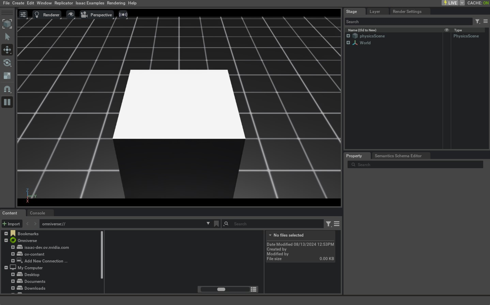

# AppLauncher 심층 분석

이 튜토리얼에서는 [`app.AppLauncher`](../../api/lab/isaaclab.app.md#isaaclab.app.AppLauncher) 클래스를 탐구하여 CLI 인수와 환경 변수(envars)를 사용해 시뮬레이터를 구성하는 방법을 보여드리겠습니다. 특히 [`AppLauncher`](../../api/lab/isaaclab.app.md#isaaclab.app.AppLauncher)를 활용하여 라이브 스트리밍을 활성화하고 [`isaacsim.simulation_app.SimulationApp`](https://docs.isaacsim.omniverse.nvidia.com/5.1.0/py/source/extensions/isaacsim.simulation_app/docs/index.html#isaacsim.simulation_app.SimulationApp) 인스턴스를 구성하는 방법을 설명합니다. 또한 사용자 제공 옵션도 허용합니다.

[`AppLauncher`](../../api/lab/isaaclab.app.md#isaaclab.app.AppLauncher)는 [`SimulationApp`](https://docs.isaacsim.omniverse.nvidia.com/5.1.0/py/source/extensions/isaacsim.simulation_app/docs/index.html#isaacsim.simulation_app.SimulationApp)의 래퍼로, 그 구성을 간소화하기 위해 설계되었습니다. [`SimulationApp`](https://docs.isaacsim.omniverse.nvidia.com/5.1.0/py/source/extensions/isaacsim.simulation_app/docs/index.html#isaacsim.simulation_app.SimulationApp)에는 다양한 기능을 활성화하기 위해 로드해야 하는 많은 확장이 있으며, 일부 확장은 순서 및 종속 관계에 따라 영향을 받습니다. 또한, 인스턴스화 시점에 설정해야 하는 시작 옵션(예: `headless`)이 있으며, 이는 일부 확장(예: 라이브 스트리밍 확장)과 암묵적인 관계가 있습니다. [`AppLauncher`](../../api/lab/isaaclab.app.md#isaaclab.app.AppLauncher)는 다양한 사용 사례에 걸쳐 이러한 확장 및 시작 옵션을 휴대 가능한 방식으로 처리할 수 있는 인터페이스를 제공합니다. 이를 달성하기 위해 사용자 정의 CLI 인수와 병합할 수 있는 CLI 및 envar 플래그를 제공하며, [`SimulationApp`](https://docs.isaacsim.omniverse.nvidia.com/5.1.0/py/source/extensions/isaacsim.simulation_app/docs/index.html#isaacsim.simulation_app.SimulationApp)에 전달할 인수를 전달합니다.

## 코드

이 튜토리얼은 `scripts/tutorials/00_sim` 디렉터리의 `launch_app.py` 스크립트에 해당합니다.

### launch_app.py 코드

```python
# Copyright (c) 2022-2026, The Isaac Lab Project Developers (https://github.com/isaac-sim/IsaacLab/blob/main/CONTRIBUTORS.md).
# All rights reserved.
#
# SPDX-License-Identifier: BSD-3-Clause

"""
이 스크립트는 AppLauncher를 통해 IsaacSim을 실행하는 방법을 보여줍니다.

.. code-block:: bash

    # 사용법
    ./isaaclab.sh -p scripts/tutorials/00_sim/launch_app.py

"""

"""Isaac Sim 시뮬레이터를 먼저 실행합니다."""


import argparse

from isaaclab.app import AppLauncher

# argparser 생성
parser = argparse.ArgumentParser(description="AppLauncher를 통해 IsaacSim 실행 튜토리얼.")
parser.add_argument("--size", type=float, default=1.0, help="직육면체의 변 길이")
# SimulationApp 인수 https://docs.omniverse.nvidia.com/py/isaacsim/source/isaacsim.simulation_app/docs/index.html?highlight=simulationapp#isaacsim.simulation_app.SimulationApp
parser.add_argument(
    "--width", type=int, default=1280, help="뷰포트 및 생성된 이미지의 너비. 기본값은 1280입니다."
)
parser.add_argument(
    "--height", type=int, default=720, help="뷰포트 및 생성된 이미지의 높이. 기본값은 720입니다."
)

# AppLauncher cli 인수 추가
AppLauncher.add_app_launcher_args(parser)
# 인수 파싱
args_cli = parser.parse_args()
# 옴니버스 앱 실행
app_launcher = AppLauncher(args_cli)
simulation_app = app_launcher.app

"""나머지 부분은 다음과 같습니다."""

import isaaclab.sim as sim_utils


def design_scene():
    """지면 평면, 조명, 객체 및 USD 파일로부터 메시스를 생성하여 장면을 설계합니다."""
    # 지면 평면
    cfg_ground = sim_utils.GroundPlaneCfg()
    cfg_ground.func("/World/defaultGroundPlane", cfg_ground)

    # distante 조명 생성
    cfg_light_distant = sim_utils.DistantLightCfg(
        intensity=3000.0,
        color=(0.75, 0.75, 0.75),
    )
    cfg_light_distant.func("/World/lightDistant", cfg_light_distant, translation=(1, 0, 10))

    # 직육면체 생성
    cfg_cuboid = sim_utils.CuboidCfg(
        size=[args_cli.size] * 3,
        visual_material=sim_utils.PreviewSurfaceCfg(diffuse_color=(1.0, 1.0, 1.0)),
    )
    # 직육면체 생성, z축 변환을 변경하여 크기에 맞게 조정
    cfg_cuboid.func("/World/Object", cfg_cuboid, translation=(0.0, 0.0, args_cli.size / 2))


def main():
    """메인 함수."""

    # 시뮬레이션 컨텍스트 초기화
    sim_cfg = sim_utils.SimulationCfg(dt=0.01, device=args_cli.device)
    sim = sim_utils.SimulationContext(sim_cfg)
    # 메인 카메라 설정
    sim.set_camera_view([2.0, 0.0, 2.5], [-0.5, 0.0, 0.5])

    # 자산을 추가하여 장면 설계
    design_scene()

    # 시뮬레이터 실행
    sim.reset()
    # 이제 준비 완료!
    print("[INFO]: 설정 완료...")

    # 물리 시뮬레이션 수행
    while simulation_app.is_running():
        # 단계 수행
        sim.step()


if __name__ == "__main__":
    # 메인 함수 실행
    main()
    # 시뮬레이션 앱 종료
    simulation_app.close()
```

## 코드 설명

### argparser에 인수 추가

[`AppLauncher`](../../api/lab/isaaclab.app.md#isaaclab.app.AppLauncher)는 사용자의 스크립트에 필요한 맞춤형 CLI 인수와 호환되도록 설계되었으며, 동시에 휴대용 CLI 인터페이스를 제공합니다.

이 튜토리얼에서는 표준 [`argparse.ArgumentParser`](https://docs.python.org/3/library/argparse.html#argparse.ArgumentParser)를 인스턴스화하고 스크립트별 `--size` 인수 및 `--height`와 `--width` 인수를 제공합니다. 후자는 [`SimulationApp`](https://docs.isaacsim.omniverse.nvidia.com/5.1.0/py/source/extensions/isaacsim.simulation_app/docs/index.html#isaacsim.simulation_app.SimulationApp)에서 사용됩니다.

인수 `--size`는 [`AppLauncher`](../../api/lab/isaaclab.app.md#isaaclab.app.AppLauncher)에서 직접 사용되지 않지만, [`AppLauncher`](../../api/lab/isaaclab.app.md#isaaclab.app.AppLauncher) 인터페이스와 원활하게 병합됩니다. 스크립트 내 인수는 [`add_app_launcher_args()`](../../api/lab/isaaclab.app.md#isaaclab.app.AppLauncher.add_app_launcher_args) 메서드를 통해 [`AppLauncher`](../../api/lab/isaaclab.app.md#isaaclab.app.AppLauncher) 인터페이스와 병합할 수 있으며, 이 메서드는 [`AppLauncher`](../../api/lab/isaaclab.app.md#isaaclab.app.AppLauncher) 인수가 추가된 수정된 [`ArgumentParser`](https://docs.python.org/3/library/argparse.html#argparse.ArgumentParser)를 반환합니다. 그런 다음 표준 [`argparse.ArgumentParser.parse_args()`](https://docs.python.org/3/library/argparse.html#argparse.ArgumentParser.parse_args) 메서드를 사용하여 [`argparse.Namespace`](https://docs.python.org/3/library/argparse.html#argparse.Namespace)로 처리하고, 이를 직접 [`AppLauncher`](../../api/lab/isaaclab.app.md#isaaclab.app.AppLauncher)에 전달하여 인스턴스화할 수 있습니다.

```python
import argparse

from isaaclab.app import AppLauncher

# argparser 생성
parser = argparse.ArgumentParser(description="AppLauncher를 통해 IsaacSim 실행 튜토리얼.")
parser.add_argument("--size", type=float, default=1.0, help="직육면체의 변 길이")
# SimulationApp 인수 https://docs.omniverse.nvidia.com/py/isaacsim/source/isaacsim.simulation_app/docs/index.html?highlight=simulationapp#isaacsim.simulation_app.SimulationApp
parser.add_argument(
    "--width", type=int, default=1280, help="뷰포트 및 생성된 이미지의 너비. 기본값은 1280입니다."
)
parser.add_argument(
    "--height", type=int, default=720, help="뷰포트 및 생성된 이미지의 높이. 기본값은 720입니다."
)

# AppLauncher cli 인수 추가
AppLauncher.add_app_launcher_args(parser)
# 인수 파싱
args_cli = parser.parse_args()
# 옴니버스 앱 실행
app_launcher = AppLauncher(args_cli)
simulation_app = app_launcher.app
```

위 코드는 [`AppLauncher`](../../api/lab/isaaclab.app.md#isaaclab.app.AppLauncher)에 인수를 전달하는 여러 방법 중 하나만을 보여줍니다. 추가 옵션은 해당 문서 페이지를 참조하세요.

### --help 출력 이해하기

스크립트를 실행할 때 `--help` 인수를 전달하여 사용자 정의 인수와 [`AppLauncher`](../../api/lab/isaaclab.app.md#isaaclab.app.AppLauncher)의 인수 출력을 결합하여 확인할 수 있습니다.

```console
./isaaclab.sh -p scripts/tutorials/00_sim/launch_app.py --help

[INFO] Using python from: /isaac-sim/python.sh
[INFO][AppLauncher]: The argument 'width' will be used to configure the SimulationApp.
[INFO][AppLauncher]: The argument 'height' will be used to configure the SimulationApp.
usage: launch_app.py [-h] [--size SIZE] [--width WIDTH] [--height HEIGHT] [--headless] [--livestream {0,1,2}]
                     [--enable_cameras] [--verbose] [--experience EXPERIENCE]

AppLauncher를 통해 IsaacSim 실행 튜토리얼.

옵션:
-h, --help            도움말 메시지 표시 및 종료
--size SIZE           직육면체의 변 길이
--width WIDTH         뷰포트 및 생성된 이미지의 너비. 기본값은 1280입니다.
--height HEIGHT       뷰포트 및 생성된 이미지의 높이. 기본값은 720입니다.

app_launcher 인수:
--headless            모든 시간 동안 표시를 강제로 비활성화합니다.
--livestream {0,1,2}
                      라이브 스트리밍을 강제로 활성화합니다. 매핑은 "LIVESTREAM" 환경 변수에 해당됩니다.
--enable_cameras      GUI 없이 실행할 때 카메라를 활성화합니다.
--verbose             SimulationApp으로부터의 자세한 터미널 로깅을 활성화합니다.
--experience EXPERIENCE
                      SimulationApp을 실행할 때 로드할 경험 파일입니다.

                      * 빈 문자열이 제공되면, 헤드리스 플래그에 따라 경험 파일이 결정됩니다.
                      * 상대 경로가 제공되면, 이는 Isaac Sim 및 Isaac Lab의 `apps` 폴더(이 순서대로)에 상대적으로 해석됩니다.
```

이 출력에서는 스크립트에 직접 정의된 `--size`, `--height`, `--width` 인수 및 [`AppLauncher`](../../api/lab/isaaclab.app.md#isaaclab.app.AppLauncher)의 인수들을 확인할 수 있습니다.

[정보] 메시지가 도움말 출력 앞에 나오며, 이 메시지에서는 [`SimulationApp`](https://docs.isaacsim.omniverse.nvidia.com/5.1.0/py/source/extensions/isaacsim.simulation_app/docs/index.html#isaacsim.simulation_app.SimulationApp) 인스턴스로 해석되는 인수가 무엇인지 표시됩니다. 여기서 [`AppLauncher`](../../api/lab/isaaclab.app.md#isaaclab.app.AppLauncher) 클래스가 래핑하는 [`SimulationApp`](https://docs.isaacsim.omniverse.nvidia.com/5.1.0/py/source/extensions/isaacsim.simulation_app/docs/index.html#isaacsim.simulation_app.SimulationApp) 인스턴스에 전달되는 인수에 해당됩니다. 이 경우, 해당 인수는 `--height` 및 `--width`입니다. 이 인수들은 [`SimulationApp`](https://docs.isaacsim.omniverse.nvidia.com/5.1.0/py/source/extensions/isaacsim.simulation_app/docs/index.html#isaacsim.simulation_app.SimulationApp)에서 처리할 수 있는 이름과 유형이 일치하기 때문에 이렇게 분류됩니다. 더 많은 예시는 [사양](https://docs.isaacsim.omniverse.nvidia.com/latest/py/source/extensions/isaacsim.simulation_app/docs/index.html#isaacsim.simulation_app.SimulationApp.DEFAULT_LAUNCHER_CONFIG)을 참고하세요.

### 환경 변수 사용

도움말 메시지에서 언급했듯이, [`AppLauncher`](../../api/lab/isaaclab.app.md#isaaclab.app.AppLauncher)의 인수(`--livestream`, `--headless`)에는 해당하는 환경 변수(envar)도 있습니다. 이들에 대한詳細は [`isaaclab.app`](../../api/lab/isaaclab.app.md#module-isaaclab.app) 문서에서 확인할 수 있습니다. CLI를 통해 이러한 인수를 제공하는 것은 해당 envar가 설정된 셸 환경에서 스크립트를 실행하는 것과 동일합니다.

[`AppLauncher`](../../api/lab/isaaclab.app.md#isaaclab.app.AppLauncher) 환경 변수 지원은 세션 간 지속적인 구성을 제공하기 위한 편의 기능이며, 사용자의 `${HOME}/.bashrc`에 설정하여 세션 간 지속적인 설정을 할 수 있습니다. 이들 인수가 CLI에서 제공되는 경우, 해당 envar를 재정의하며, 이는 이후 튜토리얼에서 시연할 예정입니다.

이 인수들은 [`AppLauncher`](../../api/lab/isaaclab.app.md#isaaclab.app.AppLauncher)를 사용하여 시뮬레이션을 시작하는 모든 스크립트에서 사용할 수 있으며, 예외적으로 `--enable_cameras`는 제외됩니다. 이 설정은 오프스크린 렌더러를 사용하도록 렌더링 파이프라인을 설정합니다. 그러나 이 설정은 [`isaaclab.sim.SimulationContext`](../../api/lab/isaaclab.sim.md#isaaclab.sim.SimulationContext)와만 호환되며, Isaac Sim의 [`isaacsim.core.api.simulation_context.SimulationContext`](https://docs.isaacsim.omniverse.nvidia.com/5.1.0/py/source/extensions/isaacsim.core.api/docs/index.html#isaacsim.core.api.simulation_context.SimulationContext) 클래스에서는 작동하지 않습니다. 이 플래그에 대한 자세한 내용은 [`AppLauncher`](../../api/lab/isaaclab.app.md#isaaclab.app.AppLauncher) API 문서를 참고하세요.

## 코드 실행

이제 예제 스크립트를 실행해 보겠습니다:

```console
LIVESTREAM=2 ./isaaclab.sh -p scripts/tutorials/00_sim/launch_app.py --size 0.5
```

이 명령은 시뮬레이션에서 0.5m<sub>3</sub> 부피의 직육면체를 생성합니다. GUI는 표시되지 않으며, 이는 `LIVESTREAM` envar에 의해 헤드리스 모드가 암시되어 `--headless` 플래그를 전달한 것과 동일합니다. 시각화가 필요할 경우, Isaac의 [WebRTC Livestreaming](https://docs.isaacsim.omniverse.nvidia.com/latest/installation/manual_livestream_clients.html#isaac-sim-short-webrtc-streaming-client)을 통해 얻을 수 있습니다. 스트리밍은 현재 컨테이터 내에서 시각화에 사용할 수 있는 유일한 지원 방법입니다. 실행 중인 터미널에서 `Ctrl+C`를 눌러 프로세스를 종료할 수 있습니다.



이제 [`AppLauncher`](../../api/lab/isaaclab.app.md#isaaclab.app.AppLauncher)가 충돌하는 명령을 어떻게 처리하는지 살펴보겠습니다:

```console
LIVESTREAM=0 ./isaaclab.sh -p scripts/tutorials/00_sim/launch_app.py --size 0.5 --livestream 2
```

이전 실행과 동일한 동작이 발생합니다. 왜냐하면 `LIVESTREAM=0`로 환경 변수를 설정했더라도, `--livestream`과 같은 CLI 인수가 동작을 결정할 때 우선시되기 때문입니다. 실행 중인 터미널에서 `Ctrl+C`를 눌러 프로세스를 종료할 수 있습니다.

마지막으로, [`AppLauncher`](../../api/lab/isaaclab.app.md#isaaclab.app.AppLauncher)를 통해 [`SimulationApp`](https://docs.isaacsim.omniverse.nvidia.com/5.1.0/py/source/extensions/isaacsim.simulation_app/docs/index.html#isaacsim.simulation_app.SimulationApp)에 인수를 전달하는 방법을 살펴보겠습니다:

```console
LIVESTREAM=2 ./isaaclab.sh -p scripts/tutorials/00_sim/launch_app.py --size 0.5 --width 1920 --height 1080
```

이전과 동일한 동작이 발생하지만, 이제는 뷰포트가 1920x1080p 해상도로 렌더링됩니다. 이는 고해상도 비디오를 수집하고자 할 때 유용하거나, 시뮬레이션 성능을 향상시키고자 할 때는 낮은 해상도를 지정할 수 있음을 의미합니다. 실행 중인 터미널에서 `Ctrl+C`를 눌러 프로세스를 종료할 수 있습니다.
