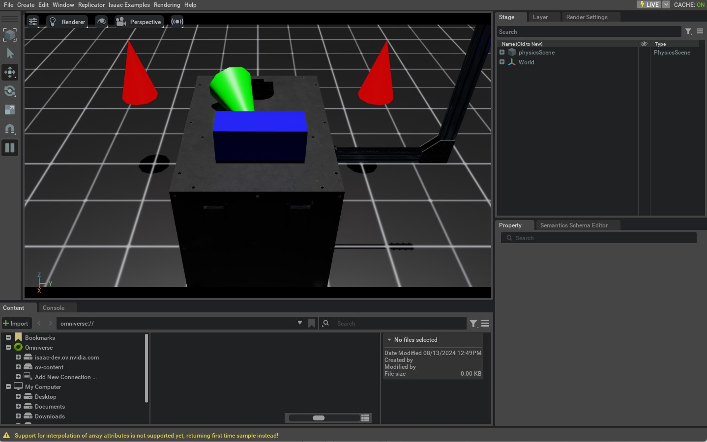

<a id="tutorial-spawn-prims"></a>

# 장면에서 프림 생성

이 튜토리얼에서는 Python을 사용하여 Isaac Lab의 씬에 다양한 객체(또는 프림)를 생성하는 방법을 탐색합니다.
이 튜토리얼은 독립 실행형 스크립트에서 시뮬레이터를 실행하는 이전 튜토리얼을 기반으로 하며, 지면 평면, 조명, 기본 도형, USD 파일의 메시를 생성하는 방법을 보여줍니다.

## 코드

이 튜토리얼은 `scripts/tutorials/00_sim` 디렉터리의 `spawn_prims.py` 스크립트에 해당합니다.
Python 스크립트를 살펴보겠습니다:

### spawn_prims.py 코드

```python
# Copyright (c) 2022-2026, The Isaac Lab Project Developers (https://github.com/isaac-sim/IsaacLab/blob/main/CONTRIBUTORS.md).
# All rights reserved.
#
# SPDX-License-Identifier: BSD-3-Clause

"""이 스크립트는 씬에 프림을 생성하는 방법을 보여줍니다.

.. code-block:: bash

    # Usage
    ./isaaclab.sh -p scripts/tutorials/00_sim/spawn_prims.py

"""

"""먼저 Isaac Sim 시뮬레이터를 실행합니다."""


import argparse

from isaaclab.app import AppLauncher

# argparser 생성
parser = argparse.ArgumentParser(description="씬에 프림을 생성하는 튜토리얼.")
# AppLauncher cli 인수 추가
AppLauncher.add_app_launcher_args(parser)
# 인수 파싱
args_cli = parser.parse_args()
# 옴니버스 앱 실행
app_launcher = AppLauncher(args_cli)
simulation_app = app_launcher.app

"""나머지는 여기서부터 시작합니다."""

import isaaclab.sim as sim_utils
from isaaclab.utils.assets import ISAAC_NUCLEUS_DIR


def design_scene():
    """지면 평면, 조명, 객체, USD 파일의 메시로 씬을 설계합니다."""
    # 지면 평면
    cfg_ground = sim_utils.GroundPlaneCfg()
    cfg_ground.func("/World/defaultGroundPlane", cfg_ground)

    # 먼 거리 조명 생성
    cfg_light_distant = sim_utils.DistantLightCfg(
        intensity=3000.0,
        color=(0.75, 0.75, 0.75),
    )
    cfg_light_distant.func("/World/lightDistant", cfg_light_distant, translation=(1, 0, 10))

    # 모든 객체를 생성할 새로운 Xform 프림 생성
    sim_utils.create_prim("/World/Objects", "Xform")
    # 빨간 원추 생성
    cfg_cone = sim_utils.ConeCfg(
        radius=0.15,
        height=0.5,
        visual_material=sim_utils.PreviewSurfaceCfg(diffuse_color=(1.0, 0.0, 0.0)),
    )
    cfg_cone.func("/World/Objects/Cone1", cfg_cone, translation=(-1.0, 1.0, 1.0))
    cfg_cone.func("/World/Objects/Cone2", cfg_cone, translation=(-1.0, -1.0, 1.0))

    # 충돌체와 강체 속성을 가진 녹색 원추 생성
    cfg_cone_rigid = sim_utils.ConeCfg(
        radius=0.15,
        height=0.5,
        rigid_props=sim_utils.RigidBodyPropertiesCfg(),
        mass_props=sim_utils.MassPropertiesCfg(mass=1.0),
        collision_props=sim_utils.CollisionPropertiesCfg(),
        visual_material=sim_utils.PreviewSurfaceCfg(diffuse_color=(0.0, 1.0, 0.0)),
    )
    cfg_cone_rigid.func(
        "/World/Objects/ConeRigid", cfg_cone_rigid, translation=(-0.2, 0.0, 2.0), orientation=(0.5, 0.0, 0.5, 0.0)
    )

    # 변형 가능한 몸체를 가진 파란 직육면체 생성
    cfg_cuboid_deformable = sim_utils.MeshCuboidCfg(
        size=(0.2, 0.5, 0.2),
        deformable_props=sim_utils.DeformableBodyPropertiesCfg(),
        visual_material=sim_utils.PreviewSurfaceCfg(diffuse_color=(0.0, 0.0, 1.0)),
        physics_material=sim_utils.DeformableBodyMaterialCfg(),
    )
    cfg_cuboid_deformable.func("/World/Objects/CuboidDeformable", cfg_cuboid_deformable, translation=(0.15, 0.0, 2.0))

    # 씬에 테이블 USD 파일을 생성
    cfg = sim_utils.UsdFileCfg(usd_path=f"{ISAAC_NUCLEUS_DIR}/Props/Mounts/SeattleLabTable/table_instanceable.usd")
    cfg.func("/World/Objects/Table", cfg, translation=(0.0, 0.0, 1.05))


def main():
    """메인 함수."""

    # 시뮬레이션 컨텍스트 초기화
    sim_cfg = sim_utils.SimulationCfg(dt=0.01, device=args_cli.device)
    sim = sim_utils.SimulationContext(sim_cfg)
    # 메인 카메라 설정
    sim.set_camera_view([2.0, 0.0, 2.5], [-0.5, 0.0, 0.5])
    # 씬 설계
    design_scene()
    # 시뮬레이터 실행
    sim.reset()
    # 이제 준비되었습니다!
    print("[INFO]: Setup complete...")

    # 물리 시뮬레이션 수행
    while simulation_app.is_running():
        # 스텝 수행
        sim.step()


if __name__ == "__main__":
    # 메인 함수 실행
    main()
    # 시뮬레이터 앱 종료
    simulation_app.close()
```

## 코드 설명

Omniverse에서 씬 설계는 USD(Universal Scene Description)라는 소프트웨어 시스템과 파일 형식을 기반으로 합니다.
USD는 파일 시스템과 유사한 계층 구조로 3D 씬을 설명할 수 있습니다. USD는 포괄적인 프레임워크이므로,
[USD 문서](https://graphics.pixar.com/usd/docs/index.html)를 읽어보는 것을 권장합니다.

이 튜토리얼에서는 완벽함을 위해 알아야 할 USD의 기본 개념을 소개합니다.

* **프리미티브(Prims)**: 이들은 USD 씬의 기본 구성 요소입니다. 씬 그래프의 노드로 생각할 수 있습니다.
  각 노드는 메시, 조명, 카메라 또는 트랜스폼일 수 있습니다. 다른 프림들의 그룹일 수도 있습니다.
* **속성(Attributes)**: 이들은 프림의 속성입니다. 키-값 쌍으로 생각할 수 있습니다.
  예를 들어, 프림은 `color`라는 속성을 가지고 그 값이 `red`일 수 있습니다.
* **관계(Relationships)**: 이들은 프림 간의 연결입니다. 다른 프림에 대한 포인터로 생각할 수 있습니다.
  예를 들어, 메시 프림은 쉐이딩을 위한 머티리얼 프림과의 관계를 가질 수 있습니다.

이러한 프림들과 그들의 속성 및 관계의 집합을 **USD 스테이지**라고 부릅니다.
씬의 모든 프림을 담을 수 있는 컨테이너로 생각할 수 있습니다.
씬을 설계한다고 말할 때, 우리는 실제로 USD 스테이지를 설계하고 있는 것입니다.

직접 USD API를 사용하면 많은 유연성을 제공하지만, 배우고 사용하는 것이 복잡할 수 있습니다.
씬 설계를 더 쉽게 하기 위해 Isaac Lab은 USD API를 기반으로 구성 기반 인터페이스를 제공하여 씬에 프림을 생성합니다.
이러한 인터페이스는 `sim.spawners` 모듈에 포함되어 있습니다.

씬에 프림을 생성할 때, 각 프림은 프림의 속성과 관계(재질 및 쉐이딩 정보를 통해)를 정의하는 구성 클래스 인스턴스가 필요합니다.
구성 클래스 인스턴스는 프림 이름과 변환을 지정하는 해당 스포너 함수에 전달됩니다.
그런 다음 함수가 프림을 씬에 생성합니다.

고급 수준에서 이 과정은 다음과 같이 작동합니다:

```python
# 구성 클래스 인스턴스 생성
cfg = MyPrimCfg()
prim_path = "/path/to/prim"

# 해당 스포너 함수를 사용하여 씬에 프림 생성
spawn_my_prim(prim_path, cfg, translation=[0, 0, 0], orientation=[1, 0, 0, 0], scale=[1, 1, 1])
# OR
# 구성 클래스에서 직접 스포너 함수 사용
cfg.func(prim_path, cfg, translation=[0, 0, 0], orientation=[1, 0, 0, 0], scale=[1, 1, 1])
```

이 튜토리얼에서는 다양한 종류의 프림을 씬에 생성하는 방법을 보여줍니다.
사용 가능한 스포너에 대한 자세한 내용은 Isaac Lab의 `sim.spawners` 모듈을 참조하십시오.

#### 주의
시뮬레이션이 시작되기 전에 모든 씬 설계가 완료되어야 합니다.
시뮬레이션이 시작되면 씬을 고정하고 프림의 속성만 변경하는 것이 좋습니다.
이는 특히 GPU 시뮬레이션에서 중요합니다.
시뮬레이션 중에 새로운 프림을 추가하면 물리 시뮬레이션 버퍼가 변경되어 예기치 않은 동작이 발생할 수 있습니다.

### 지면 평면 생성

[`GroundPlaneCfg`](../../api/lab/isaaclab.sim.spawners.md#isaaclab.sim.spawners.from_files.GroundPlaneCfg)는 그 외관과 크기를 수정할 수 있는 그리드 형태의 지면 평면을 구성합니다.

```python
    # 지면 평면
    cfg_ground = sim_utils.GroundPlaneCfg()
    cfg_ground.func("/World/defaultGroundPlane", cfg_ground)
```

### 조명 생성

[다양한 조명 프림](https://youtu.be/c7qyI8pZvF4?feature=shared)을 스테이지에 생성할 수 있습니다.
여기에는 원거리 조명, 구형 조명, 디스크 조명, 실린더 조명이 포함됩니다.
이 튜토리얼에서는 무한히 멀리 떨어져 있어 단일 방향으로 빛을 비추는 원거리 조명을 생성합니다.

```python
    # 먼 거리 조명 생성
    cfg_light_distant = sim_utils.DistantLightCfg(
        intensity=3000.0,
        color=(0.75, 0.75, 0.75),
    )
    cfg_light_distant.func("/World/lightDistant", cfg_light_distant, translation=(1, 0, 10))
```

### 기본 도형 생성

기본 도형을 생성하기 전에 트랜스폼 프림 또는 Xform의 개념을 소개하겠습니다.
트랜스폼 프림은 오직 트랜스폼 속성만 포함하는 프림입니다.
다른 프림들을 그룹화하고 그룹으로 변환하는 데 사용됩니다.
여기서는 모든 기본 도형을 그룹화하기 위한 Xform 프림을 만듭니다.

```python
    # 모든 객체를 생성할 새로운 Xform 프림 생성
    sim_utils.create_prim("/World/Objects", "Xform")
```

다음으로, [`ConeCfg`](../../api/lab/isaaclab.sim.spawners.md#isaaclab.sim.spawners.shapes.ConeCfg) 클래스를 사용하여 원추를 생성합니다.
반지름, 높이, 물리 속성, 머티리얼 속성을 지정할 수 있습니다.
기본적으로 물리 속성과 머티리얼 속성은 비활성화되어 있습니다.

첫 번째와 두 번째 원추인 `Cone1`과 `Cone2`는 물리 속성이 비활성화된 시각적 요소입니다.

```python
    # 빨간 원추 생성
    cfg_cone = sim_utils.ConeCfg(
        radius=0.15,
        height=0.5,
        visual_material=sim_utils.PreviewSurfaceCfg(diffuse_color=(1.0, 0.0, 0.0)),
    )
    cfg_cone.func("/World/Objects/Cone1", cfg_cone, translation=(-1.0, 1.0, 1.0))
    cfg_cone.func("/World/Objects/Cone2", cfg_cone, translation=(-1.0, -1.0, 1.0))
```

세 번째 원추인 `ConeRigid`에는 강체 물리를 추가하기 위해 구성 클래스에서 해당 속성을 설정합니다.
이러한 속성을 통해 질량, 마찰, restituion을 지정할 수 있습니다.
지정하지 않으면 USD Physics에서 설정한 기본값을 사용합니다.

```python
    # 충돌체와 강체 속성을 가진 녹색 원추 생성
    cfg_cone_rigid = sim_utils.ConeCfg(
        radius=0.15,
        height=0.5,
        rigid_props=sim_utils.RigidBodyPropertiesCfg(),
        mass_props=sim_utils.MassPropertiesCfg(mass=1.0),
        collision_props=sim_utils.CollisionPropertiesCfg(),
        visual_material=sim_utils.PreviewSurfaceCfg(diffuse_color=(0.0, 1.0, 0.0)),
    )
    cfg_cone_rigid.func(
        "/World/Objects/ConeRigid", cfg_cone_rigid, translation=(-0.2, 0.0, 2.0), orientation=(0.5, 0.0, 0.5, 0.0)
    )

```

마지막으로, 변형 가능한 물체의 물리 속성을 포함하는 `CuboidDeformable` 큐브오이드를 생성합니다. 강체 시뮬레이션과 달리, 변형 가능한 물체는 정점 간 상대적인 움직임을 가질 수 있습니다. 이는 천, 고무, 젤리와 같은 부드러운 물체를 시뮬레이션하는 데 유용합니다. 변형 가능한 물체는 GPU 시뮬레이션에서만 지원되며, 변형 가능한 물체 물리 속성을 갖는 메쉬 객체를 생성해야 함을 주의해야 합니다.

```python
    # 변형 가능한 물체와 함께 파란 큐브오이드 생성
    cfg_cuboid_deformable = sim_utils.MeshCuboidCfg(
        size=(0.2, 0.5, 0.2),
        deformable_props=sim_utils.DeformableBodyPropertiesCfg(),
        visual_material=sim_utils.PreviewSurfaceCfg(diffuse_color=(0.0, 0.0, 1.0)),
        physics_material=sim_utils.DeformableBodyMaterialCfg(),
    )
    cfg_cuboid_deformable.func("/World/Objects/CuboidDeformable", cfg_cuboid_deformable, translation=(0.15, 0.0, 2.0))

```

### 다른 파일에서 생성하기

마지막으로, 다른 USD, URDF 또는 OBJ 파일 형식의 프라임도 생성할 수 있습니다. 이 튜토리얼에서는 장면에서 테이블 USD 파일을 생성합니다. 테이블은 메쉬 프라임이며, 관련된 머티리얼 프라임이 있습니다. 이 모든 정보는 USD 파일에 저장됩니다.

```python
    # 장면으로 테이블 USD 파일 생성
    cfg = sim_utils.UsdFileCfg(usd_path=f"{ISAAC_NUCLEUS_DIR}/Props/Mounts/SeattleLabTable/table_instanceable.usd")
    cfg.func("/World/Objects/Table", cfg, translation=(0.0, 0.0, 1.05))
```

위 테이블은 장면의 참조로 추가됩니다. 즉, 테이블이 실제로 장면에 추가되는 것이 아니라, 테이블 에셋에 대한 `포인터`가 추가된다는 의미입니다. 이를 통해 테이블 에셋을 수정하고 변경 사항을 파괴하지 않는 방식으로 장면에서 반영할 수 있습니다. 예를 들어, 테이블 에셋의 기반 파일을 직접 수정하지 않고 테이블의 머티리얼을 변경할 수 있습니다. 변경 사항만 USD 스테이지에 저장됩니다.

## 스크립트 실행

이전 튜토리얼과 마찬가지로 스크립트를 실행하려면 다음 명령어를 실행합니다:

```bash
./isaaclab.sh -p scripts/tutorials/00_sim/spawn_prims.py
```

시뮬레이션이 시작되면 지면 평면, 조명, 원뿔 몇 개와 테이블이 있는 창을 볼 수 있어야 합니다. 강체 물리가 활성화된 녹색 원뿔은 떨어지며 테이블과 지면 평면과 충돌해야 합니다. 다른 원뿔들은 시각적 요소이며 움직여서는 안 됩니다. 시뮬레이션을 중지하려면 창을 닫거나 터미널에서 `Ctrl+C`를 누르면 됩니다.



이 튜토리얼은 Isaac Lab에서 장면에 다양한 프라임을 생성하는 기초를 제공했습니다. 간단하지만, Isaac Lab에서 장면 설계의 기본 개념과 스포너 사용법을 보여줍니다. 앞으로의 튜토리얼에서는 장면을 상호작용하고 시뮬레이션을 조작하는 방법에 대해 다룰 예정입니다.
