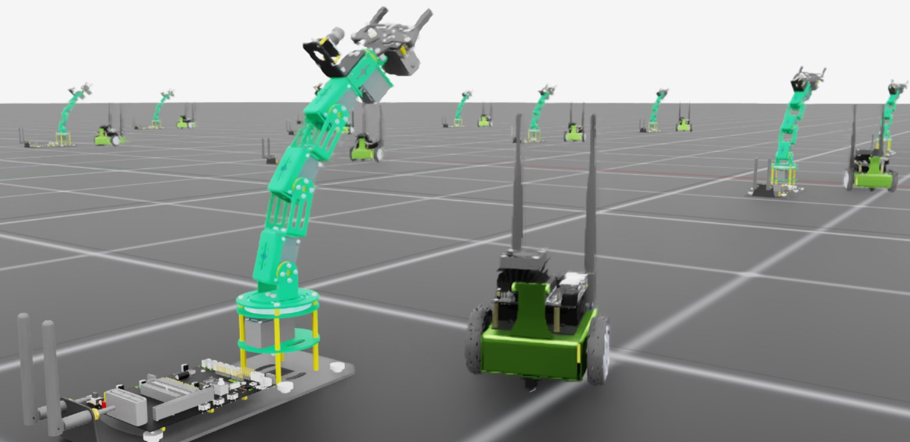

<a id="tutorial-add-new-robot"></a>

# Isaac Lab에 새 로봇 추가하기

새 로봇을 시뮬레이션하고 학습하는 것은 Isaac Sim에 로봇을 가져오는 것부터 시작하는 다단계 프로세스입니다.
이 과정은 Isaac Sim 설명서에서 자세히 다루고 있습니다 [여기](https://docs.isaacsim.omniverse.nvidia.com/latest/importer_exporter/importers_exporters.html).
로봇이 가져와지고 시뮬레이션에 맞게 조정된 후, 여러 환경에 로봇을 복제하고, 관절을 구동하며, 적절히 재설정하는 데 필요한 인터페이스를 정의해야 합니다. 선택한 워크플로우나 학습 프레임워크와 무관하게 말이죠.

이 튜토리얼에서는 Isaac Lab에 새 로봇을 추가하는 방법을 살펴볼 것입니다. 핵심 단계는 USD 아티큘레이션 로봇과 Isaac Lab을 통해 이용 가능한 학습 알고리즘 사이의 인터페이스를 정의하는 `AssetBaseCfg`를 생성하는 것입니다.

## 코드

이 튜토리얼은 `scripts/tutorials/01_assets` 디렉터리의 `add_new_robot` 스크립트에 해당합니다.

### add_new_robot.py 코드

```python
# Copyright (c) 2022-2026, The Isaac Lab Project Developers (https://github.com/isaac-sim/IsaacLab/blob/main/CONTRIBUTORS.md).
# All rights reserved.
#
# SPDX-License-Identifier: BSD-3-Clause

import argparse

from isaaclab.app import AppLauncher

# add argparse arguments
parser = argparse.ArgumentParser(
    description="This script demonstrates adding a custom robot to an Isaac Lab environment."
)
parser.add_argument("--num_envs", type=int, default=1, help="Number of environments to spawn.")
# append AppLauncher cli args
AppLauncher.add_app_launcher_args(parser)
# parse the arguments
args_cli = parser.parse_args()

# launch omniverse app
app_launcher = AppLauncher(args_cli)
simulation_app = app_launcher.app

import numpy as np
import torch

import isaaclab.sim as sim_utils
from isaaclab.actuators import ImplicitActuatorCfg
from isaaclab.assets import AssetBaseCfg
from isaaclab.assets.articulation import ArticulationCfg
from isaaclab.scene import InteractiveScene, InteractiveSceneCfg
from isaaclab.utils.assets import ISAAC_NUCLEUS_DIR

JETBOT_CONFIG = ArticulationCfg(
    spawn=sim_utils.UsdFileCfg(usd_path=f"{ISAAC_NUCLEUS_DIR}/Robots/NVIDIA/Jetbot/jetbot.usd"),
    actuators={"wheel_acts": ImplicitActuatorCfg(joint_names_expr=[".*"], damping=None, stiffness=None)},
)

DOFBOT_CONFIG = ArticulationCfg(
    spawn=sim_utils.UsdFileCfg(
        usd_path=f"{ISAAC_NUCLEUS_DIR}/Robots/Yahboom/Dofbot/dofbot.usd",
        rigid_props=sim_utils.RigidBodyPropertiesCfg(
            disable_gravity=False,
            max_depenetration_velocity=5.0,
        ),
        articulation_props=sim_utils.ArticulationRootPropertiesCfg(
            enabled_self_collisions=True, solver_position_iteration_count=8, solver_velocity_iteration_count=0
        ),
    ),
    init_state=ArticulationCfg.InitialStateCfg(
        joint_pos={
            "joint1": 0.0,
            "joint2": 0.0,
            "joint3": 0.0,
            "joint4": 0.0,
        },
        pos=(0.25, -0.25, 0.0),
    ),
    actuators={
        "front_joints": ImplicitActuatorCfg(
            joint_names_expr=["joint[1-2]"],
            effort_limit_sim=100.0,
            velocity_limit_sim=100.0,
            stiffness=10000.0,
            damping=100.0,
        ),
        "joint3_act": ImplicitActuatorCfg(
            joint_names_expr=["joint3"],
            effort_limit_sim=100.0,
            velocity_limit_sim=100.0,
            stiffness=10000.0,
            damping=100.0,
        ),
        "joint4_act": ImplicitActuatorCfg(
            joint_names_expr=["joint4"],
            effort_limit_sim=100.0,
            velocity_limit_sim=100.0,
            stiffness=10000.0,
            damping=100.0,
        ),
    },
)


class NewRobotsSceneCfg(InteractiveSceneCfg):
    """Designs the scene."""

    # Ground-plane
    ground = AssetBaseCfg(prim_path="/World/defaultGroundPlane", spawn=sim_utils.GroundPlaneCfg())

    # lights
    dome_light = AssetBaseCfg(
        prim_path="/World/Light", spawn=sim_utils.DomeLightCfg(intensity=3000.0, color=(0.75, 0.75, 0.75))
    )

    # robot
    Jetbot = JETBOT_CONFIG.replace(prim_path="{ENV_REGEX_NS}/Jetbot")
    Dofbot = DOFBOT_CONFIG.replace(prim_path="{ENV_REGEX_NS}/Dofbot")


def run_simulator(sim: sim_utils.SimulationContext, scene: InteractiveScene):
    sim_dt = sim.get_physics_dt()
    sim_time = 0.0
    count = 0

    while simulation_app.is_running():
        # reset
        if count % 500 == 0:
            # reset counters
            count = 0
            # reset the scene entities to their initial positions offset by the environment origins
            root_jetbot_state = scene["Jetbot"].data.default_root_state.clone()
            root_jetbot_state[:, :3] += scene.env_origins
            root_dofbot_state = scene["Dofbot"].data.default_root_state.clone()
            root_dofbot_state[:, :3] += scene.env_origins

            # copy the default root state to the sim for the jetbot's orientation and velocity
            scene["Jetbot"].write_root_pose_to_sim(root_jetbot_state[:, :7])
            scene["Jetbot"].write_root_velocity_to_sim(root_jetbot_state[:, 7:])
            scene["Dofbot"].write_root_pose_to_sim(root_dofbot_state[:, :7])
            scene["Dofbot"].write_root_velocity_to_sim(root_dofbot_state[:, 7:])

            # copy the default joint states to the sim
            joint_pos, joint_vel = (
                scene["Jetbot"].data.default_joint_pos.clone(),
                scene["Jetbot"].data.default_joint_vel.clone(),
            )
            scene["Jetbot"].write_joint_state_to_sim(joint_pos, joint_vel)
            joint_pos, joint_vel = (
                scene["Dofbot"].data.default_joint_pos.clone(),
                scene["Dofbot"].data.default_joint_vel.clone(),
            )
            scene["Dofbot"].write_joint_state_to_sim(joint_pos, joint_vel)
            # clear internal buffers
            scene.reset()
            print("[INFO]: Resetting Jetbot and Dofbot state...")

        # drive around
        if count % 100 < 75:
            # Drive straight by setting equal wheel velocities
            action = torch.Tensor([[10.0, 10.0]])
        else:
            # Turn by applying different velocities
            action = torch.Tensor([[5.0, -5.0]])

        scene["Jetbot"].set_joint_velocity_target(action)

        # wave
        wave_action = scene["Dofbot"].data.default_joint_pos
        wave_action[:, 0:4] = 0.25 * np.sin(2 * np.pi * 0.5 * sim_time)
        scene["Dofbot"].set_joint_position_target(wave_action)

        scene.write_data_to_sim()
        sim.step()
        sim_time += sim_dt
        count += 1
        scene.update(sim_dt)


def main():
    """Main function."""
    # Initialize the simulation context
    sim_cfg = sim_utils.SimulationCfg(device=args_cli.device)
    sim = sim_utils.SimulationContext(sim_cfg)
    sim.set_camera_view([3.5, 0.0, 3.2], [0.0, 0.0, 0.5])
    # Design scene
    scene_cfg = NewRobotsSceneCfg(args_cli.num_envs, env_spacing=2.0)
    scene = InteractiveScene(scene_cfg)
    # Play the simulator
    sim.reset()
    # Now we are ready!
    print("[INFO]: Setup complete...")
    # Run the simulator
    run_simulator(sim, scene)


if __name__ == "__main__":
    main()
    simulation_app.close()
```

## 코드 설명

근본적으로 로봇은 조인트 드라이브가 있는 아티큘레이션입니다. 시뮬레이션에서 로봇을 움직이려면 그 드라이브에 대상을 적용하고 시뮬레이션을 시간에 따라 앞으로 진행해야 합니다. 그러나 로봇을 조인트 드라이브만으로 엄격히 제어하는 것은 번거롭습니다. 특히 복잡한 것을 제어하고자 할 때 더욱 그렇고, 로봇을 여러 환경에 복제하고자 할 때는 더욱더 그렇습니다.

이를 용이하게 하기 위해 Isaac Lab은 USD의 어떤 부분을 복제해야 하는지, 어떤 부분이 에이전트에 의해 제어되어야 하는 액추에이터인지, 어떻게 재설정해야 하는지 등을 정의하는 여러 `configuration` 클래스를 제공합니다. 하나의 로봇 에셋에 대해 Isaac Lab에 맞게 구성하는 방법은 에셋이 요구하는 미세 조정의 정도에 따라 다양합니다. 이를 보여주기 위해 튜토리얼 스크립트는 두 개의 로봇을 가져옵니다. 첫 번째 로봇인 `Jetbot`은 최소한으로 구성되어 있고, 두 번째 로봇인 `Dofbot`은 추가 매개변수로 구성되어 있습니다.

Jetbot은 카메라가 장착된 간단한 두 바퀴 differential base입니다. 이 에셋은 Isaac Sim에서 여러 시연과 튜토리얼에 사용되므로, 정상적으로 작동한다는 것을 알고 있습니다! Isaac Lab에 가져오려면 먼저 이러한 구성 중 하나를 정의해야 합니다. 로봇은 조인트 드라이브가 있는 아티큘레이션이므로, 로봇을 설명하는 `ArticulationCfg`를 정의합니다.

```python
import isaaclab.sim as sim_utils
from isaaclab.actuators import ImplicitActuatorCfg
from isaaclab.assets import AssetBaseCfg
from isaaclab.assets.articulation import ArticulationCfg
from isaaclab.scene import InteractiveScene, InteractiveSceneCfg
from isaaclab.utils.assets import ISAAC_NUCLEUS_DIR

JETBOT_CONFIG = ArticulationCfg(
    spawn=sim_utils.UsdFileCfg(usd_path=f"{ISAAC_NUCLEUS_DIR}/Robots/NVIDIA/Jetbot/jetbot.usd"),
    actuators={"wheel_acts": ImplicitActuatorCfg(joint_names_expr=[".*"], damping=None, stiffness=None)},
)

```

이것은 Isaac Lab에서 로봇에 대한 최소 구성입니다. 필요한 매개변수는 `spawn`과 `actuators` 두 개뿐입니다.

`spawn` 매개변수는 `SpawnerCfg`를 찾고, 시뮬레이션에서 로봇을 정의하는 USD 에셋을 지정하는 데 사용됩니다. Isaac Lab 시뮬레이션 유틸리티인 `isaaclab.sim`은 USD 에셋의 경로를 소비하여 필요한 `SpawnerCfg`를 생성하는 `USDFileCfg` 클래스를 제공합니다. 이 경우, `jetbot.usd`는
[Isaac Assets](https://docs.isaacsim.omniverse.nvidia.com/latest/assets/usd_assets_overview.html)의 `Robots/Jetbot/jetbot.usd` 아래에 위치합니다.

`actuators` 매개변수는 에이전트로 제어하려는 로봇의 부분을 정의하는 액추에이터 구성의 사전입니다. 시간에 따라 특정 대상에 도달하도록 조인트의 상태를 업데이트하는 방법은 다양합니다. Isaac Lab은 액추에이터 컬렉션을 제공합니다.
classes를 사용하여 일반적인 액추에이터 모델과 일치시키거나 직접 구현할 수도 있습니다! 이 경우, 간단한 바퀴이므로 기본값이 괜찮아 `ImplicitActuatorCfg` 클래스를 사용하여 로봇의 액추에이터를 지정하고 있습니다.

이 딕셔너리의 조인트 이름 키를 다양한 수준의 구체성으로 지정할 수 있습니다.
jetbot에는 몇 개의 조인트만 있으며, USD 자산에서 지정된 기본값을 그대로 사용할 것이므로, 간단한 정규식 `.*`을 사용하여 모든 조인트를 지정할 수 있습니다.
다른 정규식을 사용하여 조인트를 그룹화하고 관련된 구성과 연결할 수도 있습니다.

#### 참고
암시적 액추에이터에서는 강성도와 감쇠도를 반드시 지정해야 하지만, 값이 `None`이면 USD 자산에서 정의된 기본값을 사용합니다.

이것이 최소 구성이며, 다른 매개변수들도 지정할 수 있습니다

```python
DOFBOT_CONFIG = ArticulationCfg(
    spawn=sim_utils.UsdFileCfg(
        usd_path=f"{ISAAC_NUCLEUS_DIR}/Robots/Yahboom/Dofbot/dofbot.usd",
        rigid_props=sim_utils.RigidBodyPropertiesCfg(
            disable_gravity=False,
            max_depenetration_velocity=5.0,
        ),
        articulation_props=sim_utils.ArticulationRootPropertiesCfg(
            enabled_self_collisions=True, solver_position_iteration_count=8, solver_velocity_iteration_count=0
        ),
    ),
    init_state=ArticulationCfg.InitialStateCfg(
        joint_pos={
            "joint1": 0.0,
            "joint2": 0.0,
            "joint3": 0.0,
            "joint4": 0.0,
        },
        pos=(0.25, -0.25, 0.0),
    ),
    actuators={
        "front_joints": ImplicitActuatorCfg(
            joint_names_expr=["joint[1-2]"],
            effort_limit_sim=100.0,
            velocity_limit_sim=100.0,
            stiffness=10000.0,
            damping=100.0,
        ),
        "joint3_act": ImplicitActuatorCfg(
            joint_names_expr=["joint3"],
            effort_limit_sim=100.0,
            velocity_limit_sim=100.0,
            stiffness=10000.0,
            damping=100.0,
        ),
        "joint4_act": ImplicitActuatorCfg(
            joint_names_expr=["joint4"],
            effort_limit_sim=100.0,
            velocity_limit_sim=100.0,
            stiffness=10000.0,
            damping=100.0,
        ),
    },
)
```

이 구성은 Dofbot을 장면에 추가하는 데 사용할 수 있으며, 일부 추가 매개변수도 포함되어 있습니다.
Dofbot은 여러 조인트가 있는 취미용 로봇 팔이므로 구성 옵션이 더 다양해졌습니다.
두 가지 가장 주목할 만한 차이점은 물리 속성 구성의 추가와 로봇의 초기 상태 `init_state`입니다.

`USDFileCfg`에는 강체 및 로봇을 위한 특수 매개변수가 있습니다. `rigid_props` 매개변수는 로봇이 시뮬레이션에서 "물리적 객체"로 동작하는 데 관련된 본체 링크 속성을 지정할 수 있는 `RigidBodyPropertiesCfg`를 기대합니다. 반면 `articulation_props`는 시간을 따라 조인트를 단계별로 진행하는 솔버와 관련된 속성을 규정하므로 `ArticulationRootPropertiesCfg`를 구성해야 합니다.
[`isaaclab.sim.schemas`](../../api/lab/isaaclab.sim.schemas.md#module-isaaclab.sim.schemas)에서 제공하는 구성들을 통해 많은 다른 물리 속성과 매개변수를 지정할 수 있습니다.

`ArticulationCfg`에는 선택적으로 `init_state` 매개변수가 포함될 수 있으며, 이는 artikulation의 초기 상태를 정의합니다.
 artikulation의 초기 상태는 Isaac Lab에서 로봇이 생성되거나 재설정될 때 사용되는 특수한 사용자 정의 상태입니다.
 초기 조인트 상태인 `joint_pos`는 USD 조인트 이름을 키로 갖는 실수 딕셔너리로 지정됩니다(**액추에이터 이름이 아님**에 유의해야 함).
 여기에 추가로 주목할 점은 초기 위치 `pos`의 좌표계로, 이는 환경의 좌표계입니다.
 이 경우 위치 `(0.25, -0.25, 0.0)`을 지정함으로써 로봇의 생성 위치를 환경의 원점으로부터 오프셋하고, 세계 좌표계의 원점으로부터 오프셋하는 것이 아님을 나타냅니다.

이러한 로봇에 대한 구성을 갖게 되었으므로, 이제 일반적인 방식으로 장면에 추가하고 상호작용할 수 있습니다.
직접 워크플로우에서는 다음과 같이 로봇의 아티큘레이션 구성을 포함하는 `InteractiveSceneCfg`를 정의하면 됩니다 …

```python
class NewRobotsSceneCfg(InteractiveSceneCfg):
    """설계 현장입니다."""

    # 지면 평면
    ground = AssetBaseCfg(prim_path="/World/defaultGroundPlane", spawn=sim_utils.GroundPlaneCfg())

    # 조명
    dome_light = AssetBaseCfg(
        prim_path="/World/Light", spawn=sim_utils.DomeLightCfg(intensity=3000.0, color=(0.75, 0.75, 0.75))
    )

    # 로봇
    Jetbot = JETBOT_CONFIG.replace(prim_path="{ENV_REGEX_NS}/Jetbot")
    Dofbot = DOFBOT_CONFIG.replace(prim_path="{ENV_REGEX_NS}/Dofbot")

```

…그리고 시뮬레이션을 단계별로 진행하면서 장면 엔티티를 적절히 업데이트하면 됩니다.

```python
def run_simulator(sim: sim_utils.SimulationContext, scene: InteractiveScene):
    sim_dt = sim.get_physics_dt()
    sim_time = 0.0
    count = 0

    while simulation_app.is_running():
        # 초기화
        if count % 500 == 0:
            # 카운터 초기화
            count = 0
            # 환경 원점에 따라 오프셋된 초기 위치로 장면 엔티티 재설정
            root_jetbot_state = scene["Jetbot"].data.default_root_state.clone()
            root_jetbot_state[:, :3] += scene.env_origins
            root_dofbot_state = scene["Dofbot"].data.default_root_state.clone()
            root_dofbot_state[:, :3] += scene.env_origins

            # jetbot의 자세와 속도를 시뮬레이션에 복사하기 위해 기본 루트 상태 복사
            scene["Jetbot"].write_root_pose_to_sim(root_jetbot_state[:, :7])
            scene["Jetbot"].write_root_velocity_to_sim(root_jetbot_state[:, 7:])
            scene["Dofbot"].write_root_pose_to_sim(root_dofbot_state[:, :7])
            scene["Dofbot"].write_root_velocity_to_sim(root_dofbot_state[:, 7:])

            # 기본 조인트 상태를 시뮬레이션에 복사
            joint_pos, joint_vel = (
                scene["Jetbot"].data.default_joint_pos.clone(),
                scene["Jetbot"].data.default_joint_vel.clone(),
            )
            scene["Jetbot"].write_joint_state_to_sim(joint_pos, joint_vel)
            joint_pos, joint_vel = (
                scene["Dofbot"].data.default_joint_pos.clone(),
                scene["Dofbot"].data.default_joint_vel.clone(),
            )
            scene["Dofbot"].write_joint_state_to_sim(joint_pos, joint_vel)
            # 내부 버퍼 클리어
            scene.reset()
            print("[INFO]: Jetbot과 Dofbot 상태 재설정 중...")

        # 주행
        if count % 100 < 75:
            # 동일한 휠 속도로 직진 주행
            action = torch.Tensor([[10.0, 10.0]])
        else:
            # 다른 속도로 회전
            action = torch.Tensor([[5.0, -5.0]])

        scene["Jetbot"].set_joint_velocity_target(action)

        # 흔들기 동작
        wave_action = scene["Dofbot"].data.default_joint_pos
        wave_action[:, 0:4] = 0.25 * np.sin(2 * np.pi * 0.5 * sim_time)
        scene["Dofbot"].set_joint_position_target(wave_action)

        scene.write_data_to_sim()
        sim.step()
        sim_time += sim_dt
        count += 1
        scene.update(sim_dt)

```

#### 참고
액추에이터가 모두 구성되지 않았다는 경고가 표시될 수 있습니다! 이 튜토리얼에서는 그리퍼를 처리하지 않기 때문에 이는 예상되는 현상입니다.


