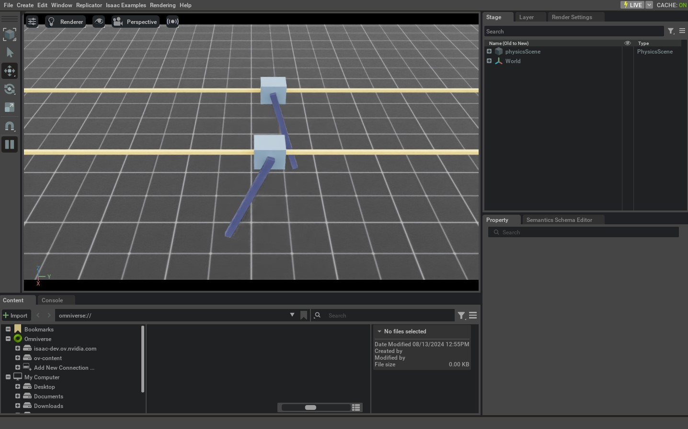

<a id="tutorial-interact-articulation"></a>

# 관절된 로봇과 상호작용

이 튜토리얼은 시뮬레이션에서 관절된 로봇과 상호작용하는 방법을 보여줍니다. 이는
[강체 객체와 상호작용](run_rigid_object.md#tutorial-interact-rigid-object) 튜토리얼의 연속으로, 여기서 우리는 강체 객체와 상호작용하는 방법을 배웠습니다.
루트 상태 설정 외에도 관절 상태를 설정하고 관절 로봇에 명령을 적용하는 방법을 볼 수 있습니다.

## 코드

이 튜토리얼은 `scripts/tutorials/01_assets` 디렉터리의 `run_articulation.py` 스크립트에 해당됩니다.

### run_articulation.py 코드

```python
# Copyright (c) 2022-2026, The Isaac Lab Project Developers (https://github.com/isaac-sim/IsaacLab/blob/main/CONTRIBUTORS.md).
# All rights reserved.
#
# SPDX-License-Identifier: BSD-3-Clause

"""This script demonstrates how to spawn a cart-pole and interact with it.

.. code-block:: bash

    # Usage
    ./isaaclab.sh -p scripts/tutorials/01_assets/run_articulation.py

"""

"""Launch Isaac Sim Simulator first."""


import argparse

from isaaclab.app import AppLauncher

# add argparse arguments
parser = argparse.ArgumentParser(description="Tutorial on spawning and interacting with an articulation.")
# append AppLauncher cli args
AppLauncher.add_app_launcher_args(parser)
# parse the arguments
args_cli = parser.parse_args()

# launch omniverse app
app_launcher = AppLauncher(args_cli)
simulation_app = app_launcher.app

"""Rest everything follows."""

import torch

import isaaclab.sim as sim_utils
from isaaclab.assets import Articulation
from isaaclab.sim import SimulationContext

##
# Pre-defined configs
##
from isaaclab_assets import CARTPOLE_CFG  # isort:skip


def design_scene() -> tuple[dict, list[list[float]]]:
    """Designs the scene."""
    # Ground-plane
    cfg = sim_utils.GroundPlaneCfg()
    cfg.func("/World/defaultGroundPlane", cfg)
    # Lights
    cfg = sim_utils.DomeLightCfg(intensity=3000.0, color=(0.75, 0.75, 0.75))
    cfg.func("/World/Light", cfg)

    # Create separate groups called "Origin1", "Origin2"
    # Each group will have a robot in it
    origins = [[0.0, 0.0, 0.0], [-1.0, 0.0, 0.0]]
    # Origin 1
    sim_utils.create_prim("/World/Origin1", "Xform", translation=origins[0])
    # Origin 2
    sim_utils.create_prim("/World/Origin2", "Xform", translation=origins[1])

    # Articulation
    cartpole_cfg = CARTPOLE_CFG.copy()
    cartpole_cfg.prim_path = "/World/Origin.*/Robot"
    cartpole = Articulation(cfg=cartpole_cfg)

    # return the scene information
    scene_entities = {"cartpole": cartpole}
    return scene_entities, origins


def run_simulator(sim: sim_utils.SimulationContext, entities: dict[str, Articulation], origins: torch.Tensor):
    """Runs the simulation loop."""
    # Extract scene entities
    # note: we only do this here for readability. In general, it is better to access the entities directly from
    #   the dictionary. This dictionary is replaced by the InteractiveScene class in the next tutorial.
    robot = entities["cartpole"]
    # Define simulation stepping
    sim_dt = sim.get_physics_dt()
    count = 0
    # Simulation loop
    while simulation_app.is_running():
        # Reset
        if count % 500 == 0:
            # reset counter
            count = 0
            # reset the scene entities
            # root state
            # we offset the root state by the origin since the states are written in simulation world frame
            # if this is not done, then the robots will be spawned at the (0, 0, 0) of the simulation world
            root_state = robot.data.default_root_state.clone()
            root_state[:, :3] += origins
            robot.write_root_pose_to_sim(root_state[:, :7])
            robot.write_root_velocity_to_sim(root_state[:, 7:])
            # set joint positions with some noise
            joint_pos, joint_vel = robot.data.default_joint_pos.clone(), robot.data.default_joint_vel.clone()
            joint_pos += torch.rand_like(joint_pos) * 0.1
            robot.write_joint_state_to_sim(joint_pos, joint_vel)
            # clear internal buffers
            robot.reset()
            print("[INFO]: Resetting robot state...")
        # Apply random action
        # -- generate random joint efforts
        efforts = torch.randn_like(robot.data.joint_pos) * 5.0
        # -- apply action to the robot
        robot.set_joint_effort_target(efforts)
        # -- write data to sim
        robot.write_data_to_sim()
        # Perform step
        sim.step()
        # Increment counter
        count += 1
        # Update buffers
        robot.update(sim_dt)


def main():
    """Main function."""
    # Load kit helper
    sim_cfg = sim_utils.SimulationCfg(device=args_cli.device)
    sim = SimulationContext(sim_cfg)
    # Set main camera
    sim.set_camera_view([2.5, 0.0, 4.0], [0.0, 0.0, 2.0])
    # Design scene
    scene_entities, scene_origins = design_scene()
    scene_origins = torch.tensor(scene_origins, device=sim.device)
    # Play the simulator
    sim.reset()
    # Now we are ready!
    print("[INFO]: Setup complete...")
    # Run the simulator
    run_simulator(sim, scene_entities, scene_origins)


if __name__ == "__main__":
    # run the main function
    main()
    # close sim app
    simulation_app.close()
```

## 코드 설명

### 장면 설계

이전 튜토리얼과 마찬가지로, 우리는 지상 평면과 멀리 떨어진 조명으로 장면을 채웁니다. 강체 객체를 생성하는 대신, 이제 우리는 USD 파일에서 카트폴 관절을 생성합니다. 카트폴은 카트와 그에 연결된 폴로 구성된 간단한 로봇입니다. 카트는 x축을 따라 자유롭게 움직일 수 있고, 폴은 카트 주위를 자유롭게 회전할 수 있습니다. 카트폴의 USD 파일에는 로봇의 기하학, 관절 및 기타 물리적 속성이 포함됩니다.

카트폴에 대해, 우리는 [`assets.ArticulationCfg`](../../api/lab/isaaclab.assets.md#isaaclab.assets.ArticulationCfg) 클래스의 인스턴스인 사전 정의된 구성 객체를 사용합니다. 이 클래스는 관절의 스폰 전략, 기본 초기 상태, 다양한 관절에 대한 액추에이터 모델, 그리고 기타 메타 정보에 대한 정보를 포함합니다. 이 구성 객체를 생성하는 방법에 대한 더 깊은 내용은 [에셋 구성 작성](../../how-to/write_articulation_cfg.md#how-to-write-articulation-config) 튜토리얼에서 제공됩니다.

이전 튜토리얼에서 보았듯이, [`assets.Articulation`](../../api/lab/isaaclab.assets.md#isaaclab.assets.Articulation) 클래스의 인스턴스를 생성하여 구성 객체를 전달함으로써 관절을 장면에 유사하게 스폰할 수 있습니다.

```python
    # Create separate groups called "Origin1", "Origin2"
    # Each group will have a robot in it
    origins = [[0.0, 0.0, 0.0], [-1.0, 0.0, 0.0]]
    # Origin 1
    sim_utils.create_prim("/World/Origin1", "Xform", translation=origins[0])
    # Origin 2
    sim_utils.create_prim("/World/Origin2", "Xform", translation=origins[1])

    # Articulation
    cartpole_cfg = CARTPOLE_CFG.copy()
    cartpole_cfg.prim_path = "/World/Origin.*/Robot"
    cartpole = Articulation(cfg=cartpole_cfg)
```

### 시뮬레이션 루프 실행

이전 튜토리얼과 마찬가지로, 우리는 정기 간격으로 시뮬레이션을 재설정하고, 관절에 명령을 보내고, 시뮬레이션을 단계별로 진행하고, 관절의 내부 버퍼를 업데이트합니다.

#### 시뮬레이션 재설정

강체 객체와 유사하게, 관절도 루트 상태를 가집니다. 이 상태는 관절 트리의 루트 본에 해당합니다. 루트 상태 외에도, 관절은 관절 상태도 가집니다. 이 상태는 관절의 위치와 속도에 해당합니다.

관절을 재설정하기 위해, 먼저 `Articulation.write_root_pose_to_sim()` 및 `Articulation.write_root_velocity_to_sim()` 메서드를 호출하여 루트 상태를 설정합니다. 마찬가지로, `Articulation.write_joint_state_to_sim()` 메서드를 호출하여 관절 상태를 설정합니다. 마지막으로, `Articulation.reset()` 메서드를 호출하여 내부 버퍼와 캐시를 재설정합니다.

```python
            # reset the scene entities
            # root state
            # we offset the root state by the origin since the states are written in simulation world frame
            # if this is not done, then the robots will be spawned at the (0, 0, 0) of the simulation world
            root_state = robot.data.default_root_state.clone()
            root_state[:, :3] += origins
            robot.write_root_pose_to_sim(root_state[:, :7])
            robot.write_root_velocity_to_sim(root_state[:, 7:])
            # set joint positions with some noise
            joint_pos, joint_vel = robot.data.default_joint_pos.clone(), robot.data.default_joint_vel.clone()
            joint_pos += torch.rand_like(joint_pos) * 0.1
            robot.write_joint_state_to_sim(joint_pos, joint_vel)
            # clear internal buffers
            robot.reset()
            print("[INFO]: Resetting robot state...")
```

#### 시뮬레이션 단계 진행

관절에 명령을 적용하는 것은 두 단계로 구성됩니다:

1. *관절 목표 설정*: 이는 관절에 대한 원하는 관절 위치, 속도 또는 노력 목표를 설정합니다.
2. *시뮬레이션에 데이터 쓰기*: 이 단계에서는 관절의 구성에 따라, [액추에이터 변환](../../overview/core-concepts/actuators.md#overview-actuators)을 처리하고 변환된 값을 PhysX 버퍼에 씁니다.

이 튜토리얼에서는 관절 노력 명령으로 관절을 제어합니다. 이를 위해, 관절의 강성과 감쇠 매개변수를 0으로 설정해야 합니다. 이는 카트폴의 사전 정의된 구성 객체 내에서 미리 수행됩니다.

매 단계마다, 우리는 무작위로 관절 노력 값을 샘플링하고, `Articulation.set_joint_effort_target()` 메서드를 호출하여 관절에 이를 설정합니다. 목표를 설정한 후, `Articulation.write_data_to_sim()` 메서드를 호출하여 데이터를 PhysX 버퍼에 씁니다. 마지막으로, 시뮬레이션을 단계별로 진행합니다.

```python
        # Apply random action
        # -- generate random joint efforts
        efforts = torch.randn_like(robot.data.joint_pos) * 5.0
        # -- apply action to the robot
        robot.set_joint_effort_target(efforts)
        # -- write data to sim
        robot.write_data_to_sim()
```

#### 상태 업데이트

모든 관절 클래스는 [`assets.ArticulationData`](../../api/lab/isaaclab.assets.md#isaaclab.assets.ArticulationData) 객체를 포함합니다. 이 객체는 관절의 상태를 저장합니다. 버퍼 내의 상태를 업데이트하기 위해, [`assets.Articulation.update()`](../../api/lab/isaaclab.assets.md#isaaclab.assets.Articulation.update) 메서드를 호출합니다.

```python
        # Update buffers
        robot.update(sim_dt)
```

## 코드 실행

터미널에서 스크립트를 실행하여 결과를 확인해 보겠습니다:

```bash
./isaaclab.sh -p scripts/tutorials/01_assets/run_articulation.py
```

이 명령은 지상 평면, 조명 및 무작위로 움직이는 두 개의 카트폴이 있는 단계를 열어야 합니다. 시뮬레이션을 중지하려면 창을 닫거나 터미널에서 `Ctrl+C`를 누를 수 있습니다.



이 튜토리얼에서 우리는 간단한 관절 로봇을 생성하고 상호작용하는 방법을 배웠습니다. 관절의 상태(루트 및 관절 상태)를 설정하고 이에 명령을 적용하는 방법을 보았습니다. 또한 시뮬레이션에서 최신 상태를 읽기 위해 버퍼를 업데이트하는 방법도 보았습니다.

이 튜토리얼 외에도, 우리는 `scripts/demos` 디렉터리에 다양한 로봇을 생성하는 다른 스크립트도 제공합니다. 다음과 같이 실행할 수 있습니다:

```bash
# 다양한 singolo-arm 매니퓰레이터 생성
./isaaclab.sh -p scripts/demos/arms.py

# 다양한 쿼드러페드 생성
./isaaclab.sh -p scripts/demos/quadrupeds.py
```
