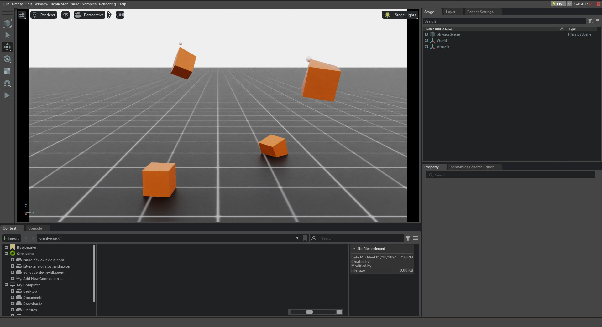

<a id="tutorial-interact-deformable-object"></a>

# 변형 가능한 객체와 상호작용하기

변형 가능한 객체는 때때로 천, 유체 및 연체 물체와 같은 더 넓은 범주의 객체를 가리키기도 하지만,
PhysX에서는 변형 가능한 객체가 문법적으로 소프트 바디에 해당합니다. 강체와 달리, 소프트 바디는 외부 힘과 충돌에 따라 변형될 수 있습니다.

PhysX에서는 유한 요소 방법(FEM)을 사용하여 소프트 바디를 시뮬레이션합니다. 소프트 바디는 두 개의 테트라헤드럴 메시로 구성됩니다 – 시뮬레이션 메시와 충돌 메시. 시뮬레이션 메시는 소프트 바디의 변형을 시뮬레이션하는 데 사용되며, 충돌 메시는 씬의 다른 객체와의 충돌을 감지하는 데 사용됩니다.
자세한 내용은 [PhysX 문서](https://nvidia-omniverse.github.io/PhysX/physx/5.4.1/docs/SoftBodies.html)를 참고하세요.

이 튜토리얼에서는 시뮬레이션에서 변형 가능한 객체와 상호작용하는 방법을 보여줍니다. 소프트 큐브 세트를 생성하고, 그들의 노드 위치와 속도를 설정하는 방법뿐 아니라, 메시 노드에 키네마틱 명령을 적용하여 소프트 바디를 이동하는 방법을 살펴볼 것입니다.

## 코드

이 튜토리얼은 `scripts/tutorials/01_assets` 디렉터리의 `run_deformable_object.py` 스크립트에 해당합니다.

### run_deformable_object.py 코드

```python
# Copyright (c) 2022-2026, The Isaac Lab Project Developers (https://github.com/isaac-sim/IsaacLab/blob/main/CONTRIBUTORS.md).
# All rights reserved.
#
# SPDX-License-Identifier: BSD-3-Clause

"""
이 스크립트는 변형 가능한 객체와 함께 작업하고 상호작용하는 방법을 보여줍니다.

.. code-block:: bash

    # Usage
    ./isaaclab.sh -p scripts/tutorials/01_assets/run_deformable_object.py

"""

"""Isaac Sim 시뮬레이터 먼저 실행하기."""


import argparse

from isaaclab.app import AppLauncher

# add argparse arguments
parser = argparse.ArgumentParser(description="변형 가능한 객체와 상호작용하는 튜토리얼.")
# append AppLauncher cli args
AppLauncher.add_app_launcher_args(parser)
# parse the arguments
args_cli = parser.parse_args()

# launch omniverse app
app_launcher = AppLauncher(args_cli)
simulation_app = app_launcher.app

"""Rest everything follows."""

import torch

import isaaclab.sim as sim_utils
import isaaclab.utils.math as math_utils
from isaaclab.assets import DeformableObject, DeformableObjectCfg
from isaaclab.sim import SimulationContext


def design_scene():
    """Scene을 설계합니다."""
    # Ground-plane
    cfg = sim_utils.GroundPlaneCfg()
    cfg.func("/World/defaultGroundPlane", cfg)
    # Lights
    cfg = sim_utils.DomeLightCfg(intensity=2000.0, color=(0.8, 0.8, 0.8))
    cfg.func("/World/Light", cfg)

    # Create separate groups called "Origin1", "Origin2", "Origin3"
    # Each group will have a robot in it
    origins = [[0.25, 0.25, 0.0], [-0.25, 0.25, 0.0], [0.25, -0.25, 0.0], [-0.25, -0.25, 0.0]]
    for i, origin in enumerate(origins):
        sim_utils.create_prim(f"/World/Origin{i}", "Xform", translation=origin)

    # Deformable Object
    cfg = DeformableObjectCfg(
        prim_path="/World/Origin.*/Cube",
        spawn=sim_utils.MeshCuboidCfg(
            size=(0.2, 0.2, 0.2),
            deformable_props=sim_utils.DeformableBodyPropertiesCfg(rest_offset=0.0, contact_offset=0.001),
            visual_material=sim_utils.PreviewSurfaceCfg(diffuse_color=(0.5, 0.1, 0.0)),
            physics_material=sim_utils.DeformableBodyMaterialCfg(poissons_ratio=0.4, youngs_modulus=1e5),
        ),
        init_state=DeformableObjectCfg.InitialStateCfg(pos=(0.0, 0.0, 1.0)),
        debug_vis=True,
    )
    cube_object = DeformableObject(cfg=cfg)

    # return the scene information
    scene_entities = {"cube_object": cube_object}
    return scene_entities, origins


def run_simulator(sim: sim_utils.SimulationContext, entities: dict[str, DeformableObject], origins: torch.Tensor):
    """시뮬레이션 루프를 실행합니다."""
    # Extract scene entities
    # note: we only do this here for readability. In general, it is better to access the entities directly from
    #   the dictionary. This dictionary is replaced by the InteractiveScene class in the next tutorial.
    cube_object = entities["cube_object"]
    # Define simulation stepping
    sim_dt = sim.get_physics_dt()
    sim_time = 0.0
    count = 0

    # Nodal kinematic targets of the deformable bodies
    nodal_kinematic_target = cube_object.data.nodal_kinematic_target.clone()

    # Simulate physics
    while simulation_app.is_running():
        # reset
        if count % 250 == 0:
            # reset counters
            sim_time = 0.0
            count = 0

            # reset the nodal state of the object
            nodal_state = cube_object.data.default_nodal_state_w.clone()
            # apply random pose to the object
            pos_w = torch.rand(cube_object.num_instances, 3, device=sim.device) * 0.1 + origins
            quat_w = math_utils.random_orientation(cube_object.num_instances, device=sim.device)
            nodal_state[..., :3] = cube_object.transform_nodal_pos(nodal_state[..., :3], pos_w, quat_w)

            # write nodal state to simulation
            cube_object.write_nodal_state_to_sim(nodal_state)

            # Write the nodal state to the kinematic target and free all vertices
            nodal_kinematic_target[..., :3] = nodal_state[..., :3]
            nodal_kinematic_target[..., 3] = 1.0
            cube_object.write_nodal_kinematic_target_to_sim(nodal_kinematic_target)

            # reset buffers
            cube_object.reset()

            print("----------------------------------------")
            print("[INFO]: Resetting object state...")

        # update the kinematic target for cubes at index 0 and 3
        # we slightly move the cube in the z-direction by picking the vertex at index 0
        nodal_kinematic_target[[0, 3], 0, 2] += 0.001
        # set vertex at index 0 to be kinematically constrained
        # 0: constrained, 1: free
        nodal_kinematic_target[[0, 3], 0, 3] = 0.0
        # write kinematic target to simulation
        cube_object.write_nodal_kinematic_target_to_sim(nodal_kinematic_target)

        # write internal data to simulation
        cube_object.write_data_to_sim()
        # perform step
        sim.step()
        # update sim-time
        sim_time += sim_dt
        count += 1
        # update buffers
        cube_object.update(sim_dt)
        # print the root position
        if count % 50 == 0:
            print(f"Root position (in world): {cube_object.data.root_pos_w[:, :3]}")


def main():
    """Main function."""
    # Load kit helper
    sim_cfg = sim_utils.SimulationCfg(device=args_cli.device)
    sim = SimulationContext(sim_cfg)
    # Set main camera
    sim.set_camera_view(eye=[3.0, 0.0, 1.0], target=[0.0, 0.0, 0.5])
    # Design scene
    scene_entities, scene_origins = design_scene()
    scene_origins = torch.tensor(scene_origins, device=sim.device)
    # Play the simulator
    sim.reset()
    # Now we are ready!
    print("[INFO]: Setup complete...")
    # Run the simulator
    run_simulator(sim, scene_entities, scene_origins)


if __name__ == "__main__":
    # run the main function
    main()
    # close sim app
    simulation_app.close()
```

## 코드 설명

### 장면 설계하기

[Interacting with a rigid object](run_rigid_object.md#tutorial-interact-rigid-object) 튜토리얼과 유사하게, 우리는 지면 평면과 광원을 포함한 장면을 채웁니다. 또한 [`assets.DeformableObject`](../../api/lab/isaaclab.assets.md#isaaclab.assets.DeformableObject) 클래스를 사용하여 변형 가능한 객체를 장면에 추가합니다. 이 클래스는 입력 경로에 프리밈을 생성하고 해당하는 변형 가능한 바디 물리 핸들을 초기화하는 역할을 합니다.

이 튜토리얼에서는 [`assets.DeformableObjectCfg`](../../api/lab/isaaclab.assets.md#isaaclab.assets.DeformableObjectCfg) 클래스를 사용하여 변형 가능한 큐브와 유사한 구성으로 입방체 소프트 객체를 생성합니다. 유일한 차이점은 이제 스폰 구성을 [`assets.DeformableObjectCfg`](../../api/lab/isaaclab.assets.md#isaaclab.assets.DeformableObjectCfg) 클래스로 감쌌다는 것입니다. 이 클래스는 자산의 스폰 전략과 기본 초기 상태에 대한 정보를 포함합니다. 이 클래스가 [`assets.DeformableObject`](../../api/lab/isaaclab.assets.md#isaaclab.assets.DeformableObject) 클래스에 전달되면, 객체를 생성하고 시뮬레이션이 재생될 때 해당 물리 핸들을 초기화합니다.

#### 참고
변형 가능한 객체는 GPU 시뮬레이션에서만 지원되며, 변형 가능한 바디 물리 속성을 가진 메시 객체를 생성해야 합니다.

강체 튜토리얼에서 보았듯이, [`assets.DeformableObject`](../../api/lab/isaaclab.assets.md#isaaclab.assets.DeformableObject) 클래스의 인스턴스를 생성하고 구성 객체를 생성자에 전달하여 유사한 방식으로 장면에 변형 가능한 객체를 생성할 수 있습니다.

```python
    # Create separate groups called "Origin1", "Origin2", "Origin3"
    # Each group will have a robot in it
    origins = [[0.25, 0.25, 0.0], [-0.25, 0.25, 0.0], [0.25, -0.25, 0.0], [-0.25, -0.25, 0.0]]
    for i, origin in enumerate(origins):
        sim_utils.create_prim(f"/World/Origin{i}", "Xform", translation=origin)

    # Deformable Object
    cfg = DeformableObjectCfg(
        prim_path="/World/Origin.*/Cube",
        spawn=sim_utils.MeshCuboidCfg(
            size=(0.2, 0.2, 0.2),
            deformable_props=sim_utils.DeformableBodyPropertiesCfg(rest_offset=0.0, contact_offset=0.001),
            visual_material=sim_utils.PreviewSurfaceCfg(diffuse_color=(0.5, 0.1, 0.0)),
            physics_material=sim_utils.DeformableBodyMaterialCfg(poissons_ratio=0.4, youngs_modulus=1e5),
        ),
        init_state=DeformableObjectCfg.InitialStateCfg(pos=(0.0, 0.0, 1.0)),
        debug_vis=True,
    )
    cube_object = DeformableObject(cfg=cfg)
```

### 시뮬레이션 루프 실행하기

[Interacting with a rigid object](run_rigid_object.md#tutorial-interact-rigid-object) 튜토리얼에서 이어서, 우리는 정기 간격으로 시뮬레이션을 리셋하고, 키네마틱 명령을 적용합니다
변형 가능한 물체의 상태를 재설정하고, 시뮬레이션을 진행하며, 변형 가능한 물체의 내부 버퍼를 업데이트합니다.

#### 시뮬레이션 상태 재설정

강체와 관절과 달리, 변형 가능한 물체는 다른 상태 표현을 가지고 있습니다. 변형 가능한 물체의 상태는 메시의 노드 위치와 속도로 정의됩니다. 노드 위치와 속도는 **시뮬레이션 월드 프레임**에서 정의되며, [`assets.DeformableObject.data`](../../api/lab/isaaclab.assets.md#isaaclab.assets.DeformableObject.data) 속성에 저장됩니다.

우리는 `assets.DeformableObject.data.default_nodal_state_w` 속성을 사용하여 생성된 오브젝트 프라임의 기본 노드 상태를 얻습니다. 이 기본 상태는 [`assets.DeformableObjectCfg.init_state`](../../api/lab/isaaclab.assets.md#isaaclab.assets.DeformableObjectCfg.init_state) 속성에서 구성할 수 있으며, 이 튜토리얼에서는 항등 연산으로 설정했습니다.

#### ATTENTION
구성 [`assets.DeformableObjectCfg`](../../api/lab/isaaclab.assets.md#isaaclab.assets.DeformableObjectCfg)의 초기 상태는 스폰 시점에서의 변형 가능한 물체의 자세를 지정합니다. 이 초기 상태를 기반으로, 시뮬레이션이 처음 실행될 때 기본 노드 상태가 얻어집니다.

우리는 노드 위치에 변환을 적용하여 변형 가능한 물체의 초기 상태를 랜덤화합니다.

```python
            # reset the nodal state of the object
            nodal_state = cube_object.data.default_nodal_state_w.clone()
            # apply random pose to the object
            pos_w = torch.rand(cube_object.num_instances, 3, device=sim.device) * 0.1 + origins
            quat_w = math_utils.random_orientation(cube_object.num_instances, device=sim.device)
            nodal_state[..., :3] = cube_object.transform_nodal_pos(nodal_state[..., :3], pos_w, quat_w)
```

변형 가능한 물체를 재설정하기 위해, 먼저 [`assets.DeformableObject.write_nodal_state_to_sim()`](../../api/lab/isaaclab.assets.md#isaaclab.assets.DeformableObject.write_nodal_state_to_sim) 메서드를 호출하여 노드 상태를 설정합니다. 이 메서드는 변형 가능한 물체 프라임의 노드 상태를 시뮬레이션 버퍼에 기록합니다. 또한, 이전 시뮬레이션 단계에서 노드에 설정된 모든 운동학적 타깃을 해제하기 위해 [`assets.DeformableObject.write_nodal_kinematic_target_to_sim()`](../../api/lab/isaaclab.assets.md#isaaclab.assets.DeformableObject.write_nodal_kinematic_target_to_sim) 메서드를 호출합니다. 운동학적 타깃에 대해서는 다음 섹션에서 설명합니다.

마지막으로, [`assets.DeformableObject.reset()`](../../api/lab/isaaclab.assets.md#isaaclab.assets.DeformableObject.reset) 메서드를 호출하여 내부 버퍼와 캐시를 재설정합니다.

```python
            # write nodal state to simulation
            cube_object.write_nodal_state_to_sim(nodal_state)

            # Write the nodal state to the kinematic target and free all vertices
            nodal_kinematic_target[..., :3] = nodal_state[..., :3]
            nodal_kinematic_target[..., 3] = 1.0
            cube_object.write_nodal_kinematic_target_to_sim(nodal_kinematic_target)

            # reset buffers
            cube_object.reset()
```

#### 시뮬레이션 진행

변형 가능한 물체는 사용자 주도형 운동학적 제어를 지원하며, 사용자는 메시 노드의 일부에 대해 위치 타깃을 지정하고, 나머지는 FEM 솔버를 사용하여 시뮬레이션할 수 있습니다. 이 [부분 운동학적](https://nvidia-omniverse.github.io/PhysX/physx/5.4.1/docs/SoftBodies.html#kinematic-soft-bodies) 제어는 사용자가 변형 가능한 물체를 통제된 방식으로 상호작용하고자 할 때 유용합니다.

이 튜토리얼에서는 сц에 있는 네 개의 큐브 중 두 개에 운동학적 명령을 적용합니다. 인덱스 0의 노드(좌측 하단 모서리)에 위치 타깃을 설정하여 z-축을 따라 큐브를 이동시킵니다.

매 단계마다, 해당 노드의 운동학적 위치 타깃에 작은 값을 더합니다. 또한, 시뮬레이션 버퍼에서 해당 노드가 운동학적 타깃임을 나타내는 플래그를 설정합니다. 이 값들은 [`assets.DeformableObject.write_nodal_kinematic_target_to_sim()`](../../api/lab/isaaclab.assets.md#isaaclab.assets.DeformableObject.write_nodal_kinematic_target_to_sim) 메서드를 호출하여 시뮬레이션 버퍼에 설정됩니다.

```python
        # update the kinematic target for cubes at index 0 and 3
        # we slightly move the cube in the z-direction by picking the vertex at index 0
        nodal_kinematic_target[[0, 3], 0, 2] += 0.001
        # set vertex at index 0 to be kinematically constrained
        # 0: constrained, 1: free
        nodal_kinematic_target[[0, 3], 0, 3] = 0.0
        # write kinematic target to simulation
        cube_object.write_nodal_kinematic_target_to_sim(nodal_kinematic_target)
```

강체와 관절과 유사하게, 시뮬레이션을 진행하기 전에 [`assets.DeformableObject.write_data_to_sim()`](../../api/lab/isaaclab.assets.md#isaaclab.assets.DeformableObject.write_data_to_sim) 메서드를 수행합니다. 변형 가능한 물체의 경우, 이 메서드는 물체에 외부 힘을 적용하지 않지만, 완전성을 유지하고 미래의 확장을 위해 이 메서드를 유지합니다.

```python
        # write internal data to simulation
        cube_object.write_data_to_sim()
```

#### 상태 업데이트

시뮬레이션을 진행한 후, 변형 가능한 물체 프라임의 내부 버퍼를 업데이트하여 새 상태를 [`assets.DeformableObject.data`](../../api/lab/isaaclab.assets.md#isaaclab.assets.DeformableObject.data) 속성에 반영합니다. 이는 [`assets.DeformableObject.update()`](../../api/lab/isaaclab.assets.md#isaaclab.assets.DeformableObject.update) 메서드를 사용하여 수행됩니다.

고정된 간격으로, 터미널에 변형 가능한 물체의 루트 위치를 출력합니다. 앞서 언급했듯이, 변형 가능한 물체에는 루트 상태의 개념이 없습니다. 그러나 루트 위치는 메시의 모든 노드 위치의 평균으로 계산합니다.

```python
        # update buffers
        cube_object.update(sim_dt)
        # print the root position
        if count % 50 == 0:
            print(f"Root position (in world): {cube_object.data.root_pos_w[:, :3]}")
```

## 코드 실행

이제 코드를 살펴보았으니, 스크립트를 실행하여 결과를 확인해 보겠습니다:

```bash
./isaaclab.sh -p scripts/tutorials/01_assets/run_deformable_object.py
```

이 명령은 지면 평면, 조명, 그리고 여러 개의 녹색 큐브가 있는 스테이지를 열어야 합니다. 네 개의 큐브 중 두 개는 높이에서 떨어져 지면에 정착해야 하며, 나머지 두 개는 z-축을 따라 이동해야 합니다. 큐브의 좌측 하단 모서리 노드에 대한 운동학적 타깃 위치를 표시하는 마커를 볼 수 있어야 합니다. 시뮬레이션을 중지하려면 창을 닫거나 터미널에서 `Ctrl+C`를 누르면 됩니다.



이 튜토리얼에서는 변형 가능한 물체를 생성하고, `DeformableObject` 클래스로 감싸서 물리 핸들을 초기화하는 방법을 보여주었습니다. 이를 통해 상태를 설정하고 얻을 수 있습니다. 또한, 변형 가능한 물체에 운동학적 명령을 적용하여 메시 노드를 통제된 방식으로 이동시키는 방법도 살펴보았습니다. 다음 튜토리얼에서는 `InteractiveScene` 클래스를 사용하여 장면을 만드는 방법을 다룰 것입니다.
