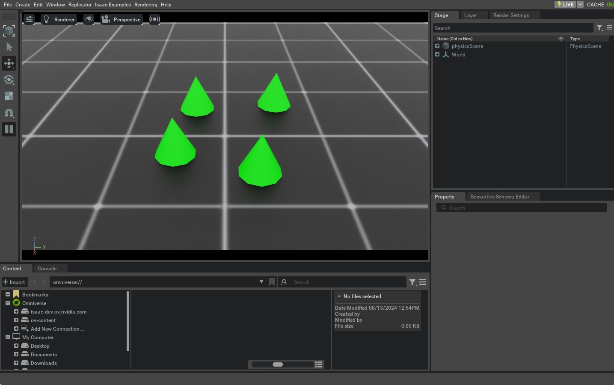

<a id="tutorial-interact-rigid-object"></a>

# rigid object 상호작용

이전 튜토리얼에서는 standalone script의 필수 동작과 시뮬레이션에 다양한 객체(또는 *prims*)를 생성하는 방법을 배웠습니다.
이 튜토리얼에서는 rigid object를 생성하고 상호작용하는 방법을 보여줍니다.
이를 위해 Isaac Lab에서 제공하는 [`assets.RigidObject`](../../api/lab/isaaclab.assets.md#isaaclab.assets.RigidObject) 클래스를 사용합니다.

## 코드

이 튜토리얼은 `scripts/tutorials/01_assets` 디렉터리의 `run_rigid_object.py` 스크립트에 해당합니다.

### run_rigid_object.py 코드

```python
# Copyright (c) 2022-2026, The Isaac Lab Project Developers (https://github.com/isaac-sim/IsaacLab/blob/main/CONTRIBUTORS.md).
# All rights reserved.
#
# SPDX-License-Identifier: BSD-3-Clause

"""
이 스크립트는 rigid object를 생성하고 상호작용하는 방법을 보여줍니다.

.. code-block:: bash

    # 사용법
    ./isaaclab.sh -p scripts/tutorials/01_assets/run_rigid_object.py

"""

"""먼저 Isaac Sim 시뮬레이터를 시작합니다."""


import argparse

from isaaclab.app import AppLauncher

# argparse 인수 추가
parser = argparse.ArgumentParser(description="rigid object 생성 및 상호작용 튜토리얼.")
# AppLauncher cli 인수 추가
AppLauncher.add_app_launcher_args(parser)
# 인수 파싱
args_cli = parser.parse_args()

# 옴니버스 앱 실행
app_launcher = AppLauncher(args_cli)
simulation_app = app_launcher.app

"""나머지 부분은 여기서부터 시작합니다."""

import torch

import isaaclab.sim as sim_utils
import isaaclab.utils.math as math_utils
from isaaclab.assets import RigidObject, RigidObjectCfg
from isaaclab.sim import SimulationContext


def design_scene():
    """장면을 설계합니다."""
    # Ground-plane
    cfg = sim_utils.GroundPlaneCfg()
    cfg.func("/World/defaultGroundPlane", cfg)
    # 라이트
    cfg = sim_utils.DomeLightCfg(intensity=2000.0, color=(0.8, 0.8, 0.8))
    cfg.func("/World/Light", cfg)

    # "Origin1", "Origin2", "Origin3"이라는 별도의 그룹을 생성합니다.
    # 각 그룹에는 로봇이 하나씩 있습니다.
    origins = [[0.25, 0.25, 0.0], [-0.25, 0.25, 0.0], [0.25, -0.25, 0.0], [-0.25, -0.25, 0.0]]
    for i, origin in enumerate(origins):
        sim_utils.create_prim(f"/World/Origin{i}", "Xform", translation=origin)

    # rigid object
    cone_cfg = RigidObjectCfg(
        prim_path="/World/Origin.*/Cone",
        spawn=sim_utils.ConeCfg(
            radius=0.1,
            height=0.2,
            rigid_props=sim_utils.RigidBodyPropertiesCfg(),
            mass_props=sim_utils.MassPropertiesCfg(mass=1.0),
            collision_props=sim_utils.CollisionPropertiesCfg(),
            visual_material=sim_utils.PreviewSurfaceCfg(diffuse_color=(0.0, 1.0, 0.0), metallic=0.2),
        ),
        init_state=RigidObjectCfg.InitialStateCfg(),
    )
    cone_object = RigidObject(cfg=cone_cfg)

    # 장면 정보 반환
    scene_entities = {"cone": cone_object}
    return scene_entities, origins


def run_simulator(sim: sim_utils.SimulationContext, entities: dict[str, RigidObject], origins: torch.Tensor):
    """시뮬레이션 루프를 실행합니다."""
    # 장면 엔티티 추출
    # 참고: 여기서는 가독성을 위해 이렇게 하지만 일반적으로는 직접 사전에서 엔티티에 접근하는 것이 더 좋습니다.
    #   이 사전은 다음 튜토리얼의 InteractiveScene 클래스로 대체됩니다.
    cone_object = entities["cone"]
    # 시뮬레이션 스텝 정의
    sim_dt = sim.get_physics_dt()
    sim_time = 0.0
    count = 0
    # 물리 시뮬레이션 실행
    while simulation_app.is_running():
        # 리셋
        if count % 250 == 0:
            # 카운터 리셋
            sim_time = 0.0
            count = 0
            # 루트 상태 리셋
            root_state = cone_object.data.default_root_state.clone()
            # 원점 주변 원통 위에 무작위 위치 샘플링
            root_state[:, :3] += origins
            root_state[:, :3] += math_utils.sample_cylinder(
                radius=0.1, h_range=(0.25, 0.5), size=cone_object.num_instances, device=cone_object.device
            )
            # 시뮬레이션에 루트 상태 기록
            cone_object.write_root_pose_to_sim(root_state[:, :7])
            cone_object.write_root_velocity_to_sim(root_state[:, 7:])
            # 버퍼 리셋
            cone_object.reset()
            print("----------------------------------------")
            print("[INFO]: 객체 상태를 리셋 중...")
        # 시뮬레이션 데이터 적용
        cone_object.write_data_to_sim()
        # 스텝 수행
        sim.step()
        # 시뮬레이션 시간 업데이트
        sim_time += sim_dt
        count += 1
        # 버퍼 업데이트
        cone_object.update(sim_dt)
        # 루트 위치 출력
        if count % 50 == 0:
            print(f"Root position (in world): {cone_object.data.root_pos_w}")


def main():
    """메인 함수."""
    # 키트 헬퍼 로드
    sim_cfg = sim_utils.SimulationCfg(device=args_cli.device)
    sim = SimulationContext(sim_cfg)
    # 메인 카메라 설정
    sim.set_camera_view(eye=[1.5, 0.0, 1.0], target=[0.0, 0.0, 0.0])
    # 장면 설계
    scene_entities, scene_origins = design_scene()
    scene_origins = torch.tensor(scene_origins, device=sim.device)
    # 시뮬레이터 실행
    sim.reset()
    # 이제 준비 완료!
    print("[INFO]: 설정 완료...")
    # 시뮬레이터 실행
    run_simulator(sim, scene_entities, scene_origins)


if __name__ == "__main__":
    # 메인 함수 실행
    main()
    # 시뮬레이터 앱 종료
    simulation_app.close()
```

## 코드 설명

이 스크립트에서는 `main` 함수를 두 개의 별도 함수로 나누어 시뮬레이터에서 시뮬레이션을 설정하는 두 가지 주요 단계를 강조합니다.

1. **장면 설계**: 이름이 시사하는 바와 같이, 이 부분은 장면에 모든 prims를 추가하는 역할을 합니다.
2. **시뮬레이션 실행**: 이 부분은 시뮬레이터를 스텝 실행하고, 장면에 있는 prims와 상호작용(예: 포즈 변경)하며, 필요에 따라 명령을 적용하는 역할을 합니다.

이 두 단계는 시뮬레이터가 리셋된 후에야 두 번째 단계가 시작되므로 구분해야 합니다.
시뮬레이터가 리셋되면(자동으로 시뮬레이션이 재생됨) 새롭게 물리 기반 prims를 장면에 추가해서는 안 되며,
이를 예상치 못한 동작을 유발할 수 있습니다. 하지만 prims는 해당 핸들을 통해 상호작용할 수 있습니다.

### 장면 설계

이전 튜토리얼과 유사하게, 우리는 지면 평면과 광원을 장면에 추가합니다.
또한 [`assets.RigidObject`](../../api/lab/isaaclab.assets.md#isaaclab.assets.RigidObject) 클래스를 사용하여 rigid object를 장면에 추가합니다.
이 클래스는 입력 경로에 prims를 생성하고 해당하는 rigid body 물리 핸들을 초기화하는 역할을 합니다.

이 튜토리얼에서는 [Spawn Objects](../00_sim/spawn_prims.md#tutorial-spawn-prims) 튜토리얼의 rigid 원추와 유사한 스폰 구성을 사용하여
원추형 rigid object를 생성합니다.
차이점은 스폰 구성을 [`assets.RigidObjectCfg`](../../api/lab/isaaclab.assets.md#isaaclab.assets.RigidObjectCfg) 클래스로 감쌌다는 점입니다.
이 클래스는 자산의 스폰 전략, 기본 초기 상태, 기타 메타 정보에 대한 정보를 포함합니다.
이 클래스가 [`assets.RigidObject`](../../api/lab/isaaclab.assets.md#isaaclab.assets.RigidObject) 클래스에 전달되면,
시뮬레이션이 재생될 때 객체가 생성되고 해당 물리 핸들이 초기화됩니다.

rigid object prim을 여러 번 생성하는 예시로, 서로 다른 스폰 위치에 해당하는 부모 Xform prims인
`/World/Origin{i}`를 생성합니다.
`/World/Origin.*/Cone`라는 정규 표현식을 [`assets.RigidObject`](../../api/lab/isaaclab.assets.md#isaaclab.assets.RigidObject) 클래스에 전달하면,
각 `/World/Origin{i}` 위치에 rigid object prim이 생성됩니다.
예를 들어 scene에 `/World/Origin1`과 `/World/Origin2`가 존재하는 경우,
rigid object prim은 각각 `/World/Origin1/Cone`과 `/World/Origin2/Cone` 위치에 생성됩니다.

```python
    # "Origin1", "Origin2", "Origin3"이라는 별도의 그룹을 생성합니다.
    # 각 그룹에는 로봇이 하나씩 있습니다.
    origins = [[0.25, 0.25, 0.0], [-0.25, 0.25, 0.0], [0.25, -0.25, 0.0], [-0.25, -0.25, 0.0]]
    for i, origin in enumerate(origins):
        sim_utils.create_prim(f"/World/Origin{i}", "Xform", translation=origin)

    # rigid object
    cone_cfg = RigidObjectCfg(
        prim_path="/World/Origin.*/Cone",
        spawn=sim_utils.ConeCfg(
            radius=0.1,
            height=0.2,
            rigid_props=sim_utils.RigidBodyPropertiesCfg(),
            mass_props=sim_utils.MassPropertiesCfg(mass=1.0),
            collision_props=sim_utils.CollisionPropertiesCfg(),
            visual_material=sim_utils.PreviewSurfaceCfg(diffuse_color=(0.0, 1.0, 0.0), metallic=0.2),
        ),
        init_state=RigidObjectCfg.InitialStateCfg(),
    )
    cone_object = RigidObject(cfg=cone_cfg)
```

rigid object와 상호작용하려면 이 엔티티를 메인 함수로 반환해야 합니다.
이 엔티티는 이후 시뮬레이션 루프에서 rigid object와 상호작용하는 데 사용됩니다.
나중에 진행되는 튜토리얼에서는 [`scene.InteractiveScene`](../../api/lab/isaaclab.scene.md#isaaclab.scene.InteractiveScene) 클래스를 사용하여
여러 장면 엔티티를 더 편리하게 처리하는 방법을 볼 수 있습니다.

```python
    # 장면 정보 반환
    scene_entities = {"cone": cone_object}
    return scene_entities, origins
```

### 시뮬레이션 루프 실행

시뮬레이션 루프를 수정하여 rigid object와 상호작용하도록 구성했습니다.
세 가지 단계로 구성됩니다: 고정 간격에서 시뮬레이션 상태를 리셋하고, 시뮬레이션을 스텝 실행하며,
rigid object의 내부 버퍼를 업데이트합니다.
이 튜토리얼의 편의를 위해 scene 사전에서 rigid object의 엔티티를 추출하여 변수에 저장합니다.

#### 시뮬레이션 상태 리셋

스폰된 rigid object 프림의 시뮬레이션 상태를 재설정하려면 위치와 속도를 설정해야 합니다.
함께 설정하면 생성된 rigid 객체의 루트 상태를 정의합니다. 이 상태가 **시뮬레이션 월드 프레임**에서 정의되며, 부모 Xform 프림의 프레임이 아닌 점을 주의해야 합니다. 이는 물리 엔진이 월드 프레임만 이해하고 부모 Xform 프림의 프레임을 이해하지 않기 때문입니다. 따라서 rigid object 프림의 원하는 상태를 설정하기 전에 월드 프레임으로 변환해야 합니다.

우리는 `assets.RigidObject.data.default_root_state` 속성을 사용하여 스폰된 rigid object 프림의 기본 루트 상태를 가져옵니다. 이 기본 상태는 [`assets.RigidObjectCfg.init_state`](../../api/lab/isaaclab.assets.md#isaaclab.assets.RigidObjectCfg.init_state) 속성에서 구성할 수 있으며, 이 튜토리얼에서는 항등 행렬로 그대로 두었습니다. 그런 다음 루트 상태의 이동을 무작위로 설정하고 [`assets.RigidObject.write_root_pose_to_sim()`](../../api/lab/isaaclab.assets.md#isaaclab.assets.RigidObject.write_root_pose_to_sim) 및 [`assets.RigidObject.write_root_velocity_to_sim()`](../../api/lab/isaaclab.assets.md#isaaclab.assets.RigidObject.write_root_velocity_to_sim) 메서드를 사용하여 rigid object 프림의 원하는 상태를 설정합니다. 이름에서 알 수 있듯이 이 메서드는 rigid object 프림의 루트 상태를 시뮬레이션 버퍼에 기록합니다.

```python
            # 루트 상태 재설정
            root_state = cone_object.data.default_root_state.clone()
            # 원통 모양으로 원점 주변에 무작위 위치 샘플링
            root_state[:, :3] += origins
            root_state[:, :3] += math_utils.sample_cylinder(
                radius=0.1, h_range=(0.25, 0.5), size=cone_object.num_instances, device=cone_object.device
            )
            # 루트 상태를 시뮬레이션에 기록
            cone_object.write_root_pose_to_sim(root_state[:, :7])
            cone_object.write_root_velocity_to_sim(root_state[:, 7:])
            # 버퍼 재설정
            cone_object.reset()
```

#### 시뮬레이션 진행

시뮬레이션을 진행하기 전에 [`assets.RigidObject.write_data_to_sim()`](../../api/lab/isaaclab.assets.md#isaaclab.assets.RigidObject.write_data_to_sim) 메서드를 수행합니다. 이 메서드는 외부 힘 등 다른 데이터를 시뮬레이션 버퍼에 기록합니다. 이 튜토리얼에서는 rigid 객체에 외부 힘을 적용하지 않으므로 이 메서드는 필요하지 않지만, 완전성을 위해 포함했습니다.

```python
        # 시뮬레이션 데이터 적용
        cone_object.write_data_to_sim()
```

#### 상태 업데이트

시뮬레이션을 진행한 후, [`assets.RigidObject.data`](../../api/lab/isaaclab.assets.md#isaaclab.assets.RigidObject.data) 속성을 통해 rigid object 프림의 내부 버퍼를 업데이트하여 새로운 상태를 반영합니다. 이는 [`assets.RigidObject.update()`](../../api/lab/isaaclab.assets.md#isaaclab.assets.RigidObject.update) 메서드를 사용하여 수행됩니다.

```python
        # 버퍼 업데이트
        cone_object.update(sim_dt)
```

## 코드 실행

이제 코드를 살펴봤으니 스크립트를 실행하고 결과를 확인해 보겠습니다:

```bash
./isaaclab.sh -p scripts/tutorials/01_assets/run_rigid_object.py
```

이 명령어는 지면 평면, 조명 및 여러 개의 녹색 콘을 포함한 스테이지를 실행해야 합니다. 콘은 무작위 높이에서 떨어져서 지면에 도착해야 합니다. 시뮬레이션을 중지하려면 창을 닫거나 UI의 `STOP` 버튼을 누르거나 터미널에서 `Ctrl+C`를 누르면 됩니다.



이 튜토리얼에서는 rigid 객체를 스폰하고 `RigidObject` 클래스로 감싸서 물리 핸들을 초기화하고 상태를 설정 및 가져오는 방법을 보여주었습니다. 다음 튜토리얼에서는 관절로 연결된 rigid 객체의 컬렉션인 관절이 있는 객체와 상호작용하는 방법을 살펴볼 것입니다.
