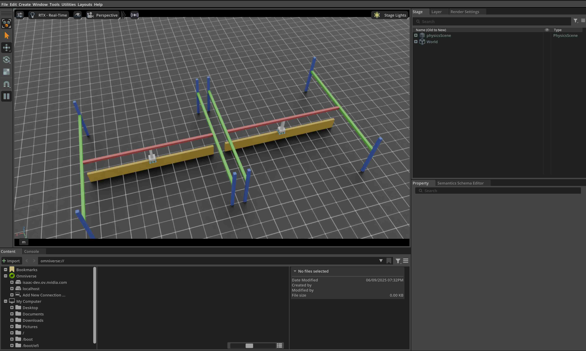

<a id="tutorial-interact-surface-gripper"></a>

# 표면 그립퍼와의 상호작용

이 튜토리얼에서는 시뮬레이션에서 엔드 이펙터에 표면 그립퍼가 부착된 관절식 로봇과 상호작용하는 방법을 보여줍니다. 이 튜토리얼은 [관절식 로봇과의 상호작용](run_articulation.md#tutorial-interact-articulation) 튜토리얼을 이어서 진행하며, 여기서는 관절식 로봇과의 상호작용 방법을 배웠습니다. IsaacSim 5.0부터 표면 그립퍼는 CPU 백엔드에서만 지원된다는 점에 유의하세요.

## 코드

이 튜토리얼은 `scripts/tutorials/01_assets` 디렉터리의 `run_surface_gripper.py` 스크립트에 해당합니다.

### run_surface_gripper.py 코드

```python
# Copyright (c) 2022-2026, The Isaac Lab Project Developers (https://github.com/isaac-sim/IsaacLab/blob/main/CONTRIBUTORS.md).
# All rights reserved.
#
# SPDX-License-Identifier: BSD-3-Clause

"""이 스크립트는 표면 그립퍼가 장착된 피크 앤드 플레이스 로봇을 생성하고 이를 상호작용하는 방법을 보여줍니다.

.. code-block:: bash

    # 사용법
    ./isaaclab.sh -p scripts/tutorials/01_assets/run_surface_gripper.py --device=cpu

이 스크립트를 실행할 때 `--device` 플래그를 cpu로 설정해야 합니다. 이는 표면 그립퍼가 현재 CPU에서만 지원되기 때문입니다.
"""

"""Isaac Sim 시뮬레이터 먼저 실행하기."""

import argparse

from isaaclab.app import AppLauncher

# add argparse arguments
parser = argparse.ArgumentParser(description="Surface Gripper 생성 및 상호작용 튜토리얼입니다.")
# append AppLauncher cli args
AppLauncher.add_app_launcher_args(parser)
# parse the arguments
args_cli = parser.parse_args()

# launch omniverse app
app_launcher = AppLauncher(args_cli)
simulation_app = app_launcher.app

"""나머지는 모두 여기서 진행됩니다."""

import torch

import isaaclab.sim as sim_utils
from isaaclab.assets import Articulation, SurfaceGripper, SurfaceGripperCfg
from isaaclab.sim import SimulationContext

##
# 사전 정의된 구성
##
from isaaclab_assets import PICK_AND_PLACE_CFG  # isort:skip


def design_scene():
    """장면을 설계합니다."""
    # 지면 평면
    cfg = sim_utils.GroundPlaneCfg()
    cfg.func("/World/defaultGroundPlane", cfg)
    # 조명
    cfg = sim_utils.DomeLightCfg(intensity=3000.0, color=(0.75, 0.75, 0.75))
    cfg.func("/World/Light", cfg)

    # "Origin1", "Origin2"라는 별도 그룹 생성
    # 각 그룹에는 로봇이 하나씩 포함됩니다
    origins = [[2.75, 0.0, 0.0], [-2.75, 0.0, 0.0]]
    # Origin 1
    sim_utils.create_prim("/World/Origin1", "Xform", translation=origins[0])
    # Origin 2
    sim_utils.create_prim("/World/Origin2", "Xform", translation=origins[1])

    # 관절식 로봇: 먼저 로봇 구성 정의
    pick_and_place_robot_cfg = PICK_AND_PLACE_CFG.copy()
    pick_and_place_robot_cfg.prim_path = "/World/Origin.*/Robot"
    pick_and_place_robot = Articulation(cfg=pick_and_place_robot_cfg)

    # 표면 그립퍼: 다음으로 표면 그립퍼 구성 정의
    surface_gripper_cfg = SurfaceGripperCfg()
    # View가 표면 그립퍼에 사용할 프리임을 알려주어야 합니다
    surface_gripper_cfg.prim_path = "/World/Origin.*/Robot/picker_head/SurfaceGripper"
    # 표면 그립퍼에 대한 다양한 매개변수를 설정할 수 있습니다. 이러한 매개변수가 설정되지 않은 경우,
    # View가 프리임에서 해당 값을 읽으려고 시도합니다.
    surface_gripper_cfg.max_grip_distance = 0.1  # [m] (그리퍼가 물체를 grasp할 수 있는 최대 거리)
    surface_gripper_cfg.shear_force_limit = 500.0  # [N] (그리퍼 축과 수직 방향에서의 힘 제한)
    surface_gripper_cfg.coaxial_force_limit = 500.0  # [N] (그리퍼 축 방향에서의 힘 제한)
    surface_gripper_cfg.retry_interval = 0.1  # 초 (그리퍼가 grasping 상태를 유지하는 시간)
    # 표면 그립퍼를 이제 생성할 수 있습니다
    surface_gripper = SurfaceGripper(cfg=surface_gripper_cfg)

    # 장면 정보 반환
    scene_entities = {"pick_and_place_robot": pick_and_place_robot, "surface_gripper": surface_gripper}
    return scene_entities, origins


def run_simulator(
    sim: sim_utils.SimulationContext, entities: dict[str, Articulation | SurfaceGripper], origins: torch.Tensor
):
    """시뮬레이션 루프를 실행합니다."""
    # 장면 엔티티 추출
    robot: Articulation = entities["pick_and_place_robot"]
    surface_gripper: SurfaceGripper = entities["surface_gripper"]

    # 시뮬레이션 스텝 정의
    sim_dt = sim.get_physics_dt()
    count = 0
    # 시뮬레이션 루프
    while simulation_app.is_running():
        # 리셋
        if count % 500 == 0:
            # 카운터 리셋
            count = 0
            # 장면 엔티티 리셋
            # 루트 상태
            # 상태가 시뮬레이션 월드 프레임으로 작성되므로, 원점만큼 루트 상태를 오프셋해야 합니다
            # 이렇게 하지 않으면 로봇이 시뮬레이션 월드의 (0, 0, 0)에서 생성됩니다
            root_state = robot.data.default_root_state.clone()
            root_state[:, :3] += origins
            robot.write_root_pose_to_sim(root_state[:, :7])
            robot.write_root_velocity_to_sim(root_state[:, 7:])
            # 약간의 노이즈를 추가한 관절 위치 설정
            joint_pos, joint_vel = robot.data.default_joint_pos.clone(), robot.data.default_joint_vel.clone()
            joint_pos += torch.rand_like(joint_pos) * 0.1
            robot.write_joint_state_to_sim(joint_pos, joint_vel)
            # 내부 버퍼 정리
            robot.reset()
            print("[INFO]: 로봇 상태 리셋 중...")
            # 그립퍼를 열고 그립퍼가 열린 상태인지 확인합니다
            surface_gripper.reset()
            print("[INFO]: 그립퍼 상태 리셋 중...")

        # -1과 1 사이의 랜덤 명령 샘플링
        gripper_commands = torch.rand(surface_gripper.num_instances) * 2.0 - 1.0
        # 그립퍼 동작은 다음과 같습니다:
        # -1 < 명령 < -0.3 --> 그리퍼 열림
        # -0.3 < 명령 < 0.3 --> 그리퍼 대기 중
        # 0.3 < 명령 < 1 --> 그리퍼 닫힘
        print(f"[INFO]: 그리퍼 명령: {gripper_commands}")
        mapped_commands = [
            "열림" if command < -0.3 else "닫힘" if command > 0.3 else "대기 중" for command in gripper_commands
        ]
        print(f"[INFO]: 매핑된 명령: {mapped_commands}")
        # 그리퍼 명령 설정
        surface_gripper.set_grippers_command(gripper_commands)
        # 시뮬레이션에 데이터 쓰기
        surface_gripper.write_data_to_sim()
        # 스텝 수행
        sim.step()
        # 카운터 증가
        count += 1
        # 시뮬레이션에서 그리퍼 상태 읽기
        surface_gripper.update(sim_dt)
        # 버퍼에서 그리퍼 상태 읽기
        surface_gripper_state = surface_gripper.state
        # 그리퍼 상태는 다음으로 매핑할 수 있는 정수 리스트입니다:
        # -1 --> 열림
        # 0 --> 닫힘 중
        # 1 --> 닫힘
        # 그리퍼 상태 출력
        print(f"[INFO]: 그리퍼 상태: {surface_gripper_state}")
        mapped_commands = [
            "열림" if state == -1 else "닫힘 중" if state == 0 else "닫힘" for state in surface_gripper_state.tolist()
        ]
        print(f"[INFO]: 매핑된 명령: {mapped_commands}")


def main():
    """메인 함수."""
    # 키트 도우미 로드
    sim_cfg = sim_utils.SimulationCfg(device=args_cli.device)
    sim = SimulationContext(sim_cfg)
    # 메인 카메라 설정
    sim.set_camera_view([2.75, 7.5, 10.0], [2.75, 0.0, 0.0])
    # 장면 설계
    scene_entities, scene_origins = design_scene()
    scene_origins = torch.tensor(scene_origins, device=sim.device)
    # 시뮬레이터 실행
    sim.reset()
    # 이제 준비 완료!
    print("[INFO]: 설정 완료...")
    # 시뮬레이터 실행
    run_simulator(sim, scene_entities, scene_origins)


if __name__ == "__main__":
    # 메인 함수 실행
    main()
    # 시뮬레이터 앱 종료
    simulation_app.close()
```

## 코드 설명

### 장면 설계

이전 튜토리얼과 마찬가지로, 지면 평면과 멀리 떨어진 조명으로 장면을 채웁니다. 그런 다음 USD 파일에서 관절식 로봇을 생성합니다.今回はピックアンドプレースロボットが生成されます。ピックアンドプレースロボットは、 gantry が x 軸および y 軸に沿って移動でき、さらに z 軸に沿って上下移動できる 3 軸駆動のシンプルなロボットです。さらに、ロボットのエンドエフェクターは表面グリッパーで装備されています。ピックアンドプレースロボットの USD ファイルには、ロボットのジオメトリ、ジョイント、その他の物理的特性に加えて、表面グリッパーも含まれています。自身のロボットに同様のグリッパーを実装する前に、Isaaclab の Nucleus 上にあるグリッパーの USD ファイルを確認することをお勧めします。

ピックアンドプレースロボットに対しては、事前に定義された構成オブジェクトを使用します。詳細については、[アセット構成の書き方](../../how-to/write_articulation_cfg.md#how-to-write-articulation-config) チュートリアルを参照してください。表面グリッパーに対しては、構成オブジェクトも作成する必要があります。これは、`assets.SurfaceGripperCfg` オブジェクトをインスタンス化し、関連するパラメータを渡すことで行われます。

利用可能なパラメータは次のとおりです：

- `max_grip_distance`: グリッパーがオブジェクトをつかむことができる最大距離。
- `shear_force_limit`: グリッパーの軸に垂直な方向でグリッパーが発揮できる最大の力。
- `coaxial_force_limit`: グリッパーの軸方向でグリッパーが発揮できる最大の力。
- `retry_interval`: グリッパーがつかんだ状態を維持する時間。

前のチュートリアルと同様に、`assets.Articulation` クラスのインスタンスを作成し、その構成オブジェクトをコンストラクタに渡すことで、シーンにアーティキュレーションを生成することができます。同じ原理が表面グリッパーにも適用されます。構成オブジェクトを `assets.SurfaceGripper` コンストラクタに渡すことで、表面グリッパーが作成され、シーンに追加できます。実際的には、このオブジェクトは
시뮬레이션이 초기화되면 플레이 버튼을 눌렀을 때 시작됩니다.

```python
    # 별도의 그룹인 "Origin1", "Origin2"를 생성합니다.
    # 각 그룹에는 로봇이 하나씩 포함됩니다.
    origins = [[2.75, 0.0, 0.0], [-2.75, 0.0, 0.0]]
    # Origin 1
    sim_utils.create_prim("/World/Origin1", "Xform", translation=origins[0])
    # Origin 2
    sim_utils.create_prim("/World/Origin2", "Xform", translation=origins[1])

    # 관절 로봇: 먼저 로봇 설정을 정의합니다.
    pick_and_place_robot_cfg = PICK_AND_PLACE_CFG.copy()
    pick_and_place_robot_cfg.prim_path = "/World/Origin.*/Robot"
    pick_and_place_robot = Articulation(cfg=pick_and_place_robot_cfg)

    # 표면 그리퍼: 다음으로 표면 그리퍼 설정을 정의합니다.
    surface_gripper_cfg = SurfaceGripperCfg()
    # 그리퍼를 사용할 프리임을 View에 알려야 합니다.
    surface_gripper_cfg.prim_path = "/World/Origin.*/Robot/picker_head/SurfaceGripper"
    # 여기서 표면 그리퍼의 다양한 매개변수를 설정할 수 있습니다. 이 매개변수가 설정되지 않은 경우,
    # View는 프리임에서 값을 읽으려고 시도합니다.
    surface_gripper_cfg.max_grip_distance = 0.1  # [m] (그리퍼가 물체를 잡을 수 있는 최대 거리)
    surface_gripper_cfg.shear_force_limit = 500.0  # [N] (그리퍼 축과 수직인 방향의 힘 제한)
    surface_gripper_cfg.coaxial_force_limit = 500.0  # [N] (그리퍼 축 방향의 힘 제한)
    surface_gripper_cfg.retry_interval = 0.1  # 초 (그리퍼가 잡은 상태를 유지하는 시간)
    # 이제 표면 그리퍼를 생성할 수 있습니다.
    surface_gripper = SurfaceGripper(cfg=surface_gripper_cfg)
```

### 시뮬레이션 루프 실행

이전 튜토리얼에서 이어서, 시뮬레이션을 정기적인 간격으로 재설정하고, 관절에 명령을 전달하고, 시뮬레이션을 한 스텝 진행하며, 관절의 내부 버퍼를 업데이트합니다.

#### 시뮬레이션 재설정

표면 그리퍼를 재설정하려면 `SurfaceGripper.reset()` 메서드를 호출하기만 하면 됩니다. 이 메서드는 내부 버퍼와 캐시를 재설정합니다.

```python
            # 그리퍼를 열고 그리퍼가 열린 상태인지 확인합니다.
            surface_gripper.reset()
```

#### 시뮬레이션 한 스텝 진행

표면 그리퍼에 명령을 적용하는 과정은 두 단계로 구성됩니다:

1. *원하는 명령 설정*: 그리퍼 명령(열기, 닫기, 유휴 상태)의 목표 값을 설정합니다.
2. *시뮬레이션에 데이터 쓰기*: 표면 그리퍼의 구성에 따라, 이 단계에서는 변환된 값을 PhysX 버퍼에 씁니다.

이 튜토리얼에서는 랜덤 명령을 사용하여 그리퍼의 명령을 설정합니다. 그리퍼의 동작은 다음과 같습니다:

- -1 < 명령 < -0.3 –> 그리퍼가 열리는 중
- -0.3 < 명령 < 0.3 –> 그리퍼가 유휴 상태
- 0.3 < 명령 < 1 –> 그리퍼가 닫히는 중

매 스텝마다 랜덤 명령을 샘플링하고 `SurfaceGripper.set_grippers_command()` 메서드를 호출하여 그리퍼에 명령을 설정한 후,
`SurfaceGripper.write_data_to_sim()` 메서드를 호출하여 데이터를 PhysX 버퍼에 쓴 뒤, 시뮬레이션을 한 스텝 진행합니다.

```python
        # -1과 1 사이의 랜덤 명령을 샘플링합니다.
        gripper_commands = torch.rand(surface_gripper.num_instances) * 2.0 - 1.0
        # 그리퍼 동작은 다음과 같습니다:
        # -1 < 명령 < -0.3 --> 그리퍼가 열리는 중
        # -0.3 < 명령 < 0.3 --> 그리퍼가 유휴 상태
        # 0.3 < 명령 < 1 --> 그리퍼가 닫히는 중
        print(f"[INFO]: Gripper commands: {gripper_commands}")
        mapped_commands = [
            "Opening" if command < -0.3 else "Closing" if command > 0.3 else "Idle" for command in gripper_commands
        ]
        print(f"[INFO]: Mapped commands: {mapped_commands}")
        # 그리퍼 명령 설정
        surface_gripper.set_grippers_command(gripper_commands)
        # 시뮬레이션에 데이터 쓰기
        surface_gripper.write_data_to_sim()
```

#### 상태 업데이트

표면 그리퍼의 현재 상태를 알기 위해서는 `assets.SurfaceGripper.state()` 속성을 쿼리할 수 있습니다.
이 속성은 `[num_envs]` 크기의 텐서를 반환하며, 각 요소는 그리퍼 상태에 해당하는 `-1`, `0`, 또는 `1` 중 하나입니다.
이 속성은 `assets.SurfaceGripper.update()` 메서드가 호출될 때마다 업데이트됩니다.

- `-1` –> 그리퍼가 열림
- `0` –> 그리퍼가 닫히는 중
- `1` –> 그리퍼가 닫힘

```python
        # 시뮬레이션에서 그리퍼 상태 읽기
        surface_gripper.update(sim_dt)
        # 버퍼에서 그리퍼 상태 읽기
        surface_gripper_state = surface_gripper.state
```

## 코드 실행

터미널에서 스크립트를 실행하여 결과를 확인해 보겠습니다:

```bash
./isaaclab.sh -p scripts/tutorials/01_assets/run_surface_gripper.py --device cpu
```

이 명령은 지상 평면, 조명, 그리고 두 개의 픽 앤드 플레이스 로봇이 있는 단계를 열어야 합니다.
터미널에서는 그리퍼 상태와 명령이 출력되는 것을 볼 수 있습니다.
시뮬레이션을 중지하려면 창을 닫거나 터미널에서 `Ctrl+C`를 누를 수 있습니다.



이 튜토리얼에서는 표면 그리퍼를 생성하고 상호작용하는 방법을 배웠습니다. 명령을 설정하고 그리퍼 상태를 쿼리하는 방법을 보았습니다.
또한 버퍼를 업데이트하여 시뮬레이션에서 최신 상태를 읽는 방법도 살펴보았습니다.

이 튜토리얼 외에도 다양한 로봇을 생성하는 다른 스크립트 몇 가지를 제공하며,これらは `scripts/demos` 디렉터리에 포함되어 있습니다.
다음과 같이 실행할 수 있습니다:

```bash
# 여러 픽 앤드 플레이스 로봇을 생성하고 픽 앤드 플레이스 작업을 수행
./isaaclab.sh -p scripts/demos/pick_and_place.py
```

참고: 실제 사용 시, 사용자는 `isaaclab.InteractiveScene` 객체 안에 `assets.SurfaceGripper` 인스턴스를 등록해야 합니다.
이로써 `assets.SurfaceGripper.write_data_to_sim()` 및 `assets.SurfaceGripper.update()` 메서드 호출이 자동으로 처리됩니다.

```python
# 씬 생성
scene = InteractiveScene()

# 표면 그리퍼 등록
scene.surface_grippers["gripper"] = surface_gripper
```
