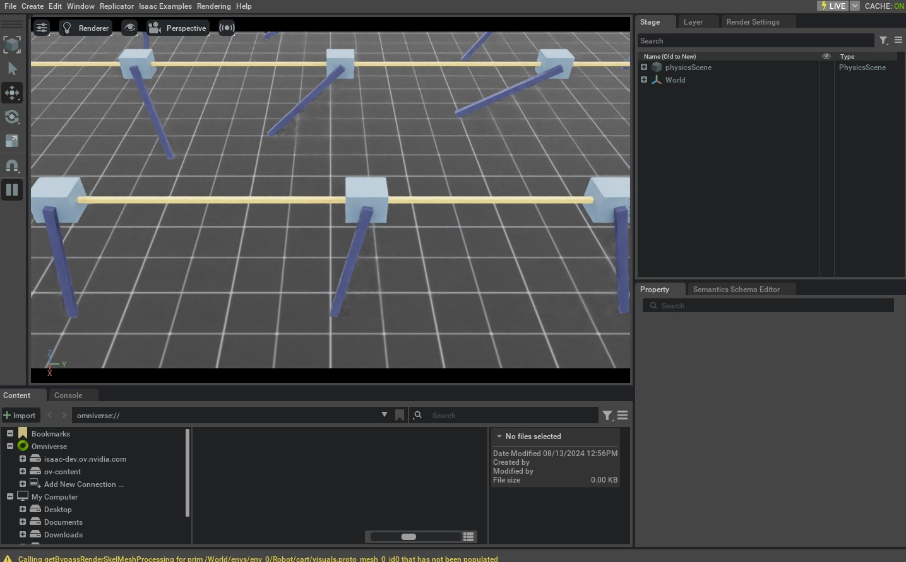

<a id="tutorial-interactive-scene"></a>

# 대화형 장면 사용하기

지금까지 튜토리얼에서 우리는 시뮬레이션에 에셋을 수동으로 스폰하고 객체 인스턴스를 생성하여 그것들과 상호작용했습니다. 그러나 장면의 복잡도가 증가함에 따라 이러한 작업을 수동으로 수행하는 것은 점점 번거로워집니다. 이 튜토리얼에서는 [`scene.InteractiveScene`](../../api/lab/isaaclab.scene.md#isaaclab.scene.InteractiveScene) 클래스를 소개합니다. 이 클래스는 프림을 스폰하고 시뮬레이션에서 관리하는 편리한 인터페이스를 제공합니다.

대략적인 수준에서 대화형 장면은 장면 엔티티들의 컬렉션입니다. 각 엔티티는 대화형이 아닌 프림(예: 지평면, 광원), 대화형 프림(예: 관절, 강체 객체), 또는 센서(예: 카메라, 라이더) 중 하나일 수 있습니다. 대화형 장면은 이러한 엔티티를 스폰하고 시뮬레이션에서 관리하는 편리한 인터페이스를 제공합니다.

수동 접근 방식과 비교하여 다음과 같은 이점을 제공합니다:

* 사용자가 각 에셋을 별도로 스폰할 필요가 없으며, 이는 암묵적으로 처리됩니다.
* 여러 환경을 위해 장면 프림의 사용자 친화적인 클로닝을 가능하게 합니다.
* 모든 장면 엔티티를 단일 객체로 수집하여 관리가 용이해집니다.

이 튜토리얼에서는 [관절과의 상호작용](../01_assets/run_articulation.md#tutorial-interact-articulation) 튜토리얼의 카트폴 예시를 가져와 `design_scene` 함수를 [`scene.InteractiveScene`](../../api/lab/isaaclab.scene.md#isaaclab.scene.InteractiveScene) 객체로 대체합니다. 이 간단한 예시에서는 대화형 장면을 사용하는 것이 과잉처럼 보일 수 있지만, 향후 더 많은 에셋과 센서가 장면에 추가됨에 따라 점점 더 유용해질 것입니다.

## 코드

이 튜토리얼은 `scripts/tutorials/02_scene` 내의 `create_scene.py` 스크립트에 해당합니다.

### create_scene.py 코드

```python
# Copyright (c) 2022-2026, The Isaac Lab Project Developers (https://github.com/isaac-sim/IsaacLab/blob/main/CONTRIBUTORS.md).
# All rights reserved.
#
# SPDX-License-Identifier: BSD-3-Clause

"""This script demonstrates how to use the interactive scene interface to setup a scene with multiple prims.

.. code-block:: bash

    # Usage
    ./isaaclab.sh -p scripts/tutorials/02_scene/create_scene.py --num_envs 32

"""

"""Launch Isaac Sim Simulator first."""


import argparse

from isaaclab.app import AppLauncher

# add argparse arguments
parser = argparse.ArgumentParser(description="Tutorial on using the interactive scene interface.")
parser.add_argument("--num_envs", type=int, default=2, help="Number of environments to spawn.")
# append AppLauncher cli args
AppLauncher.add_app_launcher_args(parser)
# parse the arguments
args_cli = parser.parse_args()

# launch omniverse app
app_launcher = AppLauncher(args_cli)
simulation_app = app_launcher.app

"""Rest everything follows."""

import torch

import isaaclab.sim as sim_utils
from isaaclab.assets import ArticulationCfg, AssetBaseCfg
from isaaclab.scene import InteractiveScene, InteractiveSceneCfg
from isaaclab.sim import SimulationContext
from isaaclab.utils import configclass

##
# Pre-defined configs
##
from isaaclab_assets import CARTPOLE_CFG  # isort:skip


@configclass
class CartpoleSceneCfg(InteractiveSceneCfg):
    """Configuration for a cart-pole scene."""

    # ground plane
    ground = AssetBaseCfg(prim_path="/World/defaultGroundPlane", spawn=sim_utils.GroundPlaneCfg())

    # lights
    dome_light = AssetBaseCfg(
        prim_path="/World/Light", spawn=sim_utils.DomeLightCfg(intensity=3000.0, color=(0.75, 0.75, 0.75))
    )

    # articulation
    cartpole: ArticulationCfg = CARTPOLE_CFG.replace(prim_path="{ENV_REGEX_NS}/Robot")


def run_simulator(sim: sim_utils.SimulationContext, scene: InteractiveScene):
    """Runs the simulation loop."""
    # Extract scene entities
    # note: we only do this here for readability.
    robot = scene["cartpole"]
    # Define simulation stepping
    sim_dt = sim.get_physics_dt()
    count = 0
    # Simulation loop
    while simulation_app.is_running():
        # Reset
        if count % 500 == 0:
            # reset counter
            count = 0
            # reset the scene entities
            # root state
            # we offset the root state by the origin since the states are written in simulation world frame
            # if this is not done, then the robots will be spawned at the (0, 0, 0) of the simulation world
            root_state = robot.data.default_root_state.clone()
            root_state[:, :3] += scene.env_origins
            robot.write_root_pose_to_sim(root_state[:, :7])
            robot.write_root_velocity_to_sim(root_state[:, 7:])
            # set joint positions with some noise
            joint_pos, joint_vel = robot.data.default_joint_pos.clone(), robot.data.default_joint_vel.clone()
            joint_pos += torch.rand_like(joint_pos) * 0.1
            robot.write_joint_state_to_sim(joint_pos, joint_vel)
            # clear internal buffers
            scene.reset()
            print("[INFO]: Resetting robot state...")
        # Apply random action
        # -- generate random joint efforts
        efforts = torch.randn_like(robot.data.joint_pos) * 5.0
        # -- apply action to the robot
        robot.set_joint_effort_target(efforts)
        # -- write data to sim
        scene.write_data_to_sim()
        # Perform step
        sim.step()
        # Increment counter
        count += 1
        # Update buffers
        scene.update(sim_dt)


def main():
    """Main function."""
    # Load kit helper
    sim_cfg = sim_utils.SimulationCfg(device=args_cli.device)
    sim = SimulationContext(sim_cfg)
    # Set main camera
    sim.set_camera_view([2.5, 0.0, 4.0], [0.0, 0.0, 2.0])
    # Design scene
    scene_cfg = CartpoleSceneCfg(num_envs=args_cli.num_envs, env_spacing=2.0)
    scene = InteractiveScene(scene_cfg)
    # Play the simulator
    sim.reset()
    # Now we are ready!
    print("[INFO]: Setup complete...")
    # Run the simulator
    run_simulator(sim, scene)


if __name__ == "__main__":
    # run the main function
    main()
    # close sim app
    simulation_app.close()
```

## 코드 설명

코드는 이전 튜토리얼과 유사하지만, 자세하게 살펴볼 몇 가지 주요 차이점이 있습니다.

### 장면 구성

장면은 각각 고유한 구성을 갖는 엔티티들의 컬렉션으로 구성됩니다. 이들은 [`scene.InteractiveSceneCfg`](../../api/lab/isaaclab.scene.md#isaaclab.scene.InteractiveSceneCfg)를 상속하는 구성 클래스에 지정됩니다. 구성 클래스는 [`scene.InteractiveScene`](../../api/lab/isaaclab.scene.md#isaaclab.scene.InteractiveScene) 생성자에 전달되어 장면을 생성합니다.

카트폴 예시에서는 이전 튜토리얼과 동일한 장면을 지정하지만, 이제 수동으로 스폰하는 대신 구성 클래스 `CartpoleSceneCfg`에 나열합니다.

```python
@configclass
class CartpoleSceneCfg(InteractiveSceneCfg):
    """Configuration for a cart-pole scene."""

    # ground plane
    ground = AssetBaseCfg(prim_path="/World/defaultGroundPlane", spawn=sim_utils.GroundPlaneCfg())

    # lights
    dome_light = AssetBaseCfg(
        prim_path="/World/Light", spawn=sim_utils.DomeLightCfg(intensity=3000.0, color=(0.75, 0.75, 0.75))
    )

    # articulation
    cartpole: ArticulationCfg = CARTPOLE_CFG.replace(prim_path="{ENV_REGEX_NS}/Robot")
```

구성 클래스의 변수 이름은 [`scene.InteractiveScene`](../../api/lab/isaaclab.scene.md#isaaclab.scene.InteractiveScene) 객체에서 해당 엔티티에 접근하는 키로 사용됩니다. 예를 들어, 카트폴은 `scene["cartpole"]`를 통해 접근할 수 있습니다. 그러나 이를 나중에 살펴보도록 하겠습니다. 먼저 개별 장면 엔티티가 어떻게 구성되는지 살펴보겠습니다.

이전 튜토리얼에서 강체 객체와 관절이 구성된 방식과 유사하게, 구성은 구성 클래스를 사용하여 지정됩니다. 그러나 지면과 광원의 구성과 카트폴의 구성 사이에는 중요한 차이가 있습니다. 지면과 광원은 대화형이 아닌 프림인 반면, 카트폴은 대화형 프림입니다. 이 구분은 그들을 지정하는 데 사용되는 구성 클래스에 반영됩니다. 지면과 광원의 구성은 [`assets.AssetBaseCfg`](../../api/lab/isaaclab.assets.md#isaaclab.assets.AssetBaseCfg) 클래스의 인스턴스를 사용하여 지정되며, 카트폴은 [`assets.ArticulationCfg`](../../api/lab/isaaclab.assets.md#isaaclab.assets.ArticulationCfg) 클래스의 인스턴스를 사용하여 구성됩니다. 대화형이 아닌 프림(즉, 에셋도 센서도 아닌 것)은 시뮬레이션 단계 중에 장면에서 *처리되지* 않습니다.

다른 주목할 만한 차이점은 다양한 프림의 프림 경로 지정 방식에 있습니다:

* 지면: `/World/defaultGroundPlane`
* 광원: `/World/Light`
* 카트폴: `{ENV_REGEX_NS}/Robot`

앞서 배운 것처럼, Omniverse는 USD 스테이지에서 프림의 그래프를 생성합니다. 프림 경로는 그래프에서 프림의 위치를 지정하는 데 사용됩니다. 지면과 광원은 절대 경로를 사용하여 지정되며, 카트폴은 상대 경로를 사용하여 지정됩니다. 상대 경로는 장면을 생성할 때 환경 이름으로 대체되는 특수 변수 `ENV_REGEX_NS`를 사용하여 지정됩니다. `ENV_REGEX_NS` 변수를 프림 경로에 포함하는 모든 엔티티는 각 환경에 대해 클로닝됩니다. 이 경로는 장면 객체에 의해 `/World/envs/env_{i}`로 대체되며, 여기서 `i`는 환경 인덱스입니다.

### 장면 인스턴스화

이전에는 `design_scene` 함수를 호출하여 장면을 만들었지만, 이제는 [`scene.InteractiveScene`](../../api/lab/isaaclab.scene.md#isaaclab.scene.InteractiveScene) 클래스의 인스턴스를 만들고 구성 객체를 생성자에 전달합니다. `CartpoleSceneCfg`의 구성 인스턴스를 만드는 동안
환경 복사본의 개수를 `num_envs` 인수를 통해 지정합니다.
이를 통해 각 환경에 대해 장면을 복제할 수 있습니다.

```python
    # 장면 설계
    scene_cfg = CartpoleSceneCfg(num_envs=args_cli.num_envs, env_spacing=2.0)
    scene = InteractiveScene(scene_cfg)
```

### 장면 요소 접근

이전 튜토리얼에서 딕셔너리에서 엔티티에 접근하는 방식과 유사하게,
장면 요소는 `InteractiveScene` 객체에서 `[]` 연산자를 사용하여 접근할 수 있습니다.
이 연산자는 문자열 키를 입력받아 해당하는 엔티티를 반환합니다.
키는 각 엔티티의 구성 클래스를 통해 지정됩니다. 예를 들어,
카트폴은 구성 클래스에서 키 `"cartpole"`을 통해 지정됩니다.

```python
    # 장면 엔티티 추출
    # 참고: 여기서는 가독성을 위해 이렇게 수행합니다.
    robot = scene["cartpole"]
```

### 시뮬레이션 루프 실행

스크립트의 나머지 부분은 [`assets.Articulation`](../../api/lab/isaaclab.assets.md#isaaclab.assets.Articulation)과 인터페이스했던 이전 스크립트와 유사하며,
호출되는 메서드에 몇 가지 작은 차이가 있습니다:

* [`assets.Articulation.reset()`](../../api/lab/isaaclab.assets.md#isaaclab.assets.Articulation.reset) ⟶ [`scene.InteractiveScene.reset()`](../../api/lab/isaaclab.scene.md#isaaclab.scene.InteractiveScene.reset)
* [`assets.Articulation.write_data_to_sim()`](../../api/lab/isaaclab.assets.md#isaaclab.assets.Articulation.write_data_to_sim) ⟶ [`scene.InteractiveScene.write_data_to_sim()`](../../api/lab/isaaclab.scene.md#isaaclab.scene.InteractiveScene.write_data_to_sim)
* [`assets.Articulation.update()`](../../api/lab/isaaclab.assets.md#isaaclab.assets.Articulation.update) ⟶ [`scene.InteractiveScene.update()`](../../api/lab/isaaclab.scene.md#isaaclab.scene.InteractiveScene.update)

내부적으로, [`scene.InteractiveScene`](../../api/lab/isaaclab.scene.md#isaaclab.scene.InteractiveScene)의 메서드는 장면 내 엔티티의 해당 메서드를 호출합니다.

## 코드 실행

스크립트를 실행하여 장면에서 32개의 카트폴을 시뮬레이션해 봅시다.
이를 위해 스크립트에 `--num_envs` 인수를 전달할 수 있습니다.

```bash
./isaaclab.sh -p scripts/tutorials/02_scene/create_scene.py --num_envs 32
```

이 명령은 무작위로 흔들리는 32개의 카트폴이 있는 스테이지를 열어야 합니다.
마우스를 사용하여 카메라를 회전하고 화살표 키를 눌러 장면을 이동할 수 있습니다.



이 튜토리얼에서는 [`scene.InteractiveScene`](../../api/lab/isaaclab.scene.md#isaaclab.scene.InteractiveScene)를 사용하여 여러 자산이 포함된 장면을 만드는 방법을 보았습니다.
또한 `num_envs` 인수를 사용하여 여러 환경에 대해 장면을 복제하는 방법도 살펴보았습니다.

[`scene.InteractiveSceneCfg`](../../api/lab/isaaclab.scene.md#isaaclab.scene.InteractiveSceneCfg)의 추가 예시 사용법은 `isaaclab_tasks` 확장 내의 작업에서 찾아볼 수 있습니다.
더 복잡한 장면에 어떻게 사용되는지 확인하려면 소스 코드를 참고해 주세요.
