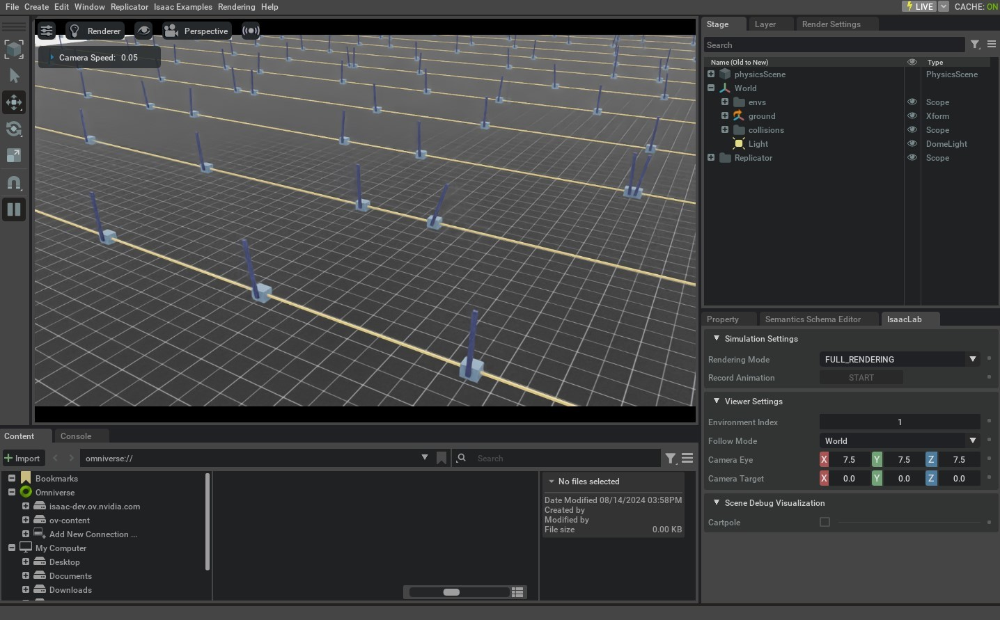

<a id="tutorial-create-direct-rl-env"></a>

# 직접 워크플로 RL 환경 생성하기

[`envs.ManagerBasedRLEnv`](../../api/lab/isaaclab.envs.md#isaaclab.envs.ManagerBasedRLEnv) 클래스 외에도 모듈식 환경을 위해 구성 클래스 사용을 장려하는 클래스와 함께, [`DirectRLEnv`](../../api/lab/isaaclab.envs.md#isaaclab.envs.DirectRLEnv) 클래스를 사용하면 환경 스크립팅에서 더 직접적인 제어가 가능합니다.

보상과 관측을 정의하기 위해 관리자 클래스를 사용하는 대신, 직접 워크플로 태스크는 태스크 스크립트에서 보상과 관측 함수를 직접 구현합니다.
이를 통해 PyTorch JIT 기능을 사용하는 등 메서드 구현에서 더 많은 제어가 가능하며, 코드의 다양한 부분을 찾기 쉬운 덜 추상화된 프레임워크를 제공합니다.

이 튜토리얼에서는 직접 워크플로 구현을 사용하여 카트폴 환경을 구성하고 poles을 수직으로 균형 잡는 태스크를 만드는 방법을 배웁니다.
장면 생성, 액션, 리셋, 보상 및 관측을 위한 함수 구현을 통해 태스크를 지정하는 방법을 배우게 됩니다.

## 코드

이 튜토리얼에서는 `isaaclab_tasks.direct.cartpole` 모듈에 정의된 카트폴 환경을 사용합니다.

### cartpole_env.py 코드

```python
# Copyright (c) 2022-2026, The Isaac Lab Project Developers (https://github.com/isaac-sim/IsaacLab/blob/main/CONTRIBUTORS.md).
# All rights reserved.
#
# SPDX-License-Identifier: BSD-3-Clause

from __future__ import annotations

import math
from collections.abc import Sequence

import torch

import isaaclab.sim as sim_utils
from isaaclab.assets import Articulation, ArticulationCfg
from isaaclab.envs import DirectRLEnv, DirectRLEnvCfg
from isaaclab.scene import InteractiveSceneCfg
from isaaclab.sim import SimulationCfg
from isaaclab.sim.spawners.from_files import GroundPlaneCfg, spawn_ground_plane
from isaaclab.utils import configclass
from isaaclab.utils.math import sample_uniform

from isaaclab_assets.robots.cartpole import CARTPOLE_CFG


@configclass
class CartpoleEnvCfg(DirectRLEnvCfg):
    # env
    decimation = 2
    episode_length_s = 5.0
    action_scale = 100.0  # [N]
    action_space = 1
    observation_space = 4
    state_space = 0

    # simulation
    sim: SimulationCfg = SimulationCfg(dt=1 / 120, render_interval=decimation)

    # robot
    robot_cfg: ArticulationCfg = CARTPOLE_CFG.replace(prim_path="/World/envs/env_.*/Robot")
    cart_dof_name = "slider_to_cart"
    pole_dof_name = "cart_to_pole"

    # scene
    scene: InteractiveSceneCfg = InteractiveSceneCfg(
        num_envs=4096, env_spacing=4.0, replicate_physics=True, clone_in_fabric=True
    )

    # reset
    max_cart_pos = 3.0  # the cart is reset if it exceeds that position [m]
    initial_pole_angle_range = [-0.25, 0.25]  # the range in which the pole angle is sampled from on reset [rad]

    # reward scales
    rew_scale_alive = 1.0
    rew_scale_terminated = -2.0
    rew_scale_pole_pos = -1.0
    rew_scale_cart_vel = -0.01
    rew_scale_pole_vel = -0.005


class CartpoleEnv(DirectRLEnv):
    cfg: CartpoleEnvCfg

    def __init__(self, cfg: CartpoleEnvCfg, render_mode: str | None = None, **kwargs):
        super().__init__(cfg, render_mode, **kwargs)

        self._cart_dof_idx, _ = self.cartpole.find_joints(self.cfg.cart_dof_name)
        self._pole_dof_idx, _ = self.cartpole.find_joints(self.cfg.pole_dof_name)
        self.action_scale = self.cfg.action_scale

        self.joint_pos = self.cartpole.data.joint_pos
        self.joint_vel = self.cartpole.data.joint_vel

    def _setup_scene(self):
        self.cartpole = Articulation(self.cfg.robot_cfg)
        # add ground plane
        spawn_ground_plane(prim_path="/World/ground", cfg=GroundPlaneCfg())
        # clone and replicate
        self.scene.clone_environments(copy_from_source=False)
        # we need to explicitly filter collisions for CPU simulation
        if self.device == "cpu":
            self.scene.filter_collisions(global_prim_paths=[])
        # add articulation to scene
        self.scene.articulations["cartpole"] = self.cartpole
        # add lights
        light_cfg = sim_utils.DomeLightCfg(intensity=2000.0, color=(0.75, 0.75, 0.75))
        light_cfg.func("/World/Light", light_cfg)

    def _pre_physics_step(self, actions: torch.Tensor) -> None:
        self.actions = self.action_scale * actions.clone()

    def _apply_action(self) -> None:
        self.cartpole.set_joint_effort_target(self.actions, joint_ids=self._cart_dof_idx)

    def _get_observations(self) -> dict:
        obs = torch.cat(
            (
                self.joint_pos[:, self._pole_dof_idx[0]].unsqueeze(dim=1),
                self.joint_vel[:, self._pole_dof_idx[0]].unsqueeze(dim=1),
                self.joint_pos[:, self._cart_dof_idx[0]].unsqueeze(dim=1),
                self.joint_vel[:, self._cart_dof_idx[0]].unsqueeze(dim=1),
            ),
            dim=-1,
        )
        observations = {"policy": obs}
        return observations

    def _get_rewards(self) -> torch.Tensor:
        total_reward = compute_rewards(
            self.cfg.rew_scale_alive,
            self.cfg.rew_scale_terminated,
            self.cfg.rew_scale_pole_pos,
            self.cfg.rew_scale_cart_vel,
            self.cfg.rew_scale_pole_vel,
            self.joint_pos[:, self._pole_dof_idx[0]],
            self.joint_vel[:, self._pole_dof_idx[0]],
            self.joint_pos[:, self._cart_dof_idx[0]],
            self.joint_vel[:, self._cart_dof_idx[0]],
            self.reset_terminated,
        )
        return total_reward

    def _get_dones(self) -> tuple[torch.Tensor, torch.Tensor]:
        self.joint_pos = self.cartpole.data.joint_pos
        self.joint_vel = self.cartpole.data.joint_vel

        time_out = self.episode_length_buf >= self.max_episode_length - 1
        out_of_bounds = torch.any(torch.abs(self.joint_pos[:, self._cart_dof_idx]) > self.cfg.max_cart_pos, dim=1)
        out_of_bounds = out_of_bounds | torch.any(torch.abs(self.joint_pos[:, self._pole_dof_idx]) > math.pi / 2, dim=1)
        return out_of_bounds, time_out

    def _reset_idx(self, env_ids: Sequence[int] | None):
        if env_ids is None:
            env_ids = self.cartpole._ALL_INDICES
        super()._reset_idx(env_ids)

        joint_pos = self.cartpole.data.default_joint_pos[env_ids]
        joint_pos[:, self._pole_dof_idx] += sample_uniform(
            self.cfg.initial_pole_angle_range[0] * math.pi,
            self.cfg.initial_pole_angle_range[1] * math.pi,
            joint_pos[:, self._pole_dof_idx].shape,
            joint_pos.device,
        )
        joint_vel = self.cartpole.data.default_joint_vel[env_ids]

        default_root_state = self.cartpole.data.default_root_state[env_ids]
        default_root_state[:, :3] += self.scene.env_origins[env_ids]

        self.joint_pos[env_ids] = joint_pos
        self.joint_vel[env_ids] = joint_vel

        self.cartpole.write_root_pose_to_sim(default_root_state[:, :7], env_ids)
        self.cartpole.write_root_velocity_to_sim(default_root_state[:, 7:], env_ids)
        self.cartpole.write_joint_state_to_sim(joint_pos, joint_vel, None, env_ids)


@torch.jit.script
def compute_rewards(
    rew_scale_alive: float,
    rew_scale_terminated: float,
    rew_scale_pole_pos: float,
    rew_scale_cart_vel: float,
    rew_scale_pole_vel: float,
    pole_pos: torch.Tensor,
    pole_vel: torch.Tensor,
    cart_pos: torch.Tensor,
    cart_vel: torch.Tensor,
    reset_terminated: torch.Tensor,
):
    rew_alive = rew_scale_alive * (1.0 - reset_terminated.float())
    rew_termination = rew_scale_terminated * reset_terminated.float()
    rew_pole_pos = rew_scale_pole_pos * torch.sum(torch.square(pole_pos).unsqueeze(dim=1), dim=-1)
    rew_cart_vel = rew_scale_cart_vel * torch.sum(torch.abs(cart_vel).unsqueeze(dim=1), dim=-1)
    rew_pole_vel = rew_scale_pole_vel * torch.sum(torch.abs(pole_vel).unsqueeze(dim=1), dim=-1)
    total_reward = rew_alive + rew_termination + rew_pole_pos + rew_cart_vel + rew_pole_vel
    return total_reward
```

## 코드 설명

관리자 기반 환경과 유사하게, 구성 클래스가 태스크를 위해 정의되어 시뮬레이션 매개변수, 씬, 액터 및 태스크 설정을 저장합니다.
직접 워크플로 구현에서는 [`envs.DirectRLEnvCfg`](../../api/lab/isaaclab.envs.md#isaaclab.envs.DirectRLEnvCfg) 클래스가 구성의 기본 클래스로 사용됩니다.
직접 워크플로 구현에서는 Action 및 Observation 관리자를 사용하지 않기 때문에 태스크 구성에서는 환경의 액션 및 관측 공간 수를 정의해야 합니다.

```python
@configclass
class CartpoleEnvCfg(DirectRLEnvCfg):
   ...
   action_space = 1
   observation_space = 4
   state_space = 0
```

구성 클래스는 보상 항목에 대한 스케일링 및 리셋 조건에 대한 임계값과 같은 태스크별 속성을 정의하는 데에도 사용할 수 있습니다.

```python
@configclass
class CartpoleEnvCfg(DirectRLEnvCfg):
   ...
   # reset
   max_cart_pos = 3.0
   initial_pole_angle_range = [-0.25, 0.25]

   # reward scales
   rew_scale_alive = 1.0
   rew_scale_terminated = -2.0
   rew_scale_pole_pos = -1.0
   rew_scale_cart_vel = -0.01
   rew_scale_pole_vel = -0.005
```

새로운 환경을 생성할 때는 [`DirectRLEnv`](../../api/lab/isaaclab.envs.md#isaaclab.envs.DirectRLEnv)를 상속받는 새 클래스를 정의해야 합니다.

```python
class CartpoleEnv(DirectRLEnv):
   cfg: CartpoleEnvCfg

   def __init__(self, cfg: CartpoleEnvCfg, render_mode: str | None = None, **kwargs):
     super().__init__(cfg, render_mode, **kwargs)
```

이 클래스에는 액션 적용, 리셋 계산, 보상 및 관측 계산과 같은 클래스 내 모든 함수에서 접근 가능한 클래스 변수를 포함할 수 있습니다.

### 씬 생성

관리자 기반 환경에서는 프레임워크가 씬 생성을 담당하는 반면, 직접 워크플로 구현에서는 사용자가 자체 씬 생성을 구현할 수 있는 유연성을 제공합니다.
함수. 여기에는 스테이지에 액터 추가, 환경 복제, 환경 간 충돌 필터링, 액터를 씬에 추가, 땅 평면 및 조명과 같은 추가 프로프를 씬에 추가하는 작업이 포함됩니다. 이러한 작업은 `_setup_scene(self)` 메서드에서 구현해야 합니다.

```python
    def _setup_scene(self):
        self.cartpole = Articulation(self.cfg.robot_cfg)
        # 지평면 추가
        spawn_ground_plane(prim_path="/World/ground", cfg=GroundPlaneCfg())
        # 복제 및 복제
        self.scene.clone_environments(copy_from_source=False)
        # CPU 시뮬레이션에서는 충돌을 명시적으로 필터링해야 합니다
        if self.device == "cpu":
            self.scene.filter_collisions(global_prim_paths=[])
        # 씬에 액추에이터 추가
        self.scene.articulations["cartpole"] = self.cartpole
        # 조명 추가
        light_cfg = sim_utils.DomeLightCfg(intensity=2000.0, color=(0.75, 0.75, 0.75))
        light_cfg.func("/World/Light", light_cfg)
```

### 보상 정의

보상 함수는 반환 값으로 보상 버퍼를 반환하는 `_get_rewards(self)` API에서 정의되어야 합니다. 이 함수 내에서, 작업은 보상 함수의 로직을 자유롭게 구현할 수 있습니다. 이 예시에서는 보상 함수의 다양한 구성 요소를 계산하는 PyTorch JIT 함수를 구현합니다.

```python
def _get_rewards(self) -> torch.Tensor:
     total_reward = compute_rewards(
         self.cfg.rew_scale_alive,
         self.cfg.rew_scale_terminated,
         self.cfg.rew_scale_pole_pos,
         self.cfg.rew_scale_cart_vel,
         self.cfg.rew_scale_pole_vel,
         self.joint_pos[:, self._pole_dof_idx[0]],
         self.joint_vel[:, self._pole_dof_idx[0]],
         self.joint_pos[:, self._cart_dof_idx[0]],
         self.joint_vel[:, self._cart_dof_idx[0]],
         self.reset_terminated,
     )
     return total_reward

@torch.jit.script
def compute_rewards(
    rew_scale_alive: float,
    rew_scale_terminated: float,
    rew_scale_pole_pos: float,
    rew_scale_cart_vel: float,
    rew_scale_pole_vel: float,
    pole_pos: torch.Tensor,
    pole_vel: torch.Tensor,
    cart_pos: torch.Tensor,
    cart_vel: torch.Tensor,
    reset_terminated: torch.Tensor,
):
    rew_alive = rew_scale_alive * (1.0 - reset_terminated.float())
    rew_termination = rew_scale_terminated * reset_terminated.float()
    rew_pole_pos = rew_scale_pole_pos * torch.sum(torch.square(pole_pos), dim=-1)
    rew_cart_vel = rew_scale_cart_vel * torch.sum(torch.abs(cart_vel), dim=-1)
    rew_pole_vel = rew_scale_pole_vel * torch.sum(torch.abs(pole_vel), dim=-1)
    total_reward = rew_alive + rew_termination + rew_pole_pos + rew_cart_vel + rew_pole_vel
    return total_reward
```

### 관찰 정의

관찰 버퍼는 `_get_observations(self)` 함수에서 계산되어야 하며, 이 함수는 환경의 관찰 버퍼를 구성합니다. 이 API의 끝에서, `policy`를 키로 하고 전체 관찰 버퍼를 값으로 하는 딕셔너리가 반환되어야 합니다. 비대칭 정책의 경우, 딕셔너리에는 `critic` 키와 상태 버퍼를 값으로 포함해야 합니다.

```python
    def _get_observations(self) -> dict:
        obs = torch.cat(
            (
                self.joint_pos[:, self._pole_dof_idx[0]].unsqueeze(dim=1),
                self.joint_vel[:, self._pole_dof_idx[0]].unsqueeze(dim=1),
                self.joint_pos[:, self._cart_dof_idx[0]].unsqueeze(dim=1),
                self.joint_vel[:, self._cart_dof_idx[0]].unsqueeze(dim=1),
            ),
            dim=-1,
        )
        observations = {"policy": obs}
        return observations
```

### 완료 계산 및 리셋 수행

`dones` 버퍼 채우기는 `_get_dones(self)` 메서드에서 수행되어야 합니다. 이 메서드는 어떤 환경이 리셋되어야 하는지 및 어떤 환경이 에피소드 길이 제한에 도달했는지를 계산하는 로직을 자유롭게 구현할 수 있습니다. 두 결과는 `_get_dones(self)` 함수에서 불리언 텐서의 튜플 형태로 반환되어야 합니다.

```python
    def _get_dones(self) -> tuple[torch.Tensor, torch.Tensor]:
        self.joint_pos = self.cartpole.data.joint_pos
        self.joint_vel = self.cartpole.data.joint_vel

        time_out = self.episode_length_buf >= self.max_episode_length - 1
        out_of_bounds = torch.any(torch.abs(self.joint_pos[:, self._cart_dof_idx]) > self.cfg.max_cart_pos, dim=1)
        out_of_bounds = out_of_bounds | torch.any(torch.abs(self.joint_pos[:, self._pole_dof_idx]) > math.pi / 2, dim=1)
        return out_of_bounds, time_out
```

환경 리셋이 필요한 인덱스가 계산된 후, `_reset_idx(self, env_ids)` 함수는 해당 환경에 대한 리셋 작업을 수행합니다. 이 함수 내에서, 리셋이 필요한 환경에 대한 새로운 상태는 시뮬레이션에 직접 설정되어야 합니다.

```python
    def _reset_idx(self, env_ids: Sequence[int] | None):
        if env_ids is None:
            env_ids = self.cartpole._ALL_INDICES
        super()._reset_idx(env_ids)

        joint_pos = self.cartpole.data.default_joint_pos[env_ids]
        joint_pos[:, self._pole_dof_idx] += sample_uniform(
            self.cfg.initial_pole_angle_range[0] * math.pi,
            self.cfg.initial_pole_angle_range[1] * math.pi,
            joint_pos[:, self._pole_dof_idx].shape,
            joint_pos.device,
        )
        joint_vel = self.cartpole.data.default_joint_vel[env_ids]

        default_root_state = self.cartpole.data.default_root_state[env_ids]
        default_root_state[:, :3] += self.scene.env_origins[env_ids]

        self.joint_pos[env_ids] = joint_pos
        self.joint_vel[env_ids] = joint_vel

        self.cartpole.write_root_pose_to_sim(default_root_state[:, :7], env_ids)
        self.cartpole.write_root_velocity_to_sim(default_root_state[:, 7:], env_ids)
        self.cartpole.write_joint_state_to_sim(joint_pos, joint_vel, None, env_ids)
```

### 액션 적용

액션 작업을 위한 두 개의 API가 설계되었습니다. `_pre_physics_step(self, actions)`는 정책에서 오는 액션을 인자로 받아서 RL 단계당 한 번씩, 어떤 물리 단계도 취하기 전에 호출됩니다. 이 함수는 정책의 액션 버퍼를 처리하고 환경의 클래스 변수에 데이터를 캐시하는 데 사용될 수 있습니다.

```python
    def _pre_physics_step(self, actions: torch.Tensor) -> None:
        self.actions = self.action_scale * actions.clone()
```

`_apply_action(self)` API는 각 RL 단계당 `decimation` 횟수만큼 호출되며, 각 물리 단계를 취하기 전에 호출됩니다.これにより、物理ステップごとにアクションを適用する必要がある環境に対して、より柔軟性が提供されます。

```python
    def _apply_action(self) -> None:
        self.cartpole.set_joint_effort_target(self.actions, joint_ids=self._cart_dof_idx)
```

## 코드 실행

직접 워크플로우 카트폴 환경에 대한 훈련을 실행하려면 다음 명령을 사용할 수 있습니다:

```bash
./isaaclab.sh -p scripts/reinforcement_learning/rl_games/train.py --task=Isaac-Cartpole-Direct-v0
```



모든 직접 워크플로 태스크에는 구현 스타일을 구분하기 위해 태스크 이름에 `-Direct` 접미사가 추가됩니다.

## 도메인 랜덤화

직접 워크플로에서 도메인 랜덤화 구성은 [`configclass`](../../api/lab/isaaclab.utils.md#module-isaaclab.utils.configclass) 모듈을 사용하여 [`EventTermCfg`](../../api/lab/isaaclab.managers.md#isaaclab.managers.EventTermCfg) 변수로 구성된 구성 클래스를 지정합니다.

다음은 도메인 랜덤화를 위한 구성 클래스의 예시입니다:

```python
@configclass
class EventCfg:
  robot_physics_material = EventTerm(
      func=mdp.randomize_rigid_body_material,
      mode="reset",
      params={
          "asset_cfg": SceneEntityCfg("robot", body_names=".*"),
          "static_friction_range": (0.7, 1.3),
          "dynamic_friction_range": (1.0, 1.0),
          "restitution_range": (1.0, 1.0),
          "num_buckets": 250,
      },
  )
  robot_joint_stiffness_and_damping = EventTerm(
      func=mdp.randomize_actuator_gains,
      mode="reset",
      params={
          "asset_cfg": SceneEntityCfg("robot", joint_names=".*"),
          "stiffness_distribution_params": (0.75, 1.5),
          "damping_distribution_params": (0.3, 3.0),
          "operation": "scale",
          "distribution": "log_uniform",
      },
  )
  reset_gravity = EventTerm(
      func=mdp.randomize_physics_scene_gravity,
      mode="interval",
      is_global_time=True,
      interval_range_s=(36.0, 36.0),  # time_s = num_steps * (decimation * dt)
      params={
          "gravity_distribution_params": ([0.0, 0.0, 0.0], [0.0, 0.0, 0.4]),
          "operation": "add",
          "distribution": "gaussian",
      },
  )
```

각 `EventTerm` 객체는 [`EventTermCfg`](../../api/lab/isaaclab.managers.md#isaaclab.managers.EventTermCfg) 클래스의 인스턴스이며, 무작위화 중에 호출할 함수를 지정하는 `func` 매개변수, `startup`, `reset` 또는 `interval`일 수 있는 `mode` 매개변수, 그리고 `func` 매개변수에 지정된 함수에 필요한 인수를 제공해야 하는 `params` 딕셔너리를 포함합니다. `func` 매개변수로 지정된 함수는 [`events`](../../api/lab/isaaclab.envs.mdp.md#module-isaaclab.envs.mdp.events) 모듈에서 찾을 수 있습니다.

`"asset_cfg": SceneEntityCfg("robot", body_names=".*")` 매개변수의 일부로, 액터의 이름인 `"robot"`이 제공되며, juntamente에 정규 표현식으로 지정된 바디 또는 조인트 이름이 제공됩니다. 이는 랜덤화가 적용될 액터 및 바디/조인트를 지정합니다.

랜덤화 항목에 대한 `configclass`가 설정된 후, 해당 클래스는 작업의 기본 구성 클래스에 추가되어야 하며 `events` 변수에 할당되어야 합니다.

```python
@configclass
class MyTaskConfig:
  events: EventCfg = EventCfg()
```

### 액션 및 관찰 노이즈

Action 및 관찰 노이즈도 [`configclass`](../../api/lab/isaaclab.utils.md#module-isaaclab.utils.configclass) 모듈을 사용하여 추가할 수 있습니다.  
Action 및 관찰 노이즈 구성은 다음 변수를 사용하여 메인 태스크 구성에 추가해야 합니다:

```python
@configclass
class MyTaskConfig:

    # 매 시간 단계마다 가우시안 노이즈 + 바이어스를 추가합니다. 바이어스는 리셋 시 가우시안 분포에서 샘플링됩니다.
    action_noise_model: NoiseModelWithAdditiveBiasCfg = NoiseModelWithAdditiveBiasCfg(
      noise_cfg=GaussianNoiseCfg(mean=0.0, std=0.05, operation="add"),
      bias_noise_cfg=GaussianNoiseCfg(mean=0.0, std=0.015, operation="abs"),
    )

    # 매 시간 단계마다 가우시안 노이즈 + 바이어스를 추가합니다. 바이어스는 리셋 시 가우시안 분포에서 샘플링됩니다.
    observation_noise_model: NoiseModelWithAdditiveBiasCfg = NoiseModelWithAdditiveBiasCfg(
      noise_cfg=GaussianNoiseCfg(mean=0.0, std=0.002, operation="add"),
      bias_noise_cfg=GaussianNoiseCfg(mean=0.0, std=0.0001, operation="abs"),
    )
```

[`NoiseModelWithAdditiveBiasCfg`](../../api/lab/isaaclab.utils.md#isaaclab.utils.noise.NoiseModelWithAdditiveBiasCfg)는 단계별로 비상관 노이즈와 리셋 시 재샘플링되는 상관 노이즈를 모두 샘플링하는 데 사용됩니다.

`noise_cfg` 항목은 모든 환경에서 각 단계마다 샘플링되는 가우시안 분포를 지정합니다. 이 노이즈는 해당 동작 및 관찰 버퍼에 매 단계마다 추가됩니다.

`bias_noise_cfg` 항목은 리셋되는 환경에 대해 리셋 시 샘플링되는 상관 노이즈에 대한 가우시안 분포를 지정합니다. 동일한 노이즈가 해당 에피소드의 나머지 단계에 적용되며, 다음 리셋 시 재샘플링됩니다.

단계별 노이즈만 필요한 경우, [`GaussianNoiseCfg`](../../api/lab/isaaclab.utils.md#isaaclab.utils.noise.GaussianNoiseCfg)를 사용하여 입력 버퍼에 샘플링된 노이즈를 더하는 가우시안 분포를 지정할 수 있습니다.

```python
@configclass
class MyTaskConfig:
  action_noise_model: GaussianNoiseCfg = GaussianNoiseCfg(mean=0.0, std=0.05, operation="add")
```

이 튜토리얼에서 우리는 강화 학습을 위한 직접 워크플로우 태스크 환경을 생성하는 방법을 배웠습니다. 이를 위해 기본 환경을 확장하여 씬 설정, 행동, 종료 조건, 리셋, 보상 및 관찰 함수를 포함시켰습니다.

원하는 작업에 대해 [`DirectRLEnv`](../../api/lab/isaaclab.envs.md#isaaclab.envs.DirectRLEnv) 클래스의 인스턴스를 수동으로 생성하는 것도 가능하지만, 이는 확장 가능하지 않습니다. 각 작업마다 전문화된 스크립트가 필요하기 때문입니다. 따라서 `gymnasium.make()` 함수를 활용하여 체육관 인터페이스를 가진 환경을 생성하는 방법을 사용할 것입니다. 이 방법은 다음 튜토리얼에서 다룰 예정입니다.
