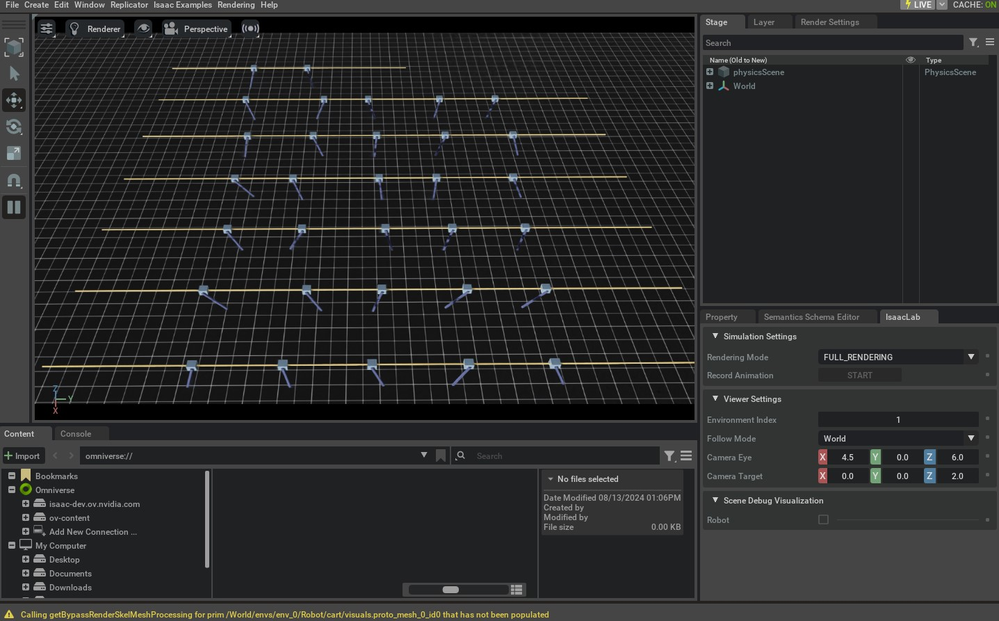

<a id="tutorial-create-manager-base-env"></a>

# 관리자 기반 기본 환경 만들기

환경은 일관된 인터페이스를 통해 다양한 응용 프로그램에 적용할 수 있도록 시뮬레이션의 장면, 관측값 및 동작 공간, 리셋 이벤트 등을 결합합니다. 아이작 랩에서 관리자 기반 환경은 [`envs.ManagerBasedEnv`](../../api/lab/isaaclab.envs.md#isaaclab.envs.ManagerBasedEnv)와 [`envs.ManagerBasedRLEnv`](../../api/lab/isaaclab.envs.md#isaaclab.envs.ManagerBasedRLEnv) 클래스로 구현됩니다. 두 클래스는 매우 유사하지만, [`envs.ManagerBasedRLEnv`](../../api/lab/isaaclab.envs.md#isaaclab.envs.ManagerBasedRLEnv)는 강화 학습 작업에 유용하며 보상, 종료, 커리큘럼 및 명령 생성을 포함합니다. [`envs.ManagerBasedEnv`](../../api/lab/isaaclab.envs.md#isaaclab.envs.ManagerBasedEnv) 클래스는 전통적인 로봇 제어에 유용하며 보상과 종료를 포함하지 않습니다.

이 튜토리얼에서는 기본 클래스 [`envs.ManagerBasedEnv`](../../api/lab/isaaclab.envs.md#isaaclab.envs.ManagerBasedEnv)와 관리자 기반 워크플로에 해당하는 구성 클래스 [`envs.ManagerBasedEnvCfg`](../../api/lab/isaaclab.envs.md#isaaclab.envs.ManagerBasedEnvCfg)를 살펴볼 것입니다. 이전 튜토리얼에서 사용한 카트폴 환경을 이용해 새로운 [`envs.ManagerBasedEnv`](../../api/lab/isaaclab.envs.md#isaaclab.envs.ManagerBasedEnv) 환경을 만드는 다양한 구성 요소를 보여줄 것입니다.

## 코드

이 튜토리얼은 `scripts/tutorials/03_envs` 디렉터리의 `create_cartpole_base_env` 스크립트에 해당합니다.

### create_cartpole_base_env.py 코드

```python
# Copyright (c) 2022-2026, The Isaac Lab Project Developers (https://github.com/isaac-sim/IsaacLab/blob/main/CONTRIBUTORS.md).
# All rights reserved.
#
# SPDX-License-Identifier: BSD-3-Clause

"""
이 스크립트는 카트폴을 사용한 간단한 환경을 만드는 방법을 보여줍니다. 장면, 동작, 관측값 및 이벤트 관리자를 결합하여 환경을 생성합니다.

.. code-block:: bash

    ./isaaclab.sh -p scripts/tutorials/03_envs/create_cartpole_base_env.py --num_envs 32

"""

"""Isaac Sim 시뮬레이터 먼저 실행하기."""


import argparse

from isaaclab.app import AppLauncher

# add argparse arguments
parser = argparse.ArgumentParser(description="카트폴 기본 환경을 만드는 튜토리얼입니다.")
parser.add_argument("--num_envs", type=int, default=16, help="생성할 환경의 수.")

# append AppLauncher cli args
AppLauncher.add_app_launcher_args(parser)
# parse the arguments
args_cli = parser.parse_args()

# launch omniverse app
app_launcher = AppLauncher(args_cli)
simulation_app = app_launcher.app

"""나머지 내용은 여기서부터 시작합니다."""

import math

import torch

import isaaclab.envs.mdp as mdp
from isaaclab.envs import ManagerBasedEnv, ManagerBasedEnvCfg
from isaaclab.managers import EventTermCfg as EventTerm
from isaaclab.managers import ObservationGroupCfg as ObsGroup
from isaaclab.managers import ObservationTermCfg as ObsTerm
from isaaclab.managers import SceneEntityCfg
from isaaclab.utils import configclass

from isaaclab_tasks.manager_based.classic.cartpole.cartpole_env_cfg import CartpoleSceneCfg


@configclass
class ActionsCfg:
    """환경의 동작 사양입니다."""

    joint_efforts = mdp.JointEffortActionCfg(asset_name="robot", joint_names=["slider_to_cart"], scale=5.0)


@configclass
class ObservationsCfg:
    """환경의 관측값 사양입니다."""

    @configclass
    class PolicyCfg(ObsGroup):
        """정책 그룹의 관측값입니다."""

        # 관측값 항목(순서 유지)
        joint_pos_rel = ObsTerm(func=mdp.joint_pos_rel)
        joint_vel_rel = ObsTerm(func=mdp.joint_vel_rel)

        def __post_init__(self) -> None:
            self.enable_corruption = False
            self.concatenate_terms = True

    # 관측값 그룹
    policy: PolicyCfg = PolicyCfg()


@configclass
class EventCfg:
    """이벤트 구성입니다."""

    # 시작 시
    add_pole_mass = EventTerm(
        func=mdp.randomize_rigid_body_mass,
        mode="startup",
        params={
            "asset_cfg": SceneEntityCfg("robot", body_names=["pole"]),
            "mass_distribution_params": (0.1, 0.5),
            "operation": "add",
        },
    )

    # 리셋 시
    reset_cart_position = EventTerm(
        func=mdp.reset_joints_by_offset,
        mode="reset",
        params={
            "asset_cfg": SceneEntityCfg("robot", joint_names=["slider_to_cart"]),
            "position_range": (-1.0, 1.0),
            "velocity_range": (-0.1, 0.1),
        },
    )

    reset_pole_position = EventTerm(
        func=mdp.reset_joints_by_offset,
        mode="reset",
        params={
            "asset_cfg": SceneEntityCfg("robot", joint_names=["cart_to_pole"]),
            "position_range": (-0.125 * math.pi, 0.125 * math.pi),
            "velocity_range": (-0.01 * math.pi, 0.01 * math.pi),
        },
    )


@configclass
class CartpoleEnvCfg(ManagerBasedEnvCfg):
    """카트폴 환경의 구성입니다."""

    # 장면 설정
    scene = CartpoleSceneCfg(num_envs=1024, env_spacing=2.5)
    # 기본 설정
    observations = ObservationsCfg()
    actions = ActionsCfg()
    events = EventCfg()

    def __post_init__(self):
        """후 초기화."""
        # 뷰어 설정
        self.viewer.eye = [4.5, 0.0, 6.0]
        self.viewer.lookat = [0.0, 0.0, 2.0]
        # 단계 설정
        self.decimation = 4  # 4 시뮬레이션 스텝마다 환경 스텝: 200Hz / 4 = 50Hz
        # 시뮬레이션 설정
        self.sim.dt = 0.005  # 5ms마다 시뮬레이션 스텝: 200Hz


def main():
    """메인 함수입니다."""
    # 인수 파싱
    env_cfg = CartpoleEnvCfg()
    env_cfg.scene.num_envs = args_cli.num_envs
    env_cfg.sim.device = args_cli.device
    # 기본 환경 설정
    env = ManagerBasedEnv(cfg=env_cfg)

    # 물리 시뮬레이션
    count = 0
    while simulation_app.is_running():
        with torch.inference_mode():
            # 리셋
            if count % 300 == 0:
                count = 0
                env.reset()
                print("-" * 80)
                print("[INFO]: 환경을 리셋합니다...")
            # 랜덤 동작 샘플링
            joint_efforts = torch.randn_like(env.action_manager.action)
            # 환경 스텝 진행
            obs, _ = env.step(joint_efforts)
            # 폴의 현재 방향 출력
            print("[Env 0]: Pole joint: ", obs["policy"][0][1].item())
            # 카운터 업데이트
            count += 1

    # 환경 종료
    env.close()


if __name__ == "__main__":
    # 메인 함수 실행
    main()
    # 시뮬레이터 앱 종료
    simulation_app.close()
```

## 코드 설명

기반 클래스 [`envs.ManagerBasedEnv`](../../api/lab/isaaclab.envs.md#isaaclab.envs.ManagerBasedEnv)는 시뮬레이션 상호작용의 복잡성을 감싸고 사용자가 시뮬레이션을 실행하고 상호작용할 수 있는 간단한 인터페이스를 제공합니다. 다음과 같은 구성 요소로 이루어집니다.

* [`scene.InteractiveScene`](../../api/lab/isaaclab.scene.md#isaaclab.scene.InteractiveScene) - 시뮬레이션에 사용되는 장면입니다.
* [`managers.ActionManager`](../../api/lab/isaaclab.managers.md#isaaclab.managers.ActionManager) - 동작을 처리하는 관리자입니다.
* [`managers.ObservationManager`](../../api/lab/isaaclab.managers.md#isaaclab.managers.ObservationManager) - 관측값을 처리하는 관리자입니다.
* [`managers.EventManager`](../../api/lab/isaaclab.managers.md#isaaclab.managers.EventManager) - 도메인 랜덤화와 같은 작업(시작 시, 리셋 시, 주기적 간격 등)을 지정된 시뮬레이션 이벤트에서 스케줄하는 관리자입니다.

이러한 구성 요소를 구성함으로써 사용자는 최소한의 노력으로 동일한 환경의 다양한 변형을 만들 수 있습니다. 이 튜토리얼에서는 [`envs.ManagerBasedEnv`](../../api/lab/isaaclab.envs.md#isaaclab.envs.ManagerBasedEnv) 클래스의 다양한 구성 요소를 살펴보고 이를 구성하여 새로운 환경을 만드는 방법을 알아볼 것입니다.

### 장면 설계하기

새 환경을 만드는 첫 번째 단계는 장면을 구성하는 것입니다. 카트폴 환경의 경우, 이전 튜토리얼에서 사용한 장면을 사용할 것입니다. 따라서 여기서는 장면 구성을 생략합니다. 장면 구성 방법에 대한 자세한 내용은 [대화형 장면 사용하기](../02_scene/create_scene.md#tutorial-interactive-scene)를 참조하십시오.

### 동작 정의하기

이전 튜토리얼에서는 [`assets.Articulation.set_joint_effort_target()`](../../api/lab/isaaclab.assets.md#isaaclab.assets.Articulation.set_joint_effort_target) 메서드를 사용하여 카트폴에 동작을 직접 입력했습니다. 이 튜토리얼에서는 [`managers.ActionManager`](../../api/lab/isaaclab.managers.md#isaaclab.managers.ActionManager)를 사용하여 동작을 처리할 것입니다.

동작 관리자는 여러 [`managers.ActionTerm`](../../api/lab/isaaclab.managers.md#isaaclab.managers.ActionTerm)로 구성될 수 있습니다. 각 동작 항목은 환경의 특정 측면에 대한 *제어*를 담당합니다. 예를 들어, 로봇 팔의 경우 팔의 관절을 제어하는 동작 항목 하나와 그리퍼를 제어하는 동작 항목 하나를 가질 수 있습니다. 이러한 구성을 통해 사용자는 환경의 다양한 측면에 대한 다양한 제어 체계를 정의할 수 있습니다.

카트폴 환경에서는 카트에 가해지는 힘을 제어하여 폴을 균형 있게 유지하고자 합니다. 따라서 카트에 가해지는 힘을 제어하는 동작 항목을 만들 것입니다.

```python
@configclass
class ActionsCfg:
    """환경의 동작 사양입니다."""

    joint_efforts = mdp.JointEffortActionCfg(asset_name="robot", joint_names=["slider_to_cart"], scale=5.0)
```

### 관측값 정의하기

장면은 환경의 상태를 정의하지만, 관측값은 에이전트가 관찰할 수 있는 상태를 정의합니다. 이러한 관측값은 에이전트가 어떤 동작을 취할지 결정하는 데 사용됩니다. 아이작 랩에서 관측값은
[`managers.ObservationManager`](../../api/lab/isaaclab.managers.md#isaaclab.managers.ObservationManager) 클래스.

액션 관리자와 유사하게, 관찰 관리자는 여러 관찰 항목으로 구성될 수 있습니다.
이러한 항목들은 환경에 대한 다양한 관찰 공간을 정의하는 데 사용되는 관찰 그룹으로 추가로 그룹화됩니다.
예를 들어, 계층적 제어에서는 두 개의 관찰 그룹 – 저수준 컨트롤러용 하나와 고수준 컨트롤러용 다른 하나 – 을 정의하고 싶을 수 있습니다.
그룹 내의 모든 관찰 항목이 동일한 차원을 가진다고 가정합니다.

이 튜토리얼에서는 `"policy"`라는 이름의 관찰 그룹 하나만 정의할 것입니다.
완전히 규정적이라고 할 수는 없지만, 이 그룹은 Isaac Lab의 다양한 래퍼에 대한 필수 요구 사항입니다.
그룹은 [`managers.ObservationGroupCfg`](../../api/lab/isaaclab.managers.md#isaaclab.managers.ObservationGroupCfg) 클래스를 상속받아 정의합니다.
이 클래스는 다양한 관찰 항목을 수집하고, 노이즈 손상 활성화 또는 관찰을 단일 텐서로 연결하는 것 등의 그룹의 공통 속성을 정의하는 데 도움이 됩니다.

개별 항목은 [`managers.ObservationTermCfg`](../../api/lab/isaaclab.managers.md#isaaclab.managers.ObservationTermCfg) 클래스를 상속받아 정의됩니다.
이 클래스는 [`managers.ObservationTermCfg.func`](../../api/lab/isaaclab.managers.md#isaaclab.managers.ObservationTermCfg.func)를 취하여 해당 항목의 관찰을 계산하는 함수 또는 호출 가능 클래스를 지정합니다.
노이즈 모델, 클리핑, 스케일링 등을 정의하는 다른 매개변수도 포함합니다.
그러나 이 튜토리얼에서는 이러한 매개변수를 기본값으로 그대로 둡니다.

```python
@configclass
class ObservationsCfg:
    """환경에 대한 관찰 사양."""

    @configclass
    class PolicyCfg(ObsGroup):
        """정책 그룹에 대한 관찰."""

        # 관찰 항목 (순서 유지)
        joint_pos_rel = ObsTerm(func=mdp.joint_pos_rel)
        joint_vel_rel = ObsTerm(func=mdp.joint_vel_rel)

        def __post_init__(self) -> None:
            self.enable_corruption = False
            self.concatenate_terms = True

    # 관찰 그룹
    policy: PolicyCfg = PolicyCfg()
```

### 이벤트 정의

이 시점에서, 카트폴 환경에 대한 씬, 액션 및 관찰을 정의했습니다.
이러한 모든 구성 요소에 대한 일반적인 개념은 구성 클래스를 정의한 다음
해당 관리자에 전달하는 것입니다. 이벤트 관리자도 다르지 않습니다.

[`managers.EventManager`](../../api/lab/isaaclab.managers.md#isaaclab.managers.EventManager) 클래스는 시뮬레이션 상태의 변경에 해당하는 이벤트를 담당합니다.
여기에는 씬의 재설정(또는 무작위화), 물리적 속성(예: 질량, 마찰 등)의 무작위화, 시각적 속성(예: 색상, 텍스처 등)의 변화가 포함됩니다.
각각은 [`managers.EventTermCfg`](../../api/lab/isaaclab.managers.md#isaaclab.managers.EventTermCfg) 클래스를 통해 지정되며,
이벤트를 수행하는 함수 또는 호출 가능 클래스를 지정하는 [`managers.EventTermCfg.func`](../../api/lab/isaaclab.managers.md#isaaclab.managers.EventTermCfg.func)를 취합니다.

또한, 이벤트의 **모드**를 기대합니다.
모드는 이벤트 항목이 적용되어야 하는 시점을 지정합니다.
사용자 정의 모드를 지정할 수 있습니다.
이를 위해서는 [`ManagerBasedEnv`](../../api/lab/isaaclab.envs.md#isaaclab.envs.ManagerBasedEnv) 클래스를 조정해야 합니다.
하지만 기본적으로, Isaac Lab은 세 가지 일반적으로 사용되는 모드를 제공합니다:

* `"startup"` - 환경 시작 시 단 한 번 발생하는 이벤트.
* `"reset"` - 환경 종료 및 재설정 시 발생하는 이벤트.
* `"interval"` - 주어진 간격에서 실행되는 이벤트, 즉 특정 수의 단계 이후 주기적으로 실행됩니다.

이 예제에서는 폴의 질량을 시작 시 무작위로 만드는 이벤트를 정의합니다.
이 작업은 비용이 많이 들기 때문에 한 번만 수행하고 재설정 시마다 수행하고 싶지 않습니다.
또한 카트폴의 초기 관절 상태와 폴을 매 재설정 시마다 무작위로 만드는 이벤트도 생성합니다.

```python
@configclass
class EventCfg:
    """이벤트에 대한 구성."""

    # 시작 시
    add_pole_mass = EventTerm(
        func=mdp.randomize_rigid_body_mass,
        mode="startup",
        params={
            "asset_cfg": SceneEntityCfg("robot", body_names=["pole"]),
            "mass_distribution_params": (0.1, 0.5),
            "operation": "add",
        },
    )

    # 재설정 시
    reset_cart_position = EventTerm(
        func=mdp.reset_joints_by_offset,
        mode="reset",
        params={
            "asset_cfg": SceneEntityCfg("robot", joint_names=["slider_to_cart"]),
            "position_range": (-1.0, 1.0),
            "velocity_range": (-0.1, 0.1),
        },
    )

    reset_pole_position = EventTerm(
        func=mdp.reset_joints_by_offset,
        mode="reset",
        params={
            "asset_cfg": SceneEntityCfg("robot", joint_names=["cart_to_pole"]),
            "position_range": (-0.125 * math.pi, 0.125 * math.pi),
            "velocity_range": (-0.01 * math.pi, 0.01 * math.pi),
        },
    )
```

### 모두 연결하기

씬 및 관리자 구성 정의를 마친 후,
[`envs.ManagerBasedEnvCfg`](../../api/lab/isaaclab.envs.md#isaaclab.envs.ManagerBasedEnvCfg) 클래스를 통해 환경 구성을 정의할 수 있습니다.
이 클래스는 씬, 액션, 관찰 및 이벤트 구성을 입력으로 받습니다.

추가적으로, 시뮬레이션 매개변수(예: 타임스텝, 중력 등)를 정의하는 [`envs.ManagerBasedEnvCfg.sim`](../../api/lab/isaaclab.envs.md#isaaclab.envs.ManagerBasedEnvCfg.sim)를 입력으로 받습니다.
이 값은 기본값으로 초기화되지만 필요에 따라 수정할 수 있습니다.
[`envs.ManagerBasedEnvCfg`](../../api/lab/isaaclab.envs.md#isaaclab.envs.ManagerBasedEnvCfg) 클래스에서 `__post_init__()` 메서드를 정의하여
구성이 초기화된 후 호출되도록 하는 것을 권장합니다.

```python
@configclass
class CartpoleEnvCfg(ManagerBasedEnvCfg):
    """카트폴 환경에 대한 구성."""

    # 씬 설정
    scene = CartpoleSceneCfg(num_envs=1024, env_spacing=2.5)
    # 기본 설정
    observations = ObservationsCfg()
    actions = ActionsCfg()
    events = EventCfg()

    def __post_init__(self):
        """후 초기화."""
        # 뷰어 설정
        self.viewer.eye = [4.5, 0.0, 6.0]
        self.viewer.lookat = [0.0, 0.0, 2.0]
        # 단계 설정
        self.decimation = 4  # 4개의 sim 단계마다 1개의 env 단계: 200Hz / 4 = 50Hz
        # 시뮬레이션 설정
        self.sim.dt = 0.005  # 5ms마다 1개의 sim 단계: 200Hz
```

### 시뮬레이션 실행

마지막으로, 시뮬레이션 실행 루프를 다시 살펴봅니다.
이제 환경 구성에 대부분의 세부 사항을 추상화했으므로 이 루프는 훨씬 간단해졌습니다.
우리는 단지 [`envs.ManagerBasedEnv.reset()`](../../api/lab/isaaclab.envs.md#isaaclab.envs.ManagerBasedEnv.reset) 메서드를 호출하여 환경을 재설정하고
[`envs.ManagerBasedEnv.step()`](../../api/lab/isaaclab.envs.md#isaaclab.envs.ManagerBasedEnv.step) 메서드를 호출하여 환경을 진행시켜야 합니다.
이 두 함수는 모두 관찰과 환경이 제공할 수 있는 추가 정보를 포함할 수 있는 info 딕셔너리를 반환합니다.
이들은 에이전트의 의사결정에 사용될 수 있습니다.

[`envs.ManagerBasedEnv`](../../api/lab/isaaclab.envs.md#isaaclab.envs.ManagerBasedEnv) 클래스는 종료 조건에 대한 개념이 없는데,
이는 종료 조건이 에피소드 작업에 특화되어 있기 때문입니다.
따라서 사용자는 환경의 종료 조건을 정의해야 합니다.
이 튜토리얼에서는 시뮬레이션을 정기적인 간격으로 재설정합니다.

```python
def main():
    """메인 함수."""
    # 인수 파싱
    env_cfg = CartpoleEnvCfg()
    env_cfg.scene.num_envs = args_cli.num_envs
    env_cfg.sim.device = args_cli.device
    # 기본 환경 설정
    env = ManagerBasedEnv(cfg=env_cfg)

    # 물리 시뮬레이션
    count = 0
    while simulation_app.is_running():
        with torch.inference_mode():
            # 재설정
            if count % 300 == 0:
                count = 0
                env.reset()
                print("-" * 80)
                print("[INFO]: Resetting environment...")
            # 랜덤 액션 샘플링
            joint_efforts = torch.randn_like(env.action_manager.action)
            # 환경 단계 진행
            obs, _ = env.step(joint_efforts)
            # 폴의 현재 방향 출력
            print("[Env 0]: Pole joint: ", obs["policy"][0][1].item())
            # 카운터 업데이트
            count += 1

    # 환경 종료
    env.close()
```

위에서 중요한 점은 전체 시뮬레이션 루프가 `torch.inference_mode()` 컨텍스트 관리자 안에 래핑되어 있다는 것입니다.
이는 환경이 내부적으로 PyTorch 연산을 사용하기 때문이며,
PyTorch의 자동 미분 엔진 오버헤드로 인해 시뮬레이션이 느려지지 않도록 하고,
시뮬레이션 연산에 대한 그래디언트가 계산되지 않도록 하기 위함입니다.

## 코드 실행

이 튜토리얼에서 만든 기본 환경을 실행하려면 다음 명령을 사용할 수 있습니다:

```bash
./isaaclab.sh -p scripts/tutorials/03_envs/create_cartpole_base_env.py --num_envs 32
```

지면 평면, 광원 및 카트폴이 포함된 스테이지가 열려야 합니다.
시뮬레이션은 카트폴에 랜덤 액션을 적용하여 실행되어야 합니다.
또한 화면 오른쪽 아래에 `"Isaac Lab"` 라는 이름의 UI 창이 열려야 합니다.
이 창에는 디버깅 및 시각화에 사용할 수 있는 다양한 UI 요소가 포함되어 있습니다.



시뮬레이션을 중지하려면 창을 닫거나, 시뮬레이션을 시작한 터미널에서 `Ctrl+C`를 누르면 됩니다.

이 튜토리얼에서 우리는 기본 환경을 정의하는 데 도움이 되는 다양한 관리자에 대해 배웠습니다.
`scripts/tutorials/03_envs` 디렉터리에는 기본 환경을 정의하는 더 많은 예제가 포함되어 있습니다.
완전성을 위해 다음 명령으로 실행할 수 있습니다:

```bash
# PD 제어를 위한 맞춤 액션 항목이 있는 부동 큐브 환경
./isaaclab.sh -p scripts/tutorials/03_envs/create_cube_base_env.py --num_envs 32

# 환경과 상호작용하는 정책이 있는 사족 보행 로봇 이동 환경
./isaaclab.sh -p scripts/tutorials/03_envs/create_quadruped_base_env.py --num_envs 32
```

다음 튜토리얼에서는 [`envs.ManagerBasedRLEnv`](../../api/lab/isaaclab.envs.md#isaaclab.envs.ManagerBasedRLEnv) 클래스를 살펴보고
이를 사용하여 마르코프 의사결정 과정(MDP)을 어떻게 생성할 수 있는지 알아볼 것입니다.
