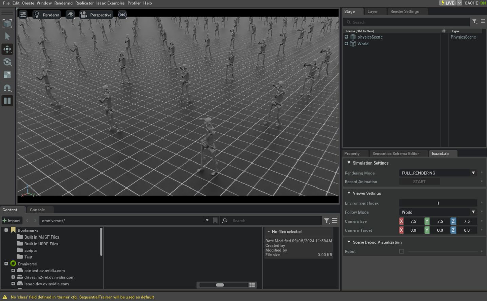

<a id="tutorial-modify-direct-rl-env"></a>

# 기존 Direct RL 환경 수정

[Direct 워크플로우 RL 환경 생성하기](create_direct_rl_env.md#tutorial-create-direct-rl-env)에서 작업 생성 방법을 배우고, [환경 등록](register_rl_env_gym.md#tutorial-register-rl-env-gym)에서 환경을 등록하고, [RL 에이전트로 훈련하기](run_rl_training.md#tutorial-run-rl-training)에서 훈련한 후, 이제 기존 작업에 대한 사소한 수정을 살펴보겠습니다.

때로는 복잡성이나 기존 예시와의 차이로 인해 처음부터 작업을 생성해야 할 수도 있습니다. 그러나 특정 상황에서는 기존 코드를 시작점으로 삼아 사소한 변경사항을 단계별로 도입하여 필요에 맞게 변환하는 것이 가능합니다.

이 튜토리얼에서는 간단한 인간형 모델을 Unitree H1 인간형 로봇으로 변경하면서 원래 코드에 영향을 주지 않도록 직접 워크플로우 인간형 작업에 사소한 수정을 가하겠습니다.

## 기본 코드

이 튜토리얼에서는 `isaaclab_tasks.direct.humanoid` 모듈에 정의된 직접 워크플로우 인간형 환경을 기준으로 시작합니다.

### humanoid_env.py 코드

```python
# Copyright (c) 2022-2026, The Isaac Lab Project Developers (https://github.com/isaac-sim/IsaacLab/blob/main/CONTRIBUTORS.md).
# All rights reserved.
#
# SPDX-License-Identifier: BSD-3-Clause

from __future__ import annotations

import isaaclab.sim as sim_utils
from isaaclab.assets import ArticulationCfg
from isaaclab.envs import DirectRLEnvCfg
from isaaclab.scene import InteractiveSceneCfg
from isaaclab.sim import SimulationCfg
from isaaclab.terrains import TerrainImporterCfg
from isaaclab.utils import configclass

from isaaclab_tasks.direct.locomotion.locomotion_env import LocomotionEnv

from isaaclab_assets import HUMANOID_CFG


@configclass
class HumanoidEnvCfg(DirectRLEnvCfg):
    # env
    episode_length_s = 15.0
    decimation = 2
    action_scale = 1.0
    action_space = 21
    observation_space = 75
    state_space = 0

    # simulation
    sim: SimulationCfg = SimulationCfg(dt=1 / 120, render_interval=decimation)
    terrain = TerrainImporterCfg(
        prim_path="/World/ground",
        terrain_type="plane",
        collision_group=-1,
        physics_material=sim_utils.RigidBodyMaterialCfg(
            friction_combine_mode="average",
            restitution_combine_mode="average",
            static_friction=1.0,
            dynamic_friction=1.0,
            restitution=0.0,
        ),
        debug_vis=False,
    )

    # scene
    scene: InteractiveSceneCfg = InteractiveSceneCfg(
        num_envs=4096, env_spacing=4.0, replicate_physics=True, clone_in_fabric=True
    )

    # robot
    robot: ArticulationCfg = HUMANOID_CFG.replace(prim_path="/World/envs/env_.*/Robot")
    joint_gears: list = [
        67.5000,  # lower_waist
        67.5000,  # lower_waist
        67.5000,  # right_upper_arm
        67.5000,  # right_upper_arm
        67.5000,  # left_upper_arm
        67.5000,  # left_upper_arm
        67.5000,  # pelvis
        45.0000,  # right_lower_arm
        45.0000,  # left_lower_arm
        45.0000,  # right_thigh: x
        135.0000,  # right_thigh: y
        45.0000,  # right_thigh: z
        45.0000,  # left_thigh: x
        135.0000,  # left_thigh: y
        45.0000,  # left_thigh: z
        90.0000,  # right_knee
        90.0000,  # left_knee
        22.5,  # right_foot
        22.5,  # right_foot
        22.5,  # left_foot
        22.5,  # left_foot
    ]

    heading_weight: float = 0.5
    up_weight: float = 0.1

    energy_cost_scale: float = 0.05
    actions_cost_scale: float = 0.01
    alive_reward_scale: float = 2.0
    dof_vel_scale: float = 0.1

    death_cost: float = -1.0
    termination_height: float = 0.8

    angular_velocity_scale: float = 0.25
    contact_force_scale: float = 0.01


class HumanoidEnv(LocomotionEnv):
    cfg: HumanoidEnvCfg

    def __init__(self, cfg: HumanoidEnvCfg, render_mode: str | None = None, **kwargs):
        super().__init__(cfg, render_mode, **kwargs)
```

## 변경 사항 설명

### 파일 복제 및 새 작업 등록

기존 작업의 코드를 수정하지 않기 위해 파이썬 코드가 포함된 파일을 복사하고 이 복사본에서 수정을 수행합니다. 그런 다음 Isaac Lab 프로젝트의 `source/isaaclab_tasks/isaaclab_tasks/direct/humanoid` 폴더에서 `humanoid_env.py` 파일을 복사하여 이름을 `h1_env.py`로 바꿉니다.

코드 편집기에서 `h1_env.py` 파일을 열고 모든 인간형 작업 이름(`HumanoidEnv`)과 해당 구성(`HumanoidEnvCfg`)을 `H1Env` 및 `H1EnvCfg`로 바꿉니다. 이렇게 하면 환경 등록 시 이름 충돌을 방지할 수 있습니다.

이름 변경이 완료되면 `__init__.py` 파일을 수정하여 작업 이름을 `Isaac-H1-Direct-v0`로 새 항목을 추가하여 작업을 등록합니다. 환경 등록에 대한 자세한 내용은 [환경 등록](register_rl_env_gym.md#tutorial-register-rl-env-gym) 튜토리얼을 참조하십시오.

#### 힌트
작업 변경이 최소한인 경우, 동일한 RL 라이브러리 에이전트 구성을 사용하여 성공적으로 훈련할 가능성이 높습니다. 그렇지 않은 경우, 등록 시 `kwargs` 매개변수 아래에서 이름을 조정하여 새로운 구성 파일을 만드는 것이 좋습니다. 이렇게 하면 원래 구성를 변경하지 않을 수 있습니다.

```python
from .h1_env import H1Env, H1EnvCfg
```

```python
gym.register(
    id="Isaac-H1-Direct-v0",
    entry_point="isaaclab_tasks.direct.humanoid:H1Env",
    disable_env_checker=True,
    kwargs={
        "env_cfg_entry_point": H1EnvCfg,
        "rl_games_cfg_entry_point": f"{agents.__name__}:rl_games_ppo_cfg.yaml",
        "rsl_rl_cfg_entry_point": f"{agents.__name__}.rsl_rl_ppo_cfg:HumanoidPPORunnerCfg",
        "skrl_cfg_entry_point": f"{agents.__name__}:skrl_ppo_cfg.yaml",
    },
)
```

### 로봇 변경

새로 생성된 `h1_env.py` 파일의 `H1EnvCfg` 클래스는 환경 구성 값을 캡슐화하며, 여기에는 인스턴스화할 애셋도 포함됩니다. 특히 이 예시에서 `robot` 속성은 목표 애틸레이션 구성 값을 보유합니다.

Unitree H1 로봇은 Isaac Lab 애셋 확장(`isaaclab_assets`)에 포함되어 있으므로 이를 가져와 아래와 같이 직접 교체할 수 있습니다(즉, `H1EnvCfg.robot` 속성에서). 또한 로봇별 구성 값을 보유하는 `joint_gears` 속성도 수정해야 한다는 점에 유의하십시오.

#### 힌트
대상 로봇이 Isaac Lab 애셋 확장에 포함되어 있지 않은 경우, [`ArticulationCfg`](../../api/lab/isaaclab.assets.md#isaaclab.assets.ArticulationCfg) 클래스를 사용하여 USD 파일에서 로드하고 구성할 수 있습니다.

* USD 파일에서 로봇을 로드하고 구성하는 예시는 [Isaac-Franka-Cabinet-Direct-v0](https://github.com/isaac-sim/IsaacLab/blob/main/source/isaaclab_tasks/isaaclab_tasks/direct/franka_cabinet/franka_cabinet_env.py) 소스 코드를 참조하십시오.
* URDF 또는 MJCF 파일 및 기타 형식에서 애셋을 가져오는 방법에 대한詳細は [새 애셋 가져오기](../../how-to/import_new_asset.html) 튜토리얼을 참조하십시오.

```python
from isaaclab_assets import H1_CFG
```

```python
robot: ArticulationCfg = H1_CFG.replace(prim_path="/World/envs/env_.*/Robot")
joint_gears: list = [
    50.0,  # left_hip_yaw
    50.0,  # right_hip_yaw
    50.0,  # torso
    50.0,  # left_hip_roll
    50.0,  # right_hip_roll
    50.0,  # left_shoulder_pitch
    50.0,  # right_shoulder_pitch
    50.0,  # left_hip_pitch
    50.0,  # right_hip_pitch
    50.0,  # left_shoulder_roll
    50.0,  # right_shoulder_roll
    50.0,  # left_knee
    50.0,  # right_knee
    50.0,  # left_shoulder_yaw
    50.0,  # right_shoulder_yaw
    50.0,  # left_ankle
    50.0,  # right_ankle
    50.0,  # left_elbow
    50.0,  # right_elbow
]
```

로봇이 변경됨에 따라 제어해야 하는 조인트 수 또는 articul을 구성하는 리지드 바디 수도 변경됩니다. 따라서 로봇의 특성에 따라 달라지는 환경 구성의 다른 값도 조정해야 합니다. 예를 들어 관측 및 행동 공간의 요소 수를 조정해야 합니다.

```python
action_space = 19
observation_space = 69
```

## 코드 실행

수정이 완료된 후, 이전 튜토리얼과 마찬가지로 사용 가능한 RL 워크플로우 중 하나를 사용하여 해당 작업에서 훈련할 수 있습니다.

```bash
./isaaclab.sh -p scripts/reinforcement_learning/rl_games/train.py --task Isaac-H1-Direct-v0 --headless
```

훈련이 완료되면 다음 명령을 사용하여 결과를 시각화할 수 있습니다.
시뮬레이션을 중지하려면 창을 닫거나 시뮬레이션을 시작한 터미널에서 `Ctrl+C`를 누르면 됩니다.

```bash
./isaaclab.sh -p scripts/reinforcement_learning/rl_games/play.py --task Isaac-H1-Direct-v0 --num_envs 64
```



이 튜토리얼에서는 기존 환경에 영향을 주지 않고 사소한 수정을 가하는 방법을 배웠습니다.

그러나 변경 사항이 작더라도 처음 시도에서 항상 작동하지 않을 수 있다는 점을 명심하는 것이 중요합니다. 수정 중인 환경의 원래 애셋에 대한 더 깊은 종속성이 존재할 수 있기 때문입니다. 이러한 경우에는 사용 가능한 예시의 코드를 자세히 분석하여 적절한 조정을 수행하는 것이 좋습니다.
