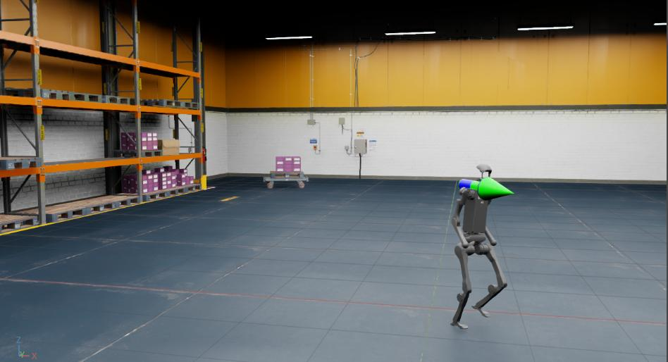

<a id="tutorial-policy-inference-in-usd"></a>

# USD 환경에서 정책 추론

[Modifying an existing Direct RL Environment](modify_direct_rl_env.md#tutorial-modify-direct-rl-env)에서 태스크를 수정하는 방법을 배웠으니, 이제 사전 구축된 USD 장면에서 학습된 정책을 실행하는 방법을 살펴봅니다.

이 튜토리얼에서는 RSL RL 라이브러리와 인간형 거친 지형 `Isaac-Velocity-Rough-H1-v0` 태스크의 학습된 정책을 간단한 창고 USD에서 사용합니다.

## 튜토리얼 코드

이 튜토리얼에서는 학습된 정책의 체크포인트를 jit(오프라인 버전의 정책)로 내보낸 것을 사용합니다.

`H1RoughEnvCfg_PLAY` cfg는 추론 환경의 구성 값을 캡슐화하며, 여기에는 인스턴스화할 자산이 포함됩니다.

사전 구축된 USD 환경을 사용하기 위해 지형 생성기 대신 다음과 같이 config를 변경한 후 `ManagerBasedRLEnv`에 전달합니다.

### policy_inference_in_usd.py 코드

```python
# Copyright (c) 2022-2026, The Isaac Lab Project Developers (https://github.com/isaac-sim/IsaacLab/blob/main/CONTRIBUTORS.md).
# All rights reserved.
#
# SPDX-License-Identifier: BSD-3-Clause

"""
이 스크립트는 사전 구축된 USD 환경에서의 정책 추론을 보여줍니다.

이 예제에서는 locomotion 정책을 사용하여 H1 로봇을 제어합니다. 로봇은 Isaac-Velocity-Rough-H1-v0를 사용하여 학습되었습니다.
로봇은 일정한 속도로 앞으로 이동하도록 명령됩니다.

.. code-block:: bash

    # 스크립트 실행
    ./isaaclab.sh -p scripts/tutorials/03_envs/policy_inference_in_usd.py --checkpoint /path/to/jit/checkpoint.pt

"""

"""먼저 Isaac Sim 시뮬레이터를 실행합니다."""


import argparse

from isaaclab.app import AppLauncher

# argparse 인수 추가
parser = argparse.ArgumentParser(description="창고에서 H1 로봇에 대한 정책 추론 튜토리얼.")
parser.add_argument("--checkpoint", type=str, help="jit로 내보낸 모델 체크포인트 경로.", required=True)

# AppLauncher cli 인수 추가
AppLauncher.add_app_launcher_args(parser)
# 인수 파싱
args_cli = parser.parse_args()

# omniverse 앱 실행
app_launcher = AppLauncher(args_cli)
simulation_app = app_launcher.app

"""나머지 코드."""


import io
import os

import torch

import omni

from isaaclab.envs import ManagerBasedRLEnv
from isaaclab.terrains import TerrainImporterCfg
from isaaclab.utils.assets import ISAAC_NUCLEUS_DIR

from isaaclab_tasks.manager_based.locomotion.velocity.config.h1.rough_env_cfg import H1RoughEnvCfg_PLAY


def main():
    """메인 함수."""
    # 학습된 jit 정책 로드
    policy_path = os.path.abspath(args_cli.checkpoint)
    file_content = omni.client.read_file(policy_path)[2]
    file = io.BytesIO(memoryview(file_content).tobytes())
    policy = torch.jit.load(file, map_location=args_cli.device)

    # 환경 설정
    env_cfg = H1RoughEnvCfg_PLAY()
    env_cfg.scene.num_envs = 1
    env_cfg.curriculum = None
    env_cfg.scene.terrain = TerrainImporterCfg(
        prim_path="/World/ground",
        terrain_type="usd",
        usd_path=f"{ISAAC_NUCLEUS_DIR}/Environments/Simple_Warehouse/warehouse.usd",
    )
    env_cfg.sim.device = args_cli.device
    if args_cli.device == "cpu":
        env_cfg.sim.use_fabric = False

    # 환경 생성
    env = ManagerBasedRLEnv(cfg=env_cfg)

    # 정책으로 추론 실행
    obs, _ = env.reset()
    with torch.inference_mode():
        while simulation_app.is_running():
            action = policy(obs["policy"])
            obs, _, _, _, _ = env.step(action)


if __name__ == "__main__":
    main()
    simulation_app.close()
```

주의할 점은 추론 시 디바이스를 `CPU`로 설정하고 Fabric 사용을 비활성화했다는 것입니다.
이는 소규모 환경 시뮬레이션에서는 CPU 시뮬레이션이 GPU 시뮬레이션보다 더 빠르게 수행될 수 있기 때문입니다.

## 코드 실행

먼저 다음 명령을 실행하여 `Isaac-Velocity-Rough-H1-v0` 태스크를 학습해야 합니다.

```bash
./isaaclab.sh -p scripts/reinforcement_learning/rsl_rl/train.py --task Isaac-Velocity-Rough-H1-v0 --headless
```

학습이 완료되면 다음 명령으로 결과를 시각화할 수 있습니다.
시뮬레이션을 중지하려면 창을 닫거나 시뮬레이션을 시작한 터미널에서 `Ctrl+C`를 누르면 됩니다.

```bash
./isaaclab.sh -p scripts/reinforcement_learning/rsl_rl/play.py --task Isaac-Velocity-Rough-H1-v0 --num_envs 64 --checkpoint logs/rsl_rl/h1_rough/EXPERIMENT_NAME/POLICY_FILE.pt
```

플레이 스크립트를 실행하면 정책이 실험 로그 디렉터리의 `exported/` 폴더 아래에 jit 및 onnx 파일로 내보내집니다.
모든 학습 라이브러리가 정책을 jit 또는 onnx 파일로 내보내는 기능을 지원하는 것은 아닙니다.
이 기능을 아직 지원하지 않는 라이브러리의 경우, 해당 라이브러리의 `play.py` 스크립트를 참조하여 정책을 초기화하는 방법을 알아볼 수 있습니다.

그 다음, 내보낸 jit 정책(`exported/` 디렉터리의 `policy.pt` 파일)을 사용하여 창고 자산을 로드하고 H1 로봇에 대한 추론을 실행할 수 있습니다.

```bash
./isaaclab.sh -p scripts/tutorials/03_envs/policy_inference_in_usd.py --checkpoint logs/rsl_rl/h1_rough/EXPERIMENT_NAME/exported/policy.pt
```



이 튜토리얼에서 기존 환경 구성에 minor 수정을 가하여 사전 구축된 USD 환경에서 정책 추론을 실행하는 방법을 배웠습니다.
