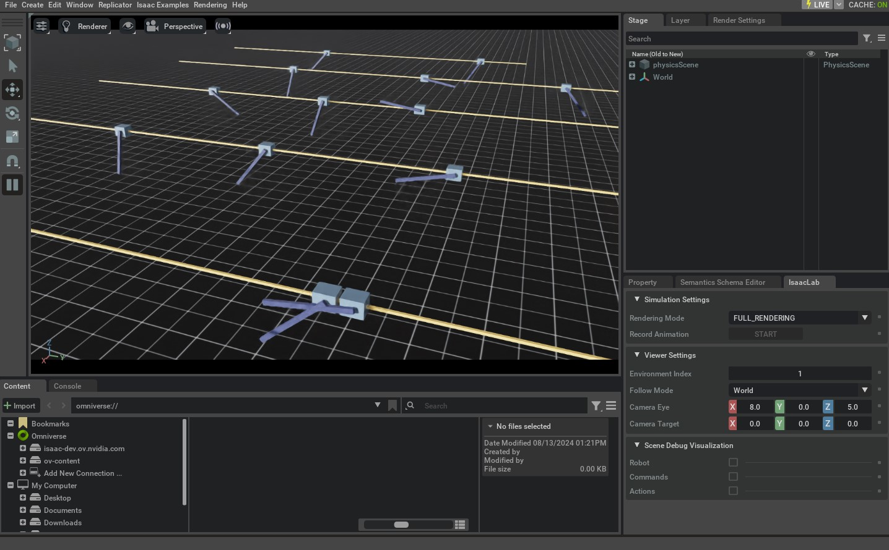

<a id="tutorial-register-rl-env-gym"></a>

# 등록하는 환경

이전 튜토리얼에서, 우리는 사용자 정의 카트폴 환경을 생성하는 방법을 배웠습니다. 우리는 환경 클래스와 그 구성 클래스를 임포트하여 환경의 인스턴스를 수동으로 만들었습니다.

### 이전 튜토리얼의 환경 생성

```python
    # create environment configuration
    env_cfg = CartpoleEnvCfg()
    env_cfg.scene.num_envs = args_cli.num_envs
    env_cfg.sim.device = args_cli.device
    # setup RL environment
    env = ManagerBasedRLEnv(cfg=env_cfg)
```

직접적이긴 하지만, 우리는 많은 환경 세트를 가지고 있기 때문에 이 접근 방식은 확장 가능하지 않습니다. 이 튜토리얼에서는 `gymnasium.register()` 메서드를 사용하여 `gymnasium` 레지스트리에 환경을 등록하는 방법을 보여줍니다. 이를 통해 `gymnasium.make()` 함수를 통해 환경을 생성할 수 있습니다.

### 이번 튜토리얼의 환경 생성

```python
from isaaclab_tasks.utils import parse_env_cfg

# PLACEHOLDER: Extension template (do not remove this comment)


def main():
    """Random actions agent with Isaac Lab environment."""
    # create environment configuration
    env_cfg = parse_env_cfg(
        args_cli.task, device=args_cli.device, num_envs=args_cli.num_envs, use_fabric=not args_cli.disable_fabric
    )
    # create environment
```

## 코드

이 튜토리얼은 `scripts/environments` 디렉터리의 `random_agent.py` 스크립트에 해당합니다.

### random_agent.py의 코드

```python
# Copyright (c) 2022-2026, The Isaac Lab Project Developers (https://github.com/isaac-sim/IsaacLab/blob/main/CONTRIBUTORS.md).
# All rights reserved.
#
# SPDX-License-Identifier: BSD-3-Clause

"""Script to an environment with random action agent."""

"""Launch Isaac Sim Simulator first."""

import argparse

from isaaclab.app import AppLauncher

# add argparse arguments
parser = argparse.ArgumentParser(description="Random agent for Isaac Lab environments.")
parser.add_argument(
    "--disable_fabric", action="store_true", default=False, help="Disable fabric and use USD I/O operations."
)
parser.add_argument("--num_envs", type=int, default=None, help="Number of environments to simulate.")
parser.add_argument("--task", type=str, default=None, help="Name of the task.")
# append AppLauncher cli args
AppLauncher.add_app_launcher_args(parser)
# parse the arguments
args_cli = parser.parse_args()

# launch omniverse app
app_launcher = AppLauncher(args_cli)
simulation_app = app_launcher.app

"""Rest everything follows."""

import gymnasium as gym
import torch

import isaaclab_tasks  # noqa: F401
from isaaclab_tasks.utils import parse_env_cfg

# PLACEHOLDER: Extension template (do not remove this comment)


def main():
    """Random actions agent with Isaac Lab environment."""
    # create environment configuration
    env_cfg = parse_env_cfg(
        args_cli.task, device=args_cli.device, num_envs=args_cli.num_envs, use_fabric=not args_cli.disable_fabric
    )
    # create environment
    env = gym.make(args_cli.task, cfg=env_cfg)

    # print info (this is vectorized environment)
    print(f"[INFO]: Gym observation space: {env.observation_space}")
    print(f"[INFO]: Gym action space: {env.action_space}")
    # reset environment
    env.reset()
    # simulate environment
    while simulation_app.is_running():
        # run everything in inference mode
        with torch.inference_mode():
            # sample actions from -1 to 1
            actions = 2 * torch.rand(env.action_space.shape, device=env.unwrapped.device) - 1
            # apply actions
            env.step(actions)

    # close the simulator
    env.close()


if __name__ == "__main__":
    # run the main function
    main()
    # close sim app
    simulation_app.close()
```

## 코드 설명

[`envs.ManagerBasedRLEnv`](../../api/lab/isaaclab.envs.md#isaaclab.envs.ManagerBasedRLEnv) 클래스는 [`gymnasium.Env`](https://gymnasium.farama.org/api/env/#gymnasium.Env) 클래스를 상속하여 표준 인터페이스를 따릅니다. 그러나 전통적인 Gym 환경과 달리, [`envs.ManagerBasedRLEnv`](../../api/lab/isaaclab.envs.md#isaaclab.envs.ManagerBasedRLEnv)는 *벡터화된* 환경을 구현합니다. 즉, 여러 환경 인스턴스가 동일한 프로세스에서 동시에 실행되며, 모든 데이터는 배치 형태로 반환됩니다.

비슷하게, [`envs.DirectRLEnv`](../../api/lab/isaaclab.envs.md#isaaclab.envs.DirectRLEnv) 클래스도 [`gymnasium.Env`](https://gymnasium.farama.org/api/env/#gymnasium.Env) 클래스를 상속하여 직접 워크플로우를 따릅니다. [`envs.DirectMARLEnv`](../../api/lab/isaaclab.envs.md#isaaclab.envs.DirectMARLEnv)는 Gymnasium을 상속하지 않지만, 동일한 방식으로 등록하고 생성할 수 있습니다.

### gym 레지스트리 사용

환경을 등록하려면 `gymnasium.register()` 메서드를 사용합니다. 이 메서드는 환경 이름, 환경 클래스의 진입점, 환경 구성 클래스의 진입점을 인수로 받습니다.

#### 참고
`gymnasium` 레지스트리는 전역 레지스트리입니다. 따라서 환경 이름이 고유한지 확인하는 것이 중요합니다. 그렇지 않으면, 환경 등록 시 레지스트리가 오류를 발생시킵니다.

#### 관리자 기반 환경

관리자 기반 환경의 경우, `isaaclab_tasks.manager_based.classic.cartpole` 서브패키지의 카트폴 환경에 대한 등록 호출은 다음과 같이 표시됩니다.

```python
import gymnasium as gym

from . import agents

##
# Register Gym environments.
##

gym.register(
    id="Isaac-Cartpole-v0",
    entry_point="isaaclab.envs:ManagerBasedRLEnv",
    disable_env_checker=True,
    kwargs={
        "env_cfg_entry_point": f"{__name__}.cartpole_env_cfg:CartpoleEnvCfg",
        "rl_games_cfg_entry_point": f"{agents.__name__}:rl_games_ppo_cfg.yaml",
        "rsl_rl_cfg_entry_point": f"{agents.__name__}.rsl_rl_ppo_cfg:CartpolePPORunnerCfg",
        "rsl_rl_with_symmetry_cfg_entry_point": f"{agents.__name__}.rsl_rl_ppo_cfg:CartpolePPORunnerWithSymmetryCfg",
        "skrl_cfg_entry_point": f"{agents.__name__}:skrl_ppo_cfg.yaml",
        "sb3_cfg_entry_point": f"{agents.__name__}:sb3_ppo_cfg.yaml",
    },
)

gym.register(
    id="Isaac-Cartpole-RGB-v0",
    entry_point="isaaclab.envs:ManagerBasedRLEnv",
    disable_env_checker=True,
    kwargs={
        "env_cfg_entry_point": f"{__name__}.cartpole_camera_env_cfg:CartpoleRGBCameraEnvCfg",
        "rl_games_cfg_entry_point": f"{agents.__name__}:rl_games_camera_ppo_cfg.yaml",
    },
)

gym.register(
    id="Isaac-Cartpole-Depth-v0",
    entry_point="isaaclab.envs:ManagerBasedRLEnv",
    disable_env_checker=True,
    kwargs={
        "env_cfg_entry_point": f"{__name__}.cartpole_camera_env_cfg:CartpoleDepthCameraEnvCfg",
        "rl_games_cfg_entry_point": f"{agents.__name__}:rl_games_camera_ppo_cfg.yaml",
    },
)

gym.register(
    id="Isaac-Cartpole-RGB-ResNet18-v0",
    entry_point="isaaclab.envs:ManagerBasedRLEnv",
    disable_env_checker=True,
    kwargs={
        "env_cfg_entry_point": f"{__name__}.cartpole_camera_env_cfg:CartpoleResNet18CameraEnvCfg",
        "rl_games_cfg_entry_point": f"{agents.__name__}:rl_games_feature_ppo_cfg.yaml",
    },
)

gym.register(
    id="Isaac-Cartpole-RGB-TheiaTiny-v0",
    entry_point="isaaclab.envs:ManagerBasedRLEnv",
    disable_env_checker=True,
    kwargs={
        "env_cfg_entry_point": f"{__name__}.cartpole_camera_env_cfg:CartpoleTheiaTinyCameraEnvCfg",
        "rl_games_cfg_entry_point": f"{agents.__name__}:rl_games_feature_ppo_cfg.yaml",
    },
)
```

`id` 인수는 환경의 이름입니다. 관례적으로 우리는 레지스트리에서 환경을 더 쉽게 검색할 수 있도록 모든 환경의 이름에 `Isaac-` 접두사를 붙입니다. 환경의 이름은 일반적으로 작업 이름과 로봇 이름 다음에 오며, 예를 들어 평탄한 지형에서 ANYmal C의 다리 locomotion에 대한 환경은 `Isaac-Velocity-Flat-Anymal-C-v0`라고 부릅니다. 버전 번호 `v<N>`은 일반적으로 동일한 환경의 다양한 변형을 지정하는 데 사용됩니다. 그렇지 않으면 환경 이름이 너무 길고 읽기 어려워질 수 있습니다.

`entry_point` 인수는 환경 클래스의 진입점입니다. 진입점은 `<module>:<class>` 형식의 문자열입니다. 카트폴 환경의 경우, 진입점은 `isaaclab.envs:ManagerBasedRLEnv`입니다. 진입점은 환경 인스턴스를 생성할 때 환경 클래스를 가져오는 데 사용됩니다.

`env_cfg_entry_point` 인수는 환경의 기본 구성을 지정합니다. 기본 구성은 [`isaaclab_tasks.utils.parse_env_cfg()`](../../api/lab_tasks/isaaclab_tasks.utils.md#isaaclab_tasks.utils.parse_env_cfg) 함수를 사용하여 로드됩니다. 그런 다음 이 구성은 `gymnasium.make()` 함수에 전달되어 환경 인스턴스를 생성합니다. 구성 진입점은 YAML 파일 또는 파이썬 구성 클래스일 수 있습니다.

#### 직접 기반 환경

직접 기반 환경의 경우, 환경 등록도 비슷한 패턴을 따릅니다. [`ManagerBasedRLEnv`](../../api/lab/isaaclab.envs.md#isaaclab.envs.ManagerBasedRLEnv) 클래스를 환경의 진입점으로 등록하는 대신, 환경의 구현 클래스를 진입점으로 등록합니다. 또한 관리자 기반 환경과 구별하기 위해 환경 이름에 `-Direct` 접미사를 추가합니다.

예를 들어, `isaaclab_tasks.direct.cartpole` 서브패키지의 카트폴 환경에 대한 등록 호출은 다음과 같이 표시됩니다.

```python
import gymnasium as gym

from . import agents

##
# Register Gym environments.
##

gym.register(
    id="Isaac-Cartpole-Direct-v0",
    entry_point=f"{__name__}.cartpole_env:CartpoleEnv",
    disable_env_checker=True,
    kwargs={
        "env_cfg_entry_point": f"{__name__}.cartpole_env:CartpoleEnvCfg",
        "rl_games_cfg_entry_point": f"{agents.__name__}:rl_games_ppo_cfg.yaml",
        "rsl_rl_cfg_entry_point": f"{agents.__name__}.rsl_rl_ppo_cfg:CartpolePPORunnerCfg",
        "skrl_cfg_entry_point": f"{agents.__name__}:skrl_ppo_cfg.yaml",
        "sb3_cfg_entry_point": f"{agents.__name__}:sb3_ppo_cfg.yaml",
    },
)

gym.register(
```

### 환경 생성하기

`isaaclab_tasks` 확장에서 제공하는 모든 환경을 `gym` 레지스트리에 알리기 위해 스크립트 시작 부분에서 모듈을 가져와야 합니다. 이렇게 하면 `__init__.py` 파일이 실행되어 모든 하위 패키지를 반복하고 해당 환경을 등록합니다.

```python
import isaaclab_tasks  # noqa: F401
```

이 튜토리얼에서는 작업 이름을 명령줄에서 읽어옵니다. 작업 이름은 기본 구성을 분석하고 환경 인스턴스를 생성하는 데 사용됩니다. 또한 환경 개수, 시뮬레이션 디바이스, 렌더링 여부와 같은 다른 구문 분석된 명령줄 인수도 기본 구성을 재정의하는 데 사용됩니다.

```python
    # 환경 구성 생성
    env_cfg = parse_env_cfg(
        args_cli.task, device=args_cli.device, num_envs=args_cli.num_envs, use_fabric=not args_cli.disable_fabric
    )
    # 환경 생성
    env = gym.make(args_cli.task, cfg=env_cfg)
```

환경을 생성한 후, 나머지 실행은 표준 리셋 및 스테핑 과정을 따릅니다.

## 코드 실행

코드를 살펴본 후 스크립트를 실행하여 결과를 확인해 보겠습니다:

```bash
./isaaclab.sh -p scripts/environments/random_agent.py --task Isaac-Cartpole-v0 --num_envs 32
```

이 명령은 [Manager-Based RL 환경 생성하기](create_manager_rl_env.md#tutorial-create-manager-rl-env) 튜토리얼과 유사한 단계를 실행하는 창을 띄워야 합니다. 시뮬레이션을 중지하려면 창을 닫거나 터미널에서 `Ctrl+C`를 누르면 됩니다.



또한 `--device` 플래그의 값을 명시적으로 설정하여 시뮬레이션 디바이스를 GPU에서 CPU로 변경할 수도 있습니다:

```bash
./isaaclab.sh -p scripts/environments/random_agent.py --task Isaac-Cartpole-v0 --num_envs 32 --device cpu
```

`--device cpu` 플래그를 사용하면 시뮬레이션이 CPU에서 실행됩니다. 이는 시뮬레이션 디버깅에 유용합니다. 다만, GPU에서의 실행에 비해 훨씬 느리게 동작한다는 점에 유의해야 합니다.
