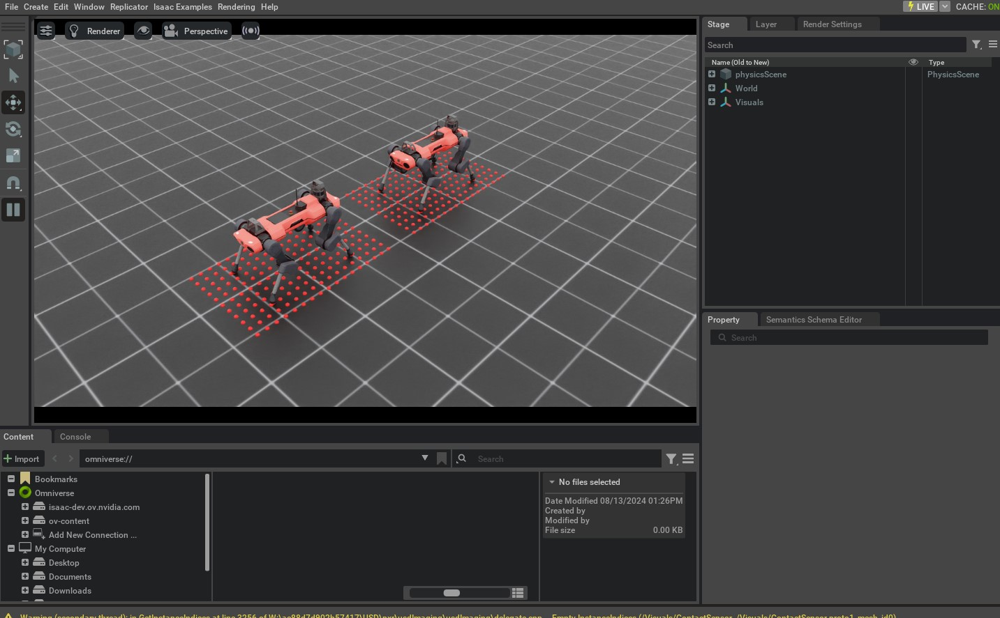

<a id="tutorial-add-sensors-on-robot"></a>

# 로봇에 센서 추가하기

에셋 클래스는 로봇의 물리적 구현을 생성하고 시뮬레이션할 수 있게 해 주지만, 센서는 환경에 대한 정보를 얻는 데 도움이 됩니다. 센서는 일반적으로 시뮬레이션보다 낮은 주기로 업데이트되며, 다양한 proprioceptive(체감) 및 exteroceptive(외부감각) 정보를 얻는 데 유용합니다. 예를 들어, 카메라 센서는 환경의 시각적 정보를 얻는 데 사용될 수 있고, 접촉 센서는 로봇과 환경 간의 접촉 정보를 얻는 데 사용될 수 있습니다.

이 튜토리얼에서는 로봇에 다양한 센서를 추가하는 방법을 살펴봅니다. 이 튜토리얼에서는 ANYmal-C 로봇을 사용합니다. ANYmal-C 로봇은 12개의 자유도를 가진 사족 로봇입니다. 4개의 다리가 있으며, 각 다리는 3개의 자유도를 가집니다. 로봇에는 다음 센서가 있습니다.

- 로봇 머리의 카메라 센서: RGB-D 이미지 제공
- 높이 스캐너 센서: 지형 높이 정보 제공
- 로봇 발의 접촉 센서: 접촉 정보 제공

이 튜토리얼은 [Interactive Scene 사용하기](../02_scene/create_scene.md#tutorial-interactive-scene)의 이전 튜토리얼에서 이어집니다. 여기서 [`scene.InteractiveScene`](../../api/lab/isaaclab.scene.md#isaaclab.scene.InteractiveScene) 클래스에 대해 배웠습니다.

## 코드

이 튜토리얼은 `scripts/tutorials/04_sensors` 디렉터리의 `add_sensors_on_robot.py` 스크립트에 해당합니다.

### add_sensors_on_robot.py 코드

```python
# Copyright (c) 2022-2026, The Isaac Lab Project Developers (https://github.com/isaac-sim/IsaacLab/blob/main/CONTRIBUTORS.md).
# All rights reserved.
#
# SPDX-License-Identifier: BSD-3-Clause

"""
이 스크립트는 로봇에 온보드 센서를 추가하고 시뮬레이션하는 방법을 보여줍니다.

ANYmal-C(ANYbotics) 사족 로봇에 다음 센서를 추가합니다:

* USD-카메라: 로봇의 베이스에 부착된 카메라 센서입니다.
* 높이 스캐너: 로봇의 베이스에 부착된 높이 스캐너 센서입니다.
* 접촉 센서: 로봇의 발에 부착된 접촉 센서입니다.

.. code-block:: bash

    # 사용법
    ./isaaclab.sh -p scripts/tutorials/04_sensors/add_sensors_on_robot.py --enable_cameras

"""

"""Isaac Sim 시뮬레이터 먼저 실행하기."""

import argparse

from isaaclab.app import AppLauncher

# argparse 인수 추가
parser = argparse.ArgumentParser(description="로봇에 센서 추가하기 튜토리얼.")
parser.add_argument("--num_envs", type=int, default=2, help="생성할 환경 수.")
# AppLauncher CLI 인수 추가
AppLauncher.add_app_launcher_args(parser)
# 인수 파싱
args_cli = parser.parse_args()

# 옴니버스 앱 실행
app_launcher = AppLauncher(args_cli)
simulation_app = app_launcher.app

"""나머지는 여기서부터 진행됩니다."""

import torch

import isaaclab.sim as sim_utils
from isaaclab.assets import ArticulationCfg, AssetBaseCfg
from isaaclab.scene import InteractiveScene, InteractiveSceneCfg
from isaaclab.sensors import CameraCfg, ContactSensorCfg, RayCasterCfg, patterns
from isaaclab.utils import configclass

##
# 미리 정의된 구성
##
from isaaclab_assets.robots.anymal import ANYMAL_C_CFG  # isort: skip


@configclass
class SensorsSceneCfg(InteractiveSceneCfg):
    """로봇에 센서가 있는 장면 설계."""

    # 지면 평면
    ground = AssetBaseCfg(prim_path="/World/defaultGroundPlane", spawn=sim_utils.GroundPlaneCfg())

    # 조명
    dome_light = AssetBaseCfg(
        prim_path="/World/Light", spawn=sim_utils.DomeLightCfg(intensity=3000.0, color=(0.75, 0.75, 0.75))
    )

    # 로봇
    robot: ArticulationCfg = ANYMAL_C_CFG.replace(prim_path="{ENV_REGEX_NS}/Robot")

    # 센서
    camera = CameraCfg(
        prim_path="{ENV_REGEX_NS}/Robot/base/front_cam",
        update_period=0.1,
        height=480,
        width=640,
        data_types=["rgb", "distance_to_image_plane"],
        spawn=sim_utils.PinholeCameraCfg(
            focal_length=24.0, focus_distance=400.0, horizontal_aperture=20.955, clipping_range=(0.1, 1.0e5)
        ),
        offset=CameraCfg.OffsetCfg(pos=(0.510, 0.0, 0.015), rot=(0.5, -0.5, 0.5, -0.5), convention="ros"),
    )
    height_scanner = RayCasterCfg(
        prim_path="{ENV_REGEX_NS}/Robot/base",
        update_period=0.02,
        offset=RayCasterCfg.OffsetCfg(pos=(0.0, 0.0, 20.0)),
        ray_alignment="yaw",
        pattern_cfg=patterns.GridPatternCfg(resolution=0.1, size=[1.6, 1.0]),
        debug_vis=True,
        mesh_prim_paths=["/World/defaultGroundPlane"],
    )
    contact_forces = ContactSensorCfg(
        prim_path="{ENV_REGEX_NS}/Robot/.*_FOOT", update_period=0.0, history_length=6, debug_vis=True
    )


def run_simulator(sim: sim_utils.SimulationContext, scene: InteractiveScene):
    """시뮬레이터 실행."""
    # 시뮬레이션 스텝 정의
    sim_dt = sim.get_physics_dt()
    sim_time = 0.0
    count = 0

    # 물리 시뮬레이션 수행
    while simulation_app.is_running():
        # 리셋
        if count % 500 == 0:
            # 카운터 리셋
            count = 0
            # 장면 엔티티 리셋
            # 루트 상태
            # 상태가 시뮬레이션 월드 프레임에서 쓰여지기 때문에, 루트 상태를 오프셋으로 보정함
            # 이렇게 하지 않으면 로봇이 시뮬레이션 월드의 (0, 0, 0)에 생성됨
            root_state = scene["robot"].data.default_root_state.clone()
            root_state[:, :3] += scene.env_origins
            scene["robot"].write_root_pose_to_sim(root_state[:, :7])
            scene["robot"].write_root_velocity_to_sim(root_state[:, 7:])
            # 약간의 노이즈를加えて joint 위치 설정
            joint_pos, joint_vel = (
                scene["robot"].data.default_joint_pos.clone(),
                scene["robot"].data.default_joint_vel.clone(),
            )
            joint_pos += torch.rand_like(joint_pos) * 0.1
            scene["robot"].write_joint_state_to_sim(joint_pos, joint_vel)
            # 내부 버퍼 클리어
            scene.reset()
            print("[INFO]: 로봇 상태 리셋 중...")
        # 로봇에 기본 동작 적용
        # -- 액션/명령 생성
        targets = scene["robot"].data.default_joint_pos
        # -- 로봇에 액션 적용
        scene["robot"].set_joint_position_target(targets)
        # -- 시뮬레이션에 데이터 쓰기
        scene.write_data_to_sim()
        # 스텝 수행
        sim.step()
        # 시뮬레이션 시간 업데이트
        sim_time += sim_dt
        count += 1
        # 버퍼 업데이트
        scene.update(sim_dt)

        # 센서에서 정보 출력
        print("-------------------------------")
        print(scene["camera"])
        print("Received shape of rgb   image: ", scene["camera"].data.output["rgb"].shape)
        print("Received shape of depth image: ", scene["camera"].data.output["distance_to_image_plane"].shape)
        print("-------------------------------")
        print(scene["height_scanner"])
        print("Received max height value: ", torch.max(scene["height_scanner"].data.ray_hits_w[..., -1]).item())
        print("-------------------------------")
        print(scene["contact_forces"])
        print("Received max contact force of: ", torch.max(scene["contact_forces"].data.net_forces_w).item())


def main():
    """메인 함수."""

    # 시뮬레이션 컨텍스트 초기화
    sim_cfg = sim_utils.SimulationCfg(dt=0.005, device=args_cli.device)
    sim = sim_utils.SimulationContext(sim_cfg)
    # 메인 카메라 설정
    sim.set_camera_view(eye=[3.5, 3.5, 3.5], target=[0.0, 0.0, 0.0])
    # 장면 설계
    scene_cfg = SensorsSceneCfg(num_envs=args_cli.num_envs, env_spacing=2.0)
    scene = InteractiveScene(scene_cfg)
    # 시뮬레이터 재생
    sim.reset()
    # 이제 준비 완료!
    print("[INFO]: 설정 완료...")
    # 시뮬레이터 실행
    run_simulator(sim, scene)


if __name__ == "__main__":
    # 메인 함수 실행
    main()
    # 시뮬레이터 앱 종료
    simulation_app.close()
```

## 코드 설명

이전 튜토리얼과 유사하게, 씬에 에셋을 추가하는 방식과 같이 센서도 씬 구성에 추가됩니다. 모든 센서는 [`sensors.SensorBase`](../../api/lab/isaaclab.sensors.md#isaaclab.sensors.SensorBase) 클래스를 상속받으며, 각각의 구성 클래스를 통해 설정됩니다. 각 센서 인스턴스는 자체적인 업데이트 주기를 정의할 수 있으며, 이 주기는 센서가 업데이트되는 빈도를 의미합니다. 업데이트 주기는 [`sensors.SensorBaseCfg.update_period`](../../api/lab/isaaclab.sensors.md#isaaclab.sensors.SensorBaseCfg.update_period) 속성을 통해 초 단위로 지정됩니다.

지정된 경로와 센서 유형에 따라 센서는 씬의 프리밉스에 연결됩니다. 이들은 씬에서 생성된 관련 프리밈을 가질 수도 있고, 기존 프리밍에 연결될 수도 있습니다. 예를 들어, 카메라 센서는 씬에 생성되는 해당 프리밈을 가지는 반면, 접촉 센서는 강체 프리밍의 속성으로 접촉 보고를 활성화하는 방식입니다.

다음에서는 이 튜토리얼에서 사용하는 다양한 센서와 그 구성 방법을 소개합니다. 보다詳しい 설명은 `sensors` 모듈을 참조하세요.

### 카메라 센서

카메라는 [`sensors.CameraCfg`](../../api/lab/isaaclab.sensors.md#isaaclab.sensors.CameraCfg)를 사용하여 정의됩니다. 이는 USD 카메라 센서를 기반으로 하며, 다양한 데이터 유형은 Omniverse Replicator API를 통해 캡처됩니다. 씬에 해당하는 프리밈이 존재하기 때문에, 프리밈은 지정된 프리밍 경로에서 씬에 생성됩니다.

카메라 센서의 구성에는 다음과 같은 매개변수가 포함됩니다:

* [`spawn`](../../api/lab/isaaclab.sensors.md#isaaclab.sensors.CameraCfg.spawn): 생성할 USD 카메라 유형입니다. 다음 중 하나일 수 있습니다:
  [`PinholeCameraCfg`](../../api/lab/isaaclab.sim.spawners.md#isaaclab.sim.spawners.sensors.PinholeCameraCfg) 또는 [`FisheyeCameraCfg`](../../api/lab/isaaclab.sim.spawners.md#isaaclab.sim.spawners.sensors.FisheyeCameraCfg).
* [`offset`](../../api/lab/isaaclab.sensors.md#isaaclab.sensors.CameraCfg.offset): 부모 프림으로부터 카메라 센서의 오프셋입니다.
* [`data_types`](../../api/lab/isaaclab.sensors.md#isaaclab.sensors.CameraCfg.data_types): 캡처할 데이터 유형입니다. 이는 `rgb`, `distance_to_image_plane`, `normals`, 또는 USD 카메라 센서에서 지원하는 기타 유형일 수 있습니다.

로봇의 헤드에 RGB-D 카메라 센서를 부착하려면, 로봇의 베이스 프레임을 기준으로 오프셋을 지정해야 합니다. 오프셋은 베이스 프레임에 대한 이동 및 회전으로 지정되며, 오프셋이 지정된 `convention`도 함께 고려됩니다.

다음에서는 이 튜토리얼에서 사용된 카메라 센서의 구성을 보여줍니다. 업데이트 주기를 0.1초로 설정하여 카메라 센서가 10Hz로 업데이트되도록 합니다. 프림 경로 표현은 `{ENV_REGEX_NS}/Robot/base/front_cam`으로 설정되며, 여기서 `{ENV_REGEX_NS}`는 환경 네임스페이스, `"Robot"`은 로봇의 이름, `"base"`는 카메라가 부착된 프림의 이름, 그리고 `"front_cam"`은 카메라 센서와 관련된 프림의 이름입니다.

```python
    camera = CameraCfg(
        prim_path="{ENV_REGEX_NS}/Robot/base/front_cam",
        update_period=0.1,
        height=480,
        width=640,
        data_types=["rgb", "distance_to_image_plane"],
        spawn=sim_utils.PinholeCameraCfg(
            focal_length=24.0, focus_distance=400.0, horizontal_aperture=20.955, clipping_range=(0.1, 1.0e5)
        ),
        offset=CameraCfg.OffsetCfg(pos=(0.510, 0.0, 0.015), rot=(0.5, -0.5, 0.5, -0.5), convention="ros"),
    )
```

### 높이 스캐너

높이 스캐너는 NVIDIA Warp 레이캐스팅 커널을 사용하는 가상 센서로 구현됩니다. [`sensors.RayCasterCfg`](../../api/lab/isaaclab.sensors.md#isaaclab.sensors.RayCasterCfg)를 통해 캐스팅할 레이의 패턴과 레이를 캐스팅할 메시를 지정할 수 있습니다. 가상 센서이므로 scene에 해당하는 프림이 생성되지 않습니다. 대신 scene의 프림에 부착되어 해당 프림의 위치를 센서 위치로 사용합니다.

이 튜토리얼에서는 레이캐스팅 기반 높이 스캐너를 로봇의 베이스 프레임에 부착합니다. 레이의 패턴은 `pattern` 속성을 사용하여 지정됩니다. 균일 그리드 패턴의 경우, [`GridPatternCfg`](../../api/lab/isaaclab.sensors.patterns.md#isaaclab.sensors.patterns.GridPatternCfg)를 사용하여 패턴을 지정합니다. 높이 정보만 필요하므로 로봇의 롤과 피치는 고려하지 않습니다. 따라서 [`ray_alignment`](../../api/lab/isaaclab.sensors.md#isaaclab.sensors.RayCasterCfg.ray_alignment)를 "yaw"로 설정합니다.

높이 스캐너의 경우, 레이와 메시가 교차하는 지점을 시각화할 수 있습니다. 이는 [`debug_vis`](../../api/lab/isaaclab.sensors.md#isaaclab.sensors.SensorBaseCfg.debug_vis) 속성을 `true`로 설정하여 수행됩니다.

높이 스캐너의 전체 구성은 다음과 같습니다:

```python
    height_scanner = RayCasterCfg(
        prim_path="{ENV_REGEX_NS}/Robot/base",
        update_period=0.02,
        offset=RayCasterCfg.OffsetCfg(pos=(0.0, 0.0, 20.0)),
        ray_alignment="yaw",
        pattern_cfg=patterns.GridPatternCfg(resolution=0.1, size=[1.6, 1.0]),
        debug_vis=True,
        mesh_prim_paths=["/World/defaultGroundPlane"],
    )
```

### 접촉 센서

접촉 센서는 PhysX 접촉 보고 API를 감싸서 로봇과 환경 사이의 접촉 정보를 얻습니다. PhysX에 의존하므로, 접촉 센서는 로봇의 강체에서 접촉 보고 API가 활성화되어 있어야 합니다. 이는 애셋 구성에서 [`activate_contact_sensors`](../../api/lab/isaaclab.sim.spawners.md#isaaclab.sim.spawners.RigidObjectSpawnerCfg.activate_contact_sensors)를 `true`로 설정하여 수행할 수 있습니다.

[`sensors.ContactSensorCfg`](../../api/lab/isaaclab.sensors.md#isaaclab.sensors.ContactSensorCfg)를 통해 접촉 정보를 얻고 싶은 프림을 지정할 수 있습니다. 또한, 접촉 공기 시간, 필터링된 프림 사이의 접촉력 등과 같은 추가 정보를 얻기 위한 플래그도 설정할 수 있습니다.

이 튜토리얼에서는 로봇의 발에 접촉 센서를 부착합니다. 로봇의 발은 각각 `"LF_FOOT"`, `"RF_FOOT"`, `"LH_FOOT"`, 그리고 `"RH_FOOT"`로 명명되었습니다. prim 경로 지정을 간소화하기 위해 정규 표현식 `".*_FOOT"`를 사용합니다. 이 표현은 `"_FOOT"`로 끝나는 모든 프림과 매치됩니다.

업데이트 주기를 0으로 설정하여 시뮬레이션과 동일한 주기로 센서를 업데이트합니다. 또한, 접촉 센서의 경우 접촉 정보의 히스토리 길이를 지정하여 저장할 수 있습니다. 이 튜토리얼에서는 히스토리 길이를 6으로 설정하여, 최근 6개의 시뮬레이션 스텝에 대한 접촉 정보를 저장합니다.

접촉 센서의 전체 구성은 다음과 같습니다:

```python
    contact_forces = ContactSensorCfg(
        prim_path="{ENV_REGEX_NS}/Robot/.*_FOOT", update_period=0.0, history_length=6, debug_vis=True
    )
```

### 시뮬레이션 루프 실행

애셋을 사용할 때와 마찬가지로, 센서의 버퍼와 물리 핸들은 시뮬레이션이 재생될 때만 초기화됩니다. 즉, 씬을 생성한 후 `sim.reset()`을 호출하는 것이 중요합니다.

```python
    # Play the simulator
    sim.reset()
```

除此之外, 시뮬레이션 루프는 이전 튜토리얼과 유사합니다. 센서는 씬 업데이트의 일부로 업데이트되며, 내부적으로 자신의 업데이트 주기에 따라 버퍼 업데이트를 처리합니다.

센서의 데이터는 `data` 속성을 통해 접근할 수 있습니다. 예를 들어, 이 튜토리얼에서 생성된 다양한 센서의 데이터에 접근하는 방법은 다음과 같습니다:

```python
        # print information from the sensors
        print("-------------------------------")
        print(scene["camera"])
        print("Received shape of rgb   image: ", scene["camera"].data.output["rgb"].shape)
        print("Received shape of depth image: ", scene["camera"].data.output["distance_to_image_plane"].shape)
        print("-------------------------------")
        print(scene["height_scanner"])
        print("Received max height value: ", torch.max(scene["height_scanner"].data.ray_hits_w[..., -1]).item())
        print("-------------------------------")
        print(scene["contact_forces"])
        print("Received max contact force of: ", torch.max(scene["contact_forces"].data.net_forces_w).item())
```

## 코드 실행

이제 코드를 살펴봤으니, 스크립트를 실행하여 결과를 확인해 보겠습니다:

```bash
./isaaclab.sh -p scripts/tutorials/04_sensors/add_sensors_on_robot.py --num_envs 2 --enable_cameras
```

이 명령은 지상 평면, 조명, 그리고 두 대의 사족 보행 로봇이 있는 단계를 열어야 합니다. 로봇 주변에는 메시에 레이저가 닿은 지점을 나타내는 빨간 구체가 보여야 합니다. 또한, 뷰포트를 카메라 뷰로 전환하여 카메라 센서가 캡처한 RGB 이미지를 볼 수 있습니다. 뷰포트를 카메라 뷰로 전환하는 방법에 대한詳細は [여기](https://youtu.be/htPbcKkNMPs?feature=shared)를 참조하십시오.



시뮬레이션을 중지하려면 창을 닫거나 터미널에서 `Ctrl+C`를 누르면 됩니다.

이 튜토리얼에서는 다양한 센서를 생성하고 사용하는 방법을 다루었지만, `sensors` 모듈에는 훨씬 더 많은 센서가 제공됩니다. 이러한 센서의 최소 사용 예시는 `scripts/tutorials/04_sensors` 디렉터리에 포함되어 있습니다. 완전성을 위해 다음 명령을 사용하여 이러한 스크립트를 실행할 수 있습니다:

```bash
# Frame Transformer
./isaaclab.sh -p scripts/tutorials/04_sensors/run_frame_transformer.py

# Ray Caster
./isaaclab.sh -p scripts/tutorials/04_sensors/run_ray_caster.py

# Ray Caster Camera
./isaaclab.sh -p scripts/tutorials/04_sensors/run_ray_caster_camera.py

# USD Camera
./isaaclab.sh -p scripts/tutorials/04_sensors/run_usd_camera.py --enable_cameras
```
