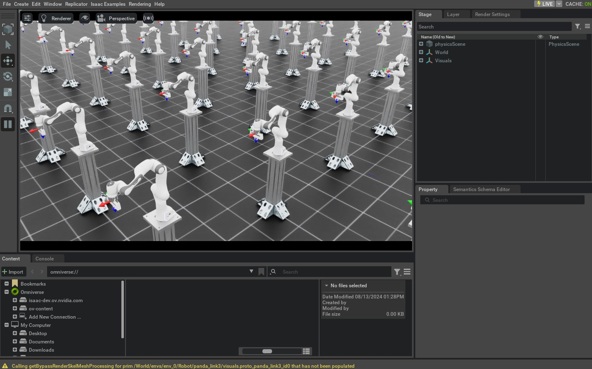

# 작업 공간 컨트롤러 사용하기

이전 튜토리얼에서는 관절 공간 컨트롤러를 사용하여 로봇을 제어했습니다. 그러나 많은 경우에 작업 공간 컨트롤러를 사용하여 로봇을 제어하는 것이 더 직관적입니다. 예를 들어, 원격 조작을 수행하려면 원하는 조인트 위치 대신 원하는 엔드 이펙터 포즈를 지정하는 것이 더 쉽습니다.

이 튜토리얼에서는 작업 공간 컨트롤러를 사용하여 로봇을 제어하는 방법을 배웁니다.
[`controllers.DifferentialIKController`](../../api/lab/isaaclab.controllers.md#isaaclab.controllers.DifferentialIKController) 클래스를 사용하여 원하는 엔드 이펙터 포즈 명령을 추적합니다.

## 코드

이 튜토리얼은 `scripts/tutorials/05_controllers` 디렉터리의 `run_diff_ik.py` 스크립트에 해당합니다.

### run_diff_ik.py 코드

```python
# Copyright (c) 2022-2026, The Isaac Lab Project Developers (https://github.com/isaac-sim/IsaacLab/blob/main/CONTRIBUTORS.md).
# All rights reserved.
#
# SPDX-License-Identifier: BSD-3-Clause

"""
이 스크립트는 시뮬레이터와 함께 차분 역기학 컨트롤러를 사용하는 방법을 보여줍니다.

차분 IK 컨트롤러는 다양한 모드로 구성할 수 있습니다. PhysX에서 계산된 자코비언을 사용합니다.
이를 통해 역기학의 병렬 계산을 수행하는 데 도움이 됩니다.

.. code-block:: bash

    # Usage
    ./isaaclab.sh -p scripts/tutorials/05_controllers/run_diff_ik.py

"""

"""Isaac Sim 시뮬레이터 먼저 실행하기."""

import argparse

from isaaclab.app import AppLauncher

# add argparse arguments
parser = argparse.ArgumentParser(description="차분 IK 컨트롤러 사용 튜토리얼.")
parser.add_argument("--robot", type=str, default="franka_panda", help="로봇 이름.")
parser.add_argument("--num_envs", type=int, default=128, help="생성할 환경 수.")
# append AppLauncher cli args
AppLauncher.add_app_launcher_args(parser)
# parse the arguments
args_cli = parser.parse_args()

# launch omniverse app
app_launcher = AppLauncher(args_cli)
simulation_app = app_launcher.app

"""Rest everything follows."""

import torch

import isaaclab.sim as sim_utils
from isaaclab.assets import AssetBaseCfg
from isaaclab.controllers import DifferentialIKController, DifferentialIKControllerCfg
from isaaclab.managers import SceneEntityCfg
from isaaclab.markers import VisualizationMarkers
from isaaclab.markers.config import FRAME_MARKER_CFG
from isaaclab.scene import InteractiveScene, InteractiveSceneCfg
from isaaclab.utils import configclass
from isaaclab.utils.assets import ISAAC_NUCLEUS_DIR
from isaaclab.utils.math import subtract_frame_transforms

##
# 사전 정의된 구성
##
from isaaclab_assets import FRANKA_PANDA_HIGH_PD_CFG, UR10_CFG  # isort:skip


@configclass
class TableTopSceneCfg(InteractiveSceneCfg):
    """카트-폴 장면에 대한 구성입니다."""

    # 바닥 평면
    ground = AssetBaseCfg(
        prim_path="/World/defaultGroundPlane",
        spawn=sim_utils.GroundPlaneCfg(),
        init_state=AssetBaseCfg.InitialStateCfg(pos=(0.0, 0.0, -1.05)),
    )

    # 조명
    dome_light = AssetBaseCfg(
        prim_path="/World/Light", spawn=sim_utils.DomeLightCfg(intensity=3000.0, color=(0.75, 0.75, 0.75))
    )

    # 마운트
    table = AssetBaseCfg(
        prim_path="{ENV_REGEX_NS}/Table",
        spawn=sim_utils.UsdFileCfg(
            usd_path=f"{ISAAC_NUCLEUS_DIR}/Props/Mounts/Stand/stand_instanceable.usd", scale=(2.0, 2.0, 2.0)
        ),
    )

    # 관절형 물체
    if args_cli.robot == "franka_panda":
        robot = FRANKA_PANDA_HIGH_PD_CFG.replace(prim_path="{ENV_REGEX_NS}/Robot")
    elif args_cli.robot == "ur10":
        robot = UR10_CFG.replace(prim_path="{ENV_REGEX_NS}/Robot")
    else:
        raise ValueError(f"로봇 {args_cli.robot}은(는) 지원되지 않습니다. 지원 대상: franka_panda, ur10")


def run_simulator(sim: sim_utils.SimulationContext, scene: InteractiveScene):
    """시뮬레이션 루프를 실행합니다."""
    # 시뮬레이션 엔티티 추출
    # note: 가독성을 위해 여기서만 수행합니다.
    robot = scene["robot"]

    # 컨트롤러 생성
    diff_ik_cfg = DifferentialIKControllerCfg(command_type="pose", use_relative_mode=False, ik_method="dls")
    diff_ik_controller = DifferentialIKController(diff_ik_cfg, num_envs=scene.num_envs, device=sim.device)

    # 마커
    frame_marker_cfg = FRAME_MARKER_CFG.copy()
    frame_marker_cfg.markers["frame"].scale = (0.1, 0.1, 0.1)
    ee_marker = VisualizationMarkers(frame_marker_cfg.replace(prim_path="/Visuals/ee_current"))
    goal_marker = VisualizationMarkers(frame_marker_cfg.replace(prim_path="/Visuals/ee_goal"))

    # 팔의 목표 정의
    ee_goals = [
        [0.5, 0.5, 0.7, 0.707, 0, 0.707, 0],
        [0.5, -0.4, 0.6, 0.707, 0.707, 0.0, 0.0],
        [0.5, 0, 0.5, 0.0, 1.0, 0.0, 0.0],
    ]
    ee_goals = torch.tensor(ee_goals, device=sim.device)
    # 주어진 명령 추적
    current_goal_idx = 0
    # 행동 저장 버퍼 생성
    ik_commands = torch.zeros(scene.num_envs, diff_ik_controller.action_dim, device=robot.device)
    ik_commands[:] = ee_goals[current_goal_idx]

    # 로봇별 매개변수 지정
    if args_cli.robot == "franka_panda":
        robot_entity_cfg = SceneEntityCfg("robot", joint_names=["panda_joint.*"], body_names=["panda_hand"])
    elif args_cli.robot == "ur10":
        robot_entity_cfg = SceneEntityCfg("robot", joint_names=[".*"], body_names=["ee_link"])
    else:
        raise ValueError(f"로봇 {args_cli.robot}은(는) 지원되지 않습니다. 지원 대상: franka_panda, ur10")
    # 시뮬레이션 엔티티 해석
    robot_entity_cfg.resolve(scene)
    # 엔드 이펙터의 프레임 인덱스 가져오기
    # 고정 기반 로봇의 경우, 루트 바디는 반환된 자코비안에 포함되지 않으므로 프레임 인덱스는 바디 인덱스보다 1 작습니다.
    if robot.is_fixed_base:
        ee_jacobi_idx = robot_entity_cfg.body_ids[0] - 1
    else:
        ee_jacobi_idx = robot_entity_cfg.body_ids[0]

    # 시뮬레이션 스텝 정의
    sim_dt = sim.get_physics_dt()
    count = 0
    # 시뮬레이션 루프
    while simulation_app.is_running():
        # 초기화
        if count % 150 == 0:
            # 시간 초기화
            count = 0
            # 관절 상태 초기화
            joint_pos = robot.data.default_joint_pos.clone()
            joint_vel = robot.data.default_joint_vel.clone()
            robot.write_joint_state_to_sim(joint_pos, joint_vel)
            robot.reset()
            # 행동 초기화
            ik_commands[:] = ee_goals[current_goal_idx]
            joint_pos_des = joint_pos[:, robot_entity_cfg.joint_ids].clone()
            # 컨트롤러 초기화
            diff_ik_controller.reset()
            diff_ik_controller.set_command(ik_commands)
            # 목표 변경
            current_goal_idx = (current_goal_idx + 1) % len(ee_goals)
        else:
            # 시뮬레이션에서 양량 가져오기
            jacobian = robot.root_physx_view.get_jacobians()[:, ee_jacobi_idx, :, robot_entity_cfg.joint_ids]
            ee_pose_w = robot.data.body_pose_w[:, robot_entity_cfg.body_ids[0]]
            root_pose_w = robot.data.root_pose_w
            joint_pos = robot.data.joint_pos[:, robot_entity_cfg.joint_ids]
            # 루트 프레임에서의 프레임 계산
            ee_pos_b, ee_quat_b = subtract_frame_transforms(
                root_pose_w[:, 0:3], root_pose_w[:, 3:7], ee_pose_w[:, 0:3], ee_pose_w[:, 3:7]
            )
            # 관절 명령 계산
            joint_pos_des = diff_ik_controller.compute(ee_pos_b, ee_quat_b, jacobian, joint_pos)

        # 행동 적용
        robot.set_joint_position_target(joint_pos_des, joint_ids=robot_entity_cfg.joint_ids)
        scene.write_data_to_sim()
        # 스텝 수행
        sim.step()
        # 시뮬레이션 시간 업데이트
        count += 1
        # 버퍼 업데이트
        scene.update(sim_dt)

        # 시뮬레이션에서 양량 가져오기
        ee_pose_w = robot.data.body_state_w[:, robot_entity_cfg.body_ids[0], 0:7]
        # 마커 위치 업데이트
        ee_marker.visualize(ee_pose_w[:, 0:3], ee_pose_w[:, 3:7])
        goal_marker.visualize(ik_commands[:, 0:3] + scene.env_origins, ik_commands[:, 3:7])


def main():
    """메인 함수."""
    # 키트 헬퍼 로드
    sim_cfg = sim_utils.SimulationCfg(dt=0.01, device=args_cli.device)
    sim = sim_utils.SimulationContext(sim_cfg)
    # 메인 카메라 설정
    sim.set_camera_view([2.5, 2.5, 2.5], [0.0, 0.0, 0.0])
    # 장면 설계
    scene_cfg = TableTopSceneCfg(num_envs=args_cli.num_envs, env_spacing=2.0)
    scene = InteractiveScene(scene_cfg)
    # 시뮬레이터 실행
    sim.reset()
    # 이제 준비 완료!
    print("[INFO]: 설정 완료...")
    # 시뮬레이터 실행
    run_simulator(sim, scene)


if __name__ == "__main__":
    # 메인 함수 실행
    main()
    # 시뮬레이터 앱 종료
    simulation_app.close()
```

## 코드 설명

작업 공간 컨트롤러를 사용할 때는 제공된 양이 올바른 프레임에 있는지 확인하는 것이 중요합니다. 병렬로 환경 인스턴스를 처리할 때, 모든 인스턴스는 동일한 고유한 시뮬레이션 월드 프레임에 존재합니다. 그러나 일반적으로 각 환경 자체에 대한 로컬 프레임을 갖기를 원합니다. 이는
[`scene.InteractiveScene.env_origins`](../../api/lab/isaaclab.scene.md#isaaclab.scene.InteractiveScene.env_origins) 속성을 통해 접근할 수 있습니다.

당사의 API에서는 다음과 같은 프레임 표기법을 사용합니다:

- 시뮬레이션 월드 프레임(표기법: `w`): 시뮬레이션 전체의 프레임입니다.
- 로컬 환경 프레임(표기법: `e`): 로컬 환경의 프레임입니다.
- 로봇 베이스 프레임(표기법: `b`): 로봇의 베이스 링크 프레임입니다.

에셋 인스턴스는 "로컬 환경 프레임"을 인식하지 못하므로, 시뮬레이션 월드 프레임에서의 상태를 반환합니다. 따라서 얻은 양을 로컬 환경 프레임으로 변환해야 합니다. 이는 얻은 양에서 로컬 환경 원점을 빼서 수행됩니다.

### IK 컨트롤러 생성

[`DifferentialIKController`](../../api/lab/isaaclab.controllers.md#isaaclab.controllers.DifferentialIKController) 클래스는 로봇이 원하는 엔드이펙터 포즈에 도달하기 위한 원하는 관절 위치를 계산합니다. 포함된 구현은 배치 형식으로 계산을 수행하고 PyTorch 연산을 사용합니다. 감마 최소 제곱법과 유사 역행렬 방법을 포함한 다양한 역기학 솔버 유형을 지원합니다. 이러한 솔버는 [`ik_method`](../../api/lab/isaaclab.controllers.md#isaaclab.controllers.DifferentialIKControllerCfg.ik_method) 인수를 사용하여 지정할 수 있습니다. 또한 컨트롤러는 상대 및 절대 포즈 모두로 명령을 처리할 수 있습니다.

이 튜토리얼에서는 감마 최소 제곱법을 사용하여 원하는 관절 위치를 계산할 것입니다. 또한 원하는 엔드이펙터 포즈를 추적하기 위해 절대 포즈 명령 모드를 사용할 것입니다.

```python
    # 컨트롤러 생성
    diff_ik_cfg = DifferentialIKControllerCfg(command_type="pose", use_relative_mode=False, ik_method="dls")
    diff_ik_controller = DifferentialIKController(diff_ik_cfg, num_envs=scene.num_envs, device=sim.device)
```

### 로봇의 관절 및 바디 인덱스 가져오기

IK 컨트롤러 구현은 계산 전용 클래스입니다. 따라서 사용자가 로봇에 대한 필요한 정보를 제공해야 합니다. 여기에는 로봇의 관절 위치, 현재 엔드이펙터 포즈 및 자코비안 행렬이 포함됩니다.

속성 [`assets.ArticulationData.joint_pos`](../../api/lab/isaaclab.assets.md#isaaclab.assets.ArticulationData.joint_pos)는 관절 위치를 제공하지만, 우리는 로봇 팔의 관절 위치만 필요하고 그리퍼의 위치는 필요하지 않습니다. 비슷하게, 속성 [`assets.ArticulationData.body_state_w`](../../api/lab/isaaclab.assets.md#isaaclab.assets.ArticulationData.body_state_w)는 로봇의 모든 바디의 상태를 제공하지만, 우리는 엔드이펙터의 상태만 필요합니다. 따라서 이러한 배열에 인덱싱하여 원하는 수량을 얻어야 합니다.

이를 위해 아티큘레이션 클래스는 [`find_joints()`](../../api/lab/isaaclab.assets.md#isaaclab.assets.Articulation.find_joints)와 [`find_bodies()`](../../api/lab/isaaclab.assets.md#isaaclab.assets.Articulation.find_bodies) 메서드를 제공합니다. 이 메서드들은 관절과 바디의 이름을 받아 해당 인덱스를 반환합니다.

이러한 메서드를 직접 사용하여 인덱스를 얻을 수도 있지만, [`SceneEntityCfg`](../../api/lab/isaaclab.managers.md#isaaclab.managers.SceneEntityCfg) 클래스를 사용하여 인덱스를 해결하는 것을 권장합니다. 이 클래스는 다양한 API에서 장면 엔티티에서 특정 정보를 추출하는 데 사용됩니다. 내부적으로는 위의 메서드를 호출하여 인덱스를 얻지만, 제공된 이름이 유효한지 확인하는 추가 검사도 수행합니다. 따라서 이 클래스를 사용하는 것이 더 안전합니다.

```python
    # 로봇별 파라미터 지정
    if args_cli.robot == "franka_panda":
        robot_entity_cfg = SceneEntityCfg("robot", joint_names=["panda_joint.*"], body_names=["panda_hand"])
    elif args_cli.robot == "ur10":
        robot_entity_cfg = SceneEntityCfg("robot", joint_names=[".*"], body_names=["ee_link"])
    else:
        raise ValueError(f"Robot {args_cli.robot} is not supported. Valid: franka_panda, ur10")
    # 장면 엔티티 해결
    robot_entity_cfg.resolve(scene)
    # 엔드이펙터의 프레임 인덱스 가져오기
    # 고정 기반 로봇의 경우, 프레임 인덱스는 바디 인덱스보다 1 작습니다. 이는 루트 바디가 반환된 자코비안에 포함되지 않기 때문입니다.
    if robot.is_fixed_base:
        ee_jacobi_idx = robot_entity_cfg.body_ids[0] - 1
    else:
        ee_jacobi_idx = robot_entity_cfg.body_ids[0]

```

### 로봇 명령 계산

IK 컨트롤러는 원하는 명령을 설정하고 원하는 관절 위치를 계산하는 작업을 분리합니다. 이를 통해 사용자가 로봇의 제어 주파수와 다른 주파수로 IK 컨트롤러를 실행할 수 있습니다.

[`set_command()`](../../api/lab/isaaclab.controllers.md#isaaclab.controllers.DifferentialIKController.set_command) 메서드는 원하는 엔드이펙터 포즈를 단일 배열 형식으로 입력으로 받습니다. 포즈는 로봇의 베이스 프레임에서 지정됩니다.

```python
            # 컨트롤러 초기화
            diff_ik_controller.reset()
            diff_ik_controller.set_command(ik_commands)
```

그런 다음 [`compute()`](../../api/lab/isaaclab.controllers.md#isaaclab.controllers.DifferentialIKController.compute) 메서드를 사용하여 원하는 관절 위치를 계산할 수 있습니다.
이 메서드는 현재 엔드이펙터 포즈(베이스 프레임 기준), 자코비안 및 현재 관절 위치를 입력으로 받습니다. 우리는 로봇의 데이터에서 자코비안 행렬을 읽어옵니다. 이는 물리 엔진에서 계산된 값을 사용합니다.

```python
            # 시뮬레이션에서 양식 가져오기
            jacobian = robot.root_physx_view.get_jacobians()[:, ee_jacobi_idx, :, robot_entity_cfg.joint_ids]
            ee_pose_w = robot.data.body_pose_w[:, robot_entity_cfg.body_ids[0]]
            root_pose_w = robot.data.root_pose_w
            joint_pos = robot.data.joint_pos[:, robot_entity_cfg.joint_ids]
            # 루트 프레임에서의 프레임 계산
            ee_pos_b, ee_quat_b = subtract_frame_transforms(
                root_pose_w[:, 0:3], root_pose_w[:, 3:7], ee_pose_w[:, 0:3], ee_pose_w[:, 3:7]
            )
            # 관절 명령 계산
            joint_pos_des = diff_ik_controller.compute(ee_pos_b, ee_quat_b, jacobian, joint_pos)
```

계산된 관절 위치 목표는 이전 튜토리얼에서 수행한 것처럼 로봇에 적용할 수 있습니다.

```python
        # 액션 적용
        robot.set_joint_position_target(joint_pos_des, joint_ids=robot_entity_cfg.joint_ids)
        scene.write_data_to_sim()
```

## 코드 실행

이제 코드를 살펴보았으니, 스크립트를 실행하여 결과를 확인해 보겠습니다:

```bash
./isaaclab.sh -p scripts/tutorials/05_controllers/run_diff_ik.py --robot franka_panda --num_envs 128
```

스크립트는 128개의 로봇으로 구성된 시뮬레이션을 시작합니다. 로봇은 IK 컨트롤러를 사용하여 제어됩니다. 현재 및 원하는 엔드이펙터 포즈는 프레임 마커를 사용하여 표시되어야 합니다. 로봇이 원하는 포즈에 도달하면, 스크립트에 지정된 다음 포즈로 명령이 순환해야 합니다.



시뮬레이션을 중지하려면 창을 닫거나 터미널에서 `Ctrl+C`를 누를 수 있습니다.
