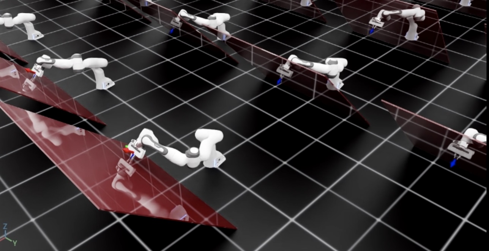

# 운영 공간 컨트롤러 사용

로봇의 엔드이펙터 자세를 차분 IK 컨트롤러로 제어하는 것만으로는 충분하지 않은 경우가 있습니다.
예를 들어, 작업 공간에서 매우 구체적인 자세 추적 오류 역학을 적용하거나, 관절 토크/힘 명령으로 로봇을 구동하거나,
다른 방향의 움직임을 제어하면서 특정 방향에서 접촉 힘을 적용하고 싶을 수 있습니다(예: 천으로 테이블 표면을 닦는 경우).
이런 작업에서는 운영 공간 컨트롤러(OSC)를 사용할 수 있습니다.

### 운영 공간 제어 참고 문헌:

1. O Khatib. 로봇 조작기의 운동 및 힘 제어를 위한 통합적 접근법:
   운영 공간 제식. IEEE 로봇 및 자동화 저널, 3(1):43–53, 1987. URL [http://dx.doi.org/10.1109/JRA.1987.1087068](http://dx.doi.org/10.1109/JRA.1987.1087068).
2. 마르코 훗터(ETH 취리히)의 로봇 동역학 강의 노트. URL [https://ethz.ch/content/dam/ethz/special-interest/mavt/robotics-n-intelligent-systems/rsl-dam/documents/RobotDynamics2017/RD_HS2017script.pdf](https://ethz.ch/content/dam/ethz/special-interest/mavt/robotics-n-intelligent-systems/rsl-dam/documents/RobotDynamics2017/RD_HS2017script.pdf)

이 튜토리얼에서는 OSC를 사용하여 로봇을 제어하는 방법을 배웁니다.
[`controllers.OperationalSpaceController`](../../api/lab/isaaclab.controllers.md#isaaclab.controllers.OperationalSpaceController) 클래스를 사용해 기울어진 벽 표면에 수직인 상수 힘을 가하면서 다른 모든 방향에서 원하는 엔드이펙터 자세를 추적합니다.

## 코드

이 튜토리얼은 `scripts/tutorials/05_controllers` 디렉터리의 `run_osc.py` 스크립트에 해당합니다.

### run_osc.py 코드

```python
# Copyright (c) 2022-2026, The Isaac Lab Project Developers (https://github.com/isaac-sim/IsaacLab/blob/main/CONTRIBUTORS.md).
# All rights reserved.
#
# SPDX-License-Identifier: BSD-3-Clause

"""
이 스크립트는 시뮬레이터에서 운영 공간 컨트롤러(OSC)를 사용하는 방법을 보여줍니다.

OSC 컨트롤러는 PhysX에 의해 계산된 동적 양, 즉 자코비언과 질량 행렬을 사용해 다양한 모드로 구성할 수 있습니다.

.. code-block:: bash

    # 사용법
    ./isaaclab.sh -p scripts/tutorials/05_controllers/run_osc.py

"""

"""먼저 Isaac Sim 시뮬레이터를 실행합니다."""

import argparse

from isaaclab.app import AppLauncher

# argparse 인수 추가
parser = argparse.ArgumentParser(description="운영 공간 컨트롤러 사용 튜토리얼.")
parser.add_argument("--num_envs", type=int, default=128, help="생성할 환경 수.")
# AppLauncher CLI 인수 추가
AppLauncher.add_app_launcher_args(parser)
# 인수 파싱
args_cli = parser.parse_args()

# 옴니버스 앱 실행
app_launcher = AppLauncher(args_cli)
simulation_app = app_launcher.app

"""그 외 모든 내용은 여기부터 시작됩니다."""

import torch

import isaaclab.sim as sim_utils
from isaaclab.assets import Articulation, AssetBaseCfg
from isaaclab.controllers import OperationalSpaceController, OperationalSpaceControllerCfg
from isaaclab.markers import VisualizationMarkers
from isaaclab.markers.config import FRAME_MARKER_CFG
from isaaclab.scene import InteractiveScene, InteractiveSceneCfg
from isaaclab.sensors import ContactSensorCfg
from isaaclab.utils import configclass
from isaaclab.utils.math import (
    combine_frame_transforms,
    matrix_from_quat,
    quat_apply_inverse,
    quat_inv,
    subtract_frame_transforms,
)

##
# 사전 정의된 구성
##
from isaaclab_assets import FRANKA_PANDA_HIGH_PD_CFG  # isort:skip


@configclass
class SceneCfg(InteractiveSceneCfg):
    """기울어진 벽이 있는 단순한 장면 구성."""

    # 지면 평면
    ground = AssetBaseCfg(
        prim_path="/World/defaultGroundPlane",
        spawn=sim_utils.GroundPlaneCfg(),
    )

    # 조명
    dome_light = AssetBaseCfg(
        prim_path="/World/Light", spawn=sim_utils.DomeLightCfg(intensity=3000.0, color=(0.75, 0.75, 0.75))
    )

    # 기울어진 벽
    tilted_wall = AssetBaseCfg(
        prim_path="{ENV_REGEX_NS}/TiltedWall",
        spawn=sim_utils.CuboidCfg(
            size=(2.0, 1.5, 0.01),
            collision_props=sim_utils.CollisionPropertiesCfg(),
            visual_material=sim_utils.PreviewSurfaceCfg(diffuse_color=(1.0, 0.0, 0.0), opacity=0.1),
            rigid_props=sim_utils.RigidBodyPropertiesCfg(kinematic_enabled=True),
            activate_contact_sensors=True,
        ),
        init_state=AssetBaseCfg.InitialStateCfg(
            pos=(0.6 + 0.085, 0.0, 0.3), rot=(0.9238795325, 0.0, -0.3826834324, 0.0)
        ),
    )

    contact_forces = ContactSensorCfg(
        prim_path="/World/envs/env_.*/TiltedWall",
        update_period=0.0,
        history_length=2,
        debug_vis=False,
    )

    robot = FRANKA_PANDA_HIGH_PD_CFG.replace(prim_path="{ENV_REGEX_NS}/Robot")
    robot.actuators["panda_shoulder"].stiffness = 0.0
    robot.actuators["panda_shoulder"].damping = 0.0
    robot.actuators["panda_forearm"].stiffness = 0.0
    robot.actuators["panda_forearm"].damping = 0.0
    robot.spawn.rigid_props.disable_gravity = True


def run_simulator(sim: sim_utils.SimulationContext, scene: InteractiveScene):
    """시뮬레이션 루프를 실행합니다.

    Args:
        sim: (SimulationContext) 시뮬레이션 컨텍스트.
        scene: (InteractiveScene) 대화형 장면.
    """

    # 가독성을 위해 장면 엔티티 추출
    robot = scene["robot"]
    contact_forces = scene["contact_forces"]

    # 엔드이펙터 및 팔 조절 관절 인덱스 얻기
    ee_frame_name = "panda_leftfinger"
    arm_joint_names = ["panda_joint.*"]
    ee_frame_idx = robot.find_bodies(ee_frame_name)[0][0]
    arm_joint_ids = robot.find_joints(arm_joint_names)[0]

    # OSC 생성
    osc_cfg = OperationalSpaceControllerCfg(
        target_types=["pose_abs", "wrench_abs"],
        impedance_mode="variable_kp",
        inertial_dynamics_decoupling=True,
        partial_inertial_dynamics_decoupling=False,
        gravity_compensation=False,
        motion_damping_ratio_task=1.0,
        contact_wrench_stiffness_task=[0.0, 0.0, 0.1, 0.0, 0.0, 0.0],
        motion_control_axes_task=[1, 1, 0, 1, 1, 1],
        contact_wrench_control_axes_task=[0, 0, 1, 0, 0, 0],
        nullspace_control="position",
    )
    osc = OperationalSpaceController(osc_cfg, num_envs=scene.num_envs, device=sim.device)

    # 마커
    frame_marker_cfg = FRAME_MARKER_CFG.copy()
    frame_marker_cfg.markers["frame"].scale = (0.1, 0.1, 0.1)
    ee_marker = VisualizationMarkers(frame_marker_cfg.replace(prim_path="/Visuals/ee_current"))
    goal_marker = VisualizationMarkers(frame_marker_cfg.replace(prim_path="/Visuals/ee_goal"))

    # 팔의 타겟 정의
    ee_goal_pose_set_tilted_b = torch.tensor(
        [
            [0.6, 0.15, 0.3, 0.0, 0.92387953, 0.0, 0.38268343],
            [0.6, -0.3, 0.3, 0.0, 0.92387953, 0.0, 0.38268343],
            [0.8, 0.0, 0.5, 0.0, 0.92387953, 0.0, 0.38268343],
        ],
        device=sim.device,
    )
    ee_goal_wrench_set_tilted_task = torch.tensor(
        [
            [0.0, 0.0, 10.0, 0.0, 0.0, 0.0],
            [0.0, 0.0, 10.0, 0.0, 0.0, 0.0],
            [0.0, 0.0, 10.0, 0.0, 0.0, 0.0],
        ],
        device=sim.device,
    )
    kp_set_task = torch.tensor(
        [
            [360.0, 360.0, 360.0, 360.0, 360.0, 360.0],
            [420.0, 420.0, 420.0, 420.0, 420.0, 420.0],
            [320.0, 320.0, 320.0, 320.0, 320.0, 320.0],
        ],
        device=sim.device,
    )
    ee_target_set = torch.cat([ee_goal_pose_set_tilted_b, ee_goal_wrench_set_tilted_task, kp_set_task], dim=-1)

    # 시뮬레이션 스텝 정의
    sim_dt = sim.get_physics_dt()

    # 기존 버퍼 업데이트
    # 참고: 컨트롤러를 위해 첫 번째 스텝 전에 버퍼를 업데이트해야 합니다.
    robot.update(dt=sim_dt)

    # 로봇 소프트 조인트 제한의 중심 얻기
    joint_centers = torch.mean(robot.data.soft_joint_pos_limits[:, arm_joint_ids, :], dim=-1)

    # 업데이트된 상태 얻기
    (
        jacobian_b,
        mass_matrix,
        gravity,
        ee_pose_b,
        ee_vel_b,
        root_pose_w,
        ee_pose_w,
        ee_force_b,
        joint_pos,
        joint_vel,
    ) = update_states(sim, scene, robot, ee_frame_idx, arm_joint_ids, contact_forces)

    # 주어진 타겟 명령 추적
    current_goal_idx = 0  # 팔에 대한 현재 타겟 인덱스
    command = torch.zeros(
        scene.num_envs, osc.action_dim, device=sim.device
    )  # 일반적인 타겟 명령(포즈, 위치, 힘 등)
    ee_target_pose_b = torch.zeros(scene.num_envs, 7, device=sim.device)  # 바디 프레임의 타겟 포즈
    ee_target_pose_w = torch.zeros(scene.num_envs, 7, device=sim.device)  # 월드 프레임의 타겟 포즈(마커용)

    # 조인트 노력 제로를 설정
    zero_joint_efforts = torch.zeros(scene.num_envs, robot.num_joints, device=sim.device)
    joint_efforts = torch.zeros(scene.num_envs, len(arm_joint_ids), device=sim.device)

    count = 0
    # 시뮬레이션 루프
    while simulation_app.is_running():
        # 500 스텝마다 리셋
        if count % 500 == 0:
            # 조인트 상태를 기본값으로 리셋
            default_joint_pos = robot.data.default_joint_pos.clone()
            default_joint_vel = robot.data.default_joint_vel.clone()
            robot.write_joint_state_to_sim(default_joint_pos, default_joint_vel)
            robot.set_joint_effort_target(zero_joint_efforts)  # 초기 단계에서 토크를 제로로 설정
            robot.write_data_to_sim()
            robot.reset()
            # 접촉 센서 리셋
            contact_forces.reset()
            # 타겟 포즈 리셋
            robot.update(sim_dt)
            _, _, _, ee_pose_b, _, _, _, _, _, _ = update_states(
                sim, scene, robot, ee_frame_idx, arm_joint_ids, contact_forces
            )  # 리셋 시에는 최신 상태로 자코비언이 업데이트되지 않음
            command, ee_target_pose_b, ee_target_pose_w, current_goal_idx = update_target(
                sim, scene, osc, root_pose_w, ee_target_set, current_goal_idx
            )
            # osc 명령 설정
            osc.reset()
            command, task_frame_pose_b = convert_to_task_frame(osc, command=command, ee_target_pose_b=ee_target_pose_b)
            osc.set_command(command=command, current_ee_pose_b=ee_pose_b, current_task_frame_pose_b=task_frame_pose_b)
        else:
            # 업데이트된 상태 얻기
            (
                jacobian_b,
                mass_matrix,
                gravity,
                ee_pose_b,
                ee_vel_b,
                root_pose_w,
                ee_pose_w,
                ee_force_b,
                joint_pos,
                joint_vel,
            ) = update_states(sim, scene, robot, ee_frame_idx, arm_joint_ids, contact_forces)
            # 조인트 명령 계산
            joint_efforts = osc.compute(
                jacobian_b=jacobian_b,
                current_ee_pose_b=ee_pose_b,
                current_ee_vel_b=ee_vel_b,
                current_ee_force_b=ee_force_b,
                mass_matrix=mass_matrix,
                gravity=gravity,
                current_joint_pos=joint_pos,
                current_joint_vel=joint_vel,
                nullspace_joint_pos_target=joint_centers,
            )
            # 액션 적용
            robot.set_joint_effort_target(joint_efforts, joint_ids=arm_joint_ids)
            robot.write_data_to_sim()

        # 마커 위치 업데이트
        ee_marker.visualize(ee_pose_w[:, 0:3], ee_pose_w[:, 3:7])
        goal_marker.visualize(ee_target_pose_w[:, 0:3], ee_target_pose_w[:, 3:7])

        # 스텝 수행
        sim.step(render=True)
        # 로봇 버퍼 업데이트
        robot.update(sim_dt)
        # 버퍼 업데이트
        scene.update(sim_dt)
        # 시뮬레이션 시간 업데이트
        count += 1


# 로봇 상태 업데이트
def update_states(
    sim: sim_utils.SimulationContext,
    scene: InteractiveScene,
    robot: Articulation,
    ee_frame_idx: int,
    arm_joint_ids: list[int],
    contact_forces,
):
    """로봇 상태를 업데이트합니다.

    Args:
        sim: (SimulationContext) 시뮬레이션 컨텍스트.
        scene: (InteractiveScene) 대화형 장면.
        robot: (Articulation) 로봇 관절 구조체.
        ee_frame_idx: (int) 엔드이펙터 프레임 인덱스.
        arm_joint_ids: (list[int]) 팔 조인트 인덱스.
        contact_forces: (ContactSensor) 접촉 센서.

    Returns:
        jacobian_b (torch.tensor): 바디 프레임의 자코비언.
        mass_matrix (torch.tensor): 질량 행렬.
        gravity (torch.tensor): 중력 벡터.
        ee_pose_b (torch.tensor): 바디 프레임의 엔드이펙터 포즈.
        ee_vel_b (torch.tensor): 바디 프레임의 엔드이펙터 속도.
        root_pose_w (torch.tensor): 월드 프레임의 루트 포즈.
        ee_pose_w (torch.tensor): 월드 프레임의 엔드이펙터 포즈.
        ee_force_b (torch.tensor): 바디 프레임의 엔드이펙터 힘.
        joint_pos (torch.tensor): 조인트 위치.
        joint_vel (torch.tensor): 조인트 속도.

    Raises:
        ValueError: 정의되지 않은 target_type.
    """
    # 시뮬레이션에서 동력 관련 양 추출
    ee_jacobi_idx = ee_frame_idx - 1
    jacobian_w = robot.root_physx_view.get_jacobians()[:, ee_jacobi_idx, :, arm_joint_ids]
    mass_matrix = robot.root_physx_view.get_generalized_mass_matrices()[:, arm_joint_ids, :][:, :, arm_joint_ids]
    gravity = robot.root_physx_view.get_gravity_compensation_forces()[:, arm_joint_ids]
    # 자코비언을 월드 프레임에서 루트 프레임으로 변환
    jacobian_b = jacobian_w.clone()
    root_rot_matrix = matrix_from_quat(quat_inv(robot.data.root_quat_w))
    jacobian_b[:, :3, :] = torch.bmm(root_rot_matrix, jacobian_b[:, :3, :])
    jacobian_b[:, 3:, :] = torch.bmm(root_rot_matrix, jacobian_b[:, 3:, :])

    # 엔드이펙터의 현재 포즈 계산
    root_pos_w = robot.data.root_pos_w
    root_quat_w = robot.data.root_quat_w
    ee_pos_w = robot.data.body_pos_w[:, ee_frame_idx]
    ee_quat_w = robot.data.body_quat_w[:, ee_frame_idx]
    ee_pos_b, ee_quat_b = subtract_frame_transforms(root_pos_w, root_quat_w, ee_pos_w, ee_quat_w)
    root_pose_w = torch.cat([root_pos_w, root_quat_w], dim=-1)
    ee_pose_w = torch.cat([ee_pos_w, ee_quat_w], dim=-1)
    ee_pose_b = torch.cat([ee_pos_b, ee_quat_b], dim=-1)

    # 엔드이펙터의 현재 속도 계산
    ee_vel_w = robot.data.body_vel_w[:, ee_frame_idx, :]  # 월드 프레임에서 엔드이펙터 속도 추출
    root_vel_w = robot.data.root_vel_w  # 월드 프레임에서 루트 속도 추출
    relative_vel_w = ee_vel_w - root_vel_w  # 월드 프레임에서의 상대 속도 계산
    ee_lin_vel_b = quat_apply_inverse(robot.data.root_quat_w, relative_vel_w[:, 0:3])  # 월드에서 루트 프레임으로 변환
    ee_ang_vel_b = quat_apply_inverse(robot.data.root_quat_w, relative_vel_w[:, 3:6])
    ee_vel_b = torch.cat([ee_lin_vel_b, ee_ang_vel_b], dim=-1)

    # 접촉 힘 계산
    ee_force_w = torch.zeros(scene.num_envs, 3, device=sim.device)
    sim_dt = sim.get_physics_dt()
    contact_forces.update(sim_dt)  # 접촉 센서 업데이트
    # 마지막 4개 시간 단계의 평균을 내어(즉, 부드럽게 하기 위해) 접촉 힘을 계산하고,
    # 관심 있는 접촉이 하나뿐이라고 가정하여 세 표면의 최대값을 취함
    ee_force_w, _ = torch.max(torch.mean(contact_forces.data.net_forces_w_history, dim=1), dim=1)

    # 테스트 용도로 간단히 처리한 것입니다.
    ee_force_b = ee_force_w

    # 조인트 위치 및 속도 가져오기
    joint_pos = robot.data.joint_pos[:, arm_joint_ids]
    joint_vel = robot.data.joint_vel[:, arm_joint_ids]

    return (
        jacobian_b,
        mass_matrix,
        gravity,
        ee_pose_b,
        ee_vel_b,
        root_pose_w,
        ee_pose_w,
        ee_force_b,
        joint_pos,
        joint_vel,
    )


# 타겟 명령 업데이트
def update_target(
    sim: sim_utils.SimulationContext,
    scene: InteractiveScene,
    osc: OperationalSpaceController,
    root_pose_w: torch.tensor,
    ee_target_set: torch.tensor,
    current_goal_idx: int,
):
    """운영 공간 컨트롤러의 타겟을 업데이트합니다.

    Args:
        sim: (SimulationContext) 시뮬레이션 컨텍스트.
        scene: (InteractiveScene) 대화형 장면.
        osc: (OperationalSpaceController) 운영 공간 컨트롤러.
        root_pose_w: (torch.tensor) 월드 프레임의 루트 포즈.
        ee_target_set: (torch.tensor) 엔드이펙터 타겟 세트.
        current_goal_idx: (int) 현재 타겟 인덱스.

    Returns:
        command (torch.tensor): 업데이트된 타겟 명령.
        ee_target_pose_b (torch.tensor): 바디 프레임의 업데이트된 타겟 포즈.
        ee_target_pose_w (torch.tensor): 월드 프레임의 업데이트된 타겟 포즈.
        next_goal_idx (int): 다음 타겟 인덱스.

    Raises:
        ValueError: 정의되지 않은 target_type.
    """

    # ee 원하는 명령 업데이트
    command = torch.zeros(scene.num_envs, osc.action_dim, device=sim.device)
    command[:] = ee_target_set[current_goal_idx]

    # ee 원하는 포즈 업데이트
    ee_target_pose_b = torch.zeros(scene.num_envs, 7, device=sim.device)
    for target_type in osc.cfg.target_types:
        if target_type == "pose_abs":
            ee_target_pose_b[:] = command[:, :7]
        elif target_type == "wrench_abs":
            pass  # 힘 제어의 경우 ee_target_pose_b는 루트 프레임에 머무를 수 있으며, 중요한 것은 ee_target_b
        else:
            raise ValueError("Undefined target_type within update_target().")

    # 마커용으로 월드 프레임의 타겟 원하는 포즈 업데이트
    ee_target_pos_w, ee_target_quat_w = combine_frame_transforms(
        root_pose_w[:, 0:3], root_pose_w[:, 3:7], ee_target_pose_b[:, 0:3], ee_target_pose_b[:, 3:7]
    )
    ee_target_pose_w = torch.cat([ee_target_pos_w, ee_target_quat_w], dim=-1)

    next_goal_idx = (current_goal_idx + 1) % len(ee_target_set)

    return command, ee_target_pose_b, ee_target_pose_w, next_goal_idx


# 타겟 명령을 작업 프레임으로 변환
def convert_to_task_frame(osc: OperationalSpaceController, command: torch.tensor, ee_target_pose_b: torch.tensor):
    """타겟 명령을 작업 프레임으로 변환합니다.

    Args:
        osc: OperationalSpaceController 객체.
        command: 변환할 명령.
        ee_target_pose_b: 바디 프레임의 타겟 포즈.

    Returns:
        command (torch.tensor): 작업 프레임의 타겟 명령.
        task_frame_pose_b (torch.tensor): 작업 프레임의 타겟 포즈.

    Raises:
        ValueError: 정의되지 않은 target_type.
    """
    command = command.clone()
    task_frame_pose_b = ee_target_pose_b.clone()

    cmd_idx = 0
    for target_type in osc.cfg.target_types:
        if target_type == "pose_abs":
            command[:, :3], command[:, 3:7] = subtract_frame_transforms(
                task_frame_pose_b[:, :3], task_frame_pose_b[:, 3:], command[:, :3], command[:, 3:7]
            )
            cmd_idx += 7
        elif target_type == "wrench_abs":
            # 이들은 이미 ee_goal_wrench_set_tilted_task에서 작업 프레임으로 정의됨(변환이 더 쉬움)
            cmd_idx += 6
        else:
            raise ValueError("Undefined target_type within _convert_to_task_frame().")

    return command, task_frame_pose_b


def main():
    """메인 함수."""
    # 키트 헬퍼 로드
    sim_cfg = sim_utils.SimulationCfg(dt=0.01, device=args_cli.device)
    sim = sim_utils.SimulationContext(sim_cfg)
    # 메인 카메라 설정
    sim.set_camera_view([2.5, 2.5, 2.5], [0.0, 0.0, 0.0])
    # 장면 설계
    scene_cfg = SceneCfg(num_envs=args_cli.num_envs, env_spacing=2.0)
    scene = InteractiveScene(scene_cfg)
    # 시뮬레이터 실행
    sim.reset()
    # 이제 준비 완료!
    print("[INFO]: Setup complete...")
    # 시뮬레이터 실행
    run_simulator(sim, scene)


if __name__ == "__main__":
    # 메인 함수 실행
    main()
    # 시뮬레이터 앱 종료
    simulation_app.close()
```

### 운영 공간 컨트롤러 생성하기

[`OperationalSpaceController`](../../api/lab/isaaclab.controllers.md#isaaclab.controllers.OperationalSpaceController) 클래스는 로봇이 작업 공간에서 동시에 움직임과 힘 제어를 수행하기 위한 관절 노력/토크를 계산합니다.

이 작업 공간의 참조 프레임은 유클리드 공간에서 임의의 좌표 프레임일 수 있습니다. 기본적으로,
로봇의 기본 프레임입니다. 그러나 특정 상황에서는 다른 프레임을 기준으로 목표 좌표를 정의하는 것이 더 쉬울 수 있습니다.
이러한 경우, 로봇의 기본 프레임을 기준으로 한 이 작업 참조 프레임의 자세는 `set_command` 메서드의 `current_task_frame_pose_b` 인수로 제공되어야 합니다.
예를 들어, 이 튜토리얼에서는 힘 제어 방향이 이 프레임의 z-축에서만 0이 아닌 경우처럼 벽 표면에 평행한 프레임을 기준으로 목표 명령을 정의하는 것이 타당합니다.
벽 표면과 동일한 방향을 가지는 목표 자세는 이런 후보가 되며, 이 튜토리얼에서 작업 프레임으로 사용됩니다.
따라서 [`OperationalSpaceControllerCfg`](../../api/lab/isaaclab.controllers.md#isaaclab.controllers.OperationalSpaceControllerCfg)의 모든 인수는 이 작업 참조 프레임을 고려하여 설정해야 합니다.

움직임 제어를 위해, 작업 공간 목표는 로봇 기본 프레임에 상대적인 절대적(`target_types: "pose_abs"`) 또는 엔드 이펙터의 현재 자세에 상대적인 상대적(`target_types: "pose_rel"`)으로 제공될 수 있습니다.
힘 제어를 위해, 작업 공간 목표는 로봇 기본 프레임에 상대적인 절대적(`target_types: "force_abs"`)으로 제공될 수 있습니다. 만약 동시에 자세와 힘 제어를 적용하고 싶다면, `target_types`는 `["pose_abs", "wrench_abs"]` 또는 `["pose_rel", "wrench_abs"]`와 같은 리스트여야 합니다.

움직임과 힘 제어가 적용될 축은 각각 `motion_control_axes_task`와 `force_control_axes_task` 인수를 사용하여 지정할 수 있습니다. 이러한 목록은 모든 6개 축(위치 및 회전)에 대해 0/1로 구성되어야 하며 서로 보완적이어야 합니다(예를 들어 x-축에서 `motion_control_axes_task`가 `0`이면, `force_control_axes_task`는 `1`이어야 합니다).

움직임 제어 축에 대해, 원하는 강성과 감쇠 비율 값은 `motion_control_stiffness`와 `motion_damping_ratio_task` 인수를 사용하여 지정할 수 있으며, 이는 스칼라(모든 축에 동일한 값) 또는 6개의 스칼라 목록(각 축에 해당하는 값 하나씩)으로 제공될 수 있습니다. 필요에 따라 강성과 감쇠 비율 값은 명령 매개변수(예: RL을 사용하여 값을 학습하거나 실시간으로 변경하는 경우)가 될 수 있습니다. 이를 위해 `impedance_mode`는 명령 내에 강성 값을 포함하도록 `"variable_kp"`로 설정하거나, 강성과 감쇠 비율 값을 모두 포함하도록 `"variable"`로 설정해야 합니다. 이러한 경우, `motion_stiffness_limits_task`와 `motion_damping_limits_task`도 설정되어야 하며, 이는 강성과 감쇠 비율 값에 상한을 둡니다.

접촉 힘 제어의 경우, `contact_wrench_stiffness_task`를 설정하지 않으면 오픈루프 힘 제어를 적용할 수 있으며, 원하는 강성 값을 `contact_wrench_stiffness_task` 인수를 사용하여 설정하면 피드-포워드 항을 포함한 클로즈드 루프 힘 제어를 적용할 수 있습니다. 현재, 접촉 센서로 회전 부분을 측정할 수 없으므로, 접촉 렌치의 선형 부분(즉, `contact_wrench_stiffness_task`의 처음 세 요소)만 클로즈드 루프 제어에 고려된다는 점을 유의하세요.

움직임 제어를 위해, 작업 공간에서의 원하는 가속도를 분리하기 위해 로봇의 관성 행렬을 사용하는 `inertial_dynamics_decoupling`을 `True`로 설정해야 합니다. 이는 특히 빠른 움직임에서 움직임 제어의 정확도를 위해 중요합니다. 이 관성 분리는 모든 6개 움직임 축 간의 결합을 고려합니다. 원한다면, 이동 및 회전 축 사이의 관성 결합을 무시하기 위해 `partial_inertial_dynamics_decoupling`을 `True`로 설정할 수 있습니다.

운영 공간 명령에 중력 보상을 포함시키고 싶다면, `gravity_compensation`을 `True`로 설정해야 합니다.

운영 공간 제어에 대한 마지막 고려 사항은 중복 로봇의 null-space를 어떻게 처리할 것인가 하는 것입니다. null-space는 작업 공간 좌표에 영향을 주지 않는 joint 공간의 부분공간입니다. null-space를 제어하지 않으면 로봇 관절이 엔드 이펙터를 움직이지 않고 떠다니게 됩니다. 이는 원하지 않을 수 있습니다(예: 로봇 관절이 한계에 가까워질 수 있음), 따라서 null-space 내에서 로봇 동작을 제어하고 싶을 수 있습니다. 이를 수행하는 한 가지 방법은 `nullspace_control`을 `"position"`(기본값은 `"none"`)로 설정하여 로봇 관절이 작업 공간에 영향을 주지 않으면서 원하는 대상으로引き寄せ하는 null-space PD 컨트롤러를 통합하는 것입니다. 이 null-space 컨트롤러의 동작은 `nullspace_stiffness`와 `nullspace_damping_ratio` 인수를 사용하여 정의할 수 있습니다. 이론적으로 null-space와 작업 공간 가속도의 분리가 가능한 경우는 `inertial_dynamics_decoupling`이 `True`로 설정되고 `partial_inertial_dynamics_decoupling`이 `False`로 설정될 때만 가능하다는 점을 유의하세요.

포함된 OSC 구현은 배치 형식으로 계산을 수행하고 PyTorch 연산을 사용합니다.

이 튜토리얼에서는 z-축을 제외한 모든 축의 움직임을 제어하기 위해 `"pose_abs"`를 사용하고, z-축의 힘을 제어하기 위해 `"wrench_abs"`를 사용할 것입니다. 또한, 움직임 제어에 전체 관성 분리를 포함하고 중력 보상은 포함하지 않을 것입니다(로봇 구성에서 중력이 비활성화되어 있기 때문입니다). 강성 값을 동적으로 변경하기 위해 임피던스 모드를 `"variable_kp"`로 설정할 것입니다(`motion_damping_ratio_task`은 `1.0`으로 설정되어 kp 값에 따라 kd 값이 적응하여 크리티컬리 감쇠된 응답을 유지함). 마지막으로, `nullspace_control`은 관절 위치 한계의 중심을 목표 관절 위치로 설정하여 `"position"`으로 설정할 것입니다.

```python
    # Create the OSC
    osc_cfg = OperationalSpaceControllerCfg(
        target_types=["pose_abs", "wrench_abs"],
        impedance_mode="variable_kp",
        inertial_dynamics_decoupling=True,
        partial_inertial_dynamics_decoupling=False,
        gravity_compensation=False,
        motion_damping_ratio_task=1.0,
        contact_wrench_stiffness_task=[0.0, 0.0, 0.1, 0.0, 0.0, 0.0],
        motion_control_axes_task=[1, 1, 0, 1, 1, 1],
        contact_wrench_control_axes_task=[0, 0, 1, 0, 0, 0],
        nullspace_control="position",
    )
    osc = OperationalSpaceController(osc_cfg, num_envs=scene.num_envs, device=sim.device)
```

### 로봇 상태 업데이트하기

OSC 구현은 계산 전용 클래스이므로, 사용자는 로봇에 대한 필요한 정보를 제공해야 합니다. 여기에는 루트 프레임에서의 로봇의 자코비안 행렬, 질량/관성 행렬, 엔드 이펙터 자세, 속도, 접촉 힘, 마지막으로 관절 위치와 속도가 포함됩니다. 또한, 필요한 경우 중력 보상 벡터와 null-space 관절 위치 목표도 제공해야 합니다.

```python
# Update robot states
def update_states(
    sim: sim_utils.SimulationContext,
    scene: InteractiveScene,
    robot: Articulation,
    ee_frame_idx: int,
    arm_joint_ids: list[int],
    contact_forces,
):
    """Update the robot states.

    Args:
        sim: (SimulationContext) Simulation context.
        scene: (InteractiveScene) Interactive scene.
        robot: (Articulation) Robot articulation.
        ee_frame_idx: (int) End-effector frame index.
        arm_joint_ids: (list[int]) Arm joint indices.
        contact_forces: (ContactSensor) Contact sensor.

    Returns:
        jacobian_b (torch.tensor): Jacobian in the body frame.
        mass_matrix (torch.tensor): Mass matrix.
        gravity (torch.tensor): Gravity vector.
        ee_pose_b (torch.tensor): End-effector pose in the body frame.
        ee_vel_b (torch.tensor): End-effector velocity in the body frame.
        root_pose_w (torch.tensor): Root pose in the world frame.
        ee_pose_w (torch.tensor): End-effector pose in the world frame.
        ee_force_b (torch.tensor): End-effector force in the body frame.
        joint_pos (torch.tensor): The joint positions.
        joint_vel (torch.tensor): The joint velocities.

    Raises:
        ValueError: Undefined target_type.
    """
    # obtain dynamics related quantities from simulation
    ee_jacobi_idx = ee_frame_idx - 1
    jacobian_w = robot.root_physx_view.get_jacobians()[:, ee_jacobi_idx, :, arm_joint_ids]
    mass_matrix = robot.root_physx_view.get_generalized_mass_matrices()[:, arm_joint_ids, :][:, :, arm_joint_ids]
    gravity = robot.root_physx_view.get_gravity_compensation_forces()[:, arm_joint_ids]
    # Convert the Jacobian from world to root frame
    jacobian_b = jacobian_w.clone()
    root_rot_matrix = matrix_from_quat(quat_inv(robot.data.root_quat_w))
    jacobian_b[:, :3, :] = torch.bmm(root_rot_matrix, jacobian_b[:, :3, :])
    jacobian_b[:, 3:, :] = torch.bmm(root_rot_matrix, jacobian_b[:, 3:, :])

    # Compute current pose of the end-effector
    root_pos_w = robot.data.root_pos_w
    root_quat_w = robot.data.root_quat_w
    ee_pos_w = robot.data.body_pos_w[:, ee_frame_idx]
    ee_quat_w = robot.data.body_quat_w[:, ee_frame_idx]
    ee_pos_b, ee_quat_b = subtract_frame_transforms(root_pos_w, root_quat_w, ee_pos_w, ee_quat_w)
    root_pose_w = torch.cat([root_pos_w, root_quat_w], dim=-1)
    ee_pose_w = torch.cat([ee_pos_w, ee_quat_w], dim=-1)
    ee_pose_b = torch.cat([ee_pos_b, ee_quat_b], dim=-1)

    # Compute the current velocity of the end-effector
    ee_vel_w = robot.data.body_vel_w[:, ee_frame_idx, :]  # Extract end-effector velocity in the world frame
    root_vel_w = robot.data.root_vel_w  # Extract root velocity in the world frame
    relative_vel_w = ee_vel_w - root_vel_w  # Compute the relative velocity in the world frame
    ee_lin_vel_b = quat_apply_inverse(robot.data.root_quat_w, relative_vel_w[:, 0:3])  # From world to root frame
    ee_ang_vel_b = quat_apply_inverse(robot.data.root_quat_w, relative_vel_w[:, 3:6])
    ee_vel_b = torch.cat([ee_lin_vel_b, ee_ang_vel_b], dim=-1)

    # Calculate the contact force
    ee_force_w = torch.zeros(scene.num_envs, 3, device=sim.device)
    sim_dt = sim.get_physics_dt()
    contact_forces.update(sim_dt)  # update contact sensor
    # Calculate the contact force by averaging over last four time steps (i.e., to smoothen) and
    # taking the max of three surfaces as only one should be the contact of interest
    ee_force_w, _ = torch.max(torch.mean(contact_forces.data.net_forces_w_history, dim=1), dim=1)

    # This is a simplification, only for the sake of testing.
    ee_force_b = ee_force_w

    # Get joint positions and velocities
    joint_pos = robot.data.joint_pos[:, arm_joint_ids]
    joint_vel = robot.data.joint_vel[:, arm_joint_ids]

    return (
        jacobian_b,
        mass_matrix,
        gravity,
        ee_pose_b,
        ee_vel_b,
        root_pose_w,
        ee_pose_w,
        ee_force_b,
        joint_pos,
        joint_vel,
    )
```

### 로봇 명령 계산

OSC는 원하는 명령을 설정하는 작업과 원하는 관절 위치를 계산하는 작업을 분리합니다.
원하는 명령을 설정하려면 사용자는 명령 벡터를 제공해야 하며, 여기에는 목표 명령(즉, OSC 구성의 `target_types` 인수에 표시된 순서대로 포함)과, impedance_mode가 `"variable_kp"` 또는 `"variable"`로 설정된 경우 원하는 강성과 감쇠 비율 값이 포함되어야 합니다.
이들은 모두 작업 프레임과 동일한 좌표계에 있어야 합니다(예: `_task` 하위 스크립트로 표시됨)하고 함께 연결되어야 합니다.

이 튜토리얼에서는 원하는 렌치가 이미 작업 프레임에 대해 정의되어 있고, 원하는 포즈는 다음과 같이 작업 프레임으로 변환됩니다.

```python
# 대상 명령을 작업 프레임으로 변환
def convert_to_task_frame(osc: OperationalSpaceController, command: torch.tensor, ee_target_pose_b: torch.tensor):
    """대상 명령을 작업 프레임으로 변환합니다.

    Args:
        osc: OperationalSpaceController 객체.
        command: 변환할 명령.
        ee_target_pose_b: 본체 프레임에서의 대상 포즈.

    Returns:
        command (torch.tensor): 작업 프레임에서의 대상 명령.
        task_frame_pose_b (torch.tensor): 작업 프레임에서의 대상 포즈.

    Raises:
        ValueError: 정의되지 않은 target_type.
    """
    command = command.clone()
    task_frame_pose_b = ee_target_pose_b.clone()

    cmd_idx = 0
    for target_type in osc.cfg.target_types:
        if target_type == "pose_abs":
            command[:, :3], command[:, 3:7] = subtract_frame_transforms(
                task_frame_pose_b[:, :3], task_frame_pose_b[:, 3:], command[:, :3], command[:, 3:7]
            )
            cmd_idx += 7
        elif target_type == "wrench_abs":
            # 이들은 ee_goal_wrench_set_tilted_task에서 이미 대상 프레임에 정의되어 있으므로(더 쉬우므로) 변환하지 않습니다
            cmd_idx += 6
        else:
            raise ValueError("_convert_to_task_frame() 내에 정의되지 않은 target_type입니다.")

    return command, task_frame_pose_b
```

OSC 명령은 작업 프레임에서의 명령 벡터, 베이스 프레임에서의 엔드 이펙터 포즈, 그리고 베이스 프레임에서의 작업(참조) 프레임 포즈를 다음과 같이 설정하여 정의됩니다. 이 정보가 필요한 이유는 내부 계산이 베이스 프레임에서 수행되기 때문입니다.

```python
            # osc 명령 설정
            osc.reset()
            command, task_frame_pose_b = convert_to_task_frame(osc, command=command, ee_target_pose_b=ee_target_pose_b)
            osc.set_command(command=command, current_ee_pose_b=ee_pose_b, current_task_frame_pose_b=task_frame_pose_b)
```

제공된 로봇 상태와 원하는 명령을 사용하여 관절 힘/토크 값은 다음과 같이 계산됩니다:

```python
            # 관절 명령 계산
            joint_efforts = osc.compute(
                jacobian_b=jacobian_b,
                current_ee_pose_b=ee_pose_b,
                current_ee_vel_b=ee_vel_b,
                current_ee_force_b=ee_force_b,
                mass_matrix=mass_matrix,
                gravity=gravity,
                current_joint_pos=joint_pos,
                current_joint_vel=joint_vel,
                nullspace_joint_pos_target=joint_centers,
            )
```

계산된 관절 힘/토크 대상은 로봇에 적용할 수 있습니다.

```python
            # 동작 적용
            robot.set_joint_effort_target(joint_efforts, joint_ids=arm_joint_ids)
            robot.write_data_to_sim()
```

## 코드 실행

이제 스크립트를 실행하여 결과를 확인할 수 있습니다:

```bash
./isaaclab.sh -p scripts/tutorials/05_controllers/run_osc.py --num_envs 128
```

스크립트는 128대의 로봇을 포함한 시뮬레이션을 시작합니다. 로봇은 OSC를 사용하여 제어됩니다.
현재 및 원하는 엔드 이펙터 포즈는 프레임 마커를 사용하여 빨간 기울어진 벽과 함께 표시되어야 합니다.
로봇이 벽 표면에 수직으로 일정한 힘을 가하면서 원하는 포즈에 도달하는 모습을 볼 수 있습니다.



시뮬레이션을 중지하려면 창을 닫거나 터미널에서 `Ctrl+C`를 누를 수 있습니다.
